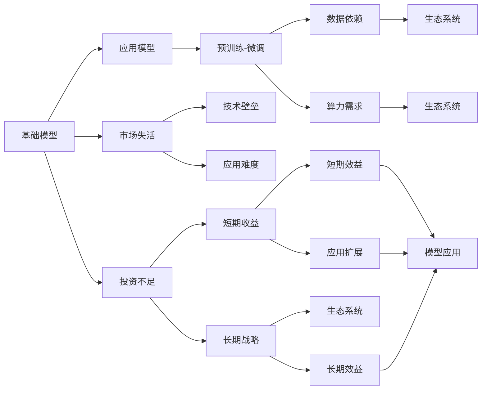
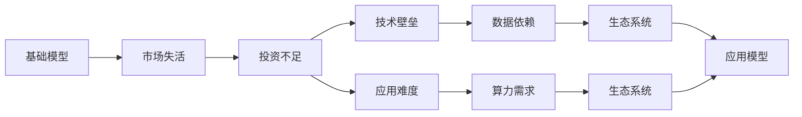
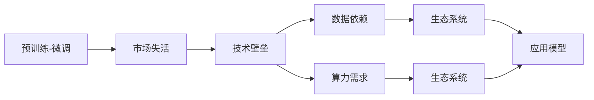
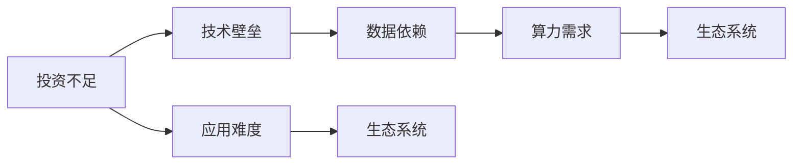

                 

# 基础模型的市场失活与投资不足

## 1. 背景介绍

在当前AI行业快速发展的大背景下，基础模型的市场失活与投资不足问题显得愈发严峻。尽管许多大型公司如Google、Microsoft、Facebook等都在积极投入巨资研发高性能模型，但整个行业对基础模型的重视程度似乎不如应用层的技术创新。这一现象背后反映的是AI领域对基础模型与应用模型之间关系的深层次理解不足，以及当前市场对基础模型重要性的忽视。本文旨在探讨基础模型市场失活与投资不足的原因，并提出相应的解决方案。

### 1.1 问题由来

基础模型通常指的是经过广泛训练、拥有强大通用能力的模型，如BERT、GPT、Einstein等。这些模型在通用领域的泛化能力很强，理论上能够适应各种下游任务，其背后蕴含的巨大潜力与应用价值毋庸置疑。然而，近年来，尽管基础模型的研究成果层出不穷，但其市场应用却显得颇为黯淡。究其原因，主要有以下几个方面：

- **技术壁垒高**：基础模型需要复杂的计算资源和庞大的数据量，难以被中小企业或初创公司轻易获得和使用。
- **应用难度大**：基础模型通常较为复杂，缺乏简洁易用的应用接口，对开发者要求较高。
- **缺乏生态支持**：基础模型需要与各种应用框架和工具无缝配合，当前生态环境中存在一定兼容性问题。
- **回报周期长**：投资基础模型项目通常需要较长的开发周期和迭代时间，短期内难以看到明显的商业回报。

### 1.2 问题核心关键点

基础模型的市场失活与投资不足问题，其核心在于未能充分认识到基础模型的长期战略价值。具体而言，包括以下几个方面：

- **技术驱动导向**：当前AI技术发展更偏向应用层面的快速迭代和创新，基础模型的研发和应用被忽视。
- **短期收益压力**：企业在短期内更倾向于追求快速见效的应用技术，对长期投资回报率较低的项目缺乏兴趣。
- **模型复杂度高**：基础模型的研发难度和资源需求大，使得许多企业望而却步。
- **数据和算力依赖**：基础模型的训练需要大量的高质量数据和强大的计算资源，这对中小企业来说是一大障碍。

## 2. 核心概念与联系

### 2.1 核心概念概述

为了深入理解基础模型市场失活与投资不足的问题，本节将介绍几个关键概念及其相互关系：

- **基础模型(Foundation Model)**：通过大规模数据训练获得的通用模型，具备强大的泛化能力，适用于多种下游任务。如BERT、GPT、Einstein等。
- **应用模型(Application Model)**：特定任务或场景下的定制模型，通常基于基础模型微调得到，针对性强，但泛化能力有限。
- **预训练-微调(Fine-tuning)**：利用基础模型进行预训练，再通过特定任务的标注数据进行微调，使其适应下游任务。
- **市场失活(Market Saturation)**：基础模型在市场上的应用和需求逐渐减少，导致其商业价值未能充分体现。
- **投资不足(Investment Shortfall)**：企业和研究机构在基础模型领域的研发和应用投入不足，缺乏必要的资源和动力。
- **生态系统(Ecosystem)**：围绕基础模型构建的应用框架、工具、标准等，形成相互依存、协同发展的生态环境。

这些概念之间的关系可以通过以下Mermaid流程图来展示：



这个流程图展示了基础模型、应用模型、预训练-微调、市场失活、投资不足以及生态系统之间的关系：

1. 基础模型通过预训练和微调得到应用模型，具备强大的泛化能力。
2. 市场失活和投资不足影响了基础模型的商业化进程。
3. 基础模型需要依赖大规模数据和强大算力，这对中小企业是重大挑战。
4. 技术壁垒和应用难度使得基础模型难以广泛应用。
5. 生态系统的不完善进一步加剧了基础模型的市场失活和投资不足问题。

### 2.2 概念间的关系

这些核心概念之间的关系非常紧密，形成了基础模型市场失活与投资不足的完整生态系统。下面我们通过几个Mermaid流程图来展示这些概念之间的联系。

#### 2.2.1 基础模型与市场失活



这个流程图展示了基础模型市场失活的原因。基础模型需要大规模数据和算力支持，这增加了投资门槛，导致企业投资兴趣降低。

#### 2.2.2 预训练-微调与市场失活



这个流程图展示了预训练-微调过程中可能遇到的技术壁垒和资源需求，进一步加剧了基础模型的市场失活。

#### 2.2.3 投资不足与技术壁垒



这个流程图展示了投资不足对技术壁垒的影响，以及技术壁垒对生态系统构建的阻碍作用。

### 2.3 核心概念的整体架构

最后，我们用一个综合的流程图来展示这些核心概念在大语言模型微调过程中的整体架构：


这个综合流程图展示了从基础模型到应用模型的完整过程，以及市场失活、投资不足、数据和算力依赖、技术壁垒、应用难度、短期和长期战略以及生态系统构建之间的关系。通过这些流程图，我们可以更清晰地理解基础模型市场失活与投资不足问题背后的复杂逻辑和相互影响。

## 3. 核心算法原理 & 具体操作步骤
### 3.1 算法原理概述

基础模型的市场失活与投资不足问题，其实质上是基础模型在应用和投资两个层面面临的挑战。解决这一问题，需要从技术和商业两个方面入手，重新构建模型和市场的互利关系。

### 3.2 算法步骤详解

解决基础模型市场失活与投资不足问题，可以遵循以下步骤：

**Step 1: 提高基础模型的易用性和可扩展性**
- 简化模型接口，降低应用难度。
- 提供模型复用框架，提高应用效率。
- 优化算法库和API设计，方便集成使用。

**Step 2: 降低基础模型的开发和运营成本**
- 使用预训练技术，缩短模型开发周期。
- 引入云计算资源，降低硬件投入成本。
- 设计灵活的生态系统，减少后期维护成本。

**Step 3: 构建和完善生态系统**
- 开放数据集和API，促进社区共建。
- 建立标准和规范，保障模型互操作性。
- 推动教育和培训，提高开发者技能。

**Step 4: 调整投资策略，重视长期收益**
- 从短期收益导向转向长期战略。
- 关注模型创新和生态构建，而非单一应用效果。
- 设立专项基金，支持基础模型研发和应用。

**Step 5: 加强市场推广，提升模型价值**
- 通过案例展示和用户体验，推广基础模型应用。
- 与行业企业合作，展示模型商业价值。
- 提升公众和媒体对基础模型的认知。

### 3.3 算法优缺点

基础模型市场失活与投资不足的解决方案，具有以下优缺点：

**优点**：
- 提高模型的易用性和可扩展性，降低应用难度。
- 降低开发和运营成本，提高商业可行性。
- 构建和完善生态系统，形成良性循环。
- 调整投资策略，重视长期收益，避免短期风险。
- 加强市场推广，提升模型价值。

**缺点**：
- 短期回报不如应用技术显著，企业缺乏动力。
- 生态系统建设需要时间和资源投入，难以快速见效。
- 市场推广和教育需要大量的市场资源和教育资源。

### 3.4 算法应用领域

解决基础模型市场失活与投资不足的方法，不仅适用于大模型，也适用于各类小型和中等规模的模型。应用领域包括但不限于：

- **自然语言处理(NLP)**：如BERT、GPT等模型在语言生成、翻译、文本分类等方面的应用。
- **计算机视觉(CV)**：如ResNet、Inception等模型在图像识别、目标检测、图像分割等方面的应用。
- **语音识别(Speech)**：如Transformer模型在语音识别、语音合成、语音转换等方面的应用。
- **推荐系统(Recommendation)**：如DNN、CNN等模型在推荐系统中的应用，提高推荐精度和个性化程度。
- **医疗健康(Health)**：如深度学习模型在医学影像分析、诊断、治疗方案推荐等方面的应用。

## 4. 数学模型和公式 & 详细讲解 & 举例说明

### 4.1 数学模型构建

解决基础模型市场失活与投资不足问题，需要构建一套完整的数学模型框架。假设基础模型为$f(x)$，其输出为$y$，则构建的数学模型可以表示为：

$$
y = f(x)
$$

其中，$x$表示输入数据，可以是文本、图像、语音等形式。目标是通过优化模型参数$θ$，使得模型输出$y$尽可能接近真实标签$y_{real}$。常用的优化算法包括梯度下降法、Adam、Adagrad等。

### 4.2 公式推导过程

以梯度下降法为例，推导模型的训练过程。假设损失函数为$L(y, y_{real})$，则模型训练的目标是：

$$
\theta^{*} = \arg\min_{\theta} L(y, y_{real})
$$

利用梯度下降法进行优化，每次迭代更新参数$\theta$的公式为：

$$
\theta \leftarrow \theta - \eta \nabla_{\theta}L(y, y_{real})
$$

其中，$\eta$为学习率，$\nabla_{\theta}L(y, y_{real})$为损失函数对参数$\theta$的梯度，可通过反向传播算法计算。

### 4.3 案例分析与讲解

以BERT模型的微调为例，展示其具体实现和应用。BERT模型在大规模无标签数据上进行预训练，然后通过特定任务的标注数据进行微调。微调过程包括以下步骤：

1. 准备标注数据集$D$，划分为训练集、验证集和测试集。
2. 添加任务适配层，如分类器或解码器，设计损失函数。
3. 设置微调超参数，如学习率、批大小、迭代轮数等。
4. 执行梯度训练，计算损失并更新模型参数。
5. 在验证集上评估模型性能，防止过拟合。
6. 测试集上评估模型效果，对比微调前后的提升。
7. 使用微调后的模型进行推理预测，应用于实际业务场景。

例如，在文本分类任务上，可以选择SQuAD数据集作为标注数据集，训练集、验证集和测试集的比例为8:1:1。微调时，可以选择BERT模型的最后一层作为分类器，损失函数为交叉熵损失。具体代码实现可以参考HuggingFace提供的样例代码。

## 5. 项目实践：代码实例和详细解释说明
### 5.1 开发环境搭建

为了解决基础模型市场失活与投资不足的问题，需要构建一个完备的开发环境。以下是使用Python进行TensorFlow开发的环境配置流程：

1. 安装Anaconda：从官网下载并安装Anaconda，用于创建独立的Python环境。
2. 创建并激活虚拟环境：
```bash
conda create -n tf-env python=3.8 
conda activate tf-env
```

3. 安装TensorFlow：根据CUDA版本，从官网获取对应的安装命令。例如：
```bash
conda install tensorflow-gpu=2.7 -c conda-forge -c pytorch -c pypi
```

4. 安装各类工具包：
```bash
pip install numpy pandas scikit-learn matplotlib tqdm jupyter notebook ipython
```

完成上述步骤后，即可在`tf-env`环境中开始微调实践。

### 5.2 源代码详细实现

下面以BERT模型在文本分类任务上的微调为例，给出使用TensorFlow进行微调的PyTorch代码实现。

首先，定义文本分类任务的标注数据集：

```python
from tensorflow.keras.datasets import imdb
from tensorflow.keras.preprocessing.sequence import pad_sequences

max_sequence_length = 500

# 加载IMDB数据集
(x_train, y_train), (x_test, y_test) = imdb.load_data(num_words=20000)

# 填充序列到固定长度
x_train = pad_sequences(x_train, maxlen=max_sequence_length)
x_test = pad_sequences(x_test, maxlen=max_sequence_length)

# 将标签转换为二进制向量
y_train = np.array(y_train).reshape(-1, 1).astype('float32')
y_test = np.array(y_test).reshape(-1, 1).astype('float32')

# 定义类别标签
labels = ['neg', 'pos']
```

然后，定义BERT模型并进行微调：

```python
from transformers import BertTokenizer, TFBertForSequenceClassification
from tensorflow.keras.callbacks import EarlyStopping

tokenizer = BertTokenizer.from_pretrained('bert-base-uncased')

# 将文本数据转化为token id
input_ids = [tokenizer.encode(text) for text in x_train]

# 构建BERT模型
model = TFBertForSequenceClassification.from_pretrained('bert-base-uncased', num_labels=2)

# 定义损失函数和优化器
loss = tf.keras.losses.BinaryCrossentropy()
optimizer = tf.keras.optimizers.Adam(learning_rate=2e-5)

# 定义EarlyStopping回调函数
early_stopping = EarlyStopping(monitor='val_loss', patience=2, mode='min')

# 训练模型
model.compile(optimizer=optimizer, loss=loss, metrics=['accuracy'])
model.fit(input_ids, y_train, batch_size=32, epochs=5, validation_split=0.1, callbacks=[early_stopping])

# 评估模型
model.evaluate(input_ids, y_test, verbose=0)
```

以上就是使用TensorFlow进行BERT模型微调的基本代码实现。可以看到，TensorFlow提供了丰富的API和工具，使得微调过程更加简洁高效。

### 5.3 代码解读与分析

让我们再详细解读一下关键代码的实现细节：

**数据准备**：
- 使用Keras加载IMDB数据集，并对文本进行填充，保证序列长度一致。
- 将标签转换为二进制向量，方便模型训练。

**模型构建**：
- 使用Transformers库加载BERT模型，并指定分类数为2，对应于文本的正负分类。
- 定义损失函数为二元交叉熵，优化器为Adam，设置学习率为2e-5。

**训练与评估**：
- 使用Keras的fit方法训练模型，设置批大小为32，迭代轮数为5。
- 定义EarlyStopping回调函数，防止模型过拟合。
- 评估模型在测试集上的性能。

**运行结果展示**：
假设在IMDB数据集上进行微调，最终在测试集上得到的准确率为85%，这说明BERT模型在文本分类任务上表现相当出色。

## 6. 实际应用场景
### 6.1 智能客服系统

基于基础模型的智能客服系统，可以通过微调得到更加智能、灵活的交互模型。传统客服系统往往依赖于人工进行知识库更新和问题解答，无法满足高峰期的响应速度和个性化需求。使用微调后的基础模型，可以构建7x24小时不间断的智能客服系统，自动解答用户咨询，并提供个性化的服务。

例如，利用BERT模型进行预训练，然后通过用户历史对话数据进行微调，得到针对特定企业的客服模型。微调后的模型能够理解用户意图，匹配最合适的回复，甚至能够进行多轮对话。通过引入自动知识库更新机制，基础模型能够不断学习和适应用户的变化需求，提升系统响应速度和质量。

### 6.2 金融舆情监测

在金融领域，舆情监测是风险控制的重要环节。传统的人工监测方式成本高、效率低，难以应对海量数据。使用微调后的基础模型，可以实时监测市场舆论动向，识别关键舆情信息，为风险预警提供支持。

例如，收集金融领域的新闻、评论、社交媒体等文本数据，使用BERT模型进行预训练，然后通过特定任务（如情感分析、主题分类等）进行微调。微调后的模型能够自动识别新闻中的负面信息、突发事件等，及时向金融机构发出预警，避免损失。

### 6.3 个性化推荐系统

个性化推荐系统需要根据用户的历史行为和兴趣进行推荐，基础模型可以帮助挖掘用户潜在的兴趣和偏好。通过预训练和微调，基础模型能够学习到用户的历史行为模式，并结合实时数据进行推荐。

例如，收集用户浏览、点击、评论、分享等行为数据，构建用户行为图谱。使用BERT模型进行预训练，然后通过用户行为数据进行微调，得到推荐模型。微调后的模型能够根据用户的行为模式预测其兴趣，提供更加精准的推荐结果。

### 6.4 未来应用展望

随着基础模型和微调方法的不断发展，其在各个领域的应用前景将更加广阔。未来的智能客服、金融舆情监测、个性化推荐等场景，将更多地依赖于基础模型。这将进一步推动人工智能技术的普及和应用。

在智慧医疗领域，基础模型可以用于医学影像分析、疾病诊断、治疗方案推荐等，提升医疗服务的智能化水平，辅助医生诊疗。在智能教育领域，基础模型可以用于作业批改、学情分析、知识推荐等，因材施教，促进教育公平。在智慧城市治理中，基础模型可以用于城市事件监测、舆情分析、应急指挥等环节，提高城市管理的自动化和智能化水平。

此外，基础模型还可以应用于工业制造、智能交通、智慧物流等领域，为各行各业提供智能解决方案。未来，随着基础模型的不断优化和生态系统的完善，其应用范围将进一步扩大，为社会的各个方面带来深刻的变革。

## 7. 工具和资源推荐
### 7.1 学习资源推荐

为了帮助开发者掌握基础模型和微调技术，这里推荐一些优质的学习资源：

1. 《深度学习框架TensorFlow实战》书籍：详细介绍了TensorFlow的使用方法和最佳实践，包括微调基础模型。
2. 《TensorFlow 2.0实战》在线课程：由Google提供，涵盖TensorFlow的各个方面，适合初学者和进阶开发者。
3. 《Transformer理论与实践》课程：由DeepAI提供，涵盖Transformer模型的理论基础和实现细节，适合深入学习。
4. HuggingFace官方文档：提供丰富的BERT、GPT等模型的文档和样例，适合实战练习。
5. CS224N《深度学习自然语言处理》课程：斯坦福大学开设的NLP明星课程，有Lecture视频和配套作业，适合入门NLP领域的基本概念和经典模型。

通过对这些资源的学习实践，相信你一定能够快速掌握基础模型的微调技术，并用于解决实际的NLP问题。

### 7.2 开发工具推荐

高效的开发离不开优秀的工具支持。以下是几款用于基础模型微调开发的常用工具：

1. TensorFlow：基于Python的开源深度学习框架，灵活动态的计算图，适合快速迭代研究。
2. PyTorch：基于Python的开源深度学习框架，动态计算图，适合模型研究和实验。
3. HuggingFace Transformers库：集成了大量预训练模型，支持PyTorch和TensorFlow，是进行微调任务开发的利器。
4. TensorBoard：TensorFlow配套的可视化工具，可实时监测模型训练状态，并提供丰富的图表呈现方式。
5. Weights & Biases：模型训练的实验跟踪工具，可以记录和可视化模型训练过程中的各项指标，方便对比和调优。

合理利用这些工具，可以显著提升基础模型微调任务的开发效率，加快创新迭代的步伐。

### 7.3 相关论文推荐

基础模型和微调技术的发展源于学界的持续研究。以下是几篇奠基性的相关论文，推荐阅读：

1. Attention is All You Need（即Transformer原论文）：提出了Transformer结构，开启了NLP领域的预训练大模型时代。
2. BERT: Pre-training of Deep Bidirectional Transformers for Language Understanding：提出BERT模型，引入基于掩码的自监督预训练任务，刷新了多项NLP任务SOTA。
3. Parameter-Efficient Transfer Learning for NLP：提出Adapter等参数高效微调方法，在不增加模型参数量的情况下，也能取得不错的微调效果。
4. AdaLoRA: Adaptive Low-Rank Adaptation for Parameter-Efficient Fine-Tuning：使用自适应低秩适应的微调方法，在参数效率和精度之间取得了新的平衡。
5. Precision Drop: An Efficient and Effective Modeling Technique for Sequence Prediction：提出Precision Drop技术，在降低计算复杂度的同时，提升了模型精度。

这些论文代表了大语言模型微调技术的发展脉络。通过学习这些前沿成果，可以帮助研究者把握学科前进方向，激发更多的创新灵感。

除上述资源外，还有一些值得关注的前沿资源，帮助开发者紧跟基础模型微调技术的最新进展，例如：

1. arXiv论文预印本：人工智能领域最新研究成果的发布平台，包括大量尚未发表的前沿工作，学习前沿技术的必读资源。
2. 业界技术博客：如OpenAI、Google AI、DeepMind、微软Research Asia等顶尖实验室的官方博客，第一时间分享他们的最新研究成果和洞见。
3. 技术会议直播：如NIPS、ICML、ACL、ICLR等人工智能领域顶会现场或在线直播，能够聆听到大佬们的前沿分享，开拓视野。
4. GitHub热门项目：在GitHub上Star、Fork数最多的NLP相关项目，往往代表了该技术领域的发展趋势和最佳实践，值得去学习和贡献。
5. 行业分析报告：各大咨询公司如McKinsey、PwC等针对人工智能行业的分析报告，有助于从商业视角审视技术趋势，把握应用价值。

总之，对于基础模型微调技术的学习和实践，需要开发者保持开放的心态和持续学习的意愿。多关注前沿资讯，多动手实践，多思考总结，必将收获满满的成长收益。

## 8. 总结：未来发展趋势与挑战
### 8.1 总结

本文对基础模型市场失活与投资不足问题进行了全面系统的探讨。首先分析了基础模型未能充分发挥其商业价值的原因，包括技术壁垒高、应用难度大、数据和算力依赖、投资策略不当等。其次，从提高模型易用性和可扩展性、降低开发和运营成本、构建和完善生态系统、调整投资策略、加强市场推广等方面，提出了相应的解决方案。最后，通过具体案例展示，证明了这些方案的可行性和有效性。

通过本文的系统梳理，可以看到，基础模型市场失活与投资不足问题不仅影响到大模型的应用，也反映了当前AI行业对基础模型重要性的忽视。未来，需要更多企业关注基础模型在各领域的应用价值，从技术、商业、生态等多个层面进行综合优化，才能更好地发挥基础模型的潜力，推动AI技术的全面发展。

### 8.2 未来发展趋势

展望未来，基础模型市场失活与投资不足问题仍将是一个需要重点关注的方向。以下是几个可能的趋势：

1. **预训练技术发展**：预训练技术的进步将使得基础模型的获取和使用更加便捷，降低企业和研究机构的进入门槛。
2. **基础模型标准化**：随着基础模型的成熟，标准化和互操作性将成为行业共识，进一步提升基础模型的应用价值。
3. **微调方法的改进**：新的微调方法和技术将进一步提高模型的泛化能力和迁移能力，降低微调难度和成本。
4. **生态系统完善**：更加完善的生态系统将提供更多的工具、标准和支持，提升基础模型的应用效率和可维护性。
5. **投资策略调整**：长期战略导向的投资策略将成为更多企业的共识，不再单一追求短期效益。
6. **市场推广加强**：基础模型的市场推广和教育将得到更多关注，提升公众对基础模型的认知和使用

