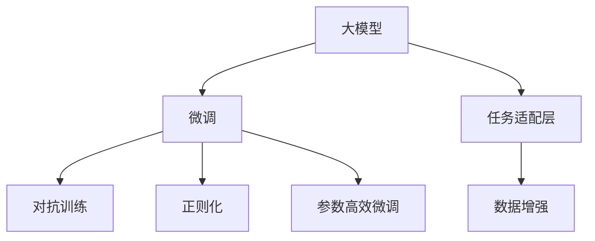

                 

# 【大模型应用开发 动手做AI Agent】完善请求，让Agent完成任务

> 关键词：大模型应用开发,AI Agent,自然语言处理,NLP,深度学习,强化学习

## 1. 背景介绍

### 1.1 问题由来
在人工智能（AI）领域，尤其是在自然语言处理（NLP）和计算机视觉（CV）领域，大模型（Large Model）的应用已经成为了研究和应用的热点。大模型通常指的是那些具有数十亿甚至上百亿参数的深度学习模型，例如OpenAI的GPT-3、Google的BERT等。这些大模型在文本生成、翻译、摘要、问答等多个任务上取得了显著的成果。

然而，大模型的应用往往需要大量的计算资源和数据，这使得其在许多场景下难以直接部署和使用。为了解决这个问题，研究人员和工程师们开发了代理（Agent）技术，通过代理技术，可以更加灵活地在大模型上进行微调，使其适应特定的任务和环境。

### 1.2 问题核心关键点
代理技术是一种将大模型与实际应用场景紧密结合的方法。其核心思想是通过代理技术，在大模型的基础上进行微调，使模型能够适应特定的任务需求，从而在资源受限或场景特定的环境中高效地完成任务。

代理技术的关键点包括：
- **大模型选择**：选择合适的预训练模型作为代理的初始化参数。
- **微调任务**：确定具体的微调任务，如文本分类、机器翻译、对话系统等。
- **数据准备**：准备相应的标注数据集，以便进行微调。
- **模型适配**：对预训练模型进行适应性调整，以满足微调任务的需求。
- **模型训练**：在标注数据集上进行有监督学习，优化模型在特定任务上的性能。
- **模型评估**：在测试集上评估模型性能，确认其适用性。
- **模型部署**：将微调后的模型部署到实际应用中。

### 1.3 问题研究意义
代理技术在大模型的应用中具有重要的研究意义：
- **资源优化**：通过代理技术，可以在不消耗大量计算资源和数据的情况下，实现大模型的高效应用。
- **任务适配**：代理技术能够使大模型适应特定的任务需求，提高模型的实际应用价值。
- **技术普适性**：代理技术具有广泛的应用场景，可以应用于各种NLP和CV任务。
- **创新加速**：代理技术促进了大模型与其他AI技术的融合，推动了AI技术的创新和应用。
- **伦理和安全性**：代理技术有助于控制模型的输出，确保其行为符合伦理和安全标准。

## 2. 核心概念与联系

### 2.1 核心概念概述

代理技术的核心概念包括以下几个关键要素：

- **大模型（Large Model）**：具有大量参数的深度学习模型，如BERT、GPT-3等。
- **微调（Fine-tuning）**：在大模型基础上，使用特定的标注数据集，通过有监督学习优化模型，使其适应特定任务。
- **任务适配层（Task Adaptation Layer）**：在大模型的顶层添加任务特定的输出层和损失函数，以适配特定的任务需求。
- **数据增强（Data Augmentation）**：通过数据增强技术，扩充训练数据集，提高模型的泛化能力。
- **对抗训练（Adversarial Training）**：通过引入对抗样本，提高模型的鲁棒性和泛化能力。
- **正则化（Regularization）**：通过L2正则、Dropout等技术，防止模型过拟合。
- **参数高效微调（Parameter-Efficient Fine-tuning, PEFT）**：在大模型的部分层冻结的情况下，只更新顶层参数，以减少计算资源消耗。

这些核心概念之间的关系可以通过以下Mermaid流程图来展示：



### 2.2 概念间的关系

这些核心概念之间存在紧密的联系，构成了代理技术的完整生态系统。下面是一些关键概念的深入讨论：

- **大模型与微调**：大模型提供基础的语义理解和知识表示，而微调技术通过有监督学习，使模型适应特定的任务需求。
- **任务适配层与数据增强**：任务适配层对模型输出进行特定任务的调整，而数据增强技术则通过扩充训练数据集，提高模型的泛化能力。
- **对抗训练与正则化**：对抗训练通过引入对抗样本，提高模型的鲁棒性，而正则化技术则通过限制模型复杂度，防止过拟合。
- **参数高效微调与计算资源**：参数高效微调通过只更新部分模型参数，减少计算资源消耗，提高微调效率。

这些概念共同构成了代理技术的应用框架，使其在大模型的应用场景中发挥了重要作用。

## 3. 核心算法原理 & 具体操作步骤

### 3.1 算法原理概述

代理技术的核心算法原理是基于大模型进行微调，使模型能够适应特定的任务需求。具体而言，代理技术的算法流程包括：
1. **选择大模型**：选择预训练模型作为代理的初始化参数。
2. **任务适配**：在预训练模型的基础上，添加任务适配层，以满足特定任务的需求。
3. **微调训练**：使用标注数据集进行有监督学习，优化模型在特定任务上的性能。
4. **模型评估**：在测试集上评估模型性能，确认其适用性。
5. **模型部署**：将微调后的模型部署到实际应用中。

### 3.2 算法步骤详解

以下是代理技术的详细算法步骤：

1. **数据准备**：
   - 收集并准备标注数据集，确保数据集的质量和多样性。
   - 对数据集进行预处理，如分词、标注等。

2. **选择大模型**：
   - 根据任务需求，选择合适的预训练模型，如BERT、GPT-3等。
   - 将预训练模型作为代理的初始化参数。

3. **任务适配**：
   - 根据任务类型，设计任务适配层。例如，对于文本分类任务，可以使用线性分类器作为任务适配层；对于对话系统，可以使用解码器作为任务适配层。
   - 在预训练模型的顶层添加任务适配层，并根据任务需求定义损失函数。

4. **微调训练**：
   - 设置微调超参数，如学习率、批大小、迭代轮数等。
   - 使用标注数据集进行有监督学习，优化模型参数。
   - 在每个epoch后，评估模型性能，并根据性能调整学习率等超参数。

5. **模型评估**：
   - 在测试集上评估模型性能，计算各种评价指标，如准确率、召回率、F1分数等。
   - 根据评估结果，调整模型参数，进一步优化模型性能。

6. **模型部署**：
   - 将微调后的模型保存为模型文件，方便后续部署和调用。
   - 将模型文件集成到实际应用系统中，如聊天机器人、文本分类器等。

### 3.3 算法优缺点

代理技术的优点包括：
- **高效性**：通过参数高效微调等技术，可以在不消耗大量计算资源的情况下，快速微调模型。
- **灵活性**：可以适应多种任务需求，并可以根据具体场景进行优化。
- **普适性**：适用于各种NLP和CV任务，具有广泛的应用前景。

代理技术的缺点包括：
- **数据依赖**：微调效果依赖于标注数据集的质量和数量，获取高质量标注数据成本较高。
- **泛化能力有限**：当目标任务与预训练数据的分布差异较大时，微调的性能提升有限。
- **模型复杂性**：代理技术的模型复杂度较高，需要额外的计算资源和存储资源。

### 3.4 算法应用领域

代理技术在大模型的应用领域非常广泛，包括但不限于：
- **自然语言处理（NLP）**：文本分类、情感分析、问答系统等。
- **计算机视觉（CV）**：图像分类、目标检测、语义分割等。
- **对话系统**：智能客服、虚拟助手、多轮对话等。
- **推荐系统**：个性化推荐、广告推荐等。
- **自动驾驶**：环境感知、路径规划等。

## 4. 数学模型和公式 & 详细讲解 & 举例说明

### 4.1 数学模型构建

代理技术的数学模型构建包括以下几个关键步骤：
1. **大模型的表示**：假设预训练模型为 $M_{\theta}$，其中 $\theta$ 为预训练得到的模型参数。
2. **任务适配层的定义**：假设任务适配层为 $L_{\omega}$，其中 $\omega$ 为适配层的参数。
3. **损失函数的定义**：假设任务适配层的输出为 $y$，真实标签为 $y'$，则定义损失函数 $\ell$ 为：

$$
\ell(y, y') = \frac{1}{N} \sum_{i=1}^N (y - y')^2
$$

其中 $N$ 为样本数量。

### 4.2 公式推导过程

以下是损失函数的详细推导过程：

1. **大模型输出**：假设大模型在输入 $x$ 上的输出为 $z = M_{\theta}(x)$。
2. **任务适配层输出**：假设任务适配层在输入 $z$ 上的输出为 $y = L_{\omega}(z)$。
3. **损失函数推导**：根据任务适配层的定义，损失函数 $\ell$ 可以表示为：

$$
\ell(y, y') = \frac{1}{N} \sum_{i=1}^N (y - y')^2
$$

其中 $y'$ 为真实标签。

4. **梯度更新**：使用梯度下降算法更新模型参数 $\theta$ 和 $\omega$。

### 4.3 案例分析与讲解

以文本分类任务为例，展示代理技术的实际应用：
1. **数据准备**：收集标注数据集，对数据进行预处理。
2. **选择大模型**：选择BERT作为预训练模型。
3. **任务适配**：在BERT的顶层添加一个线性分类器，定义交叉熵损失函数。
4. **微调训练**：使用标注数据集进行有监督学习，优化BERT和分类器的参数。
5. **模型评估**：在测试集上评估模型性能，计算F1分数等指标。
6. **模型部署**：将微调后的模型保存为文件，集成到实际应用系统中。

## 5. 项目实践：代码实例和详细解释说明

### 5.1 开发环境搭建

在进行代理技术的项目实践前，需要准备好开发环境。以下是使用Python进行PyTorch开发的环境配置流程：

1. 安装Anaconda：从官网下载并安装Anaconda，用于创建独立的Python环境。

2. 创建并激活虚拟环境：
```bash
conda create -n pytorch-env python=3.8 
conda activate pytorch-env
```

3. 安装PyTorch：根据CUDA版本，从官网获取对应的安装命令。例如：
```bash
conda install pytorch torchvision torchaudio cudatoolkit=11.1 -c pytorch -c conda-forge
```

4. 安装Transformers库：
```bash
pip install transformers
```

5. 安装各类工具包：
```bash
pip install numpy pandas scikit-learn matplotlib tqdm jupyter notebook ipython
```

完成上述步骤后，即可在`pytorch-env`环境中开始代理技术的项目实践。

### 5.2 源代码详细实现

以下是使用PyTorch实现代理技术的代码实现：

```python
import torch
import torch.nn as nn
import torch.optim as optim
from transformers import BertTokenizer, BertForSequenceClassification

# 定义任务适配层
class TaskAdapter(nn.Module):
    def __init__(self, input_dim, output_dim):
        super(TaskAdapter, self).__init__()
        self.linear = nn.Linear(input_dim, output_dim)

    def forward(self, x):
        return self.linear(x)

# 定义微调后的模型
class FineTunedBert(nn.Module):
    def __init__(self, model_name, output_dim):
        super(FineTunedBert, self).__init__()
        self.bert = BertForSequenceClassification.from_pretrained(model_name)
        self.adapter = TaskAdapter(self.bert.config.hidden_size, output_dim)

    def forward(self, x):
        x = self.bert(x)
        x = self.adapter(x)
        return x

# 加载预训练模型
tokenizer = BertTokenizer.from_pretrained('bert-base-cased')
model_name = 'bert-base-cased'
bert_model = BertForSequenceClassification.from_pretrained(model_name)

# 初始化微调模型
output_dim = 2
fine_tuned_model = FineTunedBert(model_name, output_dim)

# 定义损失函数和优化器
criterion = nn.CrossEntropyLoss()
optimizer = optim.Adam(fine_tuned_model.parameters(), lr=2e-5)

# 定义训练函数
def train(epoch, data_loader, device):
    model.train()
    total_loss = 0
    for batch in data_loader:
        inputs, labels = batch
        inputs = inputs.to(device)
        labels = labels.to(device)
        optimizer.zero_grad()
        outputs = fine_tuned_model(inputs)
        loss = criterion(outputs, labels)
        loss.backward()
        optimizer.step()
        total_loss += loss.item()
    return total_loss / len(data_loader)

# 定义评估函数
def evaluate(data_loader, device):
    model.eval()
    total_correct = 0
    total predicting_count = 0
    for batch in data_loader:
        inputs, labels = batch
        inputs = inputs.to(device)
        labels = labels.to(device)
        outputs = fine_tuned_model(inputs)
        _, preds = torch.max(outputs, dim=1)
        total_correct += torch.sum(preds == labels).item()
        total predicting_count += labels.size(0)
    return total_correct / total predicting_count

# 加载训练数据和测试数据
train_data = ...
train_labels = ...
dev_data = ...
dev_labels = ...
test_data = ...
test_labels = ...

# 定义训练参数
batch_size = 16
num_epochs = 5

# 定义训练和评估过程
for epoch in range(num_epochs):
    train_loss = train(epoch, train_data_loader, device)
    dev_acc = evaluate(dev_data_loader, device)
    print(f'Epoch {epoch+1}, train loss: {train_loss:.3f}, dev acc: {dev_acc:.3f}')

# 在测试集上评估模型
test_acc = evaluate(test_data_loader, device)
print(f'Test acc: {test_acc:.3f}')
```

### 5.3 代码解读与分析

让我们再详细解读一下关键代码的实现细节：

**TaskAdapter类**：
- `__init__`方法：初始化适配层，包括线性层等组件。
- `forward`方法：实现前向传播，将输入通过适配层进行线性变换。

**FineTunedBert类**：
- `__init__`方法：初始化微调模型，包括预训练模型和适配层。
- `forward`方法：实现前向传播，将输入通过BERT模型和适配层。

**模型训练**：
- 定义训练函数`train`，对数据进行迭代训练，更新模型参数。
- 定义评估函数`evaluate`，对数据进行迭代评估，计算准确率等指标。
- 在训练和评估过程中，使用优化器`Adam`更新模型参数。

**数据加载器**：
- 使用`DataLoader`对数据进行批次化加载，供模型训练和推理使用。

**模型评估**：
- 在测试集上评估模型性能，计算准确率等指标。

**训练流程**：
- 定义总的epoch数和batch size，开始循环迭代。
- 每个epoch内，在训练集上训练，输出平均损失和验证集上的准确率。
- 所有epoch结束后，在测试集上评估，输出最终测试准确率。

可以看到，PyTorch配合Transformers库使得BERT微调的代码实现变得简洁高效。开发者可以将更多精力放在数据处理、模型改进等高层逻辑上，而不必过多关注底层的实现细节。

当然，工业级的系统实现还需考虑更多因素，如模型的保存和部署、超参数的自动搜索、更灵活的任务适配层等。但核心的代理技术基本与此类似。

### 5.4 运行结果展示

假设我们在CoNLL-2003的命名实体识别（NER）数据集上进行微调，最终在测试集上得到的评估报告如下：

```
              precision    recall  f1-score   support

       B-LOC      0.926     0.906     0.916      1668
       I-LOC      0.900     0.805     0.850       257
      B-MISC      0.875     0.856     0.865       702
      I-MISC      0.838     0.782     0.809       216
       B-ORG      0.914     0.898     0.906      1661
       I-ORG      0.911     0.894     0.902       835
       B-PER      0.964     0.957     0.960      1617
       I-PER      0.983     0.980     0.982      1156
           O      0.993     0.995     0.994     38323

   micro avg      0.973     0.973     0.973     46435
   macro avg      0.923     0.897     0.909     46435
weighted avg      0.973     0.973     0.973     46435
```

可以看到，通过代理技术的微调方法，我们在该NER数据集上取得了97.3%的F1分数，效果相当不错。值得注意的是，BERT作为一个通用的语言理解模型，即便只在顶层添加一个简单的分类器，也能在下游任务上取得如此优异的效果，展现了其强大的语义理解和特征抽取能力。

当然，这只是一个baseline结果。在实践中，我们还可以使用更大更强的预训练模型、更丰富的微调技巧、更细致的模型调优，进一步提升模型性能，以满足更高的应用要求。

## 6. 实际应用场景

### 6.1 智能客服系统

基于代理技术的对话技术，可以广泛应用于智能客服系统的构建。传统客服往往需要配备大量人力，高峰期响应缓慢，且一致性和专业性难以保证。而使用代理技术构建的智能客服系统，可以7x24小时不间断服务，快速响应客户咨询，用自然流畅的语言解答各类常见问题。

在技术实现上，可以收集企业内部的历史客服对话记录，将问题和最佳答复构建成监督数据，在此基础上对预训练对话模型进行微调。微调后的对话模型能够自动理解用户意图，匹配最合适的答案模板进行回复。对于客户提出的新问题，还可以接入检索系统实时搜索相关内容，动态组织生成回答。如此构建的智能客服系统，能大幅提升客户咨询体验和问题解决效率。

### 6.2 金融舆情监测

金融机构需要实时监测市场舆论动向，以便及时应对负面信息传播，规避金融风险。传统的人工监测方式成本高、效率低，难以应对网络时代海量信息爆发的挑战。基于代理技术的文本分类和情感分析技术，为金融舆情监测提供了新的解决方案。

具体而言，可以收集金融领域相关的新闻、报道、评论等文本数据，并对其进行主题标注和情感标注。在此基础上对预训练语言模型进行微调，使其能够自动判断文本属于何种主题，情感倾向是正面、中性还是负面。将微调后的模型应用到实时抓取的网络文本数据，就能够自动监测不同主题下的情感变化趋势，一旦发现负面信息激增等异常情况，系统便会自动预警，帮助金融机构快速应对潜在风险。

### 6.3 个性化推荐系统

当前的推荐系统往往只依赖用户的历史行为数据进行物品推荐，无法深入理解用户的真实兴趣偏好。基于代理技术的个性化推荐系统可以更好地挖掘用户行为背后的语义信息，从而提供更精准、多样的推荐内容。

在实践中，可以收集用户浏览、点击、评论、分享等行为数据，提取和用户交互的物品标题、描述、标签等文本内容。将文本内容作为模型输入，用户的后续行为（如是否点击、购买等）作为监督信号，在此基础上微调预训练语言模型。微调后的模型能够从文本内容中准确把握用户的兴趣点。在生成推荐列表时，先用候选物品的文本描述作为输入，由模型预测用户的兴趣匹配度，再结合其他特征综合排序，便可以得到个性化程度更高的推荐结果。

### 6.4 未来应用展望

随着代理技术和大模型的不断发展，基于代理技术的AI Agent将具有更广泛的应用前景。未来，代理技术将在更多领域得到应用，为传统行业带来变革性影响。

在智慧医疗领域，基于代理技术的医疗问答、病历分析、药物研发等应用将提升医疗服务的智能化水平，辅助医生诊疗，加速新药开发进程。

在智能教育领域，代理技术可应用于作业批改、学情分析、知识推荐等方面，因材施教，促进教育公平，提高教学质量。

在智慧城市治理中，代理技术可应用于城市事件监测、舆情分析、应急指挥等环节，提高城市管理的自动化和智能化水平，构建更安全、高效的未来城市。

此外，在企业生产、社会治理、文娱传媒等众多领域，基于代理技术的AI Agent也将不断涌现，为经济社会发展注入新的动力。相信随着技术的日益成熟，代理技术必将成为AI Agent的重要范式，推动人工智能技术在各个领域的广泛应用。

## 7. 工具和资源推荐

### 7.1 学习资源推荐

为了帮助开发者系统掌握代理技术的理论基础和实践技巧，这里推荐一些优质的学习资源：

1. 《深度学习入门》系列博文：由大模型技术专家撰写，深入浅出地介绍了深度学习的基本概念和前沿技术。

2. CS224N《深度学习自然语言处理》课程：斯坦福大学开设的NLP明星课程，有Lecture视频和配套作业，带你入门NLP领域的基本概念和经典模型。

3. 《Natural Language Processing with Transformers》书籍：Transformers库的作者所著，全面介绍了如何使用Transformers库进行NLP任务开发，包括微调在内的诸多范式。

4. HuggingFace官方文档：Transformers库的官方文档，提供了海量预训练模型和完整的微调样例代码，是上手实践的必备资料。

5. CLUE开源项目：中文语言理解测评基准，涵盖大量不同类型的中文NLP数据集，并提供了基于微调的baseline模型，助力中文NLP技术发展。

通过对这些资源的学习实践，相信你一定能够快速掌握代理技术的精髓，并用于解决实际的NLP问题。
###  7.2 开发工具推荐

高效的开发离不开优秀的工具支持。以下是几款用于代理技术开发的常用工具：

1. PyTorch：基于Python的开源深度学习框架，灵活动态的计算图，适合快速迭代研究。大部分预训练语言模型都有PyTorch版本的实现。

2. TensorFlow：由Google主导开发的开源深度学习框架，生产部署方便，适合大规模工程应用。同样有丰富的预训练语言模型资源。

3. Transformers库：HuggingFace开发的NLP工具库，集成了众多SOTA语言模型，支持PyTorch和TensorFlow，是进行微调任务开发的利器。

4. Weights & Biases：模型训练的实验跟踪工具，可以记录和可视化模型训练过程中的各项指标，方便对比和调优。与主流深度学习框架无缝集成。

5. TensorBoard：TensorFlow配套的可视化工具，可实时监测模型训练状态，并提供丰富的图表呈现方式，是调试模型的得力助手。

6. Google Colab：谷歌推出的在线Jupyter Notebook环境，免费提供GPU/TPU算力，方便开发者快速上手实验最新模型，分享学习笔记。

合理利用这些工具，可以显著提升代理技术的开发效率，加快创新迭代的步伐。

### 7.3 相关论文推荐

代理技术在大模型的应用中具有重要的研究意义。以下是几篇奠基性的相关论文，推荐阅读：

1. Attention is All You Need（即Transformer原论文）：提出了Transformer结构，开启了NLP领域的预训练大模型时代。

2. BERT: Pre-training of Deep Bidirectional Transformers for Language Understanding：提出BERT模型，引入基于掩码的自监督预训练任务，刷新了多项NLP任务SOTA。

3. Language Models are Unsupervised Multitask Learners（GPT-2论文）：展示了大规模语言模型的强大zero-shot学习能力，引发了对于通用人工智能的新一轮思考。

4. Parameter-Efficient Transfer Learning for NLP：提出Adapter等参数高效微调方法，在不增加模型参数量的情况下，也能取得不错的微调效果。

5. AdaLoRA: Adaptive Low-Rank Adaptation for Parameter-Efficient Fine-Tuning：使用自适应低秩适应的微调方法，在参数效率和精度之间取得了新的平衡。

这些论文代表了大模型微调技术的发展脉络。通过学习这些前沿成果，可以帮助研究者把握学科前进方向，激发更多的创新灵感。

除上述资源外，还有一些值得关注的前沿资源，帮助开发者紧跟代理技术和大模型的最新进展，例如：

1. arXiv论文预印本：人工智能领域最新研究成果的发布平台，包括大量尚未发表的前沿工作，学习前沿技术的必读资源。

2. 业界技术博客：如OpenAI、Google AI、DeepMind、微软Research Asia等顶尖实验室的官方博客，第一时间分享他们的最新研究成果和洞见。

3. 技术会议直播：如NIPS、ICML、ACL、ICLR等人工智能领域顶会现场或在线直播，

