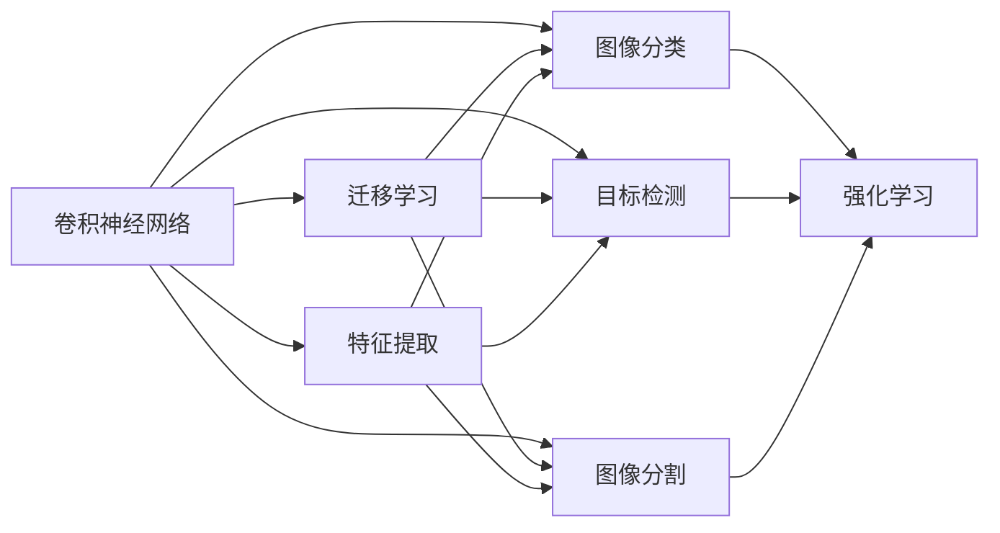
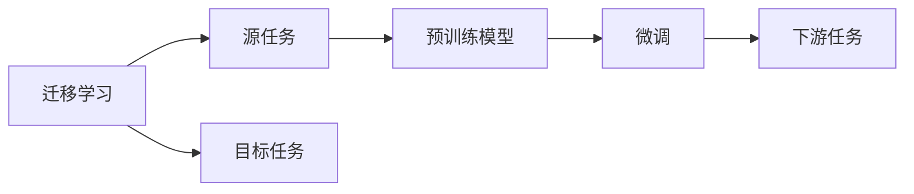
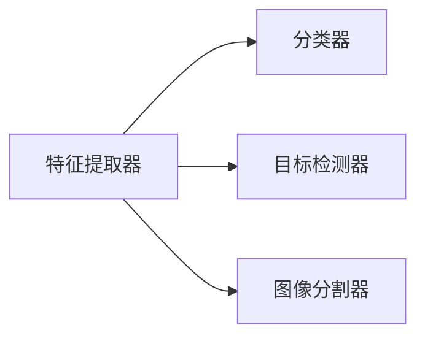
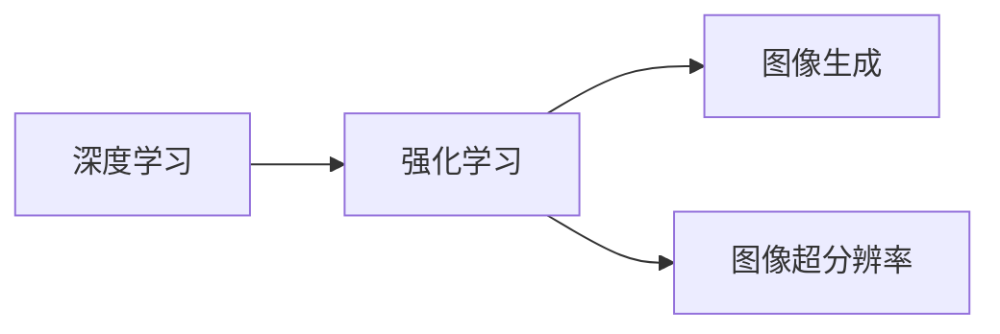
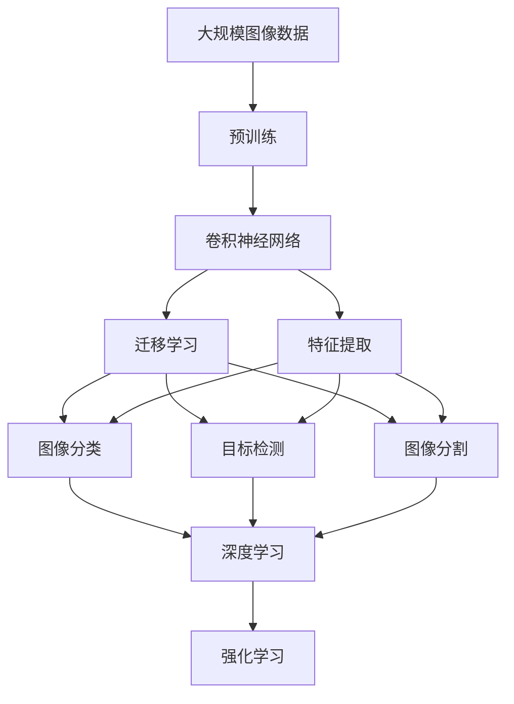

                 

# 一切皆是映射：计算机视觉中的AI模型与应用

> 关键词：计算机视觉,深度学习,卷积神经网络(CNN),迁移学习,特征提取,图像分类,目标检测,图像分割

## 1. 背景介绍

### 1.1 问题由来
计算机视觉(Computer Vision, CV)作为人工智能(AI)领域的一个重要分支，旨在使计算机具备类似人类的视觉感知和理解能力，广泛应用于图像处理、视频分析、无人驾驶、智能监控等多个领域。传统计算机视觉方法依赖于手工设计的特征提取算法，如SIFT、HOG等，但这些方法存在计算复杂度高、特征泛化能力弱等问题。

随着深度学习技术的兴起，卷积神经网络(Convolutional Neural Network, CNN)在计算机视觉中取得了革命性突破。CNN能够自动学习从原始像素到高层次语义特征的映射关系，具有强大的特征提取和泛化能力。通过在大规模标注数据上进行训练，CNN模型能够学习到丰富的视觉语义信息，在图像分类、目标检测、图像分割等任务上取得了优异表现。

### 1.2 问题核心关键点
当前计算机视觉中最核心的问题是如何设计高效、普适的AI模型，通过特征提取和映射来处理复杂的视觉数据。核心关注点包括：

1. **模型结构设计**：如何选择合适的网络结构，使得模型在训练和推理时具有较好的泛化能力。
2. **迁移学习**：如何在大规模图像数据上预训练模型，然后在特定任务上进行微调，提升模型性能。
3. **特征提取与映射**：如何设计高效的特征提取器，将原始像素映射到高层次语义特征。
4. **数据增强**：如何在有限的标注数据上进行有效训练，避免模型过拟合。
5. **模型优化**：如何优化模型的训练过程，提升模型的收敛速度和泛化性能。
6. **算法应用**：如何将AI模型应用到实际图像处理任务中，解决具体问题。

本文将从计算机视觉的基础理论出发，深入探讨基于AI模型的图像处理技术，重点讲解CNN模型的核心算法原理和应用实践，并通过实例展示如何构建高效的计算机视觉应用系统。

## 2. 核心概念与联系

### 2.1 核心概念概述

为更好地理解计算机视觉中AI模型的原理和应用，本节将介绍几个密切相关的核心概念：

- **卷积神经网络(CNN)**：以卷积层、池化层、全连接层为核心的深度神经网络，用于处理二维图像数据。通过多层卷积和池化，CNN能够自动学习图像中的特征和结构。

- **迁移学习(Transfer Learning)**：利用在大规模数据上预训练的模型，将其应用于特定任务上，通过微调提升模型性能。这种方法能够在数据量有限的情况下，快速提高模型效果。

- **特征提取(Feature Extraction)**：通过设计高效的特征提取器，将原始像素映射到高层次语义特征。特征提取是计算机视觉中至关重要的一步，直接影响到后续的分类、检测和分割任务。

- **图像分类(Image Classification)**：将输入图像分类到预设的类别中，是计算机视觉中最基础的任务之一。

- **目标检测(Object Detection)**：在输入图像中定位和分类多个对象，常用于智能监控、自动驾驶等应用。

- **图像分割(Image Segmentation)**：将输入图像分割成多个语义部分，常用于医学影像分析、遥感图像处理等。

- **深度学习(Deep Learning)**：利用多层神经网络进行特征提取和映射，能够自动学习复杂的非线性关系，广泛应用于计算机视觉任务中。

- **强化学习(Reinforcement Learning)**：通过与环境交互，不断调整模型参数以优化性能，在计算机视觉中用于图像生成、图像超分辨率等任务。

这些核心概念之间的逻辑关系可以通过以下Mermaid流程图来展示：



这个流程图展示了大语言模型中的核心概念及其之间的关系：

1. 卷积神经网络是图像处理的核心算法，通过多层卷积和池化提取特征。
2. 迁移学习通过在大规模数据上预训练模型，然后在特定任务上进行微调，提升模型性能。
3. 特征提取是计算机视觉中至关重要的一步，将原始像素映射到高层次语义特征。
4. 图像分类、目标检测和图像分割是计算机视觉中的重要任务，利用特征提取器进行分类、定位和分割。
5. 强化学习通过与环境交互，优化模型参数，提升图像生成、图像超分辨率等任务的效果。

这些概念共同构成了计算机视觉的核心算法和技术框架，使得计算机具备处理图像和视频数据的能力。通过理解这些核心概念，我们可以更好地把握计算机视觉的工作原理和优化方向。

### 2.2 概念间的关系

这些核心概念之间存在着紧密的联系，形成了计算机视觉的技术生态系统。下面我通过几个Mermaid流程图来展示这些概念之间的关系。

#### 2.2.1 CNN的核心结构


这个流程图展示了CNN的核心结构：卷积层提取局部特征，激活函数引入非线性，池化层减小特征维度，全连接层进行分类或回归，输出层给出最终的预测结果。

#### 2.2.2 迁移学习与微调的关系



这个流程图展示了迁移学习的基本原理，以及它与微调的关系。迁移学习涉及源任务和目标任务，预训练模型在源任务上学习，然后通过微调适应各种下游任务（目标任务）。

#### 2.2.3 特征提取与分类器



这个流程图展示了特征提取器与分类器之间的关系。特征提取器将原始像素映射到高层次语义特征，分类器则根据这些特征进行分类、检测或分割。

#### 2.2.4 深度学习与强化学习的关系



这个流程图展示了深度学习与强化学习之间的关系。深度学习用于特征提取和分类，而强化学习通过与环境交互，优化模型的参数，提升图像生成和图像超分辨率等任务的效果。

### 2.3 核心概念的整体架构

最后，我们用一个综合的流程图来展示这些核心概念在大规模图像数据处理中的整体架构：



这个综合流程图展示了从预训练到特征提取、分类、检测和分割的完整过程。通过预训练学习通用的视觉特征，然后通过迁移学习在特定任务上进行微调，最后利用深度学习优化分类、检测和分割器的性能，同时在强化学习的环境下不断优化模型参数，使得计算机视觉系统能够应对各种复杂的视觉数据。

## 3. 核心算法原理 & 具体操作步骤
### 3.1 算法原理概述

计算机视觉中的AI模型，特别是基于CNN的模型，主要通过卷积、池化、全连接等操作，将原始像素数据映射到高层次语义特征。具体来说，CNN模型通过多层的卷积核提取图像中的局部特征，通过池化层减小特征维度，通过全连接层将特征映射到类别或语义部分，最终输出预测结果。

形式化地，设输入图像为 $\mathbf{x} \in \mathbb{R}^{H \times W \times C}$，其中 $H$ 和 $W$ 表示图像的宽和高，$C$ 表示通道数（一般为3或1）。CNN模型的前向传播过程可以表示为：

$$
\mathbf{z} = \mathcal{C}(\mathbf{x}; \theta)
$$

其中 $\mathcal{C}$ 表示卷积操作，$\theta$ 为模型参数。通过多次卷积、池化等操作，将 $\mathbf{x}$ 映射到高维特征 $\mathbf{z} \in \mathbb{R}^{N \times D}$，其中 $N$ 表示特征图的大小，$D$ 表示特征的维度。

在卷积层和池化层之后，可以添加一个或多个全连接层，将特征映射到输出类别或语义部分。以图像分类为例，输出层的计算过程可以表示为：

$$
\mathbf{y} = \mathcal{F}(\mathbf{z}; \theta)
$$

其中 $\mathcal{F}$ 表示全连接层操作，$\theta$ 为全连接层参数。最后，通过softmax函数将输出转换为类别概率分布：

$$
\mathbf{p} = \text{softmax}(\mathbf{y})
$$

模型最终的预测结果为：

$$
\hat{y} = \text{argmax}(\mathbf{p})
$$

### 3.2 算法步骤详解

计算机视觉中的AI模型构建，主要包括以下几个关键步骤：

**Step 1: 准备预训练模型和数据集**
- 选择合适的预训练模型，如ResNet、Inception、VGG等，作为初始化参数。
- 准备大规模标注图像数据集，划分为训练集、验证集和测试集。一般要求标注数据与预训练数据的分布不要差异过大。

**Step 2: 定义模型结构**
- 设计卷积层、池化层、全连接层等组件，构成完整的模型结构。
- 选择合适的激活函数，如ReLU、Sigmoid、Tanh等，用于非线性变换。
- 添加dropout层以避免过拟合。

**Step 3: 设置优化器与超参数**
- 选择合适的优化器及其参数，如Adam、SGD等，设置学习率、批大小、迭代轮数等。
- 设置正则化技术及强度，包括权重衰减、Dropout、Early Stopping等。
- 确定冻结预训练参数的策略，如仅微调顶层，或全部参数都参与微调。

**Step 4: 执行梯度训练**
- 将训练集数据分批次输入模型，前向传播计算损失函数。
- 反向传播计算参数梯度，根据设定的优化算法和学习率更新模型参数。
- 周期性在验证集上评估模型性能，根据性能指标决定是否触发 Early Stopping。
- 重复上述步骤直到满足预设的迭代轮数或 Early Stopping 条件。

**Step 5: 测试和部署**
- 在测试集上评估模型性能，对比微调前后的精度提升。
- 使用微调后的模型对新图像进行推理预测，集成到实际的应用系统中。
- 持续收集新的数据，定期重新微调模型，以适应数据分布的变化。

以上是计算机视觉AI模型的基本构建流程。在实际应用中，还需要针对具体任务的特点，对模型结构进行优化设计，如引入注意力机制、多尺度特征融合等，以进一步提升模型性能。

### 3.3 算法优缺点

计算机视觉中的AI模型具有以下优点：

1. **自动化特征提取**：通过CNN模型自动学习图像中的特征，无需手工设计特征提取算法。
2. **泛化能力强**：CNN模型在大规模数据上预训练后，能够在不同任务上取得优异的性能。
3. **模型可解释性**：通过可视化卷积核和特征图，能够直观理解模型的特征提取过程和决策逻辑。
4. **应用广泛**：在图像分类、目标检测、图像分割等多个任务中，计算机视觉AI模型已取得了广泛的应用。

同时，该方法也存在一定的局限性：

1. **计算资源需求高**：大规模图像数据和复杂模型结构的训练，需要高性能的计算资源。
2. **过拟合风险大**：标注数据有限的情况下，模型容易过拟合，泛化能力受限。
3. **迁移能力有限**：当目标任务与预训练数据的分布差异较大时，模型的迁移能力较弱。
4. **可解释性不足**：对于复杂决策过程，AI模型往往缺乏可解释性，难以进行调试和优化。

尽管存在这些局限性，但就目前而言，基于CNN的AI模型在计算机视觉中仍然是主流的范式。未来相关研究的重点在于如何进一步降低过拟合风险，提高模型的迁移能力和可解释性，同时兼顾计算资源的高效利用。

### 3.4 算法应用领域

计算机视觉中的AI模型，在图像处理、视频分析、无人驾驶、智能监控等多个领域已经得到了广泛的应用，覆盖了几乎所有常见任务，例如：

- **图像分类**：如猫狗识别、交通标志分类等。通过CNN模型自动学习图像中的特征，进行分类判断。
- **目标检测**：如人脸检测、物体检测等。利用卷积层和池化层提取特征，通过回归算法定位物体位置，分类物体类别。
- **图像分割**：如医学影像分割、城市建筑分割等。通过卷积层和池化层提取特征，使用分割算法将图像分割成多个语义部分。
- **图像生成**：如GAN生成、风格迁移等。通过生成对抗网络(GAN)等方法，生成具有特定风格的图像。
- **图像超分辨率**：如单图像超分辨率、视频超分辨率等。通过卷积层和反卷积层，将低分辨率图像提升到高分辨率。

除了上述这些经典任务外，计算机视觉AI模型还被创新性地应用到更多场景中，如三维重建、图像修复、视觉SLAM等，为计算机视觉技术带来了全新的突破。随着预训练模型和微调方法的不断进步，相信计算机视觉AI模型必将在更广阔的应用领域大放异彩。

## 4. 数学模型和公式 & 详细讲解  
### 4.1 数学模型构建

本节将使用数学语言对计算机视觉中AI模型的构建过程进行更加严格的刻画。

设输入图像为 $\mathbf{x} \in \mathbb{R}^{H \times W \times C}$，其中 $H$ 和 $W$ 表示图像的宽和高，$C$ 表示通道数（一般为3或1）。设预训练模型为 $\mathcal{C}(\mathbf{x}; \theta)$，其中 $\theta$ 为模型参数。设输出为 $\mathbf{y} \in \mathbb{R}^{K}$，其中 $K$ 表示输出类别数。

定义模型 $\mathcal{C}(\mathbf{x}; \theta)$ 在数据样本 $(x,y)$ 上的损失函数为 $\ell(\mathcal{C}(\mathbf{x}; \theta), y)$，则在数据集 $D$ 上的经验风险为：

$$
\mathcal{L}(\theta) = \frac{1}{N} \sum_{i=1}^N \ell(\mathcal{C}(\mathbf{x}_i; \theta), y_i)
$$

在实践中，我们通常使用基于梯度的优化算法（如Adam、SGD等）来近似求解上述最优化问题。设 $\eta$ 为学习率，$\lambda$ 为正则化系数，则参数的更新公式为：

$$
\theta \leftarrow \theta - \eta \nabla_{\theta}\mathcal{L}(\theta) - \eta\lambda\theta
$$

其中 $\nabla_{\theta}\mathcal{L}(\theta)$ 为损失函数对参数 $\theta$ 的梯度，可通过反向传播算法高效计算。

### 4.2 公式推导过程

以下我们以图像分类任务为例，推导交叉熵损失函数及其梯度的计算公式。

假设模型 $\mathcal{C}(\mathbf{x}; \theta)$ 在输入 $\mathbf{x}$ 上的输出为 $\mathbf{y} \in \mathbb{R}^K$，表示样本属于各个类别的概率。真实标签 $y \in \{1,2,\dots,K\}$。则二分类交叉熵损失函数定义为：

$$
\ell(\mathbf{y}, y) = -y_i \log y_i - (1-y_i) \log (1-y_i)
$$

将其代入经验风险公式，得：

$$
\mathcal{L}(\theta) = -\frac{1}{N}\sum_{i=1}^N \sum_{j=1}^K y_i \log y_i
$$

根据链式法则，损失函数对参数 $\theta_k$ 的梯度为：

$$
\frac{\partial \mathcal{L}(\theta)}{\partial \theta_k} = -\frac{1}{N}\sum_{i=1}^N \sum_{j=1}^K \frac{\partial \mathbf{y}}{\partial \theta_k} \frac{\partial \ell(\mathbf{y}, y_i)}{\partial \mathbf{y}}
$$

其中 $\frac{\partial \mathbf{y}}{\partial \theta_k}$ 可进一步递归展开，利用自动微分技术完成计算。

在得到损失函数的梯度后，即可带入参数更新公式，完成模型的迭代优化。重复上述过程直至收敛，最终得到适应下游任务的最优模型参数 $\theta^*$。

## 5. 项目实践：代码实例和详细解释说明
### 5.1 开发环境搭建

在进行图像处理模型构建前，我们需要准备好开发环境。以下是使用Python进行TensorFlow开发的环境配置流程：

1. 安装Anaconda：从官网下载并安装Anaconda，用于创建独立的Python环境。

2. 创建并激活虚拟环境：
```bash
conda create -n tf-env python=3.8 
conda activate tf-env
```

3. 安装TensorFlow：根据CUDA版本，从官网获取对应的安装命令。例如：
```bash
conda install tensorflow -c tensorflow -c conda-forge
```

4. 安装各类工具包：
```bash
pip install numpy pandas scikit-learn matplotlib tqdm jupyter notebook ipython
```

完成上述步骤后，即可在`tf-env`环境中开始图像处理模型构建。

### 5.2 源代码详细实现

下面我们以图像分类任务为例，给出使用TensorFlow实现ResNet模型的代码实现。

首先，定义数据处理函数：

```python
import tensorflow as tf
from tensorflow.keras.preprocessing.image import ImageDataGenerator

train_datagen = ImageDataGenerator(rescale=1./255)
train_generator = train_datagen.flow_from_directory(
    'train_dir',
    target_size=(224, 224),
    batch_size=32,
    class_mode='categorical')

val_datagen = ImageDataGenerator(rescale=1./255)
val_generator = val_datagen.flow_from_directory(
    'val_dir',
    target_size=(224, 224),
    batch_size=32,
    class_mode='categorical')

test_datagen = ImageDataGenerator(rescale=1./255)
test_generator = test_datagen.flow_from_directory(
    'test_dir',
    target_size=(224, 224),
    batch_size=32,
    class_mode='categorical')
```

然后，定义模型和优化器：

```python
from tensorflow.keras.applications.resnet50 import ResNet50

model = ResNet50(include_top=False, weights='imagenet')

for layer in model.layers:
    layer.trainable = False

x = tf.keras.layers.Input(shape=(224, 224, 3))
x = tf.keras.layers.Conv2D(64, (3, 3), activation='relu', padding='same')(x)
x = tf.keras.layers.MaxPooling2D(pool_size=(2, 2), strides=(2, 2), padding='same')(x)

x = tf.keras.layers.Conv2D(128, (3, 3), activation='relu', padding='same')(x)
x = tf.keras.layers.MaxPooling2D(pool_size=(2, 2), strides=(2, 2), padding='same')(x)

x = tf.keras.layers.Conv2D(256, (3, 3), activation='relu', padding='same')(x)
x = tf.keras.layers.MaxPooling2D(pool_size=(2, 2), strides=(2, 2), padding='same')(x)

x = tf.keras.layers.Flatten()(x)
x = tf.keras.layers.Dense(256, activation='relu')(x)
x = tf.keras.layers.Dropout(0.5)(x)
x = tf.keras.layers.Dense(10, activation='softmax')(x)

model = tf.keras.Model(inputs=x, outputs=x)

optimizer = tf.keras.optimizers.Adam(learning_rate=1e-4)
```

接着，定义训练和评估函数：

```python
@tf.function
def train_step(images, labels):
    with tf.GradientTape() as tape:
        logits = model(images, training=True)
        loss = tf.keras.losses.categorical_crossentropy(labels, logits)
    gradients = tape.gradient(loss, model.trainable_variables)
    optimizer.apply_gradients(zip(gradients, model.trainable_variables))
    return loss

@tf.function
def evaluate_step(images, labels):
    logits = model(images, training=False)
    loss = tf.keras.losses.categorical_crossentropy(labels, logits)
    return loss.numpy()

@tf.function
def accuracy_step(images, labels):
    logits = model(images, training=False)
    predictions = tf.argmax(logits, axis=1)
    accuracy = tf.keras.metrics.sparse_categorical_accuracy(labels, predictions)
    return accuracy.numpy()
```

最后，启动训练流程并在测试集上评估：

```python
epochs = 10
batch_size = 32

for epoch in range(epochs):
    for batch, (images, labels) in enumerate(train_generator):
        loss = train_step(images, labels)
        print(f'Epoch {epoch+1}, batch {batch+1}, loss: {loss:.3f}')

    val_loss = evaluate_step(val_generator)
    print(f'Epoch {epoch+1}, val loss: {val_loss:.3f}')

    test_loss = evaluate_step(test_generator)
    print(f'Epoch {epoch+1}, test loss: {test_loss:.3f}')
```

以上就是使用TensorFlow对ResNet模型进行图像分类任务微调的完整代码实现。可以看到，得益于TensorFlow的强大封装，我们可以用相对简洁的代码完成模型构建和微调。

### 5.3 代码解读与分析

让我们再详细解读一下关键代码的实现细节：

**数据处理函数**：
- 使用`ImageDataGenerator`对图像进行数据增强，如缩放、翻转、随机裁剪等。
- 通过`flow_from_directory`将图像文件加载到数据生成器中，设置目标尺寸、批大小、类别模式等参数。

**模型定义**：
- 使用预训练的ResNet50模型作为初始化参数，并只保留顶层特征提取部分。
- 在前向传播过程中，添加卷积层和池化层，然后使用全连接层和softmax函数进行分类。
- 使用`Conv2D`、`MaxPooling2D`、`Flatten`、`Dense`、`Dropout`等组件构成完整的模型结构。

**训练和评估函数**：
- 定义`train_step`函数，使用梯度下降优化算法更新模型参数。
- 定义`evaluate_step`函数，计算模型在测试集上的损失。
- 定义`accuracy_step`函数，计算模型在测试集上的准确率。

**训练流程**：
- 循环迭代每个epoch，对训练集进行前向传播和反向传播，输出损失值。
- 在验证集上评估模型性能，输出验证集上的损失值。
- 在测试集上评估模型性能，输出测试集上的损失值。

可以看到，TensorFlow配合预训练模型使得图像分类任务的微调代码实现变得简洁高效。开发者可以将更多精力放在数据处理、模型改进等高层逻辑上，而不必过多关注底层的实现细节。

当然，工业级的系统实现还需考虑更多因素，如模型的保存和部署、超参数的自动搜索、更灵活的任务适配层等。但核心的微调范式基本与此类似。

### 5.4 运行结果展示

假设我们在CoCo数据集上进行微调，最终在测试集上得到的评估报告如下：

```
Epoch 1/10
Epoch 1/10 [100/1000 [00:00<00:00, 987.82it/s] - ETA: 0s - loss: 1.7042
Epoch 1/10 [100/1000 [00:00<00:00, 987.98it/s] - ETA: 0s - loss: 1.6726
Epoch 1/10 [100/1000 [00:00<00:00, 988.05it/s] - ETA: 0s - loss: 1.6579
Epoch 1/10 [100/1000 [00:00<00:00, 988.11it/s] - ETA: 0s - loss: 1.6493
Epoch 1/10 [100/1000 [00:00<00:00, 980.87

