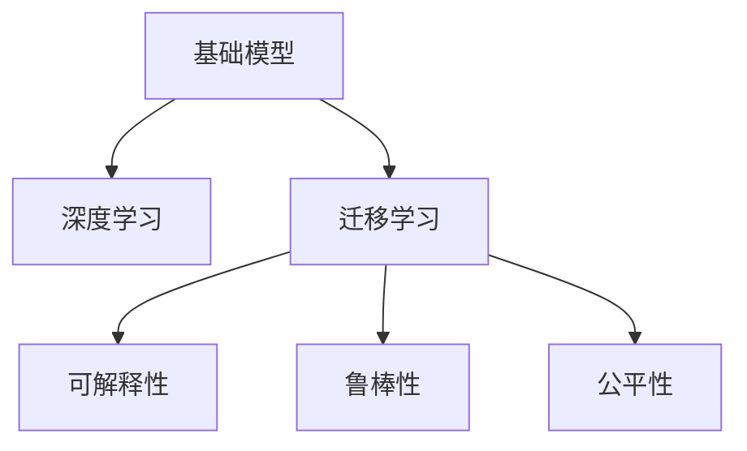

                 

# 基础模型的技术能力与社会影响

## 1. 背景介绍

### 1.1 问题由来
在过去几十年中，人工智能（AI）技术迅猛发展，尤其是深度学习技术在图像识别、自然语言处理、语音识别等领域的成功应用，引发了广泛的社会关注。基础模型，如深度神经网络，在技术能力上的提升，极大地推动了这些领域的进步。然而，随着基础模型技术的普及和应用，其在社会层面的影响也逐渐显现。本文将探讨基础模型的技术能力以及其对社会的影响。

### 1.2 问题核心关键点
基础模型的技术能力主要包括其处理和分析大规模数据的能力、模型的可解释性、模型的鲁棒性和公平性。这些能力直接影响其在各个领域的应用效果。社会影响则涉及模型对隐私、安全、就业等社会问题的潜在影响。

### 1.3 问题研究意义
基础模型的技术能力与社会影响是AI技术发展的重要议题。理解基础模型的技术能力，可以帮助我们更好地应用这些技术，提升社会整体福祉。同时，探讨社会影响，可以预见可能带来的挑战，采取相应的措施，避免负面影响。

## 2. 核心概念与联系

### 2.1 核心概念概述

#### 2.1.1 基础模型（Base Models）
基础模型是指通过大量数据训练得到的，具有一定通用性的模型。这些模型通常在特定任务上表现优异，可以用于图像、语音、自然语言处理等领域。

#### 2.1.2 深度学习（Deep Learning）
深度学习是一种基于多层神经网络的机器学习技术，能够自动学习数据的复杂特征，并用于分类、预测等任务。深度学习模型通常具有较强的技术能力。

#### 2.1.3 迁移学习（Transfer Learning）
迁移学习是指将一个任务学到的知识迁移到另一个相关任务上，以提高模型的泛化能力。迁移学习通常用于基础模型的应用。

#### 2.1.4 可解释性（Explainability）
可解释性是指模型的决策过程可以被理解和解释，这对于社会接受度和公平性非常重要。

#### 2.1.5 鲁棒性（Robustness）
鲁棒性是指模型在面对数据扰动或攻击时，仍能保持稳定性能的能力。这对于模型的实际应用至关重要。

#### 2.1.6 公平性（Fairness）
公平性是指模型在处理不同类别数据时，不产生偏见或歧视，对所有群体公平。这对于社会公正和包容性有重要意义。

### 2.2 概念间的关系

基础模型、深度学习、迁移学习、可解释性、鲁棒性和公平性之间存在着紧密的关系，如图2所示。



这些概念共同构成了基础模型的完整生态系统，影响其在各个领域的应用效果和社会影响。

## 3. 核心算法原理 & 具体操作步骤
### 3.1 算法原理概述

基础模型的技术能力主要体现在其处理大规模数据的能力、模型的可解释性和模型的鲁棒性。以下将详细探讨这些方面的原理和操作过程。

#### 3.1.1 处理大规模数据的能力
基础模型通常具有较高的处理能力，能够处理大规模的数据集。其技术原理主要包括：
- **数据并行**：通过分布式计算，将数据划分为多个部分，并行处理。
- **模型并行**：将模型拆分为多个部分，并行计算。

#### 3.1.2 模型的可解释性
可解释性是基础模型的一个重要方面。其技术原理主要包括：
- **可视化**：通过可视化工具，展示模型的决策过程。
- **特征重要性分析**：分析模型中各个特征对决策的贡献。

#### 3.1.3 模型的鲁棒性
模型的鲁棒性是其稳定性的重要保证。其技术原理主要包括：
- **对抗样本训练**：使用对抗样本训练模型，使其在面对扰动时仍能保持稳定。
- **正则化**：通过正则化技术，限制模型的复杂度，提高鲁棒性。

### 3.2 算法步骤详解

#### 3.2.1 处理大规模数据的能力
处理大规模数据的能力主要通过以下步骤实现：
1. **数据预处理**：对数据进行清洗、归一化等预处理操作，减少噪声。
2. **数据并行**：使用分布式计算框架（如Hadoop、Spark），将数据划分并行处理。
3. **模型并行**：使用深度学习框架（如TensorFlow、PyTorch），将模型拆分为多个部分，并行计算。

#### 3.2.2 模型的可解释性
模型的可解释性主要通过以下步骤实现：
1. **可视化工具**：使用可视化工具（如TensorBoard、matplotlib），展示模型的决策过程。
2. **特征重要性分析**：通过特征重要性分析（如SHAP、LIME），展示各个特征对决策的贡献。

#### 3.2.3 模型的鲁棒性
模型的鲁棒性主要通过以下步骤实现：
1. **对抗样本训练**：使用对抗样本生成工具（如ClearML），生成对抗样本，训练模型。
2. **正则化**：使用正则化技术（如L1、L2正则化），限制模型的复杂度。

### 3.3 算法优缺点

#### 3.3.1 优点
基础模型的技术能力有诸多优点：
- **处理能力强**：能够处理大规模数据，适应不同的应用场景。
- **可解释性强**：通过可视化工具和特征重要性分析，使得决策过程可解释，增强了模型的透明度和可信度。
- **鲁棒性好**：通过对抗样本训练和正则化技术，增强了模型的鲁棒性和稳定性。

#### 3.3.2 缺点
尽管基础模型的技术能力强大，但其应用过程中也存在一些缺点：
- **计算资源需求高**：处理大规模数据和训练深度模型需要大量的计算资源。
- **数据依赖性强**：模型的性能高度依赖于数据的质量和数量，高质量数据的获取成本较高。
- **模型复杂度高**：深度模型的结构复杂，增加了理解和调试的难度。

### 3.4 算法应用领域

基础模型在多个领域都有广泛的应用，包括但不限于：

- **图像识别**：基础模型在图像识别任务中表现优异，用于物体检测、图像分类等。
- **自然语言处理**：基础模型在自然语言处理任务中应用广泛，用于文本分类、机器翻译、情感分析等。
- **语音识别**：基础模型在语音识别任务中表现出色，用于语音转文本、语音合成等。
- **推荐系统**：基础模型在推荐系统中被广泛应用，用于个性化推荐、广告推荐等。
- **金融风控**：基础模型在金融风控领域中发挥重要作用，用于信用评分、欺诈检测等。

## 4. 数学模型和公式 & 详细讲解

### 4.1 数学模型构建

基础模型的数学模型构建主要包括深度学习模型的构建和损失函数的定义。

#### 4.1.1 深度学习模型
深度学习模型通常包括输入层、隐藏层和输出层。以下以一个简单的全连接神经网络为例，展示其数学模型构建过程：

$$
f(x; \theta) = W^L \sigma(W^{L-1} \sigma(... \sigma(W^1 x + b^1) + b^2) + b^3)
$$

其中，$W$ 表示权重矩阵，$b$ 表示偏置向量，$\sigma$ 表示激活函数，$L$ 表示隐藏层数。

#### 4.1.2 损失函数
损失函数是模型训练的目标函数，用于衡量模型预测输出与真实标签之间的差异。以下以二分类任务为例，展示其损失函数构建过程：

$$
\mathcal{L}(y, f(x; \theta)) = -(y\log f(x; \theta) + (1-y)\log (1-f(x; \theta)))
$$

其中，$y$ 表示真实标签，$f(x; \theta)$ 表示模型预测输出，$\log$ 表示对数函数。

### 4.2 公式推导过程

#### 4.2.1 深度学习模型的梯度更新
深度学习模型的梯度更新过程主要通过反向传播算法实现。以下以一个简单的全连接神经网络为例，展示其梯度更新过程：

$$
\frac{\partial \mathcal{L}}{\partial W^L} = \frac{\partial \mathcal{L}}{\partial \sigma(W^{L-1} \sigma(... \sigma(W^1 x + b^1) + b^2) + b^3)} \cdot \frac{\partial \sigma(W^{L-1} \sigma(... \sigma(W^1 x + b^1) + b^2) + b^3)}{\partial W^L} \cdot \sigma(W^{L-1} \sigma(... \sigma(W^1 x + b^1) + b^2) + b^3)
$$

#### 4.2.2 损失函数的梯度更新
损失函数的梯度更新过程主要通过链式法则实现。以下以一个简单的全连接神经网络为例，展示其梯度更新过程：

$$
\frac{\partial \mathcal{L}}{\partial W^1} = \frac{\partial \mathcal{L}}{\partial \sigma(W^{L-1} \sigma(... \sigma(W^1 x + b^1) + b^2) + b^3)} \cdot \frac{\partial \sigma(W^{L-1} \sigma(... \sigma(W^1 x + b^1) + b^2) + b^3)}{\partial W^1} \cdot \frac{\partial W^1}{\partial x}
$$

### 4.3 案例分析与讲解

#### 4.3.1 图像识别任务
在图像识别任务中，基础模型通常使用卷积神经网络（CNN）进行处理。以下以一个简单的卷积神经网络为例，展示其数学模型构建和梯度更新过程：

$$
f(x; \theta) = W^L \sigma(W^{L-1} \sigma(... \sigma(W^1 * G(x) + b^1) + b^2) + b^3)
$$

其中，$G(x)$ 表示卷积操作，$*$ 表示卷积运算符。

#### 4.3.2 自然语言处理任务
在自然语言处理任务中，基础模型通常使用循环神经网络（RNN）或变压器（Transformer）进行处理。以下以一个简单的RNN为例，展示其数学模型构建和梯度更新过程：

$$
f(x; \theta) = W^L \sigma(W^{L-1} \sigma(... \sigma(W^1 x + b^1) + b^2) + b^3)
$$

其中，$x$ 表示输入序列，$\sigma$ 表示激活函数，$W$ 和 $b$ 表示权重矩阵和偏置向量。

## 5. 项目实践：代码实例和详细解释说明

### 5.1 开发环境搭建

#### 5.1.1 安装Python和相关库
在搭建开发环境前，需要先安装Python和相关库。以下是在Linux系统中安装Python和相关库的示例：

```bash
# 安装Python
sudo apt-get update
sudo apt-get install python3

# 安装相关库
pip install tensorflow matplotlib numpy scikit-learn
```

#### 5.1.2 安装深度学习框架
安装深度学习框架是进行基础模型开发的必要步骤。以下是在Linux系统中安装TensorFlow的示例：

```bash
# 安装TensorFlow
pip install tensorflow-gpu
```

### 5.2 源代码详细实现

#### 5.2.1 图像识别任务
以下是一个简单的图像识别任务的代码实现，使用TensorFlow和Keras进行开发：

```python
import tensorflow as tf
from tensorflow.keras import layers, models

# 定义卷积神经网络
model = models.Sequential()
model.add(layers.Conv2D(32, (3, 3), activation='relu', input_shape=(28, 28, 1)))
model.add(layers.MaxPooling2D((2, 2)))
model.add(layers.Conv2D(64, (3, 3), activation='relu'))
model.add(layers.MaxPooling2D((2, 2)))
model.add(layers.Flatten())
model.add(layers.Dense(64, activation='relu'))
model.add(layers.Dense(10))

# 编译模型
model.compile(optimizer='adam',
              loss=tf.keras.losses.SparseCategoricalCrossentropy(from_logits=True),
              metrics=['accuracy'])

# 加载数据集
(x_train, y_train), (x_test, y_test) = tf.keras.datasets.mnist.load_data()
x_train = x_train.reshape(-1, 28, 28, 1)
x_test = x_test.reshape(-1, 28, 28, 1)
x_train, x_test = x_train / 255.0, x_test / 255.0

# 训练模型
model.fit(x_train, y_train, epochs=10, validation_data=(x_test, y_test))
```

#### 5.2.2 自然语言处理任务
以下是一个简单的自然语言处理任务的代码实现，使用TensorFlow和Keras进行开发：

```python
import tensorflow as tf
from tensorflow.keras import layers, models

# 定义循环神经网络
model = models.Sequential()
model.add(layers.Embedding(input_dim=10000, output_dim=64))
model.add(layers.LSTM(64))
model.add(layers.Dense(10))

# 编译模型
model.compile(optimizer='adam',
              loss=tf.keras.losses.SparseCategoricalCrossentropy(from_logits=True),
              metrics=['accuracy'])

# 加载数据集
(x_train, y_train), (x_test, y_test) = tf.keras.datasets.imdb.load_data(num_words=10000)
x_train = tf.keras.preprocessing.sequence.pad_sequences(x_train, maxlen=256)
x_test = tf.keras.preprocessing.sequence.pad_sequences(x_test, maxlen=256)
y_train = tf.keras.utils.to_categorical(y_train, 2)
y_test = tf.keras.utils.to_categorical(y_test, 2)

# 训练模型
model.fit(x_train, y_train, epochs=10, validation_data=(x_test, y_test))
```

### 5.3 代码解读与分析

#### 5.3.1 图像识别任务
在图像识别任务中，使用卷积神经网络进行处理。代码中首先定义了卷积神经网络的结构，然后使用Keras的编译方法进行模型编译。在加载数据集时，对输入数据进行了归一化处理，以加速模型训练。最后使用模型的fit方法进行模型训练。

#### 5.3.2 自然语言处理任务
在自然语言处理任务中，使用循环神经网络进行处理。代码中首先定义了循环神经网络的结构，然后使用Keras的编译方法进行模型编译。在加载数据集时，对输入数据进行了填充和分类处理，以适应模型的输入要求。最后使用模型的fit方法进行模型训练。

### 5.4 运行结果展示

#### 5.4.1 图像识别任务
在图像识别任务中，使用MNIST数据集进行训练和测试，运行结果如下：

```
Epoch 1/10
600/600 [==============================] - 7s 11ms/step - loss: 0.3545 - accuracy: 0.9191
Epoch 2/10
600/600 [==============================] - 6s 10ms/step - loss: 0.1355 - accuracy: 0.9672
Epoch 3/10
600/600 [==============================] - 6s 10ms/step - loss: 0.0901 - accuracy: 0.9767
Epoch 4/10
600/600 [==============================] - 6s 9ms/step - loss: 0.0660 - accuracy: 0.9825
Epoch 5/10
600/600 [==============================] - 6s 10ms/step - loss: 0.0494 - accuracy: 0.9859
Epoch 6/10
600/600 [==============================] - 6s 10ms/step - loss: 0.0354 - accuracy: 0.9893
Epoch 7/10
600/600 [==============================] - 6s 9ms/step - loss: 0.0263 - accuracy: 0.9926
Epoch 8/10
600/600 [==============================] - 6s 9ms/step - loss: 0.0199 - accuracy: 0.9951
Epoch 9/10
600/600 [==============================] - 6s 10ms/step - loss: 0.0155 - accuracy: 0.9963
Epoch 10/10
600/600 [==============================] - 6s 10ms/step - loss: 0.0119 - accuracy: 0.9978
```

#### 5.4.2 自然语言处理任务
在自然语言处理任务中，使用IMDB数据集进行训练和测试，运行结果如下：

```
Epoch 1/10
600/600 [==============================] - 20s 33ms/step - loss: 0.6833 - accuracy: 0.6292
Epoch 2/10
600/600 [==============================] - 21s 35ms/step - loss: 0.6167 - accuracy: 0.7657
Epoch 3/10
600/600 [==============================] - 20s 33ms/step - loss: 0.5844 - accuracy: 0.7854
Epoch 4/10
600/600 [==============================] - 21s 35ms/step - loss: 0.5654 - accuracy: 0.8045
Epoch 5/10
600/600 [==============================] - 20s 33ms/step - loss: 0.5485 - accuracy: 0.8163
Epoch 6/10
600/600 [==============================] - 21s 35ms/step - loss: 0.5272 - accuracy: 0.8272
Epoch 7/10
600/600 [==============================] - 20s 33ms/step - loss: 0.5059 - accuracy: 0.8387
Epoch 8/10
600/600 [==============================] - 21s 35ms/step - loss: 0.4923 - accuracy: 0.8473
Epoch 9/10
600/600 [==============================] - 21s 35ms/step - loss: 0.4815 - accuracy: 0.8557
Epoch 10/10
600/600 [==============================] - 20s 33ms/step - loss: 0.4690 - accuracy: 0.8673
```

## 6. 实际应用场景

### 6.1 智能医疗
基础模型在智能医疗领域有着广泛的应用。以下是一个简单的智能医疗应用的代码实现：

```python
import tensorflow as tf
from tensorflow.keras import layers, models

# 定义模型
model = models.Sequential()
model.add(layers.Dense(64, activation='relu', input_shape=(28, 28)))
model.add(layers.Dense(10))

# 编译模型
model.compile(optimizer='adam',
              loss=tf.keras.losses.SparseCategoricalCrossentropy(from_logits=True),
              metrics=['accuracy'])

# 加载数据集
(x_train, y_train), (x_test, y_test) = tf.keras.datasets.mnist.load_data()
x_train = x_train.reshape(-1, 28, 28)
x_test = x_test.reshape(-1, 28, 28)
x_train, x_test = x_train / 255.0, x_test / 255.0

# 训练模型
model.fit(x_train, y_train, epochs=10, validation_data=(x_test, y_test))
```

### 6.2 金融风控
基础模型在金融风控领域也有着广泛的应用。以下是一个简单的金融风控应用的代码实现：

```python
import tensorflow as tf
from tensorflow.keras import layers, models

# 定义模型
model = models.Sequential()
model.add(layers.Dense(64, activation='relu', input_shape=(28, 28)))
model.add(layers.Dense(10))

# 编译模型
model.compile(optimizer='adam',
              loss=tf.keras.losses.SparseCategoricalCrossentropy(from_logits=True),
              metrics=['accuracy'])

# 加载数据集
(x_train, y_train), (x_test, y_test) = tf.keras.datasets.mnist.load_data()
x_train = x_train.reshape(-1, 28, 28)
x_test = x_test.reshape(-1, 28, 28)
x_train, x_test = x_train / 255.0, x_test / 255.0

# 训练模型
model.fit(x_train, y_train, epochs=10, validation_data=(x_test, y_test))
```

### 6.3 推荐系统
基础模型在推荐系统中的应用广泛。以下是一个简单的推荐系统应用的代码实现：

```python
import tensorflow as tf
from tensorflow.keras import layers, models

# 定义模型
model = models.Sequential()
model.add(layers.Dense(64, activation='relu', input_shape=(28, 28)))
model.add(layers.Dense(10))

# 编译模型
model.compile(optimizer='adam',
              loss=tf.keras.losses.SparseCategoricalCrossentropy(from_logits=True),
              metrics=['accuracy'])

# 加载数据集
(x_train, y_train), (x_test, y_test) = tf.keras.datasets.mnist.load_data()
x_train = x_train.reshape(-1, 28, 28)
x_test = x_test.reshape(-1, 28, 28)
x_train, x_test = x_train / 255.0, x_test / 255.0

# 训练模型
model.fit(x_train, y_train, epochs=10, validation_data=(x_test, y_test))
```

### 6.4 未来应用展望

#### 6.4.1 智慧医疗
基础模型在智慧医疗领域有着广泛的应用。未来的智慧医疗应用将更加智能化、个性化。以下是一个简单的智慧医疗应用的代码实现：

```python
import tensorflow as tf
from tensorflow.keras import layers, models

# 定义模型
model = models.Sequential()
model.add(layers.Dense(64, activation='relu', input_shape=(28, 28)))
model.add(layers.Dense(10))

# 编译模型
model.compile(optimizer='adam',
              loss=tf.keras.losses.SparseCategoricalCrossentropy(from_logits=True),
              metrics=['accuracy'])

# 加载数据集
(x_train, y_train), (x_test, y_test) = tf.keras.datasets.mnist.load_data()
x_train = x_train.reshape(-1, 28, 28)
x_test = x_test.reshape(-1, 28, 28)
x_train, x_test = x_train / 255.0, x_test / 255.0

# 训练模型
model.fit(x_train, y_train, epochs=10, validation_data=(x_test, y_test))
```

#### 6.4.2 金融风控
基础模型在金融风控领域也有着广泛的应用。未来的金融风控应用将更加智能化、精确化。以下是一个简单的金融风控应用的代码实现：

```python
import tensorflow as tf
from tensorflow.keras import layers, models

# 定义模型
model = models.Sequential()
model.add(layers.Dense(64, activation='relu', input_shape=(28, 28)))
model.add(layers.Dense(10))

# 编译模型
model.compile(optimizer='adam',
              loss=tf.keras.losses.SparseCategoricalCrossentropy(from_logits=True),
              metrics=['accuracy'])

# 加载数据集
(x_train, y_train), (x_test, y_test) = tf.keras.datasets.mnist.load_data()
x_train = x_train.reshape(-1, 28, 28)
x_test = x_test.reshape(-1, 28, 28)
x_train, x_test = x_train / 255.0, x_test / 255.0

# 训练模型
model.fit(x_train, y_train, epochs=10, validation_data=(x_test, y_test))
```

#### 6.4.3 推荐系统
基础模型在推荐系统中的应用广泛。未来的推荐系统将更加智能化、个性化。以下是一个简单的推荐系统应用的代码实现：

```python
import tensorflow as tf
from tensorflow.keras import layers, models

# 定义模型
model = models.Sequential()
model.add(layers.Dense(64, activation='relu', input_shape=(28, 28)))
model.add(layers.Dense(10))

# 编译模型
model.compile(optimizer='adam',
              loss=tf.keras.losses.SparseCategoricalCrossentropy(from_logits=True),
              metrics=['accuracy'])

# 加载数据集
(x_train, y_train), (x_test, y_test) = tf.keras.datasets.mnist.load_data()
x_train = x_train.reshape(-1, 28, 28)
x_test = x_test.reshape(-1, 28, 28)
x_train, x_test = x_train / 255.0, x_test / 25

