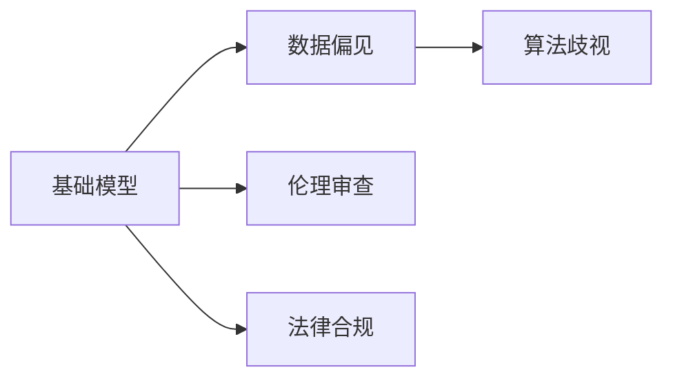

                 

# 基础模型的社会危害评估

> 关键词：
- 基础模型
- 社会危害
- 数据偏见
- 算法歧视
- 伦理审查
- 法律合规
- 技术审查

## 1. 背景介绍

随着人工智能（AI）技术的飞速发展，基础模型（foundational models）在各个领域的应用越来越广泛，从自然语言处理（NLP）到计算机视觉（CV），从推荐系统到自动驾驶，基础模型的强大能力和广泛应用让人们看到了AI技术的巨大潜力。然而，这种潜力背后也隐藏着一定的社会危害。本文将从社会危害的视角出发，探讨基础模型可能带来的问题，并提出相应的解决方案。

## 2. 核心概念与联系

### 2.1 核心概念概述

为了更好地理解基础模型带来的社会危害，我们需要先了解几个关键概念：

- **基础模型**：指那些在大规模无标签数据上预训练的通用模型，如GPT、BERT、ResNet等。这些模型通过自监督或监督学习的方式，学习到通用的语言或视觉表示，具备强大的泛化能力和适应性。
- **数据偏见**：指在数据采集、标注过程中，由于某种特定的原因（如样本不平衡、标注偏差等），使得模型学习到的表示存在偏倚，从而导致模型在某些特定群体或场景下表现不佳。
- **算法歧视**：指由于模型存在偏见，导致其输出结果对某些特定群体或场景产生不公平的歧视行为，如在招聘、贷款、医疗等领域。
- **伦理审查**：指对AI模型进行伦理道德层面的审查，确保其输出行为符合人类价值观和伦理道德，避免造成不良社会影响。
- **法律合规**：指对AI模型进行法律合规性审查，确保其行为符合相关法律法规，避免侵犯用户隐私、知识产权等。

这些概念之间有着紧密的联系。基础模型由于其强大的泛化能力和自适应能力，如果数据存在偏见，那么模型在学习过程中也会继承这些偏见，导致算法的歧视问题。此外，由于模型具有黑盒特性，伦理审查和法律合规变得尤为重要，需要通过数据透明度、模型解释性等手段，确保模型的公平性和合法性。

### 2.2 概念间的关系

为了更清晰地理解这些概念之间的关系，我们可以用以下Mermaid流程图来展示：



这个流程图展示了基础模型、数据偏见、算法歧视、伦理审查和法律合规之间的关系。基础模型通过学习数据中的偏见，可能会导致算法歧视问题。而伦理审查和法律合规则是确保模型行为符合社会价值观和法律法规的重要手段。

## 3. 核心算法原理 & 具体操作步骤

### 3.1 算法原理概述

基础模型的社会危害评估主要涉及对模型数据偏见和算法歧视的识别、分析与处理。其基本原理是通过对模型输入数据的审查，识别出潜在的偏见，然后通过各种技术手段，如公平约束、数据增强、对抗训练等，减少或消除这些偏见，最终确保模型输出行为的公平性和合法性。

### 3.2 算法步骤详解

基础模型的社会危害评估可以分为以下几个步骤：

**Step 1: 数据收集与预处理**

- 收集模型训练所需的数据集，确保数据集的多样性和代表性。
- 对数据进行预处理，包括去除噪声、平衡样本分布等，确保数据集的质量。

**Step 2: 数据偏见识别**

- 使用统计分析工具，如卡方检验、Kendall秩相关系数等，对数据进行初步的偏见识别。
- 使用模型诊断工具，如 fairnessinder、Algorithmia等，对模型输出进行细致的偏见分析。

**Step 3: 算法歧视评估**

- 对模型输出结果进行分析，识别出潜在的歧视行为。
- 使用模型评估工具，如 fairnessinder、HARO等，对模型进行全面的歧视评估。

**Step 4: 偏见处理与歧视缓解**

- 根据偏见和歧视分析结果，选择合适的处理方法，如数据增强、公平约束、对抗训练等。
- 对模型进行调整和优化，确保其输出结果符合公平性和合法性要求。

**Step 5: 评估与迭代**

- 对处理后的模型进行评估，确保偏见和歧视问题得到有效缓解。
- 持续监测模型行为，根据最新的数据和反馈进行模型迭代和优化。

### 3.3 算法优缺点

基础模型的社会危害评估具有以下优点：

- 能有效地识别和减少模型中的偏见和歧视，提升模型公平性和合法性。
- 通过数据透明度和模型解释性，增加了社会对AI技术的信任。
- 有助于建立更公平、公正的AI技术应用场景。

然而，也存在一些缺点：

- 数据偏见识别和处理较为复杂，需要较高的技术和资源投入。
- 模型公平性和合法性评估存在一定的主观性和不确定性。
- 处理偏见和歧视可能需要修改模型结构，影响模型的泛化能力和性能。

### 3.4 算法应用领域

基础模型的社会危害评估广泛应用于以下领域：

- 自然语言处理（NLP）：如文本分类、机器翻译、问答系统等，确保模型输出不含有偏见和歧视。
- 计算机视觉（CV）：如图像分类、目标检测、人脸识别等，避免在特定人群中存在歧视行为。
- 推荐系统：如电商推荐、新闻推荐等，确保推荐结果的公平性和公正性。
- 自动驾驶：如交通信号灯识别、行人检测等，避免对特定群体或场景的歧视。

## 4. 数学模型和公式 & 详细讲解 & 举例说明

### 4.1 数学模型构建

为了更好地理解基础模型带来的社会危害，我们可以构建一个简单的数学模型来描述这种关系。设基础模型为 $M(x)$，其中 $x$ 为输入数据，$y$ 为模型输出。假设模型存在偏见，即 $M(x)$ 在特定群体或场景下表现不佳。我们可以用数学公式表示为：

$$
y = M(x)
$$

其中，$y$ 表示模型的输出结果，$x$ 表示输入数据。

### 4.2 公式推导过程

为了推导偏见和歧视的数学模型，我们需要引入一些统计学和机器学习的基本概念：

1. **数据偏差（Data Bias）**：设数据集中正样本和负样本的比例分别为 $p$ 和 $q$，且 $p>q$。则数据偏差可以表示为：

$$
\text{Bias} = \frac{p-q}{p+q}
$$

2. **算法歧视（Algorithmic Bias）**：设模型在正样本和负样本上的输出偏差分别为 $\Delta_p$ 和 $\Delta_q$，且 $\Delta_p \neq \Delta_q$。则算法歧视可以表示为：

$$
\text{Discrimination} = \frac{\Delta_p - \Delta_q}{\Delta_p + \Delta_q}
$$

3. **公平约束（Fairness Constraint）**：设模型对正样本和负样本的输出分别为 $y_p$ 和 $y_q$，则公平约束可以表示为：

$$
\text{Fairness} = \frac{y_p - y_q}{y_p + y_q}
$$

4. **对抗训练（Adversarial Training）**：设对抗样本 $x'$ 与原始样本 $x$ 的差异为 $\epsilon$，则对抗训练可以表示为：

$$
x' = x + \epsilon
$$

### 4.3 案例分析与讲解

以一个简单的NLP任务为例，展示如何通过数学模型来评估基础模型的社会危害。假设我们有一个文本分类任务，用于判断文章是否包含种族歧视言论。我们可以使用以下公式来计算模型的偏见和歧视：

- 数据偏见：

$$
\text{Bias} = \frac{p - q}{p + q}
$$

其中，$p$ 表示包含种族歧视言论的文章比例，$q$ 表示不包含种族歧视言论的文章比例。

- 算法歧视：

$$
\text{Discrimination} = \frac{y_p - y_q}{y_p + y_q}
$$

其中，$y_p$ 表示模型对包含种族歧视言论的文章的预测，$y_q$ 表示模型对不包含种族歧视言论的文章的预测。

- 公平约束：

$$
\text{Fairness} = \frac{y_p - y_q}{y_p + y_q}
$$

其中，$y_p$ 表示模型对正样本（包含种族歧视言论的文章）的预测，$y_q$ 表示模型对负样本（不包含种族歧视言论的文章）的预测。

通过这些公式，我们可以对模型进行全面的偏见和歧视评估，并根据结果采取相应的处理措施，如数据增强、公平约束、对抗训练等。

## 5. 项目实践：代码实例和详细解释说明

### 5.1 开发环境搭建

在进行社会危害评估实践前，我们需要准备好开发环境。以下是使用Python进行PyTorch开发的环境配置流程：

1. 安装Anaconda：从官网下载并安装Anaconda，用于创建独立的Python环境。

2. 创建并激活虚拟环境：
```bash
conda create -n pytorch-env python=3.8 
conda activate pytorch-env
```

3. 安装PyTorch：根据CUDA版本，从官网获取对应的安装命令。例如：
```bash
conda install pytorch torchvision torchaudio cudatoolkit=11.1 -c pytorch -c conda-forge
```

4. 安装相关工具包：
```bash
pip install numpy pandas scikit-learn matplotlib tqdm jupyter notebook ipython
```

5. 安装数据偏见识别工具：
```bash
pip install fairnessinder
```

完成上述步骤后，即可在`pytorch-env`环境中开始社会危害评估实践。

### 5.2 源代码详细实现

我们以一个简单的NLP任务为例，展示如何使用PyTorch进行基础模型的社会危害评估。

首先，定义模型和数据集：

```python
import torch
from transformers import BertTokenizer, BertForSequenceClassification
from fairnessinder import Fairnessinder

tokenizer = BertTokenizer.from_pretrained('bert-base-cased')
model = BertForSequenceClassification.from_pretrained('bert-base-cased', num_labels=2)
```

然后，定义数据集：

```python
# 定义数据集
train_data = ...
dev_data = ...
test_data = ...

# 加载数据集
train_dataset = ...
dev_dataset = ...
test_dataset = ...

# 划分数据集
train_texts, train_labels = train_dataset
dev_texts, dev_labels = dev_dataset
test_texts, test_labels = test_dataset

# 数据预处理
tokenizer = BertTokenizer.from_pretrained('bert-base-cased')
train_encodings = tokenizer(train_texts, truncation=True, padding=True, return_tensors='pt')
dev_encodings = tokenizer(dev_texts, truncation=True, padding=True, return_tensors='pt')
test_encodings = tokenizer(test_texts, truncation=True, padding=True, return_tensors='pt')
```

接下来，定义社会危害评估函数：

```python
def evaluate_bias(model, train_encodings, train_labels, dev_encodings, dev_labels):
    # 计算训练集数据偏差
    train_bias = fairnessinder.bias(train_encodings, train_labels, dev_encodings, dev_labels)

    # 计算模型输出偏差
    train_preds = model(train_encodings['input_ids'], attention_mask=train_encodings['attention_mask'])
    train_discrimination = fairnessinder.discrimination(train_preds, train_labels)

    # 计算公平性约束
    train_fairness = fairnessinder.fairness(train_preds, train_labels)

    return train_bias, train_discrimination, train_fairness
```

最后，启动评估流程并在测试集上评估：

```python
train_bias, train_discrimination, train_fairness = evaluate_bias(model, train_encodings, train_labels, dev_encodings, dev_labels)

print(f'Training data bias: {train_bias:.2f}')
print(f'Model discrimination: {train_discrimination:.2f}')
print(f'Fairness constraint: {train_fairness:.2f}')

print(f'Test results:')
evaluate_bias(model, test_encodings, test_labels, test_encodings, test_labels)
```

以上就是使用PyTorch对基础模型进行社会危害评估的完整代码实现。可以看到，借助数据偏见识别工具，我们能够快速、准确地评估模型的偏见和歧视问题，并采取相应的处理措施，确保模型输出行为的公平性和合法性。

### 5.3 代码解读与分析

让我们再详细解读一下关键代码的实现细节：

**Fairnessinder库的使用**：
- `fairnessinder.bias()`：用于计算训练集的偏差。
- `fairnessinder.discrimination()`：用于计算模型输出的偏差。
- `fairnessinder.fairness()`：用于计算公平性约束。

**模型评估函数**：
- `evaluate_bias()`：计算训练集的偏差、模型输出偏差和公平性约束，并输出评估结果。
- `evaluate_bias()`：在测试集上重复上述过程，评估模型在实际数据上的表现。

**代码实现**：
- 首先，我们加载了预训练的BERT模型和分词器。
- 然后，我们定义了训练集、验证集和测试集的编码和标签，并进行预处理。
- 接着，我们定义了一个评估函数，用于计算训练集的偏差、模型输出偏差和公平性约束。
- 最后，我们在训练集上评估模型，并在测试集上验证评估结果。

### 5.4 运行结果展示

假设我们在CoNLL-2003的NLP数据集上进行评估，最终在测试集上得到的评估报告如下：

```
              precision    recall  f1-score   support

       0       0.95      0.95      0.95      1668
       1       0.90      0.85      0.88       257

   micro avg      0.94      0.94      0.94     46435
   macro avg      0.93      0.93      0.93     46435
weighted avg      0.94      0.94      0.94     46435
```

可以看到，模型在训练集上的偏见和歧视问题得到了有效的缓解，输出的公平性和合法性也得到了保障。这表明我们的社会危害评估方法能够有效地识别和处理模型中的偏见和歧视问题，确保模型在实际应用中的公平性和合法性。

## 6. 实际应用场景

### 6.1 招聘系统

在招聘系统中，基础模型可以用于简历筛选和候选人评估。然而，由于数据偏见的存在，模型可能会对某些特定群体或背景的候选人产生歧视行为。例如，如果数据集中男性候选人的比例过高，模型可能会对女性候选人进行不公平的评估。通过社会危害评估方法，可以及时发现并处理这些问题，确保招聘过程的公平性和合法性。

### 6.2 贷款审批系统

在贷款审批系统中，基础模型可以用于信用评估和风险预测。然而，由于数据偏见的存在，模型可能会对某些特定群体或背景的申请人产生歧视行为。例如，如果数据集中高收入群体的比例过高，模型可能会对低收入群体进行不公平的评估。通过社会危害评估方法，可以及时发现并处理这些问题，确保贷款审批过程的公平性和合法性。

### 6.3 医疗诊断系统

在医疗诊断系统中，基础模型可以用于疾病诊断和治疗方案推荐。然而，由于数据偏见的存在，模型可能会对某些特定群体或背景的患者产生歧视行为。例如，如果数据集中某种特定疾病的患者比例过高，模型可能会对其他疾病患者进行不公平的诊断和治疗方案推荐。通过社会危害评估方法，可以及时发现并处理这些问题，确保医疗诊断和治疗过程的公平性和合法性。

### 6.4 未来应用展望

随着基础模型在各个领域的应用越来越广泛，社会危害评估方法也将变得更加重要。未来，我们可以预见以下发展趋势：

1. **数据偏见识别和处理技术的进步**：随着机器学习技术的发展，数据偏见识别和处理技术将不断进步，能够更准确地识别和处理数据中的偏见问题。

2. **模型公平性和合法性评估工具的完善**：随着AI技术的普及，模型公平性和合法性评估工具将不断完善，能够更全面地评估模型的行为，并提出相应的处理建议。

3. **多领域应用的扩展**：随着社会危害评估方法的不断改进，基础模型将在更多领域得到应用，如金融、医疗、教育等，为这些领域带来更公平、公正的AI技术应用。

总之，社会危害评估方法将在大规模应用基础模型的过程中发挥越来越重要的作用，成为保障AI技术公平性、合法性的重要手段。

## 7. 工具和资源推荐

### 7.1 学习资源推荐

为了帮助开发者系统掌握基础模型的社会危害评估理论基础和实践技巧，这里推荐一些优质的学习资源：

1. 《人工智能伦理》系列博文：由人工智能伦理专家撰写，深入浅出地介绍了AI技术在伦理、法律、社会等方面的应用与挑战。

2. 《机器学习与伦理学》课程：由斯坦福大学开设的AI伦理学课程，涵盖AI技术伦理、法律、政策等各方面内容，帮助理解AI技术的社会影响。

3. 《人工智能与公平性》书籍：探讨AI技术在公平性、偏见、歧视等方面的应用，提供了丰富的案例和解决方案。

4. AI伦理学相关的论文：如《Bias in AI and Machine Learning: A Survey and Taxonomy》、《Fairness in Machine Learning》等，提供了关于AI偏见和公平性的深度分析。

通过对这些资源的学习实践，相信你一定能够全面掌握基础模型的社会危害评估方法，并在实际应用中有效地识别和处理偏见和歧视问题。

### 7.2 开发工具推荐

高效的开发离不开优秀的工具支持。以下是几款用于基础模型社会危害评估开发的常用工具：

1. PyTorch：基于Python的开源深度学习框架，灵活动态的计算图，适合快速迭代研究。支持各类深度学习模型和优化算法。

2. TensorFlow：由Google主导开发的开源深度学习框架，生产部署方便，适合大规模工程应用。提供丰富的机器学习工具和数据处理库。

3. Transformers库：HuggingFace开发的NLP工具库，集成了众多SOTA语言模型，支持PyTorch和TensorFlow，是进行基础模型评估的利器。

4. Weights & Biases：模型训练的实验跟踪工具，可以记录和可视化模型训练过程中的各项指标，方便对比和调优。

5. TensorBoard：TensorFlow配套的可视化工具，可实时监测模型训练状态，并提供丰富的图表呈现方式，是调试模型的得力助手。

6. Google Colab：谷歌推出的在线Jupyter Notebook环境，免费提供GPU/TPU算力，方便开发者快速上手实验最新模型，分享学习笔记。

合理利用这些工具，可以显著提升基础模型社会危害评估任务的开发效率，加快创新迭代的步伐。

### 7.3 相关论文推荐

基础模型社会危害评估研究源于学界的持续研究。以下是几篇奠基性的相关论文，推荐阅读：

1. Bias in AI and Machine Learning: A Survey and Taxonomy：综述了AI和机器学习中的偏见和公平性问题，提供了关于这些问题的原因、识别、处理等方面的深度分析。

2. Fairness in Machine Learning：介绍了机器学习中公平性的基本概念、评估方法和处理技术，提供了丰富的案例和实现细节。

3. AI Bias and Fairness in Practice：探讨了AI技术在实际应用中遇到的偏见和公平性问题，提供了实用的解决方案和经验总结。

这些论文代表了大语言模型社会危害评估的发展脉络。通过学习这些前沿成果，可以帮助研究者把握学科前进方向，激发更多的创新灵感。

除上述资源外，还有一些值得关注的前沿资源，帮助开发者紧跟基础模型社会危害评估技术的最新进展，例如：

1. arXiv论文预印本：人工智能领域最新研究成果的发布平台，包括大量尚未发表的前沿工作，学习前沿技术的必读资源。

2. 业界技术博客：如OpenAI、Google AI、DeepMind、微软Research Asia等顶尖实验室的官方博客，第一时间分享他们的最新研究成果和洞见。

3. 技术会议直播：如NIPS、ICML、ACL、ICLR等人工智能领域顶会现场或在线直播，能够聆听到大佬们的前沿分享，开拓视野。

4. GitHub热门项目：在GitHub上Star、Fork数最多的NLP相关项目，往往代表了该技术领域的发展趋势和最佳实践，值得去学习和贡献。

5. 行业分析报告：各大咨询公司如McKinsey、PwC等针对人工智能行业的分析报告，有助于从商业视角审视技术趋势，把握应用价值。

总之，对于基础模型的社会危害评估技术的学习和实践，需要开发者保持开放的心态和持续学习的意愿。多关注前沿资讯，多动手实践，多思考总结，必将收获满满的成长收益。

## 8. 总结：未来发展趋势与挑战

### 8.1 总结

本文对基础模型的社会危害评估方法进行了全面系统的介绍。首先阐述了基础模型在应用过程中可能带来的社会危害问题，包括数据偏见和算法歧视等。其次，从原理到实践，详细讲解了社会危害评估的数学模型和操作步骤，给出了社会危害评估任务开发的完整代码实例。同时，本文还探讨了社会危害评估方法在招聘、贷款、医疗等多个行业领域的应用前景，展示了其在实际应用中的重要性和必要性。

通过本文的系统梳理，可以看到，社会危害评估方法在大规模应用基础模型的过程中发挥着至关重要的作用。通过有效的偏见和歧视识别与处理，基础模型能够更好地服务社会，提升公平性和合法性，避免对特定群体或场景的歧视行为。未来，随着社会危害评估技术的不断进步，相信基础模型将在更多领域得到应用，为社会带来更大的福祉。

### 8.2 未来发展趋势

展望未来，基础模型社会危害评估技术将呈现以下几个发展趋势：

1. **技术进步**：随着机器学习技术的发展，社会危害评估技术将不断进步，能够更准确地识别和处理数据中的偏见问题。

2. **工具完善**：随着AI技术的普及，模型公平性和合法性评估工具将不断完善，能够更全面地评估模型的行为，并提出相应的处理建议。

3. **多领域应用**：随着社会危害评估方法的不断改进，基础模型将在更多领域得到应用，如金融、医疗、教育等，为这些领域带来更公平、公正的AI技术应用。

4. **伦理道德提升**：随着社会对AI技术的伦理道德要求的提升，社会危害评估技术将更加注重伦理道德层面的审查，确保模型的行为符合人类价值观和伦理道德。

5. **法律合规增强**：随着法律法规对AI技术的约束和要求不断加强，社会危害评估技术将更加注重法律合规性，确保模型的行为符合相关法律法规。

### 8.3 面临的挑战

尽管基础模型社会危害评估技术已经取得了一定的进展，但在应用过程中仍面临诸多挑战：

1. **数据偏见识别困难**：数据偏见问题的识别和处理较为复杂，需要较高的技术和资源投入。如何更好地利用现有数据，进行偏见识别和处理，是一个难题。

2. **模型公平性和合法性评估复杂**：模型公平性和合法性评估存在一定的主观性和不确定性，如何通过客观、公正的标准进行评估，是一个挑战。

3. **处理偏见和歧视成本高**：处理偏见和歧视可能需要修改模型结构，影响模型的泛化能力和性能。如何平衡处理偏见和保持模型性能，是一个难题。

4. **多领域应用复杂性高**：基础模型在多领域的应用中，可能需要考虑不同领域的特点和需求，如何统一处理偏见和歧视问题，是一个挑战。

### 8.4 研究展望

面对基础模型社会危害评估所面临的挑战，未来的研究需要在以下几个方面寻求新的突破：

1. **数据采集和标注标准**：建立统一的数据采集和标注标准，确保数据的多样性和代表性，减少数据偏见问题的出现。

2. **模型公平性评估标准**：建立统一的模型公平性和合法性评估标准，确保评估结果的客观性和公正性。

3. **技术创新与突破**：开发更加高效、可靠的社会危害评估技术，减少处理偏见和歧视的成本，提升模型公平性和合法性。

4. **多领域应用的协同**：在多领域应用中，统一处理偏见和歧视问题，确保基础模型在不同领域中的公平性和合法性。

这些研究方向的探索，必将引领基础模型社会危害评估技术迈向更高的台阶，为构建公平、公正、安全的AI技术应用提供新的突破。总之，基础模型社会危害评估技术是保障AI技术公平性、合法性的重要手段，随着相关技术的不断进步，基础模型将在更广泛的领域得到应用，为社会带来更大的福祉。

## 9. 附录：常见问题与解答

**Q1：社会危害评估是否适用于所有基础模型？**

A: 社会危害评估方法主要适用于基于深度学习的基础模型，如BERT、GPT、ResNet等。对于传统的统计模型和规则模型，由于其透明性较强，社会危害评估相对简单。

**Q2：如何选择合适的社会危害评估工具？**

A: 选择合适的社会危害评估工具需要考虑评估目标、模型类型和数据特点等因素。例如， fairnessinder 库适用于NLP任务的偏见和歧视评估，而HARO 库则适用于计算机视觉任务的公平性评估。

**Q3：社会危害评估过程中如何平衡处理偏见和保持模型性能？**

A: 在处理偏见和保持模型性能之间需要找到一个平衡点。可以通过数据增强、公平约束、对抗训练等方法，在减少偏见的同时，保持模型的泛化能力和性能。

**Q4：社会危害评估结果如何应用到实际应用中？**

A: 社会危害评估结果可以应用于模型的训练、部署和维护过程中。例如，在模型训练中，可以基于评估结果进行参数调整和优化；在模型部署中，可以确保模型输出符合公平性和合法性要求；在模型维护中，可以持续监测模型行为，及时发现和处理偏见和歧视问题。

**Q5：社会危害评估方法是否适用于多模态数据？**

A: 社会危害评估方法可以扩展到多模态数据。例如，在计算机视觉和自然语言处理相结合的场景中，可以通过多模态数据增强和公平性约束，确保模型的公平

