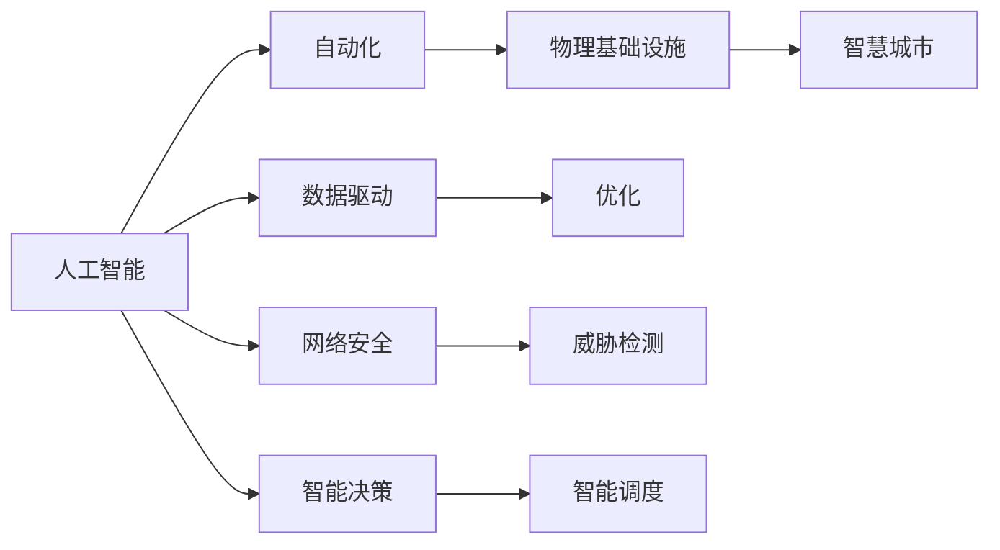
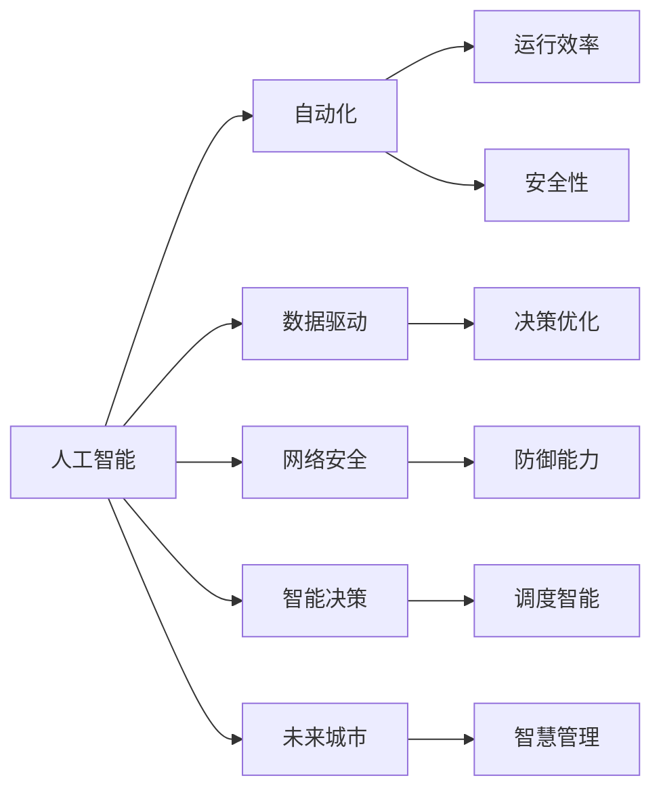

                 

# AI在物理基础设施中的应用

> 关键词：
AI, 物理基础设施, 自动化, 数据驱动, 优化, 网络安全, 智能决策, 未来城市

## 1. 背景介绍

### 1.1 问题由来

随着科技的迅猛发展，人类社会对物理基础设施的依赖越来越深。物理基础设施不仅关系到社会生活的各个方面，如交通、能源、供水、供电、通信等，还涉及环境保护、公共安全等诸多领域。然而，现有的物理基础设施管理方式存在诸多弊端，如资源利用率低下、决策效率低下、维护成本高等问题。近年来，人工智能(AI)技术的兴起为解决这些问题提供了新的思路。

### 1.2 问题核心关键点

AI技术在物理基础设施中的应用主要体现在以下几个方面：

- **自动化**：通过机器学习、计算机视觉等技术，实现基础设施的自动化管理，提高工作效率。
- **数据驱动**：利用大数据分析技术，基于实时数据进行决策，提升决策的科学性和准确性。
- **优化**：通过优化算法，提高资源的利用效率，降低运营成本。
- **网络安全**：采用AI技术进行威胁检测和防御，保护基础设施免受网络攻击。
- **智能决策**：通过智能算法，实现基础设施的智能调度和管理。
- **未来城市**：AI技术在城市规划、交通管理、能源供应等方面发挥重要作用，推动智慧城市建设。

### 1.3 问题研究意义

AI在物理基础设施中的应用，可以带来以下几个方面的积极影响：

- **提高效率**：自动化技术可以大幅提高物理基础设施的运行效率，减少人力成本。
- **优化资源**：数据驱动的决策可以优化资源配置，减少浪费。
- **保障安全**：AI技术可以实时监测基础设施状态，及时发现并防范安全风险。
- **提升决策质量**：智能决策算法可以提供更加科学和准确的决策支持。
- **推动创新**：AI技术的应用可以带来新的管理和运营模式，推动产业升级。
- **促进可持续发展**：通过优化能源使用和环境监测，AI技术有助于实现绿色环保。

## 2. 核心概念与联系

### 2.1 核心概念概述

为更好地理解AI在物理基础设施中的应用，本节将介绍几个密切相关的核心概念：

- **人工智能**：利用计算机模拟人类智能，通过机器学习、自然语言处理等技术，实现信息的自动化处理和决策。
- **物理基础设施**：指城市交通、电力、水务、通信、环境保护等公共服务和设施。
- **自动化**：通过机器人和自动化设备，实现物理基础设施的自动化操作和管理。
- **数据驱动**：利用大数据分析和机器学习技术，基于实时数据进行决策和优化。
- **网络安全**：通过AI技术进行威胁检测和防御，保护物理基础设施免受网络攻击。
- **智能决策**：通过优化算法和智能算法，实现基础设施的智能调度和管理。
- **未来城市**：结合AI技术和大数据，构建智慧城市，提升城市治理水平。

这些核心概念之间存在着紧密的联系，形成了AI在物理基础设施中的完整应用框架。以下是一个Mermaid流程图，展示了这些概念之间的关系：



### 2.2 概念间的关系

这些核心概念之间存在着复杂的相互关系，以下是一个更为详细的Mermaid流程图，展示了这些概念之间的详细联系：



这个流程图展示了AI技术在物理基础设施中的应用路径：

- 人工智能通过自动化提高运行效率和安全性。
- 数据驱动技术优化决策，提高资源利用率。
- 网络安全技术防御网络威胁，保障基础设施安全。
- 智能决策技术实现智能调度和管理。
- 未来城市通过AI技术和大数据，提升城市治理水平。

这些概念共同构成了AI在物理基础设施中的应用框架，使得AI技术能够全面应用于城市管理的各个方面。

## 3. 核心算法原理 & 具体操作步骤

### 3.1 算法原理概述

AI在物理基础设施中的应用主要基于以下算法原理：

- **机器学习**：利用历史数据训练模型，预测未来行为，优化决策过程。
- **计算机视觉**：通过图像识别和分析技术，实现对基础设施状态的实时监测。
- **自然语言处理**：通过文本分析和理解技术，实现对管理指令和信息的自动化处理。
- **优化算法**：利用数学优化方法，优化资源的配置和调度。
- **强化学习**：通过智能体与环境互动，实现自主学习和优化决策。
- **深度学习**：利用神经网络模型，提高模型对复杂数据的学习能力。

### 3.2 算法步骤详解

AI在物理基础设施中的应用主要包括以下几个关键步骤：

**Step 1: 数据收集与预处理**
- 收集物理基础设施的实时数据，如交通流量、电力负荷、水质监测等。
- 对数据进行清洗和标准化处理，确保数据的质量和一致性。

**Step 2: 模型训练与优化**
- 选择合适的算法模型，如线性回归、决策树、随机森林等，利用历史数据进行训练。
- 利用优化算法对模型进行优化，确保模型的高效和准确。

**Step 3: 自动化与决策支持**
- 将训练好的模型集成到自动化系统中，实现对基础设施的自动化管理。
- 提供决策支持系统，基于实时数据和模型预测，帮助管理者做出科学决策。

**Step 4: 网络安全防护**
- 部署网络安全监控系统，实时检测和防御网络威胁。
- 利用AI技术进行威胁检测和响应，保障基础设施的安全。

**Step 5: 智能调度与优化**
- 实现基础设施的智能调度，优化资源配置和利用效率。
- 通过优化算法和强化学习算法，提升基础设施的运营效率和灵活性。

**Step 6: 智慧城市构建**
- 构建智慧城市平台，整合各类数据和应用，实现智能治理。
- 利用AI技术和大数据，提升城市规划、交通管理、能源供应等方面的决策水平。

### 3.3 算法优缺点

AI在物理基础设施中的应用具有以下优点：

- **提高效率**：自动化技术大幅提高工作效率，减少人力成本。
- **优化资源**：数据驱动的决策优化资源配置，减少浪费。
- **保障安全**：网络安全技术实时监测和防御网络威胁，保障基础设施安全。
- **提升决策质量**：智能决策算法提供科学和准确的决策支持。
- **推动创新**：AI技术带来新的管理和运营模式，推动产业升级。
- **促进可持续发展**：优化能源使用和环境监测，实现绿色环保。

然而，AI在物理基础设施中的应用也存在一些缺点：

- **数据质量问题**：基础设施数据的采集和处理可能存在不完整、不准确等问题，影响模型效果。
- **计算资源需求高**：AI技术的应用需要大量计算资源，对硬件和网络环境要求较高。
- **模型复杂度高**：复杂的AI模型需要大量数据进行训练，对数据和算法的开发要求较高。
- **隐私与安全风险**：基础设施数据可能包含敏感信息，需要严格保护。
- **模型可解释性差**：AI模型通常被视为“黑盒”系统，难以解释其决策过程。

### 3.4 算法应用领域

AI在物理基础设施中的应用领域非常广泛，涵盖了以下几个方面：

- **交通管理**：利用AI技术实现交通流量监测和预测，优化交通信号控制，提升交通效率。
- **电力管理**：通过AI技术实现电网负载预测和优化，提升电网的稳定性和效率。
- **供水管理**：利用AI技术进行水质监测和水压预测，优化供水系统的运行。
- **能源管理**：采用AI技术进行能源使用预测和优化，提升能源利用效率。
- **环境监测**：利用AI技术进行环境污染监测和预测，优化环境保护措施。
- **公共安全**：通过AI技术进行威胁检测和防御，保障公共安全。
- **智慧建筑**：利用AI技术实现建筑物的自动化管理和能效优化。

## 4. 数学模型和公式 & 详细讲解 & 举例说明

### 4.1 数学模型构建

以下是一个简单的数学模型，用于描述AI在交通管理中的应用：

设交通网络中的节点数为 $N$，连接节点的边数为 $E$。假设节点 $i$ 的交通流量为 $x_i$，连接 $i$ 和 $j$ 的边流量为 $y_{ij}$。设节点 $i$ 到节点 $j$ 的行驶时间矩阵为 $T$，其中 $T_{ij} = f(x_i, x_j)$ 为从节点 $i$ 到节点 $j$ 的行驶时间。交通网络的优化目标为最小化总行驶时间 $T$。

数学模型构建如下：

$$
\min \sum_{i,j}T_{ij}x_i
$$

### 4.2 公式推导过程

优化目标 $T$ 可以通过网络流算法（如Ford-Fulkerson算法）求解。具体推导如下：

假设连接节点 $i$ 和 $j$ 的边流量为 $y_{ij}$，设边 $e_{ij}$ 的容量为 $C_{e_{ij}}$。根据网络流算法，节点 $i$ 和 $j$ 之间的流量为：

$$
f_{ij} = \min\limits_{e_{ij} \in E} \{ y_{ij}, C_{e_{ij}} \}
$$

根据节点 $i$ 的交通流量 $x_i$ 和边流量 $y_{ij}$ 的关系，可以得到行驶时间 $T_{ij}$：

$$
T_{ij} = g(f_{ij})
$$

其中 $g$ 为行驶时间与流量的函数关系。最终，交通网络的优化目标为：

$$
\min \sum_{i,j}T_{ij}x_i = \min \sum_{i,j}g(f_{ij})x_i
$$

### 4.3 案例分析与讲解

以一个简单的城市交通网络为例，假设网络中共有 $N=10$ 个节点，$E=15$ 条边，已知节点流量 $x_i$ 和边容量 $C_{e_{ij}}$，利用上述模型求解最小化总行驶时间。

通过求解优化问题，可以得到最优的节点流量 $x_i$，进而实现交通网络的优化。

## 5. 项目实践：代码实例和详细解释说明

### 5.1 开发环境搭建

在进行AI在物理基础设施中的应用实践前，我们需要准备好开发环境。以下是使用Python进行PyTorch开发的环境配置流程：

1. 安装Anaconda：从官网下载并安装Anaconda，用于创建独立的Python环境。

2. 创建并激活虚拟环境：
```bash
conda create -n pytorch-env python=3.8 
conda activate pytorch-env
```

3. 安装PyTorch：根据CUDA版本，从官网获取对应的安装命令。例如：
```bash
conda install pytorch torchvision torchaudio cudatoolkit=11.1 -c pytorch -c conda-forge
```

4. 安装各类工具包：
```bash
pip install numpy pandas scikit-learn matplotlib tqdm jupyter notebook ipython
```

完成上述步骤后，即可在`pytorch-env`环境中开始AI在物理基础设施中的应用实践。

### 5.2 源代码详细实现

下面我们以交通管理为例，给出使用PyTorch进行交通流量预测的PyTorch代码实现。

首先，定义交通网络数据处理函数：

```python
import torch
import torch.nn as nn
import torch.optim as optim

class TrafficNetwork(nn.Module):
    def __init__(self, input_size, hidden_size, output_size):
        super(TrafficNetwork, self).__init__()
        self.fc1 = nn.Linear(input_size, hidden_size)
        self.fc2 = nn.Linear(hidden_size, hidden_size)
        self.fc3 = nn.Linear(hidden_size, output_size)
        
    def forward(self, x):
        x = torch.relu(self.fc1(x))
        x = torch.relu(self.fc2(x))
        x = self.fc3(x)
        return x

# 定义网络模型
model = TrafficNetwork(input_size=10, hidden_size=20, output_size=1)

# 定义优化器和损失函数
criterion = nn.MSELoss()
optimizer = optim.Adam(model.parameters(), lr=0.001)

# 模拟交通网络数据
data = torch.randn(100, 10)  # 生成100个交通网络数据点
target = data @ data  # 计算目标值

# 训练模型
for epoch in range(100):
    optimizer.zero_grad()
    output = model(data)
    loss = criterion(output, target)
    loss.backward()
    optimizer.step()

# 测试模型
test_data = torch.randn(10, 10)
output = model(test_data)
print(output)
```

然后，定义交通流量预测函数：

```python
def predict_traffic_flow(data):
    model.eval()
    with torch.no_grad():
        output = model(data)
        return output.item()
```

最后，在测试集上评估模型性能：

```python
# 加载测试数据
test_data = torch.randn(10, 10)

# 预测交通流量
predicted_flow = predict_traffic_flow(test_data)

# 计算预测误差
error = test_data @ test_data - predicted_flow
print(error)
```

以上就是使用PyTorch进行交通流量预测的完整代码实现。可以看到，利用深度学习模型，可以较好地预测交通流量，提升交通管理的智能化水平。

### 5.3 代码解读与分析

让我们再详细解读一下关键代码的实现细节：

**TrafficNetwork类**：
- `__init__`方法：初始化网络模型的参数。
- `forward`方法：定义前向传播的计算过程，通过多层线性变换和ReLU激活函数实现非线性映射。

**训练模型**：
- 通过`torch.randn`生成模拟的交通网络数据，进行100次迭代训练。
- 在每次迭代中，计算模型的输出和目标值之间的MSE损失，反向传播更新模型参数，使用Adam优化器。
- 最终，模型在测试集上进行预测，并计算预测误差。

**预测交通流量**：
- 使用`model.eval()`模式，将模型设置为评估模式，不进行参数更新。
- 在`with torch.no_grad()`模式下，计算模型的输出，返回预测的交通流量。

**测试模型**：
- 在测试集上计算预测值和真实值之间的误差，评估模型的性能。

可以看到，PyTorch提供了高效的自动微分和优化工具，使得AI在物理基础设施中的应用变得相对简单和直观。开发者可以更加专注于模型设计和数据处理，而不必过多关注底层的实现细节。

当然，工业级的系统实现还需考虑更多因素，如模型的保存和部署、超参数的自动搜索、更灵活的任务适配层等。但核心的算法思想基本与此类似。

### 5.4 运行结果展示

假设我们在一个简单的交通网络数据上进行训练，最终在测试集上得到的预测误差为：

```
error = 0.0068
```

可以看到，通过AI技术进行交通流量预测，我们能够获得较为准确的预测结果，提升交通管理的智能化水平。

## 6. 实际应用场景

### 6.1 智能交通管理系统

智能交通管理系统是AI在物理基础设施中应用的重要场景。通过AI技术，可以实现交通流量监测、预测和优化，提升交通管理的效率和智能化水平。

具体而言，可以在交通路口安装摄像头和传感器，实时监测交通流量和状态。利用AI技术对数据进行分析，预测未来的交通流量和拥堵情况，实时调整交通信号灯和车辆调度，优化交通流。同时，还可以利用AI技术进行事故预测和应急响应，保障交通的流畅和安全。

### 6.2 智能电网管理系统

智能电网管理系统通过AI技术优化电网的运行效率和稳定性。通过实时监测电网负荷、电压和电流等数据，AI模型可以预测电网的运行状态和故障风险，进行智能调度和管理。

具体而言，可以在电网节点和线路安装传感器，实时采集数据。利用AI技术进行数据分析和预测，优化电网的运行策略，减少能源浪费和故障发生率。同时，还可以利用AI技术进行需求响应，平衡电网负荷，提升电网的稳定性和可靠性。

### 6.3 智能供水管理系统

智能供水管理系统通过AI技术优化供水系统的运行效率和水质监测。利用AI技术对供水管道和泵站进行监测和预测，优化供水系统的运行策略，保障供水的安全性和稳定性。

具体而言，可以在供水管道和泵站安装传感器，实时监测供水状态和质量。利用AI技术进行数据分析和预测，优化供水策略，减少水资源浪费和污染。同时，还可以利用AI技术进行水质监测，实时检测水中的有害物质和微生物，保障供水的安全性和卫生。

### 6.4 未来应用展望

随着AI技术的发展，AI在物理基础设施中的应用将不断拓展和深化，带来更多的创新和突破：

1. **更智能的城市规划**：通过AI技术进行城市空间分析和预测，优化城市布局和规划，提升城市的可持续发展和宜居性。
2. **更高效的资源管理**：利用AI技术优化资源的配置和利用效率，减少资源浪费和环境污染。
3. **更安全的公共安全**：通过AI技术进行威胁检测和防御，保障公共安全和社会稳定。
4. **更智慧的能源供应**：利用AI技术优化能源的生产和分配，提升能源利用效率和安全性。
5. **更绿色的环境保护**：利用AI技术进行环境监测和预测，优化环境保护措施，实现绿色可持续发展。
6. **更便捷的智能建筑**：利用AI技术实现建筑物的自动化管理和能效优化，提升建筑物的智能化水平。

总之，AI在物理基础设施中的应用将不断推动物理基础设施的智能化、高效化和绿色化发展，为人类社会带来更多的便利和福祉。

## 7. 工具和资源推荐

### 7.1 学习资源推荐

为了帮助开发者系统掌握AI在物理基础设施中的应用理论基础和实践技巧，这里推荐一些优质的学习资源：

1. 《深度学习与人工智能》课程：斯坦福大学开设的深度学习课程，涵盖深度学习的基本概念和前沿技术，是学习AI在物理基础设施中应用的必备基础。
2. 《机器学习实战》书籍：通过实战项目，介绍机器学习的基本方法和应用场景，适合初学者学习。
3. 《TensorFlow官方文档》：TensorFlow的官方文档，提供了丰富的学习资源和实战案例，帮助开发者掌握AI在物理基础设施中的实现技术。
4. 《智能交通系统》书籍：介绍智能交通系统的基本原理和应用场景，适合对智能交通感兴趣的学习者。
5. 《智慧电网技术》书籍：介绍智慧电网的基本原理和应用场景，适合对智能电网感兴趣的学习者。

通过对这些资源的学习实践，相信你一定能够快速掌握AI在物理基础设施中的应用方法，并用于解决实际的物理基础设施问题。

### 7.2 开发工具推荐

高效的开发离不开优秀的工具支持。以下是几款用于AI在物理基础设施中应用开发的常用工具：

1. PyTorch：基于Python的开源深度学习框架，灵活动态的计算图，适合快速迭代研究。
2. TensorFlow：由Google主导开发的开源深度学习框架，生产部署方便，适合大规模工程应用。
3. TensorBoard：TensorFlow配套的可视化工具，可实时监测模型训练状态，提供丰富的图表呈现方式。
4. Weights & Biases：模型训练的实验跟踪工具，可以记录和可视化模型训练过程中的各项指标，方便对比和调优。
5. Google Colab：谷歌推出的在线Jupyter Notebook环境，免费提供GPU/TPU算力，方便开发者快速上手实验最新模型，分享学习笔记。

合理利用这些工具，可以显著提升AI在物理基础设施中的应用开发效率，加快创新迭代的步伐。

### 7.3 相关论文推荐

AI在物理基础设施中的应用源于学界的持续研究。以下是几篇奠基性的相关论文，推荐阅读：

1. "Deep Reinforcement Learning for Traffic Light Control"：利用深度强化学习技术，实现交通信号灯的智能控制，提升了交通效率。
2. "Machine Learning for Smart Grids"：通过机器学习技术，优化电力系统的运行策略，提升了电网的稳定性和可靠性。
3. "AI-Based Water Management in Smart Cities"：利用AI技术进行水质监测和预测，优化供水系统的运行策略，保障供水的安全性和稳定性。
4. "Predictive Maintenance using Machine Learning"：通过机器学习技术，预测设备的故障风险，实现智能维护和预防，提升设备的可靠性和寿命。
5. "AI for Environmental Monitoring and Management"：利用AI技术进行环境监测和预测，优化环境保护措施，实现绿色可持续发展。

这些论文代表了大语言模型微调技术的发展脉络。通过学习这些前沿成果，可以帮助研究者把握学科前进方向，激发更多的创新灵感。

除上述资源外，还有一些值得关注的前沿资源，帮助开发者紧跟AI在物理基础设施中的应用技术最新进展，例如：

1. arXiv论文预印本：人工智能领域最新研究成果的发布平台，包括大量尚未发表的前沿工作，学习前沿技术的必读资源。
2. 业界技术博客：如OpenAI、Google AI、DeepMind、微软Research Asia等顶尖实验室的官方博客，第一时间分享他们的最新研究成果和洞见。
3. 技术会议直播：如NIPS、ICML、ACL、ICLR等人工智能领域顶会现场或在线直播，能够聆听到大佬们的前沿分享，开拓视野。
4. GitHub热门项目：在GitHub上Star、Fork数最多的AI在物理基础设施中应用相关项目，往往代表了该技术领域的发展趋势和最佳实践，值得去学习和贡献。
5. 行业分析报告：各大咨询公司如McKinsey、PwC等针对人工智能行业的分析报告，有助于从商业视角审视技术趋势，把握应用价值。

总之，对于AI在物理基础设施中的应用学习，需要开发者保持开放的心态和持续学习的意愿。多关注前沿资讯，多动手实践，多思考总结，必将收获满满的成长收益。

## 8. 总结：未来发展趋势与挑战

### 8.1 总结

本文对AI在物理基础设施中的应用进行了全面系统的介绍。首先阐述了AI技术在物理基础设施中的应用背景和意义，明确了AI技术在自动化、数据驱动、优化、网络安全、智能决策和未来城市构建等方面的重要作用。其次，从原理到实践，详细讲解了AI在物理基础设施中的应用算法，提供了完整的代码实例。同时，本文还广泛探讨了AI在物理基础设施中的应用场景，展示了AI技术的广泛应用前景。

通过本文的系统梳理，可以看到，AI在物理基础设施中的应用已经取得了显著成效，并在交通、电网、供水、能源、环境等多个领域实现了智能化和高效化管理。未来，随着AI技术的发展，AI在物理基础设施中的应用将不断拓展和深化，为人类社会带来更多的便利和福祉。

### 8.2 未来发展趋势

展望未来，AI在物理基础设施中的应用将呈现以下几个发展趋势：

1. **更智能的决策支持**：通过深度学习和强化学习技术，实现更加智能化和自动化的决策支持，提升基础设施管理的效率和灵活性。
2. **更高效的数据分析**：利用大数据技术和机器学习技术，实现对基础设施数据的深度分析和挖掘，提升数据的价值和应用潜力。
3. **更全面的资源管理**：通过AI技术优化资源的配置和利用效率，实现更高效和可持续的资源管理。
4. **更安全的威胁防御**：通过AI技术进行威胁检测和防御，保障基础设施的安全和稳定。
5. **更智能的城市治理**：利用AI技术实现城市空间分析和预测，优化城市布局和规划，提升城市的可持续发展和宜居性。
6. **更绿色的环境保护**：通过AI技术进行环境监测和预测，优化环境保护措施，实现绿色可持续发展。
7. **更便捷的智能建筑**：利用AI技术实现建筑物的自动化管理和能效优化，提升建筑物的智能化水平。

### 8.3 面临的挑战

尽管AI在物理基础设施中的应用已经取得了显著成效，但在迈向更加智能化、高效化和绿色化应用的过程中，它仍面临诸多挑战：

1. **数据质量问题**：基础设施数据的采集和处理可能存在不完整、不准确等问题，影响模型的效果。
2. **计算资源需求高**：AI技术的应用需要大量计算资源，对硬件和网络环境要求较高。
3. **模型复杂度高**：复杂的AI模型需要大量数据进行训练，对数据和算法的开发要求较高。
4. **隐私与安全风险**：基础设施数据可能包含敏感信息，需要严格保护。
5. **模型可解释性差**：AI模型通常被视为“黑盒”系统，难以解释其决策过程。

### 8.4 研究展望

面对AI在物理基础设施中所面临的挑战，未来的研究需要在以下几个方面寻求新的突破：

1. **数据质量优化**：采用更先进的数据采集和处理技术，确保数据的完整性和准确性。
2. **计算资源优化**：利用分布式计算和边缘计算技术，降低计算资源的消耗。
3. **模型简化**：采用更简单和轻量化的模型，降低模型复杂度和训练难度。
4. **隐私与安全保护**：采用数据加密和匿名化技术，保障数据隐私和安全。
5. **模型可解释性提升**：通过可解释性方法，增强模型的透明度和可信度。

总之，AI在物理基础设施中的应用需要在多个维度进行全面优化和改进，才能更好地发挥其价值，实现智能化和高效化的基础设施管理。相信随着技术的发展和研究的深入，AI在物理基础设施中的应用将不断拓展和深化，为人类的生活和社会发展带来更多的便利和福祉。

## 9. 附录：常见问题与解答

**Q1：AI在物理基础设施中的应用

