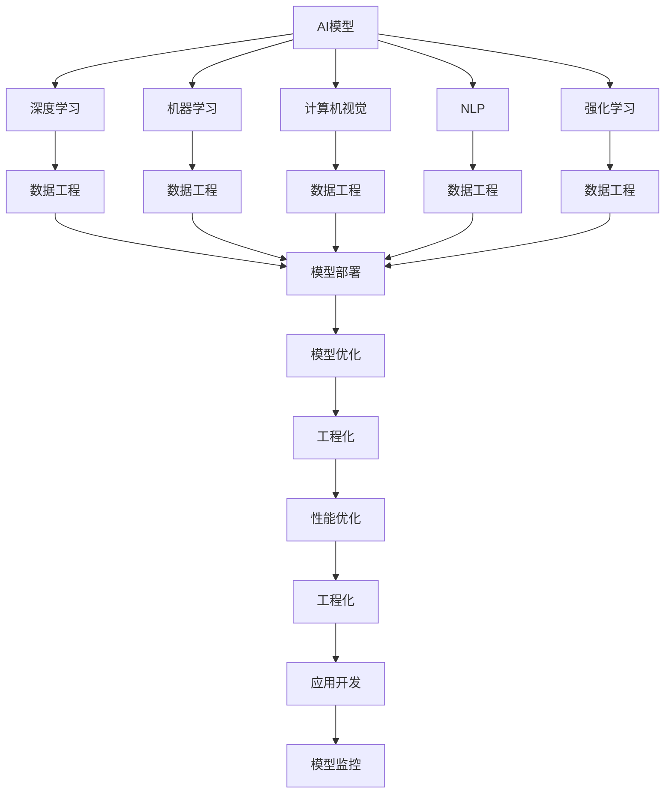
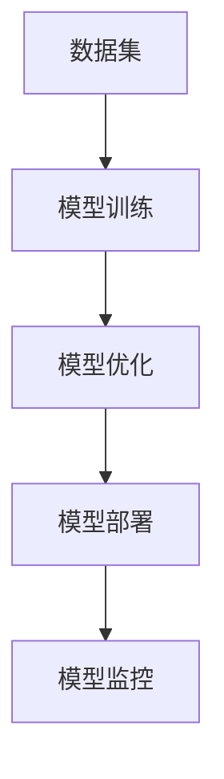
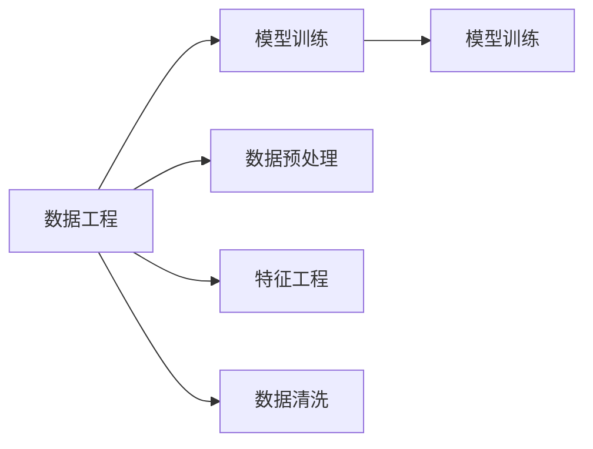
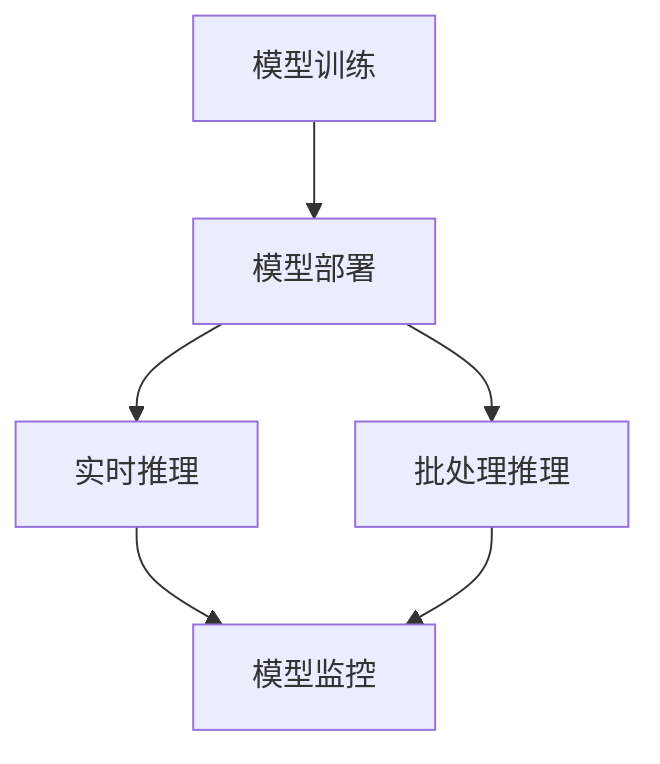
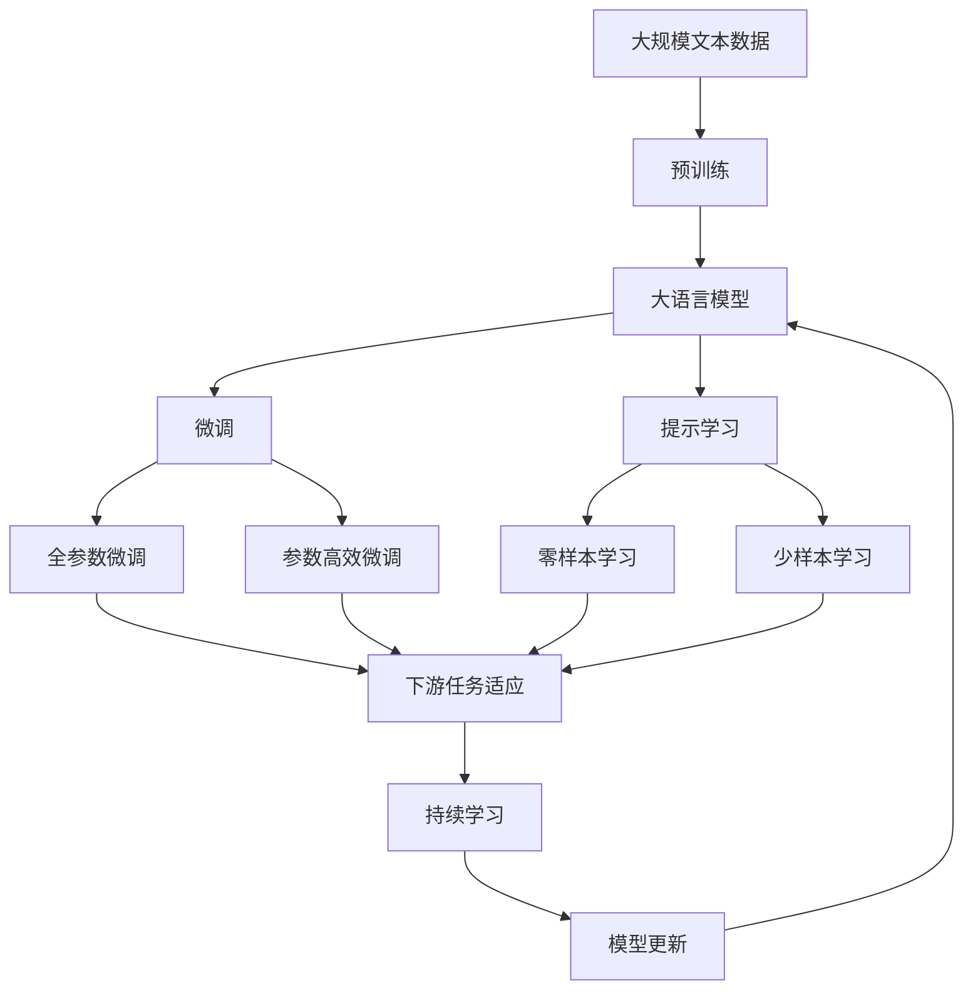

                 

# AI工程学：从理论到实践

> 关键词：AI工程, 深度学习, 机器学习, 计算机视觉, 自然语言处理, 强化学习, 数据工程, 模型部署, 工程优化, 性能优化, 应用开发, 模型监控

## 1. 背景介绍

### 1.1 问题由来
随着人工智能(AI)技术的迅速发展，AI工程学在实践中的应用愈发广泛。从计算机视觉、自然语言处理(NLP)到强化学习，AI工程学涉及众多领域，成为推动人工智能技术落地应用的重要力量。然而，AI工程学的实践往往面临诸多挑战，包括模型效率、工程复杂性、性能优化、应用部署等问题。如何从理论到实践，系统性地解决这些问题，成为AI工程学研究的重要课题。

### 1.2 问题核心关键点
AI工程学关注将理论上的AI模型转化为实际应用的工程实践，其核心关键点包括：
- 模型效率与性能优化：如何在有限的资源下提升模型性能，确保实际应用中的高效运行。
- 工程复杂性：如何系统性地设计、实现、优化AI模型，使其能够满足实际应用的需求。
- 模型部署与监控：如何高效地将训练好的模型部署到生产环境中，并进行持续监控，确保其稳定运行。
- 数据工程：如何有效地进行数据清洗、预处理、存储，支持模型训练和应用。
- 跨领域应用：如何将AI模型应用于不同领域的实际问题，实现其广泛应用。

这些关键点共同构成了AI工程学的研究体系，旨在将AI技术的潜力转化为实际应用的强大动力。

### 1.3 问题研究意义
AI工程学的研究，对于推动人工智能技术的产业化、提升AI应用的效果和效率、加速AI技术在不同领域的应用具有重要意义：
- 降低技术应用成本。AI工程学通过系统化的设计、实现和优化，可以显著减少从头开发AI模型的成本，加速AI技术的落地。
- 提升模型效果。工程化的优化和调整，使得AI模型能够更好地适应特定应用场景，在实际应用中取得更好的效果。
- 加速开发进程。工程化的方法论和技术工具，使得开发者可以更快速、更高效地开发出满足实际需求的应用系统。
- 提高系统稳定性。通过工程化的部署和监控策略，确保AI系统的稳定运行，减少系统故障和数据泄露的风险。
- 促进技术创新。AI工程学的实践和技术创新，可以带来新的应用场景和解决方案，推动AI技术的持续进步。

## 2. 核心概念与联系

### 2.1 核心概念概述

为更好地理解AI工程学的实践框架，本节将介绍几个密切相关的核心概念：

- AI工程学(AI Engineering)：将AI模型从理论转化为实际应用的过程，涉及模型设计、实现、优化、部署、监控等多个环节。
- 深度学习(Deep Learning)：一种基于神经网络的学习方法，通过多层次的特征提取和抽象，实现对复杂数据的建模和预测。
- 机器学习(Machine Learning)：利用数据和算法，使计算机系统自动改进其性能，提升其在特定任务上的表现。
- 计算机视觉(Computer Vision)：研究如何让计算机“看”和理解图像、视频等视觉数据的技术。
- 自然语言处理(Natural Language Processing, NLP)：研究如何让计算机理解和生成人类语言的技术。
- 强化学习(Reinforcement Learning, RL)：通过智能体与环境的交互，学习最优策略以达成目标的技术。
- 数据工程(Data Engineering)：处理和管理系统数据的工程，包括数据采集、存储、清洗、预处理、分析等。
- 模型部署(Model Deployment)：将训练好的模型部署到生产环境中，支持实时或批处理推理。
- 模型优化(Model Optimization)：通过算法和技术的调整，提升模型的效率、精度和鲁棒性。
- 工程化(Engineering)：系统化、结构化的工程实践方法，涉及设计、实现、优化、测试、部署等多个环节。

这些核心概念之间的逻辑关系可以通过以下Mermaid流程图来展示：



这个流程图展示了大语言模型微调过程中各个核心概念之间的关系：

1. AI模型通过深度学习、机器学习等技术进行训练。
2. 数据工程负责数据处理和预处理，支持模型的训练和应用。
3. 模型部署将训练好的模型部署到生产环境中，支持实时推理。
4. 模型优化通过算法和技术调整，提升模型性能。
5. 工程化提供系统化、结构化的工程实践方法，确保模型的有效实现和部署。
6. 性能优化和应用开发是模型在实际应用中的关键环节。
7. 模型监控确保模型的稳定运行和性能维护。

这些概念共同构成了AI工程学的实践框架，确保AI模型能够高效、稳定地应用于实际场景。

### 2.2 概念间的关系

这些核心概念之间存在着紧密的联系，形成了AI工程学的完整生态系统。下面我们通过几个Mermaid流程图来展示这些概念之间的关系。

#### 2.2.1 AI模型训练与优化



这个流程图展示了AI模型从训练到部署的全流程：
- 数据集输入模型进行训练。
- 训练好的模型进行优化，提升性能。
- 优化后的模型部署到生产环境，支持实时推理。
- 部署好的模型进行监控，确保其稳定运行。

#### 2.2.2 数据工程与模型训练



这个流程图展示了数据工程在模型训练中的关键作用：
- 数据工程负责数据的预处理、特征工程和清洗，为模型训练提供高质量的数据。
- 模型训练在数据工程的基础上，进行深度学习和模型优化。

#### 2.2.3 模型部署与监控



这个流程图展示了模型部署和监控的流程：
- 训练好的模型进行部署，支持实时和批处理推理。
- 部署的模型进行实时监控，确保其稳定运行。

### 2.3 核心概念的整体架构

最后，我们用一个综合的流程图来展示这些核心概念在大语言模型微调过程中的整体架构：



这个综合流程图展示了从预训练到微调，再到持续学习的完整过程。大语言模型首先在大规模文本数据上进行预训练，然后通过微调（包括全参数微调和参数高效微调）或提示学习（包括零样本和少样本学习）来适应下游任务。最后，通过持续学习技术，模型可以不断学习新知识，同时避免遗忘旧知识。

## 3. 核心算法原理 & 具体操作步骤
### 3.1 算法原理概述

AI工程学的核心算法原理主要围绕模型训练、优化、部署和监控展开。以下是几个核心的算法原理概述：

#### 3.1.1 模型训练
模型训练是AI工程学的起点，通过训练数据和优化算法，使模型学习到数据特征和任务规律。

**算法步骤**：
1. **数据准备**：收集、清洗和预处理训练数据，确保数据质量和一致性。
2. **模型选择**：根据任务需求选择合适的模型架构和算法。
3. **模型训练**：利用优化算法（如梯度下降、Adam等），对模型进行迭代优化，最小化损失函数。
4. **模型验证**：在验证集上评估模型性能，调整模型参数和优化策略。
5. **模型保存**：保存训练好的模型，以便后续部署和使用。

#### 3.1.2 模型优化
模型优化是提升模型性能的重要环节，通过调整模型结构、优化算法和硬件资源，提升模型的精度、效率和鲁棒性。

**算法步骤**：
1. **参数调整**：调整模型架构和参数设置，优化模型性能。
2. **算法优化**：改进优化算法，加速模型收敛。
3. **硬件优化**：利用GPU、TPU等硬件加速器，提升模型推理速度。
4. **分布式训练**：通过分布式训练技术，提高模型训练效率。
5. **模型压缩**：通过剪枝、量化等技术，减少模型存储空间和推理资源。

#### 3.1.3 模型部署
模型部署是将训练好的模型应用于生产环境的过程，确保模型能够稳定、高效地进行推理。

**算法步骤**：
1. **模型导出**：将训练好的模型导出为可部署格式。
2. **模型部署**：将模型部署到服务器或云平台，支持实时推理。
3. **性能测试**：测试模型性能，确保其满足应用需求。
4. **监控优化**：通过监控工具，实时监测模型性能和运行状态，进行优化调整。

#### 3.1.4 模型监控
模型监控是确保模型稳定运行的关键环节，通过实时监测和异常检测，及时发现和修复模型问题。

**算法步骤**：
1. **数据采集**：采集模型推理过程中的关键指标，如推理时间、内存占用、错误率等。
2. **指标分析**：分析模型性能指标，识别异常情况。
3. **问题诊断**：根据异常情况，诊断模型问题。
4. **修复调整**：进行模型修复和调整，恢复模型性能。
5. **反馈迭代**：将监控结果反馈到训练和优化环节，持续改进模型性能。

### 3.2 算法步骤详解

以下是对AI工程学核心算法的详细步骤详解：

#### 3.2.1 模型训练详细步骤

1. **数据准备**：
   - **数据收集**：从各种来源收集训练数据，确保数据的多样性和代表性。
   - **数据清洗**：去除噪声和异常数据，确保数据质量。
   - **数据预处理**：进行数据标准化、归一化、分词、特征提取等预处理操作，为模型训练提供高质量的数据。

2. **模型选择**：
   - **模型架构**：根据任务需求选择合适的模型架构，如卷积神经网络(CNN)、循环神经网络(RNN)、Transformer等。
   - **参数设置**：根据模型架构和任务需求，设置合适的参数和超参数。

3. **模型训练**：
   - **优化算法**：选择适合的优化算法，如梯度下降、Adam等。
   - **损失函数**：根据任务需求，选择合适的损失函数，如交叉熵损失、均方误差损失等。
   - **迭代优化**：通过迭代训练，最小化损失函数，优化模型参数。
   - **验证集评估**：在验证集上评估模型性能，调整模型参数和优化策略。

4. **模型保存**：
   - **模型导出**：将训练好的模型导出为可部署格式，如TensorFlow SavedModel、PyTorch模型文件等。
   - **模型存储**：将模型文件存储在分布式文件系统或云存储中，以便后续使用和部署。

#### 3.2.2 模型优化详细步骤

1. **参数调整**：
   - **超参数调整**：通过网格搜索、随机搜索等方法，调整模型超参数。
   - **正则化技术**：使用L2正则、Dropout等技术，防止模型过拟合。
   - **模型剪枝**：通过剪枝技术，去除冗余的模型参数，提升模型效率。
   - **模型量化**：将浮点数模型转换为定点数模型，减少内存占用和计算量。

2. **算法优化**：
   - **优化算法改进**：改进优化算法，如使用AdamW、Adafactor等。
   - **学习率调整**：根据模型性能，调整学习率，防止学习率过大或过小。
   - **批量大小优化**：调整批量大小，提升模型训练效率。

3. **硬件优化**：
   - **硬件加速**：利用GPU、TPU等硬件加速器，提升模型推理速度。
   - **分布式训练**：通过分布式训练技术，提高模型训练效率。
   - **内存管理**：通过内存优化技术，减少内存占用，提升系统稳定性。

4. **分布式训练**：
   - **分布式框架**：使用TensorFlow、PyTorch等分布式训练框架。
   - **多机训练**：在多台机器上进行模型训练，提升训练效率。
   - **通信优化**：优化数据传输和通信，减少网络延迟和带宽占用。

5. **模型压缩**：
   - **剪枝**：通过剪枝技术，去除冗余的模型参数。
   - **量化**：将浮点数模型转换为定点数模型，减少内存占用和计算量。
   - **蒸馏**：通过知识蒸馏技术，将复杂模型转化为轻量化模型。

#### 3.2.3 模型部署详细步骤

1. **模型导出**：
   - **模型文件导出**：将训练好的模型导出为可部署格式，如TensorFlow SavedModel、PyTorch模型文件等。
   - **模型格式转换**：将导出格式转换为适合目标平台和框架的格式。

2. **模型部署**：
   - **部署环境准备**：准备部署环境，包括服务器、操作系统、库文件等。
   - **模型部署**：将模型文件部署到服务器，支持实时推理。
   - **部署工具**：使用Docker、Kubernetes等容器化工具，简化模型部署和管理。

3. **性能测试**：
   - **推理速度测试**：测试模型推理速度，确保其满足应用需求。
   - **资源占用测试**：测试模型资源占用，确保其不会导致系统性能下降。

4. **监控优化**：
   - **监控工具**：使用Prometheus、Grafana等监控工具，实时监测模型性能和运行状态。
   - **异常检测**：根据监控数据，检测模型异常情况，及时进行修复和调整。

#### 3.2.4 模型监控详细步骤

1. **数据采集**：
   - **关键指标采集**：采集模型推理过程中的关键指标，如推理时间、内存占用、错误率等。
   - **日志记录**：记录模型推理过程中的日志信息，方便问题诊断和分析。

2. **指标分析**：
   - **性能分析**：分析模型性能指标，识别异常情况。
   - **问题诊断**：根据异常情况，诊断模型问题，如内存泄漏、推理错误等。

3. **问题修复**：
   - **模型修复**：进行模型修复，如调整参数、重训练模型等。
   - **环境优化**：优化模型部署环境，提升系统稳定性。

4. **反馈迭代**：
   - **问题反馈**：将监控结果反馈到训练和优化环节，持续改进模型性能。
   - **持续优化**：根据监控数据和反馈信息，进行模型优化和迭代训练。

### 3.3 算法优缺点

AI工程学的核心算法具有以下优点：
1. **系统性**：通过系统化的设计、实现和优化，确保AI模型的高效运行。
2. **可扩展性**：采用分布式训练和部署技术，支持大规模模型的训练和应用。
3. **高精度**：通过算法和技术的调整，提升模型的精度和鲁棒性。
4. **高性能**：利用硬件加速和优化技术，提升模型的推理速度和效率。
5. **稳定性**：通过模型监控和优化，确保模型的稳定运行。

同时，这些算法也存在一些缺点：
1. **复杂性**：工程化的方法论和技术工具较为复杂，需要较高的技术水平和经验。
2. **成本高**：大规模模型的训练和优化需要较高的计算资源和成本。
3. **易受数据影响**：模型的训练和优化依赖于高质量的数据，数据质量差可能导致模型性能下降。
4. **维护困难**：模型的部署和监控需要持续维护，工作量大且繁琐。
5. **技术门槛高**：需要具备深度学习、分布式系统、云计算等技术背景。

尽管存在这些缺点，AI工程学的核心算法依然具有不可替代的作用，是实现AI模型高效、稳定运行的重要保障。

### 3.4 算法应用领域

AI工程学的核心算法广泛应用于多个领域，包括但不限于：

- **计算机视觉**：如图像分类、目标检测、人脸识别等。
- **自然语言处理**：如机器翻译、情感分析、文本生成等。
- **强化学习**：如智能游戏、机器人控制、推荐系统等。
- **数据工程**：如数据采集、存储、清洗、预处理、分析等。
- **云计算**：如分布式训练、模型部署、模型监控等。

AI工程学的应用不仅限于技术层面，更涉及商业模式、用户体验等多个维度，为各行业带来了巨大的创新和变革。

## 4. 数学模型和公式 & 详细讲解  
### 4.1 数学模型构建

本节将使用数学语言对AI工程学的核心算法进行更加严格的刻画。

假设训练数据集为 $D=\{(x_i, y_i)\}_{i=1}^N$，其中 $x_i \in \mathcal{X}$，$y_i \in \mathcal{Y}$。模型的损失函数为 $\mathcal{L}(\theta, D)$，其中 $\theta$ 为模型参数。

在深度学习中，常用的损失函数包括交叉熵损失、均方误差损失等。以交叉熵损失为例，其在二分类任务中的定义如下：

$$
\mathcal{L}(\theta, x) = -[y\log p(x|y) + (1-y)\log(1-p(x|y))]
$$

其中 $p(x|y)$ 为模型在给定标签 $y$ 下预测结果 $x$ 的概率。

在模型训练过程中，目标是最小化损失函数，即找到最优参数 $\theta^*$：

$$
\theta^* = \mathop{\arg\min}_{\theta} \mathcal{L}(\theta, D)
$$

常见的优化算法包括梯度下降、Adam、SGD等，其中梯度下降的更新公式为：

$$
\theta \leftarrow \theta - \eta \nabla_{\theta}\mathcal{L}(\theta, D)
$$

其中 $\eta$ 为学习率。

### 4.2 公式推导过程

以梯度下降算法为例，其更新公式可以进一步展开为：

$$
\theta_k \leftarrow \theta_k - \eta \frac{\partial \mathcal{L}(\theta, D)}{\partial \theta_k}
$$

其中 $\frac{\partial \mathcal{L}(\theta, D)}{\partial \theta_k}$ 为损失函数对参数 $\theta_k$ 的梯度。

在实际应用中，通常使用反向传播算法计算梯度。具体步骤如下：

1. **前向传播**：将输入数据 $x$ 送入模型，计算输出 $y$。
2. **损失计算**：计算损失函数 $\mathcal{L}(\theta, x)$。
3. **反向传播**：利用链式法则，计算损失函数对每个参数的梯度。
4. **参数更新**：根据梯度信息，更新模型参数。

### 4.3 案例分析与讲解

以计算机视觉中的图像分类为例，假设有训练集 $D=\{(x_i, y_i)\}_{i=1}^N$，其中 $x_i$ 为图像，$y_i$ 为标签。使用深度学习模型 $M_{\theta}$ 进行训练，其损失函数为交叉熵损失。在模型训练过程中，通过反向传播计算梯度，利用梯度下降算法更新参数 $\theta$。

具体步骤如下：

1. **数据预处理**：将图像 $x_i$ 进行归一化、标准化等预处理操作。
2. **模型输入**：将预处理后的图像 $x_i$ 输入模型 $M_{\theta}$，计算输出 $y$。
3. **损失计算**：计算交叉熵损失 $\mathcal{L}(\theta, x_i)$。
4. **反向传播**：利用反向传播算法计算损失函数对每个参数的梯度。
5. **参数更新**：根据梯度信息，利用梯度下降算法更新模型参数 $\theta$。

## 5. 项目实践：代码实例和详细解释说明
### 5.1 开发环境搭建

在进行AI工程学实践前，我们需要准备好开发环境。以下是使用Python进行PyTorch开发的环境配置流程：

1. 安装Anaconda：从官网下载并安装Anaconda，用于创建独立的Python环境。

2. 创建并激活虚拟环境：
```bash
conda create -n pytorch-env python=3.8 
conda activate pytorch-env
```

3. 安装PyTorch：根据CUDA版本，从官网获取对应的安装命令。例如：
```bash
conda install pytorch torchvision torchaudio cudatoolkit=11.1 -c pytorch -c conda-forge
```

4. 安装Transformers库：
```bash
pip install transformers
```

5. 安装各类工具包：
```bash
pip install numpy pandas scikit-learn matplotlib tqdm jupyter notebook ipython
```

完成上述步骤后，即可在`pytorch-env`环境中开始AI工程学实践。

### 5.2 源代码详细实现

这里我们以计算机视觉中的图像分类任务为例，给出使用Transformers库对ResNet模型进行AI工程学实践的PyTorch代码实现。

首先，定义图像分类任务的数据处理函数：

```python
from transformers import ResNetForImageClassification, AdamW
from torch.utils.data import DataLoader
import torch
import numpy as np

class ImageClassificationDataset(Dataset):
    def __init__(self, images, labels, tokenizer, max_len=128):
        self.images = images
        self.labels = labels
        self.tokenizer = tokenizer
        self.max_len = max_len
        
    def __len__(self):
        return len(self.images)
    
    def __getitem__(self, item):
        image = self.images[item]
        label = self.labels[item]
        
        # 将图像转换为numpy数组，并进行归一化
        image = np.array(image) / 255.0
        
        # 将图像转换为特征向量
        image = self.tokenizer(image, return_tensors='pt', max_length=self.max_len, padding='max_length', truncation=True)
        input_ids = image['input_ids'][0]
        attention_mask = image['attention_mask'][0]
        
        # 将标签转换为数字
        encoded_label = [label2id[label] for label in self.labels] 
        encoded_label.extend([label2id['O']] * (self.max_len - len(encoded_label)))
        labels = torch.tensor(encoded_label, dtype=torch.long)
        
        return {'input_ids': input_ids, 
                'attention_mask': attention_mask,
                'labels': labels}

# 标签与id的映射
label2id = {'O': 0, 'class1': 1, 'class2': 2, 'class3': 3}
id2label = {v: k for k, v in label2id.items()}

# 创建dataset
tokenizer = BertTokenizer.from_pretrained('bert-base-cased')

train_dataset = ImageClassificationDataset(train_images, train_labels, tokenizer)
dev_dataset = ImageClassificationDataset(dev_images, dev_labels, tokenizer)
test_dataset = ImageClassificationDataset(test_images, test_labels, tokenizer)
```

然后，定义模型和优化器：

```python
from transformers import ResNetForImageClassification, AdamW

model = ResNetForImageClassification.from_pretrained('resnet50', num_labels=len(label2id))

optimizer = AdamW(model.parameters(), lr=2e-5)
```

接着，定义训练和评估函数：

```python
from torch.utils.data import DataLoader
from tqdm import tqdm
from sklearn.metrics import classification_report

device = torch.device('cuda') if torch.cuda.is_available() else torch.device('cpu')
model.to(device)

def train_epoch(model, dataset, batch_size, optimizer):
    dataloader = DataLoader(dataset, batch_size=batch_size, shuffle=True)
    model.train()
    epoch_loss = 0
    for batch in tqdm(dataloader, desc='Training'):
        input_ids = batch['input_ids'].to(device)
        attention_mask = batch['attention_mask'].to(device)
        labels = batch['labels'].to(device)
        model.zero_grad()
        outputs = model(input_ids, attention_mask=attention_mask, labels=labels)
        loss =

