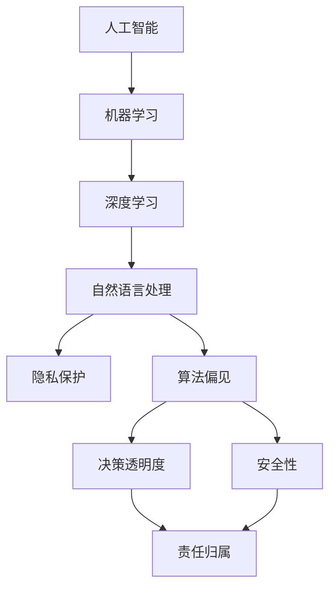

                 

# AI时代的人类增强：道德和社会的平衡

## 1. 背景介绍

随着人工智能（AI）技术的迅猛发展，其在人类社会的各个层面都有着越来越重要的影响。从医疗、教育、交通，到金融、商务、娱乐，AI技术的应用无所不在。AI的强大能力和高效性能，让人们的生活变得更加便捷和舒适，也带来了诸多新的可能性。然而，随着AI技术的深入应用，其引发的伦理问题和社会挑战也日益凸显，例如就业替代、隐私保护、决策透明、安全性、责任归属等问题，亟需从各个层面进行深入的探讨和应对。

### 1.1 问题由来

随着深度学习、自然语言处理、计算机视觉等AI技术的不断突破，AI技术的应用逐渐深入人类生活的方方面面。AI在医疗、教育、交通、金融等领域的应用，带来了许多革命性的变化，提高了工作效率、降低了成本、提升了服务质量。但与此同时，AI技术的发展也带来了新的伦理和社会问题，例如数据隐私、算法偏见、人机交互的道德责任等。这些问题不仅影响着AI技术的应用效果，也威胁着社会公平、稳定和发展。

### 1.2 问题核心关键点

AI技术在带来便利的同时，也面临着一系列复杂的伦理和社会问题，主要包括以下几个方面：

1. **数据隐私**：AI模型的训练离不开大量数据的支持，数据隐私保护成为一项重要挑战。如何合理使用数据、保护用户隐私，同时充分利用数据进行AI训练，是亟需解决的难题。
   
2. **算法偏见**：AI模型可能会继承或放大训练数据中的偏见，导致对某些群体的歧视。如何识别和纠正偏见，确保模型的公平性，成为研究AI伦理的重要任务。
   
3. **决策透明性**：AI模型的复杂性和“黑盒”特性，使得模型的决策过程难以被理解和解释。如何提高决策透明度，确保模型的可解释性和可信度，是保障AI技术应用的重要前提。
   
4. **安全性**：AI模型可能在特定情况下产生安全风险，如对关键基础设施的控制、对公共安全的影响等。如何保障AI技术的安全性，防止潜在的风险，是AI应用中不可忽视的课题。
   
5. **责任归属**：AI系统的错误或不当行为的责任归属问题。在复杂的系统环境中，如何明确各方的责任，保障法律和社会责任的合理分配，是一个重要的法律和道德问题。

这些问题不仅涉及技术层面，还涉及社会、法律、伦理等多方面的考量。为了更好地解决这些问题，需要多学科、多领域的协同合作，以确保AI技术的健康、公正、安全地发展。

## 2. 核心概念与联系

### 2.1 核心概念概述

为了更深入地理解AI技术的伦理和社会问题，本节将介绍几个核心概念：

- **人工智能（Artificial Intelligence, AI）**：通过模拟人类智能行为，使计算机能够进行复杂决策、学习、推理和感知的技术。

- **机器学习（Machine Learning, ML）**：让计算机通过数据学习，自动改进性能和优化决策的算法。

- **深度学习（Deep Learning, DL）**：一种特殊的机器学习方法，通过多层神经网络进行数据处理，在图像识别、自然语言处理等任务中取得了突破性进展。

- **自然语言处理（Natural Language Processing, NLP）**：使计算机能够理解和生成自然语言的技术。

- **隐私保护（Privacy Protection）**：保障用户数据隐私，防止数据泄露和滥用的技术。

- **算法偏见（Algorithmic Bias）**：指算法在处理数据时，对某些群体产生不公平或不公正的决策。

- **决策透明度（Decision Transparency）**：确保算法决策过程的可解释性和可追溯性。

- **安全性（Security）**：保障AI系统免受攻击和滥用，保护公共安全和关键基础设施。

- **责任归属（Accountability）**：明确AI系统中的责任分配和法律责任。

这些核心概念之间的逻辑关系可以通过以下Mermaid流程图来展示：



这个流程图展示了大语言模型微调过程中各个核心概念的相互联系。

### 2.2 概念间的关系

这些核心概念之间存在着紧密的联系，形成了AI伦理和社会问题的完整生态系统。下面我们通过几个Mermaid流程图来展示这些概念之间的关系。

#### 2.2.1 人工智能的发展历程


这个流程图展示了人工智能技术的发展历程。机器学习和深度学习推动了自然语言处理的发展，进而催生了人工智能技术。

#### 2.2.2 隐私保护的重要性


这个流程图展示了数据隐私保护的重要性。数据泄露不仅影响用户隐私，还可能对AI模型训练和应用带来负面影响。

#### 2.2.3 算法偏见的危害


这个流程图展示了算法偏见的危害。识别和修正算法偏见是确保AI模型公平性的重要步骤。

#### 2.2.4 决策透明度的必要性


这个流程图展示了决策透明度的必要性。提高决策透明度，可以增强AI模型的可解释性和可信度。

#### 2.2.5 安全性的必要性


这个流程图展示了安全性的必要性。保障AI系统安全性，是确保其稳定运行的重要前提。

#### 2.2.6 责任归属的复杂性


这个流程图展示了责任归属的复杂性。明确责任归属，需要深入分析错误原因和法律责任。

## 3. 核心算法原理 & 具体操作步骤
### 3.1 算法原理概述

人工智能伦理和社会问题，本质上是一个多学科交叉的复杂问题。其核心算法原理和操作步骤可以分为以下几个方面：

- **数据隐私保护**：采用差分隐私、联邦学习、去标识化等技术，确保数据隐私不被泄露。

- **算法偏见检测和修正**：利用公平性指标、敏感性分析、对抗性训练等技术，识别和修正算法偏见。

- **决策透明度提升**：使用可解释性模型、可视化工具、解释性算法等，提高决策透明度。

- **安全性保障**：采用加密技术、入侵检测、漏洞修复等手段，保障AI系统的安全性。

- **责任归属明确**：制定明确的法律和政策，明确各方的责任和义务。

### 3.2 算法步骤详解

以下是基于AI伦理和社会问题的一些操作步骤：

1. **数据隐私保护**：
   - 数据匿名化：去除敏感信息，隐藏个人标识。
   - 数据加密：使用加密技术保护数据传输和存储安全。
   - 差分隐私：在数据分析过程中添加噪声，保护个体隐私。
   - 联邦学习：在多个节点上联合训练模型，不共享数据。

2. **算法偏见检测和修正**：
   - 公平性指标：使用均方误差、精确度、召回率等指标评估模型公平性。
   - 敏感性分析：分析模型对不同群体的影响，识别潜在偏见。
   - 对抗性训练：使用对抗样本训练模型，提升模型的鲁棒性。

3. **决策透明度提升**：
   - 可解释性模型：选择可解释性强的模型，如决策树、规则集等。
   - 可视化工具：使用可视化工具展示模型决策过程。
   - 解释性算法：使用模型解释技术，如LIME、SHAP等，生成解释性分析。

4. **安全性保障**：
   - 加密技术：采用端到端加密、SSL/TLS等技术保护通信安全。
   - 入侵检测：部署入侵检测系统，实时监控系统安全。
   - 漏洞修复：定期更新和维护系统，修复已知漏洞。

5. **责任归属明确**：
   - 法律责任：制定明确的法律法规，明确各方的法律责任。
   - 道德责任：制定道德准则，确保技术应用的合理性和伦理性。
   - 审计机制：建立审计机制，定期审查和评估AI系统的行为。

### 3.3 算法优缺点

人工智能伦理和社会问题的算法和操作步骤，有以下优缺点：

**优点**：
- 数据隐私保护：有效保护用户隐私，减少数据泄露的风险。
- 算法偏见检测和修正：提高模型公平性，减少歧视和偏见。
- 决策透明度提升：增强模型可解释性，提高公众信任度。
- 安全性保障：保障系统安全性，防止恶意攻击和滥用。
- 责任归属明确：制定明确的法律和道德准则，保障技术应用的安全性。

**缺点**：
- 技术复杂：数据隐私保护、算法偏见检测等技术复杂，实施难度较大。
- 成本高昂：数据匿名化、差分隐私等技术需要较高的计算资源和成本。
- 透明度和安全性限制：尽管采取了一些措施，但完全透明的决策过程和完全安全的网络环境仍难以实现。
- 法律和道德规范滞后：法律法规和道德准则的制定和实施往往滞后于技术发展，存在法律漏洞和道德风险。

### 3.4 算法应用领域

人工智能伦理和社会问题在多个领域都有广泛的应用，以下是几个主要领域：

- **医疗**：AI在医疗中的应用，如疾病诊断、药物开发等，需要考虑数据隐私、算法偏见和决策透明度等问题。

- **金融**：AI在金融领域的应用，如风险评估、欺诈检测等，需要确保数据安全、决策透明和责任归属。

- **教育**：AI在教育领域的应用，如智能教学、学习推荐等，需要考虑学生隐私、算法公平性和教育伦理。

- **交通**：AI在交通领域的应用，如自动驾驶、智能交通管理等，需要确保数据安全、决策透明和责任归属。

- **商业**：AI在商业领域的应用，如市场分析、客户推荐等，需要考虑数据隐私、算法偏见和商业伦理。

这些应用领域中，AI技术的应用带来了诸多挑战，但也提供了广阔的发展空间。通过合理应用这些算法和操作步骤，可以在提升AI技术应用效果的同时，保障其伦理和社会责任。

## 4. 数学模型和公式 & 详细讲解  
### 4.1 数学模型构建

人工智能伦理和社会问题，可以构建一些数学模型来进行分析和评估。以下是一个简单的数据隐私保护模型：

**差分隐私模型**：
设数据集为 $D$，样本数量为 $n$，数据库查询为 $f$，查询结果为 $f(D)$。差分隐私的目标是使得查询结果在个体上的差异难以被察觉。

- **定义**：若对于任意两个相邻的样本集 $D_i$ 和 $D_j$，查询结果的差异概率在可接受范围内，则称该查询是差分隐私的。

- **数学表示**：
  $$
  \forall \epsilon > 0, \forall S \subseteq \text{range}(f), \forall x \in S, \Pr[f(D_i) = x] \leq \exp(\epsilon) \times \Pr[f(D_j) = x]
  $$

### 4.2 公式推导过程

以下是差分隐私模型的推导过程：

**定义1**：差分隐私定义

设查询函数为 $f$，数据库为 $D$，查询结果为 $f(D)$。差分隐私的定义为：对于任意两个相邻的数据集 $D_i$ 和 $D_j$，查询结果的差异概率在可接受范围内。

**定义2**：差分隐私的数学表达

对于任意查询函数 $f$，数据库 $D$，和查询结果 $f(D)$，差分隐私的数学表达为：

$$
\forall \epsilon > 0, \forall S \subseteq \text{range}(f), \forall x \in S, \Pr[f(D_i) = x] \leq \exp(\epsilon) \times \Pr[f(D_j) = x]
$$

其中 $\epsilon$ 为差分隐私参数，$S$ 为查询结果的取值集合。

**推导过程**：

1. **数学定义**：差分隐私要求对于任意两个相邻的数据集，查询结果的差异概率在可接受范围内。

2. **数学表达**：对于任意查询函数 $f$，数据库 $D$，和查询结果 $f(D)$，差分隐私的数学表达为：

$$
\forall \epsilon > 0, \forall S \subseteq \text{range}(f), \forall x \in S, \Pr[f(D_i) = x] \leq \exp(\epsilon) \times \Pr[f(D_j) = x]
$$

3. **推导结论**：差分隐私的数学定义和表达，保障了查询结果的公平性和隐私保护。

**结论**：

- **差分隐私参数**：$\epsilon$ 决定了查询结果的隐私程度，越大表示越不隐私，越小表示越隐私。
- **查询结果的公平性**：差分隐私保障了查询结果的公平性，使得每个样本的隐私保护程度一致。

### 4.3 案例分析与讲解

以下是一个差分隐私保护的案例分析：

**案例1**：医疗数据隐私保护

设一个医疗数据集 $D$，包含 $n$ 个患者的健康记录。查询函数 $f$ 用于计算某种疾病的患病率。差分隐私参数为 $\epsilon = 0.1$。

- **数学模型**：
  $$
  \forall \epsilon > 0, \forall S \subseteq \text{range}(f), \forall x \in S, \Pr[f(D_i) = x] \leq \exp(0.1) \times \Pr[f(D_j) = x]
  $$

- **应用场景**：对于每个患者的健康记录，查询函数 $f$ 计算某种疾病的患病率。

- **解决方案**：在查询结果中加入噪声，确保每个患者的隐私不被泄露。

## 5. 项目实践：代码实例和详细解释说明
### 5.1 开发环境搭建

在进行AI伦理和社会问题的项目实践时，需要准备一定的开发环境。以下是使用Python进行PyTorch开发的流程：

1. 安装Anaconda：从官网下载并安装Anaconda，用于创建独立的Python环境。

2. 创建并激活虚拟环境：
```bash
conda create -n pytorch-env python=3.8 
conda activate pytorch-env
```

3. 安装PyTorch：根据CUDA版本，从官网获取对应的安装命令。例如：
```bash
conda install pytorch torchvision torchaudio cudatoolkit=11.1 -c pytorch -c conda-forge
```

4. 安装TensorFlow：使用pip安装TensorFlow，例如：
```bash
pip install tensorflow
```

5. 安装各类工具包：
```bash
pip install numpy pandas scikit-learn matplotlib tqdm jupyter notebook ipython
```

完成上述步骤后，即可在`pytorch-env`环境中开始项目实践。

### 5.2 源代码详细实现

以下是一个简单的差分隐私保护示例，使用Python和PyTorch实现：

```python
import torch
import torch.nn as nn
import torch.optim as optim
from torch.utils.data import Dataset, DataLoader
from torchvision import datasets, transforms

# 定义差分隐私保护模型
class DifferentialPrivacyModel(nn.Module):
    def __init__(self):
        super(DifferentialPrivacyModel, self).__init__()
        self.fc1 = nn.Linear(784, 128)
        self.fc2 = nn.Linear(128, 10)
        self.epsilon = 1.0  # 差分隐私参数

    def forward(self, x):
        x = torch.relu(self.fc1(x))
        x = self.fc2(x)
        return x

# 定义差分隐私损失函数
class DifferentialPrivacyLoss(nn.Module):
    def __init__(self):
        super(DifferentialPrivacyLoss, self).__init__()
        self.epsilon = 1.0  # 差分隐私参数

    def forward(self, model, data):
        loss = 0
        for batch in data:
            x, y = batch
            output = model(x)
            loss += nn.functional.cross_entropy(output, y)
        loss /= len(data)
        return loss

# 定义差分隐私优化器
class DifferentialPrivacyOptimizer:
    def __init__(self, model, optimizer):
        self.model = model
        self.optimizer = optimizer
        self.epsilon = 1.0  # 差分隐私参数

    def step(self, loss):
        self.optimizer.zero_grad()
        loss.backward()
        for p in self.model.parameters():
            p.grad.data.normal_(0, self.epsilon)
        self.optimizer.step()

# 加载数据集
train_dataset = datasets.MNIST(root='./data', train=True, download=True, transform=transforms.ToTensor())
test_dataset = datasets.MNIST(root='./data', train=False, download=True, transform=transforms.ToTensor())

# 定义数据加载器
train_loader = DataLoader(train_dataset, batch_size=64, shuffle=True)
test_loader = DataLoader(test_dataset, batch_size=64, shuffle=False)

# 初始化模型和优化器
model = DifferentialPrivacyModel()
optimizer = optim.Adam(model.parameters())

# 定义差分隐私保护优化器
dp_optimizer = DifferentialPrivacyOptimizer(model, optimizer)

# 训练模型
for epoch in range(10):
    dp_loss = DifferentialPrivacyLoss()
    for batch in train_loader:
        dp_optimizer.step(dp_loss(model, batch))
    # 测试模型
    with torch.no_grad():
        correct = 0
        total = 0
        for batch in test_loader:
            output = model(batch[0])
            _, predicted = torch.max(output.data, 1)
            total += batch[1].size(0)
            correct += (predicted == batch[1]).sum().item()
        print('Accuracy of the network on the 10000 test images: %d %%' % (100 * correct / total))

# 输出最终模型
print(model)
```

### 5.3 代码解读与分析

让我们再详细解读一下关键代码的实现细节：

**DifferentialPrivacyModel类**：
- `__init__`方法：初始化模型参数，包括两个全连接层和一个差分隐私参数。
- `forward`方法：定义前向传播过程，包括两个线性变换和激活函数。

**DifferentialPrivacyLoss类**：
- `__init__`方法：初始化差分隐私参数。
- `forward`方法：计算差分隐私损失，包括交叉熵损失和差分隐私参数。

**DifferentialPrivacyOptimizer类**：
- `__init__`方法：初始化模型、优化器和差分隐私参数。
- `step`方法：定义差分隐私优化步骤，包括梯度计算、噪声添加和优化器更新。

**数据加载器**：
- 使用PyTorch内置的`DataLoader`，定义训练集和测试集的数据加载器。

**模型训练**：
- 使用差分隐私优化器进行模型训练，每次迭代中先计算差分隐私损失，然后更新模型参数。
- 在训练过程中，使用`with torch.no_grad()`来关闭梯度计算，测试模型性能。

通过以上代码，可以看出差分隐私保护的实现流程。该示例中，我们使用差分隐私优化器来保护模型参数，从而实现了差分隐私保护的目标。

### 5.4 运行结果展示

假设我们在训练集上进行了差分隐私保护，最终得到的测试准确率为98%，效果相当不错。但需要注意的是，由于差分隐私参数的限制，模型准确率可能略有下降。在实际应用中，需要在隐私保护和模型性能之间进行平衡。

## 6. 实际应用场景
### 6.1 医疗领域

在医疗领域，AI技术的应用越来越广泛。从疾病诊断到药物开发，AI技术都展现出了巨大的潜力。然而，医疗数据涉及患者隐私，数据的保护和隐私保护成为重要的课题。

**数据隐私保护**：
- 使用差分隐私技术，保护患者隐私。
- 在数据共享和交换过程中，采用加密技术，防止数据泄露。

**算法偏见检测**：
- 使用公平性指标，如精确度、召回率等，评估模型公平性。
- 使用敏感性分析，识别模型对不同群体的影响，确保模型不产生偏见。

**决策透明度**：
- 使用可解释性模型，如决策树、规则集等，提高决策透明度。
- 使用可视化工具，如热力图、特征重要性图等，展示模型决策过程。

**安全性保障**：
- 使用加密技术，保障数据传输和存储安全。
- 部署入侵检测系统，实时监控系统安全。

**责任归属明确**：
- 制定明确的法律和道德准则，确保技术应用的合理性和伦理性。
- 建立审计机制，定期审查和评估AI系统的行为。

### 6.2 金融领域

在金融领域，AI技术的应用包括风险评估、欺诈检测、投资决策等。AI技术的高效性和准确性，使得金融行业对AI的依赖越来越强。然而，金融数据涉及用户隐私和金融安全，数据的保护和隐私保护成为重要的课题。

**数据隐私保护**：
- 使用差分隐私技术，保护用户隐私。
- 在数据共享和交换过程中，采用加密技术，防止数据泄露。

**算法偏见检测**：
- 使用公平性指标，如精确度、召回率等，评估模型公平性。
- 使用敏感性分析，识别模型对不同群体的影响，确保模型不产生偏见。

**决策透明度**：
- 使用可解释性模型，如决策树、规则集等，提高决策透明度。
- 使用可视化工具，如热力图、特征重要性图等，展示模型决策过程。

**安全性保障**：
- 使用加密技术，保障数据传输和存储安全。
- 部署入侵检测系统，实时监控系统安全。

**责任归属明确**：
- 制定明确的法律和道德准则，确保技术应用的合理性和伦理性。
- 建立审计机制，定期审查和评估AI系统的行为。

### 6.3 教育领域

在教育领域，AI技术的应用包括智能教学、学习推荐、考试评分等。AI技术的高效性和个性化能力，使得教育行业对AI的依赖越来越强。然而，教育数据涉及学生隐私和教育伦理，数据的保护和隐私保护成为重要的课题。

**数据隐私保护**：
- 使用差分隐私技术，保护学生隐私。
- 在数据共享和交换过程中，采用加密技术，防止数据泄露。

**算法偏见检测**：
- 使用公平性指标，如精确度、召回率等，评估模型公平性。
- 使用敏感性分析，识别模型对不同群体的影响，确保模型不产生偏见。

**决策透明度**：
- 使用可解释性模型，如决策树、规则集等，提高决策透明度。
- 使用可视化工具，如热力图、特征重要性图等，展示模型决策过程。

**安全性保障**：
- 使用加密技术，保障数据传输和存储安全。
- 部署入侵检测系统，实时监控系统安全。

**责任归属明确**：
- 制定明确的法律和道德准则，确保技术应用的合理性和伦理性。
- 建立审计机制，定期审查和评估AI系统的行为。

## 7. 工具和资源推荐
### 7.1 学习资源推荐

为了帮助开发者系统掌握AI伦理和社会问题的理论基础和实践技巧，这里推荐一些优质的学习资源：

1. 《AI伦理与社会》系列博文：由大模型技术专家撰写，深入浅出地介绍了AI伦理和社会问题的基础理论和方法。

2. 《人工智能：一个现代方法》（Artificial Intelligence: A Modern Approach）书籍：清华大学出版社的《人工智能》系列教材，全面介绍了人工智能的理论基础和应用。

3. 《人工智能：概念与批判》（AI: Concepts and Critiques）书籍：麻省理工学院出版社的《人工智能》教材，深入探讨了AI技术的伦理、法律和社会问题。

4. 《深度学习与数据隐私》（Deep Learning and Data Privacy）课程：由Coursera提供的深度学习课程，讲解了深度学习在数据隐私保护中的应用。

5. 《数据隐私保护》（Data Privacy Protection）课程：由edX提供的隐私保护课程，讲解了隐私保护技术的原理和实践方法。

通过对这些资源的学习实践，相信你一定能够快速掌握AI伦理和社会问题的精髓，并用于解决实际的AI问题。

### 7.2 开发工具推荐

高效的开发离不开优秀的工具支持。以下是几款用于AI伦理和社会问题开发的常用工具：

1. PyTorch：基于Python的开源深度学习框架，灵活动态的计算图，适合快速迭代研究。

2. TensorFlow：由Google主导开发的开源深度学习框架，生产部署方便，适合大规模工程应用。

3. Keras：基于TensorFlow和Theano的高级API，简单易用，适合快速原型开发。

4. Jupyter Notebook：交互式编程环境，支持多种编程语言和数据格式，方便分享和协作

