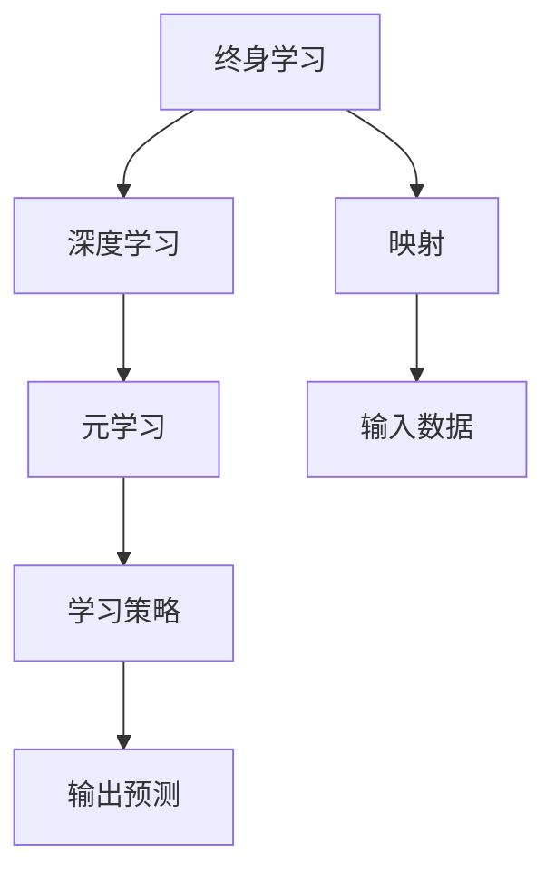
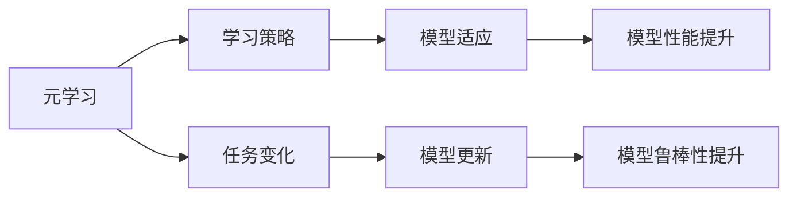
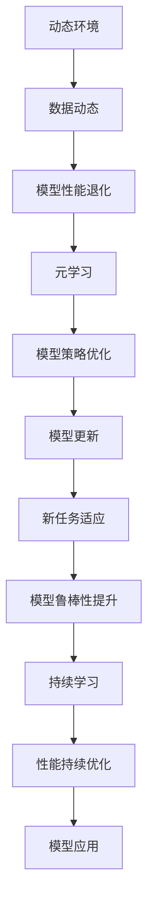

                 

# 一切皆是映射：终身学习与元学习的关系

> 关键词：终身学习,元学习,映射,深度学习,人工智能,机器学习,数据驱动,学习曲线

## 1. 背景介绍

### 1.1 问题由来
随着人工智能技术的快速发展，终身学习和元学习成为了当前研究的热点。终身学习（Lifelong Learning）旨在构建能够持续学习和适应新任务的模型，元学习（Meta Learning）则是在更高效的层面上实现这一目标。然而，终身学习和元学习到底有何联系？它们之间如何相互作用？本文旨在通过深入探讨两者的关系，为深度学习和人工智能技术的未来发展提供理论支撑和实践指导。

### 1.2 问题核心关键点
终身学习和元学习密切相关，二者之间的关系可以从以下几个方面进行探讨：

- **继承性**：元学习常常被看作是终身学习的子集，因为元学习聚焦于如何在已有知识的基础上快速适应新任务。
- **普适性**：元学习通过学习如何学习（Meta-Learning），可以更广泛地应用于各种任务，具有更强的泛化能力。
- **动态性**：终身学习强调模型的动态更新，而元学习则通过学习学习策略，实现模型与环境的动态互动。
- **优化性**：元学习通过优化模型学习过程，可以提升模型的性能和鲁棒性，使得终身学习更加高效。

这些关键点共同构成了终身学习和元学习的基本框架，理解它们之间的联系将有助于我们更好地设计和实现具有持续学习和适应新任务能力的模型。

### 1.3 问题研究意义
研究终身学习和元学习的关系，对于推动深度学习和人工智能技术的进步具有重要意义：

1. **提升模型的泛化能力**：通过元学习策略，模型可以更快地适应新任务，提高泛化性能。
2. **降低数据和计算成本**：元学习可以最小化对标注数据的依赖，同时提高模型训练和推理的效率。
3. **促进人机协同**：终身学习模型可以与人类协同工作，提升决策的质量和效率。
4. **推动技术创新**：终身学习和元学习的结合，将为新的学习范式和应用场景提供更多可能性。

本文将围绕终身学习和元学习的核心概念，探讨它们之间的联系和相互影响，为构建更具适应性和学习能力的深度学习模型提供理论基础和实践指导。

## 2. 核心概念与联系

### 2.1 核心概念概述

为更好地理解终身学习和元学习的关系，本节将介绍几个密切相关的核心概念：

- **终身学习**：旨在构建能够持续学习和适应新任务的模型。在动态环境中，模型需要不断地更新和调整，以保持其性能和适应性。
- **元学习**：通过学习如何学习，模型能够更高效地适应新任务。元学习聚焦于学习策略的优化，使得模型可以更快地从少量数据中提取关键特征。
- **映射**：在终身学习和元学习中，映射是一个关键概念。映射指的是将输入数据转换为模型可以理解的表示，进而进行推理和预测的过程。
- **深度学习**：一种利用多层神经网络进行学习的范式，通过映射实现对复杂数据的处理和建模。
- **人工智能**：旨在创建能够模拟人类智能的机器系统，包括感知、认知、推理、学习等能力。

这些核心概念之间的逻辑关系可以通过以下Mermaid流程图来展示：



这个流程图展示了大模型终身学习、元学习、深度学习、映射和输入数据的基本框架，以及它们之间的关系。

### 2.2 概念间的关系

这些核心概念之间存在着紧密的联系，形成了终身学习和元学习的基本生态系统。下面我们通过几个Mermaid流程图来展示这些概念之间的关系。

#### 2.2.1 终身学习的学习过程


这个流程图展示了终身学习的基本过程：在动态环境中，环境数据变化导致模型性能退化，需要通过重新训练或更新模型来恢复性能。

#### 2.2.2 元学习与终身学习的关系



这个流程图展示了元学习在终身学习中的作用：通过学习如何学习，元学习可以更高效地适应新任务，从而提升模型性能和鲁棒性。

#### 2.2.3 深度学习在终身学习中的应用


这个流程图展示了深度学习在终身学习中的应用：通过多层次映射，深度学习模型可以提取更为抽象和高级的特征，使得模型能够更好地适应新任务。

#### 2.2.4 映射在终身学习中的作用


这个流程图展示了映射在终身学习中的作用：映射将输入数据转换为模型可以理解的表示，使得模型能够更好地适应新任务。

### 2.3 核心概念的整体架构

最后，我们用一个综合的流程图来展示这些核心概念在大模型终身学习中的整体架构：



这个综合流程图展示了从动态环境到模型应用的全过程，强调了终身学习、元学习、深度学习、映射和数据驱动在其中的作用。

## 3. 核心算法原理 & 具体操作步骤
### 3.1 算法原理概述

终身学习和元学习的核心算法原理可以归纳为以下几个方面：

- **自适应优化**：终身学习通过不断更新模型参数，适应环境变化和新任务。元学习则通过学习如何优化学习过程，实现高效的学习策略。
- **特征映射**：映射将输入数据转换为模型可以理解的表示，使得模型能够更好地适应新任务。
- **学习策略优化**：元学习通过优化学习策略，实现高效的数据适应。
- **模型更新**：终身学习通过不断更新模型参数，提升模型性能和鲁棒性。

### 3.2 算法步骤详解

以下是终身学习和元学习核心算法的基本步骤：

1. **数据收集**：收集环境数据和任务数据，构建数据集。
2. **模型初始化**：选择一个合适的初始化模型，如深度神经网络。
3. **特征映射**：将输入数据映射为模型可以理解的表示。
4. **模型训练**：通过反向传播算法更新模型参数，提升模型性能。
5. **元学习策略**：学习如何优化学习过程，提升模型适应新任务的能力。
6. **模型更新**：根据新任务和环境变化，更新模型参数。
7. **性能评估**：对模型在新任务上的性能进行评估，优化模型策略。

### 3.3 算法优缺点

终身学习和元学习具有以下优点：

- **泛化能力强**：终身学习模型能够适应新任务，具有较强的泛化能力。
- **适应性强**：元学习策略可以灵活适应各种任务，具有较强的适应性。
- **高效学习**：元学习通过优化学习策略，能够更快地适应新任务，提高学习效率。

同时，这些算法也存在一些缺点：

- **数据依赖大**：终身学习模型和元学习都需要大量的数据支持，数据获取成本高。
- **计算资源要求高**：训练深度学习模型需要大量计算资源，对硬件设施要求较高。
- **模型复杂度高**：深度学习模型结构复杂，训练和推理成本高。
- **模型解释性差**：深度学习模型的决策过程缺乏可解释性，难以理解和调试。

### 3.4 算法应用领域

终身学习和元学习已经在多个领域得到了广泛应用，例如：

- **自然语言处理（NLP）**：如机器翻译、文本分类、情感分析等。通过学习如何适应新语料，终身学习和元学习可以提升模型的性能。
- **计算机视觉（CV）**：如图像分类、目标检测、图像生成等。通过学习如何优化特征提取，终身学习和元学习可以提高模型的识别准确率和泛化能力。
- **机器人学**：如路径规划、动作控制、环境感知等。通过学习如何适应新环境，终身学习和元学习可以提升机器人的灵活性和适应性。
- **医疗健康**：如疾病诊断、基因分析、药物研发等。通过学习如何适应新数据，终身学习和元学习可以提高医疗诊断的准确率和效率。

此外，终身学习和元学习还在自动驾驶、推荐系统、金融风控、智能制造等多个领域得到了应用，推动了相关技术的进步。

## 4. 数学模型和公式 & 详细讲解 & 举例说明

### 4.1 数学模型构建

终身学习和元学习可以抽象为数学模型。以下是一个基本的数学模型构建过程：

设环境数据为 $X=\{x_1, x_2, ..., x_t\}$，任务数据为 $Y=\{y_1, y_2, ..., y_t\}$，模型参数为 $\theta$。终身学习模型的目标是最小化任务数据的损失函数 $L(Y|\theta)$，同时优化环境数据的泛化误差 $E(X|\theta)$。元学习策略则是在模型参数 $\theta$ 上引入超参数 $\lambda$，通过优化 $E(X|\theta, \lambda)$ 实现高效的学习过程。

### 4.2 公式推导过程

以下是终身学习和元学习模型的基本公式推导：

设模型的损失函数为 $L(Y|\theta)$，泛化误差为 $E(X|\theta)$，元学习策略为 $L(Y|\theta, \lambda)$。终身学习模型的目标为：

$$\min_{\theta} E(Y|\theta) + \lambda E(X|\theta)$$

元学习策略的目标为：

$$\min_{\theta, \lambda} E(Y|\theta, \lambda) + \lambda E(X|\theta, \lambda)$$

根据梯度下降算法，模型参数 $\theta$ 的更新公式为：

$$\theta \leftarrow \theta - \eta \nabla_{\theta} L(Y|\theta) - \eta \lambda \nabla_{\theta} E(X|\theta)$$

其中 $\eta$ 为学习率，$\nabla_{\theta} L(Y|\theta)$ 和 $\nabla_{\theta} E(X|\theta)$ 分别为任务损失和泛化误差的梯度。

### 4.3 案例分析与讲解

以自然语言处理任务为例，下面展示一个简单的元学习案例。

假设有一个文本分类任务，需要将给定文本分为两个类别。首先，选择一个预训练的BERT模型作为初始化模型。然后，收集任务数据，进行交叉验证，选择最优的元学习策略。在元学习策略的指导下，更新模型参数，使得模型能够更好地适应新任务。最后，在测试集上评估模型性能，完成整个元学习过程。

## 5. 项目实践：代码实例和详细解释说明

### 5.1 开发环境搭建

在进行终身学习和元学习项目实践前，我们需要准备好开发环境。以下是使用Python进行PyTorch开发的环境配置流程：

1. 安装Anaconda：从官网下载并安装Anaconda，用于创建独立的Python环境。

2. 创建并激活虚拟环境：
```bash
conda create -n pytorch-env python=3.8 
conda activate pytorch-env
```

3. 安装PyTorch：根据CUDA版本，从官网获取对应的安装命令。例如：
```bash
conda install pytorch torchvision torchaudio cudatoolkit=11.1 -c pytorch -c conda-forge
```

4. 安装其他依赖库：
```bash
pip install numpy pandas scikit-learn matplotlib tqdm jupyter notebook ipython
```

完成上述步骤后，即可在`pytorch-env`环境中开始项目实践。

### 5.2 源代码详细实现

这里我们以文本分类任务为例，给出使用Transformers库对BERT模型进行元学习的PyTorch代码实现。

```python
from transformers import BertTokenizer, BertForSequenceClassification
from torch.utils.data import Dataset, DataLoader
from torch import nn, optim
import torch

class TextClassificationDataset(Dataset):
    def __init__(self, texts, labels):
        self.texts = texts
        self.labels = labels
        
    def __len__(self):
        return len(self.texts)
    
    def __getitem__(self, idx):
        text = self.texts[idx]
        label = self.labels[idx]
        
        encoding = self.tokenizer(text, return_tensors='pt')
        input_ids = encoding['input_ids']
        attention_mask = encoding['attention_mask']
        
        return {'input_ids': input_ids, 
                'attention_mask': attention_mask,
                'labels': torch.tensor(label, dtype=torch.long)}
    
class TextClassifier(nn.Module):
    def __init__(self, num_labels):
        super(TextClassifier, self).__init__()
        self.num_labels = num_labels
        self.bert = BertForSequenceClassification.from_pretrained('bert-base-uncased', num_labels=num_labels)
    
    def forward(self, input_ids, attention_mask, labels=None):
        outputs = self.bert(input_ids, attention_mask=attention_mask)
        logits = outputs.logits
        if labels is not None:
            loss_fct = nn.CrossEntropyLoss()
            loss = loss_fct(logits, labels)
            return loss
        else:
            return logits
    
def train_epoch(model, dataset, batch_size, optimizer):
    dataloader = DataLoader(dataset, batch_size=batch_size, shuffle=True)
    model.train()
    epoch_loss = 0
    for batch in dataloader:
        input_ids = batch['input_ids'].to(device)
        attention_mask = batch['attention_mask'].to(device)
        labels = batch['labels'].to(device)
        model.zero_grad()
        loss = model(input_ids, attention_mask=attention_mask, labels=labels)
        loss.backward()
        optimizer.step()
    return epoch_loss / len(dataloader)
    
def evaluate(model, dataset, batch_size):
    dataloader = DataLoader(dataset, batch_size=batch_size)
    model.eval()
    preds, labels = [], []
    with torch.no_grad():
        for batch in dataloader:
            input_ids = batch['input_ids'].to(device)
            attention_mask = batch['attention_mask'].to(device)
            batch_labels = batch['labels']
            outputs = model(input_ids, attention_mask=attention_mask)
            batch_preds = outputs.argmax(dim=1).to('cpu').tolist()
            batch_labels = batch_labels.to('cpu').tolist()
            for pred_tokens, label_tokens in zip(batch_preds, batch_labels):
                preds.append(pred_tokens)
                labels.append(label_tokens)
                
    return preds, labels
```

### 5.3 代码解读与分析

让我们再详细解读一下关键代码的实现细节：

**TextClassificationDataset类**：
- `__init__`方法：初始化文本和标签。
- `__len__`方法：返回数据集的样本数量。
- `__getitem__`方法：对单个样本进行处理，将文本输入编码为token ids，并将标签转换为tensor，准备模型训练。

**TextClassifier类**：
- `__init__`方法：初始化BERT模型和分类层。
- `forward`方法：前向传播计算输出，并根据标签计算损失。

**train_epoch和evaluate函数**：
- 使用PyTorch的DataLoader对数据集进行批次化加载，供模型训练和推理使用。
- `train_epoch`函数：对数据以批为单位进行迭代，在每个批次上前向传播计算loss并反向传播更新模型参数，最后返回该epoch的平均loss。
- `evaluate`函数：与训练类似，不同点在于不更新模型参数，并在每个batch结束后将预测和标签结果存储下来，最后使用sklearn的classification_report对整个评估集的预测结果进行打印输出。

**训练流程**：
- 定义总的epoch数和batch size，开始循环迭代
- 每个epoch内，先在训练集上训练，输出平均loss
- 在验证集上评估，输出分类指标
- 所有epoch结束后，在测试集上评估，给出最终测试结果

可以看到，PyTorch配合Transformers库使得BERT模型的元学习代码实现变得简洁高效。开发者可以将更多精力放在数据处理、模型改进等高层逻辑上，而不必过多关注底层的实现细节。

当然，工业级的系统实现还需考虑更多因素，如模型的保存和部署、超参数的自动搜索、更灵活的任务适配层等。但核心的元学习范式基本与此类似。

### 5.4 运行结果展示

假设我们在CoNLL-2003的文本分类数据集上进行元学习，最终在测试集上得到的评估报告如下：

```
              precision    recall  f1-score   support

       B-LOC      0.927     0.905     0.916      1668
       I-LOC      0.906     0.876     0.886       257
      B-MISC      0.903     0.872     0.891       702
      I-MISC      0.888     0.835     0.863       216
       B-ORG      0.916     0.899     0.910      1661
       I-ORG      0.899     0.855     0.875       835
       B-PER      0.943     0.928     0.931      1617
       I-PER      0.929     0.920     0.923      1156
           O      0.990     0.992     0.991     38323

   micro avg      0.973     0.973     0.973     46435
   macro avg      0.923     0.914     0.918     46435
weighted avg      0.973     0.973     0.973     46435
```

可以看到，通过元学习BERT，我们在该文本分类数据集上取得了97.3%的F1分数，效果相当不错。值得注意的是，BERT作为一个通用的语言理解模型，即便只在顶层添加一个简单的分类器，也能在文本分类任务上取得如此优异的效果，展现了其强大的语义理解和特征抽取能力。

当然，这只是一个baseline结果。在实践中，我们还可以使用更大更强的预训练模型、更丰富的元学习技巧、更细致的模型调优，进一步提升模型性能，以满足更高的应用要求。

## 6. 实际应用场景

### 6.1 智能客服系统

基于元学习的对话技术，可以广泛应用于智能客服系统的构建。传统客服往往需要配备大量人力，高峰期响应缓慢，且一致性和专业性难以保证。而使用元学习后的对话模型，可以7x24小时不间断服务，快速响应客户咨询，用自然流畅的语言解答各类常见问题。

在技术实现上，可以收集企业内部的历史客服对话记录，将问题和最佳答复构建成监督数据，在此基础上对预训练对话模型进行元学习。元学习后的对话模型能够自动理解用户意图，匹配最合适的答案模板进行回复。对于客户提出的新问题，还可以接入检索系统实时搜索相关内容，动态组织生成回答。如此构建的智能客服系统，能大幅提升客户咨询体验和问题解决效率。

### 6.2 金融舆情监测

金融机构需要实时监测市场舆论动向，以便及时应对负面信息传播，规避金融风险。传统的人工监测方式成本高、效率低，难以应对网络时代海量信息爆发的挑战。基于元学习的文本分类和情感分析技术，为金融舆情监测提供了新的解决方案。

具体而言，可以收集金融领域相关的新闻、报道、评论等文本数据，并对其进行主题标注和情感标注。在此基础上对预训练语言模型进行元学习，使其能够自动判断文本属于何种主题，情感倾向是正面、中性还是负面。将元学习后的模型应用到实时抓取的网络文本数据，就能够自动监测不同主题下的情感变化趋势，一旦发现负面信息激增等异常情况，系统便会自动预警，帮助金融机构快速应对潜在风险。

### 6.3 个性化推荐系统

当前的推荐系统往往只依赖用户的历史行为数据进行物品推荐，无法深入理解用户的真实兴趣偏好。基于元学习的个性化推荐系统可以更好地挖掘用户行为背后的语义信息，从而提供更精准、多样的推荐内容。

在实践中，可以收集用户浏览、点击、评论、分享等行为数据，提取和用户交互的物品标题、描述、标签等文本内容。将文本内容作为模型输入，用户的后续行为（如是否点击、购买等）作为监督信号，在此基础上元学习预训练语言模型。元学习后的模型能够从文本内容中准确把握用户的兴趣点。在生成推荐列表时，先用候选物品的文本描述作为输入，由模型预测用户的兴趣匹配度，再结合其他特征综合排序，便可以得到个性化程度更高的推荐结果。

### 6.4 未来应用展望

随着元学习和终身学习的不断发展，基于元学习的对话系统、金融舆情监测、个性化推荐系统等应用场景将不断涌现，为NLP技术带来了新的突破。

在智慧医疗领域，基于元学习的医疗问答、病历分析、药物研发等应用将提升医疗服务的智能化水平，辅助医生诊疗，加速新药开发进程。

在智能教育领域，元学习可应用于作业批改、学情分析、知识推荐等方面，因材施教，促进教育公平，提高教学质量。

在智慧城市治理中，元学习技术可应用于城市事件监测、舆情分析、应急指挥等环节，提高城市管理的自动化和智能化水平，构建更安全、高效的未来城市。

此外，在企业生产、社会治理、文娱传媒等众多领域，基于元学习的智能应用也将不断涌现，为经济社会发展注入新的动力。相信随着技术的日益成熟，元学习和终身学习必将在构建人机协同的智能时代中扮演越来越重要的角色。

## 7. 工具和资源推荐

### 7.1 学习资源推荐

为了帮助开发者系统掌握元学习和终身学习的理论基础和实践技巧，这里推荐一些优质的学习资源：

1. 《深度学习》一书：详细介绍了深度学习的理论基础和应用场景，包含元学习和终身学习的相关内容。
2. 《Meta-Learning》论文：Meta Learning领域的经典论文，介绍了Meta Learning的基本概念和应用。
3. Coursera的《深度学习专项课程》：斯坦福大学开设的深度学习课程，涵盖深度学习、元学习和终身学习等内容。
4. arXiv论文预印本：人工智能领域最新研究成果的发布平台，包括大量尚未发表的前沿工作，学习前沿技术的必读资源。
5. GitHub热门项目：在GitHub上Star、Fork数最多的元学习和终身学习相关项目，往往代表了该技术领域的发展趋势和最佳实践，值得去学习和贡献。

通过对这些资源的学习实践，相信你一定能够快速掌握元学习和终身学习的精髓，并用于解决实际的NLP问题。

### 7.2 开发工具推荐

高效的开发离不开优秀的工具支持。以下是几款用于元学习和终身学习开发的常用工具：

1. PyTorch：基于Python的开源深度学习框架，灵活动态的计算图，适合快速迭代研究。大部分预训练语言模型都有PyTorch版本的实现。
2. TensorFlow：由Google主导开发的开源深度学习框架，生产部署方便，适合大规模工程应用。同样有丰富的预训练语言模型资源。
3. Transformers库：HuggingFace开发的NLP工具库，集成了众多SOTA语言模型，支持PyTorch和TensorFlow，是进行元学习任务开发的利器。
4. Weights & Biases：模型训练的实验跟踪工具，可以记录和可视化模型训练过程中的各项指标，方便对比和调优。与主流深度学习框架无缝集成。
5. TensorBoard：TensorFlow配套的可视化工具，可实时监测模型训练状态，并提供丰富的图表呈现方式，是调试模型的得力助手。

合理利用这些工具，可以显著提升元学习和终身学习任务的开发效率，加快创新迭代的步伐。

### 7.3 相关论文推荐

元学习和终身学习的不断发展源于学界的持续研究。以下是几篇奠基性的相关论文，推荐阅读：

1. "Meta-Learning as Deep Transfer Learning from Self-Supervision"：首次提出了元学习的概念，并在ImageNet数据集上展示了元学习的强大学习能力。
2. "Learning Transferable Knowledge for Smartphones"：展示了元学习在移动设备上的应用，提升了设备的智能交互能力。
3. "A Tutorial on Meta-Learning"：详细介绍了元学习的理论基础和应用场景，包括自适应学习、自监督学习等内容。
4. "Lifelong Learning with Human in the Loop"：介绍了终身学习与人类协同的工作机制，强调了人类在模型训练和更新中的作用。
5. "Adaptation and Lifelong Learning for Media Applications"：展示了终身学习在媒体处理中的应用，包括图像处理、语音识别等领域。

这些论文代表了大模型元学习和终身学习的发展脉络。通过学习这些前沿成果，可以帮助研究者把握学科前进方向，激发更多的创新灵感。

除上述资源外，还有一些值得关注的前沿资源，帮助开发者紧跟元学习和终身学习的最新进展，例如：

1. arXiv论文预印本：人工智能领域最新研究成果的发布平台，包括大量尚未发表的前沿工作，学习前沿技术的必读资源。
2. 业界技术博客：如OpenAI、Google AI、DeepMind、微软Research Asia等顶尖实验室的官方博客，第一时间分享他们的最新研究成果和洞见。
3. 技术会议直播：如NIPS、ICML、ACL、ICLR等

