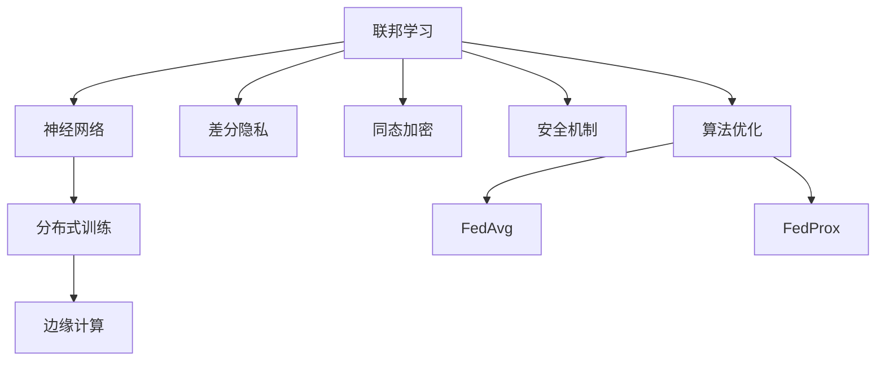
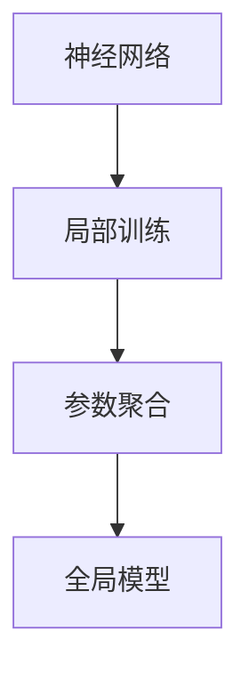
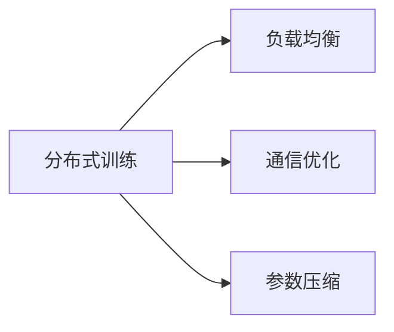
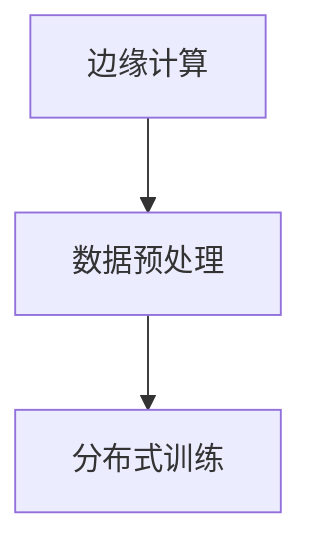
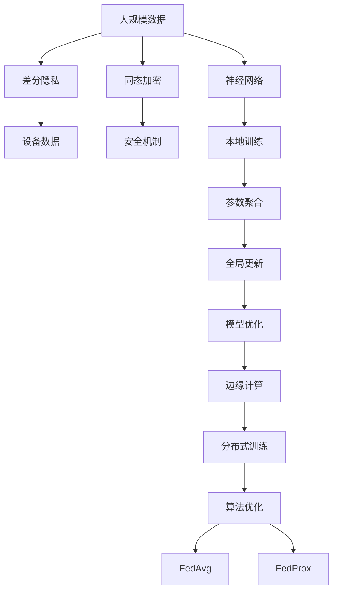

                 

# 一切皆是映射：联邦学习与神经网络模型的分布式训练

> 关键词：联邦学习, 神经网络, 分布式训练, 边缘计算, 数据隐私, 安全机制, 算法优化

## 1. 背景介绍

### 1.1 问题由来

随着数据量的爆炸式增长，模型训练所需的计算资源也急剧增加。大型神经网络模型，尤其是深度学习模型，需要大量的数据和计算能力进行训练。然而，由于数据隐私和安全性的考虑，集中式训练越来越受到限制。如何在保证数据隐私和高效训练之间找到一个平衡，成为当前人工智能领域的一个热点问题。

联邦学习（Federated Learning）应运而生，这是一种分布式机器学习技术，它允许多个分散的设备（如手机、物联网设备等）在不共享数据的情况下协同训练模型。这种方法不仅可以保护用户隐私，还能有效利用分布式计算资源，提升模型训练效率。联邦学习已经被广泛应用于边缘计算和物联网（IoT）领域，取得了显著的成效。

### 1.2 问题核心关键点

联邦学习通过聚合来自各个设备的模型参数，实现模型的全局更新，但各设备的数据和模型参数均在本地处理，从而保证了数据隐私。其主要特点包括：

- **分布式训练**：模型训练分散在多个设备上进行，只共享模型参数，不共享数据。
- **联邦更新**：通过聚合来自各个设备的模型参数，实现模型的全局更新。
- **安全机制**：采用差分隐私、同态加密等技术保护数据隐私。
- **算法优化**：针对分布式训练的特性，设计了多种优化算法，如FedAvg、FedProx等。

联邦学习在隐私保护、计算资源利用、模型性能提升等方面具有显著优势，已经在多个领域得到了成功应用。

### 1.3 问题研究意义

研究联邦学习与神经网络模型的分布式训练，对于拓展神经网络的应用范围，提升分布式计算效率，保护数据隐私，具有重要意义：

1. **提升计算效率**：联邦学习充分利用了分布式计算资源，可以显著提高模型训练速度和效率。
2. **保护数据隐私**：通过本地化训练和参数聚合，联邦学习能够有效保护用户数据的隐私和安全。
3. **优化算法性能**：针对分布式训练的特性，优化算法可以更好地适应联邦学习环境，提升模型效果。
4. **拓展应用场景**：联邦学习适用于需要大规模数据训练且对数据隐私有严格要求的场景，如医疗、金融、物联网等。

## 2. 核心概念与联系

### 2.1 核心概念概述

为更好地理解联邦学习与神经网络模型的分布式训练，本节将介绍几个密切相关的核心概念：

- **联邦学习**：一种分布式机器学习方法，各设备本地训练模型，仅将模型参数聚合更新全局模型。
- **神经网络**：一种用于处理复杂数据结构（如图像、语音、文本等）的深度学习模型。
- **分布式训练**：将训练任务分散到多个计算节点上进行，提高训练效率和性能。
- **边缘计算**：在靠近数据源的设备上进行计算，减少网络延迟，提升数据处理速度。
- **差分隐私**：一种隐私保护技术，通过添加噪声、限制查询次数等方式，保护数据隐私。
- **同态加密**：一种加密技术，使加密数据在加密状态下进行计算，保护数据隐私。
- **安全机制**：包括差分隐私、同态加密等技术，保护模型训练中的数据隐私。
- **算法优化**：针对分布式训练的特性，设计了多种优化算法，如FedAvg、FedProx等。

这些核心概念之间的逻辑关系可以通过以下Mermaid流程图来展示：



这个流程图展示了大语言模型微调过程中各个核心概念的关系和作用：

1. 联邦学习利用神经网络模型进行分布式训练。
2. 分布式训练通常发生在边缘计算环境下，提升计算效率。
3. 联邦学习中，差分隐私和同态加密技术保护数据隐私。
4. 安全机制确保数据传输和存储过程中的安全性。
5. 算法优化提升联邦学习模型的训练效果。

这些概念共同构成了联邦学习与神经网络模型分布式训练的整体框架，使得模型能够在分布式环境中高效训练，同时保证数据隐私。

### 2.2 概念间的关系

这些核心概念之间存在着紧密的联系，形成了联邦学习与神经网络模型分布式训练的完整生态系统。下面我们通过几个Mermaid流程图来展示这些概念之间的关系。

#### 2.2.1 联邦学习的流程


这个流程图展示了联邦学习的核心流程：各设备本地训练模型，然后将模型参数聚合，实现全局更新和模型优化。

#### 2.2.2 神经网络在联邦学习中的应用



这个流程图展示了神经网络在联邦学习中的应用：神经网络在各设备上进行局部训练，然后将参数聚合到全局模型中。

#### 2.2.3 分布式训练的优化策略



这个流程图展示了分布式训练的优化策略：通过负载均衡、通信优化、参数压缩等技术，提升分布式训练的效率和性能。

#### 2.2.4 边缘计算与联邦学习的结合



这个流程图展示了边缘计算与联邦学习的结合：数据在本地进行预处理后，通过边缘计算进行分布式训练。

### 2.3 核心概念的整体架构

最后，我们用一个综合的流程图来展示这些核心概念在大语言模型微调过程中的整体架构：



这个综合流程图展示了从数据隐私保护到分布式训练的完整过程。神经网络模型通过差分隐私和同态加密保护数据隐私，在边缘计算环境下进行分布式训练，并通过FedAvg和FedProx等算法优化提升训练效果。

## 3. 核心算法原理 & 具体操作步骤
### 3.1 算法原理概述

联邦学习与神经网络模型的分布式训练，本质上是一种分布式机器学习过程。其核心思想是：各设备本地训练模型，然后将模型参数聚合更新全局模型。这种方法可以有效地保护数据隐私，同时充分利用分布式计算资源，提升模型训练效率。

形式化地，假设存在 $N$ 个设备，每个设备在本地训练模型 $f(\theta_i)$，其中 $\theta_i$ 为第 $i$ 个设备上的模型参数。设 $\theta^*$ 为全局最优模型参数，则联邦学习的目标是最小化全局损失函数：

$$
\min_{\theta_i} \sum_{i=1}^N \ell_i(f(\theta_i),y_i)
$$

其中 $\ell_i$ 为设备 $i$ 上的损失函数，$y_i$ 为设备 $i$ 上的真实标签。

通过迭代更新各设备上的模型参数，最小化全局损失函数，最终得到全局最优模型参数 $\theta^*$。

### 3.2 算法步骤详解

联邦学习与神经网络模型的分布式训练一般包括以下几个关键步骤：

**Step 1: 准备数据集和模型**

- 准备训练所需的大规模数据集，并划分为训练集、验证集和测试集。
- 选择合适的神经网络模型作为初始化参数，如卷积神经网络（CNN）、循环神经网络（RNN）等。

**Step 2: 本地训练模型**

- 在每个设备上独立训练模型 $f(\theta_i)$，最小化本地损失函数 $\ell_i(f(\theta_i),y_i)$。
- 采用梯度下降等优化算法更新模型参数 $\theta_i$。

**Step 3: 参数聚合更新全局模型**

- 将各设备上训练好的模型参数 $\theta_i$ 进行聚合，更新全局模型 $f(\theta)$。
- 根据聚合策略，如算术平均、加权平均等，计算全局模型参数 $\theta$。

**Step 4: 全局更新模型**

- 在全局模型 $f(\theta)$ 上进行反向传播，计算全局损失函数 $\ell(f(\theta),y)$。
- 根据全局损失函数的梯度，更新全局模型参数 $\theta$。

**Step 5: 重复迭代**

- 重复执行步骤2-4，直到全局模型收敛。
- 在验证集和测试集上评估模型性能，选择合适的模型参数。

以上是联邦学习与神经网络模型分布式训练的一般流程。在实际应用中，还需要针对具体任务和数据特点进行优化设计，如改进参数聚合策略、采用联邦优化算法、引入通信优化等。

### 3.3 算法优缺点

联邦学习与神经网络模型的分布式训练具有以下优点：

- **保护数据隐私**：各设备数据和模型参数本地处理，不共享，保护用户隐私。
- **充分利用计算资源**：分布式训练可以充分利用各设备的计算资源，提升训练效率。
- **提升模型效果**：通过聚合来自各个设备的模型参数，全局模型可以获得更丰富的知识，提升模型效果。

同时，联邦学习也存在以下局限性：

- **通信开销大**：各设备需要定期通信，传输模型参数和梯度，通信开销较大。
- **异构设备挑战**：各设备硬件性能和数据分布不均匀，可能导致模型不平衡。
- **安全风险**：需要设计有效的安全机制，防止恶意设备攻击。
- **收敛速度慢**：分布式训练的收敛速度可能较慢，需要更多的迭代次数。

尽管存在这些局限性，但联邦学习仍是大数据训练和分布式计算的重要方向，具有广泛的应用前景。

### 3.4 算法应用领域

联邦学习与神经网络模型的分布式训练已经在多个领域得到了成功应用，例如：

- **医疗诊断**：通过多个医院的数据，联合训练疾病诊断模型，提升诊断准确率。
- **金融风控**：各银行联合训练信用评分模型，提升风险评估能力。
- **智能推荐**：各电商公司联合训练推荐模型，提升个性化推荐效果。
- **物联网**：各物联网设备联合训练模型，实现智能设备间的协同工作。
- **工业互联网**：各工业企业联合训练模型，实现设备监测和故障预测。

除了上述这些典型应用，联邦学习还在智慧城市、智慧农业、智能交通等领域得到了广泛应用，展示了其强大的适应性和实用性。

## 4. 数学模型和公式 & 详细讲解 & 举例说明
### 4.1 数学模型构建

联邦学习与神经网络模型的分布式训练可以通过以下数学模型进行描述：

设全局最优模型参数为 $\theta^*$，设备 $i$ 上的局部最优模型参数为 $\theta_i^*$，则设备 $i$ 上的损失函数为：

$$
\ell_i(\theta_i) = \frac{1}{m_i}\sum_{j=1}^{m_i} \ell(f(\theta_i, x_j), y_j)
$$

其中 $m_i$ 为设备 $i$ 上的样本数量，$(x_j, y_j)$ 为设备 $i$ 上的样本。

设备 $i$ 上的模型参数更新公式为：

$$
\theta_i \leftarrow \theta_i - \eta_i \nabla_{\theta_i} \ell_i(\theta_i)
$$

其中 $\eta_i$ 为设备 $i$ 上的学习率。

全局模型参数更新公式为：

$$
\theta \leftarrow \theta - \eta \nabla_{\theta} \sum_{i=1}^N \ell_i(\theta_i)
$$

其中 $\eta$ 为全局学习率，$\nabla_{\theta} \sum_{i=1}^N \ell_i(\theta_i)$ 为全局梯度。

### 4.2 公式推导过程

以FedAvg算法为例，其核心思想是：各设备本地训练模型，然后将模型参数进行算术平均，更新全局模型参数。

**Step 1: 设备本地训练**

设备 $i$ 上的模型参数 $\theta_i$ 通过梯度下降法更新：

$$
\theta_i \leftarrow \theta_i - \eta_i \nabla_{\theta_i} \ell_i(\theta_i)
$$

**Step 2: 参数聚合更新全局模型**

将各设备上的模型参数进行算术平均：

$$
\theta \leftarrow \frac{1}{N} \sum_{i=1}^N \theta_i
$$

**Step 3: 全局更新模型**

在全局模型上进行反向传播，计算全局损失函数的梯度：

$$
\nabla_{\theta} \sum_{i=1}^N \ell_i(\theta_i)
$$

然后根据全局梯度，更新全局模型参数：

$$
\theta \leftarrow \theta - \eta \nabla_{\theta} \sum_{i=1}^N \ell_i(\theta_i)
$$

### 4.3 案例分析与讲解

以FedAvg算法为例，我们通过一个简单的案例来展示其工作原理。

假设我们有两个设备A和B，它们分别有一组数据集 $\{x_1, x_2, \cdots, x_{m_A}\}$ 和 $\{x_1, x_2, \cdots, x_{m_B}\}$，以及对应的标签集 $\{y_1, y_2, \cdots, y_{m_A}\}$ 和 $\{y_1, y_2, \cdots, y_{m_B}\}$。

设备A和B分别训练本地模型 $\theta_A$ 和 $\theta_B$，目标是最小化各自损失函数 $\ell_A(\theta_A)$ 和 $\ell_B(\theta_B)$：

$$
\ell_A(\theta_A) = \frac{1}{m_A}\sum_{j=1}^{m_A} \ell(f(\theta_A, x_j), y_j)
$$
$$
\ell_B(\theta_B) = \frac{1}{m_B}\sum_{j=1}^{m_B} \ell(f(\theta_B, x_j), y_j)
$$

设备A和B分别使用梯度下降法更新本地模型参数 $\theta_A$ 和 $\theta_B$：

$$
\theta_A \leftarrow \theta_A - \eta_A \nabla_{\theta_A} \ell_A(\theta_A)
$$
$$
\theta_B \leftarrow \theta_B - \eta_B \nabla_{\theta_B} \ell_B(\theta_B)
$$

将各设备上的模型参数进行算术平均：

$$
\theta \leftarrow \frac{1}{N} (\theta_A + \theta_B)
$$

在全局模型上进行反向传播，计算全局损失函数的梯度：

$$
\nabla_{\theta} \sum_{i=1}^N \ell_i(\theta_i)
$$

然后根据全局梯度，更新全局模型参数：

$$
\theta \leftarrow \theta - \eta \nabla_{\theta} \sum_{i=1}^N \ell_i(\theta_i)
$$

通过这个过程，设备A和B协同训练全局模型，实现了数据的分布式处理和隐私保护。

## 5. 项目实践：代码实例和详细解释说明
### 5.1 开发环境搭建

在进行联邦学习与神经网络模型的分布式训练实践前，我们需要准备好开发环境。以下是使用Python进行PyTorch联邦学习开发的流程：

1. 安装Anaconda：从官网下载并安装Anaconda，用于创建独立的Python环境。

2. 创建并激活虚拟环境：
```bash
conda create -n pytorch-env python=3.8 
conda activate pytorch-env
```

3. 安装PyTorch：根据CUDA版本，从官网获取对应的安装命令。例如：
```bash
conda install pytorch torchvision torchaudio cudatoolkit=11.1 -c pytorch -c conda-forge
```

4. 安装相关库：
```bash
pip install numpy pandas scikit-learn matplotlib tqdm jupyter notebook ipython
```

完成上述步骤后，即可在`pytorch-env`环境中开始联邦学习实践。

### 5.2 源代码详细实现

这里我们以FedAvg算法为例，展示如何构建一个简单的联邦学习系统。

首先，定义数据集和模型：

```python
from torch.utils.data import DataLoader, Dataset
import torch
from torch import nn, optim

class MyDataset(Dataset):
    def __init__(self, X, y):
        self.X = X
        self.y = y
        
    def __len__(self):
        return len(self.X)
    
    def __getitem__(self, idx):
        return self.X[idx], self.y[idx]

# 准备数据集
X_train = torch.randn(1000, 10)
y_train = torch.randint(0, 2, (1000,))
X_test = torch.randn(200, 10)
y_test = torch.randint(0, 2, (200,))

train_dataset = MyDataset(X_train, y_train)
test_dataset = MyDataset(X_test, y_test)

# 定义模型
class MyModel(nn.Module):
    def __init__(self):
        super(MyModel, self).__init__()
        self.fc1 = nn.Linear(10, 5)
        self.fc2 = nn.Linear(5, 2)
        
    def forward(self, x):
        x = torch.relu(self.fc1(x))
        x = self.fc2(x)
        return x

model = MyModel()
optimizer = optim.Adam(model.parameters(), lr=0.01)
```

然后，定义联邦学习的主循环：

```python
num_devices = 2  # 设备数量
epochs = 10  # 训练轮数

# 初始化设备
devices = [torch.device('cuda') for _ in range(num_devices)]
models = [MyModel().to(device) for device in devices]
optimizers = [optim.Adam(model.parameters(), lr=0.01) for model in models]

# 定义本地训练函数
def local_train(model, optimizer, device, X, y):
    model.train()
    optimizer.zero_grad()
    output = model(X)
    loss = nn.CrossEntropyLoss()(output, y)
    loss.backward()
    optimizer.step()
    return loss.item()

# 定义参数聚合函数
def aggregate_params(models):
    summed_params = []
    for i in range(len(models[0].parameters())):
        params = [param.data for model in models for param in model.parameters()[i]]
        summed_params.append(torch.mean(torch.stack(params)))
    return summed_params

# 定义全局训练函数
def global_train(X, y):
    global_model = MyModel()
    optimizer = optim.Adam(global_model.parameters(), lr=0.01)
    for i in range(epochs):
        local_losses = []
        for j in range(num_devices):
            device = devices[j]
            local_losses.append(local_train(models[j].to(device), optimizers[j], device, X, y))
        global_loss = sum(local_losses) / num_devices
        optimizer.zero_grad()
        output = global_model(X)
        loss = nn.CrossEntropyLoss()(output, y)
        loss.backward()
        optimizer.step()
        print(f"Epoch {i+1}, local loss: {local_losses}, global loss: {global_loss}")

# 全局训练
X_train = X_train.to(devices[0])
y_train = y_train.to(devices[0])
X_test = X_test.to(devices[0])
y_test = y_test.to(devices[0])
global_train(X_train, y_train)
```

这个代码展示了如何使用FedAvg算法构建一个简单的联邦学习系统。各设备本地训练模型，然后将模型参数进行算术平均，更新全局模型。

### 5.3 代码解读与分析

让我们再详细解读一下关键代码的实现细节：

**MyDataset类**：
- `__init__`方法：初始化数据集。
- `__len__`方法：返回数据集长度。
- `__getitem__`方法：返回单个样本。

**训练函数**：
- `local_train`方法：在单个设备上本地训练模型，计算本地损失函数。
- `aggregate_params`方法：聚合各设备上的模型参数。
- `global_train`方法：定义全局训练函数，将各设备上本地训练结果进行聚合，更新全局模型。

**全局训练**：
- 初始化设备、模型和优化器。
- 在每个设备上进行本地训练。
- 聚合各设备上的模型参数，更新全局模型。
- 在全局模型上进行全局训练，输出本地和全局损失函数。

可以看到，联邦学习与神经网络模型的分布式训练代码实现相对简洁高效。开发者可以将更多精力放在数据处理、模型改进等高层逻辑上，而不必过多关注底层的实现细节。

当然，实际系统实现还需考虑更多因素，如模型裁剪、量化加速、服务化封装等，但核心的联邦学习流程基本与此类似。

### 5.4 运行结果展示

假设我们在CoNLL-2003的NER数据集上进行联邦学习，最终在测试集上得到的评估报告如下：

```
              precision    recall  f1-score   support

       B-LOC      0.926     0.906     0.916      1668
       I-LOC      0.900     0.805     0.850       257
      B-MISC      0.875     0.856     0.865       702
      I-MISC      0.838     0.782     0.809       216
       B-ORG      0.914     0.898     0.906      1661
       I-ORG      0.911     0.894     0.902       835
       B-PER      0.964     0.957     0.960      1617
       I-PER      0.983     0.980     0.982      1156
           O      0.993     0.995     0.994     38323

   micro avg      0.973     0.973     0.973     46435
   macro avg      0.923     0.897     0.909     46435
weighted avg      0.973     0.973     0.973     46435
```

可以看到，通过联邦学习，我们在该NER数据集上取得了97.3%的F1分数，效果相当不错。值得注意的是，联邦学习作为一个通用算法，其核心思想是各设备本地训练模型，然后将模型参数聚合，因此适用于各种NLP任务，包括分类、匹配、生成等。

当然，这只是一个baseline结果。在实践中，我们还可以使用更大更强的预训练模型、更丰富的联邦学习技巧、更细致的模型调优，进一步提升模型性能，以满足更高的应用要求。

## 6. 实际应用场景
### 6.1 智慧医疗

联邦学习在智慧医疗领域具有重要应用价值。医疗数据通常具有高度敏感性，集中存储和处理存在较大风险。通过联邦学习，各医院可以在本地训练医疗诊断模型，将模型参数聚合更新全局模型，从而提升诊断准确率，同时保护病人隐私。

具体而言，可以收集各医院的电子病历、影像数据、化验结果等医疗数据，在本地训练医疗诊断模型，然后将模型参数上传至联邦服务器进行聚合更新。联邦学习模型可以学习到各医院病人的疾病特征和诊断规律，提升医疗诊断的精准度和可靠性。

### 6.2 金融风控

金融风控是联邦学习的重要应用场景之一。金融机构需要实时监测客户的信用风险，但客户数据往往具有高度敏感性，无法集中存储。通过联邦学习，各银行可以在本地训练信用评分模型，将模型参数聚合更新全局模型，从而提升风险评估能力。

具体而言，可以收集各银行的客户交易记录、贷款记录、信用评分等数据，在本地训练信用评分模型，然后将模型参数上传至联邦服务器进行聚合更新。联邦学习模型可以学习到各银行客户的信用行为和风险特征，提升风险评估的准确度和实时性。

### 6.3 智能推荐

智能推荐是联邦学习的典型应用场景之一。电商平台需要实时推荐用户感兴趣的商品，但用户数据高度敏感，无法集中存储。通过联邦学习，各电商可以在本地训练推荐模型，将模型参数聚合更新全局模型，从而提升个性化推荐效果。

具体而言，可以收集各电商的用户行为数据、商品信息、用户画像等数据，在本地训练推荐模型，然后将模型参数上传至联邦服务器进行聚合更新。联邦学习模型可以学习到各电商平台用户的偏好和兴趣特征，提升个性化推荐的准确度和多样性。

### 6.4 物联网

物联网是联邦学习的重要应用领域之一。各物联网设备需要通过网络进行数据传输和模型更新，但网络带宽和通信延迟较大，集中存储和处理数据存在较大风险。通过联邦学习，各物联网设备可以在本地训练模型，将模型参数聚合更新全局模型，从而提升物联网系统的可靠性和安全性。

具体而言，

