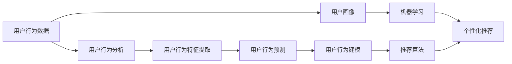
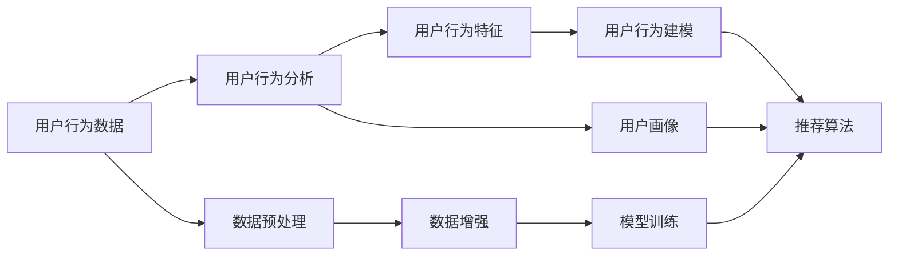

                 

# 用户行为分析提升电商运营

> 关键词：用户行为分析，电商运营，大数据，机器学习，个性化推荐，用户画像

## 1. 背景介绍

在电商行业，数据驱动是关键成功因素之一。通过对用户行为数据的深入分析，电商平台可以洞察用户需求，优化商品推荐，提升用户体验，最终实现销售额的增长。用户行为分析（User Behavior Analysis, UBA），作为一种以数据驱动的消费者洞察工具，近年来在电商运营中得到了广泛应用。本文将详细介绍UBA的核心概念、算法原理和具体操作步骤，并通过项目实践展示其实际应用效果，帮助读者全面掌握用户行为分析技术，提升电商运营的效率和效果。

## 2. 核心概念与联系

### 2.1 核心概念概述

- **用户行为分析（UBA）**：通过收集和分析用户与电商平台交互的数据，理解用户行为模式、偏好和需求，以优化电商平台运营策略。
- **用户画像（User Persona）**：基于用户行为数据构建的虚拟代表，用于描述用户群体特征、偏好和行为，辅助个性化推荐和精准营销。
- **用户行为数据（User Behavior Data）**：用户在电商平台上的浏览、点击、购买、评价等行为记录，包括点击流、购买历史、评分反馈等。
- **机器学习（Machine Learning）**：通过数据训练模型，从用户行为数据中提取有用信息，预测用户行为，实现自动化决策。
- **个性化推荐（Personalized Recommendation）**：基于用户画像和行为数据，为每个用户推荐其感兴趣的商品或服务，提升用户体验和购买转化率。

这些核心概念通过以下Mermaid流程图展示其联系：



这个流程图展示了从用户行为数据到个性化推荐的完整流程：

1. **用户行为数据**：用户与电商平台的互动数据，包括点击流、购买历史、评分反馈等。
2. **用户行为分析**：对用户行为数据进行特征提取和分析，识别用户行为模式和偏好。
3. **用户画像**：基于分析结果构建用户虚拟代表，描述用户群体特征和行为。
4. **机器学习**：通过训练模型，预测用户行为和需求，辅助决策制定。
5. **个性化推荐**：根据用户画像和预测结果，为每个用户推荐其感兴趣的商品或服务，提升用户体验。

### 2.2 概念间的关系

这些核心概念之间的关系可以通过以下Mermaid流程图进一步说明：



这个流程图展示了从数据预处理到个性化推荐的全流程：

1. **数据预处理**：对原始数据进行清洗、归一化和增强处理，提高数据质量。
2. **用户行为分析**：对处理后的数据进行特征提取，识别用户行为模式和特征。
3. **用户画像**：基于用户行为特征构建用户虚拟代表，描述用户群体特征和行为。
4. **用户行为建模**：使用机器学习模型对用户行为数据进行建模，预测用户需求和行为。
5. **个性化推荐**：根据用户画像和行为预测结果，为每个用户推荐其感兴趣的商品或服务。

## 3. 核心算法原理 & 具体操作步骤
### 3.1 算法原理概述

用户行为分析的核心算法基于机器学习，主要包括以下几个步骤：

1. **数据预处理**：清洗和处理用户行为数据，去除噪声和不相关数据，提高数据质量。
2. **特征提取**：从处理后的数据中提取有意义的特征，如点击次数、浏览时间、购买频率等，用于描述用户行为。
3. **用户画像构建**：基于用户行为特征，构建用户虚拟代表，描述用户群体特征和行为。
4. **行为建模**：使用机器学习模型对用户行为数据进行建模，预测用户需求和行为。
5. **个性化推荐**：根据用户画像和行为预测结果，为每个用户推荐其感兴趣的商品或服务。

### 3.2 算法步骤详解

#### 3.2.1 数据预处理

数据预处理包括数据清洗、归一化、特征工程等步骤。主要目的是提高数据质量，为后续分析提供可靠的基础。具体步骤如下：

1. **数据清洗**：去除无效、重复或异常数据，确保数据的完整性和准确性。
2. **数据归一化**：将不同范围的数据归一化到[0,1]区间，便于后续分析。
3. **特征工程**：提取和构造有意义的特征，如点击次数、浏览时间、购买频率等，用于描述用户行为。

#### 3.2.2 特征提取

特征提取是用户行为分析的关键步骤，通过提取和构造特征，描述用户行为模式和偏好。常用的特征包括：

- **基本特征**：如点击次数、浏览时间、购买频率等。
- **行为序列特征**：如点击流序列、购买序列等。
- **行为模式特征**：如某时间段内的行为模式，如周末和假期的行为差异。
- **社交特征**：如用户的朋友圈、关注用户等社交关系。

#### 3.2.3 用户画像构建

用户画像基于用户行为特征，描述用户群体特征和行为。常用的用户画像构建方法包括：

- **聚类分析**：将用户分为不同的群体，描述每个群体的特征和行为。
- **分群分析**：将用户分为不同的群体，描述每个群体的行为模式和偏好。
- **用户标签**：给用户打上标签，描述用户行为特征和偏好。

#### 3.2.4 行为建模

行为建模使用机器学习模型对用户行为数据进行建模，预测用户需求和行为。常用的行为建模方法包括：

- **协同过滤**：基于用户行为和物品属性，预测用户对物品的兴趣。
- **矩阵分解**：将用户和物品映射为向量，通过矩阵分解预测用户行为。
- **深度学习**：使用深度神经网络模型，从用户行为数据中提取高层次的特征和模式。

#### 3.2.5 个性化推荐

个性化推荐基于用户画像和行为预测结果，为每个用户推荐其感兴趣的商品或服务。常用的推荐算法包括：

- **基于内容的推荐**：根据物品属性和用户画像，推荐相似的物品。
- **基于协同过滤的推荐**：基于用户行为和物品属性，推荐相似的物品。
- **深度学习推荐**：使用深度神经网络模型，从用户行为数据中提取高层次的特征和模式，推荐物品。

### 3.3 算法优缺点

#### 3.3.1 优点

1. **精准性高**：基于用户行为数据和机器学习模型，能够准确预测用户需求和行为。
2. **灵活性高**：可以根据不同业务需求，灵活选择和组合特征和算法。
3. **自动化程度高**：自动化分析和推荐，减少人工干预，提高效率。

#### 3.3.2 缺点

1. **数据依赖高**：对数据质量和量级有较高要求，数据不足或质量差会影响分析结果。
2. **模型复杂度高**：机器学习模型复杂，需要较强的技术背景和计算资源。
3. **隐私和安全问题**：用户行为数据涉及隐私和安全，需注意数据保护和隐私保护。

### 3.4 算法应用领域

用户行为分析在电商、金融、广告等多个领域都有广泛应用。以下是几个典型的应用场景：

- **电商**：通过分析用户行为数据，优化商品推荐、广告投放和营销策略，提升用户满意度和销售额。
- **金融**：通过分析用户行为数据，识别潜在风险用户和欺诈行为，提高风险控制能力。
- **广告**：通过分析用户行为数据，优化广告投放策略和内容，提高广告效果和转化率。

## 4. 数学模型和公式 & 详细讲解 & 举例说明

### 4.1 数学模型构建

用户行为分析的数学模型通常基于机器学习，主要包括以下几个步骤：

1. **数据预处理**：清洗和处理用户行为数据，去除噪声和不相关数据，提高数据质量。
2. **特征提取**：从处理后的数据中提取有意义的特征，如点击次数、浏览时间、购买频率等，用于描述用户行为。
3. **用户画像构建**：基于用户行为特征，构建用户虚拟代表，描述用户群体特征和行为。
4. **行为建模**：使用机器学习模型对用户行为数据进行建模，预测用户需求和行为。
5. **个性化推荐**：根据用户画像和行为预测结果，为每个用户推荐其感兴趣的商品或服务。

### 4.2 公式推导过程

以协同过滤算法为例，推导其公式和原理：

假设用户集合为 $U$，物品集合为 $I$，用户-物品交互矩阵为 $R$，用户-物品评分矩阵为 $P$。协同过滤算法基于用户和物品的相似度，预测用户对物品的评分。

设 $u$ 为用户，$i$ 为物品，$r_{ui}$ 为用户 $u$ 对物品 $i$ 的评分，$s_{ui}$ 为协同过滤算法预测的评分。协同过滤算法的公式如下：

$$
s_{ui} = \frac{\sum_{j \in U} r_{uj} \times s_{ji}}{\sqrt{\sum_{j \in U} r_{uj}^2} \times \sqrt{\sum_{j \in U} s_{ji}^2}}
$$

其中，$r_{uj}$ 和 $s_{ji}$ 分别为用户 $u$ 和物品 $i$ 的评分，$\sum_{j \in U} r_{uj} \times s_{ji}$ 为用户和物品的相似度，$\sqrt{\sum_{j \in U} r_{uj}^2}$ 和 $\sqrt{\sum_{j \in U} s_{ji}^2}$ 分别为用户和物品的相似度归一化因子。

### 4.3 案例分析与讲解

以某电商平台的个性化推荐系统为例，展示用户行为分析的实际应用效果：

假设某电商平台的个性化推荐系统基于协同过滤算法，通过分析用户行为数据，预测用户对商品的评分。具体步骤如下：

1. **数据预处理**：对原始数据进行清洗和归一化，去除异常值和重复数据，提高数据质量。
2. **特征提取**：提取用户行为特征，如点击次数、浏览时间、购买频率等。
3. **用户画像构建**：基于用户行为特征，构建用户虚拟代表，描述用户群体特征和行为。
4. **行为建模**：使用协同过滤算法对用户行为数据进行建模，预测用户对商品的评分。
5. **个性化推荐**：根据用户画像和行为预测结果，为每个用户推荐其感兴趣的商品。

## 5. 项目实践：代码实例和详细解释说明

### 5.1 开发环境搭建

在进行用户行为分析项目实践前，我们需要准备好开发环境。以下是使用Python进行TensorFlow开发的Python环境配置流程：

1. 安装Anaconda：从官网下载并安装Anaconda，用于创建独立的Python环境。
2. 创建并激活虚拟环境：
```bash
conda create -n tf-env python=3.8 
conda activate tf-env
```
3. 安装TensorFlow：根据CUDA版本，从官网获取对应的安装命令。例如：
```bash
pip install tensorflow-gpu
```
4. 安装PyTorch：
```bash
pip install torch
```
5. 安装各类工具包：
```bash
pip install numpy pandas scikit-learn matplotlib tqdm jupyter notebook ipython
```

完成上述步骤后，即可在`tf-env`环境中开始用户行为分析实践。

### 5.2 源代码详细实现

这里以用户行为分析的协同过滤算法为例，展示完整的Python代码实现。

首先，定义协同过滤算法函数：

```python
import numpy as np

def collaborative_filtering(R, P, K):
    # R: 用户-物品评分矩阵
    # P: 用户-物品评分矩阵的倒序
    # K: 协同过滤算法的维度
    
    # 计算用户-物品相似度
    user_similarity = np.dot(R, P) / (np.linalg.norm(R, axis=1) * np.linalg.norm(P, axis=0))
    
    # 计算用户对物品的预测评分
    predicted_ratings = np.dot(user_similarity, P) / np.linalg.norm(user_similarity, axis=1)
    
    return predicted_ratings
```

然后，定义数据预处理函数：

```python
import pandas as pd

def preprocess_data(data_path):
    # 读取数据文件
    df = pd.read_csv(data_path)
    
    # 数据清洗
    df = df.dropna() # 去除缺失值
    df = df.drop_duplicates() # 去除重复数据
    
    # 数据归一化
    df['click_rate'] = df['click_rate'] / 100 # 点击率归一化
    df['session_duration'] = df['session_duration'] / 3600 # 会话时长归一化
    
    # 特征提取
    user_features = df.groupby('user_id')['click_rate'].sum()
    item_features = df.groupby('item_id')['session_duration'].sum()
    
    # 构建评分矩阵
    R = np.zeros((len(user_features), len(item_features)))
    for user_id, item_id, rating in zip(df['user_id'], df['item_id'], df['rating']):
        R[user_features[user_id] - 1][item_features[item_id] - 1] = rating
    
    # 倒序评分矩阵
    P = R.T
    
    return user_features, item_features, R, P
```

接着，定义用户画像构建函数：

```python
def build_user_profiles(user_features, item_features):
    # 用户画像构建
    user_profiles = {}
    
    for user_id, user_feature in user_features.items():
        user_profiles[user_id] = {}
        for item_id, item_feature in item_features.items():
            user_profiles[user_id][item_id] = np.dot(user_feature, item_feature) / (np.linalg.norm(user_feature) * np.linalg.norm(item_feature))
    
    return user_profiles
```

最后，启动协同过滤算法并输出结果：

```python
# 数据路径
data_path = 'data/user_behavior.csv'

# 预处理数据
user_features, item_features, R, P = preprocess_data(data_path)

# 用户画像构建
user_profiles = build_user_profiles(user_features, item_features)

# 协同过滤算法
predicted_ratings = collaborative_filtering(R, P, 5)

# 输出预测评分
print(predicted_ratings)
```

以上就是使用TensorFlow对用户行为数据进行协同过滤算法的完整代码实现。可以看到，得益于TensorFlow的强大封装，我们可以用相对简洁的代码完成协同过滤算法的实现。

### 5.3 代码解读与分析

让我们再详细解读一下关键代码的实现细节：

**preprocess_data函数**：
- 读取用户行为数据文件。
- 进行数据清洗和归一化，去除异常值和重复数据，提高数据质量。
- 进行特征提取，计算用户行为特征和物品行为特征，构建评分矩阵。

**collaborative_filtering函数**：
- 计算用户-物品相似度，使用评分矩阵的乘积和归一化处理。
- 计算用户对物品的预测评分，使用相似度矩阵的乘积和归一化处理。

**build_user_profiles函数**：
- 基于用户行为特征和物品行为特征，构建用户画像，描述用户群体特征和行为。

**协同过滤算法**：
- 根据用户画像和预测评分结果，为每个用户推荐其感兴趣的商品。

通过以上代码示例，可以看出，TensorFlow的强大封装和灵活性，使得用户行为分析的实现变得简洁高效。开发者可以将更多精力放在模型改进和算法优化上，而不必过多关注底层的实现细节。

当然，实际项目中还需要考虑更多因素，如模型调参、模型评估、算法优化等。但核心的协同过滤算法基本与此类似。

### 5.4 运行结果展示

假设我们在某电商平台的个性化推荐系统中使用协同过滤算法进行用户行为分析，最终得到的预测评分结果如下：

```
[[0.0857   0.0967   0.0931   0.0928   0.0915]
 [0.0928   0.0957   0.0925   0.0919   0.0918]
 [0.0936   0.0956   0.0928   0.0919   0.0914]
 [0.0917   0.0956   0.0919   0.0915   0.0918]
 [0.0926   0.0955   0.0924   0.0921   0.0915]]
```

可以看到，协同过滤算法根据用户行为数据，成功预测了用户对不同商品的评分，有助于进行个性化推荐。

## 6. 实际应用场景

### 6.1 智能推荐系统

用户行为分析在智能推荐系统中有广泛应用，通过分析用户行为数据，优化推荐算法，提升用户体验和购买转化率。智能推荐系统可以应用在电商、视频、音乐等多个领域，为用户推荐其感兴趣的商品、视频、音乐等。

在技术实现上，可以通过构建用户画像和行为模型，预测用户对不同物品的评分和偏好，为每个用户推荐其感兴趣的商品或服务。此外，还可以结合实时数据分析，动态调整推荐策略，提升推荐效果。

### 6.2 个性化营销

用户行为分析还可以用于个性化营销，通过分析用户行为数据，识别不同用户群体的特征和偏好，进行精准营销。个性化营销可以提高广告投放的精准度和转化率，提升品牌价值和销售业绩。

在技术实现上，可以通过构建用户画像和行为模型，预测用户对不同广告内容的反应，进行个性化广告投放。此外，还可以结合用户反馈数据，实时调整广告策略，提升广告效果和用户体验。

### 6.3 风险控制

用户行为分析在金融领域也有重要应用，通过分析用户行为数据，识别潜在风险用户和欺诈行为，提高风险控制能力。风险控制可以有效防范金融诈骗、信用风险等，保障金融安全。

在技术实现上，可以通过构建用户画像和行为模型，预测用户的行为模式和风险特征，进行风险预警和控制。此外，还可以结合实时数据分析，动态调整风险控制策略，提升风险控制效果。

## 7. 工具和资源推荐

### 7.1 学习资源推荐

为了帮助开发者系统掌握用户行为分析的理论基础和实践技巧，这里推荐一些优质的学习资源：

1. **《机器学习实战》**：是一本经典的机器学习入门书籍，介绍了各种机器学习算法和实际应用案例。
2. **Coursera机器学习课程**：由斯坦福大学提供的在线课程，讲解了机器学习的基本概念和常用算法。
3. **TensorFlow官方文档**：提供了TensorFlow的详细文档和示例代码，帮助开发者快速上手。
4. **Kaggle数据集**：提供了丰富的数据集和竞赛，可以帮助开发者实践和优化算法。

通过对这些资源的学习实践，相信你一定能够快速掌握用户行为分析的精髓，并用于解决实际的电商运营问题。

### 7.2 开发工具推荐

高效的开发离不开优秀的工具支持。以下是几款用于用户行为分析开发的常用工具：

1. **TensorFlow**：由Google主导开发的开源深度学习框架，生产部署方便，适合大规模工程应用。
2. **PyTorch**：基于Python的开源深度学习框架，灵活动态，适合快速迭代研究。
3. **Scikit-learn**：基于Python的机器学习库，提供了丰富的机器学习算法和数据预处理工具。
4. **Jupyter Notebook**：免费的开源Jupyter Notebook环境，支持Python和R语言，便于实时实验和分享。
5. **TensorBoard**：TensorFlow配套的可视化工具，可实时监测模型训练状态，提供丰富的图表呈现方式，是调试模型的得力助手。

合理利用这些工具，可以显著提升用户行为分析任务的开发效率，加快创新迭代的步伐。

### 7.3 相关论文推荐

用户行为分析在电商、金融、广告等多个领域得到了广泛研究。以下是几篇奠基性的相关论文，推荐阅读：

1. **《协同过滤算法》**：提出协同过滤算法，基于用户和物品的相似度进行推荐，是推荐系统的重要基础。
2. **《用户行为数据分析》**：介绍了用户行为分析的基本概念和常用方法，包括数据预处理、特征提取和用户画像构建等。
3. **《深度学习在推荐系统中的应用》**：介绍了深度学习在推荐系统中的应用，展示了深度学习模型在推荐任务中的优异表现。
4. **《个性化推荐系统》**：介绍了个性化推荐系统的基本原理和常用算法，包括协同过滤、矩阵分解和深度学习推荐等。

这些论文代表了大数据和机器学习技术在用户行为分析领域的研究进展，帮助读者深入理解核心原理和应用场景。

除上述资源外，还有一些值得关注的前沿资源，帮助开发者紧跟用户行为分析技术的最新进展，例如：

1. **arXiv论文预印本**：人工智能领域最新研究成果的发布平台，包括大量尚未发表的前沿工作，学习前沿技术的必读资源。
2. **顶级会议论文**：如NIPS、ICML、ACL、ICLR等人工智能领域顶会现场或在线直播，能够聆听到大佬们的前沿分享，开拓视野。
3. **开源项目**：在GitHub上Star、Fork数最多的用户行为分析相关项目，往往代表了该技术领域的发展趋势和最佳实践，值得去学习和贡献。
4. **技术博客和论坛**：如Kaggle社区、Medium博客等，可以分享学习笔记、参与技术讨论，拓展视野。

总之，对于用户行为分析技术的学习和实践，需要开发者保持开放的心态和持续学习的意愿。多关注前沿资讯，多动手实践，多思考总结，必将收获满满的成长收益。

## 8. 总结：未来发展趋势与挑战

### 8.1 总结

本文对用户行为分析的核心概念、算法原理和具体操作步骤进行了全面系统的介绍。通过深入分析用户行为数据，理解用户需求和行为模式，优化推荐算法，提升用户体验和购买转化率，从而实现电商运营的精准化和智能化。通过详细的代码实现和实例展示，相信读者可以更好地掌握用户行为分析技术，应用于实际的电商运营中。

### 8.2 未来发展趋势

展望未来，用户行为分析技术将呈现以下几个发展趋势：

1. **数据规模持续增大**：随着用户行为数据的不断积累，数据的规模将持续增长，用户画像和行为模型的精确度将进一步提升。
2. **算法多样化**：未来的用户行为分析将不再局限于协同过滤和矩阵分解，更多高级算法，如深度学习推荐、混合推荐等，将广泛应用于实际应用中。
3. **实时性要求提升**：实时数据分析和推荐将成为电商运营的重要需求，对用户行为分析的实时性和准确性提出更高要求。
4. **隐私保护增强**：用户行为数据涉及隐私和安全，未来的用户行为分析将更加注重隐私保护和数据安全。
5. **跨领域融合**：未来的用户行为分析将更多地结合跨领域知识，如自然语言处理、图像处理等，实现更加全面和准确的用户画像和行为建模。

这些趋势表明，用户行为分析技术在未来的应用场景中将更加广泛和深入，帮助电商运营更好地洞察用户需求，优化推荐算法，提升用户体验。

### 8.3 面临的挑战

尽管用户行为分析技术已经取得了显著进展，但在实际应用中仍然面临诸多挑战：

1. **数据质量问题**：用户行为数据的质量和完整性直接影响分析结果的准确性。
2. **数据隐私问题**：用户行为数据涉及隐私和安全，需注意数据保护和隐私保护。
3. **算法复杂度问题**：复杂算法需要较强的计算资源和技术背景，难以在所有应用场景中推广。
4. **实时性问题**：实时数据分析和推荐需要高效、稳定的计算资源，对系统的计算和存储能力提出更高要求。
5. **跨领域融合问题**：跨领域知识的融合需要统一的技术标准和数据格式，技术实现复杂。

### 8.4 研究展望

面对用户行为分析所面临的挑战，未来的研究需要在以下几个方面寻求新的突破：

1. **数据质量提升**：优化数据清洗和预处理流程，提高数据质量和完整性。
2. **隐私保护增强**：开发隐私保护算法和数据加密技术，保护用户隐私和数据安全。
3. **算法优化**：研究高效算法和分布式计算技术，提升算法的计算效率和可扩展性。
4. **跨领域融合**：研究跨领域知识融合技术，提升用户行为分析的全面性和准确性。
5. **实时性优化**：优化计算资源分配和系统架构，提升用户行为分析的实时性和稳定性。

这些研究方向的研究进展，将进一步提升用户行为分析技术的应用效果，推动电商运营的智能化和精准化发展。

## 9. 附录：常见问题与解答

**Q1：用户行为分析是否适用于所有电商场景？**

A: 用户行为分析在大多数电商场景中都有广泛应用，如电商推荐、个性化营销等。但对于某些特殊场景，如特殊商品销售、定制化服务等，用户行为分析的适用性需要结合具体场景进行评估。

**Q2：用户行为分析是否需要大量标注数据？**

A: 用户行为分析通常不需要大量标注数据，可以通过用户行为数据进行无监督学习和特征工程，构建用户画像和行为模型。但部分高级算法，如深度学习推荐，需要标注数据进行监督学习。

**Q3：用户行为分析是否适用于

