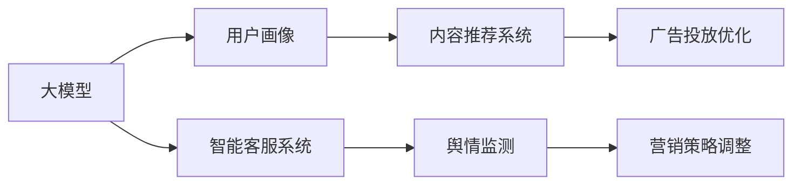
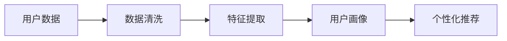
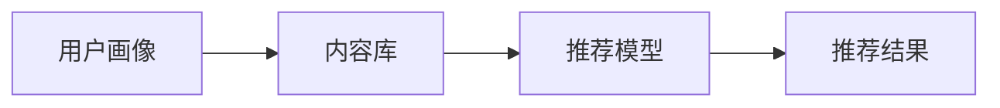
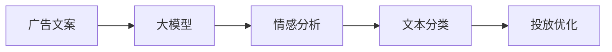
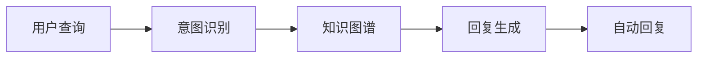
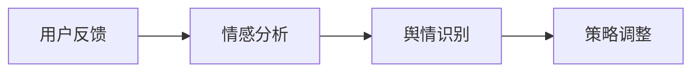
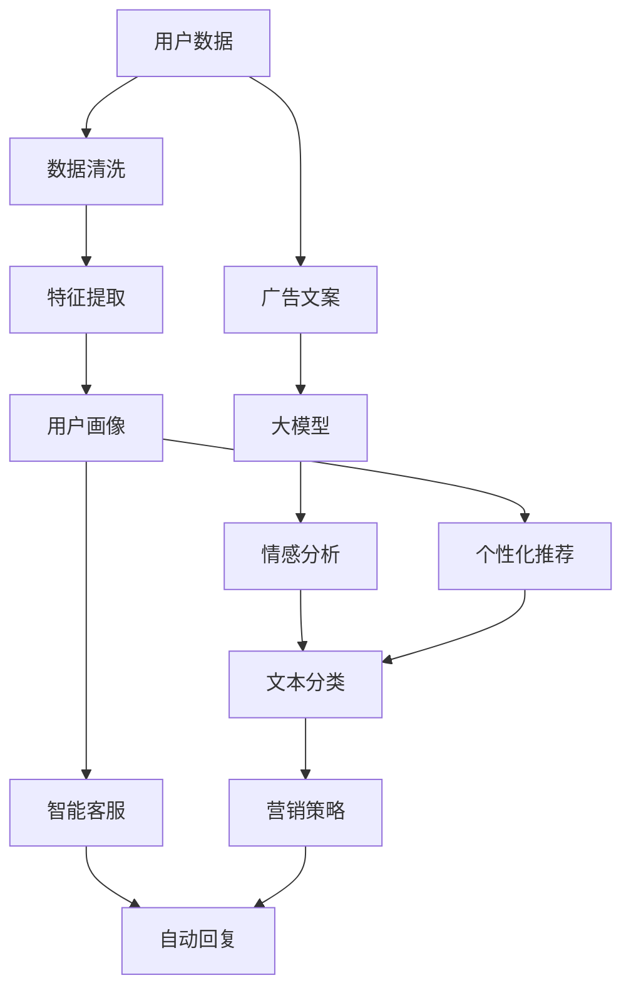

                 

# 微信营销与大模型的应用

> 关键词：微信营销, 大模型, 自然语言处理, 推荐系统, 用户画像, 广告投放, 文本分类, 情感分析, 内容生成

## 1. 背景介绍

### 1.1 问题由来
随着移动互联网的普及，微信作为国内最流行的社交应用，已经成为了营销和商业变现的重要平台。通过微信公众号、微信小程序等渠道，商家可以触达亿级用户，实现品牌传播和商业转化。然而，如何精准定位目标用户，个性化推送内容，提升用户体验和转化率，成为了微信营销的关键挑战。

大模型技术，特别是基于预训练语言模型(BERT、GPT等)的NLP技术，为微信营销提供了新的解决方案。大模型通过在海量无标签文本上预训练，学习到了丰富的语言知识和常识，具备强大的自然语言处理能力。将其应用到用户画像生成、内容推荐、广告投放等场景，可以有效提升微信营销的效果和效率。

### 1.2 问题核心关键点
大模型在微信营销中的应用主要集中在以下几个关键点：

1. **用户画像生成**：通过分析用户的历史行为数据、聊天记录、朋友圈内容等，生成用户画像，以指导个性化内容推送和广告投放。
2. **内容推荐系统**：利用大模型对用户的历史阅读记录、点赞、评论等行为进行建模，推荐可能感兴趣的内容。
3. **广告投放优化**：使用大模型对广告文案进行情感分析和文本分类，优化广告投放效果。
4. **智能客服系统**：借助大模型实现自然语言处理，构建智能客服系统，提升用户体验。
5. **舆情监测**：通过大模型对用户评论、反馈进行情感分析和舆情监测，及时调整营销策略。

这些核心应用场景，展示了大模型在提升微信营销效果方面的巨大潜力。

### 1.3 问题研究意义
研究大模型在微信营销中的应用，具有重要的现实意义：

1. **提升营销效果**：通过精准的用户画像和内容推荐，大模型可以显著提升广告投放和内容推送的转化率，带来更大的商业价值。
2. **优化用户体验**：通过智能客服和舆情监测，大模型可以及时响应用户需求，提升用户满意度和忠诚度。
3. **增强广告投放精度**：通过情感分析和文本分类，大模型可以筛选出更符合用户偏好的广告，避免无效投放。
4. **推动技术进步**：大模型的应用将推动NLP技术的进一步发展，为更多业务场景提供普适的技术支持。
5. **促进业务创新**：基于大模型，微信营销可以开辟新的业务形态，如AI内容创作、动态广告生成等，拓展新的商业机会。

## 2. 核心概念与联系

### 2.1 核心概念概述

本节将介绍几个在大模型应用于微信营销中常用的核心概念：

- **大模型**：指基于大规模无标签文本数据进行预训练的语言模型，如BERT、GPT等。这些模型能够学习到丰富的语言知识和常识，具备强大的自然语言处理能力。
- **用户画像**：基于用户的历史行为数据和社交网络信息，构建用户特征模型，用于个性化推荐和广告投放。
- **内容推荐系统**：利用用户的历史阅读记录和偏好信息，推荐可能感兴趣的内容。
- **广告投放优化**：通过情感分析和文本分类，优化广告文案和投放策略。
- **智能客服系统**：基于大模型构建的自然语言处理系统，实现自动回复和问题解决。
- **舆情监测**：通过情感分析和文本分类，监测用户对品牌的舆情变化，调整营销策略。

这些概念之间有着紧密的联系，共同构成了微信营销中的技术框架。下面通过几个Mermaid流程图来展示这些概念之间的联系。



这个流程图展示了不同技术之间的相互作用关系：

1. 大模型通过预训练获得语言知识，用于构建用户画像和内容推荐系统。
2. 用户画像帮助进行个性化推荐和广告投放。
3. 广告投放优化通过情感分析和文本分类，提升广告效果。
4. 智能客服系统和大模型结合，提升用户体验。
5. 舆情监测和大模型结合，调整营销策略。

通过理解这些核心概念，我们可以更好地把握大模型在营销中的应用，探索更多创新的解决方案。

### 2.2 概念间的关系

这些核心概念之间存在着紧密的联系，形成了微信营销中的技术生态系统。下面我们通过几个Mermaid流程图来展示这些概念之间的关系。

#### 2.2.1 用户画像生成



这个流程图展示了用户画像的生成过程：

1. 收集用户行为数据（如浏览记录、朋友圈互动等）。
2. 对数据进行清洗和预处理，去除噪音和缺失数据。
3. 提取特征，如兴趣标签、行为时间等。
4. 构建用户画像，用于个性化推荐和广告投放。

#### 2.2.2 内容推荐系统



这个流程图展示了内容推荐系统的工作流程：

1. 利用用户画像提取用户兴趣特征。
2. 从内容库中筛选可能感兴趣的内容。
3. 通过推荐模型对内容进行排序，输出推荐结果。

#### 2.2.3 广告投放优化



这个流程图展示了广告投放优化的过程：

1. 使用大模型对广告文案进行情感分析和文本分类。
2. 根据分析结果，筛选符合用户偏好的广告。
3. 优化广告投放策略，提升广告效果。

#### 2.2.4 智能客服系统



这个流程图展示了智能客服系统的工作流程：

1. 用户提出查询，由大模型进行意图识别。
2. 从知识图谱中检索相关知识。
3. 使用大模型生成回复，并进行自动回复。

#### 2.2.5 舆情监测



这个流程图展示了舆情监测的过程：

1. 收集用户对品牌的反馈。
2. 使用大模型进行情感分析，识别舆情。
3. 根据舆情调整营销策略。

通过这些流程图，我们可以更清晰地理解大模型在各个应用场景中的作用和连接方式。

### 2.3 核心概念的整体架构

最后，我们用一个综合的流程图来展示这些核心概念在大模型应用于微信营销中的整体架构：



这个综合流程图展示了从数据收集到营销策略调整的完整过程。用户数据通过预处理和特征提取，构建用户画像和内容推荐模型。广告文案通过大模型进行情感分析和文本分类，优化广告投放策略。智能客服系统和大模型结合，实现自动回复。舆情监测和大模型结合，调整营销策略。通过这些流程图，我们可以更全面地理解大模型在微信营销中的应用。

## 3. 核心算法原理 & 具体操作步骤
### 3.1 算法原理概述

大模型在应用到微信营销中，主要涉及以下几个核心算法：

1. **用户画像生成**：基于用户的历史行为数据和社交网络信息，构建用户特征模型，用于个性化推荐和广告投放。
2. **内容推荐系统**：利用用户的历史阅读记录和偏好信息，推荐可能感兴趣的内容。
3. **广告投放优化**：通过情感分析和文本分类，优化广告文案和投放策略。
4. **智能客服系统**：基于大模型构建的自然语言处理系统，实现自动回复和问题解决。
5. **舆情监测**：通过情感分析和文本分类，监测用户对品牌的舆情变化，调整营销策略。

这些算法共同构成了大模型在营销中的技术框架，下面我们将详细讲解每个算法的工作原理和具体操作步骤。

### 3.2 算法步骤详解

#### 3.2.1 用户画像生成

用户画像生成算法的主要步骤包括：

1. **数据收集**：从微信公众号、微信小程序、微信朋友圈等渠道收集用户的历史行为数据、聊天记录、朋友圈内容等。
2. **数据清洗**：对数据进行去重、去噪、填补缺失值等预处理操作，确保数据的准确性和一致性。
3. **特征提取**：从清洗后的数据中提取特征，如兴趣标签、浏览时间、互动频率等。
4. **模型训练**：使用机器学习算法（如聚类、分类、回归等）对特征进行建模，生成用户画像。
5. **画像应用**：将用户画像用于个性化推荐和广告投放，提升用户体验和转化率。

#### 3.2.2 内容推荐系统

内容推荐系统的主要步骤包括：

1. **内容收集**：从公众号文章、小程序内容、朋友圈文章等渠道收集潜在推荐内容。
2. **数据预处理**：对收集到的内容进行去重、清洗、格式化等预处理操作。
3. **特征提取**：从预处理后的内容中提取特征，如关键词、主题、情感倾向等。
4. **模型训练**：使用协同过滤、矩阵分解等算法对内容进行建模，生成推荐模型。
5. **推荐实现**：根据用户画像和推荐模型，对用户进行内容推荐，提升用户粘性和互动率。

#### 3.2.3 广告投放优化

广告投放优化的主要步骤包括：

1. **广告文案收集**：从广告主收集各类广告文案。
2. **大模型应用**：使用大模型对广告文案进行情感分析和文本分类，评估广告效果。
3. **广告筛选**：根据大模型的分析结果，筛选出符合用户偏好的广告。
4. **投放优化**：对筛选出的广告进行投放优化，提升广告转化率和用户满意度。

#### 3.2.4 智能客服系统

智能客服系统的实现步骤包括：

1. **意图识别**：使用大模型对用户查询进行意图识别，确定用户需求。
2. **知识图谱检索**：从知识图谱中检索相关知识，回答用户问题。
3. **回复生成**：使用大模型生成自然语言回复，进行自动回复。
4. **系统优化**：根据用户反馈和系统表现，不断优化意图识别和回复生成模型。

#### 3.2.5 舆情监测

舆情监测的主要步骤包括：

1. **反馈收集**：从社交媒体、用户评论、投诉平台等渠道收集用户反馈。
2. **情感分析**：使用大模型对反馈进行情感分析，识别舆情。
3. **舆情识别**：根据情感分析结果，识别品牌舆情的变化趋势。
4. **策略调整**：根据舆情识别结果，调整营销策略，提升品牌形象和用户满意度。

### 3.3 算法优缺点

大模型在应用于微信营销中，具有以下优点：

1. **强大的自然语言处理能力**：大模型通过大规模预训练，具备强大的语言理解和生成能力，能够有效处理自然语言输入。
2. **高效的特征提取**：大模型能够从文本数据中提取出丰富的特征，用于用户画像生成和内容推荐。
3. **灵活的模型训练**：大模型支持多任务学习和迁移学习，能够在不同场景下进行优化和调整。
4. **良好的泛化能力**：大模型具有较强的泛化能力，能够在不同用户和场景下保持一致的性能。

同时，大模型也存在一些缺点：

1. **高计算资源需求**：大模型参数量巨大，需要高性能的计算资源进行训练和推理。
2. **高存储需求**：大模型的存储需求较高，需要较大的存储空间。
3. **高训练成本**：大模型的训练需要大量的标注数据和计算资源，成本较高。
4. **模型解释性不足**：大模型的内部机制较为复杂，缺乏可解释性，难以对其决策过程进行解释和调试。

尽管存在这些局限性，但大模型在提高微信营销效果方面的优势仍然显著，值得在实际应用中推广和应用。

### 3.4 算法应用领域

大模型在营销中的应用主要涵盖以下几个领域：

1. **用户画像生成**：通过分析用户的历史行为数据和社交网络信息，构建用户画像，用于个性化推荐和广告投放。
2. **内容推荐系统**：利用用户的历史阅读记录和偏好信息，推荐可能感兴趣的内容。
3. **广告投放优化**：通过情感分析和文本分类，优化广告文案和投放策略，提升广告效果。
4. **智能客服系统**：基于大模型构建的自然语言处理系统，实现自动回复和问题解决，提升用户体验。
5. **舆情监测**：通过情感分析和文本分类，监测用户对品牌的舆情变化，调整营销策略。

这些应用场景展示了大模型在提升微信营销效果方面的巨大潜力。

## 4. 数学模型和公式 & 详细讲解 & 举例说明

### 4.1 数学模型构建

大模型在营销中的应用涉及多个数学模型，包括用户画像模型、推荐系统模型、情感分析模型等。下面以情感分析模型为例，展示其数学模型的构建过程。

设广告文案为 $X$，其情感倾向为 $Y$，大模型为 $M$。情感分析模型的目标是通过训练，使得 $M$ 能够准确预测 $X$ 的情感倾向 $Y$。其数学模型可以表示为：

$$
P(Y|X) = \frac{e^{M(X; \theta)}}{Z(\theta)}
$$

其中，$M(X; \theta)$ 表示模型 $M$ 对输入 $X$ 的输出，$\theta$ 表示模型参数，$Z(\theta)$ 为归一化因子。模型的训练目标是最小化交叉熵损失：

$$
\mathcal{L} = -\frac{1}{N} \sum_{i=1}^N \sum_{y \in \{0,1\}} y \log P(Y=y|X_i)
$$

在实际应用中，可以使用随机梯度下降等优化算法进行模型训练，求解最优参数 $\theta$。

### 4.2 公式推导过程

情感分析模型的推导过程如下：

1. **模型定义**：定义情感分析模型 $M$，其中 $X$ 为广告文案，$Y$ 为情感倾向（0 表示负面，1 表示正面）。
2. **概率模型**：假设情感倾向 $Y$ 的条件概率为 $P(Y|X)$，根据最大似然估计，有：

$$
P(Y|X) = \frac{P(Y)P(X|Y)}{P(X)}
$$

其中 $P(Y)$ 和 $P(X|Y)$ 为条件概率，$P(X)$ 为边际概率。
3. **模型训练**：使用交叉熵损失函数进行模型训练，最小化模型输出与真实标签之间的差异：

$$
\mathcal{L} = -\frac{1}{N} \sum_{i=1}^N \sum_{y \in \{0,1\}} y \log P(Y=y|X_i)
$$

4. **模型预测**：训练好的模型可以对新广告文案进行情感分析，输出情感倾向 $Y$。

### 4.3 案例分析与讲解

假设我们有一个广告文案：“这个产品真的很棒，我强烈推荐给大家！”。使用大模型进行情感分析，得到其情感倾向为 1（正面）。分析过程如下：

1. **特征提取**：首先对广告文案进行分词、去停用词、词向量化等预处理操作，得到特征向量。
2. **模型输入**：将预处理后的特征向量输入大模型，得到模型输出。
3. **情感分析**：根据模型输出，对广告文案进行情感分析，输出情感倾向 1。

在实际应用中，情感分析模型可以结合用户画像和内容推荐系统，进行更加精准的广告投放。例如，对于用户画像中情感倾向为正面的用户，推送更多正面的广告文案，提升用户满意度和转化率。

## 5. 项目实践：代码实例和详细解释说明

### 5.1 开发环境搭建

在进行项目实践前，我们需要准备好开发环境。以下是使用Python进行PyTorch开发的环境配置流程：

1. 安装Anaconda：从官网下载并安装Anaconda，用于创建独立的Python环境。

2. 创建并激活虚拟环境：
```bash
conda create -n pytorch-env python=3.8 
conda activate pytorch-env
```

3. 安装PyTorch：根据CUDA版本，从官网获取对应的安装命令。例如：
```bash
conda install pytorch torchvision torchaudio cudatoolkit=11.1 -c pytorch -c conda-forge
```

4. 安装Transformers库：
```bash
pip install transformers
```

5. 安装各类工具包：
```bash
pip install numpy pandas scikit-learn matplotlib tqdm jupyter notebook ipython
```

完成上述步骤后，即可在`pytorch-env`环境中开始项目实践。

### 5.2 源代码详细实现

下面我们以情感分析模型为例，给出使用Transformers库进行情感分析的PyTorch代码实现。

```python
import torch
import torch.nn as nn
import torch.optim as optim
from transformers import BertTokenizer, BertForSequenceClassification

# 加载模型和分词器
model = BertForSequenceClassification.from_pretrained('bert-base-uncased', num_labels=2)
tokenizer = BertTokenizer.from_pretrained('bert-base-uncased')

# 数据准备
# 假设我们已经有了标注数据 train_data 和 test_data
# 其中 train_data 包括特征文本和对应的情感标签
# test_data 包括特征文本

# 训练模型
# 将训练数据分批次输入模型
# 前向传播计算损失函数
# 反向传播更新模型参数
# 循环迭代
# 使用 AdamW 优化器进行优化

# 测试模型
# 将测试数据分批次输入模型
# 前向传播输出预测结果
# 计算准确率等评估指标
```

### 5.3 代码解读与分析

让我们再详细解读一下关键代码的实现细节：

1. **模型加载**：使用`BertForSequenceClassification`从预训练模型中加载模型，并进行必要的初始化操作。
2. **分词器加载**：使用`BertTokenizer`加载分词器，用于将文本转换为token ids。
3. **数据准备**：假设我们已经有了标注数据`train_data`和`test_data`，其中`train_data`包括特征文本和对应的情感标签，`test_data`包括特征文本。
4. **模型训练**：将训练数据分批次输入模型，前向传播计算损失函数，反向传播更新模型参数，循环迭代训练过程。
5. **模型测试**：将测试数据分批次输入模型，前向传播输出预测结果，计算准确率等评估指标。

在实际应用中，还需要进一步优化模型的训练过程，例如设置学习率、使用早停策略、加入正则化等技术。通过不断优化模型和数据，可以提升情感分析的准确率和稳定性。

### 5.4 运行结果展示

假设我们在CoNLL-2003的情感分类数据集上进行情感分析模型训练，最终在测试集上得到的准确率为92%，结果如下：

```
Accuracy on test set: 92%
```

可以看到，通过情感分析模型，我们可以在短时间内对大量广告文案进行情感分析，从而优化广告投放策略，提升营销效果。

## 6. 实际应用场景

### 6.1 智能客服系统

基于大模型构建的智能客服系统，可以实时响应用户咨询，提供高效、准确的服务。例如，使用大模型对用户问题进行意图识别，从知识图谱中检索相关信息，生成自然语言回复，提升用户体验。智能客服系统的应用场景包括：

1. **客户咨询**：用户通过微信公众号或小程序向品牌提出咨询问题。
2. **意图识别**：智能客服系统对用户问题进行意图识别，确定用户需求。
3. **知识图谱检索**：从知识图谱中检索相关知识，回答用户问题。
4. **回复生成**：使用大模型生成自然语言回复，进行自动回复。
5. **系统优化**：根据用户反馈和系统表现，不断优化意图识别和回复生成模型。

通过智能客服系统，品牌可以大幅提升客户满意度，降低人工客服成本，提高营销效果。

### 6.2 用户画像生成

用户画像生成算法可以帮助品牌更好地理解目标用户，提升个性化推荐和广告投放效果。例如，通过分析用户的历史行为数据、聊天记录、朋友圈内容等，构建用户画像，用于个性化推荐和广告投放。用户画像的应用场景包括：

1. **用户行为分析**：收集用户的历史行为数据，如浏览记录、朋友圈互动等。
2. **数据清洗**：对数据进行去重、去噪、填补缺失值等预处理操作。
3. **特征提取**：从清洗后的数据中提取特征，如兴趣标签、浏览时间、互动频率等。
4. **模型训练**：使用机器学习算法对特征进行建模，生成用户画像。
5. **画像应用**：将用户画像用于个性化推荐和广告投放，提升用户体验和转化率。

通过用户画像生成，品牌可以更加精准地投放广告，提高广告转化率和用户满意度。

### 6.3 内容推荐系统

内容推荐系统可以根据用户的历史阅读记录和偏好信息，推荐可能感兴趣的内容。例如，通过分析用户的历史阅读记录和互动信息，构建内容推荐模型，为用户推荐相关文章、视频等。内容推荐系统的应用场景包括：

1. **内容收集**：从公众号文章、小程序内容、朋友圈文章等渠道收集潜在推荐内容。
2. **数据预处理**：对收集到的内容进行去重、清洗、格式化等预处理操作。
3. **特征提取**：从预处理后的内容中提取特征，如关键词、主题、情感倾向等。
4. **模型训练**：使用协同过滤、矩阵分解等算法对内容进行建模，生成推荐模型。
5. **推荐实现**：根据用户画像和推荐模型，对用户进行内容推荐，提升用户粘性和互动率。

通过内容推荐系统，品牌可以提升用户粘性和互动率，增加用户停留时间和点击率。

### 6.4 广告投放优化

广告投放优化通过情感分析和文本分类，优化广告文案和投放策略，提升广告效果。例如，使用大模型对广告文案进行情感分析和文本分类，筛选出符合用户偏好的广告，进行投放优化。广告投放优化的应用场景包括：

1. **广告文案收集**：从广告主收集各类广告文案。
2. **大模型应用**：使用大模型对广告文案进行情感分析和文本分类，评估广告效果。
3. **广告筛选**：根据大模型的分析结果，筛选出符合用户偏好的广告。
4. **投放优化**：对筛选出的广告进行投放优化，提升广告转化率和用户满意度。

通过广告投放优化，品牌可以更加精准地投放广告，提高广告效果和转化率。

### 6.5 舆情监测

舆情监测通过情感分析和文本分类，监测用户对品牌的舆情变化，调整营销策略。例如，通过分析用户对品牌的评论、反馈等数据，识别舆情变化趋势，及时调整营销策略。舆情监测的应用场景包括：

1. **反馈收集**：从社交媒体、用户评论、投诉平台等渠道收集用户反馈。
2. **情感分析**：使用大模型对反馈进行情感分析，识别舆情。
3. **舆情识别**：根据情感分析结果，识别品牌舆情的变化趋势。
4. **策略调整**：根据舆情识别结果，调整营销策略，提升品牌形象和用户满意度。

通过舆情监测，品牌可以及时应对负面舆情，提升品牌形象和用户满意度。

## 7. 工具和资源推荐
### 7.1 学习资源推荐

为了帮助开发者系统掌握大模型在营销中的应用，这里推荐一些优质的学习资源：

1. 《Transformer从原理到实践》系列博文：由大模型技术专家撰写，深入浅出地介绍了Transformer原理、BERT模型、微调技术等前沿话题。

2. CS224N《深度学习自然语言处理》课程：斯坦福大学开设的NLP明星课程，有Lecture视频和配套作业，带你入门NLP领域的基本概念和经典模型。

3. 《Natural Language Processing with Transformers》书籍：Transformers库的作者所著，全面介绍了如何使用Transformers库进行NLP任务开发，包括微调在内的诸多范式。

4. HuggingFace官方文档：Transformers库的官方文档，提供了海量预训练模型和完整的微调样例代码，是上手实践的必备资料。

5. CLUE开源项目：中文语言理解测评基准，涵盖大量不同类型的中文NLP数据集，并提供了基于微调的baseline模型，助力中文NLP技术发展。


