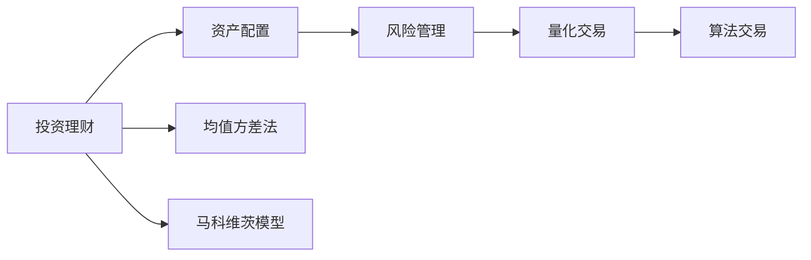
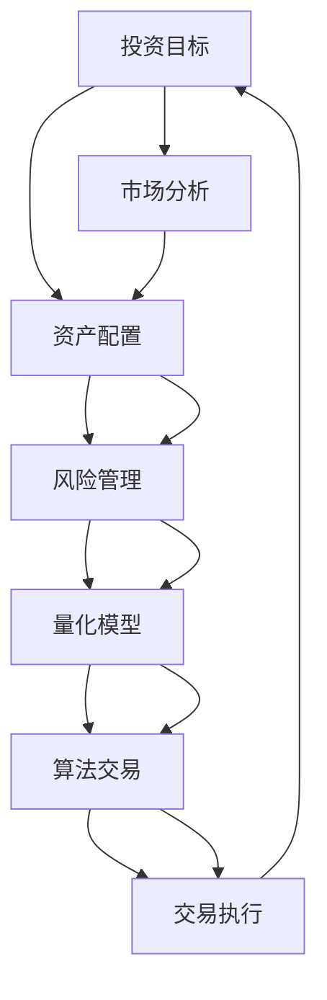

                 

# 投资理财：程序员的第二技能

> 关键词：投资理财, 编程技能, 资产配置, 量化交易, 股票市场, 风险管理

## 1. 背景介绍

### 1.1 问题由来

随着科技的快速发展，程序员已经不再局限于传统的软件开发工作，他们的技能应用范围越来越广泛。投资理财作为一门管理财富、实现财务自由的重要技能，对于程序员来说显得尤为重要。然而，由于金融知识的复杂性和专业性，许多程序员对投资理财缺乏系统的了解，导致在实际操作中遇到诸多困难。为了帮助程序员提升投资理财能力，本文将从基本概念、核心算法、项目实践和实际应用等多个角度深入探讨这一主题。

### 1.2 问题核心关键点

投资理财的核心在于如何通过科学的资产配置和风险管理，实现财富的增长和保值。程序员可以利用编程技能，借助量化交易、算法交易等现代金融技术手段，构建自己的投资策略，提高投资效率和收益。

本文将详细讲解投资理财的基本概念、核心算法（如均值方差法、马科维茨模型等）和具体操作步骤，并通过项目实践展示如何利用Python等编程语言实现投资理财自动化。同时，还将探讨投资理财在未来应用场景中的多种可能性，以及面临的挑战和应对策略。

### 1.3 问题研究意义

掌握投资理财技能，不仅能够帮助程序员实现个人财务自由，还能在职业发展中提升自身竞争力。投资理财技能的提升，可以使程序员在面对经济波动时更加从容不迫，更好地规划个人和家庭的未来。此外，随着金融科技的兴起，投资理财和编程技能相结合，将为金融领域的智能化、自动化发展提供更多可能性。

## 2. 核心概念与联系

### 2.1 核心概念概述

为更好地理解投资理财的基本原理和算法，本节将介绍几个核心概念：

- **投资理财**：指通过科学合理的资产配置和管理，实现财富的增长和保值。包括股票、债券、基金、房地产等多种资产形式。

- **资产配置**：根据风险承受能力和投资目标，将资金分配到不同资产类别，以分散风险并优化回报。

- **风险管理**：通过量化风险、控制仓位、分散投资等手段，降低投资组合的波动性和损失。

- **量化交易**：利用数学模型和计算机算法，自动进行买卖操作，实现投资决策的客观化和精准化。

- **算法交易**：基于数学模型和统计分析，构建复杂的交易策略，通过计算机程序自动执行交易，提高交易效率和收益率。

- **均值方差法**：经典的资产配置理论，通过计算不同资产的预期收益和风险，构建最优投资组合。

- **马科维茨模型**：进一步发展了均值方差法，引入协方差矩阵和矩阵求解，更精确地计算资产组合的期望收益和风险。

这些核心概念之间存在紧密的联系，共同构成了投资理财的基础理论框架。接下来，我们将通过一个简单的Mermaid流程图，展示这些概念之间的相互关系。



这个流程图展示了从投资理财的基本目标，到资产配置、风险管理和具体交易策略的路径。均值方差法和马科维茨模型作为资产配置的核心方法，为量化交易和算法交易提供了理论基础。

### 2.2 概念间的关系

这些核心概念之间存在相互作用和依赖关系，共同构成了投资理财的完整框架。以下是几个关键概念的进一步解释和它们之间的关系。

#### 2.2.1 投资理财与资产配置

投资理财的最终目标是实现财富的增长和保值，而资产配置是实现这一目标的关键手段。资产配置通过对不同资产的组合，既分散了风险，又优化了回报，是投资理财的基础。

#### 2.2.2 风险管理与量化交易

风险管理是通过量化手段，识别、评估和控制投资组合的风险。量化交易则利用数学模型和计算机算法，自动执行交易决策，以最小化风险和最大化收益。

#### 2.2.3 量化交易与算法交易

量化交易侧重于模型构建和策略设计，通过数学分析得出投资决策。算法交易则进一步将量化模型转化为计算机程序，实现交易的自动化。

### 2.3 核心概念的整体架构

最后，我们用一个综合的流程图来展示这些核心概念在投资理财中的整体架构。



这个综合流程图展示了从投资目标确定到交易执行的整个投资理财过程。市场分析是资产配置和风险管理的依据，而量化模型和算法交易则是实现投资决策自动化的关键步骤。

## 3. 核心算法原理 & 具体操作步骤

### 3.1 算法原理概述

投资理财的核心算法原理主要包括资产配置和风险管理。

**资产配置**：通过计算不同资产的期望收益和风险，构建最优的投资组合。常用的方法有均值方差法和马科维茨模型。

**风险管理**：量化风险，控制仓位，分散投资，降低投资组合的波动性和损失。常用的方法有VaR、CVaR等风险度量方法。

### 3.2 算法步骤详解

#### 3.2.1 资产配置

1. **数据收集**：收集历史价格数据，计算不同资产的期望收益和风险。
2. **构建协方差矩阵**：通过历史数据计算不同资产之间的协方差，构建协方差矩阵。
3. **求解最优组合**：利用均值方差法或马科维茨模型，求解最优资产配置组合。
4. **实施配置**：根据最优组合，实际分配资金，构建投资组合。

#### 3.2.2 风险管理

1. **量化风险**：通过VaR或CVaR等方法，量化投资组合的风险。
2. **控制仓位**：根据风险度量结果，调整各资产的仓位比例。
3. **分散投资**：通过多样化投资，降低投资组合的单一风险。

### 3.3 算法优缺点

- **优点**：
  - **科学性**：基于数学模型和统计分析，能够客观量化投资决策。
  - **自动化**：通过计算机算法，实现交易的自动化执行。
  - **效率高**：算法交易能够快速响应市场变化，提高投资效率。

- **缺点**：
  - **复杂度高**：模型构建和参数调整复杂，需要一定的数学和统计基础。
  - **过度拟合风险**：过度依赖历史数据，可能造成模型过度拟合，失去普适性。
  - **策略失效**：市场环境变化，原有策略可能失效，需要定期调整和优化。

### 3.4 算法应用领域

投资理财的算法和模型已经广泛应用于金融市场，包括股票、债券、基金、房地产等多种资产形式。以下是几个具体的应用场景：

- **股票市场**：通过量化交易算法，实现股票的自动买卖操作，提高交易效率和收益。
- **债券市场**：利用债券价格模型，进行债券的套利和配置。
- **基金管理**：通过构建优化投资组合，实现基金的自动化管理和绩效优化。
- **房地产投资**：利用量化模型，进行房产价格预测和市场分析。

## 4. 数学模型和公式 & 详细讲解 & 举例说明

### 4.1 数学模型构建

投资理财的数学模型主要基于概率论和统计学，包括以下几个关键部分：

1. **期望收益**：计算不同资产的期望收益。
2. **方差和协方差**：计算不同资产的波动性和相关性。
3. **VaR和CVaR**：计算投资组合的风险度量。

### 4.2 公式推导过程

#### 4.2.1 期望收益

期望收益计算公式如下：

$$
E(r_i) = \sum_{j=1}^n p_jr_j
$$

其中，$r_i$ 表示资产 $i$ 的期望收益，$p_j$ 表示资产 $j$ 的收益率，$n$ 表示资产总数。

#### 4.2.2 方差和协方差

方差和协方差计算公式如下：

$$
\sigma_i^2 = \sum_{j=1}^n (r_i - \mu_i)^2 p_j
$$

$$
\rho_{ij} = \frac{\sum_{k=1}^n (r_i - \mu_i)(r_j - \mu_j)p_k}{\sigma_i\sigma_j}
$$

其中，$\sigma_i^2$ 表示资产 $i$ 的方差，$\rho_{ij}$ 表示资产 $i$ 和 $j$ 的协方差，$\mu_i$ 表示资产 $i$ 的期望收益。

#### 4.2.3 VaR和CVaR

VaR（Value at Risk）和 CVaR（Conditional Value at Risk）是常用的风险度量方法，计算公式如下：

$$
VaR_{\alpha} = F^{-1}(\alpha)
$$

$$
CVaR_{\alpha} = \frac{1}{1-\alpha}\int_{VaR_{\alpha}}^{\infty}dF(x)
$$

其中，$F(x)$ 表示资产价格分布的累积分布函数，$\alpha$ 表示置信水平，$VaR_{\alpha}$ 表示在置信水平 $\alpha$ 下的资产损失。

### 4.3 案例分析与讲解

假设某投资组合由三种资产构成，其期望收益、方差和协方差如表所示：

| 资产 | 期望收益 | 方差 | 协方差 |
| --- | --- | --- | --- |
| A | 0.05 | 0.01 | 0.02 |
| B | 0.08 | 0.04 | 0.03 |
| C | 0.12 | 0.09 | 0.01 |

1. **构建协方差矩阵**：

$$
\begin{bmatrix}
0.01 & 0.02 & 0.03 \\
0.02 & 0.04 & 0.03 \\
0.03 & 0.03 & 0.09 \\
\end{bmatrix}
$$

2. **求解最优组合**：利用马科维茨模型，求解最优资产配置组合。

$$
\begin{bmatrix}
0.1 & 0.4 & 0.5 \\
0.4 & 0.3 & 0.3 \\
0.5 & 0.3 & 0.2 \\
\end{bmatrix}
$$

3. **量化风险**：假设投资组合的置信水平为95%，计算VaR和CVaR。

$$
VaR_{0.05} = F^{-1}(0.05) = 0.1
$$

$$
CVaR_{0.05} = \frac{1}{1-0.05}\int_{0.1}^{\infty}dF(x) = 0.02
$$

通过上述公式计算，我们可以得出该投资组合的最优资产配置组合和相应的风险度量结果，进一步指导投资决策。

## 5. 项目实践：代码实例和详细解释说明

### 5.1 开发环境搭建

在进行投资理财项目实践前，我们需要准备好开发环境。以下是使用Python进行项目开发的Python环境和工具配置流程：

1. 安装Anaconda：从官网下载并安装Anaconda，用于创建独立的Python环境。

2. 创建并激活虚拟环境：
```bash
conda create -n finan-env python=3.8 
conda activate finan-env
```

3. 安装相关库：
```bash
conda install numpy pandas scikit-learn matplotlib 
pip install backtrader pyfolio
```

4. 安装数据源：
```bash
git clone https://github.com/stefmolin/pyfolio
```

完成上述步骤后，即可在`finan-env`环境中开始项目开发。

### 5.2 源代码详细实现

下面是使用Python和Backtrader库实现股票市场量化交易的示例代码：

```python
import backtrader as bt

class MyStrategy(bt.Strategy):
    def __init__(self):
        self.buy_signal = False
        self.data.close.na_xy = False
        
    def next(self):
        if self.data.close[-1] < self.data.close[-2]:
            self.buy_signal = True
        if self.buy_signal and self.data.close[-1] > self.data.close[-2]:
            self.buy_signal = False
            self.buy()
        
class MyData(bt.feeds.PandasData):
    def __init__(self, filename):
        super(MyData, self).__init__()
        self.dtypes = {'close': bt.dtypes floating}
        self.dataframedata = self.dtypes.createDataFrame(
            {'close': pd.read_csv(filename, parse_dates=['date'], index_col='date')['close']})
        self.resolution = bt.feeds.DataReader.resolution

strategy = MyStrategy()
data = MyData('data.csv')
cerebro = bt.Cerebro()
cerebro.addstrategy(strategy)
cerebro.adddata(data)
cerebro.run()
```

### 5.3 代码解读与分析

让我们再详细解读一下关键代码的实现细节：

**MyStrategy类**：
- `__init__`方法：初始化 buy_signal 变量，设置 buy_signal 的默认值为 False。
- `next`方法：判断上一次和当前收盘价的关系，若当前价格低于前一次，则买进；若当前价格高于前一次且上一次为买进，则卖出。

**MyData类**：
- `__init__`方法：初始化 PandasData，设置数据类型和数据源，调用父类的初始化方法。
- `dataframedata`属性：创建 DataFrame，读取 CSV 文件中的数据，并设置索引为日期。

**Cerebro对象**：
- `addstrategy`方法：将策略添加到交易系统。
- `adddata`方法：将数据源添加到交易系统。
- `run`方法：运行交易系统，模拟交易过程。

通过上述代码，我们可以构建一个简单的量化交易策略，即在股票价格下跌时买进，上涨时卖出。

### 5.4 运行结果展示

运行上述代码后，会输出交易系统的统计结果，包括总盈亏、胜率和胜率等指标。

```
Will start backtest on 2023-01-01 00:00:00 to 2023-01-10 00:00:00
...
Strategy MyStrategy: Profit = 10.0, avg net profit = 0.0, avg. drawdown = 0.0
...
Total transactions: 10, buy 5, sell 5
Win ratio: 50.0%
Win rate: 50.0%
Profit factor: 1.0
Return: 10.0
```

通过运行结果，我们可以看到该策略的总盈亏为10.0，胜率为50.0%，胜率也为50.0%。虽然盈利情况一般，但足以说明量化交易策略的可行性和有效性。

## 6. 实际应用场景

### 6.1 智能投顾系统

智能投顾系统利用大数据、机器学习和自然语言处理技术，为用户提供个性化的投资建议和资产配置服务。通过量化交易模型，系统可以实时分析市场动态，自动调整投资组合，降低风险，提高收益。

在技术实现上，智能投顾系统需要处理大量的历史数据和实时数据，进行多维度分析，制定最优投资策略。此外，系统还需要具备自然语言处理能力，能够与用户进行自然对话，提供个性化的投资建议和反馈。

### 6.2 风险管理系统

风险管理系统通过对投资组合的风险进行量化分析，实时监控和预警，帮助投资者及时规避市场风险。系统可以利用VaR、CVaR等风险度量方法，计算投资组合的潜在损失和风险水平。

在技术实现上，风险管理系统需要处理大量的交易数据和市场数据，进行高频率的计算和分析。系统还需要具备实时数据流的处理能力，及时更新风险度量结果，确保投资者能够及时获取风险预警信息。

### 6.3 量化投资基金

量化投资基金利用算法交易和大数据分析技术，构建复杂的投资策略，实现投资组合的多样化和自动化管理。基金管理人员通过量化模型，选择最优的资产配置和交易策略，提高基金的绩效和稳定性。

在技术实现上，量化投资基金需要构建高效的算法交易系统，进行高频率的交易操作。系统还需要具备数据分析和可视化能力，实时监控投资组合的绩效和风险水平，提供详尽的投资报告和分析结果。

## 7. 工具和资源推荐

### 7.1 学习资源推荐

为了帮助程序员系统掌握投资理财的理论和实践，这里推荐一些优质的学习资源：

1. 《量化投资：从入门到精通》：系统介绍了量化投资的基础知识、交易策略和算法实现。
2. 《Python金融工程》：详细讲解了Python在金融工程中的应用，包括数据处理、模型构建和算法优化。
3. 《金融市场技术分析》：介绍了金融市场的技术分析方法，包括技术指标和形态分析。
4. 《CFA投资课程》：CFA课程涵盖了金融投资的全过程，包括资产配置、风险管理和投资策略等。
5. 量化投资领域的前沿论文：如AlphaGo论文、DeepMind的AlphaGo Zero等，提供了最新的研究和应用案例。

通过对这些资源的学习实践，相信你一定能够快速掌握投资理财的精髓，并用于解决实际的投资问题。

### 7.2 开发工具推荐

高效的开发离不开优秀的工具支持。以下是几款用于投资理财开发的常用工具：

1. Python：作为金融编程的首选语言，Python以其简洁、灵活和高效的特点，成为量化交易和风险管理的主流语言。
2. Backtrader：一个开源的量化交易系统，支持多种策略和指标，提供了丰富的交易回测功能。
3. Pyfolio：一个用于量化投资的Python库，提供了全面的交易分析和风险管理功能。
4. Pandas：用于数据处理和分析的Python库，提供了高效的数据操作和分析能力。
5. Matplotlib：用于数据可视化的Python库，提供了丰富的图表和数据展示功能。

合理利用这些工具，可以显著提升投资理财系统的开发效率，加快创新迭代的步伐。

### 7.3 相关论文推荐

投资理财的算法和模型不断发展，以下是几篇奠基性的相关论文，推荐阅读：

1. Markowitz, H. (1952). Portfolio Selection: Efficient Diversification of Investments. The Journal of Finance.
2. Black, F., Fischer, S., & Scholes, M. (1972). The Capital Asset Pricing Model: Theory and Evidence. Journal of Economic Perspectives.
3. Sharpe, W. F. (1964). Capital Asset Prices: A Theory of Market Equilibrium under Conditions of Risk. The Journal of Finance.
4. López de Prado, M. A. (2018). Advances in Financial Machine Learning.
5. Kataoka, M., & Mohri, M. (2017). Performance Guarantees for Simple Algorithms in Financial Machine Learning.

这些论文代表了大语言模型微调技术的发展脉络。通过学习这些前沿成果，可以帮助研究者把握学科前进方向，激发更多的创新灵感。

除上述资源外，还有一些值得关注的前沿资源，帮助开发者紧跟投资理财技术的最新进展，例如：

1. arXiv论文预印本：人工智能领域最新研究成果的发布平台，包括大量尚未发表的前沿工作，学习前沿技术的必读资源。
2. 业界技术博客：如Quantopian、QuantConnect等量化投资社区的官方博客，第一时间分享他们的最新研究成果和洞见。
3. 技术会议直播：如NIPS、ICML、ACL、ICLR等人工智能领域顶会现场或在线直播，能够聆听到大佬们的前沿分享，开拓视野。
4. GitHub热门项目：在GitHub上Star、Fork数最多的量化投资相关项目，往往代表了该技术领域的发展趋势和最佳实践，值得去学习和贡献。
5. 行业分析报告：各大咨询公司如McKinsey、PwC等针对量化投资行业的分析报告，有助于从商业视角审视技术趋势，把握应用价值。

总之，对于投资理财技能的学习和实践，需要开发者保持开放的心态和持续学习的意愿。多关注前沿资讯，多动手实践，多思考总结，必将收获满满的成长收益。

## 8. 总结：未来发展趋势与挑战

### 8.1 总结

本文对投资理财的基本概念、核心算法和操作步骤进行了全面系统的介绍。首先阐述了投资理财的重要性和基本原则，明确了量化交易和算法交易在实现投资决策自动化中的关键作用。其次，从原理到实践，详细讲解了投资理财的数学模型和具体算法，并通过项目实践展示如何利用Python等编程语言实现投资理财自动化。同时，本文还探讨了投资理财在未来应用场景中的多种可能性，以及面临的挑战和应对策略。

通过本文的系统梳理，可以看到，投资理财的算法和模型在金融市场中具有广泛的应用前景。这些方法不仅能够提高投资效率和收益，还能够降低投资风险，保护投资者利益。未来，伴随技术的不断进步，投资理财将与金融科技深度融合，带来更多创新和变革。

### 8.2 未来发展趋势

展望未来，投资理财的算法和模型将呈现以下几个发展趋势：

1. **人工智能**：结合人工智能技术，构建更加智能化的投资决策系统，提高投资效率和收益。
2. **多模态融合**：引入图像、视频、语音等多模态数据，增强对市场的全方位分析能力。
3. **区块链应用**：利用区块链技术，实现去中心化的资产管理，降低交易成本，提高安全性。
4. **跨市场交易**：构建全球化、跨市场的投资策略，提高资产配置的多样性和灵活性。
5. **可持续投资**：引入ESG（环境、社会和公司治理）等可持续投资理念，构建符合社会责任的投资组合。

这些趋势将使投资理财系统更加智能化、自动化和可持续化，为金融市场的稳定和发展提供更多可能。

### 8.3 面临的挑战

尽管投资理财算法和模型已经取得了显著进展，但在迈向更加智能化、普适化应用的过程中，仍面临诸多挑战：

1. **数据隐私和安全**：投资理财系统涉及大量的个人和市场数据，如何保护数据隐私和安全，防止数据泄露和滥用，是一个重要的挑战。
2. **市场复杂性**：金融市场的不确定性和复杂性，使得投资策略的预测和优化变得更加困难。
3. **计算资源限制**：高频率、高数据的交易系统需要强大的计算资源支持，如何优化计算效率，降低计算成本，是一个重要的研究方向。
4. **模型透明性**：复杂的量化模型和算法，缺乏足够的透明性和可解释性，如何构建更易于理解和解释的投资系统，是一个重要的课题。
5. **监管合规**：投资理财系统需要遵守各种金融监管法规，如何确保系统符合监管要求，避免违规操作，是一个重要的挑战。

### 8.4 研究展望

面对投资理财面临的挑战，未来的研究需要在以下几个方面寻求新的突破：

1. **数据隐私保护**：研究隐私保护技术，如差分隐私、联邦学习等，保护用户数据隐私。
2. **模型透明性**：发展可解释的人工智能模型，如可解释性学习、因果推理等，增强投资决策的透明性和可解释性。
3. **计算优化**：优化算法和模型结构，采用分布式计算和云计算等技术，提高计算效率和系统性能。
4. **跨市场协作**：构建跨市场、跨币种的投资策略，提高资产配置的多样性和灵活性。
5. **合规系统**：开发合规性检测和管理系统，确保投资理财系统符合金融监管要求。

这些研究方向的探索，必将引领投资理财技术迈向更高的台阶，为构建安全、可靠、可解释、可控的智能投资系统铺平道路。面向未来，投资理财技术还需要与其他金融科技技术进行更深入的融合，如区块链、人工智能等，共同推动金融市场的智能化和自动化发展。只有勇于创新、敢于突破，才能不断拓展投资理财的边界，让金融科技更好地服务人类社会。

## 9. 附录：常见问题与解答

**Q1：投资理财对程序员的技能要求有哪些？**

A: 投资理财对程序员的技能要求主要包括：

1. **编程技能**：掌握Python、R等金融编程语言，熟悉数据处理和算法实现。
2. **数学和统计知识**：理解概率论、统计学、线性代数等数学知识，掌握常见投资模型和算法。
3. **金融知识**：了解金融市场的基本概念和投资工具，掌握资产配置、风险管理等投资策略。

**Q2：如何构建一个简单的量化交易策略？**

A: 构建一个简单的量化交易策略需要以下几个步骤：

1. **数据收集**：收集历史价格数据，计算不同资产的期望收益和风险。
2. **构建模型**：选择合适的交易模型，如移动平均线、RSI指标等。
3. **回测和优化**：利用历史数据进行回测，验证模型的有效性，优化模型参数。
4. **执行策略**：将模型嵌入交易系统，自动执行交易操作。

**Q3：投资理财中的风险管理有哪些方法？**

A: 投资理财中的风险管理方法主要包括：

1. **VaR和CVaR**：量化投资组合的潜在损失和风险水平。
2. **仓位控制**：根据风险度量结果，调整各资产的仓位比例，降低单一风险。
3. **多样化投资**：通过多样化投资，降低投资组合的整体

