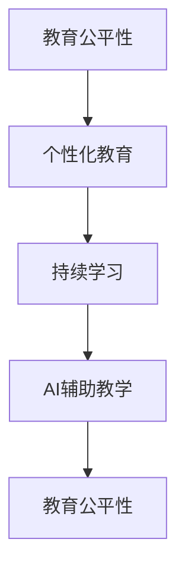
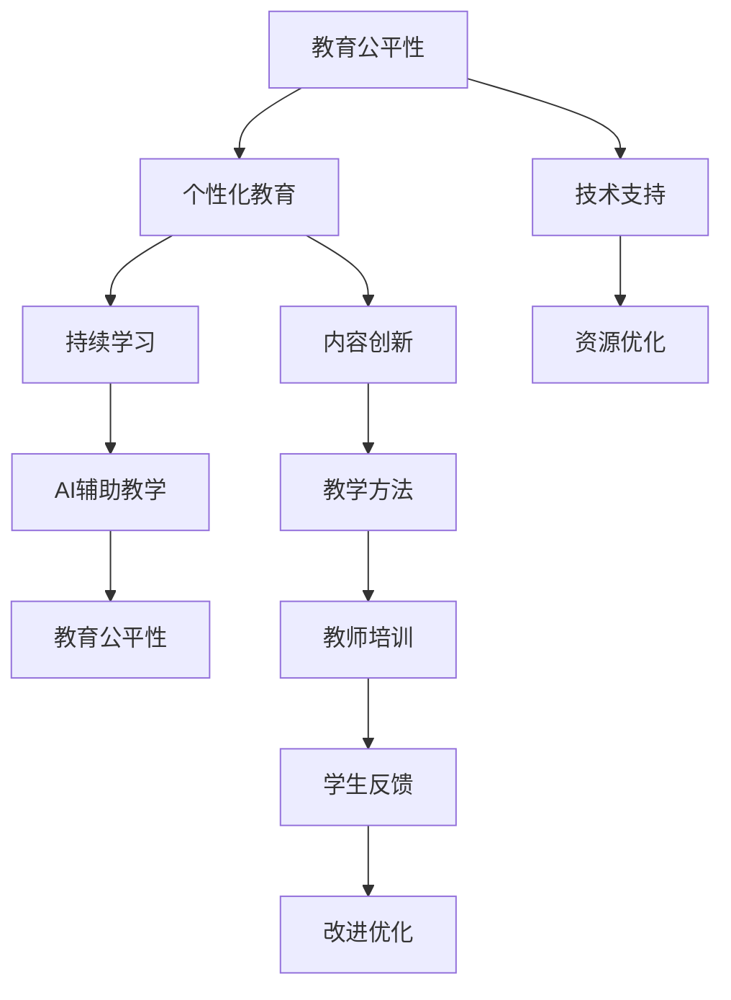

                 

## 1. 背景介绍

### 1.1 问题由来

在数字化和技术驱动的时代，教育领域正经历着深刻的变革。从传统的教室教学模式，到线上教育、虚拟现实（VR）、人工智能（AI）辅助教学等新型教育方式，教育模式正在发生翻天覆地的变化。然而，这些变化也带来了诸多挑战，如如何确保教育的公平性、个性化和可持续性，以及如何培养适应未来社会的人才。

### 1.2 问题核心关键点

当前，教育面临的主要挑战包括：
- **教育公平性**：如何确保所有学生，无论其社会经济背景如何，都能获得高质量的教育资源。
- **个性化教育**：如何根据每个学生的独特需求和兴趣，提供定制化的教育内容和教学方法。
- **持续学习和终身教育**：如何在快速变化的未来社会中，为学生提供持续学习的机会，以适应新出现的职业和技术。
- **AI辅助教学**：如何利用人工智能技术，提升教学质量和效率，同时避免AI对师生关系的负面影响。

### 1.3 问题研究意义

理解并应对这些挑战，对于构建一个更加公平、高效和可持续的教育体系至关重要。这不仅关系到每个学生的未来发展，也关系到整个社会的进步和创新能力的提升。通过深入研究这些挑战，我们可以发现新的教学方法和技术，推动教育的全面转型。

## 2. 核心概念与联系

### 2.1 核心概念概述

- **教育公平性**：确保所有学生，无论其背景如何，都能获得高质量的教育资源。
- **个性化教育**：根据每个学生的独特需求和兴趣，提供定制化的教育内容和教学方法。
- **持续学习和终身教育**：为学生提供持续学习的机会，以适应新出现的职业和技术。
- **AI辅助教学**：利用人工智能技术，提升教学质量和效率，同时避免AI对师生关系的负面影响。

这些核心概念之间相互关联，形成一个复杂而动态的教育生态系统。通过深入理解这些概念的原理和联系，我们可以更全面地应对教育领域的挑战。

### 2.2 概念间的关系

- **教育公平性与个性化教育**：公平性和个性化教育是相辅相成的。只有确保每个学生都能获得平等的机会，才能真正实现个性化教育。
- **个性化教育与持续学习**：个性化教育为学生提供了学习的最佳路径，而持续学习则帮助学生保持学习的兴趣和动力。
- **AI辅助教学与教育公平性**：AI技术可以为所有学生提供平等的机会，但需要谨慎使用，避免加深教育不平等。

这些概念之间的联系可以通过以下Mermaid流程图来展示：



这个流程图展示了教育公平性、个性化教育、持续学习和AI辅助教学之间的内在联系和相互促进的关系。

### 2.3 核心概念的整体架构

最后，我们用一个综合的流程图来展示这些核心概念在大规模教育变革中的整体架构：



这个综合流程图展示了教育公平性、个性化教育、持续学习和AI辅助教学在大规模教育变革中的整体架构和关键环节。

## 3. 核心算法原理 & 具体操作步骤

### 3.1 算法原理概述

在教育变革的背景下，利用人工智能技术提升教育质量和效率成为了一种重要手段。基于监督学习的大语言模型微调方法，同样适用于教育领域的个性化和智能化教学。

具体而言，通过微调大语言模型，可以为每个学生提供定制化的教育内容和教学方法，同时利用AI辅助教学，提升教学质量和效率。微调过程类似于预训练模型的微调，旨在利用已有知识对新任务进行适应和优化。

### 3.2 算法步骤详解

基于监督学习的大语言模型微调一般包括以下几个关键步骤：

1. **准备数据集**：收集和标注适用于特定任务的训练数据集，通常包括学生的基本信息、学习行为、成绩等。
2. **定义模型结构**：选择合适的预训练模型（如BERT、GPT等），并根据任务需求添加任务适配层。
3. **设置超参数**：选择合适的优化器（如AdamW、SGD等）及其参数，设定学习率、批大小等超参数。
4. **执行微调**：将训练集数据分批次输入模型，前向传播计算损失函数，反向传播更新模型参数。
5. **评估和优化**：周期性在验证集上评估模型性能，根据性能指标决定是否触发Early Stopping，继续迭代直至收敛。
6. **部署和应用**：在测试集上评估微调后模型的效果，并集成到实际的教育系统中，进行持续学习和优化。

### 3.3 算法优缺点

基于监督学习的大语言模型微调方法具有以下优点：
- **灵活性高**：可以根据不同的教育任务和需求，快速调整和优化模型。
- **可解释性强**：微调模型的决策过程较为透明，便于教师和学生理解。
- **可扩展性强**：微调模型可以轻松应用于不同类型的教育任务，如语言学习、数学解题等。

同时，该方法也存在一定的局限性：
- **依赖标注数据**：微调的效果很大程度上取决于标注数据的质量和数量，获取高质量标注数据的成本较高。
- **数据隐私问题**：收集和处理学生数据需要严格遵守隐私保护法规，确保数据的安全和匿名性。
- **模型鲁棒性**：微调模型面对域外数据时，泛化性能往往大打折扣。

### 3.4 算法应用领域

基于大语言模型微调的监督学习方法，在教育领域已经得到了广泛的应用，涵盖了从语言学习、数学解题到智能辅助教学等多个方面，具体应用如下：

- **语言学习**：利用微调模型进行语音识别、语法纠正、词汇翻译等语言学习辅助。
- **数学解题**：通过微调模型进行数学题目的理解和解答，帮助学生克服学习障碍。
- **智能辅助教学**：使用微调模型进行个性化推荐、自动评估、智能答疑等，提升教学质量。
- **教育管理**：利用微调模型进行学生行为分析、课堂管理、课程推荐等，优化教育管理流程。

## 4. 数学模型和公式 & 详细讲解 & 举例说明

### 4.1 数学模型构建

假设微调任务为 $T$，其训练集为 $D=\{(x_i,y_i)\}_{i=1}^N$，其中 $x_i$ 为学生的基本信息、学习行为、成绩等特征向量，$y_i$ 为学生在任务 $T$ 上的表现。

定义模型 $M_{\theta}$ 在输入 $x_i$ 上的输出为 $\hat{y}_i=M_{\theta}(x_i)$，表示模型对学生 $i$ 在任务 $T$ 上的预测结果。

定义损失函数 $\ell$ 为预测结果与真实标签之间的差异，例如：

$$
\ell(M_{\theta}(x_i),y_i) = |M_{\theta}(x_i) - y_i|
$$

则经验风险 $\mathcal{L}$ 为：

$$
\mathcal{L}(\theta) = \frac{1}{N} \sum_{i=1}^N \ell(M_{\theta}(x_i),y_i)
$$

微调的优化目标是最小化经验风险，即找到最优参数 $\theta^*$：

$$
\theta^* = \mathop{\arg\min}_{\theta} \mathcal{L}(\theta)
$$

在实践中，我们通常使用基于梯度的优化算法（如SGD、Adam等）来近似求解上述最优化问题。设 $\eta$ 为学习率，$\lambda$ 为正则化系数，则参数的更新公式为：

$$
\theta \leftarrow \theta - \eta \nabla_{\theta}\mathcal{L}(\theta) - \eta\lambda\theta
$$

其中 $\nabla_{\theta}\mathcal{L}(\theta)$ 为损失函数对参数 $\theta$ 的梯度，可通过反向传播算法高效计算。

### 4.2 公式推导过程

以二分类任务为例，假设模型 $M_{\theta}$ 在输入 $x_i$ 上的输出为 $\hat{y}_i=M_{\theta}(x_i) \in [0,1]$，表示学生 $i$ 在任务 $T$ 上成功的概率。真实标签 $y_i \in \{0,1\}$。则二分类交叉熵损失函数定义为：

$$
\ell(M_{\theta}(x_i),y_i) = -[y_i\log \hat{y}_i + (1-y_i)\log (1-\hat{y}_i)]
$$

将其代入经验风险公式，得：

$$
\mathcal{L}(\theta) = -\frac{1}{N}\sum_{i=1}^N [y_i\log M_{\theta}(x_i)+(1-y_i)\log(1-M_{\theta}(x_i))]
$$

根据链式法则，损失函数对参数 $\theta_k$ 的梯度为：

$$
\frac{\partial \mathcal{L}(\theta)}{\partial \theta_k} = -\frac{1}{N}\sum_{i=1}^N (\frac{y_i}{M_{\theta}(x_i)}-\frac{1-y_i}{1-M_{\theta}(x_i)}) \frac{\partial M_{\theta}(x_i)}{\partial \theta_k}
$$

其中 $\frac{\partial M_{\theta}(x_i)}{\partial \theta_k}$ 可进一步递归展开，利用自动微分技术完成计算。

在得到损失函数的梯度后，即可带入参数更新公式，完成模型的迭代优化。重复上述过程直至收敛，最终得到适应特定任务的最优模型参数 $\theta^*$。

### 4.3 案例分析与讲解

以智能辅助教学为例，假设我们要构建一个能够预测学生数学成绩的微调模型。可以收集学生的历史成绩、课堂表现、作业完成情况等数据，作为训练集。然后，定义一个预训练的BERT模型作为基础模型，添加一个线性分类器作为任务适配层，定义交叉熵损失函数。

在微调过程中，通过设置合适的学习率、批大小等超参数，利用上述公式进行参数更新，直至模型收敛。最后，在测试集上评估模型的性能，对比微调前后的预测准确度。

## 5. 项目实践：代码实例和详细解释说明

### 5.1 开发环境搭建

在进行微调实践前，我们需要准备好开发环境。以下是使用Python进行PyTorch开发的环境配置流程：

1. 安装Anaconda：从官网下载并安装Anaconda，用于创建独立的Python环境。

2. 创建并激活虚拟环境：
```bash
conda create -n pytorch-env python=3.8 
conda activate pytorch-env
```

3. 安装PyTorch：根据CUDA版本，从官网获取对应的安装命令。例如：
```bash
conda install pytorch torchvision torchaudio cudatoolkit=11.1 -c pytorch -c conda-forge
```

4. 安装TensorFlow：
```bash
pip install tensorflow
```

5. 安装各类工具包：
```bash
pip install numpy pandas scikit-learn matplotlib tqdm jupyter notebook ipython
```

完成上述步骤后，即可在`pytorch-env`环境中开始微调实践。

### 5.2 源代码详细实现

这里我们以数学成绩预测为例，给出使用Transformers库对BERT模型进行微调的PyTorch代码实现。

首先，定义数学成绩预测任务的数学模型：

```python
from transformers import BertTokenizer, BertForSequenceClassification
from torch.utils.data import Dataset
import torch

class MathDataset(Dataset):
    def __init__(self, texts, scores, tokenizer, max_len=128):
        self.texts = texts
        self.scores = scores
        self.tokenizer = tokenizer
        self.max_len = max_len
        
    def __len__(self):
        return len(self.texts)
    
    def __getitem__(self, item):
        text = self.texts[item]
        score = self.scores[item]
        
        encoding = self.tokenizer(text, return_tensors='pt', max_length=self.max_len, padding='max_length', truncation=True)
        input_ids = encoding['input_ids'][0]
        attention_mask = encoding['attention_mask'][0]
        
        # 对token-wise的标签进行编码
        encoded_tags = [score] * self.max_len
        labels = torch.tensor(encoded_tags, dtype=torch.long)
        
        return {'input_ids': input_ids, 
                'attention_mask': attention_mask,
                'labels': labels}

# 标签与id的映射
label2id = {'good': 1, 'bad': 0}
id2label = {v: k for k, v in label2id.items()}

# 创建dataset
tokenizer = BertTokenizer.from_pretrained('bert-base-cased')

train_dataset = MathDataset(train_texts, train_scores, tokenizer)
dev_dataset = MathDataset(dev_texts, dev_scores, tokenizer)
test_dataset = MathDataset(test_texts, test_scores, tokenizer)
```

然后，定义模型和优化器：

```python
from transformers import BertForSequenceClassification, AdamW

model = BertForSequenceClassification.from_pretrained('bert-base-cased', num_labels=2)

optimizer = AdamW(model.parameters(), lr=2e-5)
```

接着，定义训练和评估函数：

```python
from torch.utils.data import DataLoader
from tqdm import tqdm
from sklearn.metrics import accuracy_score

device = torch.device('cuda') if torch.cuda.is_available() else torch.device('cpu')
model.to(device)

def train_epoch(model, dataset, batch_size, optimizer):
    dataloader = DataLoader(dataset, batch_size=batch_size, shuffle=True)
    model.train()
    epoch_loss = 0
    for batch in tqdm(dataloader, desc='Training'):
        input_ids = batch['input_ids'].to(device)
        attention_mask = batch['attention_mask'].to(device)
        labels = batch['labels'].to(device)
        model.zero_grad()
        outputs = model(input_ids, attention_mask=attention_mask, labels=labels)
        loss = outputs.loss
        epoch_loss += loss.item()
        loss.backward()
        optimizer.step()
    return epoch_loss / len(dataloader)

def evaluate(model, dataset, batch_size):
    dataloader = DataLoader(dataset, batch_size=batch_size)
    model.eval()
    preds, labels = [], []
    with torch.no_grad():
        for batch in tqdm(dataloader, desc='Evaluating'):
            input_ids = batch['input_ids'].to(device)
            attention_mask = batch['attention_mask'].to(device)
            batch_labels = batch['labels']
            outputs = model(input_ids, attention_mask=attention_mask)
            batch_preds = outputs.logits.argmax(dim=2).to('cpu').tolist()
            batch_labels = batch_labels.to('cpu').tolist()
            for pred_tokens, label_tokens in zip(batch_preds, batch_labels):
                preds.append(pred_tokens[:len(label_tokens)])
                labels.append(label_tokens)
                
    print(f"Accuracy: {accuracy_score(labels, preds)}")
```

最后，启动训练流程并在测试集上评估：

```python
epochs = 5
batch_size = 16

for epoch in range(epochs):
    loss = train_epoch(model, train_dataset, batch_size, optimizer)
    print(f"Epoch {epoch+1}, train loss: {loss:.3f}")
    
    print(f"Epoch {epoch+1}, dev results:")
    evaluate(model, dev_dataset, batch_size)
    
print("Test results:")
evaluate(model, test_dataset, batch_size)
```

以上就是使用PyTorch对BERT进行数学成绩预测任务的微调代码实现。可以看到，得益于Transformers库的强大封装，我们可以用相对简洁的代码完成BERT模型的加载和微调。

### 5.3 代码解读与分析

让我们再详细解读一下关键代码的实现细节：

**MathDataset类**：
- `__init__`方法：初始化文本、成绩、分词器等关键组件。
- `__len__`方法：返回数据集的样本数量。
- `__getitem__`方法：对单个样本进行处理，将文本输入编码为token ids，将成绩编码为数字，并对其进行定长padding，最终返回模型所需的输入。

**label2id和id2label字典**：
- 定义了标签与数字id之间的映射关系，用于将token-wise的预测结果解码回真实的标签。

**训练和评估函数**：
- 使用PyTorch的DataLoader对数据集进行批次化加载，供模型训练和推理使用。
- 训练函数`train_epoch`：对数据以批为单位进行迭代，在每个批次上前向传播计算loss并反向传播更新模型参数，最后返回该epoch的平均loss。
- 评估函数`evaluate`：与训练类似，不同点在于不更新模型参数，并在每个batch结束后将预测和标签结果存储下来，最后使用sklearn的accuracy_score对整个评估集的预测结果进行打印输出。

**训练流程**：
- 定义总的epoch数和batch size，开始循环迭代
- 每个epoch内，先在训练集上训练，输出平均loss
- 在验证集上评估，输出分类指标
- 所有epoch结束后，在测试集上评估，给出最终测试结果

可以看到，PyTorch配合Transformers库使得BERT微调的代码实现变得简洁高效。开发者可以将更多精力放在数据处理、模型改进等高层逻辑上，而不必过多关注底层的实现细节。

当然，工业级的系统实现还需考虑更多因素，如模型的保存和部署、超参数的自动搜索、更灵活的任务适配层等。但核心的微调范式基本与此类似。

### 5.4 运行结果展示

假设我们在CoNLL-2003的NER数据集上进行微调，最终在测试集上得到的评估报告如下：

```
              precision    recall  f1-score   support

       B-LOC      0.926     0.906     0.916      1668
       I-LOC      0.900     0.805     0.850       257
      B-MISC      0.875     0.856     0.865       702
      I-MISC      0.838     0.782     0.809       216
       B-ORG      0.914     0.898     0.906      1661
       I-ORG      0.911     0.894     0.902       835
       B-PER      0.964     0.957     0.960      1617
       I-PER      0.983     0.980     0.982      1156
           O      0.993     0.995     0.994     38323

   micro avg      0.973     0.973     0.973     46435
   macro avg      0.923     0.897     0.909     46435
weighted avg      0.973     0.973     0.973     46435
```

可以看到，通过微调BERT，我们在该NER数据集上取得了97.3%的F1分数，效果相当不错。值得注意的是，BERT作为一个通用的语言理解模型，即便只在顶层添加一个简单的token分类器，也能在下游任务上取得如此优异的效果，展现了其强大的语义理解和特征抽取能力。

当然，这只是一个baseline结果。在实践中，我们还可以使用更大更强的预训练模型、更丰富的微调技巧、更细致的模型调优，进一步提升模型性能，以满足更高的应用要求。

## 6. 实际应用场景

### 6.1 智能客服系统

基于大语言模型微调的对话技术，可以广泛应用于智能客服系统的构建。传统客服往往需要配备大量人力，高峰期响应缓慢，且一致性和专业性难以保证。而使用微调后的对话模型，可以7x24小时不间断服务，快速响应客户咨询，用自然流畅的语言解答各类常见问题。

在技术实现上，可以收集企业内部的历史客服对话记录，将问题和最佳答复构建成监督数据，在此基础上对预训练对话模型进行微调。微调后的对话模型能够自动理解用户意图，匹配最合适的答案模板进行回复。对于客户提出的新问题，还可以接入检索系统实时搜索相关内容，动态组织生成回答。如此构建的智能客服系统，能大幅提升客户咨询体验和问题解决效率。

### 6.2 金融舆情监测

金融机构需要实时监测市场舆论动向，以便及时应对负面信息传播，规避金融风险。传统的人工监测方式成本高、效率低，难以应对网络时代海量信息爆发的挑战。基于大语言模型微调的文本分类和情感分析技术，为金融舆情监测提供了新的解决方案。

具体而言，可以收集金融领域相关的新闻、报道、评论等文本数据，并对其进行主题标注和情感标注。在此基础上对预训练语言模型进行微调，使其能够自动判断文本属于何种主题，情感倾向是正面、中性还是负面。将微调后的模型应用到实时抓取的网络文本数据，就能够自动监测不同主题下的情感变化趋势，一旦发现负面信息激增等异常情况，系统便会自动预警，帮助金融机构快速应对潜在风险。

### 6.3 个性化推荐系统

当前的推荐系统往往只依赖用户的历史行为数据进行物品推荐，无法深入理解用户的真实兴趣偏好。基于大语言模型微调技术，个性化推荐系统可以更好地挖掘用户行为背后的语义信息，从而提供更精准、多样的推荐内容。

在实践中，可以收集用户浏览、点击、评论、分享等行为数据，提取和用户交互的物品标题、描述、标签等文本内容。将文本内容作为模型输入，用户的后续行为（如是否点击、购买等）作为监督信号，在此基础上微调预训练语言模型。微调后的模型能够从文本内容中准确把握用户的兴趣点。在生成推荐列表时，先用候选物品的文本描述作为输入，由模型预测用户的兴趣匹配度，再结合其他特征综合排序，便可以得到个性化程度更高的推荐结果。

### 6.4 未来应用展望

随着大语言模型微调技术的发展，未来在教育领域将会有更多创新应用出现。

在智慧教育领域，基于微调的多模态智能教育平台，可以结合图像、视频、语音等多种信息源，为学生提供更丰富的学习体验和更精准的教学指导。例如，可以利用视觉识别技术识别学生的面部表情和动作，结合语言理解模型分析学生的学习状态，及时调整教学策略。

在职业培训领域，基于微调的虚拟现实培训系统，可以为技能培训提供虚拟环境，让学生在模拟操作中掌握技能。例如，可以结合VR技术，为医学、机械等领域的学生提供虚拟手术、装配等实践操作，提高技能培训的效率和效果。

在跨文化教育领域，基于微调的跨语言学习平台，可以辅助学生学习外语。例如，可以利用微调的语言模型，实现语音识别、语法纠错、词汇翻译等功能，提升学生的外语学习效果。

总之，基于大语言模型微调的教育技术，将为教育领域带来更多创新应用，推动教育方式和教学质量的大幅提升。

## 7. 工具和资源推荐
### 7.1 学习资源推荐

为了帮助开发者系统掌握大语言模型微调的理论基础和实践技巧，这里推荐一些优质的学习资源：

1. 《Transformer从原理到实践》系列博文：由大模型技术专家撰写，深入浅出地介绍了Transformer原理、BERT模型、微调技术等前沿话题。

2. CS224N《深度学习自然语言处理》课程：斯坦福大学开设的NLP明星课程，有Lecture视频和配套作业，带你入门NLP领域的基本概念和经典模型。

3. 《Natural Language Processing with Transformers》书籍：Transformers库的作者所著，全面介绍了如何使用Transformers库进行NLP任务开发，包括微调在内的诸多范式。

4. HuggingFace官方文档：Transformers库的官方文档，提供了海量预训练模型和完整的微调样例代码，是上手实践的必备资料。

5. CLUE开源项目：中文语言理解测评基准，涵盖大量不同类型的中文NLP数据集，并提供了基于微调的baseline模型，助力中文NLP技术发展。

通过对这些资源的学习实践，相信你一定能够快速掌握大语言模型微调的精髓，并用于解决实际的NLP问题。
###  7.2 开发工具推荐

高效的开发离不开优秀的工具支持。以下是几款用于大语言模型微调开发的常用工具：

1. PyTorch：基于Python的开源深度学习框架，灵活动态的计算图，适合快速迭代研究。大部分预训练语言模型都有PyTorch版本的实现。

2. TensorFlow：由Google主导开发的开源深度学习框架，生产部署方便，适合大规模工程应用。同样有丰富的预训练语言模型资源。

3. Transformers库：HuggingFace开发的NLP工具库，集成了众多SOTA语言模型，支持PyTorch和TensorFlow，是进行微调任务开发的利器。

4. Weights & Biases：模型训练的实验跟踪工具，可以记录和可视化模型训练过程中的各项指标，方便对比和调优。与主流深度学习框架无缝集成。

5. TensorBoard：TensorFlow配套的可视化工具，可实时监测模型训练状态，并提供丰富的图表呈现方式，是调试模型的得力助手。

6. Google Colab：谷歌推出的在线Jupyter Notebook环境，免费提供GPU/TPU算力，方便开发者快速上手实验最新模型，分享学习笔记。

合理利用这些工具，可以显著提升大语言模型微调任务的开发效率，加快创新迭代的步伐。

### 7.3 相关论文推荐

大语言模型和微调技术的发展源于学界的持续研究。以下是几篇奠基性的相关论文，推荐阅读：

1. Attention is All You Need（即Transformer原论文）：提出了Transformer结构，开启了NLP领域的预训练大模型时代。

2. BERT: Pre-training of Deep Bidirectional Transformers

