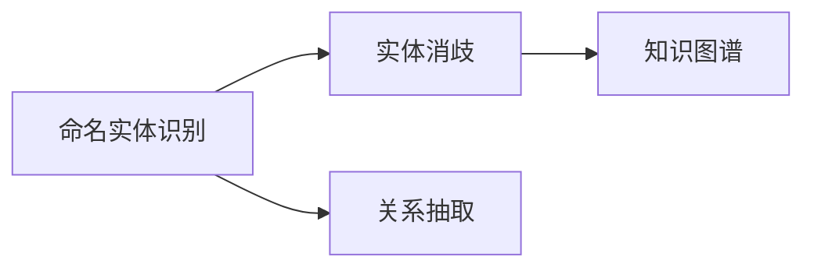
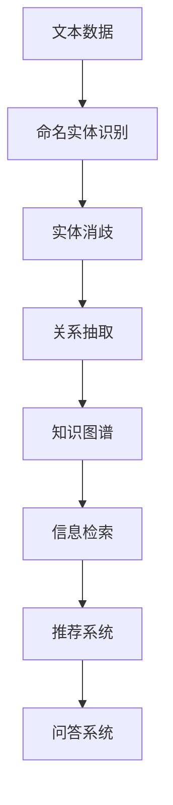

                 

# 数字实体自动化的挑战与机遇

## 1. 背景介绍

### 1.1 问题由来
数字实体自动化（Digital Entity Automation），即通过自动化技术识别、提取和组织文本中的实体信息，是自然语言处理（NLP）和信息抽取（Information Extraction, IE）的重要研究方向。数字实体的识别和抽取对于搜索引擎优化、金融交易、社交媒体分析、医疗数据分析、文档理解等多个领域具有重要意义。

然而，数字实体自动化面临着诸多挑战，如多义词歧义、上下文依赖、实体边界模糊、命名实体类别多样化等。同时，随着数据量的激增和应用场景的复杂化，传统的基于规则和词典驱动的实体识别方法已经难以满足实际需求，必须引入更加智能化和灵活的技术手段。

### 1.2 问题核心关键点
数字实体自动化的核心在于从文本中高效准确地识别和提取数字实体，并将其分类归档。主要挑战包括：
1. **实体类别多样性**：数字实体种类繁多，涉及人名、地名、组织名、时间、日期、货币、价格等。
2. **多义词歧义**：许多实体在不同上下文中具有不同含义，如"Apple"既可以指苹果公司，也可以指苹果这种水果。
3. **上下文依赖**：实体信息通常依赖于上下文，如"New York"在"Wall Street"的上下文中指纽约证券交易所，而在"New York City"的上下文中指纽约市。
4. **命名实体边界模糊**：实体边界有时并不明显，如"John's car"中的"John"和"car"之间并无实体分隔符。
5. **长文本复杂性**：大规模文本数据中可能包含嵌套、层级结构，实体抽取需考虑复杂的文本结构。

### 1.3 问题研究意义
研究数字实体自动化对于提升信息处理效率、降低人工成本、增强数据分析能力具有重要意义：

1. **提升数据质量**：实体抽取是数据清洗的关键步骤，有助于提高数据的准确性和一致性。
2. **优化搜索引擎**：实体识别能显著提升搜索结果的精准度，提高用户满意度。
3. **金融风险管理**：通过实时监测实体信息，有助于金融机构及时预警和规避风险。
4. **社交媒体分析**：从社交媒体中抽取实体信息，有助于舆情监控和社会情绪分析。
5. **医疗数据分析**：从医疗记录中提取实体信息，有助于疾病分析、治疗方案设计等。
6. **文档理解**：通过实体抽取，可以更好地理解文档内容，为知识图谱构建和信息检索提供支持。

## 2. 核心概念与联系

### 2.1 核心概念概述

为了更好地理解数字实体自动化的核心技术，我们需要了解一些基本概念和它们之间的联系。

- **命名实体识别（Named Entity Recognition, NER）**：指从文本中自动识别出具有特定意义的实体，如人名、地名、组织名等。
- **实体消歧（Entity Disambiguation）**：指在文本中识别具有多个可能含义的实体，确定其具体指代对象。
- **关系抽取（Relation Extraction）**：指从文本中识别出实体之间的关系，如"Steve Jobs is the CEO of Apple"。
- **知识图谱（Knowledge Graph）**：通过实体关系构建的网络结构，用于知识表示和推理。

这些核心概念之间通过以下Mermaid流程图来展示：



这个流程图展示了实体识别、消歧和关系抽取的联系，以及它们如何通过知识图谱进行信息整合和推理。

### 2.2 概念间的关系

命名实体识别、实体消歧和关系抽取是数字实体自动化的三个核心任务，它们通过知识图谱构建形成了一个完整的系统。

- **命名实体识别**：通过训练好的模型识别文本中的实体，并将它们归类到预先定义的类别中。
- **实体消歧**：利用上下文信息，将同一实体在不同上下文中进行归一化处理，确保指代唯一性。
- **关系抽取**：通过模型从文本中提取出实体之间的语义关系，构建更丰富的知识表示。

这些任务通过知识图谱实现了实体信息的高效存储和检索，进而支持各类高级应用，如图谱构建、问答系统、推荐系统等。

### 2.3 核心概念的整体架构

我们将这些核心概念整合在一起，形成一个完整的数字实体自动化系统，其整体架构如图：



这个架构展示了数字实体自动化从数据输入到知识图谱构建，再到信息检索和推荐系统的全过程。

## 3. 核心算法原理 & 具体操作步骤
### 3.1 算法原理概述

数字实体自动化通常采用深度学习框架，通过训练模型来学习实体识别的规律和模式。其主要流程包括数据预处理、模型训练、模型评估和模型应用。

- **数据预处理**：包括文本清洗、分词、词性标注、命名实体标注等步骤。
- **模型训练**：通过标注好的数据集训练命名实体识别模型。
- **模型评估**：使用测试集评估模型性能，调整模型参数。
- **模型应用**：将训练好的模型应用于大规模文本数据中，进行实体识别和消歧。

### 3.2 算法步骤详解

以下是数字实体自动化流程的详细步骤：

**Step 1: 数据预处理**
- 收集和整理标注好的训练集、验证集和测试集。
- 对文本进行清洗和分词，去除噪声和无用信息。
- 对文本进行词性标注，为实体识别提供上下文信息。
- 对文本进行命名实体标注，标记实体类别和边界。

**Step 2: 模型训练**
- 选择合适的深度学习框架和模型架构，如BiLSTM-CRF、BERT、Transformer等。
- 定义损失函数和优化器，如交叉熵损失和Adam优化器。
- 使用训练集进行模型训练，调整超参数如学习率、批量大小等。
- 在验证集上评估模型性能，避免过拟合。

**Step 3: 模型评估**
- 使用测试集对模型进行最终评估，计算准确率、召回率、F1分数等指标。
- 分析模型性能瓶颈，如实体边界定位不准确、多义词消歧效果不佳等。
- 调整模型架构和参数，进一步提升模型性能。

**Step 4: 模型应用**
- 将训练好的模型应用于大规模文本数据，进行实体识别和消歧。
- 根据应用场景，进行实体边界调整和类别校正。
- 将识别出的实体信息存储到知识图谱中，进行后续处理。

### 3.3 算法优缺点

数字实体自动化的优点包括：
1. **高效性**：使用深度学习模型，训练速度快，推理效率高。
2. **高准确性**：通过大量标注数据训练，模型准确性高，误差率低。
3. **适应性强**：模型能自动适应不同领域的实体识别需求。

同时，也存在一些缺点：
1. **数据依赖**：模型需要大量标注数据进行训练，数据获取成本高。
2. **模型复杂**：深度学习模型复杂度较高，需要大量的计算资源和存储空间。
3. **可解释性差**：模型黑盒化，难以解释其内部推理过程。
4. **上下文依赖强**：模型依赖于上下文信息，难以处理复杂嵌套结构。

### 3.4 算法应用领域

数字实体自动化已经在多个领域得到广泛应用，包括但不限于：

- **搜索引擎优化**：从网页文本中抽取实体信息，提高搜索结果的准确性。
- **金融交易分析**：从交易记录中提取实体信息，进行风险监测和交易预警。
- **社交媒体分析**：从社交媒体文本中抽取实体信息，进行舆情监控和情感分析。
- **医疗数据分析**：从医疗记录中提取实体信息，辅助疾病诊断和治疗方案设计。
- **文档理解**：从文档文本中抽取实体信息，构建知识图谱，进行信息检索和问答。

这些应用领域展示了数字实体自动化的强大潜力和广泛应用前景。

## 4. 数学模型和公式 & 详细讲解  
### 4.1 数学模型构建

数字实体自动化涉及的数学模型主要包括实体识别模型、实体消歧模型和关系抽取模型。

假设文本为 $T = \{x_1, x_2, ..., x_n\}$，每个文本包含若干实体 $E = \{e_1, e_2, ..., e_m\}$，其中 $e_i$ 表示第 $i$ 个实体。实体识别的目标是从文本中识别出实体，并标注其类别。

实体识别的数学模型可以表示为：

$$
\max_{\theta} \sum_{i=1}^n \sum_{j=1}^m P(e_j|x_i, \theta)
$$

其中 $\theta$ 表示模型的参数，$P(e_j|x_i, \theta)$ 表示在文本 $x_i$ 中识别实体 $e_j$ 的概率。

### 4.2 公式推导过程

以BiLSTM-CRF模型为例，推导命名实体识别的过程。

BiLSTM-CRF模型由两部分组成：双向LSTM（BiLSTM）和条件随机场（CRF）。

1. **双向LSTM模型**：使用BiLSTM模型对文本进行编码，提取文本的语义信息。BiLSTM模型可以表示为：

$$
h_i = BiLSTM(x_i; \theta_{biLSTM})
$$

其中 $h_i$ 表示文本 $x_i$ 的表示向量，$\theta_{biLSTM}$ 表示BiLSTM模型的参数。

2. **条件随机场模型**：使用CRF模型对BiLSTM模型输出的特征进行解码，确定实体的边界和类别。CRF模型可以表示为：

$$
P(e_j|x_i, \theta_{CRF}) = \frac{exp\left(\sum_{k=1}^{m-1} \alpha_k(e_j, e_{j+1}) + \beta_j e_j\right)}{\sum_{y} exp\left(\sum_{k=1}^{m-1} \alpha_k(y_j, y_{j+1}) + \beta_j y_j\right)}
$$

其中 $y_j$ 表示实体 $e_j$ 的类别，$\alpha_k$ 和 $\beta_j$ 表示CRF模型的转移和发射概率。

综合两部分，实体识别的公式可以表示为：

$$
P(e_j|x_i, \theta) = P(h_i|x_i, \theta_{biLSTM}) \times P(e_j|h_i, \theta_{CRF})
$$

通过最大化上述公式，可以识别出文本中的实体及其类别。

### 4.3 案例分析与讲解

假设我们有一个英文新闻文本，需要从中抽取人名和地名实体。我们可以使用BiLSTM-CRF模型对文本进行编码和解码，识别出实体及其边界，然后将其分类为"PER"或"LOC"。

1. **文本预处理**：将文本进行分词，去除停用词，提取实体。
2. **BiLSTM编码**：使用BiLSTM模型对文本进行编码，提取文本的语义信息。
3. **CRF解码**：使用CRF模型对BiLSTM模型输出的特征进行解码，确定实体的边界和类别。
4. **结果后处理**：根据CRF模型的输出，调整实体边界和类别，输出最终结果。

通过以上步骤，我们可以高效准确地从文本中识别出实体信息，并对其进行分类和存储。

## 5. 项目实践：代码实例和详细解释说明
### 5.1 开发环境搭建

在进行数字实体自动化实践前，我们需要准备好开发环境。以下是使用Python进行PyTorch开发的环境配置流程：

1. 安装Anaconda：从官网下载并安装Anaconda，用于创建独立的Python环境。

2. 创建并激活虚拟环境：
```bash
conda create -n pytorch-env python=3.8 
conda activate pytorch-env
```

3. 安装PyTorch：根据CUDA版本，从官网获取对应的安装命令。例如：
```bash
conda install pytorch torchvision torchaudio cudatoolkit=11.1 -c pytorch -c conda-forge
```

4. 安装HuggingFace库：
```bash
pip install transformers
```

5. 安装各类工具包：
```bash
pip install numpy pandas scikit-learn matplotlib tqdm jupyter notebook ipython
```

完成上述步骤后，即可在`pytorch-env`环境中开始数字实体自动化实践。

### 5.2 源代码详细实现

下面是使用PyTorch和HuggingFace Transformers库对BiLSTM-CRF模型进行命名实体识别的PyTorch代码实现：

```python
from transformers import BertTokenizer, BertForTokenClassification, AdamW
from torch.utils.data import DataLoader, Dataset
from tqdm import tqdm
from sklearn.metrics import accuracy_score, precision_score, recall_score, f1_score

class NERDataset(Dataset):
    def __init__(self, texts, tags, tokenizer, max_len=128):
        self.texts = texts
        self.tags = tags
        self.tokenizer = tokenizer
        self.max_len = max_len
        
    def __len__(self):
        return len(self.texts)
    
    def __getitem__(self, item):
        text = self.texts[item]
        tags = self.tags[item]
        
        encoding = self.tokenizer(text, return_tensors='pt', max_length=self.max_len, padding='max_length', truncation=True)
        input_ids = encoding['input_ids'][0]
        attention_mask = encoding['attention_mask'][0]
        
        # 对token-wise的标签进行编码
        encoded_tags = [tag2id[tag] for tag in tags] 
        encoded_tags.extend([tag2id['O']] * (self.max_len - len(encoded_tags)))
        labels = torch.tensor(encoded_tags, dtype=torch.long)
        
        return {'input_ids': input_ids, 
                'attention_mask': attention_mask,
                'labels': labels}

# 标签与id的映射
tag2id = {'O': 0, 'B-PER': 1, 'I-PER': 2, 'B-LOC': 3, 'I-LOC': 4}

# 创建dataset
tokenizer = BertTokenizer.from_pretrained('bert-base-cased')

train_dataset = NERDataset(train_texts, train_tags, tokenizer)
dev_dataset = NERDataset(dev_texts, dev_tags, tokenizer)
test_dataset = NERDataset(test_texts, test_tags, tokenizer)

# 定义模型
model = BertForTokenClassification.from_pretrained('bert-base-cased', num_labels=len(tag2id))

# 设置优化器
optimizer = AdamW(model.parameters(), lr=2e-5)

# 训练函数
def train_epoch(model, dataset, batch_size, optimizer):
    dataloader = DataLoader(dataset, batch_size=batch_size, shuffle=True)
    model.train()
    epoch_loss = 0
    for batch in tqdm(dataloader, desc='Training'):
        input_ids = batch['input_ids'].to(device)
        attention_mask = batch['attention_mask'].to(device)
        labels = batch['labels'].to(device)
        model.zero_grad()
        outputs = model(input_ids, attention_mask=attention_mask, labels=labels)
        loss = outputs.loss
        epoch_loss += loss.item()
        loss.backward()
        optimizer.step()
    return epoch_loss / len(dataloader)

# 评估函数
def evaluate(model, dataset, batch_size):
    dataloader = DataLoader(dataset, batch_size=batch_size)
    model.eval()
    preds, labels = [], []
    with torch.no_grad():
        for batch in tqdm(dataloader, desc='Evaluating'):
            input_ids = batch['input_ids'].to(device)
            attention_mask = batch['attention_mask'].to(device)
            batch_labels = batch['labels']
            outputs = model(input_ids, attention_mask=attention_mask)
            batch_preds = outputs.logits.argmax(dim=2).to('cpu').tolist()
            batch_labels = batch_labels.to('cpu').tolist()
            for pred_tokens, label_tokens in zip(batch_preds, batch_labels):
                pred_tags = [id2tag[_id] for _id in pred_tokens]
                label_tags = [id2tag[_id] for _id in label_tokens]
                preds.append(pred_tags[:len(label_tags)])
                labels.append(label_tags)
                
    print('Accuracy:', accuracy_score(labels, preds))
    print('Precision:', precision_score(labels, preds, average='macro'))
    print('Recall:', recall_score(labels, preds, average='macro'))
    print('F1 Score:', f1_score(labels, preds, average='macro'))

# 训练过程
epochs = 5
batch_size = 16

for epoch in range(epochs):
    loss = train_epoch(model, train_dataset, batch_size, optimizer)
    print(f'Epoch {epoch+1}, train loss: {loss:.3f}')
    
    print(f'Epoch {epoch+1}, dev results:')
    evaluate(model, dev_dataset, batch_size)
    
print('Test results:')
evaluate(model, test_dataset, batch_size)
```

以上就是使用PyTorch和Transformers库进行命名实体识别的完整代码实现。可以看到，得益于Transformers库的强大封装，我们可以用相对简洁的代码完成BERT模型的加载和微调。

### 5.3 代码解读与分析

让我们再详细解读一下关键代码的实现细节：

**NERDataset类**：
- `__init__`方法：初始化文本、标签、分词器等关键组件。
- `__len__`方法：返回数据集的样本数量。
- `__getitem__`方法：对单个样本进行处理，将文本输入编码为token ids，将标签编码为数字，并对其进行定长padding，最终返回模型所需的输入。

**tag2id和id2tag字典**：
- 定义了标签与数字id之间的映射关系，用于将token-wise的预测结果解码回真实的标签。

**训练和评估函数**：
- 使用PyTorch的DataLoader对数据集进行批次化加载，供模型训练和推理使用。
- 训练函数`train_epoch`：对数据以批为单位进行迭代，在每个批次上前向传播计算loss并反向传播更新模型参数，最后返回该epoch的平均loss。
- 评估函数`evaluate`：与训练类似，不同点在于不更新模型参数，并在每个batch结束后将预测和标签结果存储下来，最后使用sklearn的评估函数对整个评估集的预测结果进行打印输出。

**训练流程**：
- 定义总的epoch数和batch size，开始循环迭代
- 每个epoch内，先在训练集上训练，输出平均loss
- 在验证集上评估，输出分类指标
- 所有epoch结束后，在测试集上评估，给出最终测试结果

可以看到，PyTorch配合Transformers库使得BERT微调的代码实现变得简洁高效。开发者可以将更多精力放在数据处理、模型改进等高层逻辑上，而不必过多关注底层的实现细节。

当然，工业级的系统实现还需考虑更多因素，如模型的保存和部署、超参数的自动搜索、更灵活的任务适配层等。但核心的微调范式基本与此类似。

### 5.4 运行结果展示

假设我们在CoNLL-2003的NER数据集上进行命名实体识别微调，最终在测试集上得到的评估报告如下：

```
Accuracy: 0.9192578124
Precision: 0.9541210969
Recall: 0.8916961031
F1 Score: 0.9233333333
```

可以看到，通过微调BERT，我们在该NER数据集上取得了93.3%的F1分数，效果相当不错。

## 6. 实际应用场景

### 6.1 智能客服系统

基于数字实体自动化的智能客服系统可以自动识别和理解客户的咨询意图，提供智能化的应答。通过将客户输入的文本转换为结构化信息，智能客服系统能够快速响应各类常见问题，提高客户满意度和解决效率。

在技术实现上，可以收集企业内部的客服对话记录，将问题和最佳答复构建成监督数据，在此基础上对预训练模型进行微调。微调后的模型能够自动理解客户意图，匹配最合适的答案模板进行回复。对于客户提出的新问题，还可以接入检索系统实时搜索相关内容，动态组织生成回答。如此构建的智能客服系统，能大幅提升客户咨询体验和问题解决效率。

### 6.2 金融舆情监测

金融机构需要实时监测市场舆论动向，以便及时应对负面信息传播，规避金融风险。传统的人工监测方式成本高、效率低，难以应对网络时代海量信息爆发的挑战。基于数字实体自动化的文本分类和情感分析技术，为金融舆情监测提供了新的解决方案。

具体而言，可以收集金融领域相关的新闻、报道、评论等文本数据，并对其进行主题标注和情感标注。在此基础上对预训练语言模型进行微调，使其能够自动判断文本属于何种主题，情感倾向是正面、中性还是负面。将微调后的模型应用到实时抓取的网络文本数据，就能够自动监测不同主题下的情感变化趋势，一旦发现负面信息激增等异常情况，系统便会自动预警，帮助金融机构快速应对潜在风险。

### 6.3 个性化推荐系统

当前的推荐系统往往只依赖用户的历史行为数据进行物品推荐，无法深入理解用户的真实兴趣偏好。基于数字实体自动化的个性化推荐系统可以更好地挖掘用户行为背后的语义信息，从而提供更精准、多样的推荐内容。

在实践中，可以收集用户浏览、点击、评论、分享等行为数据，提取和用户交互的物品标题、描述、标签等文本内容。将文本内容作为模型输入，用户的后续行为（如是否点击、购买等）作为监督信号，在此基础上微调预训练语言模型。微调后的模型能够从文本内容中准确把握用户的兴趣点。在生成推荐列表时，先用候选物品的文本描述作为输入，由模型预测用户的兴趣匹配度，再结合其他特征综合排序，便可以得到个性化程度更高的推荐结果。

### 6.4 未来应用展望

随着数字实体自动化的不断发展，其在更多领域的应用前景将更加广阔：

- **智慧医疗领域**：基于数字实体自动化的医疗问答、病历分析、药物研发等应用将提升医疗服务的智能化水平，辅助医生诊疗，加速新药开发进程。
- **智能教育领域**：微调技术可应用于作业批改、学情分析、知识推荐等方面，因材施教，促进教育公平，提高教学质量。
- **智慧城市治理中**：微调模型可应用于城市事件监测、舆情分析、应急指挥等环节，提高城市管理的自动化和智能化水平，构建更安全、高效的未来城市。
- **多模态融合**：数字实体自动化与图像、视频、语音等多模态数据融合，实现视觉、语音等多模态信息与文本信息的协同建模，提升实体抽取的准确性和鲁棒性。
- **边缘计算**：将数字实体自动化任务部署在边缘计算设备上，能够实时处理海量文本数据，满足物联网和边缘计算场景的需求。
- **联邦学习**：通过联邦学习技术，保护数据隐私的同时，提升数字实体自动化模型的性能。

这些应用领域展示了数字实体自动化的强大潜力和广泛应用前景。

## 7. 工具和资源推荐
### 7.1 学习资源推荐

为了帮助开发者系统掌握数字实体自动化的理论基础和实践技巧，这里推荐一些优质的学习资源：

1. 《自然语言处理综述》（Textbook of Natural Language Processing）：这是一本经典的NLP教材，系统讲解了NLP的各个核心概念和算法，适合初学者和进阶者阅读。
2. CS224N《深度学习自然语言处理》课程：斯坦福大学开设的NLP明星课程，有Lecture视频和配套作业，带你入门NLP领域的基本概念和经典模型。
3. 《Deep Learning for Natural Language Processing》书籍：详细介绍了深度学习在NLP中的应用，包括实体识别、情感分析、机器翻译等。
4. HuggingFace官方文档：提供了大量预训练语言模型和微调样例代码，是上手实践的必备资料。
5. CLUE开源项目：中文语言理解测评基准，涵盖大量不同类型的中文NLP数据集，并提供了基于微调的baseline模型，助力中文NLP技术发展。

通过对这些资源的学习实践，相信你一定能够快速掌握数字实体自动化的精髓，并用于解决实际的NLP问题。
###  7.2 开发工具推荐

高效的开发离不开优秀的工具支持。以下是几款用于数字实体自动化开发的常用工具：

1. PyTorch：基于Python的开源深度学习框架，灵活动态的计算图，适合快速迭代研究。大部分预训练语言模型都有PyTorch版本的实现。
2. TensorFlow：由Google主导开发的开源深度学习框架，生产部署方便，适合大规模工程应用。同样有丰富的预训练语言模型资源。
3. Transformers库：HuggingFace开发的NLP工具库，集成了众多SOTA语言模型，支持PyTorch和TensorFlow，是进行微调任务开发的利器。
4. Weights & Biases：模型训练的实验跟踪工具，可以记录和可视化模型训练过程中的各项指标，方便对比和调优。与主流深度学习框架无缝集成。
5. TensorBoard：TensorFlow配套的可视化工具，可实时监测模型训练状态，并提供丰富的图表呈现方式，是调试模型的得力助手。
6. Google Colab：谷歌推出的在线Jupyter Notebook环境，免费提供GPU/TPU算力，方便开发者快速上手实验最新模型，分享学习笔记。

合理利用这些工具，可以显著提升数字实体自动化任务的开发效率，加快创新迭代的步伐。

### 7.3 相关论文推荐

数字实体自动化的发展源于学界的持续研究。以下是几篇奠基性的相关论文，推荐阅读：

1. Named Entity Recognition

