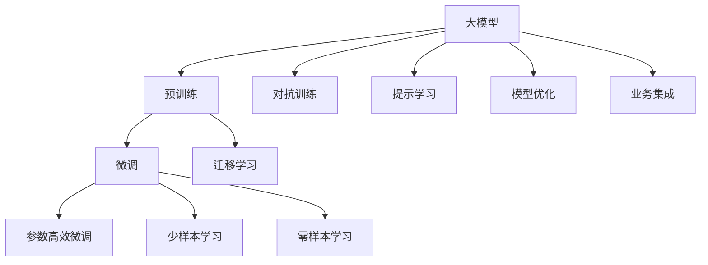

                 

# 大模型应用场景不断拓展，创业者发掘新增长点

> 关键词：大模型,创业,应用场景,技术突破,新增长点

## 1. 背景介绍

### 1.1 问题由来
近年来，随着深度学习技术的快速发展，人工智能大模型在各个领域取得了显著突破，展现出强大的应用潜力。例如，GPT系列、BERT等预训练模型在大规模文本处理、语言生成、机器翻译、图像识别等领域展现了极高的性能。然而，在商业化落地过程中，创业者们面临众多挑战：如何充分利用大模型的力量，拓展新的应用场景？如何将这些先进技术转化为商业价值？本文将从大模型的应用场景出发，分析创业机会，提供实践建议。

### 1.2 问题核心关键点
大模型技术虽然先进，但其应用场景和商业价值需要创业者深入挖掘。创业者需要关注以下几个关键点：
- 大模型的优势和局限性。
- 主流大模型和新兴大模型的比较。
- 应用场景分析与评估。
- 技术突破与商业价值转化。
- 创业机会与投资考量。

### 1.3 问题研究意义
本文聚焦于大模型的应用场景和创业机会，希望回答以下几个问题：
- 大模型技术如何拓展到新领域？
- 哪些创业领域适合应用大模型？
- 如何通过技术突破实现商业成功？
- 如何识别并利用大模型创业机会？
- 投资大模型创业项目需要关注哪些因素？

## 2. 核心概念与联系

### 2.1 核心概念概述

为了更好地理解大模型的应用场景，我们需要掌握一些关键概念：

- 大模型(Large Model)：以Transformer等深度神经网络为基础构建的大规模预训练模型，如BERT、GPT系列等。这些模型通常在几十亿个参数规模下进行训练，具有强大的语言理解和生成能力。
- 预训练(Pre-training)：在大规模无标签数据上进行自监督学习，学习通用语言表示，为下游任务提供基础。
- 微调(Fine-tuning)：在预训练模型的基础上，通过少量有标签数据进行有监督学习，提升模型在特定任务上的表现。
- 迁移学习(Transfer Learning)：利用预训练模型在多个任务之间的知识迁移，提高模型在新任务上的性能。
- 参数高效微调(Parameter-Efficient Fine-tuning)：仅更新模型中少部分参数，避免过度拟合，提高微调效率。
- 少样本学习(Few-shot Learning)：仅依赖少量示例，模型即可进行任务适应。
- 零样本学习(Zero-shot Learning)：模型无需任何示例即可对新任务进行推理。
- 对抗训练(Adversarial Training)：通过引入对抗样本，增强模型鲁棒性。
- 提示学习(Prompt Learning)：利用精心设计的输入模板，引导模型进行特定任务推理。

这些概念构成了大模型技术的应用框架，通过掌握这些概念，创业者可以更好地利用大模型技术，实现商业化应用。

### 2.2 概念间的关系

这些概念之间的关系可以通过以下Mermaid流程图来展示：



这个流程图展示了从预训练到微调，再到迁移学习等大模型技术的主要应用流程。通过这些概念，我们可以更清晰地理解大模型技术的应用方向和优化策略。

## 3. 核心算法原理 & 具体操作步骤

### 3.1 算法原理概述
大模型的应用场景主要基于其强大的语义理解和生成能力，适用于各类NLP和计算机视觉任务。例如，BERT在文本分类、情感分析、问答系统等任务上表现优异；GPT在文本生成、对话系统、摘要生成等任务上大放异彩。

### 3.2 算法步骤详解

大模型的应用步骤大致如下：
1. **数据准备**：收集、预处理和标注所需数据，确保数据的质量和多样性。
2. **模型选择与微调**：选择合适的预训练模型，通过微调或迁移学习适应具体任务。
3. **模型集成与优化**：集成不同模型的优势，进行参数优化和模型压缩，提升模型性能。
4. **应用部署与监控**：将模型部署到实际应用环境中，监控模型性能，进行模型更新。

### 3.3 算法优缺点
大模型的优点包括：
- 强大的语言理解和生成能力，适用于多种NLP任务。
- 高效的迁移学习能力，可以快速适应新任务。
- 丰富的应用场景，覆盖各行各业。

缺点包括：
- 对数据质量和标注需求高，标注成本高。
- 模型大、复杂，训练和推理成本高。
- 对硬件要求高，需要高性能计算资源。

### 3.4 算法应用领域
大模型技术在多个领域得到了广泛应用，主要包括：
- NLP：文本分类、情感分析、问答系统、机器翻译、摘要生成等。
- 计算机视觉：图像分类、目标检测、图像生成、图像分割等。
- 语音识别与处理：语音识别、语音合成、语音情感分析等。
- 推荐系统：用户画像、个性化推荐、搜索排序等。
- 医疗健康：病历分析、医学影像诊断、患者智能咨询等。

## 4. 数学模型和公式 & 详细讲解 & 举例说明

### 4.1 数学模型构建

假设有一个预训练的BERT模型，其在输入序列 $x$ 上的输出为 $h(x)$，使用交叉熵损失函数 $L(h(x), y)$，其中 $y$ 为标签向量。在大规模无标签数据上进行预训练后，模型参数 $\theta$ 可以表示为：

$$
\theta = \arg\min_{\theta} L(h(x), y)
$$

在大规模有标签数据集上进行微调，目标是最小化损失函数：

$$
\hat{\theta} = \arg\min_{\theta} L(h(x), y)
$$

### 4.2 公式推导过程

以BERT为例，微调的优化目标是：

$$
\min_{\theta} \frac{1}{N} \sum_{i=1}^N \mathcal{L}(h(x_i), y_i)
$$

其中 $\mathcal{L}$ 为交叉熵损失函数，$h(x_i)$ 为模型在输入 $x_i$ 上的输出，$y_i$ 为标签。

在具体实现时，我们通过反向传播算法计算梯度，使用优化算法（如AdamW）更新参数 $\theta$。微调步骤包括：
1. 前向传播：输入数据 $x_i$，得到模型输出 $h(x_i)$。
2. 计算损失：$L(h(x_i), y_i)$。
3. 反向传播：计算梯度，更新参数。
4. 循环迭代：重复步骤1-3，直至收敛。

### 4.3 案例分析与讲解

假设我们想利用BERT进行文本分类任务。具体步骤如下：
1. **数据准备**：收集文本和标签，划分为训练集、验证集和测试集。
2. **模型微调**：使用预训练的BERT模型，通过全参数微调或参数高效微调，调整模型输出层参数，适应分类任务。
3. **评估与优化**：在验证集上评估模型性能，根据结果调整超参数。
4. **测试与部署**：在测试集上测试模型效果，部署到实际应用中。

## 5. 项目实践：代码实例和详细解释说明

### 5.1 开发环境搭建

以下是使用PyTorch和HuggingFace Transformers库搭建BERT模型的开发环境：
1. 安装Anaconda和PyTorch。
2. 安装HuggingFace Transformers库。
3. 安装所需的Python工具包，如Pandas、Scikit-learn等。

### 5.2 源代码详细实现

以BERT微调文本分类为例，以下是Python代码实现：

```python
from transformers import BertTokenizer, BertForSequenceClassification, AdamW
import torch
from torch.utils.data import DataLoader

# 初始化模型和优化器
model = BertForSequenceClassification.from_pretrained('bert-base-uncased', num_labels=2)
optimizer = AdamW(model.parameters(), lr=1e-5)

# 初始化数据集
tokenizer = BertTokenizer.from_pretrained('bert-base-uncased')
train_data = ...
dev_data = ...
test_data = ...

# 微调模型
def train_epoch(model, data_loader, optimizer):
    model.train()
    losses = []
    for batch in data_loader:
        input_ids, attention_masks, labels = batch
        outputs = model(input_ids, attention_masks=attention_masks, labels=labels)
        loss = outputs.loss
        losses.append(loss.item())
        optimizer.zero_grad()
        loss.backward()
        optimizer.step()
    return sum(losses) / len(data_loader)

# 评估模型
def evaluate(model, data_loader):
    model.eval()
    predictions, true_labels = [], []
    for batch in data_loader:
        input_ids, attention_masks, labels = batch
        outputs = model(input_ids, attention_masks=attention_masks)
        predictions.extend(outputs.logits.argmax(dim=1))
        true_labels.extend(labels)
    return accuracy_score(true_labels, predictions)

# 训练与评估
epochs = 3
batch_size = 16

for epoch in range(epochs):
    train_loss = train_epoch(model, train_data)
    dev_acc = evaluate(model, dev_data)
    print(f"Epoch {epoch+1}, train loss: {train_loss:.3f}, dev acc: {dev_acc:.3f}")

print(f"Test acc: {evaluate(model, test_data):.3f}")
```

### 5.3 代码解读与分析

- `BertForSequenceClassification`：BERT的文本分类模型，包括输入层、Transformer编码器、输出层等。
- `AdamW`：优化算法，支持学习率衰减和权重衰减。
- `BertTokenizer`：分词工具，用于处理输入文本。
- `DataLoader`：数据加载工具，支持批处理和数据增强。

## 6. 实际应用场景

### 6.1 智能客服系统

智能客服系统是大模型在NLP领域的重要应用之一。通过微调BERT等模型，可以实现实时对话、问题解答等功能，提升客户服务体验。具体流程包括：
1. **数据准备**：收集历史客服记录和FAQ数据。
2. **模型微调**：使用BERT模型进行微调，适应对话生成任务。
3. **系统集成**：将微调模型集成到客服系统中，与语音识别、自然语言理解等模块配合工作。

### 6.2 金融舆情监测

金融舆情监测是大模型在金融领域的重要应用。通过微调BERT等模型，可以实时监测舆情变化，识别潜在风险。具体流程包括：
1. **数据准备**：收集金融新闻、社交媒体、新闻评论等数据。
2. **模型微调**：使用BERT模型进行情感分析、主题分类等微调，适应舆情监测任务。
3. **系统部署**：将微调模型部署到舆情监测系统中，实时分析和报警。

### 6.3 个性化推荐系统

个性化推荐系统是大模型在推荐领域的重要应用。通过微调BERT等模型，可以实现个性化推荐、用户画像等功能，提升推荐效果。具体流程包括：
1. **数据准备**：收集用户行为数据、物品描述等数据。
2. **模型微调**：使用BERT模型进行用户画像、推荐排序等微调，适应个性化推荐任务。
3. **系统集成**：将微调模型集成到推荐系统中，提供个性化推荐服务。

## 7. 工具和资源推荐

### 7.1 学习资源推荐

- 《深度学习基础》：入门深度学习的经典教材。
- 《NLP与深度学习》：深入NLP与深度学习技术。
- 《Transformer笔记》：讲解Transformer的原理与应用。
- 《BERT模型实战》：讲解BERT模型的使用与微调。
- 《PyTorch深度学习实践》：PyTorch的实践应用指南。

### 7.2 开发工具推荐

- PyTorch：深度学习框架，支持GPU加速。
- TensorFlow：深度学习框架，支持大规模分布式训练。
- HuggingFace Transformers：NLP预训练模型库，支持丰富的微调模型。
- TensorBoard：模型训练可视化工具。
- Weights & Biases：模型训练实验跟踪工具。

### 7.3 相关论文推荐

- Attention is All You Need：Transformer的原始论文。
- BERT: Pre-training of Deep Bidirectional Transformers for Language Understanding：BERT模型的论文。
- Language Models are Unsupervised Multitask Learners：GPT-2模型的论文。
- Parameter-Efficient Transfer Learning for NLP：参数高效微调方法的研究论文。

## 8. 总结：未来发展趋势与挑战

### 8.1 总结

本文从大模型的应用场景出发，介绍了大模型技术的核心概念、原理与具体操作步骤。大模型技术在NLP、计算机视觉、语音识别、推荐系统等多个领域展现了强大的应用潜力，为创业者提供了广阔的创业机会。然而，大模型技术在商业化落地过程中，仍面临诸多挑战。创业者需要关注数据质量、模型复杂度、硬件资源、系统集成等关键问题。

### 8.2 未来发展趋势

未来大模型技术将呈现以下发展趋势：
- 模型规模持续增大，预训练数据和模型规模将不断增长。
- 微调方法更加多样化，参数高效微调、对抗训练、少样本学习等技术将得到广泛应用。
- 跨模态学习将得到重视，图像、语音等多模态数据将与文本数据结合，提升模型性能。
- 大模型将逐步应用于更多行业，如医疗、教育、城市管理等，带来新的业务机会。
- 大模型技术将推动AI向更智能、更普适的方向发展。

### 8.3 面临的挑战

尽管大模型技术前景广阔，但仍面临诸多挑战：
- 数据质量和标注成本高，标注数据获取难度大。
- 模型复杂度高，硬件资源要求高，成本投入大。
- 模型鲁棒性不足，对新数据和噪声敏感。
- 模型可解释性差，缺乏透明性和可信度。
- 模型安全性问题，可能存在偏见、误导性输出。

### 8.4 研究展望

为了应对这些挑战，未来的研究方向包括：
- 探索无监督学习和半监督学习技术，减少对标注数据的依赖。
- 研究参数高效微调方法，优化模型资源利用。
- 引入跨模态学习，提升模型在不同数据类型上的泛化能力。
- 提高模型可解释性，增加模型的透明度和可信度。
- 设计安全机制，避免偏见和误导性输出。

## 9. 附录：常见问题与解答

**Q1：大模型如何应用于创业项目？**

A: 大模型可以应用于多个创业项目，如智能客服、金融舆情监测、个性化推荐系统等。通过微调或迁移学习，大模型可以快速适应特定任务，提升应用效果。

**Q2：大模型在商业应用中需要注意哪些问题？**

A: 大模型在商业应用中需要注意数据质量、模型复杂度、硬件资源、系统集成等问题。创业者应根据具体应用场景选择合适的模型和技术，并进行全面优化。

**Q3：如何利用大模型技术进行商业成功？**

A: 利用大模型技术进行商业成功需要以下几个步骤：
1. 明确应用场景，选择合适的模型和技术。
2. 收集和预处理数据，进行模型微调和评估。
3. 进行系统集成和优化，提升用户体验和系统性能。
4. 持续迭代和优化，提升模型效果和业务价值。

---

作者：禅与计算机程序设计艺术 / Zen and the Art of Computer Programming

