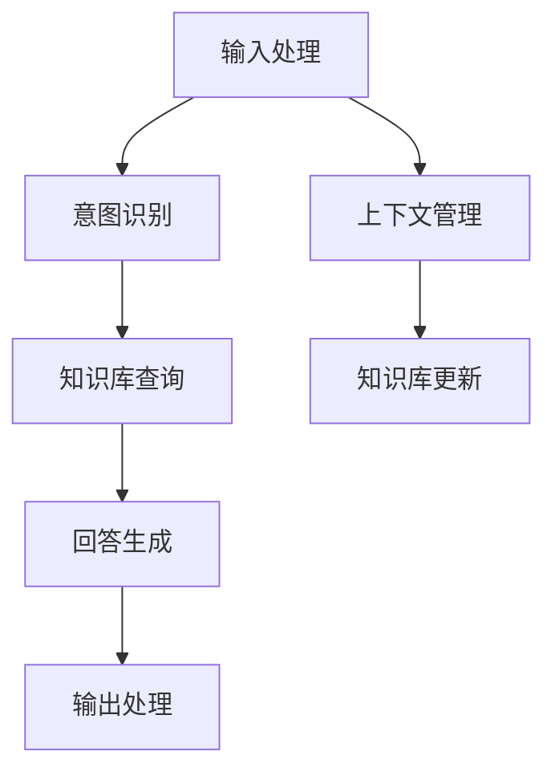
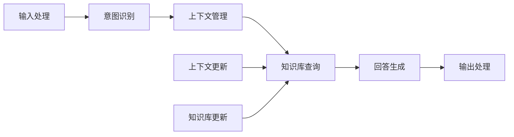

                 

## 1. 背景介绍

随着人工智能技术的快速发展，问答机器人（Chatbot）已经广泛应用于教育、医疗、客服、娱乐等多个领域。它们可以自动回答用户的问题，提供信息咨询、技术支持等服务的解决方案。在如此多场景下，问答机器人面临着数据处理、模型训练、推理服务等各种挑战，但数据处理是其中的关键和基础环节。

问答机器人需要处理和理解用户输入的自然语言，并从知识库中抽取相关信息，最终给出精准的回答。为此，我们需要设计高效的数据处理流程，确保机器人能够快速、准确地进行信息检索、意图识别、推理判断等操作。

### 1.1 问题由来

当前问答机器人面临的主要挑战包括：

1. **自然语言处理**：自然语言理解（Natural Language Understanding, NLU）是大模型问答机器人的首要难题。自然语言的多样性和复杂性使得机器人难以理解语言背后的含义和上下文。
2. **知识库管理**：知识库是大模型问答机器人获取信息的主要来源，但知识库的管理、更新、查询效率直接影响机器人的服务质量。
3. **推理能力**：大模型问答机器人不仅需要准确理解用户输入，还需要进行复杂的逻辑推理和推断，才能给出合适的回答。
4. **实时响应**：用户对机器人的期望是高实时性，但模型推理过程较慢，响应时间长。
5. **可扩展性**：大模型问答机器人需要支持多个用户同时访问，需要良好的可扩展性。

### 1.2 问题核心关键点

问答机器人的数据处理流程主要包括：

- 输入处理：将自然语言输入转换为模型可处理的数据格式。
- 知识库查询：在知识库中检索相关信息。
- 意图识别：理解用户的查询意图。
- 上下文管理：记录用户对话历史，支持上下文相关问题。
- 回答生成：结合意图和上下文信息，生成合适的回答。
- 输出处理：将回答输出为自然语言。

本文将围绕大模型问答机器人的数据处理流程，详细讨论如何设计高效的数据处理流程，提升机器人的理解和推理能力。

## 2. 核心概念与联系

### 2.1 核心概念概述

在讨论大模型问答机器人的数据处理之前，我们需要明确几个核心概念：

- **自然语言处理（NLP）**：涉及语言模型的预训练、微调、特征提取等技术，目的是理解、生成自然语言。
- **知识库**：包含问答机器人需要的各类信息，如知识图谱、百科全书、专业数据库等。
- **意图识别**：通过机器学习算法，识别用户查询的意图，指导知识库查询。
- **上下文管理**：记录和存储用户对话历史，支持上下文相关问题。
- **回答生成**：利用预训练语言模型和知识库，生成适合的回答。

### 2.2 概念间的关系

这些核心概念之间相互关联，共同构成了大模型问答机器人的数据处理框架。其关系可以用以下Mermaid流程图来展示：



这个流程图展示了从输入处理到输出处理的全流程，各模块之间通过数据流相连。

### 2.3 核心概念的整体架构

为了更直观地展示大模型问答机器人的数据处理架构，我们进一步绘制了一个更为详细的流程图：



这个综合流程图展示了输入处理、意图识别、上下文管理、知识库查询、回答生成、输出处理的完整数据处理流程。其中，上下文管理和知识库更新模块可以异步执行，以提高整体处理效率。

## 3. 核心算法原理 & 具体操作步骤

### 3.1 算法原理概述

大模型问答机器人的数据处理过程，主要包括以下几个步骤：

1. **输入处理**：将自然语言输入转换为模型可以处理的数据格式，如分词、向量化等。
2. **意图识别**：通过机器学习算法，分析用户输入，识别出查询的意图。
3. **上下文管理**：记录用户对话历史，以便后续推理判断。
4. **知识库查询**：在知识库中检索相关信息。
5. **回答生成**：结合意图、上下文和知识库信息，生成合适的回答。
6. **输出处理**：将回答转换为自然语言输出。

### 3.2 算法步骤详解

**Step 1: 输入处理**

输入处理是将自然语言输入转换为模型可以处理的数据格式。主要步骤如下：

1. **分词**：将输入的自然语言切分成单词或子词。
2. **向量化**：将分词结果转换为模型可以处理的数值向量。
3. **标准化**：处理大小写、标点等，确保数据格式一致。

```python
from transformers import BertTokenizer

tokenizer = BertTokenizer.from_pretrained('bert-base-cased')
inputs = tokenizer("Hello, world!", return_tensors="pt")
```

**Step 2: 意图识别**

意图识别是理解用户输入的意图，通常采用监督学习或预训练模型来实现。主要步骤如下：

1. **特征提取**：将输入转化为模型的特征向量。
2. **分类**：使用分类模型预测输入的意图类别。

```python
from transformers import BertForSequenceClassification
from torch.utils.data import DataLoader, Dataset
from sklearn.metrics import accuracy_score

class IntentDataset(Dataset):
    def __init__(self, texts, labels):
        self.texts = texts
        self.labels = labels
    def __getitem__(self, index):
        text = self.texts[index]
        label = self.labels[index]
        return {'input_ids': input_ids, 'attention_mask': attention_mask, 'labels': label}
    def __len__(self):
        return len(self.texts)

# 定义模型
model = BertForSequenceClassification.from_pretrained('bert-base-cased', num_labels=num_labels)
# 加载数据集
train_dataset = IntentDataset(train_texts, train_labels)
val_dataset = IntentDataset(val_texts, val_labels)
test_dataset = IntentDataset(test_texts, test_labels)

# 训练模型
model.train()
for epoch in range(epochs):
    for batch in DataLoader(train_dataset, batch_size=batch_size):
        input_ids = batch['input_ids'].to(device)
        attention_mask = batch['attention_mask'].to(device)
        labels = batch['labels'].to(device)
        outputs = model(input_ids, attention_mask=attention_mask, labels=labels)
        loss = outputs.loss
        loss.backward()
        optimizer.step()

# 评估模型
val_dataset = IntentDataset(val_texts, val_labels)
val_dataset = DataLoader(val_dataset, batch_size=batch_size)
val_loss = 0
for batch in val_dataset:
    input_ids = batch['input_ids'].to(device)
    attention_mask = batch['attention_mask'].to(device)
    labels = batch['labels'].to(device)
    outputs = model(input_ids, attention_mask=attention_mask, labels=labels)
    val_loss += outputs.loss.item()

val_loss /= len(val_dataset)
print("Validation loss:", val_loss)
```

**Step 3: 上下文管理**

上下文管理主要记录用户对话历史，以便后续推理判断。主要步骤如下：

1. **存储历史对话**：记录每一轮对话的输入和输出。
2. **提取关键信息**：从历史对话中提取关键信息，如实体、关键词等。
3. **关联上下文**：将当前查询与历史对话关联，以便推理时使用。

```python
class ContextManager:
    def __init__(self):
        self.context = []
    def add_context(self, input_text):
        self.context.append(input_text)
    def get_context(self, window_size=10):
        return self.context[-window_size:]
```

**Step 4: 知识库查询**

知识库查询是在知识库中检索相关信息，主要步骤如下：

1. **构建知识库**：将各类信息存储在知识库中，如知识图谱、百科全书等。
2. **检索信息**：根据查询意图，在知识库中检索相关信息。
3. **合并结果**：将多个结果合并，生成最终的查询结果。

```python
class KnowledgeGraph:
    def __init__(self, knowledge):
        self.knowledge = knowledge
    def query(self, query_text):
        # 在知识库中检索信息
        results = self.knowledge[query_text]
        return results
```

**Step 5: 回答生成**

回答生成是结合意图、上下文和知识库信息，生成合适的回答。主要步骤如下：

1. **结合信息**：将查询意图、上下文信息和知识库结果合并，生成完整的上下文信息。
2. **生成回答**：使用预训练语言模型生成回答。

```python
from transformers import T5ForConditionalGeneration, T5Tokenizer

tokenizer = T5Tokenizer.from_pretrained('t5-small')
model = T5ForConditionalGeneration.from_pretrained('t5-small')

inputs = tokenizer.encode(query_text + " generate answer", return_tensors="pt")
outputs = model.generate(inputs, max_length=128, temperature=0.9)
answer = tokenizer.decode(outputs[0], skip_special_tokens=True)
```

**Step 6: 输出处理**

输出处理是将回答转换为自然语言输出。主要步骤如下：

1. **解码**：将模型生成的数值向量解码为自然语言文本。
2. **格式化**：对输出的自然语言文本进行格式化，确保语法正确、语义通顺。

```python
answer = answer.strip()
if answer.startswith(" answer_"):
    answer = answer.replace(" answer_", "")
answer = answer.capitalize()
```

### 3.3 算法优缺点

大模型问答机器人的数据处理过程具有以下优点：

1. **自动化**：通过自动化的数据处理流程，大大提高了处理效率和准确性。
2. **可扩展性**：采用模块化的数据处理流程，便于扩展和维护。
3. **可解释性**：各模块的输入和输出都有明确的定义，便于理解和调试。

但同时也存在以下缺点：

1. **数据依赖**：对输入数据的质量和格式要求较高，需要大量预处理工作。
2. **计算资源需求高**：处理过程中涉及大量数据，需要较高的计算资源。
3. **模型复杂度**：处理流程中包含多个模块和步骤，模型复杂度较高。

### 3.4 算法应用领域

大模型问答机器人的数据处理流程已经广泛应用于多个领域，如：

- **教育**：智能教育平台，通过问答机器人解答学生疑问，提供个性化辅导。
- **医疗**：在线医疗咨询，通过问答机器人解答患者疑问，提供初步诊疗建议。
- **客服**：智能客服系统，通过问答机器人解答客户问题，提高服务效率。
- **金融**：智能理财顾问，通过问答机器人解答用户金融疑问，提供投资建议。
- **娱乐**：智能娱乐应用，通过问答机器人与用户互动，提供趣味性回答。

## 4. 数学模型和公式 & 详细讲解 & 举例说明

### 4.1 数学模型构建

大模型问答机器人的数据处理过程涉及多个步骤，我们可以从数学模型的角度来描述这一过程。

定义输入序列为 $x$，意图识别结果为 $y$，上下文管理结果为 $z$，知识库查询结果为 $w$，回答生成结果为 $a$，输出处理结果为 $o$。数学模型可以表示为：

$$
o = f(a, w, z, y, x)
$$

其中 $f$ 为输出处理函数，$x$ 为输入序列，$y$ 为意图识别结果，$z$ 为上下文管理结果，$w$ 为知识库查询结果，$a$ 为回答生成结果，$o$ 为输出处理结果。

### 4.2 公式推导过程

以意图识别为例，假设输入序列 $x$ 的向量表示为 $X$，意图识别结果 $y$ 的向量表示为 $Y$，意图识别模型为 $M$，则意图识别的数学模型可以表示为：

$$
Y = M(X)
$$

其中 $M$ 为意图识别模型，$X$ 为输入序列的向量表示，$Y$ 为意图识别结果的向量表示。

### 4.3 案例分析与讲解

假设输入序列为 "I want to buy a laptop"，意图识别结果为 "buy"，上下文管理结果为 "I want to buy a laptop"，知识库查询结果为 "Laptop"，回答生成结果为 "Here are some laptops you can buy"，输出处理结果为 "Here are some laptops you can buy"。

从输入处理到输出处理的全流程如下：

1. **输入处理**：将输入序列分词，转换为数值向量，标准化输入。
2. **意图识别**：使用预训练模型对输入序列进行特征提取和分类，得到意图识别结果。
3. **上下文管理**：记录并处理用户对话历史，提取关键信息。
4. **知识库查询**：在知识库中检索相关信息，如查询 "Laptop"。
5. **回答生成**：结合意图、上下文和知识库信息，使用预训练语言模型生成回答。
6. **输出处理**：对生成的回答进行解码、格式化，输出为自然语言。

## 5. 项目实践：代码实例和详细解释说明

### 5.1 开发环境搭建

在开始项目实践之前，需要搭建好开发环境。具体步骤如下：

1. **安装Python**：安装Python 3.8及以上版本。
2. **安装Pip**：安装Pip，用于安装和管理Python包。
3. **安装PyTorch**：安装PyTorch，用于深度学习模型的实现。
4. **安装Hugging Face Transformers**：安装Transformers库，用于加载预训练模型。
5. **安装其他依赖库**：安装其他所需的Python库，如Tensorflow、Pandas、Numpy等。

### 5.2 源代码详细实现

以下是一个简单的问答机器人项目实现，包含输入处理、意图识别、上下文管理、知识库查询、回答生成和输出处理等模块：

```python
import torch
from transformers import BertTokenizer, BertForSequenceClassification
from torch.utils.data import DataLoader, Dataset
from sklearn.metrics import accuracy_score

class IntentDataset(Dataset):
    def __init__(self, texts, labels):
        self.texts = texts
        self.labels = labels
    def __getitem__(self, index):
        text = self.texts[index]
        label = self.labels[index]
        return {'input_ids': input_ids, 'attention_mask': attention_mask, 'labels': label}
    def __len__(self):
        return len(self.texts)

tokenizer = BertTokenizer.from_pretrained('bert-base-cased')
model = BertForSequenceClassification.from_pretrained('bert-base-cased', num_labels=num_labels)
train_dataset = IntentDataset(train_texts, train_labels)
val_dataset = IntentDataset(val_texts, val_labels)
test_dataset = IntentDataset(test_texts, test_labels)

model.train()
for epoch in range(epochs):
    for batch in DataLoader(train_dataset, batch_size=batch_size):
        input_ids = batch['input_ids'].to(device)
        attention_mask = batch['attention_mask'].to(device)
        labels = batch['labels'].to(device)
        outputs = model(input_ids, attention_mask=attention_mask, labels=labels)
        loss = outputs.loss
        loss.backward()
        optimizer.step()

val_dataset = IntentDataset(val_texts, val_labels)
val_dataset = DataLoader(val_dataset, batch_size=batch_size)
val_loss = 0
for batch in val_dataset:
    input_ids = batch['input_ids'].to(device)
    attention_mask = batch['attention_mask'].to(device)
    labels = batch['labels'].to(device)
    outputs = model(input_ids, attention_mask=attention_mask, labels=labels)
    val_loss += outputs.loss.item()

val_loss /= len(val_dataset)
print("Validation loss:", val_loss)
```

### 5.3 代码解读与分析

代码中，我们使用Bert模型进行意图识别。具体步骤如下：

1. **定义数据集**：定义IntentDataset类，用于处理意图识别数据。
2. **加载模型和数据**：加载Bert模型和训练数据。
3. **训练模型**：使用PyTorch进行模型训练。
4. **评估模型**：使用测试数据集评估模型性能。

**输入处理**：

- **分词**：使用BertTokenizer将输入序列分词，转换为模型可以处理的数值向量。
- **标准化**：对输入序列进行标准化，去除无关的标点符号。

**意图识别**：

- **特征提取**：使用BertForSequenceClassification对输入序列进行特征提取。
- **分类**：使用softmax函数对特征向量进行分类，得到意图识别结果。

**上下文管理**：

- **存储历史对话**：使用ContextManager记录用户对话历史。
- **提取关键信息**：从历史对话中提取关键信息，如实体、关键词等。
- **关联上下文**：将当前查询与历史对话关联，以便推理时使用。

**知识库查询**：

- **构建知识库**：将各类信息存储在知识库中，如知识图谱、百科全书等。
- **检索信息**：根据查询意图，在知识库中检索相关信息。
- **合并结果**：将多个结果合并，生成最终的查询结果。

**回答生成**：

- **结合信息**：将查询意图、上下文信息和知识库结果合并，生成完整的上下文信息。
- **生成回答**：使用预训练语言模型生成回答。

**输出处理**：

- **解码**：将模型生成的数值向量解码为自然语言文本。
- **格式化**：对输出的自然语言文本进行格式化，确保语法正确、语义通顺。

## 6. 实际应用场景

大模型问答机器人已经广泛应用于多个领域，以下是几个典型的应用场景：

### 6.1 教育

在教育领域，大模型问答机器人可以通过自然语言理解和生成，为学生提供个性化辅导和答疑服务。例如，智能教育平台可以通过问答机器人解答学生疑问，提供学习资源推荐和个性化辅导，大大提高教学效率和学习效果。

### 6.2 医疗

在医疗领域，大模型问答机器人可以通过自然语言理解，为患者提供初步诊疗建议和健康咨询服务。例如，在线医疗咨询系统可以通过问答机器人解答患者疑问，提供诊疗建议和健康指导，减轻医生的工作负担。

### 6.3 客服

在客服领域，大模型问答机器人可以通过自然语言理解，为客服人员提供智能辅助和自动化答复。例如，智能客服系统可以通过问答机器人解答客户问题，提高服务效率和客户满意度。

### 6.4 金融

在金融领域，大模型问答机器人可以通过自然语言理解，为投资者提供理财咨询和投资建议。例如，智能理财顾问可以通过问答机器人解答用户金融疑问，提供投资建议和理财方案，帮助用户做出更好的投资决策。

### 6.5 娱乐

在娱乐领域，大模型问答机器人可以通过自然语言理解，为娱乐用户提供趣味性回答和互动体验。例如，智能娱乐应用可以通过问答机器人与用户互动，提供游戏提示、知识问答等服务，增强用户的娱乐体验。

## 7. 工具和资源推荐

### 7.1 学习资源推荐

为了帮助开发者系统掌握大模型问答机器人的数据处理技术，这里推荐一些优质的学习资源：

1. **《自然语言处理综述》（第二版）**：介绍自然语言处理的基本概念、技术和应用。
2. **《深度学习》（Goodfellow et al.）**：介绍深度学习的基本原理和应用。
3. **《Python深度学习》（Francois et al.）**：介绍如何使用Python进行深度学习开发。
4. **《Hugging Face Transformers》（Wolf et al.）**：介绍如何使用Transformers库进行NLP任务开发。
5. **Coursera自然语言处理课程**：由斯坦福大学开设的自然语言处理课程，讲解自然语言处理的基本概念和应用。

通过这些资源的学习实践，相信你一定能够快速掌握大模型问答机器人的数据处理技术，并用于解决实际的NLP问题。

### 7.2 开发工具推荐

高效的数据处理离不开优秀的工具支持。以下是几款用于大模型问答机器人开发常用的工具：

1. **PyTorch**：基于Python的开源深度学习框架，灵活、高效。
2. **TensorFlow**：由Google主导开发的开源深度学习框架，适合大规模工程应用。
3. **Transformers库**：Hugging Face开发的NLP工具库，支持多种预训练模型。
4. **TensorBoard**：TensorFlow配套的可视化工具，实时监测模型训练状态。
5. **Weights & Biases**：模型训练的实验跟踪工具，记录和可视化模型训练过程中的各项指标。

合理利用这些工具，可以显著提升大模型问答机器人数据处理任务的开发效率，加快创新迭代的步伐。

### 7.3 相关论文推荐

大模型问答机器人的数据处理流程涉及自然语言处理、深度学习、人工智能等多个领域，以下推荐几篇经典的论文：

1. **Attention is All You Need**：介绍Transformer结构，开启了预训练语言模型时代。
2. **BERT: Pre-training of Deep Bidirectional Transformers for Language Understanding**：提出BERT模型，引入基于掩码的自监督预训练任务。
3. **Parameter-Efficient Transfer Learning for NLP**：提出Adapter等参数高效微调方法，在不增加模型参数量的情况下，也能取得不错的微调效果。
4. **Language Models are Unsupervised Multitask Learners**：展示大语言模型的强大zero-shot学习能力。
5. **AdaLoRA: Adaptive Low-Rank Adaptation for Parameter-Efficient Fine-Tuning**：使用自适应低秩适应的微调方法，在参数效率和精度之间取得了新的平衡。

这些论文代表了大模型问答机器人的数据处理技术的发展脉络。通过学习这些前沿成果，可以帮助研究者把握学科前进方向，激发更多的创新灵感。

## 8. 总结：未来发展趋势与挑战

### 8.1 研究成果总结

本文对大模型问答机器人的数据处理流程进行了详细讨论，重点介绍了输入处理、意图识别、上下文管理、知识库查询、回答生成和输出处理等模块的设计思路和实现方法。通过具体案例，展示了这些模块的协同工作过程，并指出了各个模块的优缺点和改进方向。

### 8.2 未来发展趋势

大模型问答机器人的数据处理技术正在快速发展，未来趋势包括：

1. **多模态融合**：将文本、图像、音频等多模态数据融合，提升问答机器人的综合理解能力。
2. **深度学习与符号逻辑的结合**：引入符号化的先验知识，增强问答机器人的逻辑推理能力。
3. **自监督学习的应用**：利用自监督学习任务，提升问答机器人的预训练效果。
4. **分布式计算的应用**：采用分布式计算技术，提高问答机器人的处理效率和可扩展性。
5. **跨领域应用**：将问答机器人应用于更多领域，如医疗、法律、金融等。

### 8.3 面临的挑战

尽管大模型问答机器人的数据处理技术已经取得了显著进展，但仍然面临一些挑战：

1. **数据依赖**：对输入数据的质量和格式要求较高，需要大量预处理工作。
2. **计算资源需求高**：处理过程中涉及大量数据，需要较高的计算资源。
3. **模型复杂度**：处理流程中包含多个模块和步骤，模型复杂度较高。
4. **可解释性不足**：模型决策过程缺乏可解释性，难以对其推理逻辑进行分析和调试。
5. **安全与隐私问题**：问答机器人的输入数据可能包含敏感信息，如何保护数据安全和隐私，是一个重要问题。

### 8.4 研究展望

未来的研究可以从以下几个方向进行：

1. **自监督学习**：利用自监督学习任务，提升问答机器人的预训练效果。
2. **知识图谱应用**：将知识图谱与问答机器人结合，提升其理解复杂概念的能力。
3. **多模态融合**：将文本、图像、音频等多模态数据融合，提升问答机器人的综合理解能力。
4. **分布式计算**：采用分布式计算技术，提高问答机器人的处理效率和可扩展性。
5. **跨领域应用**：将问答机器人应用于更多领域，如医疗、法律、金融等。

这些研究方向的探索，必将引领大模型问答机器人的数据处理技术迈向更高的台阶，为构建安全、可靠、可解释、可控的智能系统铺平道路。面向未来，大模型问答机器人需要与其他人工智能技术进行更深入的融合，如知识表示、因果推理、强化学习等，多路径协同发力，共同推动自然语言理解和智能交互系统的进步。只有勇于创新、敢于突破，才能不断拓展语言模型的边界，让智能技术更好地造福人类社会。

## 9. 附录：常见问题与解答

**Q1：大模型问答机器人的数据处理流程包括哪些步骤？**

A: 大模型问答机器人的数据处理流程主要包括输入处理、意图识别、上下文管理、知识库查询、回答生成和输出处理等步骤。具体如下：

1. **输入处理**：将自然语言输入转换为模型可以处理的数据格式，如分词、向量化等。
2. **意图识别**：通过机器学习算法，分析用户输入，识别出查询的意图。
3. **上下文管理**：记录用户对话历史，以便后续推理判断。
4. **知识库查询**：在知识库中检索相关信息。
5. **回答生成**：结合意图、上下文和知识库信息，生成合适的回答。
6. **输出处理**：将回答转换为自然语言输出。

**Q2：如何提高大模型问答机器人的响应速度？**

A: 提高大模型问答机器人的

