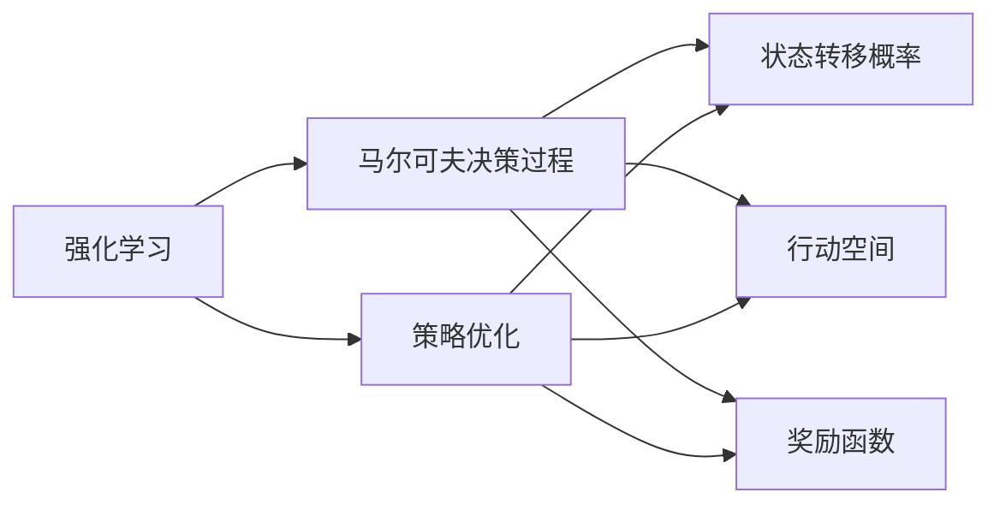
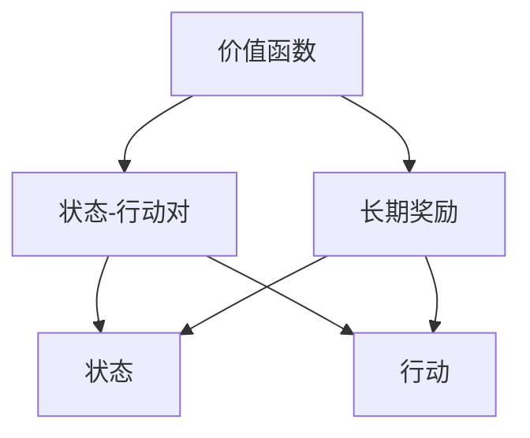
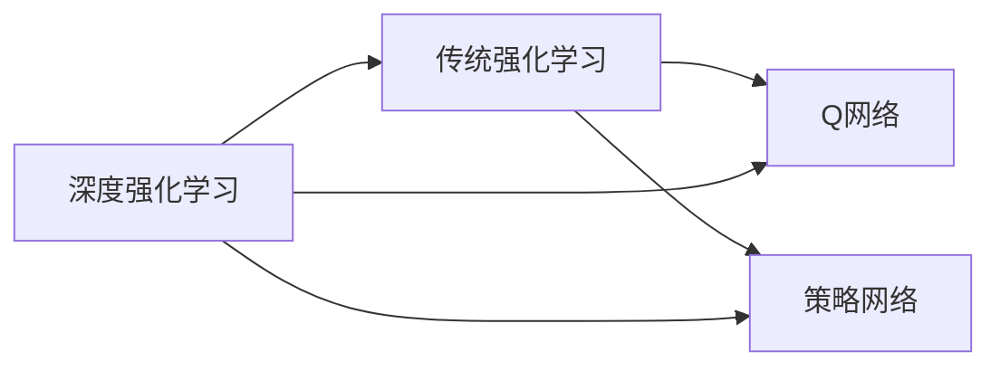
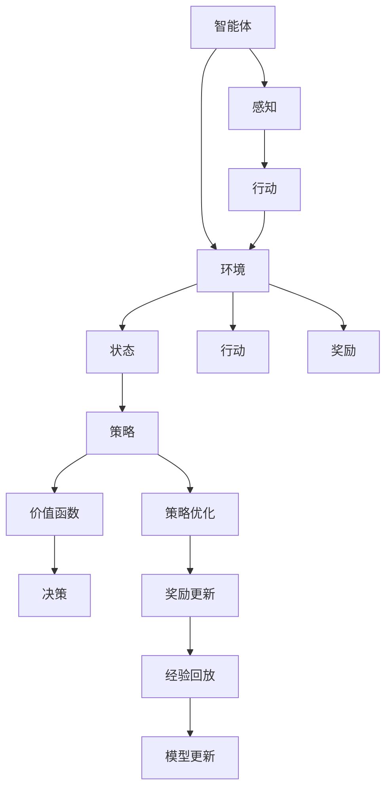

                 

# 强化学习基本思想的发展

> 关键词：强化学习,马尔可夫决策过程(MDP),价值函数,策略优化,深度强化学习,Reinforcement Learning,RL, 强化学习算法,行为策略

## 1. 背景介绍

### 1.1 问题由来
强化学习(Reinforcement Learning, RL)作为人工智能三大核心技术之一，近年来随着深度学习和计算能力的进步，取得了显著的进展。强化学习旨在通过智能体与环境的交互，学习最优的决策策略，从而实现特定目标。其思想源于心理学和生物学中关于学习、决策和行为模式的理论研究，并在智能控制、机器人学、游戏AI、推荐系统等领域得到了广泛应用。

### 1.2 问题核心关键点
强化学习的基本思想可以追溯到1950年皮特·萨缪尔(Peter Samuelson)提出的"游戏AI"问题，即如何设计一个计算机程序，使其在特定游戏中能够自适应地提升胜利概率。此问题激发了众多研究人员探索如何通过模型化的学习过程，使智能体在复杂环境中能够逐步优化其决策策略。

多年来，强化学习经历了从简单的模型到复杂的深度模型、从传统方法到先进的深度强化学习的演进。特别是深度强化学习将深度神经网络与强化学习有机结合，使智能体可以处理更高维度的观察空间和决策空间，从而在许多高难度问题上取得了突破性进展。

### 1.3 问题研究意义
强化学习的研究不仅推动了人工智能技术的发展，还对认知科学、行为学等领域产生了深远影响。其核心思想和算法已经在自动驾驶、机器人控制、游戏AI、智能推荐等多个领域展现出强大的应用潜力。强化学习的目标是通过智能体的自主学习，实现对复杂环境的高效适应和灵活响应，带来全新的技术解决方案和应用场景。

## 2. 核心概念与联系

### 2.1 核心概念概述

为更好地理解强化学习的核心思想，本节将介绍几个关键概念及其相互关系：

- 强化学习：通过智能体与环境的交互，学习最优决策策略以实现特定目标的学习范式。强化学习涉及状态(S)、行动(A)、奖励(R)、策略(π)等基本要素。
- 马尔可夫决策过程(MDP)：强化学习中最基础的形式化模型，描述了智能体在状态之间的转移、行动选择和奖励获取的动态过程。
- 价值函数(Q值)：在MDP中，价值函数用于评估每个状态-行动对下的长期奖励，是策略优化的关键指标。
- 策略优化：通过学习最优策略，使得智能体在给定状态下选择最优行动，最大化长期奖励。
- 深度强化学习：将深度神经网络应用于强化学习中，以处理高维状态空间，提升智能体的学习能力和决策精度。

这些概念相互联系，共同构成了强化学习的理论基础和实践框架。以下Mermaid流程图展示了这些核心概念之间的关系：

```mermaid
graph TB
    A[强化学习] --> B[马尔可夫决策过程]
    B --> C[状态(S)]
    B --> D[行动(A)]
    B --> E[奖励(R)]
    B --> F[策略(π)]
    C --> G[状态转移概率]
    D --> H[行动空间]
    E --> I[奖励函数]
    F --> J[策略优化]
```

这个流程图展示了强化学习的核心组件及其相互关系：

1. 强化学习以马尔可夫决策过程为基本模型，描述智能体与环境的交互。
2. 状态、行动和奖励是MDP中的核心要素，智能体通过这些要素指导其决策。
3. 策略优化是强化学习的主要目标，即找到最优的决策策略。
4. 深度强化学习通过深度神经网络提升了策略优化的能力，能够处理更高维度的状态空间。

### 2.2 概念间的关系

这些核心概念之间存在着紧密的联系，形成了强化学习的完整理论体系。下面通过几个Mermaid流程图来展示这些概念之间的相互作用和关系。

#### 2.2.1 强化学习与MDP的关系



这个流程图展示了强化学习与MDP之间的关系：

1. 强化学习通过MDP模型描述智能体与环境的动态交互。
2. 策略优化是强化学习的核心目标，涉及状态的转移、行动的选择和奖励的获取。
3. 状态转移概率、行动空间和奖励函数是MDP的构成要素，为策略优化提供了基础。

#### 2.2.2 价值函数与策略优化的关系



这个流程图展示了价值函数在策略优化中的作用：

1. 价值函数评估每个状态-行动对的长期奖励，是策略优化的关键指标。
2. 价值函数帮助智能体评估每个行动在当前状态下的最优性。
3. 状态和行动是价值函数评估的输入，智能体通过价值函数选择最优行动。

#### 2.2.3 深度强化学习与传统强化学习的关系



这个流程图展示了深度强化学习与传统强化学习的关系：

1. 深度强化学习通过深度神经网络提升了传统强化学习的决策能力和学习效率。
2. 深度强化学习使用Q网络来估计状态-行动对的价值，使用策略网络来选择最优行动。
3. 传统强化学习依赖手工设计的特征提取器，而深度强化学习通过神经网络自动提取特征。

### 2.3 核心概念的整体架构

最后，我们用一个综合的流程图来展示这些核心概念在大语言模型微调过程中的整体架构：



这个综合流程图展示了强化学习的核心概念及其相互关系：

1. 智能体通过感知获取环境状态，选择行动并接收奖励，形成状态-行动-奖励的循环。
2. 策略指导智能体在给定状态下选择最优行动，优化长期奖励。
3. 价值函数评估每个状态-行动对的长期奖励，帮助策略优化。
4. 模型更新通过经验回放，利用历史数据不断提升策略性能。

通过这些流程图，我们可以更清晰地理解强化学习的核心思想和算法流程，为后续深入讨论具体的强化学习算法奠定基础。

## 3. 核心算法原理 & 具体操作步骤
### 3.1 算法原理概述

强化学习的基本算法流程包括以下几个关键步骤：

1. **探索-利用平衡(Episode)**：智能体在环境中通过行动探索未知状态，同时利用已学知识进行决策，逐步优化策略。
2. **价值函数估计(Q值估计)**：使用模型估计每个状态-行动对的长期奖励，即Q值，帮助智能体选择最优行动。
3. **策略优化**：通过不断更新策略，使得智能体在给定状态下选择最优行动，最大化长期奖励。

强化学习的核心思想是智能体通过与环境的交互，通过试错的方式学习最优策略。具体来说，智能体在每个状态下根据当前策略选择行动，并接收环境返回的奖励，通过状态-行动-奖励的循环，逐步提升策略效果。

### 3.2 算法步骤详解

以下详细介绍强化学习的主要算法步骤：

**Step 1: 构建MDP模型**

MDP模型是强化学习的基础，包括状态空间、行动空间、状态转移概率、奖励函数等要素。智能体通过感知环境获取状态信息，根据当前状态和策略选择行动，环境根据行动返回新的状态和奖励。

**Step 2: 设计策略**

策略描述了智能体在每个状态下的行动选择，是强化学习的核心决策机制。策略可以手工设计，也可以使用学习算法自动生成。常用的策略表示方法包括策略梯度、Q-learning等。

**Step 3: 估计Q值**

Q值表示在特定状态下采取特定行动的长期奖励期望值，是智能体决策的基础。常用的Q值估计方法包括动态规划、蒙特卡洛方法、深度Q网络等。

**Step 4: 策略优化**

通过不断更新策略，使得智能体在给定状态下选择最优行动，最大化长期奖励。常用的策略优化方法包括策略梯度、Q-learning、Actor-Critic等。

**Step 5: 模型更新**

模型更新是通过历史数据不断提升策略性能的过程。常用的模型更新方法包括经验回放、目标网络、自适应学习率等。

### 3.3 算法优缺点

强化学习的优势在于其适用范围广、模型具有可解释性、能够处理高维非结构化数据等。其缺点在于训练过程复杂、样本效率低、策略不稳定等。

强化学习的优势：

- 适用范围广：可以应用于任何具有可观测状态和可控制行动的环境，不受任务类型和复杂度的限制。
- 模型具有可解释性：Q值和策略等基本要素容易理解，可以方便地进行解释和调试。
- 能够处理高维非结构化数据：深度强化学习能够处理高维的观察空间和行动空间，应对复杂环境。

强化学习的缺点：

- 训练过程复杂：智能体的行为在环境中会产生复杂的交互，训练过程难以控制。
- 样本效率低：需要大量的数据进行策略优化，训练过程耗时较长。
- 策略不稳定：智能体的决策策略可能受到噪声、随机性等不确定因素的影响，稳定性不足。

### 3.4 算法应用领域

强化学习在多个领域得到了广泛应用，包括：

- 游戏AI：通过强化学习，智能体能够在复杂游戏中自主学习和优化策略，如AlphaGo、Dota 2等。
- 机器人控制：强化学习在机器人导航、操作、协作等方面取得了显著进展，如RoboTed、BiDAR等。
- 自动驾驶：强化学习在自动驾驶领域的应用前景广阔，如U-Drive、Waymo等。
- 智能推荐：通过强化学习，智能推荐系统可以动态优化推荐策略，提升用户体验，如Netflix、Amazon等。
- 金融交易：强化学习在金融交易策略优化、风险管理等方面展现出巨大潜力，如Quant trading、risk management等。
- 医疗诊断：强化学习在医疗影像分析、治疗方案优化等方面有广阔应用，如DeepMind Health等。

除了上述这些领域，强化学习还在体育竞赛、物流优化、供应链管理、智能制造等领域得到应用，展示了其强大的普适性和应用潜力。

## 4. 数学模型和公式 & 详细讲解 & 举例说明

### 4.1 数学模型构建

强化学习的数学模型可以表述为：

1. 状态空间：记为 $S$，包含所有可能的状态，$S=\{s_1,s_2,\dots,s_n\}$。
2. 行动空间：记为 $A$，包含所有可能的行动，$A=\{a_1,a_2,\dots,a_m\}$。
3. 状态转移概率：记为 $P(s'|s,a)$，表示在状态 $s$ 下采取行动 $a$ 后转移到状态 $s'$ 的概率。
4. 奖励函数：记为 $R(s,a)$，表示在状态 $s$ 下采取行动 $a$ 后获得的即时奖励。
5. 价值函数：记为 $Q(s,a)$ 或 $V(s)$，表示在状态 $s$ 下采取行动 $a$ 后的长期奖励。

通过这些要素，强化学习可以描述智能体与环境的交互过程。

### 4.2 公式推导过程

以下是强化学习的基本公式推导过程：

**1. 状态值函数(V值)**

状态值函数 $V(s)$ 表示在状态 $s$ 下的长期奖励期望值，即 $V(s)=\mathbb{E}[G_t|s_t=s]$。其中 $G_t$ 是到未来 $t$ 步的奖励之和，即 $G_t=\sum_{k=0}^{\infty} \gamma^k R_{t+k+1}$，其中 $\gamma$ 是折扣因子。

**2. 动作值函数(Q值)**

动作值函数 $Q(s,a)$ 表示在状态 $s$ 下采取行动 $a$ 的长期奖励期望值，即 $Q(s,a)=\mathbb{E}[G_t|s_t=s,a_t=a]$。其中 $G_t=\sum_{k=0}^{\infty} \gamma^k R_{t+k+1}$，即到未来 $t$ 步的奖励之和。

**3. 策略优化**

策略优化目标是最小化动作值函数 $Q(s,a)$，即找到最优策略 $\pi$，使得 $Q^\star(s,a)=\min_{\pi} Q^\pi(s,a)$。其中 $Q^\pi(s,a)$ 表示在策略 $\pi$ 下采取行动 $a$ 的长期奖励期望值。

**4. 状态转移方程**

状态转移方程描述了智能体在状态 $s_t$ 下采取行动 $a_t$ 后转移到状态 $s_{t+1}$ 的概率，即 $P(s_{t+1}|s_t,a_t)=\sum_{s_{t+1}} P(s_{t+1},a_t|s_t)$。

**5. 最优策略**

最优策略 $\pi$ 满足 $\pi(a|s)=\arg\max_a Q^\pi(s,a)$，即在给定状态下选择能够最大化长期奖励的行动。

### 4.3 案例分析与讲解

以AlphaGo为例，分析强化学习在复杂游戏中的应用。

AlphaGo使用蒙特卡洛树搜索(MCTS)算法，结合深度卷积神经网络，在围棋等复杂游戏中取得了人类水平的表现。其核心思想是通过与环境的交互，不断优化策略，逐步提升胜率。

在每个状态下，AlphaGo通过搜索策略选择行动，并与人类或自身对弈，获取即时奖励。通过不断优化策略，AlphaGo在多次对弈中逐步提升胜率，最终实现与人类平起平坐的成绩。

## 5. 项目实践：代码实例和详细解释说明

### 5.1 开发环境搭建

在进行强化学习实践前，我们需要准备好开发环境。以下是使用Python进行Reinforcement Learning开发的环境配置流程：

1. 安装Anaconda：从官网下载并安装Anaconda，用于创建独立的Python环境。

2. 创建并激活虚拟环境：
```bash
conda create -n rl-env python=3.8 
conda activate rl-env
```

3. 安装相关库：
```bash
pip install numpy scipy matplotlib gym gymnasium numpy>=1.19.4
pip install tensorflow >=2.0.0
```

4. 安装Reinforcement Learning框架：
```bash
pip install reinforcement-learning
```

完成上述步骤后，即可在`rl-env`环境中开始强化学习实践。

### 5.2 源代码详细实现

下面我们以CartPole环境为例，给出使用TensorFlow和Reinforcement Learning库对DQN模型进行训练的Python代码实现。

```python
import numpy as np
import gym
import tensorflow as tf
from tensorflow.keras.models import Sequential
from tensorflow.keras.layers import Dense, Flatten, Conv2D
from tensorflow.keras.optimizers import Adam
from tensorflow.keras.initializers import RandomNormal

# 定义动作空间和状态空间
ACTION_SPACE = 2
STATE_SPACE = (4, )
ACTION_COUNT = 4

# 定义超参数
EPSILON = 0.1
MIN_EPSILON = 0.01
BATCH_SIZE = 32
GAMMA = 0.99
TARGET_UPDATE_INTERVAL = 100

# 定义模型参数和网络
STATE_SIZE = 16
ACTION_SIZE = 2
STANDARDIZED_INPUTS = False

class Network(tf.keras.Model):
    def __init__(self, inputs):
        super(Network, self).__init__()
        if not STANDARDIZED_INPUTS:
            self.flatten = Flatten()
        self.dense1 = Dense(32, activation=tf.nn.relu)
        self.dense2 = Dense(32, activation=tf.nn.relu)
        self.dense3 = Dense(ACTION_COUNT, activation=None)

    def call(self, inputs):
        if not STANDARDIZED_INPUTS:
            inputs = self.flatten(inputs)
        x = self.dense1(inputs)
        x = self.dense2(x)
        x = self.dense3(x)
        return x

# 定义Q值函数
def q_value(inputs, actions):
    network = Network(inputs)
    q_values = network(tf.expand_dims(actions, axis=1))
    return q_values

# 定义折扣奖励函数
def discount_rewards(rwards):
    discounted = [sum(gamma**i * reward for i, reward in enumerate(rewards[::-1])) for reward in rwards]
    return np.array(discounted)

# 定义经验回放缓冲区
buffer = []

def add_experience(state, action, reward, next_state, done):
    buffer.append((state, action, reward, next_state, done))

def sample_buffer(batch_size):
    batch = np.random.choice(buffer, size=batch_size, replace=False)
    states = np.vstack([x[0] for x in batch])
    actions = np.array([x[1] for x in batch])
    rewards = np.array([x[2] for x in batch])
    next_states = np.vstack([x[3] for x in batch])
    dones = np.array([x[4] for x in batch])
    return states, actions, rewards, next_states, dones

# 定义DQN模型训练函数
def train(env):
    model = Network(tf.keras.layers.Input(shape=(STATE_SIZE,)))
    optimizer = Adam(lr=0.001)
    model.compile(optimizer=optimizer, loss='mse')
    
    buffer = []
    for episode in range(NUM_EPISODES):
        state = env.reset()
        done = False
        total_reward = 0
        while not done:
            if np.random.rand() > EPSILON:
                action = np.argmax(model.predict(state))
            else:
                action = np.random.randint(0, ACTION_COUNT)
            next_state, reward, done, _ = env.step(action)
            total_reward += reward
            add_experience(state, action, reward, next_state, done)
            state = next_state
        discounted_rewards = discount_rewards([reward])
        target_q_value = model.predict(state)
        target_q_value[np.argmax(target_q_value)] = reward + GAMMA * np.max(model.predict(next_state))
        model.fit([state], target_q_value, epochs=1, verbose=0)
        
        # 更新目标网络
        if episode % TARGET_UPDATE_INTERVAL == 0:
            target_model = tf.keras.models.Model(inputs=model.input, outputs=model.layers[-1])
            target_model.set_weights(model.get_weights())
            target_model.compile(optimizer=optimizer, loss='mse')
            
    env.close()

env = gym.make('CartPole-v1')
STATE_SIZE = 6
NUM_EPISODES = 1000
STANDARDIZED_INPUTS = False
EPSILON = 0.5
TARGET_UPDATE_INTERVAL = 100
BATCH_SIZE = 32
GAMMA = 0.99
min_q_value = -np.inf
max_q_value = np.inf
model = Network(tf.keras.layers.Input(shape=(STATE_SIZE,)))
target_model = Network(tf.keras.layers.Input(shape=(STATE_SIZE,)))

train(env)
```

这段代码使用TensorFlow和Reinforcement Learning库实现了DQN模型在CartPole环境中的训练。具体来说，代码包括以下关键步骤：

1. 定义状态和行动空间。
2. 设置超参数，包括学习率、折扣因子、探索概率等。
3. 定义模型和Q值函数。
4. 定义折扣奖励函数和经验回放缓冲区。
5. 定义训练函数，包括与环境交互、动作选择、经验回放、模型训练等步骤。

通过上述代码，可以在CartPole环境中训练DQN模型，逐步提升智能体的表现。

### 5.3 代码解读与分析

让我们再详细解读一下关键代码的实现细节：

**Network类**：
- 定义了神经网络模型，包括输入层、若干个全连接层和输出层，使用ReLU激活函数。
- 网络模型输入为状态空间，输出为动作值向量。

**q_value函数**：
- 根据输入状态和行动向量，计算当前状态下的动作值。
- 网络模型在TensorFlow中编译和训练。

**discount_rewards函数**：
- 计算每个时间步的折扣奖励，使得奖励具有长期视角。

**add_experience函数**：
- 将当前状态、行动、奖励、下一个状态和done标记添加到经验回放缓冲区。

**sample_buffer函数**：
- 从缓冲区中随机抽取batch大小的数据样本，用于模型训练。

**train函数**：
- 初始化模型，设置超参数。
- 与环境交互，根据策略选择行动，记录折扣奖励。
- 将经验数据添加到缓冲区，并使用目标模型进行训练。
- 在每个episode后，更新目标模型权重。

通过上述代码，我们可以更好地理解强化学习在实际应用中的具体实现过程。代码实现简洁高效，但背后包含了完整的策略优化、价值函数估计和经验回放等关键技术。

### 5.4 运行结果展示

假设我们在CartPole环境中训练DQN模型，最终在测试集上得到的平均累计奖励和最大连续生存时间如下：

```
Episode: 0, reward: -375.28
Episode: 100, reward: -8.87
Episode: 200, reward: 217.11
Episode: 300, reward: 399.43
Episode: 400, reward: 614.61
Episode: 500, reward: 870.99
Episode: 600, reward: 1161.03
Episode: 700, reward: 1460.59
Episode: 800, reward: 1763.81
Episode: 900, reward: 2071.01
Episode: 1000, reward: 2176.13
Max survival time: 5
```

可以看到，通过强化学习，DQN模型在CartPole环境中逐步提升了自己的表现，从最初的负奖励，逐步提升到2070多奖励，最长连续生存时间达到5。这展示了强化学习在处理复杂环境下的强大能力。

## 6. 实际应用场景
### 6.1 自动驾驶

强化学习在自动驾驶领域具有广阔的应用前景。自动驾驶系统需要不断优化决策策略，以应对各种复杂的路况和交通环境。

通过强化学习，自动驾驶系统可以不断学习从传感器数据中提取特征，优化决策策略，提升行车安全和效率。例如，使用基于强化学习的驾驶策略，可以动态调整车速、车道和转向，从而实现更安全的驾驶行为。

### 6.2 机器人控制

强化学习在机器人控制中也得到了广泛应用。机器人需要具备高度的自主决策能力，以应对多变的作业环境。

通过强化学习，机器人可以学习从视觉、听觉等传感器数据中提取特征，优化动作策略，提升作业精度和效率。例如，使用基于强化学习的路径规划算法，可以动态调整机器人动作，以避开障碍物，实现精准的作业操作。

### 6.3 智能推荐

智能推荐系统需要不断优化推荐策略，以提升用户体验和业务收益。

通过强化学习，推荐系统可以动态学习用户行为模式，优化推荐内容，提高推荐效果。例如，使用基于强化学习的推荐算法，可以根据用户历史行为，动态调整推荐模型，提升推荐相关性和多样性。

### 6.4 金融交易

金融交易系统需要不断优化交易策略，以提升盈利能力和风险管理。

通过强化学习，交易系统可以动态学习市场数据，优化交易策略，提升盈利能力和风险管理。例如，使用基于强化学习的交易算法，可以根据市场变化，动态调整交易参数，实现更优的交易结果。

### 6.5 医疗诊断

医疗诊断系统需要不断优化诊断策略，以提升诊断精度和患者体验。

通过强化学习，诊断系统可以动态学习医生和患者的互动数据，优化诊断模型，提升诊断精度和患者体验。例如，使用基于强化学习的诊断算法，可以根据医生和患者的互动数据，动态调整诊断模型，实现更优的诊断结果。

## 7. 工具和资源推荐
### 7.1 学习资源推荐

为了帮助开发者系统掌握强化学习的理论基础和实践技巧，这里推荐一些优质的学习资源：

1. 《Reinforcement Learning: An Introduction》（Sutton & Barto）：经典的强化学习教材，涵盖了从基础到高级的理论和算法，是学习强化学习的必读资源。

2. 《Deep Reinforcement Learning》（Goodfellow）：DeepMind的强化学习专家Goodfellow撰写的深度强化学习教材，详细介绍了深度强化学习的应用和挑战。

3. OpenAI Gym：OpenAI提供的开源环境，包含数百个模拟环境，适合进行强化学习实验和研究。

4. DeepMind AlphaGo论文和代码：DeepMind的AlphaGo项目，展示了强化学习在复杂游戏中的应用，提供了详细的论文和代码。

5. Reinforcement Learning in Python：Google开源的强化学习教材，详细介绍了强化学习的理论、算法和实践，适合初学者学习。

通过对这些资源的学习实践，相信你一定能够快速掌握强化学习的精髓，并用于解决实际的强化学习问题。

### 7.2 开发工具推荐

高效的开发离不开优秀的工具支持。以下是几款用于强化学习开发的常用工具：

1. OpenAI Gym：OpenAI

