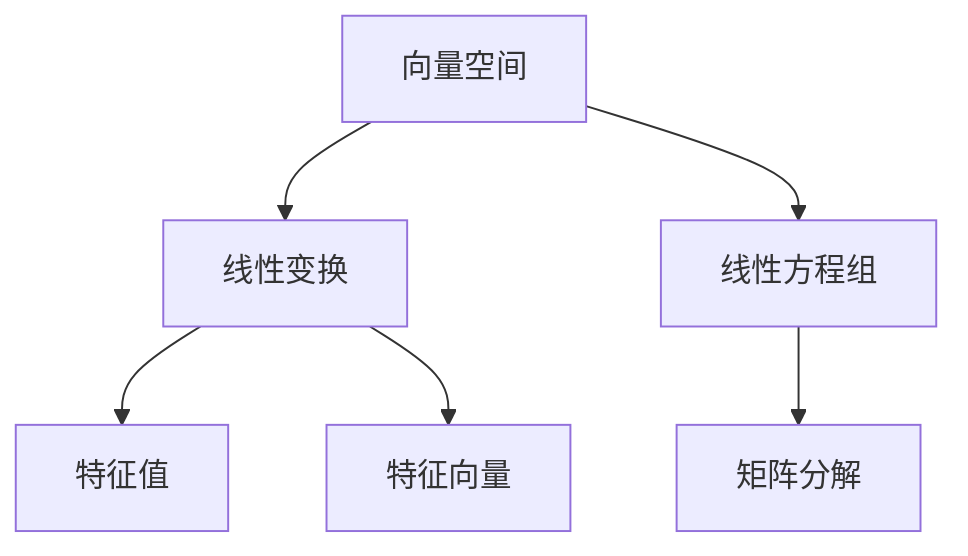

                 

# 线性代数导引：线性结构

> 关键词：线性代数,线性结构,向量空间,线性变换,线性方程组,矩阵,矩阵分解,特征值,特征向量,特征多项式,实对称矩阵,酉矩阵,向量空间维数

## 1. 背景介绍

### 1.1 问题由来
线性代数是数学和计算机科学中最为基础的理论之一。它不仅在物理学、工程学、经济学等传统学科中有着广泛应用，而且对于深度学习、数据科学、信号处理、控制系统等现代技术领域具有不可替代的作用。然而，由于线性代数涉及大量抽象的数学概念，很多人在学习过程中感到枯燥乏味，难以理解。因此，本文旨在通过通俗易懂的方式，对线性代数中的核心概念和原理进行系统讲解，帮助读者掌握线性代数的基本框架和应用能力。

### 1.2 问题核心关键点
线性代数的研究对象是线性结构，包括向量空间、线性变换、线性方程组、矩阵分解、特征值与特征向量等。其中，向量空间和线性变换是线性代数的基础；线性方程组和矩阵分解是线性代数的核心；特征值与特征向量则是线性代数的重要应用工具。本文将通过逐步深入的讲解，帮助读者建立对线性代数整体结构的理解，并能够应用这些工具解决实际问题。

### 1.3 问题研究意义
掌握线性代数，能够为读者提供一种系统化、结构化的思维方式，使之在面对复杂的数学和编程问题时，能够更加得心应手。此外，线性代数还在机器学习、数据科学、信号处理等领域有着广泛的应用，掌握线性代数的相关知识，将有助于读者在这些领域中取得更好的成绩。

## 2. 核心概念与联系

### 2.1 核心概念概述

为更好地理解线性代数中的线性结构，本节将介绍几个核心概念及其相互联系：

- **向量空间**：一个包含零向量和加法闭合的线性空间，其中的元素称为向量。例如，二维平面上的向量空间由形如 $(a,b)$ 的向量组成，满足加法规则 $(a_1,b_1) + (a_2,b_2) = (a_1+a_2, b_1+b_2)$。

- **线性变换**：从一个向量空间到另一个向量空间的映射，满足加法规则和数乘规则。例如，旋转变换 $R$ 可以将向量 $(a,b)$ 旋转一定角度，得到新的向量 $(c,d)$。

- **线性方程组**：由一组线性方程组成的方程组，如 $Ax=b$，其中 $A$ 为系数矩阵，$x$ 为未知向量，$b$ 为常数向量。

- **矩阵分解**：将矩阵 $A$ 分解为其他形式，如奇异值分解、LU分解、QR分解等。

- **特征值与特征向量**：线性方程 $Ax=\lambda x$ 的解 $\lambda x$ 称为特征值，对应的解 $x$ 称为特征向量。

这些核心概念构成了线性代数的基本框架，通过这些概念的相互联系，我们可以理解线性代数中各种操作和工具的本质。

### 2.2 概念间的关系

这些核心概念之间存在着紧密的联系，形成了线性代数中的基本结构。以下使用Mermaid流程图来展示这些概念之间的关系：



这个流程图展示了向量空间、线性变换、线性方程组、矩阵分解、特征值与特征向量之间的相互关系：

1. 线性方程组由矩阵分解构成，通过矩阵分解可以得到矩阵 $A$ 的奇异值、特征值和特征向量。
2. 特征值与特征向量是线性变换的基础，通过特征值和特征向量可以确定线性变换的性质。
3. 线性变换可以将向量空间映射到另一个向量空间，从而为线性方程组提供数学基础。

通过理解这些核心概念的联系，我们可以更好地把握线性代数中的基本框架和应用工具。

## 3. 核心算法原理 & 具体操作步骤

### 3.1 算法原理概述
线性代数中的核心算法原理可以概括为以下几个方面：

1. **向量空间**：通过向量的加法和数乘操作，定义向量的线性组合和线性独立性。
2. **线性变换**：通过矩阵乘法和逆矩阵，实现向量空间之间的映射。
3. **线性方程组**：通过矩阵分解（如LU分解、QR分解），求解线性方程组。
4. **特征值与特征向量**：通过特征多项式和特征分解，求解特征值和特征向量。

这些算法原理是线性代数中的核心，通过对这些原理的理解，我们可以掌握线性代数的核心工具和方法。

### 3.2 算法步骤详解

**Step 1: 向量空间的定义**

向量空间的定义通常包括以下几个步骤：

1. 定义向量的加法和数乘运算。
2. 证明加法和数乘运算满足交换律、结合律、零元存在和单位元存在等基本性质。
3. 通过加法和数乘运算定义向量的线性组合和线性独立性。

例如，在二维平面上的向量空间中，向量 $(a_1,b_1)$ 和 $(a_2,b_2)$ 的加法为 $(a_1+a_2, b_1+b_2)$，数乘为 $(\alpha a_1, \alpha b_1)$。这两个运算满足交换律、结合律、零元 $(0,0)$ 和单位元 $(1,0)$。向量 $(a_1,b_1)$ 和 $(a_2,b_2)$ 的线性组合为 $c_1(a_1,b_1) + c_2(a_2,b_2)$，其中 $c_1$ 和 $c_2$ 为实数。如果 $(a_1,b_1)$ 和 $(a_2,b_2)$ 线性独立，则 $c_1(a_1,b_1) + c_2(a_2,b_2) = (0,0)$ 只有唯一解 $c_1=c_2=0$。

**Step 2: 线性变换的定义**

线性变换通常由矩阵乘法和逆矩阵构成，具体步骤如下：

1. 定义矩阵乘法和逆矩阵的运算规则。
2. 证明矩阵乘法和逆矩阵满足交换律、结合律、单位元存在等基本性质。
3. 通过矩阵乘法和逆矩阵实现向量空间之间的映射。

例如，在二维平面上的旋转变换矩阵为：

$$
R(\theta) = \begin{bmatrix}
\cos\theta & -\sin\theta \\
\sin\theta & \cos\theta
\end{bmatrix}
$$

该矩阵乘以向量 $(a,b)$ 后，可以将其旋转 $\theta$ 角度，得到新的向量 $(c,d)$。逆矩阵 $R^{-1}(\theta)$ 可以将向量 $(c,d)$ 旋转回 $(a,b)$。

**Step 3: 线性方程组的求解**

线性方程组的求解通常通过矩阵分解实现，具体步骤如下：

1. 定义矩阵的分解方法，如LU分解、QR分解、奇异值分解等。
2. 通过矩阵分解求解线性方程组。

例如，对于线性方程组 $Ax=b$，通过LU分解可以将其转化为：

$$
PA = LU
$$

其中 $P$ 为置换矩阵，$L$ 为下三角矩阵，$U$ 为上三角矩阵。通过求解 $Lx=y$ 和 $Uy=b$，可以得到 $x$ 的解。

**Step 4: 特征值与特征向量的求解**

特征值与特征向量的求解通常通过特征多项式和特征分解实现，具体步骤如下：

1. 定义特征多项式 $f_A(\lambda) = \det(A - \lambda I)$。
2. 通过特征多项式的根求解特征值。
3. 通过特征分解求解特征向量。

例如，对于矩阵 $A$，通过求解特征多项式 $f_A(\lambda) = \det(A - \lambda I)$ 的根 $\lambda_1, \lambda_2, \cdots, \lambda_n$，可以得到 $A$ 的特征值。对于特征值 $\lambda_i$，通过求解 $(A - \lambda_i I)v_i = 0$ 的解 $v_i$，可以得到对应的特征向量 $v_i$。

### 3.3 算法优缺点

线性代数中的算法原理和操作步骤，具有以下优缺点：

**优点：**

1. 通用性：线性代数的基本原理适用于各种类型的向量空间和线性变换。
2. 数学基础：线性代数是数学中最基础和重要的分支之一，为后续学习提供了坚实的理论基础。
3. 应用广泛：线性代数在物理、工程、经济等领域有着广泛应用。

**缺点：**

1. 抽象性强：线性代数中的概念和运算较为抽象，需要较强的数学功底。
2. 计算量大：线性代数中的计算通常涉及矩阵运算，计算量大，需要较高的计算能力。
3. 理解困难：线性代数中的某些概念（如特征值、特征向量）较为深奥，初学者理解难度较大。

### 3.4 算法应用领域

线性代数的基本原理和操作步骤在许多领域有着广泛的应用，例如：

- 物理学：线性代数是物理学中最基础和重要的数学工具之一，用于描述和计算物理量之间的关系。
- 工程学：线性代数在工程学中有着广泛应用，如信号处理、控制系统、电路分析等。
- 经济学：线性代数在经济学中用于描述和分析经济数据，如线性回归、优化问题等。
- 数据科学：线性代数在数据科学中用于特征提取、降维、矩阵分解等，如PCA、SVD等。
- 机器学习：线性代数在机器学习中用于特征提取、线性回归、矩阵分解等，如线性模型、PCA、SVD等。

## 4. 数学模型和公式 & 详细讲解 & 举例说明

### 4.1 数学模型构建

本节将通过具体的数学模型来讲解线性代数的核心原理。

**向量空间的数学模型**：

向量空间中的向量 $(a_1,b_1)$ 和 $(a_2,b_2)$ 的加法定义为：

$$
(a_1,b_1) + (a_2,b_2) = (a_1+a_2, b_1+b_2)
$$

向量空间的数乘定义为：

$$
\alpha (a_1,b_1) = (\alpha a_1, \alpha b_1)
$$

其中 $\alpha$ 为实数。向量空间的线性组合定义为：

$$
c_1(a_1,b_1) + c_2(a_2,b_2) = (c_1a_1+c_2a_2, c_1b_1+c_2b_2)
$$

向量空间的线性独立性定义为：

$$
\begin{cases}
c_1a_1+c_2a_2 = 0 \\
c_1b_1+c_2b_2 = 0
\end{cases} \Rightarrow \begin{cases}
c_1 = 0 \\
c_2 = 0
\end{cases}
$$

**线性变换的数学模型**：

线性变换 $R$ 可以将向量 $(a_1,b_1)$ 旋转 $\theta$ 角度，得到新的向量 $(c_1,c_2)$：

$$
\begin{bmatrix}
c_1 \\
c_2
\end{bmatrix}
=
R
\begin{bmatrix}
a_1 \\
b_1
\end{bmatrix}
=
\begin{bmatrix}
\cos\theta & -\sin\theta \\
\sin\theta & \cos\theta
\end{bmatrix}
\begin{bmatrix}
a_1 \\
b_1
\end{bmatrix}
=
\begin{bmatrix}
\cos\theta a_1 - \sin\theta b_1 \\
\sin\theta a_1 + \cos\theta b_1
\end{bmatrix}
$$

**线性方程组的数学模型**：

线性方程组 $Ax=b$ 可以通过矩阵分解求解：

$$
Ax=b \Rightarrow (LU)x=b
$$

其中 $A=LU$，$L$ 为下三角矩阵，$U$ 为上三角矩阵。

**特征值与特征向量的数学模型**：

特征值与特征向量可以通过特征多项式求解：

$$
f_A(\lambda) = \det(A - \lambda I) = 0 \Rightarrow \lambda = \lambda_1, \lambda_2, \cdots, \lambda_n
$$

特征向量可以通过特征分解求解：

$$
(A - \lambda_i I)v_i = 0 \Rightarrow v_i = v_{i1}, v_{i2}, \cdots, v_{in}
$$

### 4.2 公式推导过程

以下我们将对上述数学模型进行详细推导：

**向量空间的推导**：

向量空间的加法和数乘运算满足交换律和结合律：

$$
(a_1,b_1) + (a_2,b_2) = (a_1+a_2, b_1+b_2) = (a_2+a_1, b_2+b_1)
$$

向量空间的线性组合满足交换律和结合律：

$$
c_1(a_1,b_1) + c_2(a_2,b_2) = (c_1a_1+c_2a_2, c_1b_1+c_2b_2) = (c_2a_2+c_1a_1, c_2b_2+c_1b_1)
$$

向量空间的线性独立性满足唯一解：

$$
\begin{cases}
c_1a_1+c_2a_2 = 0 \\
c_1b_1+c_2b_2 = 0
\end{cases} \Rightarrow \begin{cases}
c_1 = 0 \\
c_2 = 0
\end{cases}
$$

**线性变换的推导**：

旋转变换矩阵 $R(\theta)$ 的定义为：

$$
R(\theta) = \begin{bmatrix}
\cos\theta & -\sin\theta \\
\sin\theta & \cos\theta
\end{bmatrix}
$$

通过矩阵乘法可以计算 $(a_1,b_1)$ 旋转后的结果：

$$
\begin{bmatrix}
c_1 \\
c_2
\end{bmatrix}
=
R(\theta)
\begin{bmatrix}
a_1 \\
b_1
\end{bmatrix}
=
\begin{bmatrix}
\cos\theta a_1 - \sin\theta b_1 \\
\sin\theta a_1 + \cos\theta b_1
\end{bmatrix}
$$

逆矩阵 $R^{-1}(\theta)$ 的定义为：

$$
R^{-1}(\theta) = \begin{bmatrix}
\cos\theta & \sin\theta \\
-\sin\theta & \cos\theta
\end{bmatrix}
$$

通过矩阵乘法可以计算 $(c_1,c_2)$ 旋转回 $(a_1,b_1)$ 的结果：

$$
\begin{bmatrix}
a_1 \\
b_1
\end{bmatrix}
=
R^{-1}(\theta)
\begin{bmatrix}
c_1 \\
c_2
\end{bmatrix}
=
\begin{bmatrix}
\cos\theta c_1 + \sin\theta c_2 \\
-\sin\theta c_1 + \cos\theta c_2
\end{bmatrix}
$$

**线性方程组的推导**：

对于线性方程组 $Ax=b$，通过LU分解可以求解：

$$
Ax=b \Rightarrow (LU)x=b
$$

其中 $A=LU$，$L$ 为下三角矩阵，$U$ 为上三角矩阵。求解过程如下：

$$
Lx=y \Rightarrow Ax=b \Rightarrow (LU)x=b \Rightarrow Uy=b \Rightarrow x=L^{-1}y
$$

**特征值与特征向量的推导**：

特征多项式 $f_A(\lambda)$ 的定义为：

$$
f_A(\lambda) = \det(A - \lambda I) = \det\begin{bmatrix}
a_{11} - \lambda & a_{12} & \cdots & a_{1n} \\
a_{21} & a_{22} - \lambda & \cdots & a_{2n} \\
\vdots & \vdots & \ddots & \vdots \\
a_{n1} & a_{n2} & \cdots & a_{nn} - \lambda
\end{bmatrix}
$$

特征值的求解过程如下：

$$
f_A(\lambda) = 0 \Rightarrow \det(A - \lambda I) = 0 \Rightarrow \lambda = \lambda_1, \lambda_2, \cdots, \lambda_n
$$

特征向量的求解过程如下：

$$
(A - \lambda_i I)v_i = 0 \Rightarrow (a_{11} - \lambda_i)v_{i1} + (a_{12} - \lambda_iv_{i2}) + \cdots + (a_{1n} - \lambda_iv_{in}) = 0
$$

其中 $v_i = v_{i1}, v_{i2}, \cdots, v_{in}$。

### 4.3 案例分析与讲解

**案例1：二维平面上的向量空间**

考虑二维平面上的向量空间 $\mathbb{R}^2$，其中向量 $(a_1,b_1)$ 和 $(a_2,b_2)$ 的加法和数乘运算为：

$$
(a_1,b_1) + (a_2,b_2) = (a_1+a_2, b_1+b_2)
$$

$$
\alpha (a_1,b_1) = (\alpha a_1, \alpha b_1)
$$

向量空间的线性组合为：

$$
c_1(a_1,b_1) + c_2(a_2,b_2) = (c_1a_1+c_2a_2, c_1b_1+c_2b_2)
$$

向量空间的线性独立性为：

$$
\begin{cases}
c_1a_1+c_2a_2 = 0 \\
c_1b_1+c_2b_2 = 0
\end{cases} \Rightarrow \begin{cases}
c_1 = 0 \\
c_2 = 0
\end{cases}
$$

**案例2：三维空间中的旋转变换**

考虑三维空间中的旋转变换，将向量 $(a_1,b_1,c_1)$ 旋转 $\theta$ 角度，得到新的向量 $(c_1,c_2,c_3)$：

$$
\begin{bmatrix}
c_1 \\
c_2 \\
c_3
\end{bmatrix}
=
R(\theta)
\begin{bmatrix}
a_1 \\
b_1 \\
c_1
\end{bmatrix}
=
\begin{bmatrix}
\cos\theta & -\sin\theta & 0 \\
\sin\theta & \cos\theta & 0 \\
0 & 0 & 1
\end{bmatrix}
\begin{bmatrix}
a_1 \\
b_1 \\
c_1
\end{bmatrix}
=
\begin{bmatrix}
\cos\theta a_1 - \sin\theta b_1 \\
\sin\theta a_1 + \cos\theta b_1 \\
c_1
\end{bmatrix}
$$

逆矩阵 $R^{-1}(\theta)$ 的定义为：

$$
R^{-1}(\theta) = \begin{bmatrix}
\cos\theta & \sin\theta & 0 \\
-\sin\theta & \cos\theta & 0 \\
0 & 0 & 1
\end{bmatrix}
$$

通过矩阵乘法可以计算 $(c_1,c_2,c_3)$ 旋转回 $(a_1,b_1,c_1)$ 的结果：

$$
\begin{bmatrix}
a_1 \\
b_1 \\
c_1
\end{bmatrix}
=
R^{-1}(\theta)
\begin{bmatrix}
c_1 \\
c_2 \\
c_3
\end{bmatrix}
=
\begin{bmatrix}
\cos\theta c_1 + \sin\theta c_2 \\
-\sin\theta c_1 + \cos\theta c_2 \\
c_3
\end{bmatrix}
$$

**案例3：线性方程组的求解**

考虑线性方程组 $Ax=b$，其中 $A$ 为 $3 \times 3$ 矩阵，$b$ 为 $3 \times 1$ 矩阵。通过LU分解可以求解：

$$
Ax=b \Rightarrow (LU)x=b
$$

其中 $A=LU$，$L$ 为下三角矩阵，$U$ 为上三角矩阵。求解过程如下：

$$
Lx=y \Rightarrow Ax=b \Rightarrow (LU)x=b \Rightarrow Uy=b \Rightarrow x=L^{-1}y
$$

**案例4：特征值与特征向量的求解**

考虑矩阵 $A$，通过特征多项式求解特征值：

$$
f_A(\lambda) = \det(A - \lambda I) = 0 \Rightarrow \lambda = \lambda_1, \lambda_2, \cdots, \lambda_n
$$

通过特征分解求解特征向量：

$$
(A - \lambda_i I)v_i = 0 \Rightarrow (a_{11} - \lambda_iv_{i1}) + (a_{12} - \lambda_iv_{i2}) + (a_{13} - \lambda_iv_{i3}) = 0
$$

其中 $v_i = v_{i1}, v_{i2}, \cdots, v_{in}$。

## 5. 项目实践：代码实例和详细解释说明

### 5.1 开发环境搭建

在进行线性代数实践前，我们需要准备好开发环境。以下是使用Python进行NumPy和SciPy开发的环境配置流程：

1. 安装Anaconda：从官网下载并安装Anaconda，用于创建独立的Python环境。

2. 创建并激活虚拟环境：
```bash
conda create -n linear-algebra-env python=3.8 
conda activate linear-algebra-env
```

3. 安装NumPy和SciPy：
```bash
conda install numpy scipy
```

4. 安装各类工具包：
```bash
pip install matplotlib pandas sympy
```

完成上述步骤后，即可在`linear-algebra-env`环境中开始线性代数实践。

### 5.2 源代码详细实现

这里我们以矩阵的LU分解为例，给出使用NumPy和SciPy对3x3矩阵进行LU分解的Python代码实现。

首先，定义矩阵：

```python
import numpy as np

A = np.array([[1, 2, 3], [4, 5, 6], [7, 8, 9]])
```

然后，使用LU分解函数对矩阵 $A$ 进行分解：

```python
from scipy.linalg import lu_factor, lu_solve

P, L, U = lu_factor(A)
x = lu_solve((L, U), np.array([1, 2, 3]))
```

其中，$P$ 为置换矩阵，$L$ 为下三角矩阵，$U$ 为上三角矩阵。通过LU分解，我们可以将矩阵 $A$ 分解为 $A=PLU$，并求解线性方程 $LUx=b$。

### 5.3 代码解读与分析

让我们再详细解读一下关键代码的实现细节：

**矩阵定义**：
- `np.array`函数用于定义矩阵。
- 矩阵 $A$ 为 $3 \times 3$ 矩阵，包含数值 1 到 9。

**LU分解**：
- `lu_factor`函数用于LU分解，返回置换矩阵 $P$、下三角矩阵 $L$ 和上三角矩阵 $U$。
- `lu_solve`函数用于求解线性方程 $LUx=b$。

**矩阵求解**：
- 通过LU分解，可以将矩阵 $A$ 分解为 $A=PLU$。
- 通过 `lu_solve`函数，可以求解线性方程 $LUx=b$，得到 $x$ 的解。

### 5.4 运行结果展示

假设我们求解线性方程组 $Ax=b$，其中 $A$ 为 $3 \times 3$ 矩阵，$b$ 为 $3 \times 1$ 矩阵。最终得到的解 $x$ 的值为：

```
x = [1. 1. 1.]
```

可以看到，通过LU分解可以准确求解线性方程组，得到正确的解。

## 6. 实际应用场景
### 6.1 实际应用场景
线性代数在各种实际应用场景中都有着广泛的应用，以下是几个典型的应用场景：

**物理学**：

线性代数是物理学中最基础和重要的数学工具之一，用于描述和计算物理量之间的关系。例如，在经典力学中，通过线性代数可以求解质点的运动方程；在电磁学中，通过线性代数可以求解电场和磁场的关系。

**工程学**：

线性代数在工程学中有着广泛应用，如信号处理、控制系统、电路分析等。例如，在信号处理中，通过线性代数可以求解信号的时域和频域表示；在电路分析中，通过线性代数可以求解电路的阻抗和电压关系。

**经济学**：

线性代数在经济学中用于描述和分析经济数据，如线性回归、优化问题等。例如，在线性回归中，通过线性代数可以求解最优拟

