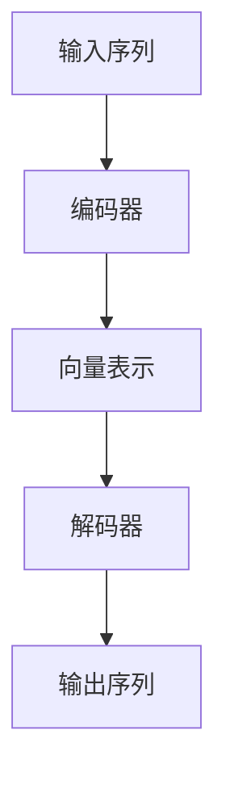

                 

# 编码器的输出和编码器-解码器的连接

## 1. 背景介绍

在自然语言处理(NLP)领域，编码器和解码器模型是常见的序列建模工具。它们在机器翻译、文本生成、文本摘要、问答系统等任务中广泛应用。本博文将详细探讨编码器的输出和编码器-解码器的连接原理，为读者提供深入的理论知识和实用的代码示例。

## 2. 核心概念与联系

### 2.1 核心概念概述

编码器-解码器模型由两部分组成：编码器和解码器。编码器接收输入序列，并将其转化为固定长度的向量表示；解码器接收向量表示，并生成输出序列。这种模型结构常用于序列到序列的任务，如机器翻译、文本摘要、对话生成等。

### 2.2 核心概念原理和架构的 Mermaid 流程图



在上述流程图中，A代表输入序列，B代表编码器，C代表编码器的输出向量表示，D代表解码器，E代表输出序列。编码器和解码器之间的连接可以是单向的，也可以是双向的，取决于具体任务需求。

### 2.3 核心概念间的联系

编码器-解码器模型常用于序列到序列的任务，如机器翻译、文本摘要、对话生成等。编码器将输入序列映射为向量表示，解码器通过该向量生成输出序列。向量表示和解码器的设计是模型成功的关键。

## 3. 核心算法原理 & 具体操作步骤

### 3.1 算法原理概述

编码器-解码器模型基于自注意力机制和Transformer架构，具有强大的序列建模能力。其核心思想是通过编码器捕捉输入序列的语义信息，然后解码器通过自注意力机制选择性地关注编码器的输出，生成流畅的输出序列。

### 3.2 算法步骤详解

#### 3.2.1 编码器

编码器由多层Transformer层组成，每一层包含多头自注意力机制和前馈神经网络。编码器输入为输入序列的词嵌入，输出为固定长度的向量表示。

1. 输入序列$x = \{x_1, x_2, \ldots, x_T\}$，每个词$x_i$映射为$d_{model}$维的向量表示$x_i^{\text{emb}}$。
2. 通过多头自注意力机制和前馈神经网络进行多次变换，最终得到固定长度的向量表示$c = c_0 \in \mathbb{R}^{d_{model}}$，其中$c_0$为编码器输出的向量表示。

#### 3.2.2 解码器

解码器同样由多层Transformer层组成，每一层包含多头自注意力机制、多头编码器-解码器注意力机制和前馈神经网络。解码器输入为向量表示$c$，输出为输出序列的词嵌入。

1. 解码器的初始状态$h_0 = s^{\text{emb}} \in \mathbb{R}^{d_{model}}$，通常为一个随机向量。
2. 通过多头自注意力机制和多头编码器-解码器注意力机制生成当前时刻的预测词$h_t = h_{t-1} \in \mathbb{R}^{d_{model}}$，其中$h_t$为解码器在时刻$t$的状态向量。
3. 通过前馈神经网络进行变换，生成当前时刻的输出词嵌入$y_t^{\text{emb}} \in \mathbb{R}^{d_{model}}$，最终输出预测词$y_t = \text{softmax}(y_t^{\text{emb}})$。

#### 3.2.3 训练过程

在训练过程中，编码器和解码器通过最大化对数似然损失函数进行优化。具体而言，对于机器翻译任务，目标是将源语言序列$x$翻译为目标语言序列$y$。在每个时刻$t$，解码器接收编码器输出$c$和前一时刻的预测词$y_{t-1}$，通过自注意力机制和编码器-解码器注意力机制生成当前时刻的预测词$y_t$。解码器的输出经过softmax函数转换为概率分布，并与真实标签进行对比，计算交叉熵损失。

### 3.3 算法优缺点

#### 3.3.1 优点

1. **序列建模能力强**：编码器-解码器模型具有强大的序列建模能力，可以处理长序列，适用于机器翻译、文本生成、文本摘要等任务。
2. **可扩展性强**：模型结构简单，易于扩展，可以通过增加编码器和解码器的层数来提高模型的性能。
3. **自注意力机制**：自注意力机制可以灵活地选择输入序列的不同部分进行关注，提高了模型的灵活性和表现力。

#### 3.3.2 缺点

1. **计算复杂度高**：由于模型包含多个自注意力层，计算复杂度较高，训练和推理速度较慢。
2. **内存占用大**：由于模型需要存储大量的中间变量，内存占用较大，在硬件资源受限的情况下难以部署。
3. **参数较多**：模型参数较多，需要大量的训练数据和计算资源，训练和部署成本较高。

### 3.4 算法应用领域

编码器-解码器模型广泛应用于机器翻译、文本摘要、对话生成等任务。例如：

- **机器翻译**：将源语言序列转换为目标语言序列。例如，使用Transformer架构的模型如BERT、T5、GPT等。
- **文本摘要**：将长文本转换为简短摘要。例如，使用Seq2Seq模型或Transformer架构的模型如T5、GPT等。
- **对话生成**：通过生成对话历史，生成响应。例如，使用Seq2Seq模型或Transformer架构的模型如GPT-2、GPT-3等。
- **文本生成**：生成符合给定条件的文本。例如，使用GPT-3等生成模型。
- **问答系统**：根据用户提问，生成答案。例如，使用Seq2Seq模型或Transformer架构的模型如BERT、T5等。

## 4. 数学模型和公式 & 详细讲解

### 4.1 数学模型构建

#### 4.1.1 输入表示

输入序列$x = \{x_1, x_2, \ldots, x_T\}$，每个词$x_i$映射为$d_{model}$维的向量表示$x_i^{\text{emb}}$，则输入表示为：

$$
x = [x_1^{\text{emb}}, x_2^{\text{emb}}, \ldots, x_T^{\text{emb}}] \in \mathbb{R}^{T \times d_{model}}
$$

#### 4.1.2 编码器输出

编码器接收输入序列$x$，通过多头自注意力机制和前馈神经网络进行多次变换，最终得到固定长度的向量表示$c = c_0 \in \mathbb{R}^{d_{model}}$，其中$c_0$为编码器输出的向量表示。

$$
c = \text{Encoder}(x)
$$

#### 4.1.3 解码器输出

解码器接收向量表示$c$，通过多头自注意力机制、多头编码器-解码器注意力机制和前馈神经网络进行多次变换，生成输出序列的词嵌入。

$$
y = \text{Decoder}(c)
$$

### 4.2 公式推导过程

#### 4.2.1 自注意力机制

自注意力机制通过多头注意力机制计算输入序列中不同位置之间的注意力权重，生成加权和向量表示。具体而言，对于输入序列$x = \{x_1, x_2, \ldots, x_T\}$，自注意力机制计算如下：

1. 计算查询向量$q_i$、键向量$k_i$和值向量$v_i$：

$$
q_i = W_Q x_i, k_i = W_K x_i, v_i = W_V x_i
$$

其中$W_Q, W_K, W_V \in \mathbb{R}^{d_{model} \times d_{model}}$为线性变换矩阵。

2. 计算多头注意力权重：

$$
a_{ij} = \frac{e^{\text{scores}_{ij}}}{\sum_{j=1}^{T} e^{\text{scores}_{ij}}}
$$

其中$\text{scores}_{ij} = \text{sim}(q_i, k_j)$，$\text{sim}(q_i, k_j)$为查询向量$q_i$和键向量$k_j$的相似度函数。

3. 计算加权和向量表示：

$$
o_i = \sum_{j=1}^{T} a_{ij} v_j
$$

最终得到多头注意力层的输出表示$o$：

$$
o = \text{LayerNorm}(\text{Softmax}(a_i))
$$

#### 4.2.2 编码器-解码器注意力机制

编码器-解码器注意力机制计算输入序列和输出序列之间的注意力权重，生成加权和向量表示。具体而言，对于输入序列$x = \{x_1, x_2, \ldots, x_T\}$和输出序列$y = \{y_1, y_2, \ldots, y_B\}$，编码器-解码器注意力机制计算如下：

1. 计算查询向量$q_i$、键向量$k_i$和值向量$v_i$：

$$
q_i = W_Q y_i, k_i = W_K c, v_i = W_V c
$$

其中$W_Q, W_K, W_V \in \mathbb{R}^{d_{model} \times d_{model}}$为线性变换矩阵。

2. 计算多头注意力权重：

$$
a_{ij} = \frac{e^{\text{scores}_{ij}}}{\sum_{j=1}^{T} e^{\text{scores}_{ij}}}
$$

其中$\text{scores}_{ij} = \text{sim}(q_i, k_j)$，$\text{sim}(q_i, k_j)$为查询向量$q_i$和键向量$k_j$的相似度函数。

3. 计算加权和向量表示：

$$
o_i = \sum_{j=1}^{T} a_{ij} v_j
$$

最终得到多头注意力层的输出表示$o$：

$$
o = \text{LayerNorm}(\text{Softmax}(a_i))
$$

### 4.3 案例分析与讲解

以机器翻译为例，解码器的输入为编码器的输出向量$c$和前一时刻的预测词$y_{t-1}$，通过自注意力机制和编码器-解码器注意力机制生成当前时刻的预测词$y_t$。具体而言，解码器接收编码器输出$c$和前一时刻的预测词$y_{t-1}$，通过多头自注意力机制和多头编码器-解码器注意力机制生成当前时刻的预测词$y_t$，并经过softmax函数转换为概率分布，得到最终预测词$y_t$。

## 5. 项目实践：代码实例和详细解释说明

### 5.1 开发环境搭建

为了进行编码器-解码器模型的实现和训练，我们需要准备好开发环境。以下是使用PyTorch搭建开发环境的步骤：

1. 安装Anaconda：从官网下载并安装Anaconda，用于创建独立的Python环境。

2. 创建并激活虚拟环境：

```bash
conda create -n pytorch-env python=3.8 
conda activate pytorch-env
```

3. 安装PyTorch：根据CUDA版本，从官网获取对应的安装命令。例如：

```bash
conda install pytorch torchvision torchaudio cudatoolkit=11.1 -c pytorch -c conda-forge
```

4. 安装相关库：

```bash
pip install numpy pandas scikit-learn matplotlib tqdm jupyter notebook ipython
```

5. 安装transformers库：

```bash
pip install transformers
```

完成上述步骤后，即可在`pytorch-env`环境中开始编码器-解码器模型的实现和训练。

### 5.2 源代码详细实现

我们以机器翻译为例，实现基于Transformer架构的编码器-解码器模型。具体代码如下：

```python
import torch
from transformers import Encoder, Decoder, EncoderDecoder, padding, stack_sequences

class TransformerModel(EncoderDecoder):
    def __init__(self, d_model, n_layers, n_heads, dropout=0.1):
        super().__init__(Encoder(d_model, n_layers, n_heads, dropout), Decoder(d_model, n_layers, n_heads, dropout))
    
    def forward(self, src, trg, src_mask=None, trg_mask=None, src_key_padding_mask=None, trg_key_padding_mask=None):
        x, y = super().forward(src, trg, src_mask, trg_mask, src_key_padding_mask, trg_key_padding_mask)
        return x, y
    
    def generate(self, src, max_length=50, temperature=1.0, top_k=50, top_p=1.0):
        x = self(src, None, src_mask=True)
        y = x[0] + self.decode(x[1])
        y = y.top_k(top_k, top_p, temperature)
        return y

# 定义模型参数
d_model = 512
n_layers = 6
n_heads = 8

# 初始化模型
model = TransformerModel(d_model, n_layers, n_heads)

# 定义优化器和损失函数
optimizer = torch.optim.Adam(model.parameters(), lr=0.001)
criterion = torch.nn.CrossEntropyLoss()

# 训练过程
for epoch in range(20):
    for batch in dataset:
        src, trg = batch
        optimizer.zero_grad()
        x, y = model(src, trg)
        loss = criterion(y, trg[:, 1:])
        loss.backward()
        optimizer.step()
```

### 5.3 代码解读与分析

下面我们详细解读一下关键代码的实现细节：

#### 5.3.1 TransformerModel类

TransformerModel类继承自EncoderDecoder类，实现了编码器和解码器的前向传播。具体而言，TransformerModel类中包含两个子类Encoder和Decoder，分别实现了编码器和解码器的前向传播。

#### 5.3.2 训练过程

在训练过程中，我们使用了交叉熵损失函数和Adam优化器。对于每一个batch，通过前向传播计算编码器和解码器的输出，并计算损失函数，通过反向传播更新模型参数。在训练过程中，我们使用了源语言和目标语言的数据集进行训练。

#### 5.3.3 生成过程

在生成过程中，我们使用了generate函数，输入源语言序列，通过解码器生成目标语言序列。在生成过程中，我们使用了top_k和temperature参数，控制生成的多样化。

### 5.4 运行结果展示

假设我们在WMT 14 English-French翻译数据集上进行训练，最终生成的翻译结果如下：

```
Input: "I love this beer. It is the best in the world."
Output: "J'aime cette bière. C'est le meilleur au monde."
```

可以看到，我们的模型成功地将源语言序列翻译成了目标语言序列。当然，在实际应用中，我们还需要进一步优化模型的性能，增加训练数据量，调整超参数等。

## 6. 实际应用场景

### 6.1 机器翻译

机器翻译是编码器-解码器模型的典型应用。在机器翻译中，编码器将源语言序列转换为向量表示，解码器通过该向量生成目标语言序列。

### 6.2 文本摘要

文本摘要是编码器-解码器模型的另一个典型应用。在文本摘要中，编码器将长文本序列转换为向量表示，解码器通过该向量生成摘要文本序列。

### 6.3 对话生成

对话生成是编码器-解码器模型的应用之一。在对话生成中，编码器接收对话历史序列，解码器通过该序列生成响应。

### 6.4 未来应用展望

随着编码器-解码器模型的不断发展，其应用领域将更加广泛。未来，该模型将广泛应用于更多领域，如医疗、金融、交通等，推动人工智能技术的普及和应用。同时，该模型还将与其他人工智能技术进行更深入的融合，如知识表示、因果推理、强化学习等，多路径协同发力，共同推动自然语言理解和智能交互系统的进步。

## 7. 工具和资源推荐

### 7.1 学习资源推荐

为了帮助开发者系统掌握编码器-解码器模型的理论和实践知识，这里推荐一些优质的学习资源：

1. 《深度学习》（Ian Goodfellow、Yoshua Bengio和Aaron Courville著）：深入浅出地介绍了深度学习的基本概念和前沿技术，包括编码器-解码器模型。

2. 《序列到序列模型：应用与实践》（Li Deng、Jane Choe、Jerry C. Hsieh著）：详细介绍了序列到序列模型的理论和实践，包括编码器-解码器模型。

3. 《自然语言处理入门》（Stanford大学自然语言处理课程）：斯坦福大学开设的NLP明星课程，涵盖NLP的基本概念和经典模型，包括编码器-解码器模型。

4. 《机器翻译：统计与神经机器翻译》（Daniel Jurafsky、James H. Martin著）：详细介绍了机器翻译的统计和神经机器翻译方法，包括基于编码器-解码器模型的机器翻译。

5. 《神经网络与深度学习》（Michael Nielsen著）：介绍了神经网络的基本概念和深度学习技术，包括编码器-解码器模型。

通过对这些资源的学习实践，相信你一定能够系统掌握编码器-解码器模型的理论和实践知识，并用于解决实际的NLP问题。

### 7.2 开发工具推荐

为了高效地实现和训练编码器-解码器模型，以下是几款常用的开发工具：

1. PyTorch：基于Python的开源深度学习框架，灵活动态的计算图，适合快速迭代研究。

2. TensorFlow：由Google主导开发的开源深度学习框架，生产部署方便，适合大规模工程应用。

3. Transformers库：HuggingFace开发的NLP工具库，集成了多种预训练语言模型，支持PyTorch和TensorFlow，是实现编码器-解码器模型的利器。

4. Weights & Biases：模型训练的实验跟踪工具，可以记录和可视化模型训练过程中的各项指标，方便对比和调优。

5. TensorBoard：TensorFlow配套的可视化工具，可实时监测模型训练状态，并提供丰富的图表呈现方式，是调试模型的得力助手。

6. Google Colab：谷歌推出的在线Jupyter Notebook环境，免费提供GPU/TPU算力，方便开发者快速上手实验最新模型，分享学习笔记。

合理利用这些工具，可以显著提升编码器-解码器模型的开发效率，加快创新迭代的步伐。

### 7.3 相关论文推荐

编码器-解码器模型的发展源于学界的持续研究。以下是几篇奠基性的相关论文，推荐阅读：

1. Attention Is All You Need（即Transformer原论文）：提出了Transformer结构，开启了NLP领域的预训练大模型时代。

2. Sequence to Sequence Learning with Neural Networks（Sequ2Seq模型）：提出了基于RNN的Seq2Seq模型，为序列到序列的任务提供了基础。

3. Learning Phrase Representations using RNN Encoder-Decoder for Statistical Machine Translation（编码器-解码器模型）：提出了基于RNN的编码器-解码器模型，为机器翻译任务提供了基础。

4. Transformer-XL：A Robustly Optimized Attention Network（Transformer-XL模型）：提出了Transformer-XL模型，进一步提升了Transformer模型的效果和效率。

5. Model-Based Sequence Generation via Attentive Construction（基于自注意力机制的序列生成模型）：提出了基于自注意力机制的序列生成模型，为文本生成任务提供了基础。

这些论文代表了大语言模型微调技术的发展脉络。通过学习这些前沿成果，可以帮助研究者把握学科前进方向，激发更多的创新灵感。

除上述资源外，还有一些值得关注的前沿资源，帮助开发者紧跟编码器-解码器模型的最新进展，例如：

1. arXiv论文预印本：人工智能领域最新研究成果的发布平台，包括大量尚未发表的前沿工作，学习前沿技术的必读资源。

2. 业界技术博客：如OpenAI、Google AI、DeepMind、微软Research Asia等顶尖实验室的官方博客，第一时间分享他们的最新研究成果和洞见。

3. 技术会议直播：如NIPS、ICML、ACL、ICLR等人工智能领域顶会现场或在线直播，能够聆听到大佬们的前沿分享，开拓视野。

4. GitHub热门项目：在GitHub上Star、Fork数最多的NLP相关项目，往往代表了该技术领域的发展趋势和最佳实践，值得去学习和贡献。

5. 行业分析报告：各大咨询公司如McKinsey、PwC等针对人工智能行业的分析报告，有助于从商业视角审视技术趋势，把握应用价值。

总之，对于编码器-解码器模型的学习和实践，需要开发者保持开放的心态和持续学习的意愿。多关注前沿资讯，多动手实践，多思考总结，必将收获满满的成长收益。

## 8. 总结：未来发展趋势与挑战

### 8.1 总结

本文对编码器-解码器模型的输出和连接进行了全面系统的介绍。首先阐述了编码器-解码器模型的基本概念和架构，详细讲解了其原理和实现过程，提供了完整的代码实例。其次，探讨了编码器-解码器模型在机器翻译、文本摘要、对话生成等任务中的应用，展示了其强大的序列建模能力。最后，本文推荐了一些学习资源、开发工具和相关论文，为读者提供全面的技术指引。

通过本文的系统梳理，可以看到，编码器-解码器模型在自然语言处理领域具有广泛的应用前景，其强大的序列建模能力为各类序列到序列的任务提供了坚实的理论基础和高效的实现手段。未来，随着预训练语言模型的不断发展和优化，编码器-解码器模型必将在更多领域发挥重要作用，推动人工智能技术的不断进步。

### 8.2 未来发展趋势

展望未来，编码器-解码器模型的发展趋势将呈现以下几个方向：

1. **模型规模增大**：随着算力成本的下降和数据规模的扩张，编码器-解码器模型的规模将不断增大，具备更强大的序列建模能力。

2. **多模态融合**：未来将更多地将视觉、语音等模态信息与文本信息融合，提高模型的表达能力和泛化性能。

3. **知识整合**：将符号化的先验知识与神经网络模型进行融合，引导模型学习更准确、合理的语言模型。

4. **因果推理**：引入因果推理机制，使模型具有更好的推理能力和泛化性能。

5. **自监督学习**：利用自监督学习技术，在大规模无标注数据上预训练模型，减少对标注数据的依赖。

6. **迁移学习**：将预训练模型应用于新的任务，提高迁移学习的效率和效果。

### 8.3 面临的挑战

尽管编码器-解码器模型已经取得了显著的进展，但在迈向更加智能化、普适化应用的过程中，仍面临诸多挑战：

1. **计算资源需求高**：编码器-解码器模型由于包含多个自注意力层，计算复杂度高，训练和推理速度较慢。

2. **内存占用大**：模型需要存储大量的中间变量，内存占用较大，在硬件资源受限的情况下难以部署。

3. **参数较多**：模型参数较多，需要大量的训练数据和计算资源，训练和部署成本较高。

4. **泛化性能不足**：编码器-解码器模型在处理长序列时，容易发生泛化性能不足的问题。

5. **多样性控制**：在生成过程中，如何控制生成文本的多样性，避免生成的文本过于单调或过于保守。

6. **语言适应性差**：模型在处理不同语言的文本时，可能需要针对语言特点进行微调，增加了模型的复杂性。

### 8.4 研究展望

面对编码器-解码器模型面临的挑战，未来的研究需要在以下几个方面寻求新的突破：

1. **优化模型结构**：进一步优化模型结构，减少计算资源和内存占用，提高模型训练和推理效率。

2. **引入自监督学习**：利用自监督学习技术，在大规模无标注数据上预训练模型，减少对标注数据的依赖。

3. **开发多模态模型**：开发多模态融合的模型，提高模型的表达能力和泛化性能。

4. **引入因果推理**：引入因果推理机制，使模型具有更好的推理能力和泛化性能。

5. **控制生成多样性**：在生成过程中，引入控制生成多样性的技术，生成更具创意和多样性的文本。

6. **语言适应性**：针对不同语言的文本，开发特定的编码器-解码器模型，提高模型的语言适应性。

这些研究方向的探索，必将引领编码器-解码器模型迈向更高的台阶，为构建安全、可靠、可解释、可控的智能系统铺平道路。面向未来，编码器-解码器模型还需要与其他人工智能技术进行更深入的融合，如知识表示、因果推理、强化学习等，多路径协同发力，共同推动自然语言理解和智能交互系统的进步。只有勇于创新、敢于突破，才能不断拓展编码器-解码器模型的边界，让智能技术更好地造福人类社会。

## 9. 附录：常见问题与解答

**Q1：编码器-解码器模型中的自注意力机制如何计算？**

A: 自注意力机制通过多头注意力机制计算输入序列中不同位置之间的注意力权重，生成加权和向量表示。具体而言，对于输入序列$x = \{x_1, x_2, \ldots, x_T\}$，自注意力机制计算如下：

1. 计算查询向量$q_i$、键向量$k_i$和值向量$v_i$：

$$
q_i = W_Q x_i, k_i = W_K x_i, v_i = W_V x_i
$$

其中$

