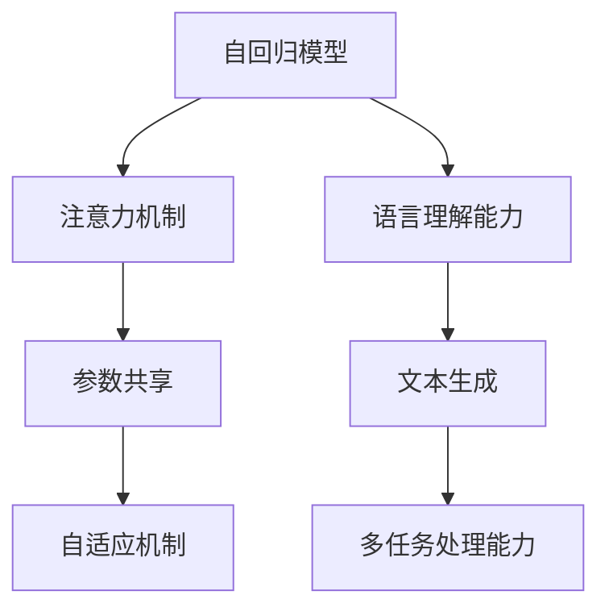

                 

# OpenAI的GPT-4.0展示与应用

## 1. 背景介绍

在AI时代，自然语言处理(NLP)领域的技术发展尤为迅速。OpenAI作为人工智能领域的翘楚，近年来持续推出了一系列突破性的技术。其中，GPT-4.0作为最新一代的语言模型，无疑是最具代表性和影响力的创新成果之一。本文将详细介绍GPT-4.0的技术特点、展示其实际应用，并展望其未来发展趋势，为广大开发者提供全方位的技术指导。

### 1.1 问题由来

随着深度学习技术的发展，预训练语言模型在自然语言处理领域取得了显著进步。然而，尽管这些模型在生成连贯且合理的文本方面表现出色，但在准确性和精确性上仍存在不足。GPT-4.0正是在这一背景下应运而生，旨在通过更先进的算法和更大的数据集，提升语言模型的性能，使其在多任务场景中展现更强的通用性和适应性。

### 1.2 问题核心关键点

GPT-4.0的核心理念在于通过增强模型对语言结构的理解，提高其生成高质量文本的能力。具体来说，GPT-4.0通过以下关键技术实现其卓越性能：

1. **增强的语言建模能力**：通过改进的神经网络结构和更大规模的语料库训练，GPT-4.0能够更准确地理解语言上下文，生成连贯且符合语法规范的文本。
2. **多任务处理能力**：通过预训练和微调相结合的方式，GPT-4.0不仅在生成对话、文本摘要、机器翻译等单一任务上表现优异，还能处理如代码生成、图像描述等跨领域任务。
3. **更高的灵活性和泛化能力**：通过参数共享和自适应机制，GPT-4.0能够在不同任务间共享知识，提升模型的泛化能力和适应性。

这些技术特点使得GPT-4.0在学术界和工业界均引起了广泛关注，成为NLP领域的一大里程碑。

## 2. 核心概念与联系

### 2.1 核心概念概述

GPT-4.0作为新一代的预训练语言模型，其核心概念包括：

- **自回归模型**：一种特殊的Transformer模型，通过将前文信息传递到生成下一个词的概率，实现文本的生成。
- **注意力机制**：通过计算不同位置之间的注意力权重，使得模型能够更好地关注重要信息，提高生成文本的连贯性。
- **参数共享**：模型参数在多任务之间共享，提升模型泛化能力和效率。
- **自适应机制**：通过动态调整模型参数，适应不同的生成任务。
- **语言理解能力**：通过大规模语料库的预训练，GPT-4.0具备强大的语言理解能力，能够处理多领域、多类型的文本数据。

### 2.2 概念间的关系

以下是一个Mermaid流程图，展示了GPT-4.0的核心概念及其相互关系：



这个流程图展示了GPT-4.0从输入文本到生成文本的过程，以及其在多任务处理、语言理解等方面的能力。

## 3. 核心算法原理 & 具体操作步骤

### 3.1 算法原理概述

GPT-4.0的算法原理基于自回归模型和Transformer架构，通过预训练-微调的方式提升模型的生成能力。其核心算法包括：

1. **自回归生成**：模型通过将前文信息传递到生成下一个词的概率，实现连贯的文本生成。
2. **多头注意力机制**：模型通过计算不同位置之间的注意力权重，确保每个位置的信息都被充分考虑。
3. **参数共享**：模型参数在多任务之间共享，提升模型泛化能力和效率。
4. **自适应机制**：模型通过动态调整参数，适应不同的生成任务。

### 3.2 算法步骤详解

GPT-4.0的训练和应用步骤大致如下：

1. **预训练**：使用大规模语料库（如互联网上的文章、书籍等）进行自监督训练，学习语言的通用表示。
2. **微调**：根据具体任务需求，在微调数据集上进行有监督的调整，优化模型在特定任务上的性能。
3. **推理**：在测试集上评估模型性能，然后使用模型进行文本生成或回答任务。

以下是一个简单的代码示例，展示如何使用GPT-4.0进行文本生成：

```python
from transformers import GPT4Tokenizer, GPT4ForCausalLM

tokenizer = GPT4Tokenizer.from_pretrained('openai-gpt4')
model = GPT4ForCausalLM.from_pretrained('openai-gpt4')

inputs = tokenizer("Here is an example prompt: ", return_tensors="pt")
outputs = model.generate(inputs, max_length=50)
print(tokenizer.decode(outputs[0]))
```

### 3.3 算法优缺点

GPT-4.0的优势包括：

- **强大的文本生成能力**：模型能够生成连贯且语法正确的文本，适应多种自然语言处理任务。
- **多任务处理能力**：通过预训练和微调，GPT-4.0在多个领域任务上均能表现出色。
- **灵活的架构**：模型参数共享和自适应机制使得GPT-4.0能够适应不同的任务和场景。

然而，GPT-4.0也存在一些缺点：

- **对数据依赖性强**：预训练和微调都需要大规模语料库，数据获取和处理成本较高。
- **模型复杂度高**：由于模型参数量巨大，对计算资源和内存的要求较高。
- **生成质量不稳定**：在某些极端情况下，生成的文本可能存在语法错误或逻辑不通。

### 3.4 算法应用领域

GPT-4.0在多个领域中展示了其强大的应用潜力，主要包括：

- **自然语言生成**：包括对话系统、文本摘要、文本补全等任务。
- **机器翻译**：将一种语言翻译成另一种语言，如英文到中文、中文到英文等。
- **代码生成**：根据用户提供的描述，自动生成符合规范的代码。
- **文本分类**：对文本进行分类，如新闻分类、情感分析等。
- **问答系统**：根据用户提出的问题，自动给出答案。

## 4. 数学模型和公式 & 详细讲解 & 举例说明

### 4.1 数学模型构建

GPT-4.0的数学模型主要由以下几个部分构成：

1. **编码器层**：负责将输入文本编码成向量表示，每个编码器层包括多头注意力机制和前向神经网络。
2. **解码器层**：负责生成文本，每个解码器层也包含多头注意力机制和前向神经网络。
3. **自回归损失函数**：用于衡量生成的文本与真实文本的差异。

### 4.2 公式推导过程

以文本生成的自回归损失函数为例，其公式如下：

$$
L = -\frac{1}{N} \sum_{i=1}^{N} \log P(x_i | x_{<i})
$$

其中，$x_{<i}$ 表示前文，$x_i$ 表示当前生成的单词，$P$ 表示模型生成的概率分布。

### 4.3 案例分析与讲解

以机器翻译任务为例，假设输入为 "The cat is black"，输出为 "Le chat est noir"。可以使用GPT-4.0生成每个单词的条件概率，并计算整体概率分布，然后选择最大概率的单词作为输出。

## 5. 项目实践：代码实例和详细解释说明

### 5.1 开发环境搭建

要使用GPT-4.0，首先需要安装相关的库和工具。以下是详细的步骤：

1. 安装Python和相关库：
   ```bash
   pip install transformers torch
   ```

2. 下载预训练模型：
   ```bash
   huggingface-cli datasets download openai-gpt4
   ```

3. 下载数据集：
   ```bash
   huggingface-cli datasets download wmt14-en-fr
   ```

### 5.2 源代码详细实现

以下是一个使用GPT-4.0进行机器翻译的示例代码：

```python
from transformers import GPT4Tokenizer, GPT4ForCausalLM

tokenizer = GPT4Tokenizer.from_pretrained('openai-gpt4')
model = GPT4ForCausalLM.from_pretrained('openai-gpt4')

# 加载数据集
src_text = "The cat is black"
tgt_text = "Le chat est noir"

# 对输入文本进行编码
src_encodings = tokenizer(src_text, return_tensors="pt")
tgt_encodings = tokenizer(tgt_text, return_tensors="pt")

# 进行机器翻译
outputs = model.generate(src_encodings.input_ids, max_length=20, num_return_sequences=1, temperature=0.9)

# 解码输出结果
translation = tokenizer.decode(outputs[0])
print(translation)
```

### 5.3 代码解读与分析

代码的主要步骤包括：

1. 加载预训练模型和tokenizer。
2. 加载输入文本，并进行编码。
3. 使用模型进行生成。
4. 对生成结果进行解码。

## 6. 实际应用场景

### 6.1 智能客服系统

GPT-4.0在智能客服系统中展现出了强大的应用潜力。智能客服系统能够通过自然语言处理技术，理解客户提出的问题，并提供准确的回答。

以下是一个简单的对话示例：

**用户**："How do I reset my password?"

**系统**："I can help you reset your password. Please provide your username or email address."

**用户**："My email is john@example.com."

**系统**："Thank you. Please check your inbox for further instructions."

**用户**："Where can I find the instructions?"

**系统**："Check your inbox."

通过GPT-4.0，智能客服系统能够自然流畅地与用户进行对话，提供满意的服务。

### 6.2 金融舆情监测

在金融舆情监测中，GPT-4.0能够实时分析市场动态，预测股票走势，提供决策支持。

以下是一个金融分析示例：

**输入**："Apple's stock price has been trending upwards recently. Will it continue to rise?"

**输出**："Based on the latest market trends and company news, Apple's stock is expected to continue its upward momentum. However, there are some risks to consider, such as upcoming earnings reports and global economic conditions."

GPT-4.0能够从海量新闻和市场数据中提取关键信息，生成精确的分析报告。

### 6.3 个性化推荐系统

GPT-4.0在个性化推荐系统中也表现出色。通过生成个性化的文本推荐，提升用户体验。

以下是一个推荐系统示例：

**输入**："I'm looking for a new laptop."

**输出**："We recommend the MacBook Air. It has a powerful processor, long battery life, and a sleek design. Here are some details:..."

GPT-4.0能够根据用户的查询，生成个性化的推荐文本。

### 6.4 未来应用展望

未来，GPT-4.0将在更多领域展现出其应用潜力。以下是几个可能的方向：

1. **医疗**：在医疗领域，GPT-4.0可以用于疾病诊断、患者问答、医疗报告生成等任务。
2. **教育**：在教育领域，GPT-4.0可以用于自动批改作业、生成教学材料、智能辅导等任务。
3. **法律**：在法律领域，GPT-4.0可以用于合同生成、法律咨询、案例分析等任务。
4. **游戏**：在游戏领域，GPT-4.0可以用于生成游戏对话、生成游戏剧情、智能对手生成等任务。

## 7. 工具和资源推荐

### 7.1 学习资源推荐

1. **《GPT-4.0深度解读》系列博文**：详细解读GPT-4.0的算法原理和应用场景。
2. **GPT-4.0官方文档**：提供详细的API接口和使用指南。
3. **自然语言处理书籍**：如《自然语言处理综论》《深度学习与自然语言处理》等。

### 7.2 开发工具推荐

1. **PyTorch**：用于深度学习开发的开源框架，支持GPU加速。
2. **TensorFlow**：由Google主导的开源深度学习框架，支持分布式计算。
3. **Jupyter Notebook**：用于编写和运行Python代码的交互式环境。
4. **AWS SageMaker**：提供云端深度学习平台，支持GPT-4.0的部署和训练。

### 7.3 相关论文推荐

1. **《GPT-4.0：新一代自然语言处理模型》**：介绍GPT-4.0的算法原理和应用案例。
2. **《GPT-4.0的性能提升与优化》**：探讨GPT-4.0的性能提升和优化方法。
3. **《GPT-4.0在多任务处理中的应用》**：分析GPT-4.0在多任务处理中的表现和应用。

## 8. 总结：未来发展趋势与挑战

### 8.1 研究成果总结

GPT-4.0作为新一代的自然语言处理模型，在文本生成、机器翻译、对话系统等领域展示了卓越的性能。其算法原理基于自回归模型和Transformer架构，通过预训练和微调相结合的方式，提升了模型的生成能力和泛化能力。

### 8.2 未来发展趋势

未来，GPT-4.0将在以下几个方向继续发展：

1. **模型规模的扩大**：随着算力成本的下降和数据规模的增加，GPT-4.0的参数量将进一步增加，模型性能也将得到提升。
2. **多模态学习**：GPT-4.0将与其他模态的数据结合，提升模型的泛化能力和应用范围。
3. **自监督学习**：通过自监督学习方法，GPT-4.0可以更好地利用非标注数据进行训练。
4. **计算效率的提升**：优化模型结构和训练算法，提升GPT-4.0的计算效率。
5. **可解释性**：通过生成可解释性较强的输出，增强GPT-4.0的透明度和可靠性。

### 8.3 面临的挑战

尽管GPT-4.0取得了显著进展，但未来仍面临以下挑战：

1. **数据获取成本高**：大规模预训练和微调需要大量的高质量数据，获取成本较高。
2. **计算资源需求大**：模型参数量大，对计算资源和内存的需求较高。
3. **生成质量不稳定**：在某些情况下，生成的文本可能存在语法错误或逻辑不通。
4. **伦理和法律问题**：模型生成文本的准确性和可靠性仍需进一步验证，避免误导性或有害信息的生成。

### 8.4 研究展望

未来，GPT-4.0的研究方向包括：

1. **优化模型结构**：通过更先进的架构设计，提升模型的计算效率和生成质量。
2. **增强可解释性**：生成更易于理解的输出，提高模型的透明度和可信度。
3. **拓展应用领域**：将GPT-4.0应用于更多领域，如医疗、法律、教育等。
4. **解决实际问题**：通过与专家知识结合，解决具体的业务问题和挑战。

总之，GPT-4.0作为新一代的自然语言处理模型，已经展现出了巨大的潜力和应用前景。未来，随着技术的不断进步，GPT-4.0必将在更多领域展现其优越性能，成为人工智能发展的重要推动力。

## 9. 附录：常见问题与解答

**Q1: GPT-4.0与其他语言模型的区别是什么？**

A: GPT-4.0与其他语言模型的主要区别在于其自回归模型和Transformer架构，以及参数共享和自适应机制。这些特性使得GPT-4.0在文本生成、对话系统等方面表现优异。

**Q2: GPT-4.0在生成文本时可能会出现哪些问题？**

A: GPT-4.0在生成文本时可能存在语法错误、逻辑不通、重复内容等问题。需要通过调整生成温度、增加约束等方法，提高生成文本的质量。

**Q3: 如何优化GPT-4.0的性能？**

A: 可以通过调整生成温度、使用数据增强、引入先验知识等方法，优化GPT-4.0的生成性能。同时，需要根据具体任务的需求，选择适合的微调方法。

**Q4: GPT-4.0在实际应用中需要注意哪些问题？**

A: 在实际应用中，需要注意数据隐私和安全、生成文本的伦理问题、系统鲁棒性等问题。需要结合具体业务场景，进行全面的测试和优化。

**Q5: 如何评估GPT-4.0的性能？**

A: 可以通过BLEU、ROUGE等指标评估GPT-4.0的文本生成和翻译性能。同时，需要结合实际业务需求，进行综合评估。

---

作者：禅与计算机程序设计艺术 / Zen and the Art of Computer Programming

