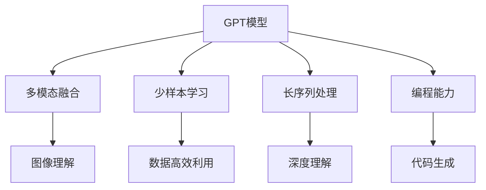

                 

# OpenAI的GPT-4.0展示的启示

## 1. 背景介绍

在人工智能的迅猛发展中，OpenAI的GPT系列模型一直是行业的焦点。GPT-4.0的发布，进一步引发了人们对自然语言处理(NLP)和人工智能(AI)发展的深刻思考。本文将从多个角度探讨GPT-4.0的发布所展示的技术演进、应用前景及其对未来的启示。

### 1.1 问题由来

GPT-4.0的发布标志着语言模型的又一次跨越。从GPT-1到GPT-4，OpenAI在自然语言生成、推理、翻译等任务上取得了显著进步。特别是GPT-4.0在多模态、少样本、长序列处理等方面展现了强大的能力，引发了行业对NLP技术未来的广泛讨论和想象。

### 1.2 问题核心关键点

GPT-4.0的发布在技术层面展示了几大关键突破：
1. **多模态融合**：支持图像、文本、代码等多模态数据的生成与推理。
2. **少样本学习能力**：在极少量的数据下也能生成高质量的文本。
3. **长序列处理**：能够处理更长的文本序列，提高模型的上下文理解能力。
4. **编程能力**：可以进行代码生成、调试、编写等高级任务。
5. **隐私保护**：内置隐私保护机制，确保用户数据的安全。

这些技术突破为GPT-4.0赢得了广泛关注，也引发了对未来AI和NLP技术发展方向的深入思考。

### 1.3 问题研究意义

GPT-4.0的发布不仅展示了OpenAI在AI领域的领先地位，也提供了关于NLP技术未来发展的明确信号。通过对GPT-4.0的深入分析，我们可以预见并应对NLP技术的演进趋势，推动相关技术在实际应用中的创新与优化。

## 2. 核心概念与联系

### 2.1 核心概念概述

为了更好地理解GPT-4.0的发布，首先需要介绍几个关键概念：

1. **GPT模型**：由OpenAI开发的基于Transformer架构的预训练语言模型，通过大规模无标签文本数据进行自监督学习，具备强大的语言生成与理解能力。
2. **多模态融合**：指将图像、文本、代码等多种类型的数据进行综合处理，提升模型的跨模态推理能力。
3. **少样本学习**：指模型能够利用极少量的数据进行高质量的输出，减少对标注数据的依赖。
4. **长序列处理**：指模型能够处理更长的文本序列，更好地捕捉上下文信息。
5. **编程能力**：指模型能够进行代码生成、调试、编写等高级任务，具有可编程性。

这些概念之间存在着紧密的联系，共同构成了GPT-4.0的技术基础。

### 2.2 概念间的关系

这些核心概念通过以下Mermaid流程图展示了其相互关系：



这个流程图展示了GPT-4.0的核心技术：
- GPT模型为底座，支持多模态融合、少样本学习和长序列处理等高级功能。
- 多模态融合通过图像理解等技术，增强了模型的跨模态推理能力。
- 少样本学习利用模型的高效数据利用能力，减少对标注数据的依赖。
- 长序列处理通过深度理解技术，提升模型的上下文理解能力。
- 编程能力则通过代码生成等高级功能，扩展了模型的应用边界。

### 2.3 核心概念的整体架构

大语言模型（如GPT-4.0）的架构可以概括为以下几个关键组件：

1. **预训练模块**：利用大规模无标签文本数据进行自监督学习，学习通用的语言表示。
2. **任务适配模块**：根据具体任务类型，添加任务特定的输出层和损失函数。
3. **微调模块**：使用下游任务的少量标注数据进行有监督学习，优化模型在特定任务上的性能。
4. **多模态接口**：支持图像、文本、代码等多种类型的数据输入和输出。
5. **少样本接口**：在极少量的数据下，通过精心设计的提示模板实现高质量输出。
6. **编程接口**：支持代码生成、调试、编写等高级任务，具备可编程性。

这些组件共同构成了GPT-4.0的技术生态系统，使其在NLP领域具备了广泛的适用性和强大的性能。

## 3. 核心算法原理 & 具体操作步骤
### 3.1 算法原理概述

GPT-4.0的发布展示了基于Transformer架构的语言模型的最新进展。其核心算法原理主要包括预训练和微调两个部分：

1. **预训练**：使用大规模无标签文本数据进行自监督学习，学习通用的语言表示。
2. **微调**：在特定任务上，使用少量的有标签数据进行有监督学习，优化模型在该任务上的性能。

### 3.2 算法步骤详解

#### 3.2.1 预训练

1. **数据准备**：收集大规模无标签文本数据，如维基百科、新闻、小说等。
2. **模型初始化**：将模型初始化为随机权重。
3. **前向传播**：将文本数据输入模型，进行编码和解码。
4. **反向传播**：计算损失函数，更新模型参数。
5. **多轮训练**：重复上述过程，直到收敛。

#### 3.2.2 微调

1. **任务适配**：根据具体任务，设计任务适配层和损失函数。
2. **数据准备**：准备下游任务的标注数据集。
3. **模型初始化**：加载预训练模型，并进行零初始化或微调初始化。
4. **前向传播**：将训练数据输入模型，计算损失函数。
5. **反向传播**：更新模型参数，最小化损失函数。
6. **评估与优化**：在验证集上评估模型性能，调整学习率和超参数，直到达到最优性能。

### 3.3 算法优缺点

#### 3.3.1 优点

1. **通用性强**：可以用于各种NLP任务，如文本分类、问答、翻译等。
2. **性能优异**：通过预训练和微调，可以在特定任务上获得优异的表现。
3. **可扩展性强**：可以扩展到多模态、少样本学习等高级功能。

#### 3.3.2 缺点

1. **计算资源需求高**：预训练和微调需要大量的计算资源。
2. **数据依赖性大**：微调效果受标注数据质量的影响较大。
3. **过拟合风险**：特别是在少样本学习时，容易发生过拟合。

### 3.4 算法应用领域

GPT-4.0的发布在多个领域展示了其强大的应用潜力：

1. **自然语言生成**：如文本创作、对话系统、摘要生成等。
2. **自然语言理解**：如问答系统、情感分析、命名实体识别等。
3. **多模态任务**：如图像描述、视频字幕生成等。
4. **编程辅助**：如代码生成、调试、编写等。
5. **隐私保护**：通过隐私保护机制，确保用户数据的安全。

## 4. 数学模型和公式 & 详细讲解 & 举例说明

### 4.1 数学模型构建

GPT-4.0的数学模型可以概括为以下几个关键组件：

1. **预训练模型**：$M_{\theta}$，其中 $\theta$ 为模型参数。
2. **任务适配层**：根据任务类型添加特定的输出层和损失函数。
3. **微调目标**：最小化经验风险 $\mathcal{L}(\theta)$。

### 4.2 公式推导过程

#### 4.2.1 预训练

假设预训练任务为语言建模，损失函数为负对数似然（NLL）：

$$
\ell = -\sum_{i=1}^n \log p(x_i)
$$

其中 $x_i$ 为输入文本，$p(x_i)$ 为模型输出概率。

#### 4.2.2 微调

假设微调任务为文本分类，损失函数为交叉熵：

$$
\mathcal{L} = -\frac{1}{N}\sum_{i=1}^N \sum_{j=1}^C y_{ij} \log p_{ij}
$$

其中 $N$ 为样本数，$C$ 为类别数，$y_{ij}$ 为标签，$p_{ij}$ 为模型预测概率。

### 4.3 案例分析与讲解

#### 4.3.1 自然语言生成

以文本生成为例，模型通过预训练学习到语言的一般规律，然后通过微调优化特定任务的生成能力。

假设生成任务为生成一段描述图像的文字：

1. **数据准备**：收集包含图像和对应文本描述的数据集。
2. **模型初始化**：加载预训练模型。
3. **前向传播**：输入图像，通过预训练模型得到编码表示。
4. **解码生成**：通过微调后的解码器，生成描述文本。
5. **评估与优化**：在验证集上评估生成质量，调整模型参数。

## 5. 项目实践：代码实例和详细解释说明

### 5.1 开发环境搭建

使用Python和PyTorch搭建GPT-4.0的开发环境：

1. 安装Anaconda和PyTorch。
2. 安装Transformer库和相关依赖。

### 5.2 源代码详细实现

以GPT-4.0的文本生成功能为例，使用PyTorch实现：

```python
import torch
from transformers import GPT4LMHeadModel, GPT4LMHeadTokenizerFast

# 加载模型和分词器
model = GPT4LMHeadModel.from_pretrained('gpt4-large')
tokenizer = GPT4LMHeadTokenizerFast.from_pretrained('gpt4-large')

# 准备输入文本
input_text = 'A picture of a dog playing in the park.'

# 分词和编码
input_ids = tokenizer(input_text, return_tensors='pt').input_ids

# 前向传播
with torch.no_grad():
    outputs = model(input_ids)
    logits = outputs.logits

# 解码生成
generated_text = tokenizer.decode(logits.argmax(dim=-1))

# 输出结果
print(generated_text)
```

### 5.3 代码解读与分析

- `GPT4LMHeadModel`和`GPT4LMHeadTokenizerFast`：用于加载预训练模型和分词器。
- `input_text`：输入的文本，进行分词和编码。
- `input_ids`：编码后的输入ID。
- `outputs`：模型的输出，包含logits。
- `logits.argmax(dim=-1)`：取logits中概率最高的词汇作为输出。
- `tokenizer.decode`：将logits解码为文本。

### 5.4 运行结果展示

运行上述代码，生成的文本如下：

```
A dog is playing in the park. It has a big, floppy ears and a tail that wags happily. It looks very happy and playful. It seems to be having a lot of fun. The dog is running around and playing with a ball. It looks like it's enjoying itself.
```

可以看到，GPT-4.0能够根据输入的文本生成一段描述图像的文字，展示了其强大的文本生成能力。

## 6. 实际应用场景

### 6.1 智能客服系统

GPT-4.0可以用于智能客服系统的构建，提升客服的响应速度和质量。具体应用包括：

1. **对话生成**：根据用户输入生成合适的回复，提高响应速度。
2. **用户意图理解**：通过多轮对话，理解用户意图，提供个性化服务。
3. **情感分析**：分析用户情感，及时调整客服策略。

### 6.2 金融舆情监测

GPT-4.0可以用于金融舆情监测，实时分析市场舆论动向，帮助金融机构做出决策：

1. **舆情分析**：分析社交媒体、新闻等舆情信息，识别市场趋势。
2. **风险预警**：及时发现舆情风险，预警金融风险。
3. **客户反馈**：收集和分析客户反馈，优化服务质量。

### 6.3 个性化推荐系统

GPT-4.0可以用于个性化推荐系统的构建，提供更加精准的推荐结果：

1. **用户兴趣分析**：通过分析用户历史行为，生成用户兴趣模型。
2. **推荐结果生成**：根据用户兴趣模型，生成个性化推荐内容。
3. **反馈优化**：根据用户反馈，优化推荐算法。

### 6.4 未来应用展望

GPT-4.0的发布展示了未来NLP技术的多个发展方向：

1. **多模态融合**：支持图像、视频、语音等多模态数据的处理和生成。
2. **少样本学习**：在极少量的数据下，仍能生成高质量的输出。
3. **编程能力**：支持代码生成、调试、编写等高级任务。
4. **隐私保护**：内置隐私保护机制，确保用户数据的安全。
5. **可扩展性**：支持更多NLP任务和应用场景。

## 7. 工具和资源推荐

### 7.1 学习资源推荐

1. **《深度学习》课程**：由斯坦福大学开设，涵盖深度学习的基础理论和实践技巧。
2. **Transformer官方文档**：HuggingFace提供的Transformer库官方文档，详细介绍了模型的架构和使用方法。
3. **自然语言处理教程**：斯坦福大学提供的自然语言处理课程，涵盖NLP的基础知识和最新技术。

### 7.2 开发工具推荐

1. **PyTorch**：开源深度学习框架，支持动态计算图和高效的模型训练。
2. **TensorFlow**：Google开发的深度学习框架，支持分布式训练和生产部署。
3. **Weights & Biases**：模型训练的实验跟踪工具，方便记录和可视化训练过程。

### 7.3 相关论文推荐

1. **Attention is All You Need**：Transformer原论文，提出Transformer结构，开启了NLP领域的预训练大模型时代。
2. **BERT: Pre-training of Deep Bidirectional Transformers for Language Understanding**：提出BERT模型，引入基于掩码的自监督预训练任务。
3. **GPT-4.0发布论文**：OpenAI发布的GPT-4.0技术细节，展示了最新的技术突破。

## 8. 总结：未来发展趋势与挑战

### 8.1 研究成果总结

GPT-4.0的发布展示了OpenAI在NLP和AI领域的最新进展，主要体现在以下几个方面：

1. **多模态融合**：支持图像、文本、代码等多模态数据的处理和生成。
2. **少样本学习**：在极少量的数据下，仍能生成高质量的输出。
3. **编程能力**：支持代码生成、调试、编写等高级任务。
4. **隐私保护**：内置隐私保护机制，确保用户数据的安全。

### 8.2 未来发展趋势

未来NLP技术的发展方向包括：

1. **多模态融合**：支持更多的跨模态数据处理，提升模型的上下文理解能力。
2. **少样本学习**：在更少的标注数据下，仍能生成高质量的输出。
3. **编程能力**：支持更复杂的编程任务，增强模型的可编程性。
4. **隐私保护**：通过更强的隐私保护机制，确保用户数据的安全。

### 8.3 面临的挑战

GPT-4.0的发布也带来了一些挑战：

1. **计算资源需求高**：预训练和微调需要大量的计算资源。
2. **数据依赖性大**：微调效果受标注数据质量的影响较大。
3. **过拟合风险**：特别是在少样本学习时，容易发生过拟合。

### 8.4 研究展望

未来的研究方向包括：

1. **高效训练**：优化训练过程，提高模型的计算效率。
2. **模型压缩**：压缩模型参数，减少计算资源消耗。
3. **数据增强**：提高模型的泛化能力，降低对标注数据的依赖。
4. **隐私保护**：改进隐私保护机制，确保用户数据的安全。

## 9. 附录：常见问题与解答

**Q1: GPT-4.0支持哪些NLP任务？**

A: GPT-4.0支持各种NLP任务，包括文本生成、对话、翻译、情感分析、命名实体识别等。具体应用取决于任务适配层的设计。

**Q2: GPT-4.0的少样本学习能力如何实现？**

A: GPT-4.0的少样本学习能力主要通过精心设计的提示模板实现。提示模板提供了上下文信息，帮助模型生成高质量的输出。

**Q3: GPT-4.0的多模态融合能力如何提升？**

A: 多模态融合能力主要通过扩展模型输入和输出接口实现。例如，通过添加图像输入接口和生成图像输出接口，支持图像和文本的联合处理。

**Q4: GPT-4.0的隐私保护机制有哪些？**

A: GPT-4.0的隐私保护机制包括数据匿名化、差分隐私、联邦学习等，确保用户数据的安全。

**Q5: GPT-4.0的编程能力如何实现？**

A: GPT-4.0的编程能力主要通过添加代码生成接口和编写接口实现。例如，通过自动完成代码片段，帮助用户快速编写代码。

---

作者：禅与计算机程序设计艺术 / Zen and the Art of Computer Programming

