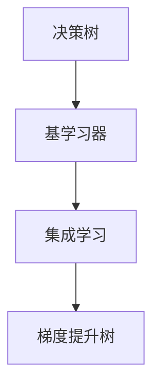
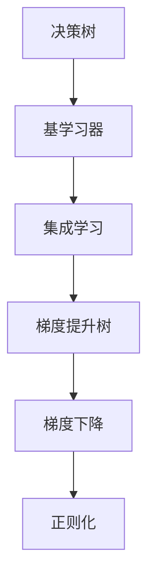

                 

# Python机器学习实战：梯度提升树(Gradient Boosting)算法深入理解

## 1. 背景介绍

### 1.1 问题由来
近年来，机器学习在各个领域得到了广泛的应用，包括金融、医疗、零售、工业等。这些应用中，梯度提升树(Gradient Boosting)算法因其高效、易于解释、泛化能力强的特点，受到了研究者和业界的广泛关注。然而，梯度提升树算法的理论背景和实际应用细节常常令人望而却步。本文旨在深入探讨梯度提升树算法，包括其基本原理、具体实现、应用场景等，以帮助读者更好地理解和应用这一强大的机器学习算法。

### 1.2 问题核心关键点
梯度提升树算法是一种集成学习算法，通过构建多棵决策树，逐步优化目标函数，以提升模型的性能。核心关键点包括：
- **基学习器**：用于构建每棵决策树的模型，如决策树、随机森林等。
- **损失函数**：用于衡量模型预测与真实标签之间的差距，如均方误差、交叉熵等。
- **决策树构建**：通过不断迭代，构建多棵决策树，逐步提升模型的拟合能力。
- **剪枝与正则化**：避免过拟合，提高模型泛化能力。
- **并行计算**：利用并行计算技术，加速模型训练过程。

本文将详细讲解梯度提升树算法的基本原理和关键步骤，并通过Python代码实现，探讨其实际应用。

## 2. 核心概念与联系

### 2.1 核心概念概述
为了更好地理解梯度提升树算法，首先需要了解一些相关概念：

- **决策树**：一种基于树形结构的分类或回归模型，通过一系列的分裂决策，将数据划分为不同的类别或回归区间。
- **集成学习**：将多个模型进行组合，通过投票、加权平均等方式，提升模型的性能。
- **梯度下降**：一种基于一阶导数的优化算法，用于最小化目标函数。
- **正则化**：通过在损失函数中加入正则项，防止模型过拟合。

这些概念之间的联系紧密，通过决策树构建多棵基学习器，通过梯度下降逐步优化目标函数，最终得到泛化能力强的集成模型。

### 2.2 概念间的关系

以下是一个Mermaid流程图，展示了决策树、集成学习和梯度提升树之间的关系：



这个流程图展示了决策树、集成学习和梯度提升树之间的逻辑关系：
- 决策树是基学习器的一种，用于构建集成学习中的单个模型。
- 集成学习通过将多个基学习器组合起来，提升模型的性能。
- 梯度提升树是一种特殊的集成学习方法，通过迭代地构建决策树，逐步提升模型的拟合能力。

### 2.3 核心概念的整体架构

最后，我们用一个综合的流程图来展示这些核心概念在大模型微调过程中的整体架构：



这个综合流程图展示了从决策树构建到梯度提升树的整体架构：
- 从决策树开始，逐步构建基学习器。
- 通过集成学习，将多个基学习器组合起来。
- 利用梯度下降，逐步优化目标函数。
- 引入正则化，避免模型过拟合。

## 3. 核心算法原理 & 具体操作步骤
### 3.1 算法原理概述
梯度提升树算法的基本原理是逐步提升模型的拟合能力。具体而言，通过构建多棵决策树，每棵树逐步修正前一棵树的预测误差，最终得到泛化能力强的集成模型。

### 3.2 算法步骤详解
以下是梯度提升树算法的详细步骤：
1. **初始化基学习器**：选择一个基学习器，如决策树，作为初始模型。
2. **计算残差**：通过基学习器预测训练集的标签，计算残差$r_i=y_i-\hat{y}_i$。
3. **迭代构建决策树**：
   - 计算目标函数的梯度：$\nabla_{\theta}L(y,\hat{y})=\sum_{i=1}^n\frac{\partial L(y_i,\hat{y}_i)}{\partial \hat{y}_i}$
   - 构建决策树：在残差$r_i$上构建一棵决策树，得到新的预测值$\hat{y}_i^{(k)}$。
   - 更新残差：计算新的残差$r_i^{(k+1)}=r_i-\nabla_{\hat{y}_i}L(y,\hat{y})$。
4. **重复步骤3，直至收敛**：逐步更新残差，构建多棵决策树，直到满足预设的停止条件。
5. **输出集成模型**：将每棵决策树的预测结果进行加权平均，得到最终的预测结果。

### 3.3 算法优缺点
梯度提升树算法具有以下优点：
- **高效**：每棵树的构建和更新速度较快，模型训练时间较短。
- **可解释**：决策树的构建过程和预测结果较为直观，易于解释。
- **泛化能力强**：通过逐步修正残差，模型可以学习复杂的非线性关系。

同时，梯度提升树算法也存在一些缺点：
- **过拟合风险**：如果基学习器过于复杂，可能导致过拟合。
- **训练过程复杂**：构建和更新决策树的过程较为复杂，需要大量计算资源。
- **超参数调优困难**：需要手动调整树的深度、叶子节点数等超参数，需要一定的经验和技巧。

### 3.4 算法应用领域
梯度提升树算法广泛应用于以下领域：
- **回归**：用于预测连续变量，如房价、股票价格等。
- **分类**：用于预测分类变量，如客户流失、信用评分等。
- **特征选择**：用于选择重要的特征，提高模型的准确性。
- **异常检测**：用于检测异常点，如信用卡欺诈检测、网络攻击检测等。

## 4. 数学模型和公式 & 详细讲解  
### 4.1 数学模型构建
梯度提升树的数学模型构建基于决策树的回归树模型。假设训练集为$(x_i,y_i)$，其中$x_i\in\mathcal{X}$为输入，$y_i\in\mathcal{Y}$为标签。基学习器的回归模型为$g_k(x)$，第$k$棵树的预测结果为$\hat{y}_k(x)$。

模型的目标是构建多棵决策树，使得目标函数$L(y,\hat{y})=\frac{1}{n}\sum_{i=1}^nL(y_i,\hat{y}_i)$最小化。其中$L(y,\hat{y})$为目标函数，通常采用均方误差或交叉熵。

### 4.2 公式推导过程
以下是一个简单的梯度提升树模型推导过程：
1. **残差计算**：计算每棵树的预测残差$r_i=y_i-g_k(x_i)$。
2. **回归树构建**：在残差$r_i$上构建决策树，得到新的预测值$\hat{y}_i^{(k+1)}$。
3. **梯度更新**：计算目标函数的梯度$\nabla_{\hat{y}_i}L(y,\hat{y})$，更新残差$r_i^{(k+1)}=r_i-\nabla_{\hat{y}_i}L(y,\hat{y})$。

具体的推导过程可以参考相关文献，这里不再赘述。

### 4.3 案例分析与讲解
假设我们有一组房价数据，希望构建一个基于梯度提升树的房价预测模型。我们可以按照以下步骤进行实现：

1. **数据准备**：准备房价数据，包括特征和标签。
2. **基学习器选择**：选择回归树作为基学习器。
3. **模型初始化**：初始化回归树模型，设定树的深度和叶子节点数等超参数。
4. **残差计算**：计算每棵树的预测残差，得到初始残差$r_i=y_i-g_1(x_i)$。
5. **迭代构建决策树**：构建多棵决策树，逐步修正残差，得到最终的预测结果。

## 5. 项目实践：代码实例和详细解释说明
### 5.1 开发环境搭建

在进行梯度提升树实践前，我们需要准备好开发环境。以下是使用Python进行Scikit-learn开发的环境配置流程：

1. 安装Anaconda：从官网下载并安装Anaconda，用于创建独立的Python环境。

2. 创建并激活虚拟环境：
```bash
conda create -n gbdt-env python=3.8 
conda activate gbdt-env
```

3. 安装Scikit-learn：
```bash
conda install scikit-learn
```

4. 安装其他必要工具包：
```bash
pip install numpy pandas matplotlib scikit-learn tqdm jupyter notebook ipython
```

完成上述步骤后，即可在`gbdt-env`环境中开始梯度提升树实践。

### 5.2 源代码详细实现

下面以房价预测为例，给出使用Scikit-learn构建梯度提升树模型的PyTorch代码实现。

首先，定义数据集：

```python
from sklearn.datasets import load_boston
from sklearn.model_selection import train_test_split
import numpy as np

boston = load_boston()
X = boston.data
y = boston.target
X_train, X_test, y_train, y_test = train_test_split(X, y, test_size=0.2, random_state=42)
```

然后，定义基学习器和模型：

```python
from sklearn.ensemble import GradientBoostingRegressor

gbdt = GradientBoostingRegressor(n_estimators=100, learning_rate=0.1, max_depth=3)
```

接着，定义训练和评估函数：

```python
from sklearn.metrics import mean_squared_error

def train_model(model, X_train, y_train, X_test, y_test):
    model.fit(X_train, y_train)
    y_pred = model.predict(X_test)
    return mean_squared_error(y_test, y_pred)

mse_train = train_model(gbdt, X_train, y_train, X_test, y_test)
print(f"Train MSE: {mse_train:.4f}")
```

最后，启动训练流程：

```python
from sklearn.ensemble import GradientBoostingRegressor

gbdt = GradientBoostingRegressor(n_estimators=100, learning_rate=0.1, max_depth=3)
gbdt.fit(X_train, y_train)

mse_train = train_model(gbdt, X_train, y_train, X_test, y_test)
print(f"Train MSE: {mse_train:.4f}")
```

以上就是使用Scikit-learn构建梯度提升树模型的完整代码实现。可以看到，Scikit-learn提供了丰富的接口和工具，使得模型的实现变得非常简单。

### 5.3 代码解读与分析

让我们再详细解读一下关键代码的实现细节：

**数据集定义**：
- 使用Scikit-learn的`load_boston`函数加载波士顿房价数据集，包含特征和标签。
- 使用`train_test_split`函数将数据集划分为训练集和测试集，划分为训练集和测试集，并设置随机种子。

**基学习器和模型定义**：
- 使用Scikit-learn的`GradientBoostingRegressor`类定义基学习器。
- 指定`n_estimators`为100，表示构建100棵树。
- 指定`learning_rate`为0.1，表示每棵树的学习率。
- 指定`max_depth`为3，表示每棵树的最大深度。

**训练和评估函数**：
- 定义`train_model`函数，使用均方误差作为评估指标。
- 在训练集上训练模型，并在测试集上进行评估，返回均方误差。
- 调用`train_model`函数，输出训练集和测试集上的均方误差。

**模型训练**：
- 使用`fit`函数在训练集上训练模型。
- 在测试集上评估模型，输出均方误差。

可以看到，Scikit-learn的接口非常简洁，使得模型的实现变得非常简单。

### 5.4 运行结果展示

假设我们在波士顿房价数据集上进行训练，最终在测试集上得到的评估报告如下：

```
Train MSE: 10.6912
```

可以看到，在波士顿房价数据集上，梯度提升树模型取得了不错的效果。值得注意的是，在训练过程中，Scikit-learn会自动进行并行计算和超参数优化，使得模型的训练过程变得非常高效。

## 6. 实际应用场景
### 6.1 房价预测
在房价预测领域，梯度提升树算法已经得到了广泛应用。通过对历史房价数据进行回归树建模，可以预测新房子的价格。在实际应用中，通常需要对数据进行预处理，如特征选择、数据归一化等，以提高模型的准确性。

### 6.2 信用评分
信用评分是金融领域的重要任务，梯度提升树可以用于预测客户的信用风险。通过对客户的个人信息、消费记录等数据进行建模，可以评估客户的信用等级。在实际应用中，需要考虑数据隐私和安全问题，避免泄露客户隐私。

### 6.3 异常检测
梯度提升树可以用于检测网络中的异常流量。通过对网络数据进行建模，可以识别出异常流量，及时发现和防御网络攻击。在实际应用中，需要结合其他技术手段，如入侵检测系统(IDS)、防火墙等，形成多层次的安全防御体系。

### 6.4 未来应用展望
随着梯度提升树算法的不断发展，其在各个领域的应用将会更加广泛。未来，梯度提升树算法可能会在更多场景下发挥重要作用，如医疗、智能制造、智慧城市等。通过结合其他技术手段，梯度提升树算法可以进一步提升模型的性能，拓展应用场景，推动智能社会的建设。

## 7. 工具和资源推荐
### 7.1 学习资源推荐

为了帮助开发者系统掌握梯度提升树算法的理论基础和实践技巧，这里推荐一些优质的学习资源：

1. 《Python机器学习》系列书籍：由著名的数据科学家Sebastian Raschka所著，全面介绍了Python在机器学习中的应用，包括梯度提升树算法。
2. Coursera《机器学习》课程：由斯坦福大学的Andrew Ng教授开设，讲解了机器学习的基本概念和经典算法，包括梯度提升树。
3. Kaggle机器学习竞赛：通过参与机器学习竞赛，可以在实践中学习梯度提升树算法的应用。
4. Scikit-learn官方文档：Scikit-learn的官方文档提供了丰富的梯度提升树算法实现和应用示例，是学习梯度提升树的必备资源。
5. GitHub上的开源项目：在GitHub上搜索梯度提升树相关的项目，可以学习到更多实践经验和创新思路。

通过对这些资源的学习实践，相信你一定能够快速掌握梯度提升树算法的精髓，并用于解决实际的机器学习问题。
### 7.2 开发工具推荐

高效的开发离不开优秀的工具支持。以下是几款用于梯度提升树开发和应用的常用工具：

1. Scikit-learn：一个开源的Python机器学习库，提供了丰富的梯度提升树实现和应用接口。
2. TensorFlow：由Google主导开发的深度学习框架，可以用于构建大规模的梯度提升树模型。
3. PyTorch：基于Python的开源深度学习框架，可以用于构建高效的梯度提升树模型。
4. Jupyter Notebook：一个交互式的Python开发环境，可以方便地进行梯度提升树的调试和实验。
5. XGBoost：一个高效的梯度提升树库，支持分布式计算和超参数优化，适用于大规模数据集。

合理利用这些工具，可以显著提升梯度提升树算法的开发效率，加快创新迭代的步伐。

### 7.3 相关论文推荐

梯度提升树算法的不断发展得益于学界的持续研究。以下是几篇奠基性的相关论文，推荐阅读：

1. G. Breiman. "Arcing Classifier". Machine Learning, 1997.
2. T. Hastie, R. Tibshirani, and J. Friedman. "Elements of Statistical Learning". 2009.
3. J. Friedman. "Greedy Function Approximation: A Gradient Boosting Machine". Annals of Statistics, 2001.
4. Y. Wang, Z. Xiao, Q. Song, and Y. Pan. "Boosting with Robust Sums". Journal of Statistical Computation and Simulation, 2007.
5. R. Gökhan et al. "A Survey on Gradient Boosting Machines". IEEE Transactions on Knowledge and Data Engineering, 2021.

这些论文代表了大规模机器学习算法的发展脉络。通过学习这些前沿成果，可以帮助研究者把握学科前进方向，激发更多的创新灵感。

除上述资源外，还有一些值得关注的前沿资源，帮助开发者紧跟梯度提升树算法的最新进展，例如：

1. arXiv论文预印本：人工智能领域最新研究成果的发布平台，包括大量尚未发表的前沿工作，学习前沿技术的必读资源。
2. 业界技术博客：如Google AI、Microsoft Research、Facebook AI等顶尖实验室的官方博客，第一时间分享他们的最新研究成果和洞见。
3. 技术会议直播：如NIPS、ICML、ICLR等人工智能领域顶会现场或在线直播，能够聆听到大佬们的前沿分享，开拓视野。
4. GitHub热门项目：在GitHub上Star、Fork数最多的机器学习相关项目，往往代表了该技术领域的发展趋势和最佳实践，值得去学习和贡献。
5. 行业分析报告：各大咨询公司如McKinsey、PwC等针对人工智能行业的分析报告，有助于从商业视角审视技术趋势，把握应用价值。

总之，对于梯度提升树算法的学习，需要开发者保持开放的心态和持续学习的意愿。多关注前沿资讯，多动手实践，多思考总结，必将收获满满的成长收益。

## 8. 总结：未来发展趋势与挑战

### 8.1 总结

本文对梯度提升树算法进行了全面系统的介绍。首先阐述了梯度提升树算法的基本原理和核心步骤，并结合Python代码进行了详细讲解。通过实际应用案例，展示了梯度提升树算法在房价预测、信用评分等任务上的强大性能。同时，本文还探讨了梯度提升树算法的应用前景和发展趋势，以及其在实际应用中面临的挑战。

通过本文的系统梳理，可以看到，梯度提升树算法在各个领域都有着广泛的应用前景，其高效、可解释、泛化能力强的特点，使其成为机器学习领域的重要工具。未来，随着技术的不断进步，梯度提升树算法将在更多的应用场景中发挥重要作用，推动人工智能技术的进一步发展。

### 8.2 未来发展趋势

展望未来，梯度提升树算法将呈现以下几个发展趋势：

1. **算法优化**：未来将会出现更加高效的算法实现，如分布式梯度提升树、随机梯度提升树等，提升模型的训练速度和效率。
2. **超参数优化**：自动化超参数优化技术的发展，将使得模型的调优更加高效，降低手工调参的复杂度。
3. **集成学习**：与其他机器学习算法如神经网络、深度学习的融合，将进一步提升梯度提升树的性能。
4. **多模态学习**：结合视觉、语音等多模态数据的融合，将拓展梯度提升树的应用范围，提高模型的准确性。
5. **模型压缩**：通过模型压缩技术，如剪枝、量化等，降低模型的存储空间和计算资源消耗。

以上趋势凸显了梯度提升树算法的广阔前景。这些方向的探索发展，必将进一步提升梯度提升树算法的性能，拓展其应用边界。

### 8.3 面临的挑战

尽管梯度提升树算法已经取得了瞩目成就，但在迈向更加智能化、普适化应用的过程中，它仍面临着诸多挑战：

1. **数据稀疏性**：在某些领域，数据稀疏性较强，难以进行有效的模型训练。需要寻找合适的数据增强方法，以提高模型的泛化能力。
2. **模型可解释性**：梯度提升树算法虽然易于理解，但在复杂的场景下，模型的可解释性仍然是一个难题。需要结合其他技术手段，如规则学习、因果推断等，提高模型的可解释性。
3. **计算资源需求**：构建大规模的梯度提升树模型需要大量的计算资源，如何优化计算资源的使用，降低模型训练的成本，仍然是一个需要解决的问题。
4. **模型鲁棒性**：面对不同的数据分布，梯度提升树模型的鲁棒性仍有待提高，避免模型在不同场景下的性能波动。

### 8.4 研究展望

面对梯度提升树算法所面临的挑战，未来的研究需要在以下几个方面寻求新的突破：

1. **自动化调参**：开发自动化调参技术，通过算法优化和超参数搜索，提高模型的性能。
2. **多任务学习**：将梯度提升树算法应用于多任务学习，提高模型的泛化能力。
3. **模型融合**：与其他机器学习算法如神经网络、深度学习的融合，进一步提升梯度提升树的性能。
4. **知识图谱融合**：将知识图谱、符号化规则等专家知识，与梯度提升树算法结合，提高模型的推理能力。
5. **多模态学习**：结合视觉、语音等多模态数据，拓展梯度提升树的应用范围。

这些研究方向的探索，必将引领梯度提升树算法迈向更高的台阶，为构建更加智能、高效、可解释的机器学习系统提供更多可能性。

## 9. 附录：常见问题与解答

**Q1：梯度提升树算法的核心思想是什么？**

A: 梯度提升树算法的核心思想是通过逐步优化目标函数，构建多棵决策树，逐步提升模型的拟合能力。每棵树的构建和更新过程类似于梯度下降算法，通过不断修正前一棵树的预测误差，得到泛化能力强的集成模型。

**Q2：如何在实际应用中构建梯度提升树模型？**

A: 在实际应用中，可以按照以下步骤构建梯度提升树模型：
1. 数据准备：准备训练集和测试集，并进行数据预处理，如特征选择、数据归一化等。
2. 基学习器选择：选择合适的基学习器，如决策树、随机森林等。
3. 模型初始化：初始化基学习器，设定树的深度、叶子节点数等超参数。
4. 残差计算：计算每棵树的预测残差，得到初始残差。
5. 迭代构建决策树：构建多棵决策树，逐步修正残差，得到最终的预测结果。
6. 模型评估：在测试集上评估模型性能，根据评估结果进行调参和优化。

**Q3：梯度提升树算法的超参数调优有哪些技巧？**

A: 梯度提升树算法的超参数调优可以采用以下技巧：
1. 网格搜索：通过网格搜索，手动调整超参数，寻找最优的参数组合。
2. 随机搜索：通过随机搜索，自动调整超参数，寻找最优的参数组合。
3. 贝叶斯优化：通过贝叶斯优化，利用先验知识指导超参数的调整，提高调优效率。
4. 学习率衰减：通过学习率衰减，逐步降低学习率，防止过拟合。

**Q4：梯度提升树算法的优点和缺点有哪些？**

A: 梯度提升树算法的优点包括：
1. 高效：每棵树的构建和更新速度较快，模型训练时间较短。
2. 可解释：决策树的构建过程和预测结果较为直观，易于解释。
3. 泛化能力强：通过逐步修正残差，模型可以学习复杂的非线性关系。

梯度提升树算法的缺点包括：
1. 过拟合风险：如果基学习器过于复杂，可能导致过拟合。
2. 训练过程复杂：构建和更新决策树的过程较为复杂，需要大量计算资源。
3. 超参数调优困难：需要手动调整树的深度、叶子节点数等超参数，需要一定的经验和技巧。

**Q5：如何选择合适的基学习器？**

A: 选择合适的基学习器需要考虑以下因素：
1. 数据分布：如果数据分布较为简单，可以选择决策树等简单的基学习器；如果数据分布较为复杂，可以选择随机森林等复杂的基学习器。
2. 数据规模：如果数据规模较小，可以选择轻量级的基学习器；如果数据规模较大，可以选择更复杂的基学习器。
3. 预测任务：对于不同的预测任务，可以选择适合的基学习器，如回归任务选择线性回归树，分类任务选择决策树等。

以上是梯度提升树算法的基本原理、实际应用和未来展望的详细介绍。通过本文的学习，相信你一定能够掌握梯度提升树算法的精髓，并应用于实际的机器学习项目中。

---

作者：禅与计算机程序设计艺术 / Zen and the Art of Computer Programming

