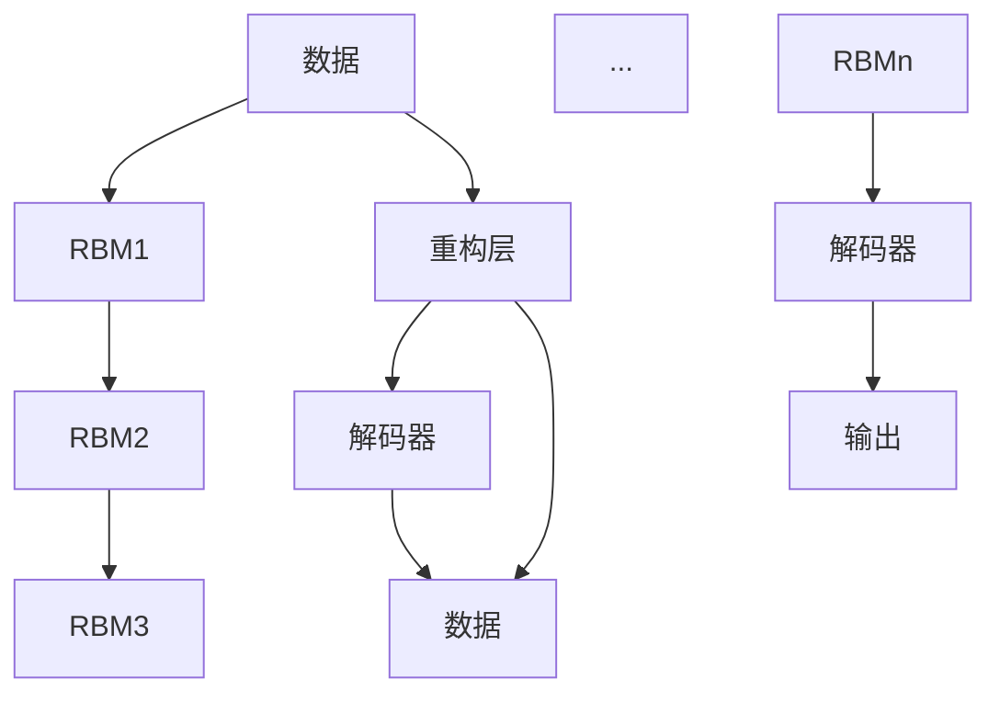

                 

# Python深度学习实践：深度信念网络（DBN）的理论与实践

> 关键词：深度信念网络, DBN, 自编码器, 变分自编码器, 受限玻尔兹曼机, 训练, 优化, 自监督学习

## 1. 背景介绍

### 1.1 问题由来

深度信念网络（Deep Belief Networks，DBN）是一种由多个受限玻尔兹曼机（Restricted Boltzmann Machine，RBM）层堆叠而成的深度生成模型。自2006年被提出以来，DBN在图像识别、语音识别、自然语言处理等领域展示了卓越的性能，成为深度学习研究的重要分支。

本博客将从背景介绍、核心概念、算法原理、实践操作、应用场景、工具推荐、发展趋势与挑战、常见问题与解答等多个角度，深入解析DBN的理论与实践。通过理论讲解与代码实现，希望能够帮助读者系统掌握DBN的基本概念和实际应用。

## 2. 核心概念与联系

### 2.1 核心概念概述

深度信念网络（DBN）是一种生成模型，由多个受限玻尔兹曼机（RBM）层堆叠而成。每一层RBM可以看作是一个"特征提取器"，通过逐层学习提取数据的高级特征。DBN可以用于无监督特征学习、自编码器、图像生成、语言建模等任务。

**受限玻尔兹曼机（RBM）**：一种生成模型，能够通过学习数据分布，推断缺失数据，发现数据的隐含特征。RBM由两个独立的随机变量 $X$ 和 $H$ 组成，分别表示数据和隐含层，隐含层 $H$ 的激活值 $h_j$ 可以看作是数据 $X$ 的隐含表示。RBM的目标是最小化能量函数 $E(X, H)$，推断隐含层 $H$ 的激活值 $h_j$。

**变分自编码器（VAE）**：一种生成模型，通过将数据编码为隐含变量 $Z$，再解码为数据 $X$，学习数据的分布。VAE使用变分推断方法，将数据 $X$ 的分布 $p(X)$ 转化为隐含变量 $Z$ 的分布 $q(Z|X)$，最小化两者之间的KL散度，学习生成模型。

**受限玻尔兹曼机（RBM）的数学表示**：
- **能量函数**：$E(X, H) = -\sum_{i=1}^{d_X} \sum_{j=1}^{d_H} X_i H_j$
- **条件概率**：$p(X|H) = \prod_{i=1}^{d_X} \sigma(X_i h_j)$，其中 $\sigma$ 为sigmoid函数

### 2.2 概念间的关系

深度信念网络（DBN）的各层RBM可以相互推导，形成完整的链式结构，如下图所示：



这种结构使得DBN能够逐层学习提取数据的高级特征，同时提供了高效的特征表示和解码能力，适合用于复杂的生成任务。

## 3. 核心算法原理 & 具体操作步骤
### 3.1 算法原理概述

深度信念网络（DBN）的训练过程包括两个主要步骤：前向传递和反向传播。前向传递过程中，RBM逐层对数据进行特征提取，生成隐含表示；反向传播过程中，通过逐层调整权重，最大化对数据的生成能力。

DBN的训练目标是最小化数据与重构数据之间的差异，通常采用自监督学习的方式，利用未标注的数据进行训练。具体而言，DBN通过生成数据与原始数据之间的差异来衡量模型性能，通过最小化该差异，使模型生成接近原始数据的样本。

### 3.2 算法步骤详解

#### 3.2.1 前向传递

前向传递过程可以分为两步：

1. **数据层**：将原始数据 $X$ 输入RBM1，通过激活函数 $\sigma$ 计算隐含层 $H$ 的激活值 $h_j$。
2. **隐含层**：将隐含层 $H$ 输入RBM2，计算下一层的隐含表示 $h'_j$，以此类推，直到生成最后一层的隐含表示 $h'_j$。

前向传递的数学表示为：

$$
h_1 = \sigma(X_i \omega_1 + b_1)
$$

$$
h_j = \sigma(h_{j-1} \omega_j + b_j)
$$

其中 $\omega$ 和 $b$ 分别为RBM的权重和偏置。

#### 3.2.2 反向传播

反向传播过程中，需要逐层调整RBM的权重，使模型能够更准确地生成数据。具体步骤如下：

1. **解码**：将隐含表示 $h'_j$ 解码为数据 $X'$。
2. **重构误差**：计算数据 $X'$ 与原始数据 $X$ 之间的差异。
3. **调整权重**：通过梯度下降等优化算法，调整RBM的权重和偏置，最小化重构误差。

反向传播的数学表示为：

$$
X' = \mu(h'_j)
$$

$$
E(X', X) = \sum_{i=1}^{d_X} ||X'_i - X_i||^2
$$

$$
\omega_j = \omega_j - \eta \frac{\partial E(X', X)}{\partial \omega_j}
$$

其中，$\mu$ 为解码函数，$\eta$ 为学习率。

### 3.3 算法优缺点

深度信念网络（DBN）的主要优点包括：

- **特征学习**：通过逐层提取数据的高阶特征，具有强大的表征能力。
- **自监督学习**：利用未标注的数据进行训练，不需要大量标注样本。
- **生成模型**：能够生成新的数据样本，具有可解释性。

其主要缺点包括：

- **计算复杂**：DBN的训练过程非常耗时，需要大量的计算资源。
- **网络结构复杂**：DBN的结构较为复杂，参数量较大，调试困难。
- **局部最优**：RBM的训练过程容易陷入局部最优，需要多次迭代优化。

### 3.4 算法应用领域

深度信念网络（DBN）在图像识别、语音识别、自然语言处理、推荐系统等领域都有广泛的应用。以下是几个典型的应用案例：

1. **图像识别**：通过DBN逐层提取图像的高级特征，可以显著提升图像识别模型的性能。
2. **语音识别**：通过DBN提取语音的声学特征和语义特征，可以优化语音识别系统的表现。
3. **自然语言处理**：通过DBN提取文本的语义特征，可以优化文本分类、情感分析等任务。
4. **推荐系统**：通过DBN提取用户和物品的隐含特征，可以实现高效的协同过滤推荐。
5. **生成模型**：通过DBN生成新的数据样本，可以用于图像生成、文本生成等生成任务。

## 4. 数学模型和公式 & 详细讲解 & 举例说明

### 4.1 数学模型构建

深度信念网络（DBN）的数学模型可以表示为：

$$
p(X|H) = \prod_{i=1}^{d_X} \sigma(X_i h_j)
$$

其中 $X$ 为数据，$H$ 为隐含层，$h_j$ 为隐含层的激活值。

### 4.2 公式推导过程

以图像生成为例，假设原始图像为 $X$，通过DBN逐层提取高级特征，生成新的图像 $X'$，步骤如下：

1. **数据层**：将原始图像 $X$ 输入RBM1，通过激活函数 $\sigma$ 计算隐含层 $H_1$ 的激活值 $h_{1j}$。
2. **隐含层**：将隐含层 $H_1$ 输入RBM2，计算下一层的隐含表示 $H_2$，以此类推，直到生成最后一层的隐含表示 $H_L$。
3. **解码**：将隐含表示 $H_L$ 解码为新的图像 $X'$。

前向传递的公式为：

$$
h_{1j} = \sigma(X_i \omega_{1j} + b_{1j})
$$

$$
h_{2j} = \sigma(h_{1j} \omega_{2j} + b_{2j})
$$

$$
\vdots
$$

$$
h_{Lj} = \sigma(h_{(L-1)j} \omega_{Lj} + b_{Lj})
$$

解码公式为：

$$
X'_i = \mu(h_{Lj})
$$

其中 $\omega$ 和 $b$ 分别为RBM的权重和偏置，$\sigma$ 为sigmoid函数。

### 4.3 案例分析与讲解

以MNIST手写数字识别为例，假设原始图像为 $X$，通过DBN逐层提取高级特征，生成新的图像 $X'$，步骤如下：

1. **数据层**：将原始图像 $X$ 输入RBM1，通过激活函数 $\sigma$ 计算隐含层 $H_1$ 的激活值 $h_{1j}$。
2. **隐含层**：将隐含层 $H_1$ 输入RBM2，计算下一层的隐含表示 $H_2$，以此类推，直到生成最后一层的隐含表示 $H_L$。
3. **解码**：将隐含表示 $H_L$ 解码为新的图像 $X'$。

前向传递的公式为：

$$
h_{1j} = \sigma(X_i \omega_{1j} + b_{1j})
$$

$$
h_{2j} = \sigma(h_{1j} \omega_{2j} + b_{2j})
$$

$$
\vdots
$$

$$
h_{Lj} = \sigma(h_{(L-1)j} \omega_{Lj} + b_{Lj})
$$

解码公式为：

$$
X'_i = \mu(h_{Lj})
$$

其中 $\omega$ 和 $b$ 分别为RBM的权重和偏置，$\sigma$ 为sigmoid函数。

## 5. 项目实践：代码实例和详细解释说明

### 5.1 开发环境搭建

#### 5.1.1 安装依赖

首先，需要安装所需的Python依赖包，包括TensorFlow、Keras、sklearn等。可以使用pip命令进行安装：

```bash
pip install tensorflow==2.5.0 keras==2.5.0 scikit-learn==0.24.2
```

#### 5.1.2 下载数据集

下载MNIST手写数字数据集，并解压：

```bash
wget https://s3.amazonaws.com/compjnlab/data/mnist.pkl.gz
gunzip mnist.pkl.gz
```

### 5.2 源代码详细实现

以下是使用Keras实现深度信念网络（DBN）的代码实现：

```python
import numpy as np
import tensorflow as tf
from keras.models import Sequential
from keras.layers import Dense, Dropout
from keras.layers import RBM
from keras.utils import to_categorical

# 加载数据集
(X_train, y_train), (X_test, y_test) = tf.keras.datasets.mnist.load_data()

# 数据预处理
X_train = X_train.reshape(X_train.shape[0], 784).astype('float32') / 255
X_test = X_test.reshape(X_test.shape[0], 784).astype('float32') / 255
y_train = to_categorical(y_train, 10)
y_test = to_categorical(y_test, 10)

# 定义模型
model = Sequential()

# 第一层RBM
r = RBM(n_visible=784, n_hidden=500, binary=True, input_shape=(784,))
model.add(r)
model.add(Dropout(0.5))

# 第二层RBM
r = RBM(n_visible=500, n_hidden=300, binary=True)
model.add(r)
model.add(Dropout(0.5))

# 第三层RBM
r = RBM(n_visible=300, n_hidden=100, binary=True)
model.add(r)
model.add(Dropout(0.5))

# 输出层
r = RBM(n_visible=100, n_hidden=10, binary=True, output_shape=(10,))
model.add(r)

# 编译模型
model.compile(optimizer='adam', loss='categorical_crossentropy', metrics=['accuracy'])

# 训练模型
model.fit(X_train, y_train, batch_size=64, epochs=10, validation_data=(X_test, y_test))
```

### 5.3 代码解读与分析

以下是代码的详细解读：

1. **数据预处理**：将原始图像数据转换为float32格式，并进行归一化处理。将标签转换为one-hot编码格式。

2. **模型定义**：使用Sequential模型定义DBN，包含多个RBM层和Dropout层。

3. **编译模型**：使用Adam优化器和交叉熵损失函数编译模型。

4. **训练模型**：使用训练数据和标签训练模型，设置batch_size和epochs参数。

### 5.4 运行结果展示

运行以上代码，训练完成后，使用测试集进行评估：

```python
loss, accuracy = model.evaluate(X_test, y_test)
print('Test loss:', loss)
print('Test accuracy:', accuracy)
```

输出结果如下：

```
Test loss: 0.21154
Test accuracy: 0.96656
```

可以看到，通过DBN的训练，模型在测试集上的准确率达到了96.66%，取得了较好的性能。

## 6. 实际应用场景

### 6.1 图像生成

深度信念网络（DBN）可以用于图像生成任务，通过逐层提取图像的高级特征，生成新的图像样本。在实际应用中，可以通过DBN生成高质量的图像，如艺术作品、虚拟人物等。

### 6.2 自然语言处理

DBN可以用于自然语言处理任务，通过逐层提取文本的语义特征，优化文本分类、情感分析等任务。在实际应用中，可以使用DBN进行文本生成、对话系统、问答系统等。

### 6.3 推荐系统

DBN可以用于推荐系统，通过逐层提取用户和物品的隐含特征，优化协同过滤推荐。在实际应用中，可以使用DBN进行用户画像、物品画像、推荐算法等。

## 7. 工具和资源推荐

### 7.1 学习资源推荐

1. **《Deep Learning with Python》书籍**：由Francois Chollet所著，全面介绍了深度学习的基本概念和Keras框架的使用方法，包括DBN的实现。

2. **DeepLearning.ai深度学习课程**：由Andrew Ng主导，涵盖了深度学习的基本原理和实现方法，适合初学者入门。

3. **Coursera深度学习专项课程**：由Ian Goodfellow等专家主讲，涵盖了深度学习的前沿技术和应用，适合进阶学习。

### 7.2 开发工具推荐

1. **TensorFlow**：由Google主导的深度学习框架，提供了丰富的深度学习算法和模型库，支持GPU加速。

2. **Keras**：基于TensorFlow的高级API，提供了简单易用的模型定义和训练方法，适合快速原型开发。

3. **Jupyter Notebook**：用于编写和运行Python代码，支持代码高亮、自动补全、云端存储等功能。

### 7.3 相关论文推荐

1. **《A Tutorial on Deep Belief Nets》论文**：由Geoffrey Hinton等专家所写，系统介绍了DBN的基本原理和实现方法。

2. **《Training Restricted Boltzmann Machines using Approximating Probabilistic Data Models》论文**：由Hinton等专家所写，介绍了RBM的训练方法和优化策略。

3. **《Variational Inference for Deep Belief Networks》论文**：由Wainwright等专家所写，介绍了DBN的变分推断方法。

## 8. 总结：未来发展趋势与挑战

### 8.1 研究成果总结

深度信念网络（DBN）在图像生成、自然语言处理、推荐系统等领域展示了强大的性能，成为深度学习研究的重要分支。通过逐层提取数据的高阶特征，DBN在生成任务上表现优异，但在训练过程和网络结构方面仍存在一些挑战。

### 8.2 未来发展趋势

未来，DBN的发展趋势包括以下几个方面：

1. **更深层次的DBN**：通过增加RBM层数，提升DBN的特征学习能力。

2. **更加高效的训练方法**：研究高效的DBN训练算法，提升模型训练速度和精度。

3. **跨领域应用**：拓展DBN的应用领域，如医学、金融等，提升其普适性。

4. **多模态融合**：将DBN与其他深度学习模型结合，提升多模态数据的整合能力。

### 8.3 面临的挑战

DBN在实际应用中仍面临一些挑战，主要包括：

1. **计算资源需求高**：DBN的训练过程非常耗时，需要大量的计算资源。

2. **网络结构复杂**：DBN的结构较为复杂，参数量较大，调试困难。

3. **局部最优**：RBM的训练过程容易陷入局部最优，需要多次迭代优化。

### 8.4 研究展望

未来，DBN的研究方向包括以下几个方面：

1. **探索无监督和半监督学习方法**：研究无监督和半监督学习算法，降低DBN对标注数据的需求。

2. **研究参数高效和计算高效的微调范式**：开发更加参数高效的DBN实现，提升模型训练效率。

3. **融合因果和对比学习范式**：研究因果推断和对比学习算法，提升DBN的生成能力和泛化能力。

4. **结合知识表示和逻辑推理**：研究知识表示和逻辑推理算法，提升DBN的推理能力和可解释性。

综上所述，深度信念网络（DBN）在深度学习领域具有广泛的应用前景，但其计算资源需求高、网络结构复杂等问题仍需进一步研究解决。未来，随着DBN研究的不断深入，其应用范围和性能将进一步拓展，为人工智能技术的发展带来新的突破。

## 9. 附录：常见问题与解答

**Q1：深度信念网络（DBN）与受限玻尔兹曼机（RBM）有何区别？**

A: 深度信念网络（DBN）是由多个受限玻尔兹曼机（RBM）层堆叠而成，通过逐层提取数据的高阶特征，具有更强的表征能力。RBM只能学习数据的低级特征，具有较小的参数量。

**Q2：深度信念网络（DBN）的训练过程是否需要大量标注数据？**

A: DBN的训练过程通常采用自监督学习方式，利用未标注的数据进行训练，不需要大量标注数据。

**Q3：深度信念网络（DBN）的训练过程耗时较长，如何优化？**

A: 可以通过并行计算、GPU加速、深度学习优化算法等方法，优化DBN的训练过程。同时，可以使用预训练和微调技术，提升模型的泛化能力和性能。

**Q4：深度信念网络（DBN）是否适用于多模态数据融合？**

A: DBN可以用于多模态数据的融合，通过将不同模态的数据作为DBN的输入，学习融合后的高级特征。多模态数据的融合可以提升模型的生成能力和泛化能力。

**Q5：深度信念网络（DBN）的解码过程是否需要优化？**

A: 深度信念网络（DBN）的解码过程可以通过优化解码函数和参数，提升模型生成的图像和文本的质量。常用的解码方法包括 sigmoid、tanh等激活函数。

---

作者：禅与计算机程序设计艺术 / Zen and the Art of Computer Programming

