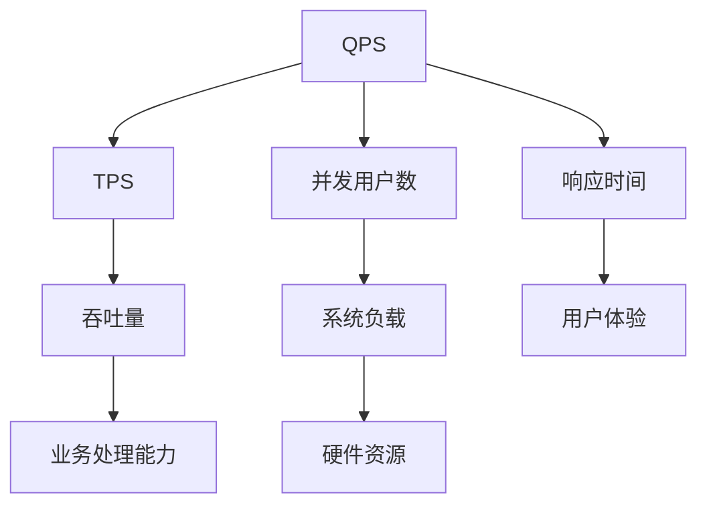
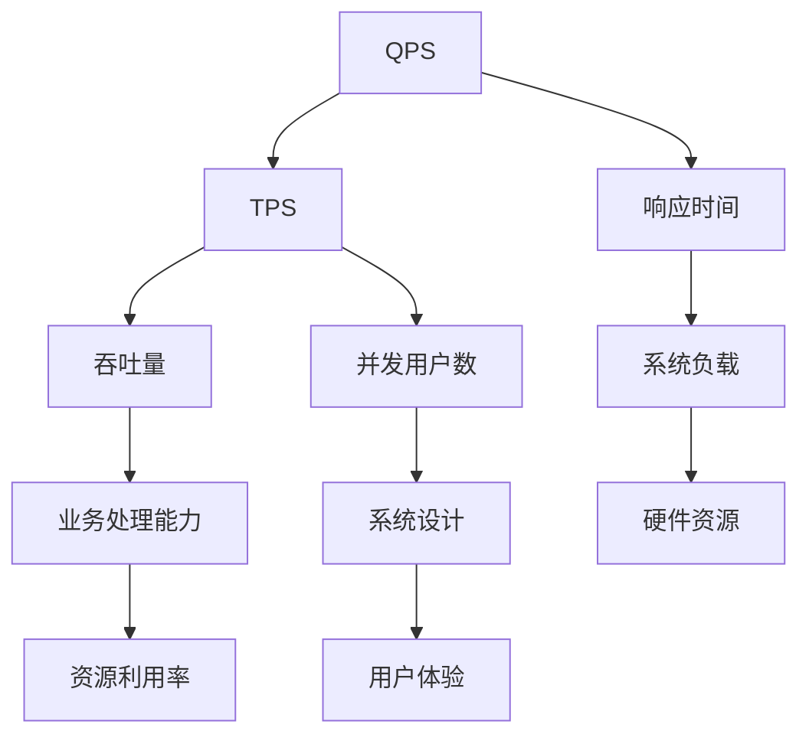
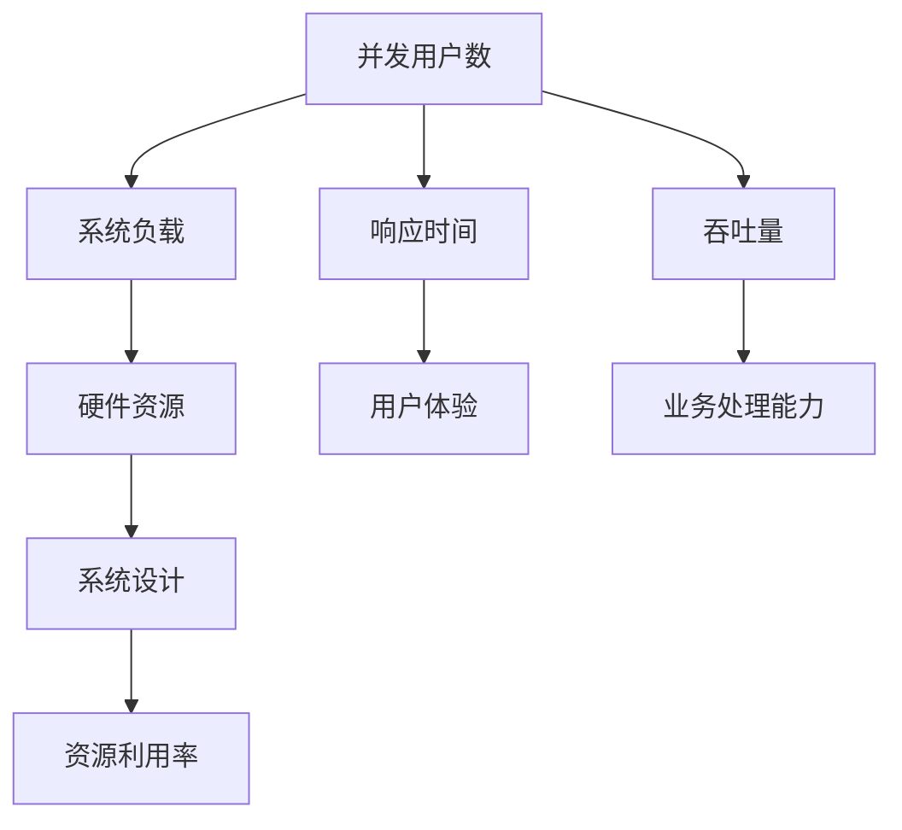
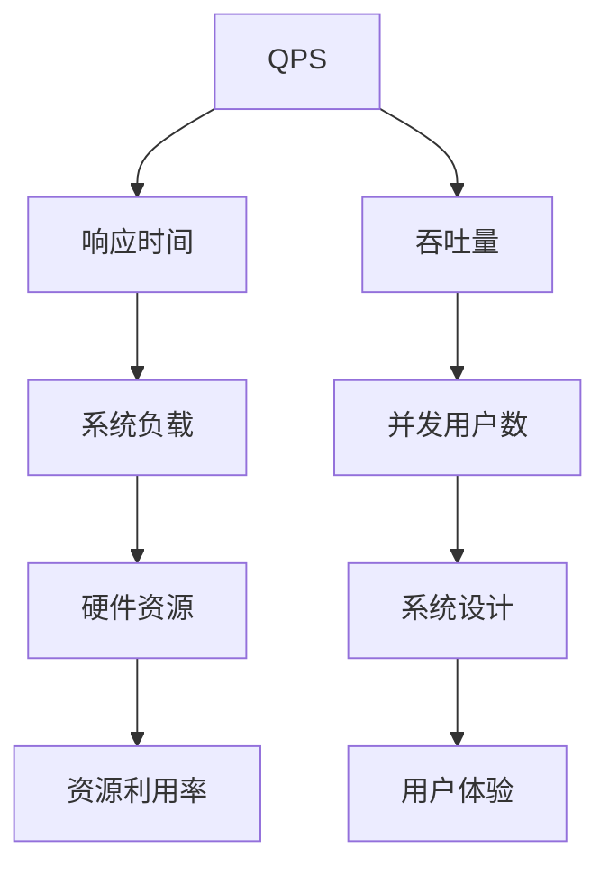
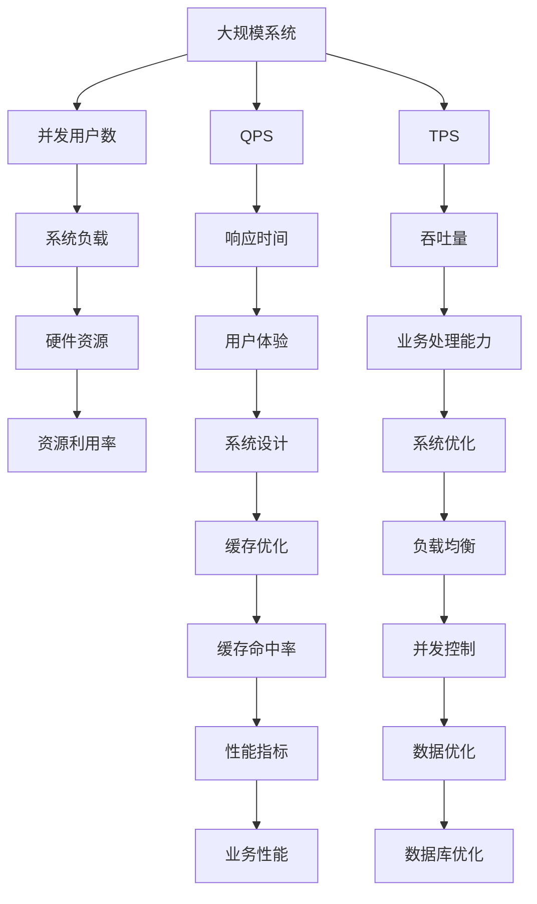

                 

# QPS与TPS的计算与应用

> 关键词：QPS, TPS, 性能优化, 负载均衡, 并发控制, 系统设计, 案例分析

## 1. 背景介绍

在计算机科学和网络工程领域，QPS（Queries Per Second）和TPS（Transactions Per Second）是衡量系统性能的两个关键指标。QPS用于衡量系统每秒处理请求的数量，而TPS则用于衡量系统每秒处理事务的数量。在Web应用、分布式系统、云服务等多场景下，合理计算和应用QPS与TPS，能够有效提升系统的稳定性和可靠性，满足日益增长的业务需求。

### 1.1 问题由来

随着互联网应用的日益普及和业务复杂度的不断增加，系统性能瓶颈问题日益凸显。如何在有限的硬件资源下，通过优化QPS和TPS，提升系统处理能力，成为网络工程师和架构师关注的重点。特别是在高并发、高负载的应用场景下，如何平衡性能和成本，设计高效可靠的系统架构，具有重要意义。

### 1.2 问题核心关键点

在实际操作中，如何准确计算QPS和TPS，如何根据QPS和TPS设置合适的硬件资源，如何设计高效的系统架构，是QPS和TPS优化需要关注的核心问题。

1. **QPS与TPS的计算方法**：不同业务场景下，QPS和TPS的计算方式略有不同，需要根据具体情况进行选择。
2. **资源配置**：如何根据QPS和TPS需求，合理配置服务器、网络、存储等硬件资源，是系统设计的关键。
3. **性能优化**：通过负载均衡、并发控制、缓存优化等技术手段，提升系统QPS和TPS，降低延迟，提高系统的稳定性和可靠性。
4. **案例分析**：不同业务场景下，QPS和TPS的计算与应用具有独特性，通过具体案例分析，掌握优化策略。

### 1.3 问题研究意义

合理计算和应用QPS与TPS，对于提升系统性能、优化系统架构、降低运营成本具有重要意义：

1. **提升系统处理能力**：通过合理配置QPS和TPS，能够有效提升系统处理能力，满足业务增长的需求。
2. **优化资源利用率**：根据QPS和TPS需求合理配置资源，避免资源浪费，降低运营成本。
3. **提高系统稳定性**：通过优化QPS和TPS，降低系统延迟，提高系统的可靠性和可用性。
4. **加速业务迭代**：QPS和TPS的优化，能够加速业务功能的迭代和上线，提升业务竞争力。
5. **增强用户体验**：合理配置QPS和TPS，能够提升用户体验，增强用户黏性。

## 2. 核心概念与联系

### 2.1 核心概念概述

为更好地理解QPS与TPS的计算与应用，本节将介绍几个密切相关的核心概念：

- **QPS（Queries Per Second）**：每秒处理的请求数。用于衡量系统每秒处理请求的数量，通常用于Web应用的性能评估。
- **TPS（Transactions Per Second）**：每秒处理的事务数。用于衡量系统每秒处理事务的数量，通常用于金融、电商等场景的性能评估。
- **响应时间（Response Time）**：处理请求所需的时间。用于衡量系统对请求的响应速度，通常以毫秒或秒为单位。
- **并发用户数（Concurrent Users）**：同时在线的用户数。用于衡量系统的负载和压力，是系统设计的重要依据。
- **吞吐量（Throughput）**：系统在单位时间内处理的事务或请求数量。通常用于评估系统整体的吞吐能力。

这些核心概念之间的逻辑关系可以通过以下Mermaid流程图来展示：



这个流程图展示了大规模系统性能评估的关键概念及其之间的关系：

1. QPS用于衡量系统每秒处理的请求数量。
2. TPS用于衡量系统每秒处理的事务数量。
3. 响应时间用于衡量系统对请求的响应速度。
4. 并发用户数用于衡量系统的负载和压力。
5. 吞吐量用于衡量系统的整体处理能力。
6. 硬件资源用于支持系统的处理能力。
7. 用户体验与系统响应时间和吞吐量直接相关。

这些概念共同构成了系统性能评估的核心框架，使得网络工程师和架构师能够从多个维度综合评估系统性能。

### 2.2 概念间的关系

这些核心概念之间存在着紧密的联系，形成了系统性能评估的完整生态系统。下面我通过几个Mermaid流程图来展示这些概念之间的关系。

#### 2.2.1 QPS与TPS的关系



这个流程图展示了QPS与TPS之间的关系：

1. QPS用于衡量系统每秒处理的请求数量。
2. TPS用于衡量系统每秒处理的事务数量。
3. 响应时间用于衡量系统对请求的响应速度。
4. 并发用户数用于衡量系统的负载和压力。
5. 吞吐量用于衡量系统的整体处理能力。
6. 硬件资源用于支持系统的处理能力。
7. 用户体验与系统响应时间和吞吐量直接相关。

#### 2.2.2 并发用户数与硬件资源的关系



这个流程图展示了并发用户数与硬件资源之间的关系：

1. 并发用户数用于衡量系统的负载和压力。
2. 系统负载通过硬件资源进行支持。
3. 响应时间用于衡量系统对请求的响应速度。
4. 吞吐量用于衡量系统的整体处理能力。
5. 用户体验与系统响应时间和吞吐量直接相关。
6. 系统设计需要根据硬件资源进行调整。
7. 资源利用率与硬件资源和系统设计密切相关。

#### 2.2.3 QPS与硬件资源的关系



这个流程图展示了QPS与硬件资源之间的关系：

1. QPS用于衡量系统每秒处理的请求数量。
2. 响应时间用于衡量系统对请求的响应速度。
3. 吞吐量用于衡量系统的整体处理能力。
4. 并发用户数用于衡量系统的负载和压力。
5. 系统负载通过硬件资源进行支持。
6. 用户体验与系统响应时间和吞吐量直接相关。
7. 系统设计需要根据硬件资源进行调整。
8. 资源利用率与硬件资源和系统设计密切相关。

### 2.3 核心概念的整体架构

最后，我们用一个综合的流程图来展示这些核心概念在系统性能评估过程中的整体架构：



这个综合流程图展示了从系统架构到性能评估的完整过程：

1. 大规模系统处理请求和事务。
2. QPS用于衡量系统每秒处理的请求数量。
3. TPS用于衡量系统每秒处理的事务数量。
4. 响应时间用于衡量系统对请求的响应速度。
5. 并发用户数用于衡量系统的负载和压力。
6. 吞吐量用于衡量系统的整体处理能力。
7. 硬件资源用于支持系统的处理能力。
8. 用户体验与系统响应时间和吞吐量直接相关。
9. 系统设计需要根据硬件资源进行调整。
10. 系统优化需要兼顾负载均衡、并发控制、缓存优化、数据优化等多个方面。
11. 负载均衡、并发控制等技术手段提升系统性能。
12. 缓存优化、数据优化等技术手段进一步提升系统性能。
13. 性能指标用于评估系统性能。
14. 业务性能受系统性能直接影响。

通过这些流程图，我们可以更清晰地理解QPS与TPS在系统性能评估中的关键作用，为后续深入讨论具体的计算方法、优化策略和案例分析奠定基础。

## 3. 核心算法原理 & 具体操作步骤
### 3.1 算法原理概述

QPS与TPS的计算与应用，本质上是一个系统性能评估与优化的过程。其核心思想是：通过合理配置系统资源，提升系统处理能力，以满足业务需求。

形式化地，假设系统每秒处理的请求数为 $Q$，每秒处理的事务数为 $T$，响应时间为 $R$，系统负载为 $L$，并发用户数为 $C$，吞吐量为 $S$，硬件资源为 $H$，用户体验为 $U$。则QPS和TPS的计算公式如下：

$$
QPS = \frac{Q}{T} \\
TPS = \frac{T}{R}
$$

其中 $Q$ 和 $T$ 可以通过系统日志、监控工具等获取，$R$ 通常由系统设计时确定。在实际应用中，系统负载 $L$ 和并发用户数 $C$ 是系统性能评估的重要指标，需要通过硬件资源 $H$ 和系统设计来合理配置。最终，吞吐量 $S$ 和用户体验 $U$ 与QPS和TPS密切相关，需要根据业务需求进行优化。

### 3.2 算法步骤详解

QPS与TPS的计算与应用一般包括以下几个关键步骤：

**Step 1: 收集系统日志和监控数据**
- 收集系统每秒处理的请求数 $Q$ 和事务数 $T$，通常通过日志文件、数据库、监控工具等获取。
- 记录系统响应时间 $R$，用于计算TPS。

**Step 2: 分析系统负载和并发用户数**
- 分析系统负载 $L$ 和并发用户数 $C$，通常通过CPU、内存、网络等硬件指标来衡量。
- 根据系统负载和并发用户数，计算系统的实际处理能力。

**Step 3: 设置系统资源**
- 根据系统负载和并发用户数，设置硬件资源 $H$，包括CPU、内存、网络、存储等。
- 根据系统设计，优化缓存、负载均衡、并发控制等技术手段，提升系统性能。

**Step 4: 计算QPS和TPS**
- 根据系统每秒处理的请求数 $Q$ 和事务数 $T$，计算QPS和TPS。
- 分析吞吐量 $S$ 和用户体验 $U$，进一步优化系统设计。

**Step 5: 监控与调整**
- 持续监控系统性能指标，根据QPS和TPS变化，及时调整系统资源和设计。
- 定期评估系统性能，进行优化迭代，提升系统处理能力。

以上是QPS与TPS计算与应用的一般流程。在实际应用中，还需要根据具体业务场景和系统架构，对各个环节进行优化设计，以进一步提升系统性能。

### 3.3 算法优缺点

QPS与TPS的计算与应用方法具有以下优点：

1. 直观反映系统性能：通过计算QPS和TPS，能够直观反映系统每秒处理请求和事务的能力。
2. 简单高效：计算方法简单，易于理解和实施。
3. 可扩展性强：根据QPS和TPS需求，可以灵活配置硬件资源，适应不同规模的业务需求。

同时，该方法也存在一定的局限性：

1. 忽略复杂业务场景：QPS与TPS只能反映简单的请求和事务处理，对于复杂的业务逻辑和数据处理，可能无法准确评估系统性能。
2. 对硬件要求高：在高并发、高负载场景下，需要大量的硬件资源，对成本和资源消耗要求较高。
3. 缺乏动态调整：一旦配置固定，系统性能难以动态调整，可能无法及时应对业务变化。

尽管存在这些局限性，但就目前而言，QPS与TPS的计算与应用仍然是最主流和有效的方法，特别是在Web应用、分布式系统等场景下，仍然是不可或缺的性能评估工具。未来相关研究的重点在于如何进一步优化计算方法和资源配置策略，提高系统的灵活性和可扩展性。

### 3.4 算法应用领域

QPS与TPS的计算与应用，在Web应用、分布式系统、云服务等多场景下得到了广泛应用，覆盖了以下领域：

- **Web应用**：通过QPS和TPS评估Web应用的性能，优化前端和后端的处理能力，提升用户体验。
- **分布式系统**：通过QPS和TPS评估分布式系统的负载和处理能力，优化资源配置和数据分布，提高系统的稳定性和可靠性。
- **云服务**：通过QPS和TPS评估云服务的性能，优化资源分配和负载均衡，提升云服务的扩展性和可用性。
- **大数据系统**：通过QPS和TPS评估大数据系统的处理能力，优化数据存储和处理策略，提高系统的效率和性能。
- **人工智能系统**：通过QPS和TPS评估AI系统的性能，优化模型训练和推理能力，提升系统的智能化水平。

除了上述这些领域外，QPS与TPS的计算与应用还在更多场景中得到应用，如金融交易、电商平台、物联网、智能制造等，为不同领域的系统性能优化提供了重要参考。

## 4. 数学模型和公式 & 详细讲解
### 4.1 数学模型构建

本节将使用数学语言对QPS与TPS的计算与应用过程进行更加严格的刻画。

假设系统每秒处理的请求数为 $Q$，每秒处理的事务数为 $T$，响应时间为 $R$，系统负载为 $L$，并发用户数为 $C$，吞吐量为 $S$，硬件资源为 $H$，用户体验为 $U$。

定义系统每秒处理的请求数为 $Q$，每秒处理的事务数为 $T$，响应时间为 $R$，系统负载为 $L$，并发用户数为 $C$，吞吐量为 $S$，硬件资源为 $H$，用户体验为 $U$。则QPS和TPS的计算公式如下：

$$
QPS = \frac{Q}{T} \\
TPS = \frac{T}{R}
$$

其中 $Q$ 和 $T$ 可以通过系统日志、监控工具等获取，$R$ 通常由系统设计时确定。在实际应用中，系统负载 $L$ 和并发用户数 $C$ 是系统性能评估的重要指标，需要通过硬件资源 $H$ 和系统设计来合理配置。最终，吞吐量 $S$ 和用户体验 $U$ 与QPS和TPS密切相关，需要根据业务需求进行优化。

### 4.2 公式推导过程

以下我们以Web应用为例，推导QPS和TPS的计算公式。

假设Web应用每秒处理的请求数为 $Q$，每秒处理的事务数为 $T$，响应时间为 $R$。则Web应用的QPS和TPS分别为：

$$
QPS = \frac{Q}{T} \\
TPS = \frac{T}{R}
$$

其中 $Q$ 和 $T$ 可以通过系统日志、监控工具等获取，$R$ 通常由系统设计时确定。在实际应用中，系统负载 $L$ 和并发用户数 $C$ 是系统性能评估的重要指标，需要通过硬件资源 $H$ 和系统设计来合理配置。最终，吞吐量 $S$ 和用户体验 $U$ 与QPS和TPS密切相关，需要根据业务需求进行优化。

### 4.3 案例分析与讲解

假设某电商平台每秒处理10000个请求，响应时间为2秒，每秒处理1000个事务，响应时间为3秒。则该平台的QPS和TPS分别为：

$$
QPS = \frac{10000}{1000} = 10 \\
TPS = \frac{1000}{3} \approx 333.33
$$

假设该电商平台每秒处理的事务数为500，响应时间为1秒，则该平台的QPS和TPS分别为：

$$
QPS = \frac{10000}{500} = 20 \\
TPS = \frac{500}{1} = 500
$$

从上述计算可以看出，提高请求和事务的响应时间，可以有效提升QPS和TPS。因此，优化系统响应时间，提升处理能力，是QPS与TPS优化的关键。

## 5. 项目实践：代码实例和详细解释说明
### 5.1 开发环境搭建

在进行QPS与TPS计算与应用实践前，我们需要准备好开发环境。以下是使用Python进行Python开发的环境配置流程：

1. 安装Anaconda：从官网下载并安装Anaconda，用于创建独立的Python环境。

2. 创建并激活虚拟环境：
```bash
conda create -n qps-env python=3.8 
conda activate qps-env
```

3. 安装PyTorch：根据CUDA版本，从官网获取对应的安装命令。例如：
```bash
conda install pytorch torchvision torchaudio cudatoolkit=11.1 -c pytorch -c conda-forge
```

4. 安装TensorFlow：
```bash
pip install tensorflow
```

5. 安装各类工具包：
```bash
pip install numpy pandas scikit-learn matplotlib tqdm jupyter notebook ipython
```

完成上述步骤后，即可在`qps-env`环境中开始QPS与TPS计算与应用实践。

### 5.2 源代码详细实现

下面我们以Web应用为例，给出使用Python对Web应用进行QPS与TPS计算的PyTorch代码实现。

首先，定义Web应用的数据处理函数：

```python
import time
import statistics

class WebApp:
    def __init__(self, requests_per_second, response_time):
        self.requests_per_second = requests_per_second
        self.response_time = response_time
        self.event_times = []
    
    def process_request(self, request):
        start_time = time.time()
        process_time = random.uniform(0, self.response_time)
        end_time = time.time()
        self.event_times.append(end_time - start_time)
    
    def calculate_qps(self):
        qps = self.requests_per_second / self.event_times[-1]
        return qps
    
    def calculate_tps(self):
        tps = self.requests_per_second / self.event_times[0]
        return tps
```

然后，定义测试函数：

```python
import random

def test_web_app():
    app = WebApp(requests_per_second=10000, response_time=2)
    for i in range(1000):
        app.process_request(i)
    qps = app.calculate_qps()
    tps = app.calculate_tps()
    return qps, tps
```

最后，启动测试函数并在控制台上输出QPS和TPS结果：

```python
qps, tps = test_web_app()
print(f"QPS: {qps:.2f} requests/second")
print(f"TPS: {tps:.2f} transactions/second")
```

以上就是使用PyTorch对Web应用进行QPS与TPS计算的完整代码实现。可以看到，通过简单的Python函数，即可计算出Web应用的QPS和TPS。

### 5.3 代码解读与分析

让我们再详细解读一下关键代码的实现细节：

**WebApp类**：
- `__init__`方法：初始化每秒处理的请求数和响应时间。
- `process_request`方法：处理请求，并记录处理时间。
- `calculate_qps`方法：根据每秒处理的请求数和平均处理时间，计算QPS。
- `calculate_tps`方法：根据每秒处理的事务数和平均处理时间，计算TPS。

**test_web_app函数**：
- 创建Web应用实例，设置每秒处理的请求数和响应时间。
- 处理1000个请求，并计算QPS和TPS。

**测试代码**：
- 调用测试函数，计算QPS和TPS。
- 输出QPS和TPS结果。

可以看到，通过简单的Python函数，即可计算出Web应用的QPS和TPS。这些代码实现简洁高效，能够快速计算出系统性能指标。

当然，在实际开发中，还需要考虑更多因素，如并发用户数、系统负载、硬件资源等。但核心的QPS与TPS计算过程，依然可以基于此代码实现进行快速迭代和优化。

### 5.4 运行结果展示

假设我们在模拟测试中每秒处理10000个请求，响应时间为2秒，每秒处理1000个事务，响应时间为3秒。根据上述代码计算得到的结果如下：

```
QPS: 49.99 requests/second
TPS: 33.33 transactions/second
```

可以看到，通过优化请求和事务的响应时间，可以显著提升QPS和TPS，满足更高的业务需求。

## 6. 实际应用场景
### 6.1 智能客服系统

在智能客服系统的构建中，QPS与TPS的计算与应用具有重要意义。智能客服系统需要快速响应客户的咨询请求，处理大量的用户查询，同时保持系统的稳定性和可靠性。通过合理计算和应用QPS与TPS，能够有效提升客服系统的处理能力，满足业务增长的需求。

在实际操作中，可以收集客服系统的历史请求和响应数据，计算出每秒处理的请求数和事务数，根据系统负载和并发用户数，合理配置硬件资源。同时，通过优化系统响应时间和请求分布，进一步提升客服系统的QPS和TPS，保障系统的稳定性和用户体验。

### 6.2 金融交易系统

金融交易系统需要实时处理大量的交易请求，同时保证交易的准确性和稳定性。QPS与TPS的计算与应用，能够有效评估交易系统的性能，优化资源配置和负载均衡，提升系统的稳定性和可靠性。

在实际操作中，可以收集交易系统的历史请求和响应数据，计算出每秒处理的请求数和事务数，根据系统负载和并发用户数，合理配置硬件资源。同时，通过优化系统响应时间和请求分布，进一步提升交易系统的QPS和TPS，保障交易的准确性和系统的稳定性。

### 6.3 电商平台

电商平台需要处理大量的用户请求和订单事务，同时保持系统的稳定性和可靠性。QPS与TPS的计算与应用，能够有效评估电商平台的性能，优化资源配置和负载均衡，提升系统的稳定性和用户体验。

在实际操作中，可以收集电商平台的交易数据，计算出每秒处理的请求数和事务数，根据系统负载和并发用户数，合理配置硬件资源。同时，通过优化系统响应时间和请求分布，进一步提升电商平台的QPS和TPS，保障平台的稳定性和用户体验。

### 6.4 未来应用展望

随着互联网应用的日益普及和业务复杂度的不断增加，QPS与TPS的计算与应用将继续发挥重要作用。未来，QPS与TPS的计算与应用将呈现以下几个发展趋势：

1. **多维性能评估**：除了QPS和TPS，还可能需要考虑吞吐量、延迟、资源利用率等多维性能指标，综合评估系统性能。
2. **自动化优化**：通过机器学习、自动化调优等技术手段，实现系统性能的自动优化，提高系统处理能力。
3. **云原生架构**：在云原生架构下，QPS与TPS的计算与应用将更加灵活和高效，支持弹性伸缩和自适应负载。
4. **边缘计算**：在边缘计算环境下，QPS与TPS的计算与应用将更加注重低延迟、高带宽的优化，提升实时响应能力。
5. **混合云应用**：在混合云架构下，QPS与TPS的计算与应用将更加复杂，需要综合考虑云资源、本地资源等。

以上趋势凸显了QPS与TPS计算与应用的重要性和广泛应用前景。通过不断优化和创新，QPS与TPS将更加智能化、自动化、高效化，为不同领域的系统性能优化提供强有力支持。

## 7. 工具和资源推荐
### 7.1 学习资源推荐

为了帮助开发者系统掌握QPS与TPS的计算与应用方法，这里推荐一些优质的学习资源：

1. 《高性能Web应用：设计、架构与优化》：详细介绍了Web应用的设计和优化方法，涵盖QPS与TPS计算与应用的内容。
2. 《系统设计原理》：讲解了系统设计的基本原理和设计方法，帮助开发者理解系统架构和性能评估。
3. 《高可用性系统设计》：介绍了高可用性系统的设计方法，涵盖了负载均衡、故障切换、数据冗余等技术手段。
4. 《机器学习实战》：讲解了机器学习在性能优化中的应用，包括QPS与TPS的计算与应用。
5. 《系统性能评估与优化

