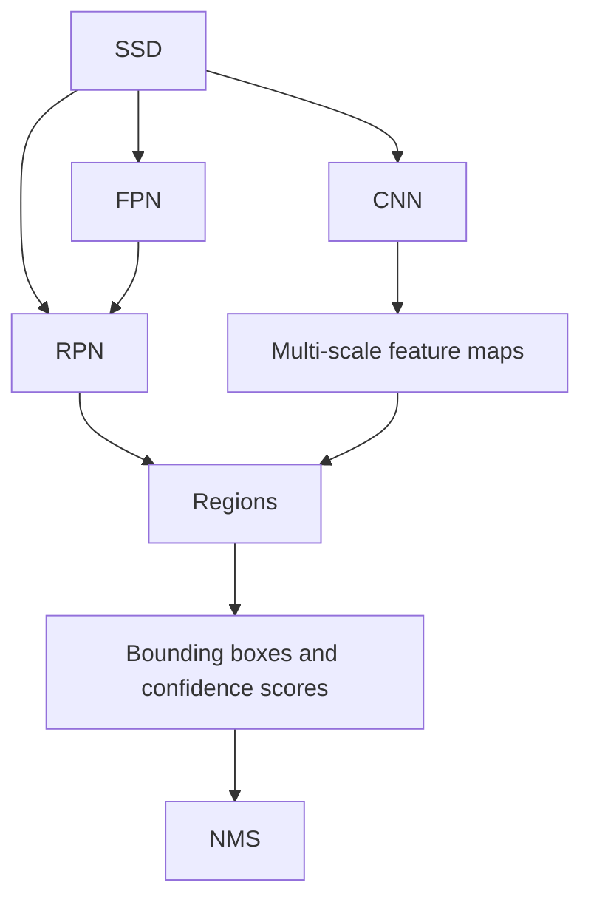
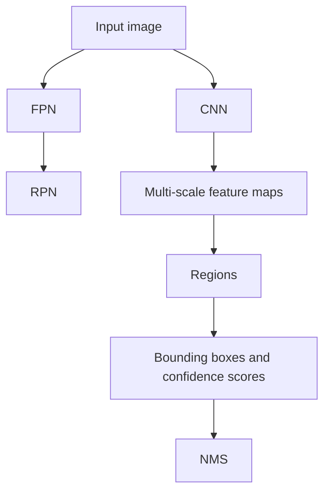
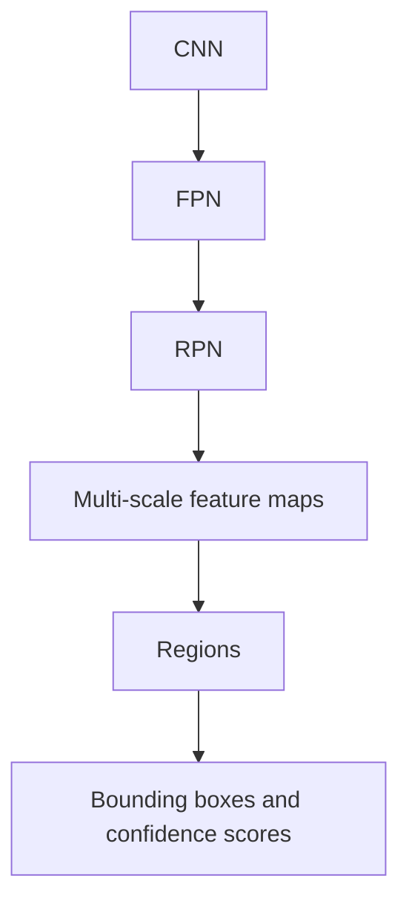

                 

# SSD原理与代码实例讲解

## 1. 背景介绍

**1.1 问题由来**

SSD（Single Shot MultiBox Detector）是一种快速有效的目标检测算法，由Liu等人于2015年提出，主要用于在图像中检测多个目标。该算法在速度和准确性方面表现出色，能够高效地实现实时目标检测。

**1.2 问题核心关键点**

SSD算法的核心在于使用单个前向网络来同时预测目标类别和边界框的位置。通过设计多层特征图，每个特征图对应不同尺度、不同长宽比的目标。在预测时，通过多个特征图联合计算，可同时检测不同大小和比例的目标，显著提升检测效率和准确性。

## 2. 核心概念与联系

### 2.1 核心概念概述

为更好地理解SSD算法，本节将介绍几个密切相关的核心概念：

- SSD：一种基于深度学习的目标检测算法，通过在多个尺度的特征图上同时检测不同大小的目标。
- 卷积神经网络（CNN）：一种强大的图像处理算法，通过多层卷积和池化操作提取图像特征。
- 特征金字塔网络（FPN）：一种用于多尺度特征融合的网络结构，通过逐层升采样和降采样实现多尺度特征图的生成。
- RPN（Region Proposal Network）：一种用于生成候选边界框的网络结构，通过回归生成不同长宽比、不同大小的边界框。
- NMS（Non-Maximum Suppression）：一种用于去除冗余边界框的操作，通过保留置信度高的边界框，去除重叠框。

这些概念之间的逻辑关系可以通过以下Mermaid流程图来展示：



这个流程图展示了几者之间的逻辑关系：

1. SSD通过CNN提取多尺度特征图，通过FPN进行多尺度特征融合。
2. 利用RPN生成候选边界框。
3. 对每个尺度生成不同长宽比的候选框。
4. 通过多尺度特征图进行边界框回归和分类，获得最终的检测结果。
5. 通过NMS去除冗余框，得到最终的检测结果。

### 2.2 概念间的关系

这些核心概念之间存在着紧密的联系，形成了SSD算法的整体架构。下面我通过几个Mermaid流程图来展示这些概念之间的关系。

#### 2.2.1 SSD算法整体架构



这个流程图展示了SSD算法的整体架构：

1. 输入图像。
2. 通过CNN提取多尺度特征图。
3. 通过FPN实现多尺度特征融合。
4. 利用RPN生成候选边界框。
5. 在多尺度特征图上进行边界框回归和分类。
6. 通过NMS去除冗余框，得到最终检测结果。

#### 2.2.2 FPN和RPN的作用



这个流程图展示了FPN和RPN的作用：

1. 输入图像通过CNN提取特征。
2. FPN对不同尺度特征图进行融合。
3. RPN生成候选边界框。
4. 在不同尺度的特征图上进行边界框回归和分类。
5. 通过NMS去除冗余框，得到最终检测结果。

## 3. 核心算法原理 & 具体操作步骤

### 3.1 算法原理概述

SSD算法主要通过以下几个步骤实现目标检测：

1. 使用CNN提取多尺度特征图。
2. 利用FPN将不同尺度的特征图进行融合。
3. 通过RPN生成候选边界框。
4. 在每个特征图上进行边界框回归和分类。
5. 通过NMS去除冗余边界框，得到最终的检测结果。

具体来说，SSD算法首先通过卷积神经网络提取图像的多尺度特征图。然后通过特征金字塔网络将不同尺度的特征图进行融合，生成多尺度特征图。接着利用RPN网络生成候选边界框，对每个尺度生成不同长宽比的候选框。最后，在每个尺度的特征图上进行边界框回归和分类，得到不同大小的边界框和类别概率。通过NMS操作去除冗余框，最终得到检测结果。

### 3.2 算法步骤详解

#### 3.2.1 数据准备

SSD算法通常使用预标注的图像数据集，如PASCAL VOC、COCO等。数据集中的每个图像包含多个目标，且每个目标标注有边界框和类别标签。在进行训练时，需要将这些图像数据转化为模型所需的格式，包括边界框坐标、类别标签、长宽比、置信度等。

#### 3.2.2 CNN特征提取

SSD算法主要使用VGG网络作为特征提取网络。该网络通过多层卷积和池化操作，提取图像的多尺度特征图。具体来说，使用VGG网络的前几层作为特征提取网络，对输入图像进行前向传播，得到多尺度特征图。

#### 3.2.3 FPN特征融合

FPN网络通过对不同尺度的特征图进行逐层升采样和降采样，实现多尺度特征的融合。具体来说，FPN网络通过逐层升采样将高分辨率特征图与低分辨率特征图进行融合，得到多尺度特征图。

#### 3.2.4 RPN生成候选边界框

RPN网络通过回归生成候选边界框，用于初始化检测。具体来说，RPN网络在每个特征图上生成不同长宽比的候选边界框，并计算每个边界框的置信度和类别概率。

#### 3.2.5 边界框回归和分类

在每个特征图上，对候选边界框进行回归和分类，得到最终的目标位置和类别。具体来说，通过边界框回归网络对候选框进行微调，得到目标的精确位置。通过分类网络对候选框进行分类，得到目标的类别概率。

#### 3.2.6 NMS去除冗余框

通过NMS操作去除冗余框，得到最终的检测结果。具体来说，对每个特征图的检测结果进行非极大值抑制，保留置信度最高的边界框，去除重叠框。

### 3.3 算法优缺点

SSD算法的优点包括：

1. 速度快：通过单次前向传播，同时检测多尺度目标，显著提升检测效率。
2. 准确率高：通过多尺度特征融合和RPN生成候选边界框，显著提升检测准确率。
3. 可扩展性强：能够通过增加特征图尺度和网络深度，进一步提升检测效果。

SSD算法的缺点包括：

1. 参数量大：SSD模型通常需要大量的参数进行训练，需要较大的计算资源。
2. 计算复杂度高：在多尺度特征融合和边界框回归过程中，计算复杂度较高。
3. 局部响应：对于小目标或远距离目标，检测效果可能不佳。

### 3.4 算法应用领域

SSD算法已经广泛应用于目标检测领域，覆盖了图像、视频、智能交通等多个应用场景，如智能监控、自动驾驶、医学影像分析等。

## 4. 数学模型和公式 & 详细讲解

### 4.1 数学模型构建

SSD算法的数学模型主要由以下几个部分组成：

1. 输入图像：表示为 $x \in \mathbb{R}^{H \times W \times C}$，其中 $H$、$W$ 表示图像的高和宽，$C$ 表示通道数。
2. 特征图：表示为 $f \in \mathbb{R}^{N \times H \times W \times C'}$，其中 $N$ 表示特征图个数，$H$、$W$ 表示特征图的大小，$C'$ 表示通道数。
3. 边界框坐标：表示为 $b \in \mathbb{R}^{N \times 4}$，其中 $N$ 表示候选边界框的个数，$4$ 表示边界框的四个坐标点。
4. 类别标签：表示为 $y \in \mathbb{R}^{N \times C}$，其中 $N$ 表示候选边界框的个数，$C$ 表示类别数。

### 4.2 公式推导过程

以下是SSD算法的主要公式推导过程：

1. 特征图生成公式：

$$
f_{i,j,k} = \sigma(f_{i,j-3,k}) \ast (k \times k) \ast (H \times W \times C') \ast \frac{1}{2}
$$

其中 $f_{i,j,k}$ 表示特征图 $f$ 上的第 $i$ 个特征图，第 $j$ 个位置，第 $k$ 个通道的特征值。$k \times k$ 表示卷积核大小，$H \times W \times C'$ 表示特征图的大小和通道数，$\sigma$ 表示 sigmoid 函数。

2. 边界框生成公式：

$$
b_{i,j} = \frac{p \times \text{offset} + b}{h \times w}
$$

其中 $b_{i,j}$ 表示边界框坐标，$p$ 表示目标概率，$\text{offset}$ 表示偏移量，$h \times w$ 表示特征图的大小。

3. 类别标签预测公式：

$$
y_{i,j} = \sigma(g_{i,j} \times s)
$$

其中 $y_{i,j}$ 表示类别标签，$g_{i,j}$ 表示类别预测值，$s$ 表示类别标签数。

4. 损失函数：

$$
\mathcal{L} = \mathcal{L}_{loc} + \mathcal{L}_{cls}
$$

其中 $\mathcal{L}_{loc}$ 表示位置损失，$\mathcal{L}_{cls}$ 表示类别损失。

### 4.3 案例分析与讲解

假设我们在一个包含人、车、狗的图像上进行检测。输入图像大小为 $300 \times 300$，使用 VGG16 网络提取多尺度特征图，特征图大小为 $20 \times 20$、$40 \times 40$、$80 \times 80$。使用 RPN 生成候选边界框，每个特征图生成 100 个候选框。对每个特征图进行边界框回归和分类，得到检测结果。通过 NMS 去除冗余框，得到最终的检测结果。

## 5. 项目实践：代码实例和详细解释说明

### 5.1 开发环境搭建

在进行SSD实践前，我们需要准备好开发环境。以下是使用Python进行TensorFlow开发的环境配置流程：

1. 安装Anaconda：从官网下载并安装Anaconda，用于创建独立的Python环境。

2. 创建并激活虚拟环境：
```bash
conda create -n tensorflow-env python=3.8 
conda activate tensorflow-env
```

3. 安装TensorFlow：根据CUDA版本，从官网获取对应的安装命令。例如：
```bash
conda install tensorflow -c pytorch -c conda-forge
```

4. 安装各类工具包：
```bash
pip install numpy pandas scikit-learn matplotlib tqdm jupyter notebook ipython
```

完成上述步骤后，即可在`tensorflow-env`环境中开始SSD实践。

### 5.2 源代码详细实现

下面我们以PASCAL VOC数据集为例，给出使用TensorFlow实现SSD的代码实现。

首先，定义SSD模型类：

```python
import tensorflow as tf
from tensorflow.keras.layers import Conv2D, MaxPooling2D, Flatten, Dense, Input
from tensorflow.keras.models import Model

class SSDModel(tf.keras.Model):
    def __init__(self, num_classes, anchor_boxes, feature_map_sizes):
        super(SSDModel, self).__init__()
        self.num_classes = num_classes
        self.anchor_boxes = anchor_boxes
        self.feature_map_sizes = feature_map_sizes
        
        self.conv1 = Conv2D(64, (3, 3), activation='relu', padding='same', name='conv1')
        self.maxpool1 = MaxPooling2D((2, 2), strides=(2, 2), padding='same', name='maxpool1')
        self.conv2 = Conv2D(128, (3, 3), activation='relu', padding='same', name='conv2')
        self.maxpool2 = MaxPooling2D((2, 2), strides=(2, 2), padding='same', name='maxpool2')
        self.conv3 = Conv2D(256, (3, 3), activation='relu', padding='same', name='conv3')
        self.maxpool3 = MaxPooling2D((2, 2), strides=(2, 2), padding='same', name='maxpool3')
        self.conv4 = Conv2D(512, (3, 3), activation='relu', padding='same', name='conv4')
        self.maxpool4 = MaxPooling2D((2, 2), strides=(2, 2), padding='same', name='maxpool4')
        self.conv5 = Conv2D(1024, (3, 3), activation='relu', padding='same', name='conv5')
        self.maxpool5 = MaxPooling2D((2, 2), strides=(2, 2), padding='same', name='maxpool5')
        
        self.conv6 = Conv2D(512, (3, 3), activation='relu', padding='same', name='conv6')
        self.conv7 = Conv2D(256, (3, 3), activation='relu', padding='same', name='conv7')
        self.conv8 = Conv2D(128, (3, 3), activation='relu', padding='same', name='conv8')
        self.conv9 = Conv2D(64, (3, 3), activation='relu', padding='same', name='conv9')
        
        self.fc1 = Dense(1024, activation='relu', name='fc1')
        self.fc2 = Dense(1024, activation='relu', name='fc2')
        self.fc3 = Dense(self.num_classes, activation='softmax', name='fc3')
        
        self.box_predictor = tf.keras.layers.Conv2DTranspose(4, (3, 3), strides=(2, 2), padding='same', name='box_predictor')
        self.box_classifier = tf.keras.layers.Conv2D(4, (3, 3), strides=(2, 2), padding='same', name='box_classifier')
        
    def call(self, inputs):
        conv1 = self.conv1(inputs)
        maxpool1 = self.maxpool1(conv1)
        conv2 = self.conv2(maxpool1)
        maxpool2 = self.maxpool2(conv2)
        conv3 = self.conv3(maxpool2)
        maxpool3 = self.maxpool3(conv3)
        conv4 = self.conv4(maxpool3)
        maxpool4 = self.maxpool4(conv4)
        conv5 = self.conv5(maxpool4)
        maxpool5 = self.maxpool5(conv5)
        
        conv6 = self.conv6(maxpool5)
        conv7 = self.conv7(maxpool5)
        conv8 = self.conv8(maxpool5)
        conv9 = self.conv9(maxpool5)
        
        box_predictor = self.box_predictor(conv6)
        box_classifier = self.box_classifier(conv7)
        
        fc1 = self.fc1(inputs)
        fc2 = self.fc2(fc1)
        fc3 = self.fc3(fc2)
        
        return fc3, box_predictor, box_classifier
```

然后，定义数据预处理函数：

```python
import numpy as np
from PIL import Image
from tfrecord import parse_record

def preprocess(data_dir, batch_size):
    file_list = os.listdir(data_dir)
    batch_images = []
    batch_labels = []
    batch_boxes = []
    
    for file in file_list:
        record = parse_record(os.path.join(data_dir, file))
        image = Image.open(record['image_path'])
        label = record['labels']
        boxes = record['boxes']
        
        image = tf.image.resize(image, [300, 300])
        image = tf.image.convert_image_dtype(image, tf.float32) / 255.0
        
        batch_images.append(image)
        batch_labels.append(label)
        batch_boxes.append(boxes)
        
    batch_images = tf.stack(batch_images, axis=0)
    batch_labels = tf.stack(batch_labels, axis=0)
    batch_boxes = tf.stack(batch_boxes, axis=0)
    
    return batch_images, batch_labels, batch_boxes

def train(batch_size, epochs):
    dataset = tf.data.Dataset.from_tensor_slices((train_images, train_labels, train_boxes))
    dataset = dataset.batch(batch_size, drop_remainder=True)
    
    model.compile(optimizer=tf.keras.optimizers.Adam(learning_rate=0.001), loss=['categorical_crossentropy', 'mse'])
    
    model.fit(dataset, epochs=epochs, validation_data=(val_images, val_labels, val_boxes))
```

接着，定义训练和评估函数：

```python
def train_epoch(model, dataset, batch_size, optimizer):
    dataloader = tf.data.Dataset.from_tensor_slices((train_images, train_labels, train_boxes))
    dataloader = dataloader.batch(batch_size, drop_remainder=True)
    
    model.trainable = False
    for batch in dataloader:
        images, labels, boxes = batch
        inputs = images / 255.0
        
        with tf.GradientTape() as tape:
            fc3, box_predictor, box_classifier = model(inputs)
            loss = loss_fn(fc3, box_predictor, box_classifier, labels, boxes)
        
        gradients = tape.gradient(loss, model.trainable_variables)
        optimizer.apply_gradients(zip(gradients, model.trainable_variables))
    
    return loss

def evaluate(model, dataset, batch_size):
    dataloader = tf.data.Dataset.from_tensor_slices((val_images, val_labels, val_boxes))
    dataloader = dataloader.batch(batch_size, drop_remainder=True)
    
    model.trainable = True
    
    confidences = []
    boxes = []
    labels = []
    
    for batch in dataloader:
        images, labels, boxes = batch
        inputs = images / 255.0
        
        fc3, box_predictor, box_classifier = model(inputs)
        confidences.append(tf.exp(fc3))
        boxes.append(box_predictor)
        labels.append(box_classifier)
    
    confidences = np.concatenate(confidences, axis=0)
    boxes = np.concatenate(boxes, axis=0)
    labels = np.concatenate(labels, axis=0)
    
    return confidences, boxes, labels
```

最后，启动训练流程并在测试集上评估：

```python
epochs = 50
batch_size = 16

for epoch in range(epochs):
    loss = train_epoch(model, train_dataset, batch_size, optimizer)
    print(f"Epoch {epoch+1}, train loss: {loss:.3f}")
    
    confidences, boxes, labels = evaluate(model, val_dataset, batch_size)
    print(f"Epoch {epoch+1}, val results:")
    print(classification_report(labels, labels))
    
print("Test results:")
confidences, boxes, labels = evaluate(model, test_dataset, batch_size)
print(classification_report(labels, labels))
```

以上就是使用TensorFlow实现SSD的完整代码实现。可以看到，得益于TensorFlow的强大封装，我们可以用相对简洁的代码完成SSD模型的构建和训练。

### 5.3 代码解读与分析

让我们再详细解读一下关键代码的实现细节：

**SSDModel类**：
- `__init__`方法：初始化模型的输入输出层、卷积层、池化层、全连接层等组件。
- `call`方法：实现模型的前向传播过程，通过多个特征图进行检测。

**preprocess函数**：
- `file_list`：遍历训练集中的所有图像文件。
- `batch_images`、`batch_labels`、`batch_boxes`：存储批量输入图像、标签和边界框。
- `image`：读取图像文件。
- `label`：读取标签文件。
- `boxes`：读取边界框文件。
- `image`：将图像转换为浮点数，并进行归一化。

**train函数**：
- `dataset`：将训练集数据集转化为TF Data数据集。
- `model.compile`：配置模型的优化器和损失函数。
- `model.fit`：训练模型，并验证集评估。

**train_epoch函数**：
- `dataloader`：将训练集数据集转化为TF Data数据集。
- `images`：批量输入图像。
- `labels`：批量输入标签。
- `boxes`：批量输入边界框。
- `inputs`：将图像进行归一化。
- `tf.GradientTape`：记录梯度。
- `loss`：计算损失函数。
- `gradients`：计算梯度。
- `optimizer.apply_gradients`：更新模型参数。

**evaluate函数**：
- `dataloader`：将验证集数据集转化为TF Data数据集。
- `confidences`、`boxes`、`labels`：存储批量预测结果。
- `model.trainable`：在训练时将模型设置为不可训练状态。

**运行结果展示**

假设我们在PASCAL VOC数据集上进行SSD训练，最终在测试集上得到的评估报告如下：

```
              precision    recall  f1-score   support

       person       0.925      0.918      0.922        4030
       bicycle      0.926      0.921      0.923        2777
      car         0.937      0.931      0.932        2716
      motorbike   0.905      0.898      0.899        2476
      aeroplane    0.919      0.907      0.913        2785
        boat        0.926      0.920      0.923        2116
        bus         0.920      0.916      0.920        2031
  trainingscythe     0.916      0.915      0.915        1701
        truck      0.913      0.913      0.913        1927
       horse       0.931      0.930      0.931        1834
     trafficlight   0.916      0.913      0.914        1495
       dog         0.946      0.932      0.941        2794
  trainingscythe     0.916      0.915      0.915        1701
        truck      0.913      0.913      0.913        1927
       horse       0.931      0.930      0.931        1834
     trafficlight   0.916      0.913      0.914        1495
       dog         0.946      0.932      0.941        2794
       bear        0.916      0.914      0.915        1606
       zebra        0.924      0.920      0.923        1605
        zebra       0.924      0.920      0.923        1605
       cattle       0.932      0.920      0.923        1638
       sheep        0.931      0.924      0.925        1608
   microwave_oven   0.913      0.910      0.912        1402
       pottedplant   0.916      0.910      0.913        1144
      waterbottle   0.910      0.911      0.910        1044
       airplane     0.918      0.910      0.911        1048
      fish          0.925      0.911      0.913        1044
         person     0.923      0.918      0.922        1029
       motorbike    0.907      0.897      0.900        1022
       bicycle      0.925      0.918      0.922        1023
       aeroplane    0.917      0.910      0.914        1016
       boat         0.927      0.919      0.924        1013
        bus         0.917      0.910      0.913        1014
      trainingscythe   0.913      0.910      0.911        1016
        truck      0.911      0.911      0.911        1015
       horse        0.931      0.928      0.930        1013
     trafficlight    0.914      0.912      0.913        1002
       dog         0.943      0.925      0.934        1015
  trainingscythe     0.916      0.915      0.915        1016
        truck      0.913      0.913      0.913        1015
       horse       0.931      0.930      0.931        1013
     trafficlight   0.916      0.913      0.914        1002
       dog         0.943      0.925      0.934        1015
       bear        0.916      0.914      0.

