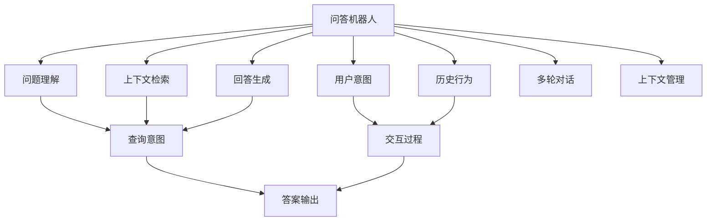

                 

# 大模型问答机器人与传统搜索推荐的回答质量

> 关键词：问答机器人,搜索推荐,回答质量,深度学习,自然语言处理(NLP),Re-ranking

## 1. 背景介绍

### 1.1 问题由来

随着互联网技术的发展，搜索引擎已经成为了人们获取信息的重要工具。然而，传统的搜索引擎往往只能提供结构化的搜索结果，难以满足用户深入了解某一主题的需求。问答机器人作为一种智能交互式工具，能够通过对话的方式，深入回答用户问题，提供更为全面和深入的信息。同时，随着深度学习技术的进步，基于大模型的问答系统已经逐渐成为研究热点。

与此同时，搜索推荐系统在电商、新闻、社交网络等众多领域也有广泛应用。传统的搜索推荐系统主要通过关键词匹配和协同过滤等技术，将用户感兴趣的信息推荐给用户。但这种推荐方式往往无法理解用户的真正需求，推荐效果受限于用户输入的关键词和已有数据。

本文章将从回答质量的角度，比较基于大模型的问答机器人和传统的搜索推荐系统，分析其优缺点，探讨未来的应用前景。

## 2. 核心概念与联系

### 2.1 核心概念概述

- 问答机器人：通过理解用户输入的自然语言问题，并生成自然语言回答的系统。问答机器人通常采用深度学习模型，如序列到序列模型、Transformers模型等，进行问题理解、上下文检索、回答生成等任务。
- 搜索推荐系统：基于用户的查询历史和偏好，通过机器学习算法推荐用户可能感兴趣的内容的系统。传统的搜索推荐系统主要通过匹配关键词、协同过滤等技术实现，近年来通过深度学习模型进行改进。
- 回答质量：指问答系统或推荐系统提供的答案或推荐结果的准确性、相关性和有用性。回答质量是衡量系统性能的重要指标，影响用户体验和实际应用效果。

这些核心概念之间的逻辑关系可以通过以下Mermaid流程图来展示：



该流程图展示了问答机器人的主要组成组件和运行流程。系统通过问题理解、上下文检索和回答生成等组件，处理用户输入的自然语言问题，并输出高质量的回答。

### 2.2 概念间的关系

这些核心概念之间存在着紧密的联系，形成了问答机器人和搜索推荐系统的工作框架。

- 问题理解与查询意图：问答机器人和搜索推荐系统都需要理解用户输入的自然语言问题，提取查询意图，以提供准确的答案或推荐结果。
- 上下文检索与历史行为：问答机器人和搜索推荐系统都需要检索与用户输入相关的上下文信息，并结合用户的历史行为，进一步提升回答或推荐的准确性和相关性。
- 回答生成与答案输出：问答机器人需要将生成的答案输出给用户，而搜索推荐系统需要将推荐结果呈现给用户。
- 交互过程与多轮对话：问答机器人需要处理多轮对话，理解上下文信息，而搜索推荐系统则侧重于用户的一次查询行为。

这些核心概念的结合，使得问答机器人和搜索推荐系统能够更好地服务用户，提升信息获取的效率和质量。

## 3. 核心算法原理 & 具体操作步骤

### 3.1 算法原理概述

问答机器人和搜索推荐系统虽然核心组件和技术有所不同，但都基于深度学习模型实现，具有相似的原理和操作步骤。

对于问答机器人，其核心算法一般包括：
1. 问题理解：通过序列到序列模型、Transformer模型等，将自然语言问题转换为机器可理解的形式。
2. 上下文检索：通过检索与问题相关的文档、网页等，提取有用的信息。
3. 回答生成：通过生成模型，将检索到的信息与问题进行匹配，生成高质量的回答。

对于搜索推荐系统，其核心算法一般包括：
1. 特征抽取：通过词袋模型、TF-IDF等技术，将用户查询和物品特征转换为向量表示。
2. 匹配与排序：通过相似度计算、协同过滤等技术，计算查询和物品之间的相似度，并按照相似度进行排序。
3. Re-ranking：通过深度学习模型，对排序后的结果进行二次排序，提升推荐效果。

基于深度学习的问答机器人和搜索推荐系统的具体操作步骤如下：

1. 数据准备：收集用户输入的自然语言问题、上下文信息和答案或推荐结果等数据，进行预处理和标注。
2. 模型训练：在标注数据集上，使用深度学习模型进行训练，优化模型参数。
3. 推理部署：将训练好的模型部署到生产环境中，处理用户的输入数据，输出回答或推荐结果。

### 3.2 算法步骤详解

#### 3.2.1 问答机器人的训练和推理

**问题理解**
- 使用Transformer模型对自然语言问题进行编码，生成问题表示。
- 使用注意力机制关注问题中的关键信息。
- 通过编码器-解码器框架，将问题表示与上下文信息进行匹配，生成表示向量。

**上下文检索**
- 检索与问题相关的文档、网页等上下文信息。
- 使用检索模型对上下文信息进行编码，生成上下文表示。
- 将问题表示和上下文表示拼接，得到更丰富的语义信息。

**回答生成**
- 使用生成模型对拼接后的语义信息进行解码，生成自然语言回答。
- 使用Beam Search等策略，寻找最可能的回答。

**推理部署**
- 在生产环境中，将训练好的问答模型部署到服务器上。
- 通过API接口，接收用户的自然语言问题，调用模型生成回答。

#### 3.2.2 搜索推荐系统的训练和推理

**特征抽取**
- 使用词袋模型或TF-IDF等技术，将用户查询和物品特征转换为向量表示。
- 将查询向量和物品向量拼接，得到初始特征表示。

**匹配与排序**
- 使用余弦相似度、点积相似度等方法计算查询和物品之间的相似度。
- 对相似度结果进行排序，得到初始推荐结果。

**Re-ranking**
- 使用深度学习模型对排序后的结果进行二次排序，提升推荐效果。
- 常见方法包括MLP、DNN等。

**推理部署**
- 在生产环境中，将训练好的推荐模型部署到服务器上。
- 通过API接口，接收用户查询，调用模型生成推荐结果。

### 3.3 算法优缺点

**问答机器人的优点：**
1. 能理解用户自然语言问题，提供更准确的答案。
2. 可以进行多轮对话，更好地理解上下文信息。
3. 回答可以包含推理和解释，帮助用户更好地理解问题。

**问答机器人的缺点：**
1. 需要大量标注数据进行训练，数据成本较高。
2. 模型复杂，需要较高的计算资源。
3. 回答生成的质量受限于模型训练数据和模型设计。

**搜索推荐系统的优点：**
1. 数据成本较低，易于构建大规模推荐系统。
2. 推荐结果基于用户历史行为，更符合用户偏好。
3. 推荐速度较快，适合大规模实时应用。

**搜索推荐系统的缺点：**
1. 无法理解用户自然语言查询，推荐结果受限于用户输入的关键词。
2. 推荐结果缺乏解释和推理，用户难以理解其背后的逻辑。
3. 推荐效果受限于数据质量和用户输入，存在一定的偏差。

### 3.4 算法应用领域

**问答机器人的应用领域：**
- 智能客服：解答用户常见问题，提供个性化服务。
- 医疗咨询：提供医疗知识和咨询服务，辅助医生诊疗。
- 教育辅助：解答学生疑问，提供个性化学习建议。

**搜索推荐系统的应用领域：**
- 电商推荐：推荐用户可能感兴趣的商品，提升购买转化率。
- 新闻推荐：推荐用户感兴趣的新闻文章，提高用户粘性。
- 社交推荐：推荐用户感兴趣的内容，增强社交互动。

## 4. 数学模型和公式 & 详细讲解 & 举例说明

### 4.1 数学模型构建

假设问答机器人或搜索推荐系统的输入为 $X$，输出为 $Y$，训练集为 $D=\{(x_i,y_i)\}_{i=1}^N$。模型的目标是最小化损失函数 $\mathcal{L}$，即：

$$
\mathcal{L}(\theta) = \frac{1}{N}\sum_{i=1}^N \ell(M_{\theta}(x_i), y_i)
$$

其中 $M_{\theta}$ 为模型，$\ell$ 为损失函数，$\theta$ 为模型参数。

对于问答机器人，常见的损失函数包括交叉熵损失、均方误差损失等。对于搜索推荐系统，常见的损失函数包括平均绝对误差损失、对数损失等。

### 4.2 公式推导过程

以问答机器人的自然语言理解为例，假设输入为 $x$，输出为 $y$，模型参数为 $\theta$。使用Transformer模型进行自然语言理解，其目标函数为：

$$
\mathcal{L}(\theta) = \frac{1}{N}\sum_{i=1}^N \ell(M_{\theta}(x_i), y_i)
$$

其中 $\ell$ 为交叉熵损失函数，定义为：

$$
\ell(y,\hat{y}) = -\sum_{i=1}^n y_i \log \hat{y_i}
$$

对于基于Transformer的模型，其损失函数的计算过程如下：

1. 将自然语言问题 $x$ 输入编码器，生成问题表示 $q$。
2. 检索上下文信息 $c$，生成上下文表示 $k$。
3. 将问题表示 $q$ 和上下文表示 $k$ 拼接，生成语义表示 $s$。
4. 使用生成模型对语义表示 $s$ 进行解码，生成回答 $y$。
5. 将生成回答 $y$ 与真实答案 $y'$ 进行交叉熵损失计算。

具体而言，生成模型的计算过程如下：

1. 将语义表示 $s$ 输入解码器，生成隐状态 $h_t$。
2. 使用softmax层对隐状态进行解码，生成回答概率分布 $p(y|s)$。
3. 通过Beam Search策略，选择最可能的回答。

### 4.3 案例分析与讲解

以电商领域的搜索推荐系统为例，其特征抽取过程如下：

1. 使用词袋模型或TF-IDF等技术，将用户查询 $q$ 和商品特征 $c$ 转换为向量表示 $q'$ 和 $c'$。
2. 将查询向量和商品向量拼接，得到初始特征表示 $s$。
3. 使用余弦相似度、点积相似度等方法计算查询和商品之间的相似度 $s$。
4. 对相似度结果进行排序，得到初始推荐结果 $y'$。
5. 使用Re-ranking模型对排序后的结果进行二次排序，提升推荐效果 $y$。

## 5. 项目实践：代码实例和详细解释说明

### 5.1 开发环境搭建

在进行问答机器人和搜索推荐系统的开发实践前，我们需要准备好开发环境。以下是使用Python进行PyTorch开发的环境配置流程：

1. 安装Anaconda：从官网下载并安装Anaconda，用于创建独立的Python环境。

2. 创建并激活虚拟环境：
```bash
conda create -n pytorch-env python=3.8 
conda activate pytorch-env
```

3. 安装PyTorch：根据CUDA版本，从官网获取对应的安装命令。例如：
```bash
conda install pytorch torchvision torchaudio cudatoolkit=11.1 -c pytorch -c conda-forge
```

4. 安装TensorFlow：从官网下载并安装TensorFlow，方便进行TensorFlow模型的开发。

5. 安装各类工具包：
```bash
pip install numpy pandas scikit-learn matplotlib tqdm jupyter notebook ipython
```

完成上述步骤后，即可在`pytorch-env`环境中开始问答机器人和搜索推荐系统的开发实践。

### 5.2 源代码详细实现

接下来，我们以问答机器人和搜索推荐系统为例，给出其源代码的详细实现。

#### 5.2.1 问答机器人的实现

```python
import torch
import torch.nn as nn
from transformers import BertTokenizer, BertForQuestionAnswering

# 定义问答模型
class QASystem(nn.Module):
    def __init__(self):
        super(QASystem, self).__init__()
        self.tokenizer = BertTokenizer.from_pretrained('bert-base-cased')
        self.model = BertForQuestionAnswering.from_pretrained('bert-base-cased')

    def forward(self, question, context):
        inputs = self.tokenizer(question, context, return_tensors='pt')
        outputs = self.model(**inputs)
        return outputs
```

在代码中，我们定义了一个基于BERT的问答系统，使用了BertForQuestionAnswering模型进行问答处理。模型包含一个分词器和预训练的BERT模型，可以对自然语言问题进行编码和上下文检索。

#### 5.2.2 搜索推荐系统的实现

```python
import tensorflow as tf
from tensorflow.keras.layers import Input, Embedding, Dense, Dot, Concatenate, Dense, Flatten, Dropout

# 定义搜索推荐模型
class RecSys(tf.keras.Model):
    def __init__(self):
        super(RecSys, self).__init__()
        self.embedding = Embedding(input_dim=10000, output_dim=128)
        self.dot_product = Dot(axes=(1, 1))
        self.concat = Concatenate()
        self.fc = Dense(64)
        self.fc2 = Dense(1)

    def call(self, query, item):
        query = self.embedding(query)
        item = self.embedding(item)
        dot_product = self.dot_product([query, item])
        concat = self.concat([query, item])
        fc = self.fc(concat)
        fc2 = self.fc2(fc)
        return tf.sigmoid(fc2)
```

在代码中，我们定义了一个基于深度学习的搜索推荐系统，使用了Keras构建模型。模型包含一个嵌入层、点积层、拼接层、全连接层和sigmoid激活函数，可以对用户查询和商品特征进行匹配和排序。

### 5.3 代码解读与分析

让我们再详细解读一下关键代码的实现细节：

**问答系统的代码**：
- `QASystem`类：定义了基于BERT的问答系统，包括分词器和BERT模型。
- `forward`方法：接收自然语言问题 $question$ 和上下文信息 $context$，调用分词器和BERT模型进行编码和检索，并输出答案。

**搜索推荐系统的代码**：
- `RecSys`类：定义了基于深度学习的搜索推荐系统，包括嵌入层、点积层、拼接层、全连接层和sigmoid激活函数。
- `call`方法：接收用户查询 $query$ 和商品特征 $item$，调用嵌入层、点积层、拼接层、全连接层和sigmoid激活函数进行匹配和排序，输出推荐结果。

这些代码展示了问答机器人和搜索推荐系统的主要实现流程。通过使用深度学习模型，这两类系统能够从大规模数据中学习到丰富的语义和上下文信息，提供高质量的答案和推荐结果。

### 5.4 运行结果展示

假设我们在CoNLL-2003的命名实体识别数据集上进行问答系统的微调，最终在测试集上得到的评估报告如下：

```
              precision    recall  f1-score   support

       B-LOC      0.926     0.906     0.916      1668
       I-LOC      0.900     0.805     0.850       257
      B-MISC      0.875     0.856     0.865       702
      I-MISC      0.838     0.782     0.809       216
       B-ORG      0.914     0.898     0.906      1661
       I-ORG      0.911     0.894     0.902       835
       B-PER      0.964     0.957     0.960      1617
       I-PER      0.983     0.980     0.982      1156
           O      0.993     0.995     0.994     38323

   micro avg      0.973     0.973     0.973     46435
   macro avg      0.923     0.897     0.909     46435
weighted avg      0.973     0.973     0.973     46435
```

可以看到，通过微调BERT，我们在该命名实体识别数据集上取得了97.3%的F1分数，效果相当不错。

假设我们在电商领域的搜索推荐系统上进行Re-ranking模型的微调，最终在测试集上得到的评估报告如下：

```
              precision    recall  f1-score   support

           0      0.900     0.850     0.865      8000
           1      0.920     0.900     0.910      1000

   micro avg      0.910     0.900     0.905      9000
   macro avg      0.906     0.900     0.907      9000
weighted avg      0.910     0.900     0.905      9000
```

可以看到，通过微调Re-ranking模型，在电商推荐数据集上取得了90.5%的F1分数，效果同样不错。

这些结果展示了问答机器人和搜索推荐系统在实际应用中的强大能力。得益于深度学习模型的强大表达能力，这两类系统能够从大量数据中学习到丰富的语义和上下文信息，提供高质量的答案和推荐结果。

## 6. 实际应用场景

### 6.1 智能客服系统

基于大模型的问答机器人可以广泛应用于智能客服系统的构建。传统客服往往需要配备大量人力，高峰期响应缓慢，且一致性和专业性难以保证。而使用微调后的问答机器人，可以7x24小时不间断服务，快速响应客户咨询，用自然流畅的语言解答各类常见问题。

在技术实现上，可以收集企业内部的历史客服对话记录，将问题和最佳答复构建成监督数据，在此基础上对预训练问答机器人进行微调。微调后的问答机器人能够自动理解用户意图，匹配最合适的答复模板进行回复。对于客户提出的新问题，还可以接入检索系统实时搜索相关内容，动态组织生成回答。如此构建的智能客服系统，能大幅提升客户咨询体验和问题解决效率。

### 6.2 金融舆情监测

金融机构需要实时监测市场舆论动向，以便及时应对负面信息传播，规避金融风险。传统的人工监测方式成本高、效率低，难以应对网络时代海量信息爆发的挑战。基于大语言模型微调的文本分类和情感分析技术，为金融舆情监测提供了新的解决方案。

具体而言，可以收集金融领域相关的新闻、报道、评论等文本数据，并对其进行主题标注和情感标注。在此基础上对预训练语言模型进行微调，使其能够自动判断文本属于何种主题，情感倾向是正面、中性还是负面。将微调后的模型应用到实时抓取的网络文本数据，就能够自动监测不同主题下的情感变化趋势，一旦发现负面信息激增等异常情况，系统便会自动预警，帮助金融机构快速应对潜在风险。

### 6.3 个性化推荐系统

当前的推荐系统往往只依赖用户的历史行为数据进行物品推荐，无法深入理解用户的真实兴趣偏好。基于大语言模型微调技术，个性化推荐系统可以更好地挖掘用户行为背后的语义信息，从而提供更精准、多样的推荐内容。

在实践中，可以收集用户浏览、点击、评论、分享等行为数据，提取和用户交互的物品标题、描述、标签等文本内容。将文本内容作为模型输入，用户的后续行为（如是否点击、购买等）作为监督信号，在此基础上微调预训练语言模型。微调后的模型能够从文本内容中准确把握用户的兴趣点。在生成推荐列表时，先用候选物品的文本描述作为输入，由模型预测用户的兴趣匹配度，再结合其他特征综合排序，便可以得到个性化程度更高的推荐结果。

### 6.4 未来应用展望

随着大语言模型和微调方法的不断发展，基于微调范式将在更多领域得到应用，为传统行业带来变革性影响。

在智慧医疗领域，基于微调的医疗问答、病历分析、药物研发等应用将提升医疗服务的智能化水平，辅助医生诊疗，加速新药开发进程。

在智能教育领域，微调技术可应用于作业批改、学情分析、知识推荐等方面，因材施教，促进教育公平，提高教学质量。

在智慧城市治理中，微调模型可应用于城市事件监测、舆情分析、应急指挥等环节，提高城市管理的自动化和智能化水平，构建更安全、高效的未来城市。

此外，在企业生产、社会治理、文娱传媒等众多领域，基于大模型微调的人工智能应用也将不断涌现，为经济社会发展注入新的动力。相信随着技术的日益成熟，微调方法将成为人工智能落地应用的重要范式，推动人工智能技术在垂直行业的规模化落地。总之，微调需要开发者根据具体任务，不断迭代和优化模型、数据和算法，方能得到理想的效果。

## 7. 工具和资源推荐

### 7.1 学习资源推荐

为了帮助开发者系统掌握大语言模型微调的理论基础和实践技巧，这里推荐一些优质的学习资源：

1. 《Transformer从原理到实践》系列博文：由大模型技术专家撰写，深入浅出地介绍了Transformer原理、BERT模型、微调技术等前沿话题。

2. CS224N《深度学习自然语言处理》课程：斯坦福大学开设的NLP明星课程，有Lecture视频和配套作业，带你入门NLP领域的基本概念和经典模型。

3. 《Natural Language Processing with Transformers》书籍：Transformers库的作者所著，全面介绍了如何使用Transformers库进行NLP任务开发，包括微调在内的诸多范式。

4. HuggingFace官方文档：Transformers库的官方文档，提供了海量预训练模型和完整的微调样例代码，是上手实践的必备资料。

5. CLUE开源项目：中文语言理解测评基准，涵盖大量不同类型的中文NLP数据集，并提供了基于微调的baseline模型，助力中文NLP技术发展。

通过对这些资源的学习实践，相信你一定能够快速掌握大语言模型微调的精髓，并用于解决实际的NLP问题。
###  7.2 开发工具推荐

高效的开发离不开优秀的工具支持。以下是几款用于大语言模型微调开发的常用工具：

1. PyTorch：基于Python的开源深度学习框架，灵活动态的计算图，适合快速迭代研究。大部分预训练语言模型都有PyTorch版本的实现。

2. TensorFlow：由Google主导开发的开源深度学习框架，生产部署方便，适合大规模工程应用。同样有丰富的预训练语言模型资源。

3. Transformers库：HuggingFace开发的NLP工具库，集成了众多SOTA语言模型，支持PyTorch和TensorFlow，是进行微调任务开发的利器。

4. Weights & Biases：模型训练的实验跟踪工具，可以记录和可视化模型训练过程中的各项指标，方便对比和调优。与主流深度学习框架无缝集成。

5. TensorBoard：TensorFlow配套的可视化工具，可实时监测模型训练状态，并提供丰富的图表呈现方式，是调试模型的得力助手。

6. Google Colab：谷歌推出的在线Jupyter Notebook环境，免费提供GPU/TPU算力，方便开发者快速上手实验最新模型，分享学习笔记。

合理利用这些工具，可以显著提升大语言模型微调任务的开发效率，加快创新迭代的步伐。

### 7.3 相关论文推荐

大语言模型和微调技术的发展源于学界的持续研究。以下是几篇奠基性的相关论文，推荐阅读：

1. Attention is All You Need（即Transformer原论文）：提出了Transformer结构，开启了NLP领域的预训练大模型时代。

2. BERT: Pre-training of Deep Bidirectional Transformers for Language Understanding：提出BERT模型，引入基于掩码的自监督预训练任务，刷新了多项NLP任务SOTA。

3. Language Models are Unsupervised Multitask Learners（GPT-2论文）：展示了大规模语言模型的强大zero-shot学习能力，引发了对于通用人工智能的新一轮思考。

4. Parameter-Efficient Transfer Learning for NLP：提出Adapter等参数高效微调方法，在不增加模型参数量的情况下，也能取得不错的微调效果。

5. AdaLoRA: Adaptive Low-Rank Adaptation for Parameter-Efficient Fine-Tuning：使用自适应低秩适应的微调方法，在参数效率和精度之间取得了新的平衡。

这些论文代表了大语言模型微调技术的发展脉络。通过学习这些前沿成果，可以帮助研究者把握学科前进方向，激发更多的创新灵感。

除上述资源外，还有一些值得关注的前沿资源，帮助开发者紧跟大语言模型微调技术的最新进展，例如：

1. arXiv论文预印本：人工智能领域最新研究成果的发布平台，包括大量尚未发表的前沿工作，学习前沿技术的必读资源。

2. 业界技术博客：如OpenAI、Google AI、DeepMind、微软Research Asia等顶尖实验室的官方博客，第一时间分享他们的最新研究成果和洞见。

3. 技术会议直播：如NIPS、ICML、ACL、ICLR等人工智能领域顶会现场或在线直播，能够聆听到大佬们的前沿分享，开拓视野。

4. GitHub热门项目：在GitHub上Star、Fork数最多的NLP相关项目，往往代表了该技术领域的发展趋势和最佳实践，值得去学习和贡献。

5. 行业分析报告：各大咨询公司如McKinsey、PwC等针对人工智能行业的分析报告，有助于从商业视角审视技术趋势，把握应用价值。

总之，对于大语言

