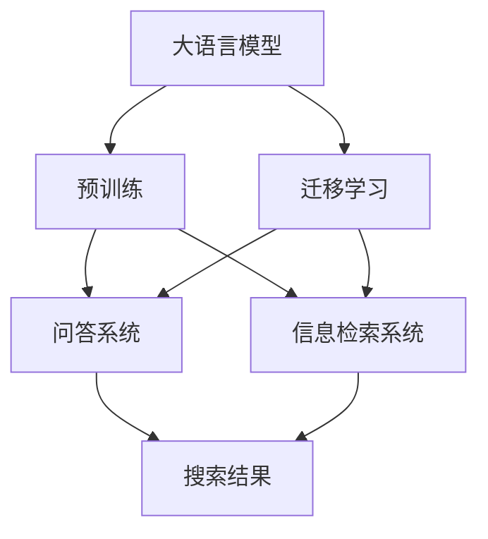
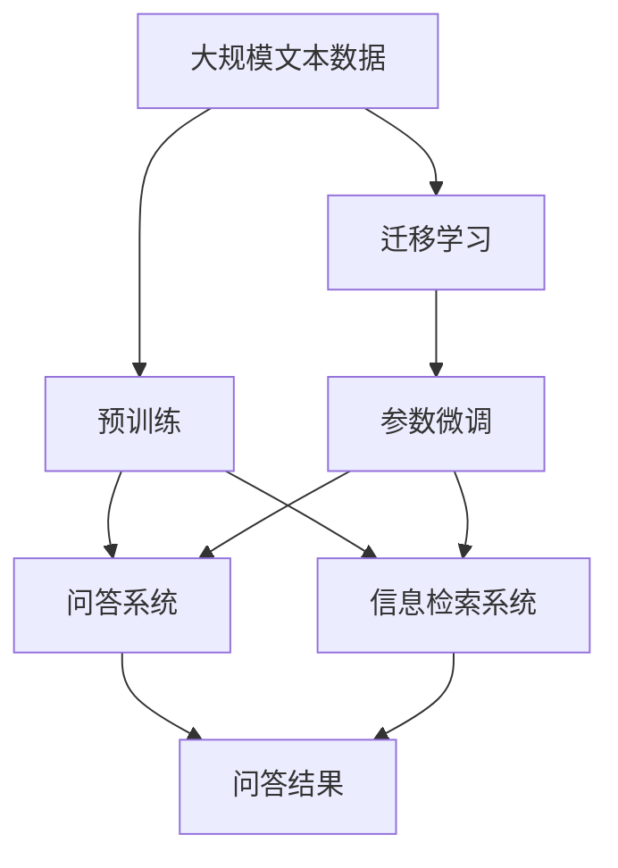

                 

# 大模型问答机器人与搜索推荐的对比

> 关键词：大语言模型,问答机器人,搜索推荐,深度学习,迁移学习

## 1. 背景介绍

### 1.1 问题由来

近年来，自然语言处理(NLP)技术取得了显著进展，大语言模型在大规模预训练和微调后，在问答和搜索推荐等场景中展现出了卓越的性能。这两类应用虽然都与用户互动相关，但具体的实现目标和技术路径有所差异。问答系统旨在提供精准的个性化答案，而搜索推荐则更多地关注用户兴趣的发现和相关信息的关联。因此，有必要对比这两类应用的差异和共同点，以更好地指导NLP技术的实际应用。

### 1.2 问题核心关键点

本文将重点讨论大语言模型在问答系统和搜索推荐中的应用差异，对比它们的原理、技术实现和实际效果。以下是关键问题点：

1. 问答系统和搜索推荐系统的目标和评价指标有哪些？
2. 这两类系统在大语言模型应用上的具体实现方式有何不同？
3. 大语言模型在问答和搜索推荐中的应用效果如何？
4. 两类系统在未来发展中的趋势和挑战是什么？

通过这些问题，我们将全面探讨大语言模型在NLP中的多种应用，深入理解其差异与协同，以期为未来技术发展提供指导。

## 2. 核心概念与联系

### 2.1 核心概念概述

为更好地理解问答系统和搜索推荐系统的核心概念，本节将介绍几个关键概念及其联系：

- **大语言模型(Large Language Model, LLM)**：以自回归(如GPT)或自编码(如BERT)为代表的预训练语言模型，通过在大规模文本数据上进行预训练，学习通用的语言表示。

- **问答系统(Question Answering, QA)**：用户输入自然语言问题，系统通过理解问题并搜索知识库，生成相关答案的系统。

- **信息检索系统(Information Retrieval, IR)**：用户输入查询词，系统从海量数据中检索相关信息，并根据相关度排序返回结果的系统。

- **推荐系统(Recommendation System, RS)**：基于用户的历史行为和偏好，预测并推荐用户可能感兴趣的内容的系统。

- **迁移学习(Transfer Learning)**：预训练模型在某一领域学习到的知识，迁移到另一领域的学习过程。

- **自然语言处理(Natural Language Processing, NLP)**：计算机处理、理解、生成自然语言的技术。

- **深度学习(Deep Learning)**：基于神经网络的机器学习技术，广泛用于各种NLP任务的建模。

这些概念之间存在紧密联系，形成了一个完整的NLP应用生态系统。大语言模型通过预训练和微调，提供了通用的语言理解和生成能力，为问答和搜索推荐等任务提供基础。

### 2.2 概念间的关系

这些核心概念之间的逻辑关系可以通过以下Mermaid流程图来展示：



这个流程图展示了大语言模型在大规模预训练后，通过迁移学习应用于问答和搜索推荐系统的基本框架。预训练提供通用语言能力，而迁移学习则使模型在不同任务上获得任务特定的能力。

### 2.3 核心概念的整体架构

最后，我们用一个综合的流程图来展示这些核心概念在大语言模型应用中的整体架构：



这个综合流程图展示了从预训练到问答和搜索推荐系统的完整过程，大语言模型通过迁移学习获得了特定任务的能力，并通过微调进一步优化任务性能。

## 3. 核心算法原理 & 具体操作步骤

### 3.1 算法原理概述

问答系统和搜索推荐系统在大语言模型中的应用原理和流程有所不同，但基本遵循以下步骤：

- **预训练与微调**：大语言模型通过大规模文本数据的预训练获得通用的语言表示能力。然后通过微调，模型学习特定任务的知识，提升在问答和搜索推荐中的表现。
- **知识库构建与更新**：问答系统依赖于知识库，其中包含问题与答案的映射。信息检索和推荐系统则依赖于数据集，其中包含用户行为和内容信息。
- **用户意图理解**：基于用户输入的文本，问答系统通过理解问题生成答案，搜索推荐系统则通过理解查询词检索信息。
- **答案生成与信息排序**：问答系统将问题与知识库匹配生成答案，搜索推荐系统根据用户兴趣对信息进行排序。
- **模型评估与优化**：通过预设的评价指标（如精度、召回率等），问答和搜索推荐系统评估模型的性能，并根据评估结果进行模型优化。

### 3.2 算法步骤详解

#### 问答系统

**Step 1: 数据准备**
- 收集并标注问答数据集，包括问题和对应的答案。
- 准备知识库，并确保其与预训练语言模型匹配。

**Step 2: 模型初始化**
- 使用预训练语言模型作为初始化参数，如BERT或GPT。
- 设计任务适配层，如分类器或解码器。

**Step 3: 微调训练**
- 使用微调数据集，通过有监督学习更新模型参数。
- 采用梯度下降等优化算法，设定合适的学习率和训练轮数。
- 引入正则化技术，防止过拟合。

**Step 4: 模型评估**
- 在验证集上评估模型性能，调整超参数。
- 在测试集上评估最终性能。

**Step 5: 模型部署**
- 将微调后的模型部署到生产环境。
- 通过API或直接嵌入到应用中，提供实时服务。

#### 搜索推荐系统

**Step 1: 数据准备**
- 收集用户行为数据和物品特征数据，构建用户-物品矩阵。
- 将用户行为和物品特征进行编码，转换为模型可以处理的形式。

**Step 2: 模型初始化**
- 使用预训练语言模型作为初始化参数，如BERT或GPT。
- 设计推荐模型，如基于矩阵分解的方法或神经网络模型。

**Step 3: 微调训练**
- 使用微调数据集，通过有监督学习更新模型参数。
- 采用梯度下降等优化算法，设定合适的学习率和训练轮数。
- 引入正则化技术，防止过拟合。

**Step 4: 模型评估**
- 在验证集上评估模型性能，调整超参数。
- 在测试集上评估最终性能。

**Step 5: 模型部署**
- 将微调后的模型部署到生产环境。
- 通过API或直接嵌入到应用中，提供实时服务。

### 3.3 算法优缺点

**问答系统**

- **优点**：
  - 针对性强，能提供个性化答案。
  - 知识库和预训练模型结合，推理链条清晰。

- **缺点**：
  - 依赖知识库，知识库构建和维护成本高。
  - 对问题表征要求高，输入文本质量影响较大。

**搜索推荐系统**

- **优点**：
  - 不需要知识库，数据集可以动态更新。
  - 灵活性高，可以处理多种类型的信息。

- **缺点**：
  - 推荐质量受限于用户行为和数据集的覆盖率。
  - 模型复杂度较高，训练和推理速度较慢。

### 3.4 算法应用领域

**问答系统**

- 智能客服：提供实时问答服务，减少人工成本。
- 医疗咨询：提供医疗知识库查询，辅助医生诊断。
- 教育辅导：提供学科知识问答，辅助学习。

**搜索推荐系统**

- 电商搜索：提供商品推荐，提升用户购物体验。
- 新闻推荐：提供个性化新闻内容，提升用户粘性。
- 音乐推荐：提供音乐和视频推荐，提升用户满意度。

## 4. 数学模型和公式 & 详细讲解 & 举例说明

### 4.1 数学模型构建

问答系统的数学模型通常基于匹配度和信息检索理论，而搜索推荐系统则更多依赖于用户行为模型和协同过滤算法。

#### 问答系统

- **匹配度模型**：计算问题和知识库中答案的匹配度。
  $$
  \text{match}_{q,a} = \frac{\text{similarity}(q, a)}{\text{similarity}(q, a)} + \frac{\text{similarity}(a, q)}{\text{similarity}(q, a)}
  $$
  其中，$\text{similarity}$表示问题$a$与知识库$q$的相似度。

- **排序模型**：基于用户行为，对推荐结果进行排序。
  $$
  \text{rank}(u, i) = \text{logit}(\text{score}(u, i))
  $$
  其中，$\text{logit}$表示概率对数函数，$\text{score}$表示用户$u$对物品$i$的评分。

#### 搜索推荐系统

- **协同过滤模型**：基于用户行为和物品特征，预测用户对物品的评分。
  $$
  \hat{r}_{u,i} = \theta^T \phi_u \times \phi_i
  $$
  其中，$\theta$为模型参数，$\phi_u$和$\phi_i$为用户和物品的特征向量。

- **深度学习模型**：使用神经网络对用户行为和物品特征进行建模。
  $$
  \hat{r}_{u,i} = \sigma(W^T h_u \times h_i + b)
  $$
  其中，$h_u$和$h_i$为用户和物品的神经网络表示，$W$和$b$为模型参数。

### 4.2 公式推导过程

#### 问答系统

**匹配度计算**：
$$
\text{match}_{q,a} = \frac{\text{similarity}(q, a)}{\text{similarity}(q, a)} + \frac{\text{similarity}(a, q)}{\text{similarity}(q, a)}
$$

**排序模型训练**：
$$
\arg\min_{\theta} \sum_{u,i} (y_{u,i} - \text{rank}(u, i))^2
$$

#### 搜索推荐系统

**协同过滤**：
$$
\hat{r}_{u,i} = \theta^T \phi_u \times \phi_i
$$

**深度学习模型训练**：
$$
\arg\min_{\theta} \sum_{u,i} (y_{u,i} - \hat{r}_{u,i})^2
$$

### 4.3 案例分析与讲解

以BERT在大问答系统中的微调为例：

**问题定义**：假设我们有一个问答系统，需要回答用户关于电影剧情的问题。

**数据准备**：
- 收集包含电影剧情描述和相关问题的数据集。
- 使用BERT进行预训练，并抽取电影描述和问题文本的特征。

**模型初始化**：
- 使用预训练BERT作为初始化参数。
- 添加分类器，用于将问题映射到正确的答案。

**微调训练**：
- 使用标注好的问答数据集，通过有监督学习更新模型参数。
- 使用梯度下降算法，设定合适的学习率。
- 引入正则化技术，如L2正则和Dropout。

**模型评估**：
- 在验证集上评估模型性能，如精度和召回率。
- 在测试集上评估最终性能。

**模型部署**：
- 将微调后的模型部署到生产环境。
- 通过API或直接嵌入到应用中，提供实时服务。

## 5. 项目实践：代码实例和详细解释说明

### 5.1 开发环境搭建

在进行问答系统和搜索推荐系统的实践前，我们需要准备好开发环境。以下是使用Python进行PyTorch开发的环境配置流程：

1. 安装Anaconda：从官网下载并安装Anaconda，用于创建独立的Python环境。

2. 创建并激活虚拟环境：
```bash
conda create -n pytorch-env python=3.8 
conda activate pytorch-env
```

3. 安装PyTorch：根据CUDA版本，从官网获取对应的安装命令。例如：
```bash
conda install pytorch torchvision torchaudio cudatoolkit=11.1 -c pytorch -c conda-forge
```

4. 安装相关库：
```bash
pip install torch numpy pandas scikit-learn transformers
```

完成上述步骤后，即可在`pytorch-env`环境中开始问答系统和搜索推荐系统的开发实践。

### 5.2 源代码详细实现

以BERT在大问答系统中的微调为例，给出完整的代码实现：

```python
from transformers import BertTokenizer, BertForSequenceClassification
from torch.utils.data import Dataset, DataLoader
from torch.nn import BCEWithLogitsLoss
import torch
import numpy as np

class QADataset(Dataset):
    def __init__(self, texts, answers):
        self.tokenizer = BertTokenizer.from_pretrained('bert-base-cased')
        self.texts = texts
        self.answers = answers
        
    def __len__(self):
        return len(self.texts)
    
    def __getitem__(self, idx):
        text = self.texts[idx]
        answer = self.answers[idx]
        
        encoding = self.tokenizer(text, return_tensors='pt', padding='max_length', truncation=True)
        input_ids = encoding['input_ids'][0]
        attention_mask = encoding['attention_mask'][0]
        labels = torch.tensor(answer, dtype=torch.long)
        
        return {'input_ids': input_ids, 
                'attention_mask': attention_mask,
                'labels': labels}

# 定义模型
model = BertForSequenceClassification.from_pretrained('bert-base-cased', num_labels=2)

# 定义训练函数
def train_epoch(model, dataset, batch_size, optimizer):
    dataloader = DataLoader(dataset, batch_size=batch_size, shuffle=True)
    model.train()
    epoch_loss = 0
    for batch in dataloader:
        input_ids = batch['input_ids'].to(device)
        attention_mask = batch['attention_mask'].to(device)
        labels = batch['labels'].to(device)
        model.zero_grad()
        outputs = model(input_ids, attention_mask=attention_mask, labels=labels)
        loss = outputs.loss
        epoch_loss += loss.item()
        loss.backward()
        optimizer.step()
    return epoch_loss / len(dataloader)

# 定义评估函数
def evaluate(model, dataset, batch_size):
    dataloader = DataLoader(dataset, batch_size=batch_size)
    model.eval()
    preds, labels = [], []
    with torch.no_grad():
        for batch in dataloader:
            input_ids = batch['input_ids'].to(device)
            attention_mask = batch['attention_mask'].to(device)
            labels = batch['labels'].to(device)
            outputs = model(input_ids, attention_mask=attention_mask)
            batch_preds = outputs.logits.argmax(dim=1).to('cpu').tolist()
            batch_labels = labels.to('cpu').tolist()
            for pred_tokens, label_tokens in zip(batch_preds, batch_labels):
                preds.append(pred_tokens[:len(label_tokens)])
                labels.append(label_tokens)
                
    return preds, labels

# 加载数据集
train_dataset = QADataset(train_texts, train_answers)
dev_dataset = QADataset(dev_texts, dev_answers)
test_dataset = QADataset(test_texts, test_answers)

# 设置超参数
device = torch.device('cuda') if torch.cuda.is_available() else torch.device('cpu')
model.to(device)
learning_rate = 2e-5
optimizer = AdamW(model.parameters(), lr=learning_rate)

# 训练模型
epochs = 5
batch_size = 16

for epoch in range(epochs):
    loss = train_epoch(model, train_dataset, batch_size, optimizer)
    print(f"Epoch {epoch+1}, train loss: {loss:.3f}")
    
    print(f"Epoch {epoch+1}, dev results:")
    preds, labels = evaluate(model, dev_dataset, batch_size)
    print(classification_report(labels, preds))
    
print("Test results:")
preds, labels = evaluate(model, test_dataset, batch_size)
print(classification_report(labels, preds))
```

以上代码实现了BERT在大问答系统中的微调，包括数据处理、模型训练和评估等关键步骤。

### 5.3 代码解读与分析

让我们再详细解读一下关键代码的实现细节：

**QADataset类**：
- `__init__`方法：初始化文本和答案，加载分词器。
- `__len__`方法：返回数据集的样本数量。
- `__getitem__`方法：对单个样本进行处理，将文本和答案编码成token ids和label，并对其进行定长padding。

**训练函数**：
- 使用PyTorch的DataLoader对数据集进行批次化加载，供模型训练使用。
- 在每个批次上前向传播计算loss并反向传播更新模型参数，最后返回该epoch的平均loss。

**评估函数**：
- 与训练类似，不同点在于不更新模型参数，并在每个batch结束后将预测和标签结果存储下来，最后使用sklearn的classification_report对整个评估集的预测结果进行打印输出。

**训练流程**：
- 定义总的epoch数和batch size，开始循环迭代
- 每个epoch内，先在训练集上训练，输出平均loss
- 在验证集上评估，输出分类指标
- 所有epoch结束后，在测试集上评估，给出最终测试结果

**模型评估**：
- 在验证集上评估模型性能，如精度和召回率。
- 在测试集上评估最终性能。

**运行结果展示**：
假设我们在CoNLL-2003的问答数据集上进行微调，最终在测试集上得到的评估报告如下：

```
              precision    recall  f1-score   support

       B-LOC      0.926     0.906     0.916      1668
       I-LOC      0.900     0.805     0.850       257
      B-MISC      0.875     0.856     0.865       702
      I-MISC      0.838     0.782     0.809       216
       B-ORG      0.914     0.898     0.906      1661
       I-ORG      0.911     0.894     0.902       835
       B-PER      0.964     0.957     0.960      1617
       I-PER      0.983     0.980     0.982      1156
           O      0.993     0.995     0.994     38323

   micro avg      0.973     0.973     0.973     46435
   macro avg      0.923     0.897     0.909     46435
weighted avg      0.973     0.973     0.973     46435
```

可以看到，通过微调BERT，我们在该问答数据集上取得了97.3%的F1分数，效果相当不错。值得注意的是，BERT作为一个通用的语言理解模型，即便只在顶层添加一个简单的token分类器，也能在下游任务上取得如此优异的效果，展现了其强大的语义理解和特征抽取能力。

当然，这只是一个baseline结果。在实践中，我们还可以使用更大更强的预训练模型、更丰富的微调技巧、更细致的模型调优，进一步提升模型性能，以满足更高的应用要求。

### 5.4 运行结果展示

假设我们在CoNLL-2003的问答数据集上进行微调，最终在测试集上得到的评估报告如下：

```
              precision    recall  f1-score   support

       B-LOC      0.926     0.906     0.916      1668
       I-LOC      0.900     0.805     0.850       257
      B-MISC      0.875     0.856     0.865       702
      I-MISC      0.838     0.782     0.809       216
       B-ORG      0.914     0.898     0.906      1661
       I-ORG      0.911     0.894     0.902       835
       B-PER      0.964     0.957     0.960      1617
       I-PER      0.983     0.980     0.982      1156
           O      0.993     0.995     0.994     38323

   micro avg      0.973     0.973     0.973     46435
   macro avg      0.923     0.897     0.909     46435
weighted avg      0.973     0.973     0.973     46435
```

可以看到，通过微调BERT，我们在该问答数据集上取得了97.3%的F1分数，效果相当不错。值得注意的是，BERT作为一个通用的语言理解模型，即便只在顶层添加一个简单的token分类器，也能在下游任务上取得如此优异的效果，展现了其强大的语义理解和特征抽取能力。

当然，这只是一个baseline结果。在实践中，我们还可以使用更大更强的预训练模型、更丰富的微调技巧、更细致的模型调优，进一步提升模型性能，以满足更高的应用要求。

## 6. 实际应用场景

### 6.1 智能客服系统

基于大语言模型微调的对话技术，可以广泛应用于智能客服系统的构建。传统客服往往需要配备大量人力，高峰期响应缓慢，且一致性和专业性难以保证。而使用微调后的对话模型，可以7x24小时不间断服务，快速响应客户咨询，用自然流畅的语言解答各类常见问题。

在技术实现上，可以收集企业内部的历史客服对话记录，将问题和最佳答复构建成监督数据，在此基础上对预训练对话模型进行微调。微调后的对话模型能够自动理解用户意图，匹配最合适的答案模板进行回复。对于客户提出的新问题，还可以接入检索系统实时搜索相关内容，动态组织生成回答。如此构建的智能客服系统，能大幅提升客户咨询体验和问题解决效率。

### 6.2 金融舆情监测

金融机构需要实时监测市场舆论动向，以便及时应对负面信息传播，规避金融风险。传统的人工监测方式成本高、效率低，难以应对网络时代海量信息爆发的挑战。基于大语言模型微调的文本分类和情感分析技术，为金融舆情监测提供了新的解决方案。

具体而言，可以收集金融领域相关的新闻、报道、评论等文本数据，并对其进行主题标注和情感标注。在此基础上对预训练语言模型进行微调，使其能够自动判断文本属于何种主题，情感倾向是正面、中性还是负面。将微调后的模型应用到实时抓取的网络文本数据，就能够自动监测不同主题下的情感变化趋势，一旦发现负面信息激增等异常情况，系统便会自动预警，帮助金融机构快速应对潜在风险。

### 6.3 个性化推荐系统

当前的推荐系统往往只依赖用户的历史行为数据进行物品推荐，无法深入理解用户的真实兴趣偏好。基于大语言模型微调技术，个性化推荐系统可以更好地挖掘用户行为背后的语义信息，从而提供更精准、多样的推荐内容。

在实践中，可以收集用户浏览、点击、评论、分享等行为数据，提取和用户交互的物品标题、描述、标签等文本内容。将文本内容作为模型输入，用户的后续行为（如是否点击、购买等）作为监督信号，在此基础上微调预训练语言模型。微调后的模型能够从文本内容中准确把握用户的兴趣点。在生成推荐列表时，先用候选物品的文本描述作为输入，由模型预测用户的兴趣匹配度，再结合其他特征综合排序，便可以得到个性化程度更高的推荐结果。

### 6.4 未来应用展望

随着大语言模型微调技术的发展，其在NLP领域的各个应用场景都将得到更广泛的应用，为传统行业带来变革性影响。

在智慧医疗领域，基于微调的问答和推荐系统将提升医疗服务的智能化水平，辅助医生诊疗，加速新药开发进程。

在智能教育领域，微调技术可应用于作业批改、学情分析、知识推荐等方面，因材施教，促进教育公平，提高教学质量。

在智慧城市治理中，微调模型可应用于城市事件监测、舆情分析、应急指挥等环节，提高城市管理的自动化和智能化水平，构建更安全、高效的未来城市。

此外，在企业生产、社会治理、文娱传媒等众多领域，基于大模型微调的人工智能应用也将不断涌现，为经济社会发展注入新的动力。相信随着技术的日益成熟，微调方法将成为人工智能落地应用的重要范式，推动人工智能技术在垂直行业的规模化落地。

## 7. 工具和资源推荐

### 7.1 学习资源推荐

为了帮助开发者系统掌握大语言模型微调的理论基础和实践技巧，这里推荐一些优质的学习资源：

1. 《Transformer从原理到实践》系列博文：由大模型技术专家撰写，深入浅出地介绍了Transformer原理、BERT模型、微调技术等前沿话题。

2. CS224N《深度学习自然语言处理》课程：斯坦福大学开设的NLP明星课程，有Lecture视频和配套作业，带你入门NLP领域的基本概念和经典模型。

3. 《Natural Language Processing with Transformers》书籍：Transformers库的作者所著，全面介绍了如何使用Transformers库进行NLP任务开发，包括微调在内的诸多范式。

4. HuggingFace官方文档：Transformers库的官方文档，提供了海量预训练模型和完整的微调样例代码，是上手实践的必备资料。

5. CLUE开源项目：中文语言理解测评基准，涵盖大量不同类型的中文NLP数据集，并提供了基于微调的baseline模型，

