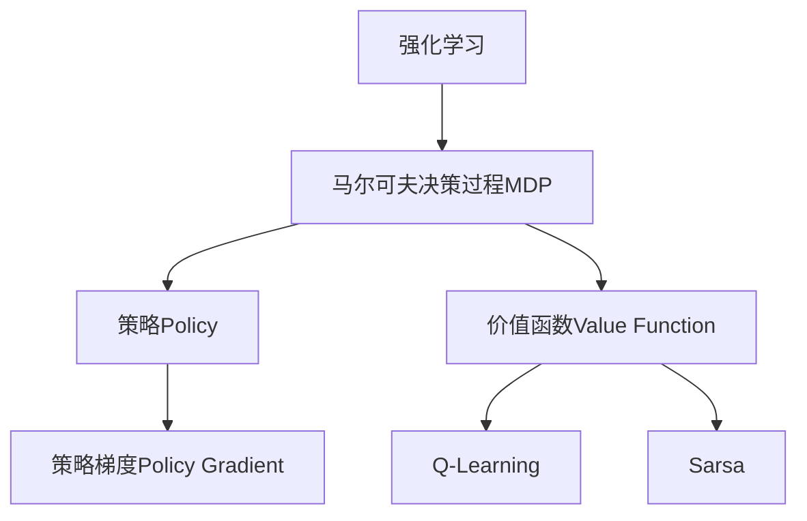

好的,我会严格按照要求,以专业的技术语言写一篇关于策略梯度的深度博文。

# 策略梯度(Policy Gradient) - 原理与代码实例讲解

## 1. 背景介绍

### 1.1 问题的由来

在强化学习领域,我们常常会遇到一个棘手的问题:如何在一个复杂的环境中,寻找一个最优的策略(policy),使得智能体(agent)能够获得最大的累积回报(cumulative reward)。这种问题通常被建模为马尔可夫决策过程(Markov Decision Process, MDP),其中智能体与环境进行交互,根据当前状态选择一个动作,然后获得相应的奖励并转移到下一个状态。

传统的强化学习算法,如Q-Learning和Sarsa,是基于价值函数(value function)的,它们试图估计每个状态或状态-动作对的价值,然后根据这些价值选择动作。然而,这些算法在处理连续状态和动作空间时会遇到维数灾难(curse of dimensionality)的问题,因为价值函数需要对每个可能的状态或状态-动作对进行估计,这在高维空间中是不可行的。

### 1.2 研究现状

为了解决这个问题,策略梯度(Policy Gradient)方法应运而生。与基于价值函数的方法不同,策略梯度方法直接对策略函数(policy function)进行参数化,并通过梯度上升(gradient ascent)的方式优化策略参数,使得期望的累积回报最大化。这种方法避免了对价值函数的估计,因此可以很好地应对连续状态和动作空间。

策略梯度方法最早可以追溯到20世纪80年代,但直到近年来,随着深度学习的兴起,它才获得了广泛的关注和应用。深度神经网络可以很好地表示复杂的策略函数,并通过端到端的训练来优化策略参数。这种结合策略梯度和深度学习的方法被称为深度强化学习(Deep Reinforcement Learning),在许多领域取得了令人瞩目的成就,如AlphaGo战胜人类顶尖棋手、OpenAI的机器人手臂等。

### 1.3 研究意义

策略梯度方法具有重要的理论意义和应用价值:

- 理论意义:策略梯度为解决连续控制问题提供了一种有效的方法,推动了强化学习理论的发展。
- 应用价值:策略梯度可以应用于机器人控制、自动驾驶、智能投资决策等多个领域,为解决实际问题提供了强有力的工具。

### 1.4 本文结构

本文将全面介绍策略梯度的原理、算法细节、数学模型、代码实现和应用场景,内容安排如下:

1. 背景介绍
2. 核心概念与联系
3. 核心算法原理与具体操作步骤
4. 数学模型和公式详细讲解与举例说明
5. 项目实践:代码实例和详细解释说明
6. 实际应用场景
7. 工具和资源推荐
8. 总结:未来发展趋势与挑战
9. 附录:常见问题与解答

## 2. 核心概念与联系

在深入讨论策略梯度算法之前,我们需要先了解一些核心概念及其相互关系。

- **强化学习(Reinforcement Learning)**: 一种机器学习范式,智能体通过与环境交互来学习如何获取最大化的累积奖励。
- **马尔可夫决策过程(Markov Decision Process, MDP)**: 强化学习问题的数学模型,包括状态集合、动作集合、状态转移概率和奖励函数。
- **策略(Policy)**: 定义了在每个状态下智能体选择动作的策略,是一个从状态到动作的映射函数。
- **价值函数(Value Function)**: 评估一个状态或状态-动作对的预期累积奖励,是Q-Learning和Sarsa等算法的基础。
- **策略梯度(Policy Gradient)**: 直接对策略函数进行参数化,并通过梯度上升优化策略参数,使期望的累积奖励最大化。

策略梯度方法与基于价值函数的方法(如Q-Learning和Sarsa)是两种不同的强化学习范式,前者直接优化策略函数,后者则是通过估计价值函数来间接获得最优策略。两种方法各有优缺点,策略梯度方法更适合处理连续空间问题,而基于价值函数的方法在离散空间问题上表现更好。

## 3. 核心算法原理与具体操作步骤

### 3.1 算法原理概述

策略梯度算法的核心思想是:通过对策略函数进行参数化,然后沿着使期望累积奖励最大化的方向调整策略参数,从而找到最优策略。具体来说,算法包括以下几个关键步骤:

1. **参数化策略函数**: 使用一个可微分的函数(通常是神经网络)来表示策略,将策略参数化为 $\theta$。
2. **计算期望累积奖励**: 对于给定的策略参数 $\theta$,计算期望的累积奖励 $J(\theta)$。
3. **计算策略梯度**: 计算期望累积奖励 $J(\theta)$ 相对于策略参数 $\theta$ 的梯度 $\nabla_\theta J(\theta)$。
4. **梯度上升**: 沿着梯度方向更新策略参数,使期望累积奖励最大化: $\theta \leftarrow \theta + \alpha \nabla_\theta J(\theta)$,其中 $\alpha$ 是学习率。

重复上述步骤,直到策略收敛或达到预设的停止条件。

### 3.2 算法步骤详解

现在让我们更详细地介绍策略梯度算法的具体步骤。

#### 3.2.1 参数化策略函数

我们使用一个可微分的函数来表示策略,通常是一个神经网络。对于离散动作空间,策略函数 $\pi_\theta(a|s)$ 可以表示为在状态 $s$ 下选择动作 $a$ 的概率分布。对于连续动作空间,策略函数 $\pi_\theta(s)$ 可以直接输出动作值。

策略函数由参数 $\theta$ 参数化,我们的目标是找到一组最优参数 $\theta^*$,使得在该策略下,期望的累积奖励最大化。

#### 3.2.2 计算期望累积奖励

对于一个给定的策略参数 $\theta$,我们需要计算相应的期望累积奖励 $J(\theta)$。在episodic环境中,它可以被定义为:

$$J(\theta) = \mathbb{E}_{\tau \sim \pi_\theta} \left[ \sum_{t=0}^{T} \gamma^t r(s_t, a_t) \right]$$

其中 $\tau = (s_0, a_0, r_0, s_1, a_1, r_1, \dots, s_T)$ 表示一个轨迹(trajectory),由状态、动作和奖励组成。$\gamma \in [0, 1]$ 是折现因子,用于权衡即时奖励和长期奖励的重要性。$T$ 是轨迹的长度。

在连续环境中,期望累积奖励可以被定义为:

$$J(\theta) = \mathbb{E}_{\tau \sim \pi_\theta} \left[ \sum_{t=0}^{\infty} \gamma^t r(s_t, a_t) \right]$$

#### 3.2.3 计算策略梯度

为了最大化期望累积奖励 $J(\theta)$,我们需要计算其相对于策略参数 $\theta$ 的梯度 $\nabla_\theta J(\theta)$。根据策略梯度定理(Policy Gradient Theorem),我们可以将梯度表示为:

$$\nabla_\theta J(\theta) = \mathbb{E}_{\tau \sim \pi_\theta} \left[ \sum_{t=0}^{T} \nabla_\theta \log \pi_\theta(a_t|s_t) Q^{\pi_\theta}(s_t, a_t) \right]$$

其中 $Q^{\pi_\theta}(s_t, a_t)$ 是在策略 $\pi_\theta$ 下,从状态 $s_t$ 执行动作 $a_t$ 开始的期望累积奖励,也被称为状态-动作值函数(State-Action Value Function)。

由于直接计算期望是困难的,我们通常使用蒙特卡罗方法或时序差分方法来估计梯度。

#### 3.2.4 梯度上升

获得策略梯度 $\nabla_\theta J(\theta)$ 后,我们可以沿着梯度方向更新策略参数:

$$\theta \leftarrow \theta + \alpha \nabla_\theta J(\theta)$$

其中 $\alpha$ 是学习率,用于控制更新步长的大小。

重复上述步骤,直到策略收敛或达到预设的停止条件。

### 3.3 算法优缺点

策略梯度算法具有以下优点:

- 可以很好地处理连续状态和动作空间,避免了维数灾难的问题。
- 通过端到端的训练,可以直接优化策略函数,无需估计价值函数。
- 具有较好的收敛性和稳定性。

但它也存在一些缺点:

- 收敛速度较慢,需要大量的样本数据。
- 存在高方差问题,梯度估计可能具有很大的方差。
- 难以处理稀疏奖励问题,即环境中奖励信号很少。

### 3.4 算法应用领域

策略梯度算法可以应用于各种连续控制问题,包括但不限于:

- 机器人控制
- 自动驾驶
- 智能投资决策
- 视频游戏AI
- 机器人手臂控制
- 四轴飞行器控制
- 动作规划

## 4. 数学模型和公式详细讲解与举例说明

### 4.1 数学模型构建

在介绍策略梯度算法的数学模型之前,我们先回顾一下强化学习问题的数学模型:马尔可夫决策过程(MDP)。

一个MDP可以被定义为一个五元组 $(S, A, P, R, \gamma)$,其中:

- $S$ 是状态集合
- $A$ 是动作集合
- $P(s'|s,a)$ 是状态转移概率,表示在状态 $s$ 执行动作 $a$ 后,转移到状态 $s'$ 的概率
- $R(s,a)$ 是奖励函数,表示在状态 $s$ 执行动作 $a$ 后获得的即时奖励
- $\gamma \in [0, 1]$ 是折现因子,用于权衡即时奖励和长期奖励的重要性

在MDP中,我们的目标是找到一个最优策略 $\pi^*$,使得在该策略下,期望的累积奖励最大化:

$$\pi^* = \arg\max_\pi J(\pi)$$

其中 $J(\pi)$ 是策略 $\pi$ 下的期望累积奖励,定义如下:

$$J(\pi) = \mathbb{E}_{\tau \sim \pi} \left[ \sum_{t=0}^{T} \gamma^t r(s_t, a_t) \right]$$

在策略梯度算法中,我们将策略 $\pi$ 参数化为一个可微分的函数 $\pi_\theta$,其中 $\theta$ 是策略参数。然后,我们通过计算期望累积奖励 $J(\theta)$ 相对于策略参数 $\theta$ 的梯度 $\nabla_\theta J(\theta)$,并沿着梯度方向更新参数,从而找到最优策略参数 $\theta^*$。

### 4.2 公式推导过程

现在,我们来推导策略梯度定理,它揭示了如何计算期望累积奖励 $J(\theta)$ 相对于策略参数 $\theta$ 的梯度。

首先,我们将期望累积奖励 $J(\theta)$ 表示为:

$$J(\theta) = \mathbb{E}_{\tau \sim \pi_\theta} \left[ \sum_{t=0}^{T} \gamma^t r(s_t, a_t) \right] = \int_\tau P(\tau|\theta) \left( \sum_{t=0}^{T} \gamma^t r(s_t, a_t) \right) d\tau$$

其中 $P(\tau|\theta)$ 是在策略 $\pi_\theta$ 下