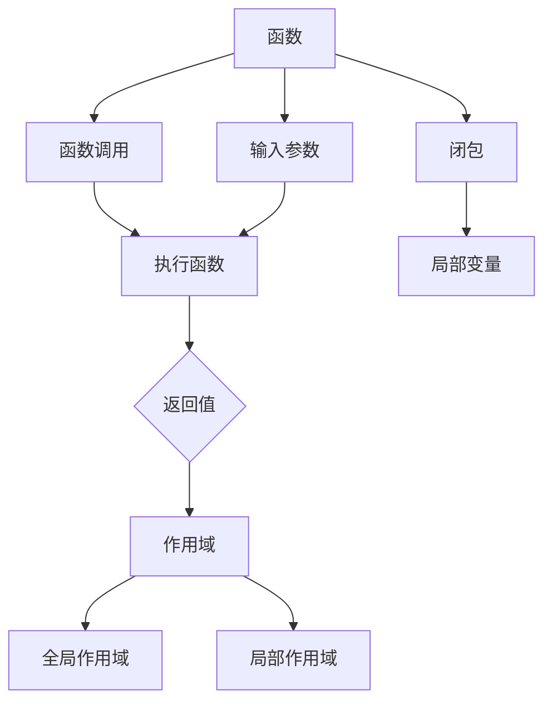

> 函数调用, AI Agent, 大模型应用, 编程范式, 代码复用, 动态绑定, 高级语言特性

# 【大模型应用开发 动手做AI Agent】什么是Function Calling

在构建大模型应用，特别是AI Agent时，理解函数调用（Function Calling）的概念至关重要。函数调用不仅是编程语言的核心特性之一，也是实现代码复用、抽象和模块化的重要手段。本文将深入探讨函数调用的概念、原理、实现以及在AI Agent开发中的应用，帮助读者在大模型应用开发中更好地运用这一编程范式。

## 1. 背景介绍

随着人工智能技术的飞速发展，大模型在各个领域得到广泛应用。AI Agent作为人工智能的一种形式，能够模拟人类智能行为，完成特定任务。在开发AI Agent时，函数调用是实现代码复用、模块化设计、提高开发效率的关键。

### 1.1 问题的由来

在传统的编程实践中，每当遇到相似或重复的任务时，开发者往往会复制粘贴代码，这不仅增加了代码维护的难度，也降低了代码的可读性。为了解决这个问题，函数调用的概念被引入编程语言中。

### 1.2 研究现状

函数调用在大多数编程语言中都有实现，如C/C++、Java、Python等。随着编程语言的发展，函数调用也变得更加灵活和强大，例如支持动态绑定、高阶函数、闭包等特性。

### 1.3 研究意义

理解函数调用对于AI Agent开发具有重要意义：

- 提高代码复用性，减少代码冗余。
- 实现模块化设计，提高代码的可读性和可维护性。
- 利用高级语言特性，实现更复杂的功能。
- 提高开发效率，缩短开发周期。

### 1.4 本文结构

本文将按照以下结构展开：

- 介绍函数调用的核心概念与联系。
- 阐述函数调用的原理和具体操作步骤。
- 分析函数调用的数学模型和公式。
- 展示函数调用的项目实践和代码实例。
- 探讨函数调用在实际应用场景中的应用和未来展望。
- 总结函数调用在AI Agent开发中的重要性。

## 2. 核心概念与联系

### 2.1 核心概念

#### 函数

函数是一段具有名称的、可重复使用的代码块，用于执行特定任务。函数可以接受输入参数，并返回输出结果。

#### 函数调用

函数调用是指执行函数代码的过程。通过函数调用，可以重复执行函数，并利用其返回值。

#### 作用域

作用域决定了变量和函数的可访问性。全局作用域指在整个代码块中都可以访问的变量和函数，局部作用域指只在一个代码块中可以访问的变量和函数。

#### 闭包

闭包是指函数及其所引用的局部变量构成的复合表达式。

### 2.2 核心概念原理和架构的 Mermaid 流程图



## 3. 核心算法原理 & 具体操作步骤

### 3.1 算法原理概述

函数调用涉及到编译器或解释器的处理过程，主要包括以下步骤：

1. 解析函数调用语句，确定函数名称和参数。
2. 查找函数定义，获取函数参数类型和返回类型。
3. 创建新的作用域，将参数值绑定到相应的变量。
4. 执行函数体代码。
5. 返回函数结果。

### 3.2 算法步骤详解

以下是函数调用的具体步骤：

1. **解析函数调用语句**：编译器或解释器解析函数调用语句，获取函数名称和参数列表。

2. **查找函数定义**：根据函数名称，查找函数定义。如果找不到，则报错。

3. **创建新的作用域**：为函数调用创建一个新的作用域，用于存储函数参数和局部变量。

4. **绑定参数值**：将函数调用语句中的参数值绑定到函数定义中的参数变量。

5. **执行函数体代码**：执行函数体中的代码，按照代码逻辑进行计算。

6. **返回函数结果**：函数执行完成后，返回计算结果。

7. **恢复作用域**：函数调用结束后，恢复之前的全局或局部作用域。

### 3.3 算法优缺点

#### 优点

- **代码复用**：函数调用允许开发者将代码封装成函数，方便重复使用。
- **模块化设计**：函数调用有助于实现模块化设计，提高代码的可读性和可维护性。
- **提高效率**：通过函数调用，可以避免代码冗余，提高开发效率。

#### 缺点

- **性能开销**：函数调用涉及到作用域的创建和销毁，可能带来一定的性能开销。
- **调试困难**：函数调用可能会增加调试难度，特别是在多层嵌套的情况下。

### 3.4 算法应用领域

函数调用几乎在所有编程语言和软件系统中都有应用，以下是一些常见的应用领域：

- **应用程序开发**：用于实现模块化、代码复用。
- **系统编程**：用于实现操作系统、数据库等系统软件的构建。
- **人工智能开发**：用于实现AI Agent的模块化设计，提高开发效率。

## 4. 数学模型和公式 & 详细讲解 & 举例说明

### 4.1 数学模型构建

函数调用可以通过数学模型进行描述，以下是一个简单的例子：

假设函数 $f(x)$ 的输入为 $x$，输出为 $y$，则函数调用可以表示为：

$$
y = f(x)
$$

其中 $x$ 为函数输入，$y$ 为函数输出。

### 4.2 公式推导过程

函数调用的数学模型比较简单，因为函数本身就是数学函数的抽象表示。在实际应用中，函数调用通常不涉及复杂的数学推导。

### 4.3 案例分析与讲解

以下是一个使用Python实现函数调用的例子：

```python
def add(a, b):
    return a + b

result = add(3, 4)
print(result)  # 输出 7
```

在上面的例子中，`add` 是一个函数，它接收两个参数 `a` 和 `b`，并返回它们的和。在函数调用 `add(3, 4)` 中，`3` 和 `4` 是函数的输入，`7` 是函数的输出。

## 5. 项目实践：代码实例和详细解释说明

### 5.1 开发环境搭建

为了进行函数调用的项目实践，我们需要搭建一个简单的Python开发环境。以下是搭建步骤：

1. 安装Python：从Python官网下载并安装Python。
2. 安装PyCharm：下载PyCharm Community Edition，并安装。
3. 创建Python项目：在PyCharm中创建一个新的Python项目。

### 5.2 源代码详细实现

以下是一个简单的函数调用示例：

```python
def greet(name):
    return f"Hello, {name}!"

def main():
    name = input("Please enter your name: ")
    message = greet(name)
    print(message)

if __name__ == "__main__":
    main()
```

在上面的例子中，`greet` 是一个接收名字作为参数的函数，它返回一个问候语。`main` 函数是程序的入口点，它读取用户输入的名字，并调用 `greet` 函数，最后打印问候语。

### 5.3 代码解读与分析

- `greet` 函数：定义了一个名为 `greet` 的函数，它接受一个名为 `name` 的参数，并返回一个包含名字的问候语。
- `main` 函数：定义了程序的入口点 `main`。它首先从用户那里读取名字，然后调用 `greet` 函数，并将返回的问候语打印到控制台。
- `if __name__ == "__main__":`：这个条件语句确保当该脚本作为主程序运行时，执行 `main` 函数。

### 5.4 运行结果展示

运行上述程序，输入名字“Alice”，输出结果为：

```
Please enter your name: Alice
Hello, Alice!
```

## 6. 实际应用场景

函数调用在AI Agent开发中有着广泛的应用，以下是一些常见的应用场景：

- **感知模块**：用于处理传感器数据，如摄像头图像、语音信号等。
- **决策模块**：用于根据感知数据做出决策，如路径规划、目标识别等。
- **执行模块**：用于执行决策结果，如控制机械臂、发送指令等。

在AI Agent中，函数调用可以用于封装模块化功能，提高代码的可读性和可维护性。例如，以下是一个AI Agent中感知模块的示例：

```python
class PerceptionModule:
    def __init__(self):
        # 初始化传感器
        self.sensor = Camera()

    def get_image(self):
        # 获取摄像头图像
        return self.sensor.capture_image()

def process_image(image):
    # 处理图像
    return detect_objects(image)

def main():
    perception_module = PerceptionModule()
    image = perception_module.get_image()
    objects = process_image(image)
    # ... 进行下一步操作 ...

if __name__ == "__main__":
    main()
```

在上面的例子中，`PerceptionModule` 类封装了感知模块的功能，包括获取摄像头图像和处理图像。`get_image` 方法用于获取摄像头图像，`process_image` 方法用于处理图像。

## 7. 工具和资源推荐

### 7.1 学习资源推荐

- 《Python编程：从入门到实践》
- 《Effective Python：编写高质量Python代码的59个有效方法》
- 《Python核心编程》
- 《人工智能：一种现代方法》

### 7.2 开发工具推荐

- PyCharm
- Visual Studio Code
- Jupyter Notebook

### 7.3 相关论文推荐

- 《Python编程语言规范》
- 《Python编程：高级编程技巧》
- 《函数式编程：模式、高级编程和架构》

## 8. 总结：未来发展趋势与挑战

### 8.1 研究成果总结

函数调用是编程语言的核心特性之一，它在代码复用、模块化设计、提高开发效率等方面发挥着重要作用。在AI Agent开发中，函数调用可以用于封装模块化功能，提高代码的可读性和可维护性。

### 8.2 未来发展趋势

随着编程语言和人工智能技术的不断发展，函数调用可能会出现以下发展趋势：

- **函数式编程的普及**：函数式编程是一种强调函数使用和表达式的编程范式，它具有简洁、易读、易维护等优点。未来，函数式编程可能会在AI Agent开发中得到更广泛的应用。
- **高阶函数和闭包的普及**：高阶函数和闭包是函数式编程的核心概念，它们可以用于实现更复杂的编程模式。未来，高阶函数和闭包可能会在AI Agent开发中得到更广泛的应用。
- **函数调用的自动化**：随着编程语言的发展，函数调用的过程可能会变得更加自动化，例如通过代码生成技术自动生成函数调用代码。

### 8.3 面临的挑战

函数调用在AI Agent开发中面临以下挑战：

- **性能瓶颈**：函数调用涉及到作用域的创建和销毁，可能会带来一定的性能开销。在资源受限的设备上，函数调用的性能瓶颈可能会更加明显。
- **调试困难**：在复杂的AI Agent中，函数调用可能会变得更加复杂，调试难度也会相应增加。

### 8.4 研究展望

为了应对函数调用在AI Agent开发中面临的挑战，以下研究方向值得关注：

- **优化函数调用性能**：研究如何优化函数调用的性能，例如通过代码生成技术减少函数调用的开销。
- **开发新的编程范式**：探索新的编程范式，例如函数式编程，以更好地适应AI Agent的开发需求。
- **提高函数调用的可解释性**：研究如何提高函数调用的可解释性，以便更好地理解和调试AI Agent。

## 9. 附录：常见问题与解答

**Q1：函数调用和过程调用有什么区别？**

A：函数调用和过程调用是两种不同的编程范式。函数调用通常用于执行计算任务，并返回结果。而过程调用通常用于执行一些非计算任务，如输入输出操作等，通常不返回结果。

**Q2：什么是闭包？**

A：闭包是指函数及其所引用的局部变量构成的复合表达式。闭包可以记住并访问其创建时的作用域中的变量，即使在函数外部也能访问这些变量。

**Q3：函数调用在AI Agent开发中有哪些优势？**

A：函数调用在AI Agent开发中有以下优势：
- 提高代码复用性。
- 实现模块化设计。
- 利用高级语言特性。
- 提高开发效率。

**Q4：函数调用在AI Agent开发中有哪些挑战？**

A：函数调用在AI Agent开发中面临以下挑战：
- 性能瓶颈。
- 调试困难。

**Q5：如何优化函数调用性能？**

A：优化函数调用性能可以从以下几个方面入手：
- 使用代码生成技术减少函数调用的开销。
- 选择合适的编程范式，例如函数式编程。
- 优化代码结构，减少函数调用的深度和广度。

作者：禅与计算机程序设计艺术 / Zen and the Art of Computer Programming