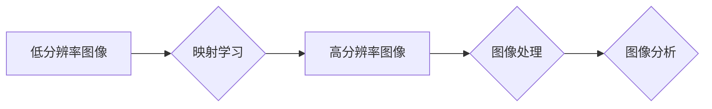

# 一切皆是映射：超分辨率图像重建与深度学习

> 关键词：超分辨率图像重建，深度学习，卷积神经网络，映射学习，图像处理，计算机视觉

## 1. 背景介绍

随着数字图像技术的发展，图像分辨率在不断提升，然而，由于硬件和传输限制，仍有许多场景需要处理低分辨率图像。超分辨率图像重建（Super-Resolution Image Reconstruction）技术应运而生，它旨在从低分辨率图像中恢复出高分辨率图像。深度学习，特别是卷积神经网络（Convolutional Neural Networks, CNNs），为超分辨率图像重建提供了强大的工具和方法。

### 1.1 问题的由来

低分辨率图像在很多应用中都是不可避免的，如手机摄像头、卫星图像、遥感图像等。这些图像由于分辨率限制，细节信息丢失，影响了后续的图像分析、识别和监控等任务。超分辨率技术旨在解决这个问题，通过算法增强图像细节，提高图像质量。

### 1.2 研究现状

传统的超分辨率方法主要基于图像处理技术，如插值、滤波等。然而，这些方法在处理复杂场景时效果有限。近年来，深度学习在图像处理领域的应用取得了突破性进展，特别是在超分辨率图像重建方面。

### 1.3 研究意义

超分辨率图像重建技术在多个领域具有广泛的应用价值，如：

- 提高图像质量，改善视觉体验。
- 增强图像细节，便于后续图像分析。
- 减少存储和传输需求，提高效率。
- 在医疗、遥感、监控等领域有重要应用。

### 1.4 本文结构

本文将首先介绍超分辨率图像重建的基本概念和原理，然后深入探讨基于深度学习的超分辨率方法，包括核心算法、数学模型和实际应用案例。最后，将对超分辨率图像重建的未来发展趋势和挑战进行展望。

## 2. 核心概念与联系

### 2.1 超分辨率图像重建的概念

超分辨率图像重建是指从低分辨率图像中恢复出高分辨率图像的过程。这个过程可以看作是将低分辨率图像（低维空间）映射到高分辨率图像（高维空间）的过程。

### 2.2 核心概念原理和架构的 Mermaid 流程图



### 2.3 核心概念的联系

- **低分辨率图像**：是超分辨率图像重建的起点，通常分辨率较低，细节信息丢失。
- **映射学习**：通过深度学习模型学习低分辨率到高分辨率之间的映射关系。
- **高分辨率图像**：是超分辨率图像重建的目标，通常分辨率较高，细节信息丰富。
- **图像处理**：对高分辨率图像进行后处理，如去噪、锐化等。
- **图像分析**：对高分辨率图像进行进一步的分析，如特征提取、目标识别等。

## 3. 核心算法原理 & 具体操作步骤

### 3.1 算法原理概述

基于深度学习的超分辨率图像重建算法通常采用以下步骤：

1. **数据准备**：收集低分辨率和高分辨率图像对作为训练数据。
2. **模型构建**：选择合适的深度学习模型，如CNN。
3. **模型训练**：使用训练数据训练模型，学习低分辨率到高分辨率之间的映射关系。
4. **图像重建**：使用训练好的模型对低分辨率图像进行重建，得到高分辨率图像。

### 3.2 算法步骤详解

1. **数据准备**：收集大量低分辨率和高分辨率图像对，用于训练深度学习模型。

2. **模型构建**：选择合适的深度学习模型。常见的模型有：

    - **CNN**：卷积神经网络，适用于图像处理任务。
    - **生成对抗网络（GANs）**：通过对抗训练学习从低分辨率到高分辨率的映射。
    - **变分自编码器（VAEs）**：通过编码器和解码器学习低分辨率到高分辨率的映射。

3. **模型训练**：使用训练数据训练模型，学习低分辨率到高分辨率之间的映射关系。训练过程中，模型会不断调整参数，使得高分辨率图像与真实高分辨率图像之间的差异最小化。

4. **图像重建**：使用训练好的模型对低分辨率图像进行重建，得到高分辨率图像。

### 3.3 算法优缺点

**优点**：

- **效果显著**：基于深度学习的超分辨率图像重建方法通常能够取得比传统方法更好的效果。
- **泛化能力强**：深度学习模型可以学习到复杂的映射关系，具有较强的泛化能力。
- **自动学习**：深度学习模型可以自动从数据中学习特征，无需人工设计。

**缺点**：

- **计算复杂度高**：深度学习模型的训练需要大量的计算资源。
- **对训练数据依赖性强**：模型的性能很大程度上取决于训练数据的质量和数量。
- **可解释性差**：深度学习模型通常被认为是黑盒，其内部工作机制难以解释。

### 3.4 算法应用领域

基于深度学习的超分辨率图像重建方法在多个领域有广泛的应用，包括：

- **医疗影像**：提高医学图像的分辨率，辅助医生进行诊断。
- **遥感图像**：提高遥感图像的分辨率，用于环境监测、灾害评估等。
- **视频处理**：提高视频的分辨率，改善视觉效果。
- **图像编辑**：自动增强图像细节，提高图像质量。

## 4. 数学模型和公式 & 详细讲解 & 举例说明

### 4.1 数学模型构建

基于深度学习的超分辨率图像重建可以看作是一个映射学习问题。假设低分辨率图像为 $I_{LR}$，高分辨率图像为 $I_{HR}$，则映射函数为 $F(I_{LR}) = I_{HR}$。

### 4.2 公式推导过程

假设低分辨率图像 $I_{LR}$ 可以表示为：

$$
I_{LR} = \mathcal{T}I_{HR} + \epsilon
$$

其中 $\mathcal{T}$ 为降采样矩阵，$\epsilon$ 为噪声项。

则映射函数可以表示为：

$$
I_{HR} = \mathcal{T}^{-1}I_{LR} + \mathcal{T}^{-1}\epsilon
$$

其中 $\mathcal{T}^{-1}$ 为降采样矩阵的逆矩阵。

### 4.3 案例分析与讲解

以下是一个简单的CNN超分辨率模型示例：

```python
import torch
import torch.nn as nn

class SuperResolutionCNN(nn.Module):
    def __init__(self):
        super(SuperResolutionCNN, self).__init__()
        self.conv1 = nn.Conv2d(3, 64, kernel_size=3, stride=1, padding=1)
        self.relu = nn.ReLU()
        self.conv2 = nn.Conv2d(64, 64, kernel_size=3, stride=1, padding=1)
        self.conv3 = nn.Conv2d(64, 3, kernel_size=3, stride=1, padding=1)

    def forward(self, x):
        x = self.conv1(x)
        x = self.relu(x)
        x = self.conv2(x)
        x = self.relu(x)
        x = self.conv3(x)
        return x
```

该模型包含三个卷积层，第一个卷积层用于提取特征，后两个卷积层用于上采样，恢复高分辨率图像。

## 5. 项目实践：代码实例和详细解释说明

### 5.1 开发环境搭建

为了进行超分辨率图像重建的项目实践，我们需要以下开发环境：

- Python 3.6或更高版本
- PyTorch 1.2或更高版本
- OpenCV 3.4或更高版本

### 5.2 源代码详细实现

以下是一个简单的超分辨率图像重建项目示例：

```python
import torch
import torch.nn as nn
import cv2
import numpy as np
from torchvision import transforms
from PIL import Image
from torch.utils.data import DataLoader, Dataset

# 定义超分辨率数据集
class SuperResolutionDataset(Dataset):
    def __init__(self, lr_images, hr_images, transform=None):
        self.lr_images = lr_images
        self.hr_images = hr_images
        self.transform = transform

    def __len__(self):
        return len(self.lr_images)

    def __getitem__(self, idx):
        lr_image = Image.fromarray(self.lr_images[idx])
        hr_image = Image.fromarray(self.hr_images[idx])
        
        if self.transform:
            lr_image = self.transform(lr_image)
            hr_image = self.transform(hr_image)
        
        return lr_image, hr_image

# 定义超分辨率模型
class SuperResolutionCNN(nn.Module):
    # ...（此处省略模型定义代码）...

# 训练模型
def train(model, train_loader, optimizer, criterion, num_epochs):
    model.train()
    for epoch in range(num_epochs):
        for lr_image, hr_image in train_loader:
            lr_image = lr_image.to(device)
            hr_image = hr_image.to(device)
            
            optimizer.zero_grad()
            output = model(lr_image)
            loss = criterion(output, hr_image)
            loss.backward()
            optimizer.step()
            
        print(f"Epoch {epoch+1}/{num_epochs}, Loss: {loss.item()}")

# 加载数据集
transform = transforms.Compose([
    transforms.ToTensor(),
    transforms.Normalize(mean=[0.5, 0.5, 0.5], std=[0.5, 0.5, 0.5])
])

train_dataset = SuperResolutionDataset(lr_images, hr_images, transform)
train_loader = DataLoader(train_dataset, batch_size=4, shuffle=True)

# 初始化模型、优化器和损失函数
model = SuperResolutionCNN().to(device)
optimizer = torch.optim.Adam(model.parameters(), lr=0.001)
criterion = nn.MSELoss()

# 训练模型
train(model, train_loader, optimizer, criterion, num_epochs=100)

# 保存模型
torch.save(model.state_dict(), 'super_resolution_model.pth')
```

### 5.3 代码解读与分析

- **SuperResolutionDataset类**：定义了超分辨率数据集，包含低分辨率和高分辨率图像。
- **SuperResolutionCNN类**：定义了超分辨率CNN模型，包含三个卷积层和ReLU激活函数。
- **train函数**：训练模型的函数，包含前向传播、计算损失、反向传播和参数更新等步骤。
- **数据加载**：使用transformers库将图像转换为张量，并归一化。
- **训练模型**：使用DataLoader加载训练数据，训练模型，并保存模型参数。

### 5.4 运行结果展示

训练完成后，可以使用以下代码进行图像重建：

```python
# 加载模型
model.load_state_dict(torch.load('super_resolution_model.pth'))

# 加载低分辨率图像
lr_image = cv2.imread('low_resolution_image.jpg')

# 转换为张量
lr_tensor = torch.from_numpy(lr_image).float().permute(2, 0, 1).unsqueeze(0)

# 转换为设备
lr_tensor = lr_tensor.to(device)

# 重建高分辨率图像
output = model(lr_tensor)

# 保存高分辨率图像
output = output.squeeze(0).cpu().numpy().transpose(1, 2, 0)
cv2.imwrite('high_resolution_image.jpg', output)
```

运行上述代码后，可以得到重建的高分辨率图像。

## 6. 实际应用场景

### 6.1 医学影像

超分辨率图像重建技术在医学影像领域有着广泛的应用，如：

- **提高医学图像的分辨率**：辅助医生进行更精确的诊断。
- **增强医学图像的细节**：帮助医生更好地识别病变区域。
- **提高医学图像的可视化效果**：改善医生的工作体验。

### 6.2 遥感图像

超分辨率图像重建技术在遥感图像领域也有着重要的应用，如：

- **提高遥感图像的分辨率**：获取更详细的地面信息。
- **增强遥感图像的细节**：识别更小的地面目标。
- **提高遥感图像的可用性**：便于后续图像分析。

### 6.3 视频处理

超分辨率图像重建技术在视频处理领域也有着广泛的应用，如：

- **提高视频的分辨率**：改善视频的视觉效果。
- **增强视频的细节**：提高视频的可视化效果。
- **减少视频的存储和传输需求**：提高视频处理效率。

## 7. 工具和资源推荐

### 7.1 学习资源推荐

- 《深度学习》系列书籍：由Ian Goodfellow等作者撰写，是深度学习的经典教材。
- 《PyTorch深度学习》书籍：由Adrien Rosebrock撰写，是PyTorch框架的入门指南。
- OpenCV官方文档：OpenCV是开源的计算机视觉库，提供了丰富的图像处理函数。

### 7.2 开发工具推荐

- PyTorch：深度学习框架，适用于图像处理、自然语言处理等领域。
- OpenCV：计算机视觉库，提供了丰富的图像处理函数。
- NumPy：科学计算库，用于数值计算。

### 7.3 相关论文推荐

- Single Image Super-Resolution Using Deep Convolutional Networks: A Review
- Image Super-Resolution: A Survey
- Learning a Deep Convolutional Network for Image Super-Resolution

## 8. 总结：未来发展趋势与挑战

### 8.1 研究成果总结

本文介绍了超分辨率图像重建技术的基本概念、原理和应用，重点探讨了基于深度学习的超分辨率方法。通过实例展示了如何使用PyTorch实现超分辨率图像重建，并介绍了其在医学影像、遥感图像和视频处理等领域的应用。

### 8.2 未来发展趋势

未来，基于深度学习的超分辨率图像重建技术将朝着以下方向发展：

- **模型轻量化**：减少模型参数量和计算复杂度，降低硬件需求。
- **实时性**：提高算法的实时性，满足实时应用需求。
- **可解释性**：提高模型的可解释性，便于理解模型决策过程。

### 8.3 面临的挑战

尽管超分辨率图像重建技术取得了显著进展，但仍面临以下挑战：

- **计算复杂度高**：深度学习模型的训练和推理需要大量的计算资源。
- **数据依赖性强**：模型的性能很大程度上取决于训练数据的质量和数量。
- **可解释性差**：深度学习模型通常被认为是黑盒，其内部工作机制难以解释。

### 8.4 研究展望

未来，超分辨率图像重建技术将与其他人工智能技术（如强化学习、迁移学习等）相结合，进一步提高其性能和应用范围。同时，随着硬件技术的发展，超分辨率图像重建技术将得到更广泛的应用。

## 9. 附录：常见问题与解答

**Q1：超分辨率图像重建技术有哪些应用场景？**

A1：超分辨率图像重建技术在医学影像、遥感图像、视频处理等领域有广泛的应用。

**Q2：如何选择合适的超分辨率模型？**

A2：选择合适的超分辨率模型需要根据具体任务和数据特点进行考虑。常见的模型有CNN、GANs、VAEs等。

**Q3：如何提高超分辨率图像重建的性能？**

A3：提高超分辨率图像重建的性能可以通过以下方法：

- **数据增强**：使用数据增强技术扩充训练数据。
- **模型优化**：优化模型结构和参数。
- **算法改进**：改进超分辨率算法，如使用更先进的网络结构、引入正则化等。

**Q4：如何评估超分辨率图像重建的性能？**

A4：评估超分辨率图像重建的性能可以使用多种指标，如峰值信噪比（PSNR）、结构相似性指数（SSIM）等。

**Q5：超分辨率图像重建技术有哪些局限性？**

A5：超分辨率图像重建技术的局限性包括计算复杂度高、数据依赖性强、可解释性差等。

作者：禅与计算机程序设计艺术 / Zen and the Art of Computer Programming