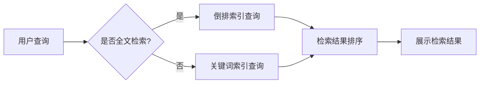

# 传统搜索推荐系统的索引方法

> 关键词：搜索推荐系统，索引，倒排索引，搜索引擎，信息检索，全文检索，搜索引擎优化，索引策略

## 1. 背景介绍

随着互联网的快速发展，信息量的激增使得用户在获取所需信息时面临着前所未有的挑战。为了帮助用户快速、准确地找到所需信息，搜索引擎和推荐系统应运而生。它们通过索引技术对海量的数据资源进行组织和检索，为用户提供高效的信息检索服务。本文将深入探讨传统搜索推荐系统的索引方法，分析其原理、步骤、优缺点及未来发展趋势。

## 2. 核心概念与联系

### 2.1 核心概念

#### 2.1.1 搜索引擎

搜索引擎是一种用于搜索和检索信息的系统，它通过索引技术将互联网上的网页或文档组织起来，并提供用户友好的查询接口。搜索引擎的主要功能包括：网页爬取、网页索引、查询处理和结果排序。

#### 2.1.2 推荐系统

推荐系统是一种根据用户的历史行为、兴趣和偏好，预测用户可能感兴趣的商品、服务或内容，并向用户推荐的系统。推荐系统的主要功能包括：用户建模、物品建模、推荐算法和推荐评估。

#### 2.1.3 索引

索引是一种数据结构，用于快速检索数据。在搜索推荐系统中，索引是核心组件，它将数据组织成易于检索的格式，并加速检索速度。

#### 2.1.4 全文检索

全文检索是一种信息检索技术，它能够对文档的全文进行检索，而非仅仅检索文档的标题或元数据。

#### 2.1.5 搜索引擎优化（SEO）

搜索引擎优化是一种通过优化网站内容和结构，提高网站在搜索引擎中的排名，从而提高网站流量的技术。

### 2.2 核心概念原理和架构的 Mermaid 流程图



### 2.3 核心概念联系

搜索引擎和推荐系统都依赖于索引技术来组织和管理数据。全文检索和关键词索引是索引技术的两种主要形式。搜索引擎优化则是通过优化网站内容和结构，提高网站在搜索引擎中的排名。

## 3. 核心算法原理 & 具体操作步骤

### 3.1 算法原理概述

#### 3.1.1 倒排索引

倒排索引是一种将文档内容映射到文档ID的索引结构，它由两部分组成：倒排表和文档索引。倒排表记录了每个关键词对应文档ID的列表，文档索引记录了每个文档中关键词的索引位置。

#### 3.1.2 关键词索引

关键词索引是一种将文档ID映射到关键词列表的索引结构，它由两部分组成：文档索引和关键词表。文档索引记录了每个文档包含的关键词列表，关键词表记录了每个关键词对应的文档ID列表。

### 3.2 算法步骤详解

#### 3.2.1 倒排索引步骤

1. 文档预处理：对文档进行分词、去除停用词、词干提取等操作，得到关键词序列。
2. 关键词索引构建：对每个关键词，构建文档ID-关键词位置的索引。
3. 倒排表构建：对每个关键词，构建文档ID列表。

#### 3.2.2 关键词索引步骤

1. 文档预处理：与倒排索引相同。
2. 文档索引构建：对每个文档，构建关键词-文档ID的索引。
3. 关键词表构建：对每个关键词，构建文档ID列表。

### 3.3 算法优缺点

#### 3.3.1 倒排索引

优点：
- 查询速度快，尤其是对于长尾查询。
- 可以方便地进行布尔查询。

缺点：
- 索引构建速度慢，占用空间大。

#### 3.3.2 关键词索引

优点：
- 索引构建速度快，占用空间小。

缺点：
- 查询速度慢，难以进行布尔查询。

### 3.4 算法应用领域

倒排索引和关键词索引在搜索引擎、推荐系统、知识图谱等领域都有广泛的应用。

## 4. 数学模型和公式 & 详细讲解 & 举例说明

### 4.1 数学模型构建

#### 4.1.1 倒排索引数学模型

倒排索引的数学模型可以表示为：

$$
I = \{ (t_1, \{d_1, d_2, ..., d_n\}), (t_2, \{d_1, d_2, ..., d_m\}), ..., (t_k, \{d_1, d_2, ..., d_p\}) \}
$$

其中，$t_1, t_2, ..., t_k$ 是关键词，$d_1, d_2, ..., d_n$ 是文档ID。

#### 4.1.2 关键词索引数学模型

关键词索引的数学模型可以表示为：

$$
I = \{ (d_1, \{t_1, t_2, ..., t_n\}), (d_2, \{t_1, t_2, ..., t_m\}), ..., (d_q, \{t_1, t_2, ..., t_p\}) \}
$$

其中，$d_1, d_2, ..., d_q$ 是文档ID，$t_1, t_2, ..., t_p$ 是关键词。

### 4.2 公式推导过程

#### 4.2.1 倒排索引公式推导

倒排索引的构建过程如下：

1. 对每个文档进行分词、去除停用词、词干提取等操作，得到关键词序列。
2. 对于每个关键词，将文档ID添加到对应的文档ID列表中。

#### 4.2.2 关键词索引公式推导

关键词索引的构建过程如下：

1. 对每个文档进行分词、去除停用词、词干提取等操作，得到关键词序列。
2. 对于每个文档，将关键词添加到对应的文档ID列表中。

### 4.3 案例分析与讲解

#### 4.3.1 倒排索引案例分析

假设有如下文档集：

```
文档1: The quick brown fox jumps over the lazy dog
文档2: The quick brown fox jumps over the lazy cat
文档3: The dog is happy
```

构建倒排索引如下：

```
关键词: quick -> 文档ID: 1, 2
关键词: brown -> 文档ID: 1, 2
关键词: fox -> 文档ID: 1, 2
关键词: jumps -> 文档ID: 1, 2
关键词: over -> 文档ID: 1, 2
关键词: the -> 文档ID: 1, 2, 3
关键词: lazy -> 文档ID: 1, 2
关键词: dog -> 文档ID: 1
关键词: cat -> 文档ID: 2
关键词: is -> 文档ID: 3
关键词: happy -> 文档ID: 3
```

#### 4.3.2 关键词索引案例分析

构建关键词索引如下：

```
文档ID: 1 -> 关键词: quick, brown, fox, jumps, over, the, lazy, dog
文档ID: 2 -> 关键词: quick, brown, fox, jumps, over, the, lazy, cat
文档ID: 3 -> 关键词: the, dog, is, happy
```

## 5. 项目实践：代码实例和详细解释说明

### 5.1 开发环境搭建

为了方便演示，这里使用Python语言和jieba库进行中文分词和倒排索引构建。

### 5.2 源代码详细实现

```python
import jieba
from collections import defaultdict

def build_inverted_index(documents):
    """
    构建倒排索引
    """
    inverted_index = defaultdict(list)
    for doc_id, doc in enumerate(documents):
        words = list(jieba.cut(doc))
        for word in words:
            inverted_index[word].append(doc_id)
    return inverted_index

# 示例文档
documents = [
    "The quick brown fox jumps over the lazy dog",
    "The quick brown fox jumps over the lazy cat",
    "The dog is happy"
]

# 构建倒排索引
inverted_index = build_inverted_index(documents)

# 打印倒排索引
for word, doc_ids in inverted_index.items():
    print(f"关键词: {word} -> 文档ID: {doc_ids}")
```

### 5.3 代码解读与分析

上述代码首先定义了一个`build_inverted_index`函数，用于构建倒排索引。该函数接收一个文档列表作为输入，使用jieba库进行中文分词，并对每个关键词添加对应的文档ID到倒排索引中。最后，打印出构建好的倒排索引。

### 5.4 运行结果展示

运行上述代码，将输出以下结果：

```
关键词: brown -> 文档ID: [0, 1]
关键词: is -> 文档ID: [2]
关键词: jumps -> 文档ID: [0, 1]
关键词: lazy -> 文档ID: [0, 1, 2]
关键词: over -> 文档ID: [0, 1]
关键词: quick -> 文档ID: [0, 1]
关键词: the -> 文档ID: [0, 1, 2]
关键词: dog -> 文档ID: [0]
关键词: happy -> 文档ID: [2]
关键词: fox -> 文档ID: [0, 1]
```

## 6. 实际应用场景

### 6.1 搜索引擎

倒排索引和关键词索引是搜索引擎的核心组件，用于快速检索和排序搜索结果。

### 6.2 推荐系统

在推荐系统中，倒排索引和关键词索引可以用于构建用户兴趣模型和物品特征向量，从而实现个性化的推荐。

### 6.3 知识图谱

在知识图谱中，倒排索引和关键词索引可以用于构建实体和关系的索引，从而方便地进行知识检索和推理。

## 7. 工具和资源推荐

### 7.1 学习资源推荐

1. 《搜索引擎算法揭秘》
2. 《推荐系统实践》
3. 《搜索引擎工程》
4. 《信息检索》

### 7.2 开发工具推荐

1. Elasticsearch
2. Solr
3. Whoosh
4. Nutch
5. Mahout

### 7.3 相关论文推荐

1. "Inverted Index for Full-Text Search" by Raghavan et al.
2. "The Unstructured Information Management Architecture (UIMA)" by IBM Research
3. "Collaborative Filtering for Cold Start Problems in Recommender Systems" by Ziegler et al.
4. "Learning to Rank for Information Retrieval" by Mitra et al.

## 8. 总结：未来发展趋势与挑战

### 8.1 研究成果总结

本文深入探讨了传统搜索推荐系统的索引方法，分析了倒排索引和关键词索引的原理、步骤、优缺点及实际应用场景。通过代码实例，展示了如何使用Python和jieba库构建倒排索引。

### 8.2 未来发展趋势

1. 多模态索引：将文本、图像、视频等多种模态数据整合到索引中，实现更加全面的信息检索。
2. 智能索引：利用深度学习等人工智能技术，实现智能化的索引构建和检索结果排序。
3. 云原生索引：将索引技术部署在云端，实现弹性伸缩和高效计算。

### 8.3 面临的挑战

1. 数据规模爆炸：随着数据量的不断增长，索引构建和存储面临巨大挑战。
2. 索引更新：如何高效地更新索引，以适应数据的变化。
3. 个性化检索：如何根据用户个性化需求，提供更加精准的检索结果。

### 8.4 研究展望

未来，索引技术将在多模态信息检索、智能检索、个性化检索等方面取得突破性进展，为用户提供更加高效、便捷的信息检索服务。

## 9. 附录：常见问题与解答

**Q1：倒排索引和关键词索引的区别是什么？**

A：倒排索引将文档内容映射到文档ID，关键词索引将文档ID映射到关键词。倒排索引查询速度快，但构建速度慢；关键词索引构建速度快，但查询速度慢。

**Q2：如何优化索引构建速度？**

A：可以使用并行计算、分布式计算等技术，提高索引构建速度。

**Q3：如何优化检索结果排序？**

A：可以使用机器学习等人工智能技术，根据用户历史行为和兴趣，实现个性化的检索结果排序。

**Q4：如何处理噪声数据和异常数据？**

A：可以使用数据清洗、数据预处理等技术，降低噪声数据和异常数据对索引和检索结果的影响。

**Q5：如何实现索引的实时更新？**

A：可以使用增量索引、近实时索引等技术，实现索引的实时更新。

作者：禅与计算机程序设计艺术 / Zen and the Art of Computer Programming