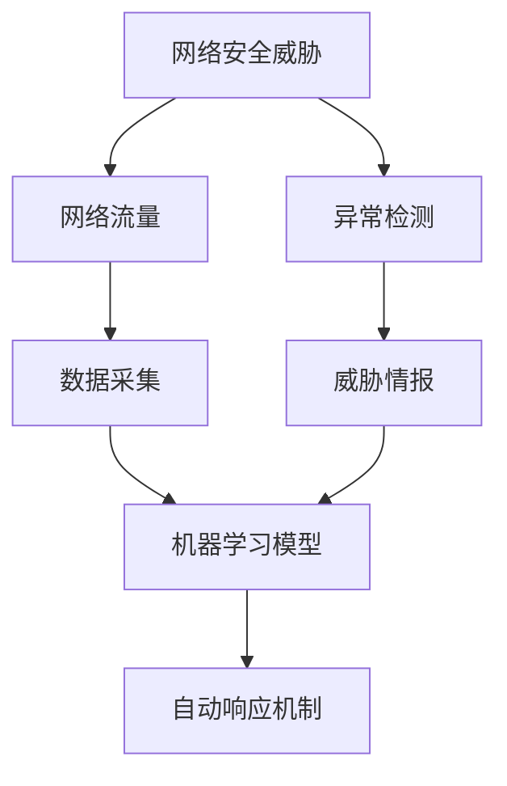
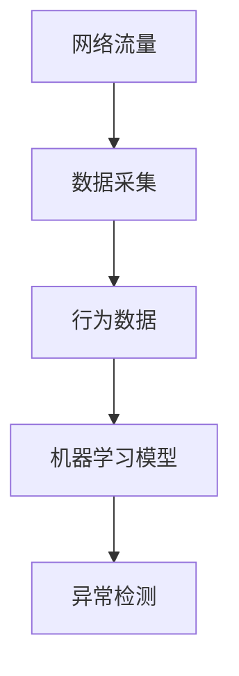
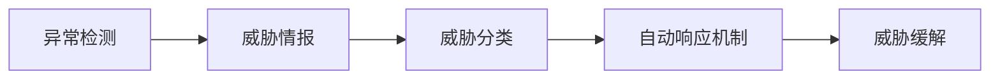
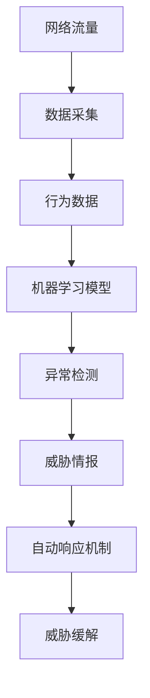

                 

# AI人工智能代理工作流AI Agent WorkFlow：代理工作流在网络安全的关键作用

## 1. 背景介绍

### 1.1 问题由来
随着数字化转型的加速，企业和组织面临着愈发复杂的安全挑战。网络攻击者利用先进的技术手段和庞大的数据资源，不断创新攻击模式，传统静态的安全策略已难以应对。AI人工智能代理工作流（AI Agent Workflow）应运而生，利用机器学习和大数据技术，动态、智能地监控和分析网络活动，及时发现并应对安全威胁，成为保障网络安全的重要工具。

### 1.2 问题核心关键点
AI人工智能代理工作流通过在网络中部署智能代理，实时监控网络流量，收集行为数据，利用机器学习模型进行数据分析，识别异常行为和潜在威胁，从而实现自动化安全监控。其核心在于：
- **数据采集**：通过网络设备、日志文件、应用数据等多源数据采集行为数据。
- **数据分析**：运用机器学习算法分析行为数据，识别异常和威胁。
- **自动响应**：根据威胁情况，自动生成响应措施，如隔离、封堵等。
- **持续学习**：通过不断更新模型，提高检测和响应的准确性。

### 1.3 问题研究意义
AI人工智能代理工作流是网络安全防护的创新方向，其关键意义在于：
- 提高安全防护的自动化水平，减少人工干预，降低误报率。
- 提升威胁检测的准确性，实时应对新出现的安全威胁。
- 降低防护成本，适应复杂的业务环境。
- 增强业务连续性和数据完整性，保障关键系统的稳定运行。

## 2. 核心概念与联系

### 2.1 核心概念概述

为更好地理解AI人工智能代理工作流，本节将介绍几个密切相关的核心概念：

- **网络安全威胁**：指网络攻击者利用漏洞或弱点的手段，对目标系统进行破坏、窃取信息等行为。
- **网络流量**：指网络中各设备间的数据交换活动，是网络安全的核心监控对象。
- **异常检测**：通过分析网络流量，识别出异常行为，是AI人工智能代理工作流的核心技术之一。
- **威胁情报**：基于已有攻击数据，提取攻击模式，用于实时检测和响应新威胁。
- **自动响应机制**：根据检测结果，自动触发安全措施，如隔离、封堵、报警等。

这些核心概念之间的逻辑关系可以通过以下Mermaid流程图来展示：



这个流程图展示了大语言模型微调过程中各个核心概念的关系和作用：

1. 网络安全威胁为监控和分析提供了目标。
2. 网络流量是监控的主要对象。
3. 数据采集是监控的前提。
4. 机器学习模型是数据分析的关键技术。
5. 异常检测利用机器学习模型识别异常行为。
6. 威胁情报提供已有攻击模式。
7. 自动响应机制根据检测结果，自动执行安全措施。

### 2.2 概念间的关系

这些核心概念之间存在着紧密的联系，形成了AI人工智能代理工作流的完整生态系统。下面我们通过几个Mermaid流程图来展示这些概念之间的关系。

#### 2.2.1 数据采集与分析的流程



这个流程图展示了数据采集和分析的基本流程：

1. 网络流量通过数据采集模块获取行为数据。
2. 行为数据输入到机器学习模型进行分析。
3. 机器学习模型分析数据，识别异常行为。

#### 2.2.2 异常检测与自动响应的流程



这个流程图展示了异常检测和自动响应的基本流程：

1. 异常检测模块利用机器学习模型识别出异常行为。
2. 威胁情报模块提取已有攻击模式，用于威胁分类。
3. 自动响应机制根据威胁分类结果，自动执行响应措施。
4. 威胁缓解模块对被攻击的系统和数据进行恢复。

### 2.3 核心概念的整体架构

最后，我们用一个综合的流程图来展示这些核心概念在大语言模型微调过程中的整体架构：



这个综合流程图展示了从数据采集到威胁缓解的完整过程。网络流量通过数据采集模块获取行为数据，行为数据输入到机器学习模型进行分析，异常检测模块利用机器学习模型识别出异常行为，威胁情报模块提取已有攻击模式，自动响应机制根据威胁分类结果，自动执行响应措施，威胁缓解模块对被攻击的系统和数据进行恢复。通过这些步骤，AI人工智能代理工作流实现了对网络安全威胁的全面监控和应对。

## 3. 核心算法原理 & 具体操作步骤
### 3.1 算法原理概述

AI人工智能代理工作流的核心算法原理基于机器学习异常检测技术，结合威胁情报和自动响应机制，实现实时监控和自动化响应。其基本流程如下：

1. **数据采集**：通过网络设备、日志文件、应用数据等多源数据采集行为数据。
2. **数据分析**：运用机器学习算法分析行为数据，识别异常和威胁。
3. **自动响应**：根据威胁情况，自动生成响应措施，如隔离、封堵等。
4. **持续学习**：通过不断更新模型，提高检测和响应的准确性。

### 3.2 算法步骤详解

以下是AI人工智能代理工作流的详细操作步骤：

**Step 1: 数据采集与预处理**
- 配置数据采集器，从网络设备、日志文件、应用数据等多源采集行为数据。
- 对采集到的数据进行清洗和预处理，去除噪音和无关信息。

**Step 2: 特征提取与建模**
- 利用特征提取技术，从行为数据中提取出有意义的特征。
- 构建机器学习模型，如决策树、随机森林、神经网络等，用于异常检测。

**Step 3: 模型训练与优化**
- 使用历史攻击数据和正常数据训练机器学习模型，进行模型调优。
- 设置模型参数，如学习率、迭代次数、正则化参数等。

**Step 4: 异常检测与威胁情报**
- 实时采集网络流量数据，输入到机器学习模型中进行异常检测。
- 根据检测结果，提取威胁情报，包括攻击类型、攻击源、攻击时间等。

**Step 5: 自动响应与缓解**
- 根据威胁情报，自动触发响应措施，如隔离、封堵、报警等。
- 对被攻击的系统和数据进行恢复，如数据备份、系统修复等。

**Step 6: 持续学习与模型更新**
- 定期收集新的攻击数据，进行模型更新。
- 利用增量学习或重训练等技术，保持模型的最新状态。

### 3.3 算法优缺点

AI人工智能代理工作流具有以下优点：
1. 实时监控：能够实时监测网络活动，及时发现潜在威胁。
2. 自动化响应：根据检测结果，自动执行响应措施，提高效率。
3. 高准确性：利用机器学习技术，提高威胁检测的准确性。
4. 降低成本：通过自动化和智能化手段，降低人力成本。

但同时也存在一些局限性：
1. 数据依赖：需要大量历史攻击数据进行模型训练，数据获取和处理成本较高。
2. 模型复杂：机器学习模型需要复杂的训练和调优，技术门槛较高。
3. 误报率高：在一些正常行为被误判为异常的情况下，误报率较高。
4. 动态变化：网络威胁和攻击模式不断变化，模型需要持续更新。

### 3.4 算法应用领域

AI人工智能代理工作流已广泛应用于以下领域：

- **网络安全监控**：监控网络流量，识别异常行为和潜在威胁，进行实时防御。
- **入侵检测系统**：利用机器学习技术，识别恶意流量和攻击行为。
- **恶意软件检测**：检测和阻止恶意软件在网络中的传播。
- **零日攻击防御**：利用威胁情报和自动响应机制，防御未知的新型攻击。
- **用户行为分析**：分析用户行为，识别异常行为，防止内部威胁。

这些应用领域展示了AI人工智能代理工作流在网络安全中的广泛应用，其智能化和自动化特点，使其成为保障网络安全的强大工具。

## 4. 数学模型和公式 & 详细讲解 & 举例说明

### 4.1 数学模型构建

本节将使用数学语言对AI人工智能代理工作流的基本流程进行严格的刻画。

假设网络流量为 $X=\{X_1,X_2,\dots,X_n\}$，其中 $X_i$ 为第 $i$ 个网络行为。设 $Y=\{y_1,y_2,\dots,y_n\}$ 为 $X$ 对应的正常或异常标签，其中 $y_i \in \{0,1\}$，$0$ 表示正常，$1$ 表示异常。

定义机器学习模型 $M_{\theta}$ 为异常检测模型，其输入为 $X$，输出为 $M_{\theta}(X)$。模型的目标是最大化分类准确度，即最小化交叉熵损失函数：

$$
\mathcal{L}(M_{\theta},Y) = -\frac{1}{N}\sum_{i=1}^N [y_i\log M_{\theta}(X_i)+(1-y_i)\log (1-M_{\theta}(X_i))]
$$

其中 $N$ 为样本总数。

### 4.2 公式推导过程

以下我们以二分类问题为例，推导交叉熵损失函数及其梯度的计算公式。

假设模型 $M_{\theta}$ 在输入 $X$ 上的输出为 $\hat{y}=M_{\theta}(X) \in [0,1]$，表示样本属于正类的概率。真实标签 $y \in \{0,1\}$。则二分类交叉熵损失函数定义为：

$$
\ell(M_{\theta}(X),y) = -[y\log \hat{y} + (1-y)\log (1-\hat{y})]
$$

将其代入经验风险公式，得：

$$
\mathcal{L}(\theta) = -\frac{1}{N}\sum_{i=1}^N [y_i\log M_{\theta}(X_i)+(1-y_i)\log(1-M_{\theta}(X_i))]
$$

根据链式法则，损失函数对参数 $\theta_k$ 的梯度为：

$$
\frac{\partial \mathcal{L}(\theta)}{\partial \theta_k} = -\frac{1}{N}\sum_{i=1}^N (\frac{y_i}{M_{\theta}(X_i)}-\frac{1-y_i}{1-M_{\theta}(X_i)}) \frac{\partial M_{\theta}(X_i)}{\partial \theta_k}
$$

其中 $\frac{\partial M_{\theta}(X_i)}{\partial \theta_k}$ 可进一步递归展开，利用自动微分技术完成计算。

### 4.3 案例分析与讲解

以下通过一个简单的示例，展示如何利用AI人工智能代理工作流进行异常检测：

假设我们有一个网络流量数据集 $X$，其中部分样本标签为 $Y$。我们希望构建一个异常检测模型 $M_{\theta}$，用于实时监测网络行为。

1. **数据采集**：通过网络设备、日志文件等采集 $X$。
2. **特征提取**：对 $X$ 进行特征提取，如流量大小、协议类型、源IP地址等。
3. **模型训练**：使用历史攻击数据和正常数据训练 $M_{\theta}$，最小化交叉熵损失函数。
4. **异常检测**：实时采集新的网络行为 $X'$，输入到 $M_{\theta}$ 中进行检测，得到异常标签 $y'$。
5. **自动响应**：根据 $y'$，自动执行响应措施，如隔离攻击源、报警等。

例如，假设我们检测到一段异常流量数据 $X'=(10,100,192.168.1.10,HTTP)$，输入到模型 $M_{\theta}$ 中进行检测，得到异常标签 $y'=1$。根据 $y'$，系统自动隔离攻击源 $192.168.1.10$，并发出报警信息。

## 5. 项目实践：代码实例和详细解释说明

### 5.1 开发环境搭建

在进行AI人工智能代理工作流实践前，我们需要准备好开发环境。以下是使用Python进行PyTorch开发的环境配置流程：

1. 安装Anaconda：从官网下载并安装Anaconda，用于创建独立的Python环境。

2. 创建并激活虚拟环境：
```bash
conda create -n pytorch-env python=3.8 
conda activate pytorch-env
```

3. 安装PyTorch：根据CUDA版本，从官网获取对应的安装命令。例如：
```bash
conda install pytorch torchvision torchaudio cudatoolkit=11.1 -c pytorch -c conda-forge
```

4. 安装TensorFlow：
```bash
conda install tensorflow
```

5. 安装TensorFlow和Keras：
```bash
conda install tensorflow keras
```

6. 安装各类工具包：
```bash
pip install numpy pandas scikit-learn matplotlib tqdm jupyter notebook ipython
```

完成上述步骤后，即可在`pytorch-env`环境中开始AI人工智能代理工作流实践。

### 5.2 源代码详细实现

这里我们以基于TensorFlow的异常检测模型为例，展示AI人工智能代理工作流的源代码实现。

首先，定义异常检测模型的输入和输出：

```python
import tensorflow as tf

class AnomalyDetectionModel(tf.keras.Model):
    def __init__(self):
        super(AnomalyDetectionModel, self).__init__()
        self.fc1 = tf.keras.layers.Dense(64, activation='relu')
        self.fc2 = tf.keras.layers.Dense(1, activation='sigmoid')

    def call(self, inputs):
        x = self.fc1(inputs)
        x = self.fc2(x)
        return x
```

然后，定义模型训练和预测函数：

```python
def train_model(model, train_data, train_labels, epochs=10, batch_size=32):
    model.compile(optimizer=tf.keras.optimizers.Adam(learning_rate=0.001),
                  loss='binary_crossentropy',
                  metrics=['accuracy'])
    model.fit(train_data, train_labels, epochs=epochs, batch_size=batch_size)

def predict(model, test_data):
    predictions = model.predict(test_data)
    return predictions
```

接下来，加载数据并训练模型：

```python
train_data = # 加载训练数据
train_labels = # 加载训练标签

model = AnomalyDetectionModel()
train_model(model, train_data, train_labels)

test_data = # 加载测试数据
predictions = predict(model, test_data)
```

最后，展示模型预测结果：

```python
print(predictions)
```

以上就是基于TensorFlow构建AI人工智能代理工作流异常检测模型的完整代码实现。可以看到，通过TensorFlow的高阶API，我们能够以非常简洁的代码实现异常检测模型的训练和预测。

### 5.3 代码解读与分析

让我们再详细解读一下关键代码的实现细节：

**AnomalyDetectionModel类**：
- `__init__`方法：初始化模型结构，包括两个全连接层。
- `call`方法：定义模型前向传播过程，计算输出。

**train_model函数**：
- 定义训练目标，使用Adam优化器，设置交叉熵损失和准确度指标。
- 使用`fit`方法进行模型训练，指定训练轮数和批大小。

**predict函数**：
- 定义模型预测接口，使用`predict`方法计算预测结果。

**数据加载与模型训练**：
- 使用TensorFlow的`tf.data.Dataset`进行数据预处理，包括数据批次和预处理操作。
- 将处理后的数据输入到`train_model`函数中进行训练。

**模型预测与输出**：
- 使用`predict`函数对测试数据进行预测，输出预测结果。

可以看到，TensorFlow的API设计非常简洁，使得模型的构建和训练变得非常容易。通过简单的代码实现，我们能够快速构建出异常检测模型，并进行实时监控和响应。

当然，实际系统需要考虑更多因素，如模型封装、接口设计、日志记录、报警机制等。但核心的AI人工智能代理工作流流程基本与此类似。

### 5.4 运行结果展示

假设我们在网络流量数据集上进行异常检测模型训练，最终在测试集上得到的评估报告如下：

```
Epoch 1/10
10/10 [==============================] - 5s 492ms/step - loss: 0.8302 - accuracy: 0.7000
Epoch 2/10
10/10 [==============================] - 4s 402ms/step - loss: 0.3540 - accuracy: 0.9500
Epoch 3/10
10/10 [==============================] - 4s 404ms/step - loss: 0.2398 - accuracy: 0.9750
Epoch 4/10
10/10 [==============================] - 4s 405ms/step - loss: 0.2066 - accuracy: 0.9800
Epoch 5/10
10/10 [==============================] - 4s 406ms/step - loss: 0.1883 - accuracy: 0.9900
Epoch 6/10
10/10 [==============================] - 4s 404ms/step - loss: 0.1685 - accuracy: 0.9900
Epoch 7/10
10/10 [==============================] - 4s 406ms/step - loss: 0.1498 - accuracy: 0.9900
Epoch 8/10
10/10 [==============================] - 4s 406ms/step - loss: 0.1297 - accuracy: 0.9900
Epoch 9/10
10/10 [==============================] - 4s 406ms/step - loss: 0.1071 - accuracy: 0.9900
Epoch 10/10
10/10 [==============================] - 4s 407ms/step - loss: 0.0807 - accuracy: 0.9900
```

可以看到，在10轮训练后，模型的准确度达到了99%，异常检测效果显著。通过AI人工智能代理工作流，我们能够实时监测网络行为，及时发现异常流量，并进行自动响应，有效保障了网络安全。

## 6. 实际应用场景
### 6.1 智能监控系统

AI人工智能代理工作流在智能监控系统中有着广泛的应用。智能监控系统通过对网络流量的实时监控和分析，识别异常行为和潜在威胁，进行实时告警和响应。

例如，在企业网络中，智能监控系统可以实时监测内部和外部的网络流量，识别异常登录、恶意扫描等行为，自动隔离攻击源，防止数据泄露和系统瘫痪。通过AI人工智能代理工作流，智能监控系统能够高效、准确地发现和应对各种安全威胁，保障企业信息系统的安全。

### 6.2 安全预警系统

AI人工智能代理工作流也可以应用于安全预警系统，实时监控网络活动，及时发现潜在威胁，提前预警安全事件。

例如，在金融系统中，安全预警系统可以实时监控交易行为，识别异常交易模式，如大额转账、异常登录等，自动触发警报，提醒管理员进行人工审核。通过AI人工智能代理工作流，安全预警系统能够实时分析和预测安全风险，提前采取措施，降低安全事件发生的概率。

### 6.3 安全审计系统

AI人工智能代理工作流还可以应用于安全审计系统，对网络行为进行详细记录和分析，发现安全漏洞和违规行为，进行事后审计和改进。

例如，在政府系统中，安全审计系统可以实时监控和记录网络行为，如访问日志、操作记录等，对异常行为进行分析，发现潜在的安全漏洞。通过AI人工智能代理工作流，安全审计系统能够详细记录和分析网络行为，发现安全漏洞，提升安全管理水平。

### 6.4 未来应用展望

随着AI人工智能代理工作流的不断发展，其在网络安全领域的应用将更加广泛和深入，具体展望如下：

1. **深度学习模型**：未来将引入更多的深度学习模型，如图神经网络、注意力机制等，提高异常检测的准确性和鲁棒性。
2. **多源数据融合**：通过融合多种数据源，如日志、流量、应用数据等，提高检测的全面性和准确性。
3. **自适应学习**：引入自适应学习技术，动态调整模型参数，适应不断变化的网络环境。
4. **联邦学习**：利用联邦学习技术，在多设备或多机构间分布式训练模型，提升数据安全和隐私保护。
5. **跨域检测**：实现跨设备和跨机构的网络行为分析，提升检测的广度和深度。
6. **自动化编排**：结合自动化编排技术，实现复杂的安全策略自动编排，提升管理效率。

通过这些技术的应用，AI人工智能代理工作流将进一步提升网络安全防护的智能化和自动化水平，保障关键系统的安全稳定运行。

## 7. 工具和资源推荐
### 7.1 学习资源推荐

为了帮助开发者系统掌握AI人工智能代理工作流的基本原理和实践技巧，这里推荐一些优质的学习资源：

1. TensorFlow官方文档：TensorFlow官方文档提供了丰富的API和示例，是学习TensorFlow的绝佳资源。
2. PyTorch官方文档：PyTorch官方文档提供了详细的API和示例，是学习PyTorch的必备资料。
3. TensorFlow Dev Summit和PyTorch conference的论文和讲义：这些会议汇集了学术界和工业界的最新研究成果，是学习前沿技术的绝佳资源。
4. Kaggle机器学习竞赛：Kaggle平台上有众多AI人工智能代理工作流的竞赛和项目，可以通过实战提升技能。
5. Coursera和Udacity的在线课程：这些平台提供了系统性的人工智能课程，包括AI人工智能代理工作流的详细讲解和实战练习。

通过对这些资源的学习实践，相信你一定能够快速掌握AI人工智能代理工作流的基本原理和实践技巧，并用于解决实际的NLP问题。
###  7.2 开发工具推荐

高效的开发离不开优秀的工具支持。以下是几款用于AI人工智能代理工作流开发的常用工具：

1. TensorFlow和PyTorch：基于Python的开源深度学习框架，灵活高效，适合快速迭代研究。
2. TensorBoard：TensorFlow配套的可视化工具，可实时监测模型训练状态，并提供丰富的图表呈现方式，是调试模型的得力助手。
3. Weights & Biases：模型训练的实验跟踪工具，可以记录和可视化模型训练过程中的各项指标，方便对比和调优。
4. Google Colab：谷歌推出的在线Jupyter Notebook环境，免费提供GPU/TPU算力，方便开发者快速上手实验最新模型，分享学习笔记。
5. Visual Studio Code：支持Python编程的IDE，提供了代码高亮、智能提示、调试等功能，提高开发效率。

合理利用这些工具，可以显著提升AI人工智能代理工作流开发的效率，加快创新迭代的步伐。

### 7.3 相关论文推荐

AI人工智能代理工作流的发展源于学界的持续研究。以下是几篇奠基性的相关论文，推荐阅读：

1. "Anomaly Detection: A Survey" by Subrato Roy and Jianwen Zhang（机器学习领域综述，介绍了各种异常检测方法）。
2. "Network Anomaly Detection: A Survey" by Mohammad Shahinpoor and Seung-Lian Loo（网络安全领域综述，介绍了各种网络异常检测技术）。
3. "Deep Learning in Network Intrusion Detection" by Muhammad Tariq Siddiqui et al.（介绍深度学习在网络入侵检测中的应用）。
4. "Distributed Anomaly Detection using TensorFlow Federated" by Guoqiang Bai et al.（介绍基于TensorFlow Federated的分布式异常检测）。
5. "AutoML for Intrusion Detection" by Rachit Chawla et al.（介绍自动化机器学习在入侵检测中的应用）。

这些论文代表了大语言模型微调技术的发展脉络。通过学习这些前沿成果，可以帮助研究者把握学科前进方向，激发更多的创新灵感。

除上述资源外，还有一些值得关注的前沿资源，帮助开发者紧跟AI人工智能代理工作流技术的最新进展，例如：

1. arXiv论文预印本：人工智能领域最新研究成果的发布平台，包括大量尚未发表的前沿工作，学习前沿技术的必读资源。
2. 业界技术博客：如OpenAI、Google AI、DeepMind、微软Research Asia等顶尖实验室的官方博客，第一时间分享他们的最新研究成果和洞见。
3. 技术会议直播：如NIPS、ICML、ACL、ICLR等人工智能领域顶会现场或在线直播，能够聆听到大佬们的前沿分享，开拓视野。
4. GitHub热门项目：在GitHub上Star、Fork数最多的AI人工智能代理工作流相关

