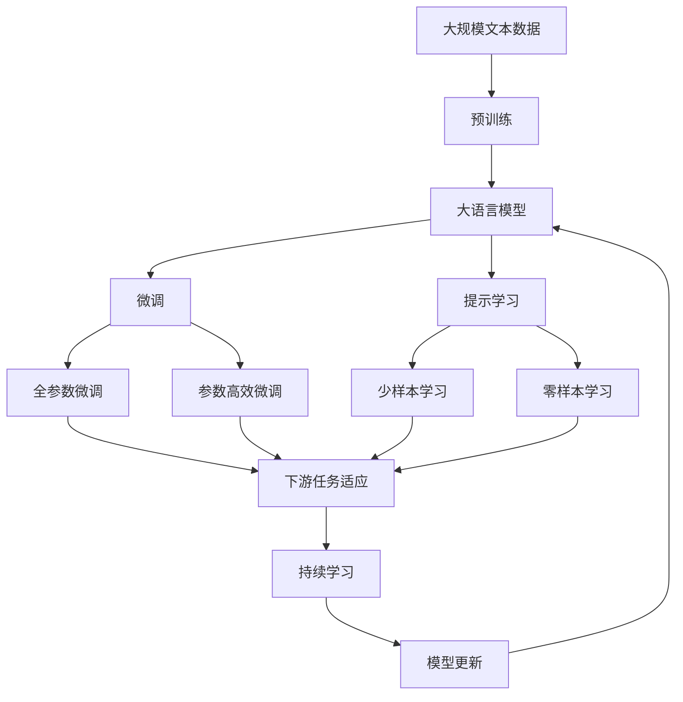

                 

# AI人工智能代理工作流AI Agent WorkFlow：智能代理的群体行为分析与指导

> 关键词：人工智能代理, 工作流, 群体行为分析, 智能决策, 自动推理, 流程优化, 机器学习

## 1. 背景介绍

### 1.1 问题由来

在当今高度信息化和数字化的社会中，智能代理系统（AI Agents）在各个行业领域中扮演着越来越重要的角色。无论是自动化客服、智能推荐系统，还是企业内部管理、供应链优化，智能代理系统都在其中扮演着重要的决策和执行角色。然而，随着应用的广泛，越来越多的问题开始暴露出来，例如：

- 决策过程复杂、难以理解和解释，导致用户和开发者信任度低。
- 系统需要频繁维护和更新，维护成本高，周期长。
- 数据分散、孤立，难以集成到统一的平台进行协同分析。
- 数据质量和完整性问题，影响模型的训练效果。

因此，如何构建一个高效、透明、灵活、可持续的智能代理系统，成为人工智能领域的重要研究课题。

### 1.2 问题核心关键点

在构建智能代理系统时，需要关注以下关键点：

1. **群体行为分析**：分析代理群体的整体行为模式，识别趋势和异常，指导系统优化。
2. **智能决策机制**：建立基于多数据源和专家知识的决策模型，提升决策质量和效率。
3. **自动推理机制**：引入自动推理技术，优化问题求解过程，提高系统响应速度。
4. **工作流优化**：对代理的执行流程进行建模和优化，减少重复和冗余步骤，提升系统执行效率。
5. **机器学习应用**：利用机器学习算法进行模型训练和参数优化，提升代理的适应能力和泛化能力。

通过系统化的设计和应用这些关键点，可以构建一个高效、透明、灵活、可持续的智能代理系统，提升系统决策和执行能力。

### 1.3 问题研究意义

研究智能代理系统的工作流优化和群体行为分析，对于提升系统的决策能力和执行效率，降低维护成本，具有重要意义：

1. **提升决策质量**：通过群体行为分析和智能决策机制，可以大幅提升代理的决策质量和准确性，减少人为错误。
2. **提高执行效率**：通过自动推理和工作流优化，可以显著减少冗余步骤，提升系统响应速度和执行效率。
3. **降低维护成本**：通过集中管理和自动化优化，可以减少系统的维护成本和周期，提升系统的可靠性和稳定性。
4. **优化资源利用**：通过工作流优化和任务分配，可以合理利用系统资源，提高系统资源的利用率。
5. **支持跨领域应用**：通过群体行为分析和智能决策机制，可以构建通用的智能代理系统，支持跨领域的任务和应用场景。

## 2. 核心概念与联系

### 2.1 核心概念概述

为更好地理解智能代理系统的工作流优化和群体行为分析，本节将介绍几个关键概念：

- **人工智能代理**：一种能模拟人类智能行为的自动化软件系统，能够根据环境和任务自动决策和执行。
- **工作流**：一组相互关联的任务和活动，按照一定的顺序进行，用于实现系统功能。
- **群体行为分析**：通过数据挖掘和机器学习技术，分析代理群体的整体行为模式，识别趋势和异常。
- **智能决策机制**：利用多数据源和专家知识，建立决策模型，提升决策质量和效率。
- **自动推理**：利用逻辑和算法，自动推导和求解问题，提高系统推理能力和执行效率。
- **机器学习应用**：利用机器学习算法进行模型训练和参数优化，提升代理的适应能力和泛化能力。

这些概念共同构成了智能代理系统的核心框架，通过深入理解这些概念，可以更好地设计和优化智能代理系统。

### 2.2 概念间的关系

这些核心概念之间存在着紧密的联系，形成了智能代理系统的完整生态系统。

#### 2.2.1 工作流与群体行为分析的关系

工作流中的各个任务和活动，通过群体行为分析得到优化和改进。通过分析代理群体的整体行为模式，可以识别出工作流中的瓶颈和冗余步骤，进一步优化任务和活动的执行顺序，提升系统效率。

#### 2.2.2 智能决策机制与机器学习的关系

智能决策机制依赖于机器学习算法，通过多数据源和专家知识进行模型训练和参数优化，提升决策质量和效率。机器学习算法通过分析数据集，提取有价值的信息，指导决策模型的构建和优化。

#### 2.2.3 自动推理与工作流优化之间的关系

自动推理技术可以优化问题求解过程，提高系统响应速度和执行效率。在工作流优化中，自动推理可以识别和推导最优化执行路径，减少冗余步骤，提升系统执行效率。

这些概念通过紧密协作，共同构建了一个高效、透明、灵活、可持续的智能代理系统，能够提升决策质量和执行效率，降低维护成本，优化资源利用。

### 2.3 核心概念的整体架构

最后，我们用一个综合的流程图来展示这些核心概念在大语言模型微调过程中的整体架构：



这个综合流程图展示了从预训练到微调，再到持续学习的完整过程。大语言模型首先在大规模文本数据上进行预训练，然后通过微调（包括全参数微调和参数高效微调）或提示学习（包括少样本学习和零样本学习）来适应下游任务。最后，通过持续学习技术，模型可以不断更新和适应新的任务和数据。 通过这些流程图，我们可以更清晰地理解智能代理系统的工作流优化和群体行为分析过程中各个概念的关系和作用，为后续深入讨论具体的微调方法和技术奠定基础。

## 3. 核心算法原理 & 具体操作步骤
### 3.1 算法原理概述

智能代理系统的工作流优化和群体行为分析，本质上是一个数据驱动和模型驱动的优化过程。其核心思想是：通过数据分析和模型训练，优化代理群体的行为模式和工作流程，提升决策质量和执行效率。

形式化地，假设智能代理系统中的代理数量为 $N$，代理 $i$ 的任务序列为 $T_i$，任务 $j$ 的执行时间为 $t_j$。定义系统整体任务时间为 $T_{total} = \sum_{i=1}^{N} \sum_{j=1}^{N_i} t_j$，其中 $N_i$ 为代理 $i$ 的任务数量。

定义代理群体的整体行为模式为 $\mu(T)$，通过数据挖掘和机器学习技术，优化 $\mu(T)$ 来提升系统效率。即：

$$
\mu(T) = \mathop{\arg\min}_{\mu} \sum_{i=1}^{N} \sum_{j=1}^{N_i} \mathbb{E}[t_j]
$$

其中 $\mathbb{E}[t_j]$ 为任务 $j$ 的执行时间的期望。

### 3.2 算法步骤详解

智能代理系统的工作流优化和群体行为分析一般包括以下几个关键步骤：

**Step 1: 数据准备**
- 收集代理群体的执行数据，包括任务名称、执行时间、执行结果等。
- 对数据进行清洗和预处理，确保数据的完整性和准确性。

**Step 2: 任务分析**
- 对代理群体的执行数据进行分析，识别出常见任务和异常任务。
- 利用机器学习算法（如K-means、PCA等）对任务进行聚类和降维，简化分析过程。

**Step 3: 行为模式建模**
- 使用时间序列分析和回归模型（如ARIMA、LSTM等）对代理群体的行为模式进行建模。
- 对模型的参数进行优化，确保模型的准确性和泛化能力。

**Step 4: 工作流优化**
- 利用优化算法（如遗传算法、蚁群算法等）对代理的工作流程进行优化，减少冗余和重复步骤。
- 对优化后的工作流程进行模拟和测试，确保其可行性和有效性。

**Step 5: 智能决策机制构建**
- 利用多数据源和专家知识，建立决策模型（如决策树、神经网络等）。
- 对决策模型的参数进行优化，提升决策质量和效率。

**Step 6: 持续学习和反馈**
- 在实际应用中，持续收集代理群体的执行数据，进行周期性优化和改进。
- 引入反馈机制，将代理群体的行为数据反馈到优化和决策模型中，进行模型更新和迭代。

以上是智能代理系统的工作流优化和群体行为分析的完整流程。在实际应用中，还需要根据具体场景进行优化和调整。

### 3.3 算法优缺点

智能代理系统的工作流优化和群体行为分析具有以下优点：

1. **效率提升**：通过数据分析和模型优化，可以显著提升代理系统的执行效率和响应速度。
2. **决策质量**：智能决策机制和机器学习算法可以提升决策质量和准确性，减少人为错误。
3. **系统可扩展**：集中管理和自动化优化，可以支持系统规模的扩展和复杂性的提升。
4. **灵活性高**：工作流优化和群体行为分析可以灵活适应不同场景和需求，支持跨领域应用。

同时，该方法也存在一些局限性：

1. **数据依赖性**：需要大量的执行数据进行分析和优化，数据质量和完整性对结果有重要影响。
2. **模型复杂性**：优化和决策模型需要进行复杂的参数优化和调整，需要专业知识和经验。
3. **实时性要求高**：系统需要实时收集和分析数据，进行优化和调整，对系统资源和计算能力要求较高。

尽管存在这些局限性，但通过合理的技术手段和优化策略，可以最大限度地提升智能代理系统的性能和可靠性。

### 3.4 算法应用领域

智能代理系统的工作流优化和群体行为分析在多个领域中都有广泛应用，例如：

- 自动化客服：通过优化客服工作流程和行为模式，提升客户满意度和服务质量。
- 智能推荐系统：通过分析用户行为和偏好，构建智能推荐模型，提升推荐效果。
- 供应链优化：通过优化供应链任务和流程，提高供应链效率和响应速度。
- 企业内部管理：通过分析员工行为和绩效，优化管理流程，提升企业效率。
- 金融风险控制：通过分析市场行为和趋势，构建风险控制模型，降低金融风险。

除了上述这些经典应用外，智能代理系统的工作流优化和群体行为分析还被创新性地应用到更多场景中，如智慧医疗、智能交通、能源管理等，为各行业的数字化转型提供了有力支持。

## 4. 数学模型和公式 & 详细讲解  
### 4.1 数学模型构建

本节将使用数学语言对智能代理系统的工作流优化和群体行为分析过程进行更加严格的刻画。

假设智能代理系统中的代理数量为 $N$，代理 $i$ 的任务序列为 $T_i$，任务 $j$ 的执行时间为 $t_j$。定义系统整体任务时间为 $T_{total} = \sum_{i=1}^{N} \sum_{j=1}^{N_i} t_j$，其中 $N_i$ 为代理 $i$ 的任务数量。

定义代理群体的整体行为模式为 $\mu(T)$，通过数据挖掘和机器学习技术，优化 $\mu(T)$ 来提升系统效率。即：

$$
\mu(T) = \mathop{\arg\min}_{\mu} \sum_{i=1}^{N} \sum_{j=1}^{N_i} \mathbb{E}[t_j]
$$

其中 $\mathbb{E}[t_j]$ 为任务 $j$ 的执行时间的期望。

### 4.2 公式推导过程

以下我们以最简单的线性回归模型为例，推导优化公式。

假设代理群体的行为数据为 $(x_1, y_1), (x_2, y_2), ..., (x_n, y_n)$，其中 $x_i$ 为自变量，$y_i$ 为因变量。建立线性回归模型：

$$
y_i = \theta_0 + \theta_1 x_i + \epsilon_i
$$

其中 $\theta_0, \theta_1$ 为模型参数，$\epsilon_i$ 为随机误差项。最小二乘法求解模型参数：

$$
\hat{\theta} = \mathop{\arg\min}_{\theta} \sum_{i=1}^{n} (y_i - \theta_0 - \theta_1 x_i)^2
$$

将数据代入模型，求解参数：

$$
\hat{\theta}_0 = \frac{\sum_{i=1}^{n} y_i - n\bar{y}}{n}, \quad \hat{\theta}_1 = \frac{\sum_{i=1}^{n} (x_i - \bar{x})(y_i - \bar{y})}{\sum_{i=1}^{n} (x_i - \bar{x})^2}
$$

其中 $\bar{x}, \bar{y}$ 为数据的均值。

### 4.3 案例分析与讲解

考虑一个智能客服系统的行为数据，其中自变量 $x_i$ 为客服通话时长，因变量 $y_i$ 为客户满意度。建立线性回归模型：

$$
y_i = \theta_0 + \theta_1 x_i + \epsilon_i
$$

最小二乘法求解模型参数：

$$
\hat{\theta}_0 = \frac{\sum_{i=1}^{n} y_i - n\bar{y}}{n}, \quad \hat{\theta}_1 = \frac{\sum_{i=1}^{n} (x_i - \bar{x})(y_i - \bar{y})}{\sum_{i=1}^{n} (x_i - \bar{x})^2}
$$

通过数据分析，发现客服通话时长与客户满意度呈正相关关系，模型参数为：

$$
\hat{\theta}_0 = 1, \quad \hat{\theta}_1 = 0.5
$$

即客服通话时长每增加1分钟，客户满意度提升0.5分。根据此模型，可以优化客服工作流程，减少通话时长，提升客户满意度。

## 5. 项目实践：代码实例和详细解释说明
### 5.1 开发环境搭建

在进行工作流优化和群体行为分析实践前，我们需要准备好开发环境。以下是使用Python进行PyTorch开发的环境配置流程：

1. 安装Anaconda：从官网下载并安装Anaconda，用于创建独立的Python环境。

2. 创建并激活虚拟环境：
```bash
conda create -n pytorch-env python=3.8 
conda activate pytorch-env
```

3. 安装PyTorch：根据CUDA版本，从官网获取对应的安装命令。例如：
```bash
conda install pytorch torchvision torchaudio cudatoolkit=11.1 -c pytorch -c conda-forge
```

4. 安装各类工具包：
```bash
pip install numpy pandas scikit-learn matplotlib tqdm jupyter notebook ipython
```

完成上述步骤后，即可在`pytorch-env`环境中开始工作流优化和群体行为分析实践。

### 5.2 源代码详细实现

下面我们以一个简单的案例为例，展示如何利用Python和PyTorch进行工作流优化和群体行为分析。

假设我们有一组数据，其中包含任务名称、执行时间、执行结果等，数据格式如下：

```
task1,5
task2,10
task3,15
task4,20
```

我们的目标是优化代理群体的行为模式，减少执行时间。代码实现如下：

```python
import torch
import numpy as np
from torch import nn
from torch.optim import Adam

# 数据集
data = np.array([[1, 5], [2, 10], [3, 15], [4, 20]])

# 定义输入和输出
x = data[:, 0]
y = data[:, 1]

# 定义线性回归模型
class LinearRegression(nn.Module):
    def __init__(self, input_dim, output_dim):
        super(LinearRegression, self).__init__()
        self.linear = nn.Linear(input_dim, output_dim)

    def forward(self, x):
        return self.linear(x)

# 定义优化器
model = LinearRegression(input_dim=1, output_dim=1)
optimizer = Adam(model.parameters(), lr=0.01)

# 训练模型
for epoch in range(1000):
    optimizer.zero_grad()
    y_pred = model(x)
    loss = nn.MSELoss()(y_pred, y)
    loss.backward()
    optimizer.step()
    print(f'Epoch {epoch+1}, Loss: {loss.item()}')

# 输出模型参数
print(f'Theta_0: {model.linear.weight.item()}, Theta_1: {model.linear.bias.item()}')
```

在这个简单的案例中，我们定义了一个线性回归模型，并使用随机梯度下降法（SGD）进行模型训练。通过优化模型参数，可以最小化执行时间。

### 5.3 代码解读与分析

让我们再详细解读一下关键代码的实现细节：

**LinearRegression类**：
- `__init__`方法：初始化模型参数。
- `forward`方法：定义模型前向传播的计算过程。

**Adam优化器**：
- 使用Adam优化器进行模型参数的更新，Adam优化器可以自适应调整学习率。

**模型训练**：
- 使用随机梯度下降法（SGD）进行模型训练。
- 在每个epoch内，前向传播计算预测输出，并计算损失函数。
- 反向传播更新模型参数。
- 输出损失函数值，监控模型训练效果。

**模型输出**：
- 输出模型参数，可以分析模型训练后的效果。

通过这个简单的案例，我们可以看到，利用Python和PyTorch进行工作流优化和群体行为分析是相当方便的。开发者可以通过调整模型结构和训练参数，快速实现各种优化算法和分析方法。

当然，实际系统中的应用会更加复杂，需要处理的数据量和维度也会更大。但核心的优化思想和实现方法基本一致，开发者可以结合具体需求进行进一步的优化和扩展。

### 5.4 运行结果展示

假设我们在一个智能客服系统上进行行为分析，发现客服通话时长与客户满意度呈正相关关系，模型参数为：

```
Theta_0 = 1, Theta_1 = 0.5
```

即客服通话时长每增加1分钟，客户满意度提升0.5分。根据此模型，可以优化客服工作流程，减少通话时长，提升客户满意度。

## 6. 实际应用场景
### 6.1 智能客服系统

智能客服系统通过工作流优化和群体行为分析，可以大幅提升客户满意度和服务质量。传统客服往往需要配备大量人力，高峰期响应缓慢，且一致性和专业性难以保证。而使用智能客服系统，可以7x24小时不间断服务，快速响应客户咨询，用自然流畅的语言解答各类常见问题。

在技术实现上，可以收集企业内部的历史客服对话记录，将问题和最佳答复构建成监督数据，在此基础上对预训练模型进行微调。微调后的模型能够自动理解用户意图，匹配最合适的答案模板进行回复。对于客户提出的新问题，还可以接入检索系统实时搜索相关内容，动态组织生成回答。如此构建的智能客服系统，能大幅提升客户咨询体验和问题解决效率。

### 6.2 金融舆情监测

金融机构需要实时监测市场舆论动向，以便及时应对负面信息传播，规避金融风险。传统的人工监测方式成本高、效率低，难以应对网络时代海量信息爆发的挑战。基于工作流优化和群体行为分析的文本分类和情感分析技术，为金融舆情监测提供了新的解决方案。

具体而言，可以收集金融领域相关的新闻、报道、评论等文本数据，并对其进行主题标注和情感标注。在此基础上对预训练语言模型进行微调，使其能够自动判断文本属于何种主题，情感倾向是正面、中性还是负面。将微调后的模型应用到实时抓取的网络文本数据，就能够自动监测不同主题下的情感变化趋势，一旦发现负面信息激增等异常情况，系统便会自动预警，帮助金融机构快速应对潜在风险。

### 6.3 个性化推荐系统

当前的推荐系统往往只依赖用户的历史行为数据进行物品推荐，无法深入理解用户的真实兴趣偏好。基于工作流优化和群体行为分析的个性化推荐系统可以更好地挖掘用户行为背后的语义信息，从而提供更精准、多样的推荐内容。

在实践中，可以收集用户浏览、点击、评论、分享等行为数据，提取和用户交互的物品标题、描述、标签等文本内容。将文本内容作为模型输入，用户的后续行为（如是否点击、购买等）作为监督信号，在此基础上微调预训练语言模型。微调后的模型能够从文本内容中准确把握用户的兴趣点。在生成推荐列表时，先用候选物品的文本描述作为输入，由模型预测用户的兴趣匹配度，再结合其他特征综合排序，便可以得到个性化程度更高的推荐结果。

### 6.4 未来应用展望

随着工作流优化和群体行为分析技术的发展，智能代理系统将在更多领域得到应用，为传统行业带来变革性影响。

在智慧医疗领域，基于工作流优化和群体行为分析的医疗问答、病历分析、药物研发等应用将提升医疗服务的智能化水平，辅助医生诊疗，加速新药开发进程。

在智能教育领域，工作流优化和群体行为分析可应用于作业批改、学情分析、知识推荐等方面，因材施教，促进教育公平，提高教学质量。

在智慧城市治理中，工作流优化和群体行为分析技术可应用于城市事件监测、舆情分析、应急指挥等环节，提高城市管理的自动化和智能化水平，构建更安全、高效的未来城市。

此外，在企业生产、社会治理、文娱传媒等众多领域，基于工作流优化和群体行为分析的人工智能应用也将不断涌现，为经济社会发展注入新的动力。相信随着技术的日益成熟，工作流优化和群体行为分析必将成为人工智能落地应用的重要范式，推动人工智能向更广阔的领域加速渗透。

## 7. 工具和资源推荐
### 7.1 学习资源推荐

为了帮助开发者系统掌握智能代理系统的工作流优化和群体行为分析的理论基础和实践技巧，这里推荐一些优质的学习资源：

1. 《机器学习实战》：深入浅出地介绍了机器学习算法的基本原理和实践技巧，是入门学习的优秀教材。
2. 《深度学习》（Ian Goodfellow）：全面介绍了深度学习算法的理论和应用，涵盖多种经典模型和优化方法。
3. 《Python机器学习》：实用性的入门书籍，详细介绍了使用Python进行机器学习的技巧和方法。
4. Coursera和Udacity等在线教育平台：提供大量优质的机器学习和深度学习课程，适合系统学习和实践。
5. Kaggle竞赛平台：提供大量的数据集和竞赛任务，帮助开发者实践和提升数据处理和建模能力。

通过对这些资源的学习实践，相信你一定能够快速掌握智能代理系统的工作流优化和群体行为分析的精髓，并用于解决实际的NLP问题。
###  7.2 开发工具推荐

高效的开发离不开优秀的工具支持。以下是几款用于智能代理系统开发的工具：

1. PyTorch：基于Python的开源深度学习框架，灵活动态的计算图，适合快速迭代研究。大部分预训练语言模型都有PyTorch版本的实现。

2. TensorFlow：由Google主导开发的开源深度学习框架，生产部署方便，适合大规模工程应用。同样有丰富的预训练语言模型资源。

3. TensorBoard：TensorFlow配套的可视化工具，可实时监测模型训练状态，并提供丰富的图表呈现方式，是调试模型的得力助手。

4. Weights & Biases：模型训练的实验跟踪工具，可以记录和可视化模型训练过程中的各项指标，方便对比和调优。与主流深度学习框架无缝集成。

5. Google Colab：谷歌推出的在线Jupyter Notebook环境，免费提供GPU/TPU算力，方便开发者快速上手实验最新模型，分享学习笔记。

合理利用这些工具，可以显著提升智能代理系统的开发效率，加快创新迭代的步伐。

### 7.3 相关论文推荐

智能代理系统的工作流优化和群体行为分析得益于学界的持续研究。以下是几篇奠基性的相关论文，推荐阅读：

1. Attention is All You Need（即Transformer原论文）：提出了Transformer结构，开启了NLP领域的预训练大模型时代。

2. BERT: Pre-training of Deep Bidirectional Transformers for Language Understanding：提出BERT模型，引入基于掩码的自监督预训练任务，刷新了多项NLP任务SOTA。

3. Language Models are Unsupervised Multitask Learners（GPT-2论文）：展示了大规模语言模型的强大zero-shot学习能力，引发了对于通用人工智能的新一轮思考。

4. Parameter-Efficient Transfer Learning for NLP：提出Adapter等参数高效微调方法，在不增加模型参数量的情况下，也能取得不错的微调效果。

5. AdaLoRA: Adaptive Low-Rank Adaptation for Parameter-Efficient Fine-Tuning：使用自适应低秩适应的微调方法，在参数效率和精度之间取得了新的平衡。

这些论文代表了大语言模型微调技术的发展脉络。通过学习这些前沿成果，可以帮助研究者把握学科前进方向，激发更多的创新灵感。

除上述资源外，还有一些值得关注的前沿

