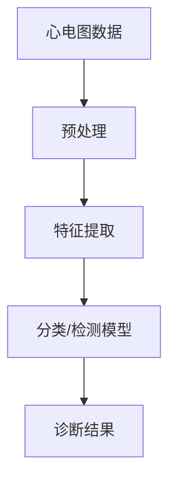

以下是《心电图数据研究原理与方法》这篇技术博客文章的正文内容：

# 心电图数据研究原理与方法

## 1. 背景介绍

### 1.1 问题的由来

心脏病是当今社会中最常见和最致命的疾病之一。及时发现和诊断心脏病对于患者的治疗和康复至关重要。心电图(ECG)是检测心脏活动的一种非侵入性方法,广泛应用于临床诊断中。然而,由于心电图数据的复杂性和多变性,手动分析和解读心电图是一项艰巨的任务,容易出现误诊和漏诊。因此,开发高效、准确的心电图数据分析方法对于提高诊断质量和降低医疗成本至关重要。

### 1.2 研究现状

近年来,机器学习和深度学习技术在医疗健康领域的应用日益广泛,为心电图数据分析提供了新的解决方案。研究人员提出了多种基于机器学习的心电图分类模型,如支持向量机(SVM)、随机森林(RF)、神经网络等,取得了令人鼓舞的成果。然而,这些传统机器学习模型往往需要大量的人工特征工程,且泛化能力有限。

随着深度学习技术的不断发展,卷积神经网络(CNN)、循环神经网络(RNN)等深度学习模型逐渐应用于心电图数据分析,展现出强大的自动特征提取能力和建模能力。深度学习模型能够直接从原始心电图数据中学习特征表示,避免了繁琐的人工特征工程,同时具有更好的泛化性能。

### 1.3 研究意义

心电图数据分析对于及时发现心脏疾病、指导临床诊断和制定治疗方案具有重要意义。通过研究高效、准确的心电图数据分析方法,可以提高疾病的早期发现率,降低医疗成本,改善患者的生活质量。同时,心电图数据分析也为其他生物医学信号处理领域提供了借鉴和参考。

### 1.4 本文结构

本文将全面介绍心电图数据研究的原理与方法,内容包括:

1. 核心概念与联系
2. 核心算法原理及具体操作步骤
3. 数学模型和公式详细讲解及案例分析
4. 项目实践:代码实例和详细解释
5. 实际应用场景
6. 工具和资源推荐
7. 总结:未来发展趋势与挑战
8. 附录:常见问题与解答

## 2. 核心概念与联系

心电图数据分析的核心概念包括:

1. **心电图数据**: 心电图是记录心脏电活动的图形,通过在人体表面放置电极来测量。心电图数据是时间序列数据,反映了心脏每个周期的电活动变化。

2. **预处理**: 由于心电图数据容易受到噪声、基线漂移等因素的影响,因此需要进行预处理,如去噪、滤波、基线校正等,以提高数据质量。

3. **特征提取**: 从预处理后的心电图数据中提取有意义的特征,如波峰、波谷、波形间期等,这些特征对于后续的分类和检测任务至关重要。

4. **分类/检测模型**: 基于提取的特征,构建机器学习或深度学习模型,对心电图数据进行分类(如正常、室性早搏等)或检测特定波形(如ST段抬高等)。

5. **诊断结果**: 模型输出的分类或检测结果,可用于辅助医生进行心脏病诊断和治疗决策。

这些核心概念相互关联、环环相扣,构成了完整的心电图数据分析流程。

## 3. 核心算法原理及具体操作步骤

### 3.1 算法原理概述

心电图数据分析的核心算法主要包括两个方面:特征提取算法和分类/检测算法。

**特征提取算法**的目标是从原始心电图数据中提取出对分类或检测任务有意义的特征,常用的特征提取算法包括:

- 小波变换(Wavelet Transform)
- 主成分分析(Principal Component Analysis, PCA)
- 独立成分分析(Independent Component Analysis, ICA)
- 自动编码器(Autoencoder)

**分类/检测算法**的目标是基于提取的特征,构建机器学习或深度学习模型,对心电图数据进行分类或检测。常用的分类/检测算法包括:

- 支持向量机(Support Vector Machine, SVM)
- 随机森林(Random Forest, RF)
- 神经网络(Neural Network, NN)
- 卷积神经网络(Convolutional Neural Network, CNN)
- 循环神经网络(Recurrent Neural Network, RNN)

### 3.2 算法步骤详解

以基于卷积神经网络的心电图分类算法为例,具体步骤如下:

1. **数据预处理**
   - 去噪:使用小波变换、带通滤波器等方法去除心电图数据中的基线漂移、肌电干扰等噪声。
   - 标准化:将心电图数据进行标准化或归一化处理,使其具有零均值和单位方差,提高模型的收敛速度和性能。

2. **特征提取**
   - 将预处理后的一维心电图数据转换为二维图像形式,作为卷积神经网络的输入。
   - 卷积层自动从二维图像中提取局部特征,如波峰、波谷等。
   - 池化层降低特征维度,提取更抽象的特征表示。

3. **模型构建与训练**
   - 设计卷积神经网络架构,包括卷积层、池化层、全连接层等。
   - 选择合适的损失函数(如交叉熵损失)和优化器(如Adam优化器)。
   - 使用标注好的心电图数据集进行模型训练,通过反向传播算法不断调整网络权重,使模型在训练集上达到最优性能。

4. **模型评估与调优**
   - 在保留的测试集上评估模型性能,计算指标如准确率、精确率、召回率等。
   - 根据评估结果,调整模型超参数(如学习率、正则化系数等)或网络架构,以进一步提高模型性能。

5. **模型部署与应用**
   - 将训练好的模型部署到实际的医疗系统中,对新的心电图数据进行分类和诊断。
   - 持续监控模型性能,根据新数据进行模型更新和迭代。

### 3.3 算法优缺点

基于卷积神经网络的心电图分类算法具有以下优点:

- 自动特征提取,避免了繁琐的人工特征工程。
- 端到端的训练方式,能够直接从原始数据中学习特征表示。
- 具有较强的泛化能力,可以很好地适应不同的心电图数据分布。

但也存在一些缺点和挑战:

- 需要大量标注好的训练数据,数据标注工作耗时耗力。
- 模型训练过程计算量大,需要强大的硬件支持。
- 模型的可解释性较差,难以解释内部特征提取和决策过程。

### 3.4 算法应用领域

基于卷积神经网络的心电图分类算法可广泛应用于以下领域:

- 临床辅助诊断:对心电图数据进行自动分类,辅助医生进行心脏病诊断。
- 远程医疗监测:实时监测患者的心电图数据,及时发现异常情况。
- 医疗大数据分析:对大规模心电图数据进行分析,发现潜在的规律和模式。
- 医学教育和科研:用于医学生和研究人员的心电图数据分析和研究。

## 4. 数学模型和公式及详细讲解与举例说明

### 4.1 数学模型构建

在心电图数据分析中,常用的数学模型包括小波变换、主成分分析、独立成分分析等。以小波变换为例,它能够在时间和频率域同时对信号进行局部分析,适合处理非平稳信号,如心电图数据。

小波变换的基本思想是将信号在不同尺度上进行分解,得到不同频率分量的近似值和细节值。对于一维信号 $f(t)$,其连续小波变换定义为:

$$W(a,b) = \frac{1}{\sqrt{a}}\int_{-\infty}^{\infty}f(t)\psi\left(\frac{t-b}{a}\right)dt$$

其中 $\psi(t)$ 是小波基函数(母小波),$a$ 是尺度参数,控制小波的拉伸或压缩,$b$ 是平移参数,控制小波沿时间轴的位移。

通过选择合适的小波基函数和参数,可以对心电图数据进行多尺度分解,去除噪声和干扰,提取出有用的特征信息。

### 4.2 公式推导过程

以主成分分析(PCA)为例,推导其核心公式过程如下:

假设有 $n$ 个 $p$ 维样本数据 $\boldsymbol{x}_1,\boldsymbol{x}_2,\ldots,\boldsymbol{x}_n$,其均值为 $\boldsymbol{\mu}=\frac{1}{n}\sum_{i=1}^{n}\boldsymbol{x}_i$。我们希望找到一个 $p$ 维正交基 $\boldsymbol{u}_1,\boldsymbol{u}_2,\ldots,\boldsymbol{u}_p$,使得投影到这个基上的数据方差最大。

定义投影后的数据为 $\boldsymbol{z}_i=\boldsymbol{U}^T(\boldsymbol{x}_i-\boldsymbol{\mu})$,其中 $\boldsymbol{U}=(\boldsymbol{u}_1,\boldsymbol{u}_2,\ldots,\boldsymbol{u}_p)$。则投影后的总方差为:

$$\begin{aligned}
\text{Var}(\boldsymbol{z}) &= \frac{1}{n}\sum_{i=1}^{n}\|\boldsymbol{z}_i\|^2 \
&= \frac{1}{n}\sum_{i=1}^{n}\boldsymbol{z}_i^T\boldsymbol{z}_i \
&= \frac{1}{n}\sum_{i=1}^{n}(\boldsymbol{x}_i-\boldsymbol{\mu})^T\boldsymbol{U}\boldsymbol{U}^T(\boldsymbol{x}_i-\boldsymbol{\mu}) \
&= \text{tr}\left(\boldsymbol{U}^T\boldsymbol{S}\boldsymbol{U}\right)
\end{aligned}$$

其中 $\boldsymbol{S}=\frac{1}{n}\sum_{i=1}^{n}(\boldsymbol{x}_i-\boldsymbol{\mu})(\boldsymbol{x}_i-\boldsymbol{\mu})^T$ 是数据的协方差矩阵。

要使总方差最大,等价于最大化 $\text{tr}(\boldsymbol{U}^T\boldsymbol{S}\boldsymbol{U})$,subject to $\boldsymbol{U}^T\boldsymbol{U}=\boldsymbol{I}$。通过拉格朗日乘数法可以求解出 $\boldsymbol{U}$ 的解为 $\boldsymbol{S}$ 的特征向量。

因此,PCA 的核心思想是找到数据的主要变化方向,并将数据投影到这些方向上,从而达到降维和提取主要特征的目的。

### 4.3 案例分析与讲解

现在,我们以一个具体的心电图数据案例来说明小波变换在去噪和特征提取中的应用。

假设我们有一段含噪心电图数据 $f(t)$,希望去除其中的基线漂移和高频噪声。我们可以使用 Daubechies 小波作为小波基函数,对数据进行 5 层小波分解:

$$f(t) = A_5 + D_5 + D_4 + D_3 + D_2 + D_1$$

其中 $A_5$ 是近似分量,反映了信号的低频部分;$D_5,D_4,\ldots,D_1$ 是细节分量,反映了信号的高频部分。

为了去除基线漂移,我们可以将近似分量 $A_5$ 设置为 0;为了去除高频噪声,我们可以将高频