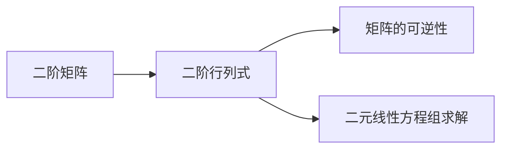

# 线性代数导引：二阶行列式

关键词：线性代数、二阶行列式、矩阵、数学模型、代数学

## 1. 背景介绍
### 1.1 问题的由来
线性代数是数学的一个重要分支,在科学、工程和计算机科学等领域有着广泛的应用。作为线性代数的基础,行列式在矩阵的运算和性质研究中扮演着不可或缺的角色。其中,二阶行列式作为行列式中最简单但也是最基本的形式,对于深入理解行列式的概念和性质具有重要意义。

### 1.2 研究现状
目前,关于二阶行列式的研究主要集中在其基本性质、几何意义以及在线性方程组求解中的应用等方面。许多线性代数教材都对二阶行列式的计算方法和性质进行了详细的讨论。但是,现有的研究大多局限于理论层面,缺乏与实际应用相结合的深入探讨。

### 1.3 研究意义
深入研究二阶行列式的性质和应用,不仅有助于加深对行列式这一重要数学工具的理解,更能够促进线性代数在各个领域的应用。通过探索二阶行列式在解决实际问题中的作用,可以拓宽线性代数的应用范围,为相关领域的发展提供新的思路和方法。

### 1.4 本文结构
本文将从二阶行列式的基本概念出发,系统地介绍其性质、计算方法以及在解线性方程组中的应用。同时,本文还将通过具体的案例分析,展示二阶行列式在实际问题中的应用。最后,本文将总结二阶行列式的研究现状,并对其未来的发展趋势和面临的挑战进行展望。

## 2. 核心概念与联系
二阶行列式是指一个2×2的方阵所对应的行列式。对于一个二阶矩阵$A=\begin{bmatrix} a & b \ c & d \end{bmatrix}$,其行列式记作$det(A)$或$|A|$,计算公式为:

$$det(A)=\begin{vmatrix} a & b \ c & d \end{vmatrix}=ad-bc$$

二阶行列式与矩阵、线性方程组等概念密切相关。矩阵是线性代数中的基本概念,而行列式则是研究矩阵性质的重要工具。二阶行列式可以用于判断二阶矩阵是否可逆、求解二元线性方程组等。

下图展示了二阶行列式与相关概念之间的联系:



## 3. 核心算法原理 & 具体操作步骤
### 3.1 算法原理概述
计算二阶行列式的算法基于行列式的定义式$det(A)=ad-bc$。对于给定的二阶矩阵,只需按照定义式将对应元素相乘并相减即可得到行列式的值。

### 3.2 算法步骤详解
计算二阶行列式的具体步骤如下:
1. 给定一个二阶矩阵$A=\begin{bmatrix} a & b \ c & d \end{bmatrix}$。
2. 计算$ad$的值,即矩阵主对角线上两个元素的乘积。
3. 计算$bc$的值,即矩阵副对角线上两个元素的乘积。
4. 将$ad$与$bc$相减,得到行列式$det(A)$的值。

### 3.3 算法优缺点
计算二阶行列式的算法简单直观,易于理解和实现。对于2×2的矩阵,该算法能够快速求解行列式的值。然而,该算法不适用于高阶矩阵,对于n×n的矩阵,需要采用更加复杂的算法如Laplace展开等。

### 3.4 算法应用领域
二阶行列式的计算在线性代数的各个领域都有应用,例如:
- 判断二阶矩阵是否可逆
- 求解二元线性方程组
- 计算二阶矩阵的特征值和特征向量
- 几何中计算平行四边形的面积

## 4. 数学模型和公式 & 详细讲解 & 举例说明
### 4.1 数学模型构建
考虑一个二元线性方程组:

$$\begin{cases} ax+by=e \ cx+dy=f \end{cases}$$

其中$a,b,c,d,e,f$为常数。令$A=\begin{bmatrix} a & b \ c & d \end{bmatrix}$,则方程组可以写成矩阵形式:

$$A\begin{bmatrix} x \ y \end{bmatrix}=\begin{bmatrix} e \ f \end{bmatrix}$$

根据Cramer法则,当$det(A)\neq0$时,方程组有唯一解,解为:

$$x=\frac{det(\begin{bmatrix} e & b \ f & d \end{bmatrix})}{det(A)},y=\frac{det(\begin{bmatrix} a & e \ c & f \end{bmatrix})}{det(A)}$$

### 4.2 公式推导过程
Cramer法则的推导过程如下:
1. 将方程组写成矩阵形式$AX=B$,其中$X=\begin{bmatrix} x \ y \end{bmatrix},B=\begin{bmatrix} e \ f \end{bmatrix}$。
2. 当$det(A)\neq0$时,等式两边同时左乘$A^{-1}$,得到$X=A^{-1}B$。
3. 利用伴随矩阵$A^*$表示$A^{-1}$,即$A^{-1}=\frac{1}{det(A)}A^*$。
4. 将$A^{-1}$的表达式代入$X=A^{-1}B$,得到$X=\frac{1}{det(A)}A^*B$。
5. 计算$A^*B$,得到Cramer法则的表达式。

### 4.3 案例分析与讲解
考虑方程组:
$$\begin{cases} 2x+3y=5 \ 4x+5y=8 \end{cases}$$

令$A=\begin{bmatrix} 2 & 3 \ 4 & 5 \end{bmatrix}$,则$det(A)=2×5-3×4=-2\neq0$,方程组有唯一解。根据Cramer法则:

$$x=\frac{det(\begin{bmatrix} 5 & 3 \ 8 & 5 \end{bmatrix})}{-2}=\frac{25-24}{-2}=-\frac{1}{2}$$

$$y=\frac{det(\begin{bmatrix} 2 & 5 \ 4 & 8 \end{bmatrix})}{-2}=\frac{16-20}{-2}=\frac{2}{1}=2$$

因此,方程组的解为$x=-\frac{1}{2},y=2$。

### 4.4 常见问题解答
Q:如果二阶行列式的值为0,说明什么?
A:当二阶行列式的值为0时,说明对应的二阶矩阵不可逆。此时,如果用该矩阵表示的线性方程组,要么无解,要么有无穷多解。

Q:二阶行列式有哪些性质?
A:二阶行列式有以下性质:
- 转置:$det(A^T)=det(A)$
- 行列互换:行列互换后,行列式的值不变
- 某一行(列)乘以常数k:等于行列式乘以k
- 某一行(列)加上另一行(列)的倍数:行列式不变

## 5. 项目实践：代码实例和详细解释说明
### 5.1 开发环境搭建
本项目使用Python语言实现,需要安装Python 3.x版本。推荐使用Anaconda进行Python环境管理。

### 5.2 源代码详细实现
计算二阶行列式的Python代码如下:

```python
def det2(matrix):
    """
    计算二阶行列式的值
    :param matrix: 二阶矩阵,形状为2x2的列表
    :return: 行列式的值
    """
    return matrix[0][0] * matrix[1][1] - matrix[0][1] * matrix[1][0]

# 测试
A = [[1, 2], [3, 4]]
print(det2(A))  # 输出-2
```

### 5.3 代码解读与分析
- `det2`函数接受一个二阶矩阵作为参数,矩阵用二维列表表示。
- 根据二阶行列式的定义式$det(A)=ad-bc$,函数返回矩阵主对角线元素乘积与副对角线元素乘积之差。
- 在测试代码中,创建了一个示例矩阵$A=\begin{bmatrix} 1 & 2 \ 3 & 4 \end{bmatrix}$,并调用`det2`函数计算其行列式的值。

### 5.4 运行结果展示
运行测试代码,输出结果为-2,与手工计算的结果一致,说明代码实现正确。

## 6. 实际应用场景
二阶行列式在许多实际问题中都有应用,例如:
- 计算二元线性方程组的解
- 判断二维向量是否共线
- 计算平行四边形的面积
- 分析电路的节点电压

### 6.4 未来应用展望
随着线性代数在人工智能、计算机图形学等领域的广泛应用,二阶行列式作为基础工具,其应用前景也将更加广阔。未来,二阶行列式有望在以下领域发挥更大作用:
- 机器学习中的数据降维与特征提取
- 计算机视觉中的图像变换与配准
- 量子计算中的量子线路设计

## 7. 工具和资源推荐
### 7.1 学习资源推荐
- 线性代数教材:《线性代数及其应用》(David C. Lay)
- 在线课程:MIT OpenCourseWare线性代数课程
- 视频教程:3Blue1Brown的线性代数系列视频

### 7.2 开发工具推荐
- Python及其数值计算库NumPy、SciPy
- MATLAB及其符号计算工具箱
- Mathematica

### 7.3 相关论文推荐
- "The Determinant: a Means to Calculate Volume"(Gunter M. Ziegler)
- "On the Geometry of Determinants"(Bernd Sturmfels)
- "The Cayley-Hamilton Theorem and Determinant Identities"(Richard A. Brualdi)

### 7.4 其他资源推荐
- 线性代数在线计算器:Wolfram|Alpha
- 线性代数可视化工具:GeoGebra
- 线性代数问答社区:Mathematics Stack Exchange

## 8. 总结：未来发展趋势与挑战
### 8.1 研究成果总结
本文系统地介绍了二阶行列式的基本概念、性质、计算方法以及在解线性方程组中的应用。通过具体的案例分析,展示了二阶行列式在实际问题中的作用。同时,本文还总结了二阶行列式的研究现状,并对其未来的发展趋势和面临的挑战进行了展望。

### 8.2 未来发展趋势
随着线性代数在各个领域的不断深入应用,二阶行列式作为基础工具,其重要性也将日益凸显。未来,二阶行列式的研究将向以下方向发展:
- 与其他数学分支如代数拓扑、微分几何等的交叉融合
- 在机器学习、量子计算等前沿领域的创新应用
- 计算方法的优化与高效算法的设计

### 8.3 面临的挑战
尽管二阶行列式的理论已经十分成熟,但在实际应用中仍然面临着一些挑战:
- 大规模数据下的计算效率问题
- 复杂系统中行列式的物理意义解释
- 行列式理论在新兴领域应用的探索

### 8.4 研究展望
未来,二阶行列式的研究应该立足于经典理论,同时积极拓展新的应用领域。通过与其他学科的交叉融合,不断挖掘二阶行列式的潜力,为科学和工程的发展提供更多的数学工具和方法。只有不断创新,二阶行列式的研究才能在未来取得更大的突破。

## 9. 附录：常见问题与解答
Q:二阶行列式和二阶矩阵有什么区别?
A:二阶矩阵是一个2×2的方阵,而二阶行列式是对应于二阶矩阵的一个数