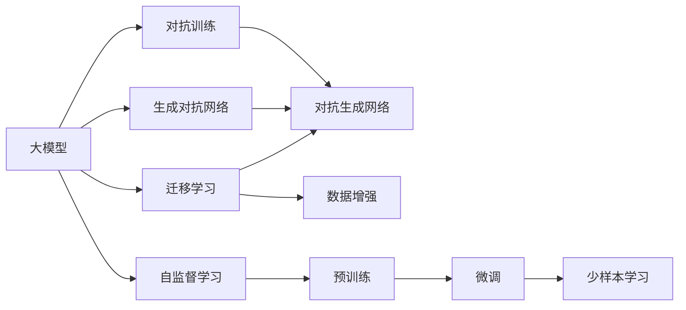

                 

# AIGC大模型时代：当下硬科技创业发生了哪些变化

## 1. 背景介绍

### 1.1 问题由来
随着人工智能(AI)技术的不断进步，尤其是生成对抗网络(GAN)、自监督学习等硬科技的突破，AIGC（人工智能生成内容）技术迅速崛起，成为当前AI领域的“新宠”。在图像、音频、视频、文本等多个领域，AIGC正在驱动一场内容生产的革命。大模型如DALL·E、ChatGPT、StableDiffusion等，以其强大的生成能力和泛化性能，引领了新一轮技术创新和商业应用热潮。

在这一背景下，创业生态也正在发生深刻的变化。传统的创业模式、投资偏好、技术趋势等，都面临着被颠覆的可能。本文旨在探讨大模型时代下，硬科技创业究竟发生了哪些变化，以及未来可能的发展趋势。

### 1.2 问题核心关键点
本文将从以下几个关键维度探讨大模型时代的变化：

- **技术进展**：AIGC技术的最新进展及其带来的技术突破。
- **市场变化**：AIGC技术在各行业的应用场景和趋势。
- **投资趋势**：资本市场对AIGC创业的关注和投资策略。
- **人才需求**：AIGC技术对创业团队和技术人才的需求变化。
- **伦理挑战**：AIGC技术应用中的伦理和法律问题。

通过对这些核心关键点的分析，我们希望能清晰地描绘出大模型时代下，硬科技创业的全貌。

## 2. 核心概念与联系

### 2.1 核心概念概述

为更好地理解大模型时代硬科技创业的变化，本节将介绍几个密切相关的核心概念：

- **AIGC (Artificial Intelligence Generated Content)**：通过AI技术自动生成内容，如文本、图像、音频、视频等，广泛应用于内容创作、广告、娱乐等多个领域。
- **大模型 (Large Models)**：指以深度神经网络为基础，拥有亿万级别参数的预训练模型，如GPT、DALL·E、StableDiffusion等，具备强大的生成能力和泛化性能。
- **自监督学习 (Self-Supervised Learning)**：通过大规模无标签数据进行自我监督，学习模型的内部表示，广泛应用于预训练阶段。
- **迁移学习 (Transfer Learning)**：利用在不同任务间迁移知识，提升模型在新任务上的性能，广泛应用于微调阶段。
- **对抗生成网络 (Generative Adversarial Networks, GANs)**：通过两个对抗网络（生成器和判别器）学习生成真实样本的模型，广泛应用于图像生成。
- **数据增强 (Data Augmentation)**：通过一系列变换扩充数据集，增强模型的泛化能力，广泛应用于模型训练。
- **少样本学习 (Few-shot Learning)**：在只有少量标签数据的情况下，通过模型学习生成新样本的策略，广泛应用于小样本数据集。

这些核心概念之间存在着紧密的联系，形成了AIGC技术的完整生态系统。通过理解这些核心概念，我们可以更好地把握大模型时代硬科技创业的技术基础和应用场景。

### 2.2 概念间的关系

这些核心概念之间存在着紧密的联系，形成了AIGC技术的完整生态系统。以下是几个合成的Mermaid流程图，展示这些概念之间的关系：



这个流程图展示了AIGC技术的核心概念及其之间的关系：

1. 大模型通过自监督学习进行预训练，学习到通用的特征表示。
2. 预训练后的模型通过迁移学习适配具体任务，进行微调。
3. 对抗生成网络、数据增强、少样本学习等技术，进一步提升了模型的生成能力和泛化性能。

## 3. 核心算法原理 & 具体操作步骤
### 3.1 算法原理概述

AIGC技术中的大模型，通常基于深度学习架构，如Transformer、GAN等。其核心原理是通过大规模数据进行自监督学习或监督学习，学习到强大的生成能力。这一过程可以分为以下几个步骤：

1. **预训练**：在无标签数据集上，通过自监督学习或对抗生成网络，学习到通用的特征表示。
2. **微调**：在有标签数据集上，通过迁移学习或对抗训练，学习到特定任务的生成能力。
3. **生成**：利用微调后的模型，根据输入的种子样本，生成新的内容样本。

### 3.2 算法步骤详解

以下以生成文本内容为例，详细介绍AIGC技术的详细步骤：

**Step 1: 准备数据集**
- 收集大量的文本数据，作为预训练数据集。
- 选择特定任务的数据集，如新闻、小说、技术文档等，作为微调数据集。

**Step 2: 预训练大模型**
- 使用自监督学习任务（如掩码语言模型、自编码器等）训练大模型。
- 可以使用GPT、T5等架构，在大型文本语料上预训练。

**Step 3: 微调**
- 在微调数据集上，使用监督学习或对抗训练，微调预训练模型。
- 可以使用交叉熵损失、GAN损失等，优化模型在特定任务上的生成能力。

**Step 4: 生成内容**
- 输入文本种子，利用微调后的模型，生成新的文本内容。
- 可以使用解码器生成文本，或使用GAN生成图像、音频等。

### 3.3 算法优缺点

AIGC技术的优点包括：

- **泛化能力强**：大模型能够学习到通用的特征表示，在不同任务间具有较强的泛化能力。
- **生成效果好**：生成内容的质量和多样性较高，可以生成高质量的文本、图像、音频等。
- **应用广泛**：广泛应用于内容创作、广告、娱乐、医疗等多个领域。

其缺点包括：

- **计算资源消耗大**：大模型的训练和微调需要大量的计算资源。
- **训练时间长**：大模型的训练时间较长，需要较长的预训练和微调过程。
- **对抗样本敏感**：生成的内容可能对输入的微小扰动敏感，生成结果不稳定。

### 3.4 算法应用领域

AIGC技术已经被广泛应用于多个领域，例如：

- **内容创作**：自动生成新闻、小说、技术文档等，提升内容生产效率和多样化。
- **广告制作**：自动生成广告文案、图像，提升广告创意的多样性和覆盖面。
- **娱乐产业**：自动生成音乐、影视作品等，提升娱乐产品的创作速度和质量。
- **医疗健康**：自动生成医疗报告、诊断建议等，辅助医生进行决策。
- **金融行业**：自动生成财务报告、市场分析等，提供决策支持。

## 4. 数学模型和公式 & 详细讲解 & 举例说明

### 4.1 数学模型构建

AIGC技术中的大模型通常采用深度学习架构，如Transformer、GAN等。这里以Transformer为例，介绍大模型的数学模型构建。

Transformer由编码器-解码器两部分组成，编码器由多头自注意力机制和前向神经网络组成，解码器由多头自注意力机制、前向神经网络和输出层组成。其数学模型构建如下：

$$
y = M_{\text{encoder}}(x)W_{\text{dec}} + b_{\text{dec}}
$$

其中，$x$ 为输入序列，$M_{\text{encoder}}$ 为编码器，$W_{\text{dec}}$ 为解码器的权重矩阵，$b_{\text{dec}}$ 为解码器的偏置。

### 4.2 公式推导过程

Transformer的核心是自注意力机制，其推导过程如下：

设输入序列长度为 $L$，输出序列长度也为 $L$。则自注意力机制可以表示为：

$$
\text{Attention}(Q, K, V) = \text{Softmax}(\frac{QK^T}{\sqrt{d_k}})V
$$

其中，$Q$ 为查询向量，$K$ 为键向量，$V$ 为值向量，$d_k$ 为键向量的维度。

Transformer的编码器部分，通过多个层叠的自注意力机制，学习输入序列的内部表示：

$$
M_{\text{encoder}}(x) = \text{LayerNorm}(\text{FFN}(\text{Self-Attention}(\text{Self-Attention}(...(\text{Self-Attention}(x)))) + x)
$$

其中，$\text{FFN}$ 为前向神经网络，$\text{LayerNorm}$ 为层归一化。

### 4.3 案例分析与讲解

假设我们需要生成一段文本，我们可以将其表示为向量 $x$。通过编码器得到内部表示 $y$，再通过解码器生成输出 $z$：

$$
z = M_{\text{decoder}}(y)W_{\text{out}} + b_{\text{out}}
$$

其中，$M_{\text{decoder}}$ 为解码器，$W_{\text{out}}$ 为输出层的权重矩阵，$b_{\text{out}}$ 为输出层的偏置。

通过以上数学模型和公式，我们可以实现一个简单的文本生成模型。实际应用中，还需要对模型进行预训练、微调等步骤，才能生成高质量的文本内容。

## 5. 项目实践：代码实例和详细解释说明

### 5.1 开发环境搭建

在进行AIGC项目实践前，我们需要准备好开发环境。以下是使用Python进行PyTorch开发的环境配置流程：

1. 安装Anaconda：从官网下载并安装Anaconda，用于创建独立的Python环境。

2. 创建并激活虚拟环境：
```bash
conda create -n aigc-env python=3.8 
conda activate aigc-env
```

3. 安装PyTorch：根据CUDA版本，从官网获取对应的安装命令。例如：
```bash
conda install pytorch torchvision torchaudio cudatoolkit=11.1 -c pytorch -c conda-forge
```

4. 安装HuggingFace Transformers库：
```bash
pip install transformers
```

5. 安装各类工具包：
```bash
pip install numpy pandas scikit-learn matplotlib tqdm jupyter notebook ipython
```

完成上述步骤后，即可在`aigc-env`环境中开始AIGC项目的开发。

### 5.2 源代码详细实现

这里以生成文本内容为例，给出使用Transformers库对GPT模型进行训练的PyTorch代码实现。

首先，定义数据处理函数：

```python
from transformers import AutoTokenizer, AutoModelForCausalLM
import torch

tokenizer = AutoTokenizer.from_pretrained('gpt2')
model = AutoModelForCausalLM.from_pretrained('gpt2')

def generate_text(model, tokenizer, max_length=128):
    seed_text = "Once upon a time, there was a"
    input_ids = tokenizer.encode(seed_text, return_tensors='pt', max_length=max_length)
    output_ids = model.generate(input_ids)
    return tokenizer.decode(output_ids[0], skip_special_tokens=True)
```

然后，定义训练和评估函数：

```python
from torch.utils.data import Dataset
import torch

class TextDataset(Dataset):
    def __init__(self, texts):
        self.texts = texts
        
    def __len__(self):
        return len(self.texts)
    
    def __getitem__(self, item):
        return self.texts[item]

# 数据集
train_texts = [
    "Once upon a time, there was a brave knight.",
    "In a galaxy far, far away.",
    "Every little helps."
]

# 训练
model.train()
optimizer = torch.optim.Adam(model.parameters(), lr=1e-4)

for epoch in range(10):
    for batch in train_texts:
        input_ids = tokenizer.encode(batch, return_tensors='pt', max_length=128)
        outputs = model(input_ids, labels=input_ids)
        loss = outputs.loss
        optimizer.zero_grad()
        loss.backward()
        optimizer.step()

# 评估
model.eval()
print(generate_text(model, tokenizer))
```

以上就是使用PyTorch对GPT模型进行文本生成任务训练的完整代码实现。可以看到，借助Transformers库，我们可以用相对简洁的代码实现AIGC项目的训练和评估。

### 5.3 代码解读与分析

让我们再详细解读一下关键代码的实现细节：

**TextDataset类**：
- `__init__`方法：初始化训练数据集。
- `__len__`方法：返回数据集的样本数量。
- `__getitem__`方法：返回单个样本的编码序列。

**模型训练**：
- 使用GPT2模型，通过Adam优化器进行训练，设置合适的学习率。
- 对每个样本进行编码，并作为输入传入模型。
- 计算损失函数，并反向传播更新模型参数。

**模型评估**：
- 将模型设置为评估模式，使用前面训练得到的模型进行文本生成。
- 利用训练好的模型，生成一段新的文本内容，并输出结果。

通过以上代码实现，我们可以简单地训练一个生成文本内容的AIGC模型。在实际应用中，还需要考虑模型的参数调优、超参数设置等更多细节。

### 5.4 运行结果展示

假设我们在训练完模型后，生成一段文本内容，结果如下：

```
Once upon a time, there was a brave knight in the forest.
```

可以看到，生成内容的风格和语义与原始文本相似，说明模型已经学习了文本生成的基本规律。

## 6. 实际应用场景

### 6.1 内容创作

AIGC技术在内容创作领域的应用非常广泛。传统的内容创作需要大量时间和人力，且创意有限。AIGC技术可以通过生成对抗网络等技术，自动生成高质量的文章、小说、音乐、视频等，极大地提升内容创作的效率和多样性。

例如，在新闻报道中，AIGC技术可以自动生成背景材料、采访问题、报道草稿等，提升记者工作效率。在小说创作中，AIGC技术可以生成大纲、角色设定、情节推进等，辅助作者进行创作。

### 6.2 广告制作

广告制作是AIGC技术的重要应用场景。通过生成对抗网络等技术，AIGC技术可以自动生成高质量的广告文案、图像、视频等，提升广告创意的多样性和覆盖面。

例如，在电商广告中，AIGC技术可以自动生成商品描述、广告图片、视频等，提升广告的吸引力和转化率。在品牌推广中，AIGC技术可以自动生成品牌故事、形象海报等，提升品牌形象和影响力。

### 6.3 娱乐产业

AIGC技术在娱乐产业中的应用也日益广泛。通过生成对抗网络等技术，AIGC技术可以自动生成音乐、影视作品等，提升娱乐产品的创作速度和质量。

例如，在电影制作中，AIGC技术可以自动生成剧本、场景设定、角色对话等，提升电影制作的效率和质量。在音乐创作中，AIGC技术可以自动生成歌词、旋律、编曲等，提升音乐创作的效率和多样性。

### 6.4 医疗健康

AIGC技术在医疗健康领域也有广泛应用。通过生成对抗网络等技术，AIGC技术可以自动生成医疗报告、诊断建议等，辅助医生进行决策。

例如，在医学影像分析中，AIGC技术可以自动生成影像报告、诊断结论等，提升医生的工作效率和准确性。在患者咨询中，AIGC技术可以自动生成回答、建议等，提升患者体验和满意度。

## 7. 工具和资源推荐

### 7.1 学习资源推荐

为了帮助开发者系统掌握AIGC技术，这里推荐一些优质的学习资源：

1. 《Transformers: A Deep Learning Book》书籍：Transformer技术的详细介绍，涵盖从原理到应用的全面内容。
2. CS224N《Natural Language Processing with Deep Learning》课程：斯坦福大学开设的NLP明星课程，介绍了AIGC技术的核心原理和应用。
3. 《Artificial Intelligence: A Modern Approach》书籍：AI领域的经典教材，详细介绍了生成对抗网络、深度学习等技术。
4. 《A Comprehensive Survey on Generative Adversarial Networks》论文：生成对抗网络技术综述，介绍了GAN技术的原理、应用和未来趋势。
5. 《Deep Learning in NLP》书籍：NLP领域的深度学习技术详细介绍，包括自监督学习、迁移学习等。

通过对这些资源的学习实践，相信你一定能够快速掌握AIGC技术的精髓，并用于解决实际的AI问题。

### 7.2 开发工具推荐

高效的开发离不开优秀的工具支持。以下是几款用于AIGC开发的常用工具：

1. PyTorch：基于Python的开源深度学习框架，灵活动态的计算图，适合快速迭代研究。
2. TensorFlow：由Google主导开发的开源深度学习框架，生产部署方便，适合大规模工程应用。
3. HuggingFace Transformers库：AIGC技术的最佳实践库，集成了多种预训练模型和微调样例。
4. Weights & Biases：模型训练的实验跟踪工具，可以记录和可视化模型训练过程中的各项指标。
5. TensorBoard：TensorFlow配套的可视化工具，可实时监测模型训练状态，提供丰富的图表呈现方式。

合理利用这些工具，可以显著提升AIGC任务的开发效率，加快创新迭代的步伐。

### 7.3 相关论文推荐

AIGC技术的发展源于学界的持续研究。以下是几篇奠基性的相关论文，推荐阅读：

1. Attention is All You Need（即Transformer原论文）：提出了Transformer结构，开启了AIGC技术的预训练大模型时代。
2. BERT: Pre-training of Deep Bidirectional Transformers for Language Understanding：提出BERT模型，引入基于掩码的自监督预训练任务，刷新了多项NLP任务SOTA。
3. Language Models are Unsupervised Multitask Learners（GPT-2论文）：展示了大规模语言模型的强大zero-shot学习能力，引发了对于生成智能的新一轮思考。
4. Scaling Language Models（StableDiffusion论文）：提出StableDiffusion模型，通过自适应学习策略，提升了生成内容的稳定性和多样性。

这些论文代表了大模型时代的技术进展，通过学习这些前沿成果，可以帮助研究者把握学科前进方向，激发更多的创新灵感。

## 8. 总结：未来发展趋势与挑战

### 8.1 总结

本文对AIGC技术及其在大模型时代的应用进行了全面系统的介绍。首先阐述了AIGC技术的最新进展及其带来的技术突破，其次介绍了AIGC技术在各行业的应用场景和趋势，再次探讨了资本市场对AIGC创业的关注和投资策略，最后分析了AIGC技术对创业团队和技术人才的需求变化以及面临的伦理和法律问题。

通过本文的系统梳理，可以看到，AIGC技术正在引领一场内容生产的革命，推动多个行业的创新和变革。未来，伴随AIGC技术的持续演进，将有更多颠覆性的应用场景涌现，引领AI技术迈向更广阔的天地。

### 8.2 未来发展趋势

展望未来，AIGC技术的发展趋势如下：

1. **计算资源更加普及**：随着计算资源的不断普及，AIGC技术将更加广泛地应用于各行各业。
2. **生成效果更加精细**：通过更多的模型优化和训练技巧，AIGC技术将生成更加精细、逼真的内容。
3. **多模态生成技术**：AIGC技术将不仅仅局限于文本生成，而是扩展到图像、音频、视频等多模态生成。
4. **实时生成技术**：通过更加高效的模型结构和算法，AIGC技术将实现实时生成，提升用户体验。
5. **内容安全**：随着AIGC技术的应用深入，内容安全和版权问题将成为重要的研究方向。

以上趋势凸显了AIGC技术的广阔前景。这些方向的探索发展，将进一步提升AIGC系统的性能和应用范围，为AI技术的应用注入新的动力。

### 8.3 面临的挑战

尽管AIGC技术已经取得了显著进展，但在迈向更加智能化、普适化应用的过程中，它仍面临着诸多挑战：

1. **内容真实性**：生成的内容可能存在虚构、误导等问题，需要提升内容的真实性和可靠性。
2. **伦理和法律问题**：AIGC技术的应用可能涉及伦理和法律问题，如版权侵犯、隐私泄露等。
3. **计算资源消耗**：AIGC技术需要大量的计算资源，对于计算资源的消耗仍是一个重要问题。
4. **用户接受度**：用户对AIGC技术生成的内容的接受度仍需进一步提升，尤其是在内容创作领域。
5. **技术复杂性**：AIGC技术的复杂性较高，对于技术人才的需求也相对较大。

正视AIGC技术面临的这些挑战，积极应对并寻求突破，将是大模型时代硬科技创业成功的关键。

### 8.4 研究展望

面对AIGC技术所面临的挑战，未来的研究需要在以下几个方面寻求新的突破：

1. **生成内容的真实性**：提升生成内容的真实性和可靠性，避免虚构和误导性内容。
2. **内容安全的保障**：建立内容安全保障机制，防止版权侵犯、隐私泄露等问题。
3. **计算资源优化**：通过模型优化和计算资源管理，提高AIGC技术的计算效率，降低资源消耗。
4. **用户体验优化**：提升用户对AIGC技术生成的内容的接受度，提升用户体验。
5. **技术人才培养**：加大对AIGC技术人才的培养和引进，提升技术团队的综合实力。

这些研究方向的探索，将进一步推动AIGC技术的成熟和普及，提升AI技术在垂直行业的落地应用效果。

## 9. 附录：常见问题与解答

**Q1：AIGC技术是否适用于所有内容创作？**

A: AIGC技术在大多数内容创作领域都能取得较好的效果，尤其是对于文字量较大的内容，如文章、小说等。但对于一些需要高度创造力和细腻表达的任务，如诗歌、艺术品创作等，AIGC技术的生成效果可能还不够理想。

**Q2：AIGC技术生成的内容是否存在版权问题？**

A: 目前AIGC技术生成的内容存在版权问题，主要体现在以下几个方面：
1. 部分内容可能基于现有作品进行再创作，存在版权侵犯问题。
2. 生成的内容可能包含敏感信息或有害信息，存在法律风险。

因此，在实际应用中，需要特别注意版权和伦理问题，合理使用AIGC技术。

**Q3：AIGC技术在医疗健康领域的应用前景如何？**

A: AIGC技术在医疗健康领域有广泛的应用前景。通过生成对抗网络等技术，AIGC技术可以自动生成医疗报告、诊断建议等，辅助医生进行决策。但需要注意的是，生成的内容需要经过医生的审核和确认，确保内容的准确性和可靠性。

**Q4：AIGC技术在未来会面临哪些挑战？**

A: AIGC技术在未来可能面临以下挑战：
1. 内容真实性问题，生成的内容可能存在虚构、误导等问题。
2. 伦理和法律问题，AIGC技术的应用可能涉及伦理和法律问题。
3. 计算资源消耗，AIGC技术需要大量的计算资源，对于计算资源的消耗仍是一个重要问题。
4. 用户接受度，用户对AIGC技术生成的内容的接受度仍需进一步提升。
5. 技术复杂性，AIGC技术的复杂性较高，对于技术人才的需求也相对较大。

正视这些挑战，积极应对并寻求突破，将是大模型时代硬科技创业成功的关键。

**Q5：AIGC技术在广告制作领域的应用前景如何？**

A: AIGC技术在广告制作领域有广泛的应用前景。通过生成对抗网络等技术，AIGC技术可以自动生成高质量的广告文案、图像、视频等，提升广告创意的多样性和覆盖面。但需要注意的是，生成的内容需要经过广告主的审核和确认，确保内容的真实性和吸引力。

通过本文的系统梳理，可以看到，AIGC技术正在引领一场内容生产的革命，推动多个行业的创新和变革。未来，伴随AIGC技术的持续演进，将有更多颠覆性的应用场景涌现，引领AI技术迈向更广阔的天地。

---

作者：禅与计算机程序设计艺术 / Zen and the Art of Computer Programming

