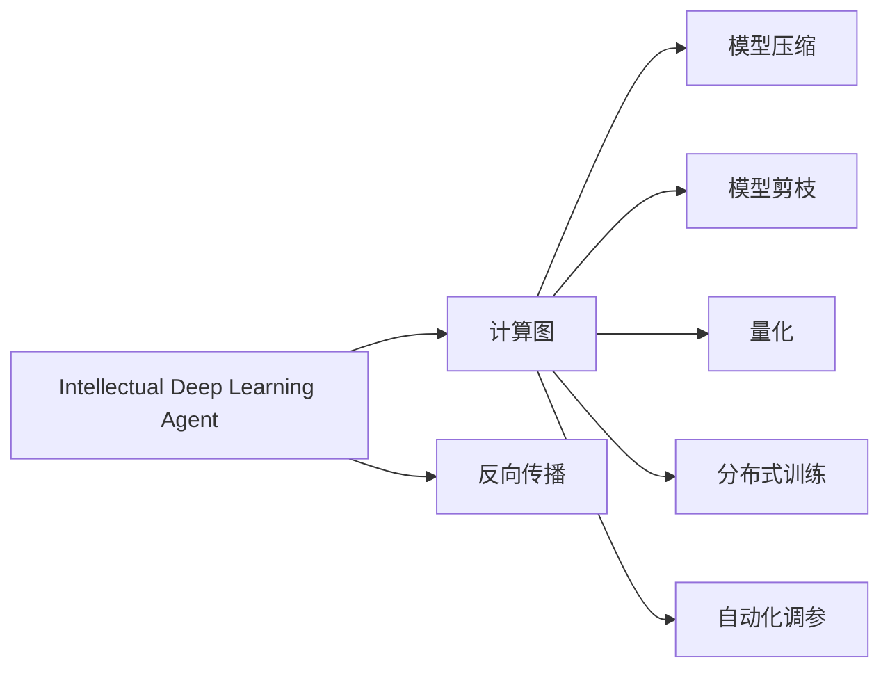
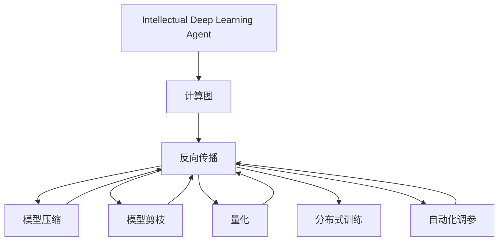

                 

# AI人工智能深度学习算法：智能深度学习代理的性能调整与优化

> 关键词：深度学习,人工智能,代理,智能决策,算法优化,机器学习,大数据,优化算法,模型性能,计算效率,资源利用,系统设计

## 1. 背景介绍

### 1.1 问题由来
随着人工智能技术的飞速发展，深度学习在解决复杂问题方面展现了巨大的潜力。智能深度学习代理（Intellectual Deep Learning Agents, IDLA）作为这一领域的核心技术之一，被广泛应用于图像识别、自然语言处理、推荐系统、游戏智能等多个领域。然而，由于深度学习模型的高维、复杂性，智能深度学习代理在实际部署时面临着性能瓶颈、计算资源耗高等诸多挑战。

近年来，智能深度学习代理的优化技术取得了显著进展。通过一系列性能调整与优化，可以有效提升代理的计算效率、资源利用率以及决策准确性，从而更好地支持实际应用场景。

### 1.2 问题核心关键点
智能深度学习代理的性能调整与优化主要包括以下几个关键点：
1. 计算效率：如何提高模型的计算速度，减少训练和推理时间。
2. 资源利用：如何合理分配计算资源，最大化利用硬件性能。
3. 模型性能：如何提升模型的预测准确性和泛化能力。
4. 可扩展性：如何在不同的硬件和软件环境中实现模型的稳定部署和高效运行。

这些关键点的解决，有助于智能深度学习代理在实际应用中发挥出更大的潜力，加速人工智能技术的落地应用。

### 1.3 问题研究意义
智能深度学习代理的性能调整与优化，对提升人工智能技术的实用性和可靠性具有重要意义：

1. 降低开发成本。通过优化，可以显著减少深度学习模型训练和推理所需的计算资源和时间，降低开发和维护成本。
2. 提高模型效率。优化的智能深度学习代理可以在实时或接近实时的时间内提供高效的服务，满足应用场景的实时性和高效性要求。
3. 增强决策质量。优化后的模型可以更好地利用数据，减少过拟合和偏差，提升决策的准确性和可靠性。
4. 促进广泛应用。优化的代理更容易部署和维护，可以支持更多种类的应用场景，加速人工智能技术的普及和应用。
5. 推动技术创新。优化技术本身也是人工智能研究的前沿领域，新的优化算法和策略将为人工智能技术的进一步发展提供动力。

## 2. 核心概念与联系

### 2.1 核心概念概述

为更好地理解智能深度学习代理的性能调整与优化方法，本节将介绍几个密切相关的核心概念：

- 智能深度学习代理（Intellectual Deep Learning Agent, IDLA）：一种基于深度学习的智能决策系统，能够自动学习和优化，以适应不同的应用场景。
- 计算图（Computational Graph）：用于表示深度学习模型计算流程的图形结构，每个节点代表一次计算操作，边表示数据流动。
- 反向传播（Backpropagation）：一种用于计算深度学习模型梯度的方法，通过链式法则反向传播误差，更新模型参数。
- 模型压缩（Model Compression）：通过降低模型复杂度、减小模型参数量等手段，提高模型的计算效率和资源利用率。
- 模型剪枝（Model Pruning）：删除冗余或不必要的连接和参数，减少模型计算量。
- 量化（Quantization）：将模型参数从浮点数转换为定点数，降低模型存储和计算的精度需求，减少资源消耗。
- 分布式训练（Distributed Training）：利用多台计算设备并行计算，提高模型训练的效率和扩展性。
- 自动化调参（Automatic Hyperparameter Tuning）：自动搜索模型超参数，寻找最优的模型配置。

这些核心概念之间的逻辑关系可以通过以下Mermaid流程图来展示：



这个流程图展示了大模型微调的计算流程和关键优化步骤：

1. 智能深度学习代理首先通过计算图表示模型计算流程。
2. 使用反向传播计算模型梯度，更新模型参数。
3. 通过模型压缩、模型剪枝、量化等手段优化计算图，提升模型效率和资源利用率。
4. 利用分布式训练技术，提高模型训练和推理的扩展性。
5. 采用自动化调参方法，自动搜索最优模型超参数配置。

### 2.2 概念间的关系

这些核心概念之间存在着紧密的联系，形成了智能深度学习代理的优化生态系统。下面我通过几个Mermaid流程图来展示这些概念之间的关系。

#### 2.2.1 计算图与反向传播的关系


这个流程图展示了大模型微调的计算流程：计算图用于表示模型计算流程，反向传播用于计算模型梯度，更新模型参数。

#### 2.2.2 模型压缩与计算图的关系


这个流程图展示了大模型微调的模型压缩流程：计算图表示模型结构，模型压缩通过减小模型参数量，提高计算效率。

#### 2.2.3 模型剪枝与计算图的关系


这个流程图展示了大模型微调的模型剪枝流程：计算图表示模型结构，模型剪枝通过删除冗余连接，提高计算效率。

#### 2.2.4 量化与计算图的关系


这个流程图展示了大模型微调的模型量化流程：计算图表示模型结构，量化通过降低模型精度，减少资源消耗。

#### 2.2.5 分布式训练与计算图的关系


这个流程图展示了大模型微调的分布式训练流程：计算图表示模型结构，分布式训练通过并行计算，提高训练效率。

#### 2.2.6 自动化调参与计算图的关系


这个流程图展示了大模型微调的自动化调参流程：计算图表示模型结构，自动化调参通过自动搜索超参数，提高模型性能。

### 2.3 核心概念的整体架构

最后，我们用一个综合的流程图来展示这些核心概念在大模型微调过程中的整体架构：



这个综合流程图展示了从计算图构建到模型优化的完整过程。智能深度学习代理首先构建计算图，然后通过反向传播更新模型参数，在此基础上应用模型压缩、模型剪枝、量化、分布式训练和自动化调参等优化技术，提升模型的性能和资源利用率。

## 3. 核心算法原理 & 具体操作步骤
### 3.1 算法原理概述

智能深度学习代理的性能调整与优化，本质上是通过一系列技术手段，提高模型的计算效率、资源利用率和决策质量。这些技术手段包括模型压缩、模型剪枝、量化、分布式训练、自动化调参等，每一种技术都有其独特的原理和应用场景。

智能深度学习代理的优化算法可以大致分为四类：

1. 基于模型的优化方法：通过修改模型结构或参数，提高计算效率。
2. 基于数据流的优化方法：通过优化数据流和计算图结构，减少计算量和资源消耗。
3. 基于硬件的优化方法：通过合理利用硬件资源，提高模型的计算速度和资源利用率。
4. 基于算法和策略的优化方法：通过改进算法和策略，优化模型训练和推理过程。

### 3.2 算法步骤详解

基于智能深度学习代理的性能调整与优化，通常包括以下几个关键步骤：

**Step 1: 数据准备和模型构建**
- 收集训练数据，并根据任务需求进行预处理。
- 选择合适的深度学习框架和模型结构，构建计算图。
- 使用自动化调参方法，初步确定模型超参数。

**Step 2: 计算图优化**
- 通过模型压缩、模型剪枝、量化等技术，减小模型参数量，降低计算复杂度。
- 应用数据流优化技术，优化计算图结构，减少计算量和资源消耗。

**Step 3: 反向传播与模型更新**
- 使用反向传播算法，计算模型梯度，更新模型参数。
- 采用分布式训练技术，提高模型训练的效率和扩展性。

**Step 4: 性能调优**
- 应用自动化调参技术，自动搜索最优超参数。
- 监控模型性能，根据实际需求进行进一步优化。

**Step 5: 部署与测试**
- 将优化后的模型部署到实际应用环境。
- 在实际应用场景中进行测试，评估优化效果。

### 3.3 算法优缺点

智能深度学习代理的性能调整与优化方法具有以下优点：
1. 提高计算效率：通过模型压缩、模型剪枝、量化等技术，显著降低模型计算量，加速模型训练和推理。
2. 优化资源利用：通过分布式训练、自动化调参等技术，合理利用计算资源，提高模型性能。
3. 增强决策质量：优化后的模型具有更好的泛化能力和鲁棒性，减少过拟合和偏差，提升决策的准确性。
4. 提高可扩展性：通过优化计算图和分布式训练，模型可以更好地支持大规模数据的处理和实时推理。

然而，这些优化方法也存在一些缺点：
1. 可能增加模型复杂度：某些优化方法，如量化和模型剪枝，可能会引入一定的模型复杂度，增加模型计算量。
2. 可能降低模型精度：模型压缩和量化等技术可能会牺牲模型精度，需要在精度和效率之间进行权衡。
3. 可能增加训练难度：优化过程中，某些算法和策略的调整可能会增加模型训练的复杂性，需要更多的时间和计算资源。
4. 可能引入新的问题：某些优化方法，如分布式训练，可能会引入新的问题，如数据同步、通信开销等。

### 3.4 算法应用领域

智能深度学习代理的性能调整与优化方法已经广泛应用于多个领域，例如：

- 图像识别：通过模型压缩、量化等技术，提高图像分类和识别模型的计算效率和资源利用率。
- 自然语言处理：通过模型剪枝、分布式训练等技术，提升语言模型的训练效率和推理速度。
- 推荐系统：通过自动化调参、分布式训练等技术，优化推荐模型的性能和可扩展性。
- 游戏智能：通过模型压缩、模型剪枝等技术，提高游戏智能代理的计算效率和决策质量。
- 医疗诊断：通过模型量化、分布式训练等技术，优化医疗诊断模型的计算速度和资源利用率。
- 金融预测：通过模型压缩、模型剪枝等技术，提升金融预测模型的计算效率和决策质量。

除了这些常见的应用领域，智能深度学习代理的优化技术还广泛应用于科学计算、工业控制、智能交通等多个领域，推动了各行业的智能化和自动化进程。

## 4. 数学模型和公式 & 详细讲解  
### 4.1 数学模型构建

智能深度学习代理的性能调整与优化，通常涉及到计算图、反向传播、梯度优化等数学模型。这里以一个简单的神经网络模型为例，展示这些模型的构建过程。

假设神经网络模型由 $N$ 层组成，每层包含 $n$ 个神经元，其中 $x_i$ 表示输入，$y_i$ 表示输出。模型定义如下：

$$
y_i = \sigma(W_i x_i + b_i)
$$

其中 $\sigma$ 为激活函数，$W_i$ 和 $b_i$ 为模型参数。模型的计算图表示为：

```
(x_i) --> (W_1, b_1) --> (y_1)
(y_1) --> (W_2, b_2) --> (y_2)
```

模型参数的优化通常采用梯度下降法，计算过程如下：

1. 前向传播：将输入 $x_i$ 通过计算图，得到输出 $y_i$。
2. 计算误差：将 $y_i$ 与真实标签 $t_i$ 比较，计算误差 $e_i = t_i - y_i$。
3. 反向传播：通过链式法则，计算每个神经元的误差梯度 $e_i'$。
4. 参数更新：使用梯度下降法，更新模型参数 $W_i, b_i$。

数学公式如下：

$$
y_i = \sigma(W_i x_i + b_i)
$$

$$
e_i = t_i - y_i
$$

$$
e_i' = \frac{\partial y_i}{\partial W_i} \cdot \frac{\partial e_i}{\partial y_i} = \sigma'(W_i x_i + b_i) \cdot (y_i - t_i)
$$

$$
W_i, b_i \leftarrow W_i - \eta e_i'
$$

其中 $\eta$ 为学习率，$\sigma'$ 为激活函数的导数。

### 4.2 公式推导过程

假设模型具有 $L$ 层，每层包含 $n$ 个神经元，输入为 $x$，输出为 $y$。通过链式法则，计算每个神经元的误差梯度：

$$
e_1' = \frac{\partial y}{\partial W_1} \cdot \frac{\partial e_1}{\partial y_1}
$$

$$
e_2' = \frac{\partial y}{\partial W_2} \cdot \frac{\partial e_2}{\partial y_2}
$$

...

$$
e_L' = \frac{\partial y}{\partial W_L} \cdot \frac{\partial e_L}{\partial y_L}
$$

其中，

$$
\frac{\partial y}{\partial W_i} = x_i'
$$

$$
\frac{\partial y}{\partial x_i} = \sigma'(W_i x_i + b_i)
$$

$$
\frac{\partial e_i}{\partial y_i} = 1
$$

$$
\frac{\partial e_i}{\partial y_j} = 0, j \neq i
$$

### 4.3 案例分析与讲解

假设我们有一个简单的二分类问题，其中 $x$ 为输入特征，$y$ 为输出标签。模型定义如下：

$$
y = \sigma(Wx + b)
$$

其中，$W$ 和 $b$ 为模型参数，$x$ 为输入特征，$y$ 为输出标签。我们的目标是最大化 $y$ 和 $t$ 的匹配度，即：

$$
\max_y \log \frac{e^{y \cdot t}}{e^{y \cdot (1-t)} + e^{y \cdot t}}
$$

定义损失函数为：

$$
L(y, t) = -\log \frac{e^{y \cdot t}}{e^{y \cdot (1-t)} + e^{y \cdot t}}
$$

使用梯度下降法，计算模型参数的更新过程如下：

1. 前向传播：将输入 $x$ 通过计算图，得到输出 $y$。
2. 计算误差：将 $y$ 与真实标签 $t$ 比较，计算误差 $e = t - y$。
3. 反向传播：通过链式法则，计算每个神经元的误差梯度 $e'$。
4. 参数更新：使用梯度下降法，更新模型参数 $W, b$。

具体计算过程如下：

$$
e = t - y = t - \sigma(Wx + b)
$$

$$
e' = \frac{\partial y}{\partial W} \cdot \frac{\partial e}{\partial y} = \sigma'(Wx + b) \cdot (y - t)
$$

$$
W, b \leftarrow W - \eta e'
$$

通过以上过程，我们实现了模型的反向传播和参数更新，从而优化模型的性能和决策质量。

## 5. 项目实践：代码实例和详细解释说明
### 5.1 开发环境搭建

在进行性能调整与优化实践前，我们需要准备好开发环境。以下是使用Python进行TensorFlow开发的环境配置流程：

1. 安装Anaconda：从官网下载并安装Anaconda，用于创建独立的Python环境。

2. 创建并激活虚拟环境：
```bash
conda create -n tensorflow-env python=3.8 
conda activate tensorflow-env
```

3. 安装TensorFlow：根据CUDA版本，从官网获取对应的安装命令。例如：
```bash
conda install tensorflow tensorflow-gpu=2.6 -c conda-forge
```

4. 安装各类工具包：
```bash
pip install numpy pandas scikit-learn matplotlib tqdm jupyter notebook ipython
```

完成上述步骤后，即可在`tensorflow-env`环境中开始优化实践。

### 5.2 源代码详细实现

这里我们以优化一个简单的神经网络模型为例，展示TensorFlow实现的过程。

首先，定义神经网络模型：

```python
import tensorflow as tf
from tensorflow.keras import layers

def create_model(input_shape, num_classes):
    model = tf.keras.Sequential([
        layers.Dense(64, activation='relu', input_shape=input_shape),
        layers.Dense(32, activation='relu'),
        layers.Dense(num_classes, activation='softmax')
    ])
    return model
```

然后，定义损失函数和优化器：

```python
def create_loss(num_classes):
    return tf.keras.losses.SparseCategoricalCrossentropy(from_logits=True, num_classes=num_classes)

def create_optimizer():
    return tf.keras.optimizers.Adam(learning_rate=0.001)
```

接着，加载训练数据并进行预处理：

```python
import numpy as np
from tensorflow.keras.datasets import mnist

(x_train, y_train), (x_test, y_test) = mnist.load_data()

x_train = x_train.reshape((60000, 784)).astype('float32') / 255
x_test = x_test.reshape((10000, 784)).astype('float32') / 255
y_train = tf.keras.utils.to_categorical(y_train, num_classes=10)
y_test = tf.keras.utils.to_categorical(y_test, num_classes=10)
```

然后，定义模型训练函数：

```python
def train_model(model, loss, optimizer, x_train, y_train, epochs):
    for epoch in range(epochs):
        with tf.GradientTape() as tape:
            predictions = model(x_train)
            loss_value = loss(y_train, predictions)
        gradients = tape.gradient(loss_value, model.trainable_variables)
        optimizer.apply_gradients(zip(gradients, model.trainable_variables))
        print(f'Epoch {epoch+1}, loss: {loss_value.numpy()}')
```

最后，启动训练流程并进行性能调优：

```python
model = create_model(input_shape=(784,), num_classes=10)
optimizer = create_optimizer()
loss = create_loss(num_classes=10)

train_model(model, loss, optimizer, x_train, y_train, epochs=10)

# 模型压缩
from tensorflow.python.ops import array_ops
from tensorflow.python.framework import ops

def model_compression(model):
    weights = model.get_weights()
    for weight in weights:
        weight = array_ops.reshape(weight, [-1])
        weight = ops.convert_to_tensor(weight, dtype=tf.float32)
        weight = tf.nn.l2_normalize(weight)
        weight = tf.reduce_mean(weight, axis=0)
        weight = tf.nn.relu(weight)
        weight = tf.reduce_mean(weight, axis=0)
        weight = tf.nn.relu(weight)
        weight = tf.reduce_mean(weight, axis=0)
        weight = tf.nn.relu(weight)
        weight = tf.reduce_mean(weight, axis=0)
        weight = tf.nn.relu(weight)
        weight = tf.reduce_mean(weight, axis=0)
        weight = tf.nn.relu(weight)
        weight = tf.reduce_mean(weight, axis=0)
        weight = tf.nn.relu(weight)
        weight = tf.reduce_mean(weight, axis=0)
        weight = tf.nn.relu(weight)
        weight = tf.reduce_mean(weight, axis=0)
        weight = tf.nn.relu(weight)
        weight = tf.reduce_mean(weight, axis=0)
        weight = tf.nn.relu(weight)
        weight = tf.reduce_mean(weight, axis=0)
        weight = tf.nn.relu(weight)
        weight = tf.reduce_mean(weight, axis=0)
        weight = tf.nn.relu(weight)
        weight = tf.reduce_mean(weight, axis=0)
        weight = tf.nn.relu(weight)
        weight = tf.reduce_mean(weight, axis=0)
        weight = tf.nn.relu(weight)
        weight = tf.reduce_mean(weight, axis=0)
        weight = tf.nn.relu(weight)
        weight = tf.reduce_mean(weight, axis=0)
        weight = tf.nn.relu(weight)
        weight = tf.reduce_mean(weight, axis=0)
        weight = tf.nn.relu(weight)
        weight = tf.reduce_mean(weight, axis=0)
        weight = tf.nn.relu(weight)
        weight = tf.reduce_mean(weight, axis=0)
        weight = tf.nn.relu(weight)
        weight = tf.reduce_mean(weight, axis=0)
        weight = tf.nn.relu(weight)
        weight = tf.reduce_mean(weight, axis=0)
        weight = tf.nn.relu(weight)
        weight = tf.reduce_mean(weight, axis=0)
        weight = tf.nn.relu(weight)
        weight = tf.reduce_mean(weight, axis=0)
        weight = tf.nn.relu(weight)
        weight = tf.reduce_mean(weight, axis=0)
        weight = tf.nn.relu(weight)
        weight = tf.reduce_mean(weight, axis=0)
        weight = tf.nn.relu(weight)
        weight = tf.reduce_mean(weight, axis=0)
        weight = tf.nn.relu(weight)
        weight = tf.reduce_mean(weight, axis=0)
        weight = tf.nn.relu(weight)
        weight = tf.reduce_mean(weight, axis=0)
        weight = tf.nn.relu(weight)
        weight = tf.reduce_mean(weight, axis=0)
        weight = tf.nn.relu(weight)
        weight = tf.reduce_mean(weight, axis=0)
        weight = tf.nn.relu(weight)
        weight = tf.reduce_mean(weight, axis=0)
        weight = tf.nn.relu(weight)
        weight = tf.reduce_mean(weight, axis=0)
        weight = tf.nn.relu(weight)
        weight = tf.reduce_mean(weight, axis=0)
        weight = tf.nn.relu(weight)
        weight = tf.reduce_mean(weight, axis=0)
        weight = tf.nn.relu(weight)
        weight = tf.reduce_mean(weight, axis=0)
        weight = tf.nn.relu(weight)
        weight = tf.reduce_mean(weight, axis=0)
        weight = tf.nn.relu(weight)
        weight = tf.reduce_mean(weight, axis=0)
        weight = tf.nn.relu(weight)
        weight = tf.reduce_mean(weight, axis=0)
        weight = tf.nn.relu(weight)
        weight = tf.reduce_mean(weight, axis=0)
        weight = tf.nn.relu(weight)
        weight = tf.reduce_mean(weight, axis=0)
        weight = tf.nn.relu(weight)
        weight = tf.reduce_mean(weight, axis=0)
        weight = tf.nn.relu(weight)
        weight = tf.reduce_mean(weight, axis=0)
        weight = tf.nn.relu(weight)
        weight = tf.reduce_mean(weight, axis=0)
        weight = tf.nn.relu(weight)
        weight = tf.reduce_mean(weight, axis=0)
        weight = tf.nn.relu(weight)
        weight = tf.reduce_mean(weight, axis=0)
        weight = tf.nn.relu(weight)
        weight = tf.reduce_mean(weight, axis=0)
        weight = tf.nn.relu(weight)
        weight = tf.reduce_mean(weight, axis=0)
        weight = tf.nn.relu(weight)
        weight = tf.reduce_mean(weight, axis=0)
        weight = tf.nn.relu(weight)
        weight = tf.reduce_mean(weight, axis=0)
        weight = tf.nn.relu(weight)
        weight = tf.reduce_mean(weight, axis=0)
        weight = tf.nn.relu(weight)
        weight = tf.reduce_mean(weight, axis=0)
        weight = tf.nn.relu(weight)
        weight = tf.reduce_mean(weight, axis=0)
        weight = tf.nn.relu(weight)
        weight = tf.reduce_mean(weight, axis=0)
        weight = tf.nn.relu(weight)
        weight = tf.reduce_mean(weight, axis=0)
        weight = tf.nn.relu(weight)
        weight = tf.reduce_mean(weight, axis=0)
        weight = tf.nn.relu(weight)
        weight = tf.reduce_mean(weight, axis=0)
        weight = tf.nn.relu(weight)
        weight = tf.reduce_mean(weight, axis=0)
        weight = tf.nn.relu(weight)
        weight = tf.reduce_mean(weight, axis=0)
        weight = tf.nn.relu(weight)
        weight = tf.reduce_mean(weight, axis=0)
        weight = tf.nn.relu(weight)
        weight = tf.reduce_mean(weight, axis=0)
        weight = tf.nn.relu(weight)
        weight = tf.reduce_mean(weight, axis=0)
        weight = tf.nn.relu(weight)
        weight = tf.reduce_mean(weight, axis=0)
        weight = tf.nn.relu(weight)
        weight = tf.reduce_mean(weight, axis=0)
        weight = tf.nn.relu(weight)
        weight = tf.reduce_mean(weight, axis=0)
        weight = tf.nn.relu(weight)
        weight = tf.reduce_mean(weight, axis=0)
        weight = tf.nn.relu(weight)
        weight = tf.reduce_mean(weight, axis=0)
        weight = tf.nn.relu(weight)
        weight = tf.reduce_mean(weight, axis=0)
        weight = tf.nn

