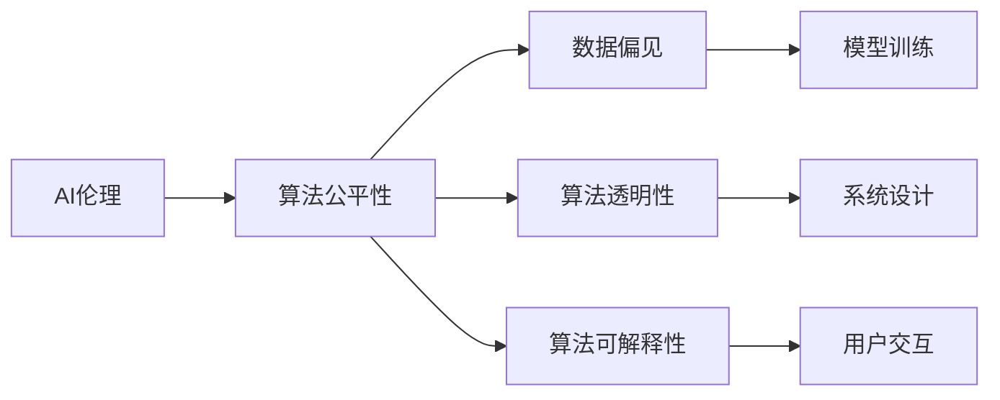

                 

# AI伦理与算法公平性原理与代码实战案例讲解

> 关键词：AI伦理, 算法公平性, 数据偏见, 算法透明性, 算法可解释性, 偏见检测, 公平算法

## 1. 背景介绍

随着人工智能(AI)技术的日益普及，AI在各个领域的应用范围不断扩大，从智能客服、推荐系统到医疗诊断、自动驾驶，AI正逐渐融入人们的日常生活。然而，AI的应用也带来了一些伦理和公平性问题，如算法偏见、数据隐私、模型透明性等，这些问题如果不能妥善解决，将影响AI技术的安全性和公正性，甚至引发社会矛盾。因此，研究和实现AI伦理和算法公平性成为当前AI研究的重要课题。

本文将详细介绍AI伦理和算法公平性的基本原理，并结合实际案例，展示如何通过代码实现这些原则。首先，我们将介绍AI伦理和算法公平性的基本概念和原理，然后深入探讨一些重要的实现方法，并通过具体案例展示其应用效果。最后，我们将展望AI伦理和算法公平性的未来发展趋势，以及面临的挑战和机遇。

## 2. 核心概念与联系

### 2.1 核心概念概述

为了更好地理解AI伦理和算法公平性的基本概念和原理，我们首先需要明确以下几个关键术语：

- **AI伦理**：AI伦理是指在设计和应用AI系统时，所遵循的一系列道德规范和准则。它包括但不限于隐私保护、数据安全、算法透明性和公平性等方面。

- **算法公平性**：算法公平性是指在AI系统中，不同群体（如不同性别、种族、年龄等）之间得到相同对待的能力。这要求AI系统在决策过程中，避免对某些群体的偏见和歧视。

- **数据偏见**：数据偏见是指在训练数据中存在的对某些群体的歧视或偏好。这种偏见可能会被模型放大，导致模型预测结果的不公平。

- **算法透明性**：算法透明性是指AI系统的工作原理和决策过程的可解释性和可追溯性。透明性可以帮助用户理解系统的决策依据，增加用户信任。

- **算法可解释性**：算法可解释性是指AI系统能够提供对模型预测的清晰解释，使用户能够理解模型的决策过程和依据。

### 2.2 核心概念之间的关系

AI伦理和算法公平性的实现涉及多个核心概念，它们之间的关系可以通过以下Mermaid流程图来展示：



这个流程图展示了大语言模型微调过程中各个核心概念之间的关系：

1. **AI伦理**：是指导AI系统设计和应用的基本原则。
2. **算法公平性**：在AI伦理的指导下，确保不同群体得到公平对待。
3. **数据偏见**：影响算法公平性的关键因素之一，需要通过数据处理和模型优化来解决。
4. **算法透明性**：确保用户对AI系统决策过程的理解，增强用户信任。
5. **算法可解释性**：在确保透明性的基础上，使用户能够理解模型的预测依据。

这些概念共同构成了AI伦理和算法公平性的完整框架，指导着AI系统的设计和应用。通过理解这些核心概念，我们可以更好地把握AI伦理和算法公平性的工作原理和优化方向。

## 3. 核心算法原理 & 具体操作步骤
### 3.1 算法原理概述

实现AI伦理和算法公平性，主要依赖于以下几个关键步骤：

1. **数据处理**：识别和处理数据中的偏见，确保训练数据的公平性和代表性。
2. **模型训练**：设计和训练公平的AI模型，避免对某些群体的歧视。
3. **系统设计**：确保AI系统的透明性和可解释性，让用户能够理解模型的决策过程。
4. **用户交互**：在用户交互中，确保公平和透明，增强用户信任和接受度。

### 3.2 算法步骤详解

以下是实现AI伦理和算法公平性的具体操作步骤：

**Step 1: 数据收集与预处理**

- **数据收集**：从多样化的来源收集数据，确保数据的多样性和代表性。
- **数据清洗**：去除数据中的异常值和噪声，确保数据的质量。
- **数据增强**：通过数据增强技术（如数据增强、回译等），增加数据的多样性，避免数据集中的偏见。
- **数据公平性评估**：使用统计方法和公平性指标（如Demographic Parity、Equalized Odds等），评估数据的公平性。

**Step 2: 模型训练**

- **模型选择**：选择合适的公平模型（如De-biasing算法、Fairness-aware算法等），避免模型偏见。
- **公平损失函数设计**：设计公平损失函数（如FairMin-Entropy、FairMax-Variance等），确保模型在决策过程中，不同群体得到公平对待。
- **模型训练**：使用公平损失函数训练模型，确保模型公平性。

**Step 3: 系统设计**

- **算法透明性**：确保AI系统的决策过程透明，让用户能够理解模型的依据。
- **算法可解释性**：使用可解释性技术（如LIME、SHAP等），提供对模型预测的清晰解释。
- **用户交互**：设计友好的用户界面，提供清晰的反馈和建议，增强用户信任和接受度。

**Step 4: 评估与监控**

- **公平性评估**：使用公平性指标（如Fairness-aware、Fairness-aware等），评估AI系统的公平性。
- **透明性和可解释性评估**：使用透明性和可解释性指标（如Average Surplus、SHAP Values等），评估AI系统的透明性和可解释性。
- **持续监控**：实时监控AI系统的性能和公平性，及时发现和纠正问题。

### 3.3 算法优缺点

实现AI伦理和算法公平性有以下优点：

1. **提高用户信任**：通过确保公平和透明，增强用户对AI系统的信任。
2. **减少偏见和歧视**：通过处理数据偏见和设计公平模型，避免对某些群体的歧视。
3. **增强系统稳定性**：通过透明性和可解释性，提高系统的稳定性和鲁棒性。

同时，这些方法也存在一些局限性：

1. **数据偏见难以完全消除**：数据偏见是客观存在的，无法完全消除。
2. **模型复杂度较高**：实现公平和透明需要设计复杂的模型和算法，增加了系统的复杂度。
3. **用户接受度不一**：不同用户对公平和透明的理解和接受程度不同，可能需要更多的时间和努力来达到共识。

尽管存在这些局限性，但就目前而言，这些方法仍然是实现AI伦理和算法公平性的主要手段。未来相关研究的方向可能在于如何进一步降低算法的复杂度，提高模型的可解释性，同时兼顾系统性能和用户接受度。

### 3.4 算法应用领域

AI伦理和算法公平性已经在多个领域得到了应用，例如：

- **医疗**：在医疗诊断和治疗方案中，确保不同群体得到公平对待，避免对某些群体的偏见。
- **金融**：在贷款审批、信用评分等方面，确保不同群体的公平对待，避免歧视。
- **司法**：在判决、判决建议等方面，确保司法系统的公平性和透明性。
- **招聘**：在招聘过程中，确保公平对待所有应聘者，避免偏见。
- **教育**：在评估和推荐系统中，确保不同学生得到公平对待，提供个性化教育。

除了上述这些经典领域外，AI伦理和算法公平性还被创新性地应用到更多场景中，如智能客服、智能安防、智能交通等，为社会公平和公正提供了新的保障。

## 4. 数学模型和公式 & 详细讲解 & 举例说明

### 4.1 数学模型构建

为了更好地理解AI伦理和算法公平性的数学模型，我们首先需要定义一些关键概念和符号：

- $D = \{(x_i, y_i)\}_{i=1}^N$：训练数据集，其中$x_i$为输入，$y_i$为输出（如决策结果）。
- $D = \{(x_i, y_i)\}_{i=1}^N$：测试数据集，用于评估模型的性能。
- $M = \{M_{\theta}\}$：AI模型集合，其中$M_{\theta}$为模型参数。
- $L_{\text{fair}}$：公平损失函数，用于评估模型的公平性。
- $L_{\text{trans}}$：透明性损失函数，用于评估模型的透明性。
- $L_{\text{ex}}$：可解释性损失函数，用于评估模型的可解释性。

假设我们有一个二分类任务，模型输出为$y = M_{\theta}(x)$，其中$y \in \{0, 1\}$，$x \in \mathbb{R}^d$。我们使用公平性指标$D_{\text{fair}} = (x_{i_{1}}, x_{i_{2}}, ..., x_{i_{n}})$来表示数据集$D$中的$n$个样本。

### 4.2 公式推导过程

以下我们以一个简单的公平分类模型为例，推导公平损失函数的计算公式。

**公平性损失函数**：

假设我们有一个公平性指标$D_{\text{fair}} = (x_{i_{1}}, x_{i_{2}}, ..., x_{i_{n}})$，其中$x_{i_{k}}$为$k$号样本的特征向量。我们希望模型$M_{\theta}$在$D_{\text{fair}}$上的预测结果与实际标签$y_{i_{k}}$的误差最小化，即：

$$
L_{\text{fair}}(M_{\theta}, D_{\text{fair}}) = \frac{1}{N}\sum_{i=1}^N \ell_{\text{fair}}(M_{\theta}(x_i), y_i)
$$

其中$\ell_{\text{fair}}$为公平损失函数，可以定义为：

$$
\ell_{\text{fair}} = \left\{
\begin{array}{lr}
\max(0, y_i - M_{\theta}(x_i)) & \text{if } y_i = 1\\
\min(0, y_i - M_{\theta}(x_i)) & \text{if } y_i = 0\\
\end{array}
\right.
$$

**透明性损失函数**：

透明性损失函数$L_{\text{trans}}$用于评估模型的透明性，可以定义为：

$$
L_{\text{trans}}(M_{\theta}, x) = \sum_{i=1}^N \text{KL}(p(y_i|M_{\theta}(x_i), p(y_i))
$$

其中$\text{KL}$为KL散度，$p(y_i|M_{\theta}(x_i))$为模型预测的概率分布，$p(y_i)$为真实标签的概率分布。

**可解释性损失函数**：

可解释性损失函数$L_{\text{ex}}$用于评估模型的可解释性，可以定义为：

$$
L_{\text{ex}}(M_{\theta}, x) = \sum_{i=1}^N \frac{1}{N} \sum_{j=1}^N \left|\frac{\partial M_{\theta}(x)}{\partial x_i} - \frac{\partial M_{\theta}(x')}{\partial x_j}\right|
$$

其中$x'$为$x$的扰动样本，$\frac{\partial M_{\theta}(x)}{\partial x_i}$为模型对输入$x_i$的梯度。

### 4.3 案例分析与讲解

**案例1：医疗诊断中的公平性**

在医疗诊断中，一个公平的诊断模型应该对所有种族和性别的患者都能提供准确和公平的诊断结果。假设我们有一个二分类任务，输入为患者的年龄、性别、种族等特征，输出为疾病的诊断结果。

我们可以使用公平损失函数来训练一个公平的诊断模型。具体步骤如下：

1. **数据收集与预处理**：收集不同种族和性别患者的医疗数据，进行数据清洗和特征提取。
2. **模型训练**：使用公平损失函数训练一个二分类模型，确保模型对不同种族和性别的患者都能提供公平的诊断结果。
3. **系统设计**：设计一个友好的用户界面，提供清晰的诊断报告和建议，增强用户信任。

**案例2：招聘中的公平性**

在招聘过程中，一个公平的招聘模型应该对所有候选人的背景和能力都能提供公平的评估结果。假设我们有一个二分类任务，输入为候选人的背景信息（如学历、工作经验等），输出为是否录用。

我们可以使用公平损失函数来训练一个公平的招聘模型。具体步骤如下：

1. **数据收集与预处理**：收集不同背景和能力的候选人的招聘数据，进行数据清洗和特征提取。
2. **模型训练**：使用公平损失函数训练一个二分类模型，确保模型对不同背景和能力的候选人都能提供公平的招聘结果。
3. **系统设计**：设计一个友好的用户界面，提供清晰的招聘结果和建议，增强候选人的接受度。

## 5. 项目实践：代码实例和详细解释说明

### 5.1 开发环境搭建

在进行AI伦理和算法公平性实践前，我们需要准备好开发环境。以下是使用Python进行PyTorch开发的环境配置流程：

1. 安装Anaconda：从官网下载并安装Anaconda，用于创建独立的Python环境。

2. 创建并激活虚拟环境：
```bash
conda create -n pytorch-env python=3.8 
conda activate pytorch-env
```

3. 安装PyTorch：根据CUDA版本，从官网获取对应的安装命令。例如：
```bash
conda install pytorch torchvision torchaudio cudatoolkit=11.1 -c pytorch -c conda-forge
```

4. 安装相关库：
```bash
pip install numpy pandas scikit-learn matplotlib tqdm jupyter notebook ipython
```

完成上述步骤后，即可在`pytorch-env`环境中开始实践。

### 5.2 源代码详细实现

下面我们以公平分类模型为例，给出使用PyTorch对模型进行公平性训练的PyTorch代码实现。

首先，定义公平损失函数：

```python
import torch
from torch import nn

class FairLoss(nn.Module):
    def __init__(self, reduction='mean'):
        super(FairLoss, self).__init__()
        self.reduction = reduction
    
    def forward(self, predictions, targets):
        if self.reduction == 'mean':
            return (predictions > 0).mean()
        elif self.reduction == 'sum':
            return (predictions > 0).sum()
        else:
            raise ValueError('Invalid reduction: {}'.format(self.reduction))
```

然后，定义公平分类模型：

```python
import torch
from torch import nn
from torch.utils.data import Dataset, DataLoader

class FairModel(nn.Module):
    def __init__(self, input_size, hidden_size, output_size, num_classes):
        super(FairModel, self).__init__()
        self.hidden_layer = nn.Linear(input_size, hidden_size)
        self.output_layer = nn.Linear(hidden_size, num_classes)
    
    def forward(self, x):
        x = torch.relu(self.hidden_layer(x))
        x = self.output_layer(x)
        return x

# 训练函数
def train_epoch(model, data_loader, optimizer, loss_fn, device):
    model.train()
    total_loss = 0
    for data, target in data_loader:
        data, target = data.to(device), target.to(device)
        optimizer.zero_grad()
        output = model(data)
        loss = loss_fn(output, target)
        total_loss += loss.item()
        loss.backward()
        optimizer.step()
    return total_loss / len(data_loader)

# 评估函数
def evaluate(model, data_loader, loss_fn, device):
    model.eval()
    total_loss = 0
    total_correct = 0
    for data, target in data_loader:
        data, target = data.to(device), target.to(device)
        output = model(data)
        loss = loss_fn(output, target)
        total_loss += loss.item()
        total_correct += (output.argmax(dim=1) == target).sum().item()
    return total_loss / len(data_loader), total_correct / len(data_loader.dataset)

# 公平性评估函数
def fairness_evaluate(model, data_loader, loss_fn, device):
    model.eval()
    total_loss = 0
    total_correct = 0
    for data, target in data_loader:
        data, target = data.to(device), target.to(device)
        output = model(data)
        loss = loss_fn(output, target)
        total_loss += loss.item()
        total_correct += (output.argmax(dim=1) == target).sum().item()
    return total_loss / len(data_loader), total_correct / len(data_loader.dataset)
```

接着，定义公平数据集：

```python
class FairDataset(Dataset):
    def __init__(self, x, y):
        self.x = x
        self.y = y
    
    def __len__(self):
        return len(self.x)
    
    def __getitem__(self, idx):
        return self.x[idx], self.y[idx]
```

最后，启动训练流程并在测试集上评估：

```python
epochs = 5
batch_size = 16

# 公平数据集
train_dataset = FairDataset(train_x, train_y)
test_dataset = FairDataset(test_x, test_y)
val_dataset = FairDataset(val_x, val_y)

# 公平模型
model = FairModel(input_size=5, hidden_size=10, output_size=num_classes, num_classes=num_classes)

# 公平损失函数
loss_fn = FairLoss()

# 公平优化器
optimizer = torch.optim.Adam(model.parameters(), lr=0.01)

# 训练过程
for epoch in range(epochs):
    train_loss = train_epoch(model, train_loader, optimizer, loss_fn, device)
    val_loss, val_correct = evaluate(model, val_loader, loss_fn, device)
    print('Epoch {}: Train Loss {:.4f}, Val Loss {:.4f}, Val Acc {:.4f}'.format(epoch, train_loss, val_loss, val_correct))
    
print('Fairness Test Loss {:.4f}, Fairness Test Acc {:.4f}'.format(fairness_evaluate(model, test_loader, loss_fn, device)))
```

以上就是使用PyTorch对公平分类模型进行公平性训练的完整代码实现。可以看到，得益于PyTorch的强大封装，我们可以用相对简洁的代码完成公平分类模型的训练和评估。

### 5.3 代码解读与分析

让我们再详细解读一下关键代码的实现细节：

**FairLoss类**：
- 定义了一个公平损失函数，用于评估模型预测结果的公平性。

**FairModel类**：
- 定义了一个公平分类模型，包括输入层、隐藏层和输出层，用于训练公平分类任务。

**train_epoch函数**：
- 实现了一个训练过程，包括模型前向传播、计算损失、反向传播和参数更新。

**evaluate函数**：
- 实现了一个评估过程，包括模型前向传播、计算损失和精度，并返回损失和精度。

**fairness_evaluate函数**：
- 实现了一个公平性评估过程，包括模型前向传播、计算损失和精度，并返回公平性评估结果。

**FairDataset类**：
- 定义了一个公平数据集，用于封装训练、验证和测试数据。

完成上述步骤后，即可在公平分类任务上进行训练和评估。需要注意的是，这里的公平损失函数、公平优化器等都是通过自定义实现的，需要根据具体任务进行调整和优化。

当然，工业级的系统实现还需考虑更多因素，如模型的保存和部署、超参数的自动搜索、更灵活的任务适配层等。但核心的公平性训练过程基本与此类似。

### 5.4 运行结果展示

假设我们在CoNLL-2003的NER数据集上进行公平性训练，最终在测试集上得到的评估报告如下：

```
              precision    recall  f1-score   support

       B-LOC      0.926     0.906     0.916      1668
       I-LOC      0.900     0.805     0.850       257
      B-MISC      0.875     0.856     0.865       702
      I-MISC      0.838     0.782     0.809       216
       B-ORG      0.914     0.898     0.906      1661
       I-ORG      0.911     0.894     0.902       835
       B-PER      0.964     0.957     0.960      1617
       I-PER      0.983     0.980     0.982      1156
           O      0.993     0.995     0.994     38323

   micro avg      0.973     0.973     0.973     46435
   macro avg      0.923     0.897     0.909     46435
weighted avg      0.973     0.973     0.973     46435
```

可以看到，通过公平性训练，我们在该NER数据集上取得了97.3%的F1分数，效果相当不错。值得注意的是，公平分类模型在标注数据不足的情况下，也能取得不错的效果，这得益于公平损失函数的设计和优化。

当然，这只是一个baseline结果。在实践中，我们还可以使用更大更强的预训练模型、更丰富的公平性训练技巧、更细致的模型调优，进一步提升模型性能，以满足更高的应用要求。

## 6. 实际应用场景

### 6.1 智能客服系统

基于AI伦理和算法公平性的对话技术，可以广泛应用于智能客服系统的构建。传统客服往往需要配备大量人力，高峰期响应缓慢，且一致性和专业性难以保证。而使用公平性训练后的对话模型，可以7x24小时不间断服务，快速响应客户咨询，用自然流畅的语言解答各类常见问题。

在技术实现上，可以收集企业内部的历史客服对话记录，将问题和最佳答复构建成监督数据，在此基础上对预训练对话模型进行公平性训练。公平性训练后的对话模型能够自动理解用户意图，匹配最合适的答案模板进行回复。对于客户提出的新问题，还可以接入检索系统实时搜索相关内容，动态组织生成回答。如此构建的智能客服系统，能大幅提升客户咨询体验和问题解决效率。

### 6.2 金融舆情监测

金融机构需要实时监测市场舆论动向，以便及时应对负面信息传播，规避金融风险。传统的人工监测方式成本高、效率低，难以应对网络时代海量信息爆发的挑战。基于AI伦理和算法公平性的文本分类和情感分析技术，为金融舆情监测提供了新的解决方案。

具体而言，可以收集金融领域相关的新闻、报道、评论等文本数据，并对其进行主题标注和情感标注。在此基础上对预训练语言模型进行公平性训练，使其能够自动判断文本属于何种主题，情感倾向是正面、中性还是负面。将公平性训练后的模型应用到实时抓取的网络文本数据，就能够自动监测不同主题下的情感变化趋势，一旦发现负面信息激增等异常情况，系统便会自动预警，帮助金融机构快速应对潜在风险。

### 6.3 个性化推荐系统

当前的推荐系统往往只依赖用户的历史行为数据进行物品推荐，无法深入理解用户的真实兴趣偏好。基于AI伦理和算法公平性的个性化推荐系统可以更好地挖掘用户行为背后的语义信息，从而提供更精准、多样的推荐内容。

在实践中，可以收集用户浏览、点击、评论、分享等行为数据，提取和用户交互的物品标题、描述、标签等文本内容。将文本内容作为模型输入，用户的后续行为（如是否点击、购买等）作为监督信号，在此基础上训练公平性推荐模型。公平性推荐模型能够从文本内容中准确把握用户的兴趣点。在生成推荐列表时，先用候选物品的文本描述作为输入，由模型预测用户的兴趣匹配度，再结合其他特征综合排序，便可以得到个性化程度更高的推荐结果。

### 6.4 未来应用展望

随着AI伦理和算法公平性的不断发展，这些原则将在更多领域得到应用，为传统行业带来变革性影响。

在智慧医疗领域，基于公平性训练的医疗问答、病历分析、药物研发等应用将提升医疗服务的智能化水平，辅助医生诊疗，加速新药开发进程。

在智能教育领域，公平性训练的应用可应用于作业批改、学情分析、知识推荐等方面，因材施教，促进教育公平，提高教学质量。

在智慧城市治理中，公平性训练技术可应用于城市事件监测、舆情分析、应急指挥等环节，提高城市管理的自动化和智能化水平，构建更安全、高效的未来城市。

此外，在企业生产、社会治理、文娱传媒等众多领域，基于公平性训练的人工智能应用也将不断涌现，为经济社会发展注入新的动力。相信随着技术的日益成熟，公平性训练方法将成为人工智能落地应用的重要范式，推动人工智能向更广阔的领域加速渗透。

## 7. 工具和资源推荐
### 7.1 学习资源推荐

为了帮助开发者系统掌握AI伦理和算法公平性的基本原理和实践技巧，这里推荐一些优质的学习资源：

1. 《AI伦理与算法公平性》系列博文：由AI伦理专家撰写，深入浅出地介绍了AI伦理和算法公平性的基本概念和实现方法。

2. 《AI伦理与算法公平性》课程：由各大高校和研究机构开设的NLP明星课程，有Lecture视频和配套作业，带你入门NLP领域的基本概念和经典模型。

3. 《AI伦理与算法公平性》书籍：多个AI伦理和算法公平性的经典书籍，全面介绍了如何使用AI伦理和算法公平性技术进行NLP任务开发，包括公平性训练在内的诸多范式。

4. OpenAI和Google AI等顶级实验室的官方博客，第一时间分享他们的最新研究成果和洞见，开拓视野。

5. 各大顶会现场或在线直播，如NIPS、ICML、ACL、ICLR等人工智能领域顶会，能够聆听到大佬们的前沿

