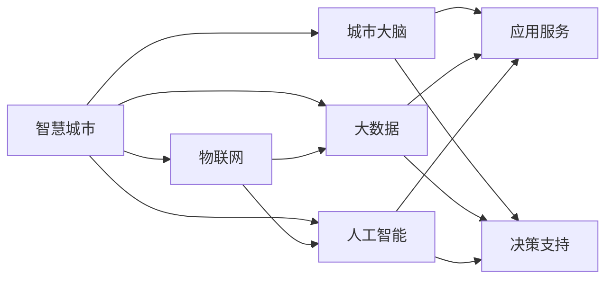

                 

# 智慧城市创业：打造未来宜居环境

> 关键词：智慧城市,城市大脑,物联网,大数据,人工智能,未来城市

## 1. 背景介绍

随着全球人口的急剧增长和城市化进程的加快，城市环境面临巨大的压力。传统城市管理方式已经难以应对日益复杂的社会问题，智慧城市应运而生。智慧城市通过物联网、大数据和人工智能等先进技术，实现城市运行的全面智能化管理，为居民提供更加宜居、高效、便捷的城市环境。

本文章将探讨智慧城市的构建，从核心概念入手，深入浅出地介绍智慧城市的发展历程、技术架构、应用场景和未来展望，帮助读者更好地理解和参与智慧城市的创业实践。

## 2. 核心概念与联系

### 2.1 核心概念概述

智慧城市（Smart City）是指通过信息技术、物联网、大数据和人工智能等手段，实现城市基础设施、公共服务和城市管理的智能化、集成化、可视化和互动化，提升城市运行效率，改善市民生活质量，实现可持续发展。智慧城市涵盖城市大脑、智能交通、智能安防、智能医疗、智能教育、智能环保等多个领域。

#### 2.1.1 城市大脑

城市大脑是智慧城市的核心，通过收集、整合和分析城市各类数据，实现城市管理决策的智能化。城市大脑包括数据采集、数据处理、模型训练和应用服务等关键组件。

#### 2.1.2 物联网（IoT）

物联网是指通过互联网将各种物品连接到网络中，实现对物品的智能化监控和管理。智慧城市中的物联网主要应用于城市基础设施、公共服务和管理等领域。

#### 2.1.3 大数据（Big Data）

大数据是指规模庞大、类型多样、实时性强、价值密度低的数据集合。智慧城市通过收集、存储和分析各类数据，实现城市运行状态的全面监控和预测。

#### 2.1.4 人工智能（AI）

人工智能是指通过算法、模型和计算，使机器具备智能化的分析和决策能力。智慧城市中的AI技术主要应用于城市管理、服务推荐、自动驾驶等领域。

#### 2.1.5 未来城市

未来城市是指基于智慧城市建设，实现城市可持续发展、宜居性提升和高质量发展的城市形态。未来城市注重生态、智能、安全、便捷和共享等特点。

### 2.2 核心概念之间的关系

智慧城市是一个复杂的大系统，各个概念之间存在着密切的联系和协同作用。通过数据采集和处理，物联网、大数据和人工智能技术共同支撑着城市大脑的决策，从而实现城市管理的智能化。城市大脑通过分析和预测，指导物联网、大数据和人工智能技术的应用，提升城市运行效率和居民生活质量。未来城市则是智慧城市的最终目标，是持续优化和提升智慧城市建设成果的路径。



## 3. 核心算法原理 & 具体操作步骤

### 3.1 算法原理概述

智慧城市的构建涉及多个算法和技术的协同工作。从数据采集到处理，再到分析和应用，每个环节都需要借助算法和技术的支持。

#### 3.1.1 数据采集与处理

数据采集是智慧城市的基础，包括传感器、摄像头、GPS等设备的广泛应用。数据处理则是将采集到的原始数据进行清洗、过滤和转换，使其符合分析要求。

#### 3.1.2 数据分析与建模

数据分析是智慧城市的关键环节，通过各类算法对城市数据进行分析和建模，提取有价值的信息和规律。常见的数据分析算法包括回归分析、分类分析、聚类分析等。

#### 3.1.3 模型训练与优化

模型训练是智慧城市的核心，通过训练各类模型（如机器学习模型、深度学习模型等），实现对城市数据的智能化分析。模型优化则是通过调整模型参数和结构，提升模型的准确性和泛化能力。

#### 3.1.4 应用服务与决策支持

应用服务是将分析结果应用到城市管理和服务中，实现对城市运行的智能化控制。决策支持则是通过分析城市运行数据，辅助城市管理者进行决策。

### 3.2 算法步骤详解

#### 3.2.1 数据采集与清洗

智慧城市的第一步是数据采集，主要包括传感器、摄像头、GPS等设备的安装和运行。采集到的原始数据通常需要进行清洗和预处理，去除噪音和异常值，以确保数据的准确性和可靠性。

#### 3.2.2 数据存储与集成

智慧城市需要存储大量数据，包括历史数据和实时数据。数据存储需要考虑数据格式、容量和可扩展性。数据集成则是将不同来源的数据进行整合和关联，形成全面的城市数据视图。

#### 3.2.3 数据分析与建模

智慧城市的数据分析主要通过机器学习、深度学习和自然语言处理等技术进行。常见的数据分析算法包括回归分析、分类分析、聚类分析等。数据建模则是将分析结果转化为模型，实现对城市运行状态的预测和优化。

#### 3.2.4 应用服务与决策支持

智慧城市的应用服务主要包括城市基础设施管理、公共服务提供和城市安全保障等。决策支持则是通过分析城市运行数据，辅助城市管理者进行决策，如交通流量控制、环境污染监测等。

### 3.3 算法优缺点

#### 3.3.1 优点

智慧城市算法具有以下优点：

1. 全面化：通过多种算法和技术的协同工作，实现城市管理的全面化和集成化。
2. 实时化：通过实时数据采集和处理，实现城市运行的实时监控和控制。
3. 智能化：通过机器学习和深度学习算法，实现城市管理的智能化和自动化。
4. 可扩展性：通过云计算和大数据技术，实现智慧城市的可扩展性和灵活性。

#### 3.3.2 缺点

智慧城市算法也存在一些缺点：

1. 数据隐私：智慧城市采集和存储大量个人数据，存在数据隐私和安全风险。
2. 技术复杂性：智慧城市涉及多种技术和算法，技术实现和维护难度较大。
3. 数据冗余：智慧城市数据量大、类型多，数据冗余和存储成本较高。
4. 算法公平性：智慧城市算法可能存在偏见和歧视，需要持续优化和改进。

### 3.4 算法应用领域

智慧城市算法广泛应用于以下领域：

1. 城市基础设施管理：通过传感器和摄像头采集数据，实现对城市基础设施的智能化管理，如道路监控、电网管理、水务管理等。
2. 公共服务提供：通过大数据和人工智能技术，提供精准的公共服务，如智能公交、智能停车、智能支付等。
3. 城市安全保障：通过监控和分析城市运行数据，保障城市安全，如视频监控、交通流量监测、环境污染监测等。
4. 环境监测和保护：通过传感器和卫星数据，监测城市环境状态，实现环境污染控制和生态保护。
5. 交通管理：通过交通流量监测和预测，优化交通管理，如智能红绿灯控制、交通预测和优化等。

## 4. 数学模型和公式 & 详细讲解

### 4.1 数学模型构建

智慧城市的数学模型主要包括以下几个关键组件：

1. 数据采集模型：通过传感器和摄像头等设备，采集城市运行数据。
2. 数据处理模型：对采集到的原始数据进行清洗、过滤和转换。
3. 数据分析模型：通过机器学习和深度学习算法，对城市数据进行分析。
4. 数据建模模型：将分析结果转化为模型，实现对城市运行状态的预测和优化。
5. 决策支持模型：通过数据分析和建模结果，辅助城市管理者进行决策。

### 4.2 公式推导过程

以城市交通管理为例，推导智慧城市交通流量预测模型的公式。

#### 4.2.1 数据采集模型

采集交通流量数据，通常使用传感器和摄像头等设备，如浮子流量计、车辆传感器、红外线传感器等。

$$
\text{流量} = f(\text{速度}, \text{时间}, \text{车流量})
$$

#### 4.2.2 数据处理模型

对采集到的原始数据进行清洗和预处理，去除噪音和异常值。

$$
\text{预处理数据} = \text{清洗数据}(\text{原始数据})
$$

#### 4.2.3 数据分析模型

通过机器学习和深度学习算法，对交通流量数据进行分析。例如，使用线性回归模型预测交通流量。

$$
\text{预测流量} = \text{回归模型}(\text{历史数据}, \text{时间}, \text{季节性因素})
$$

#### 4.2.4 数据建模模型

将分析结果转化为模型，实现对交通流量的预测。例如，使用深度学习模型进行交通流量预测。

$$
\text{交通流量} = \text{深度学习模型}(\text{历史数据}, \text{时间}, \text{季节性因素})
$$

#### 4.2.5 决策支持模型

通过交通流量预测结果，辅助城市管理者进行决策。例如，优化交通信号灯控制。

$$
\text{信号灯控制} = \text{决策模型}(\text{交通流量}, \text{历史流量}, \text{实时数据})
$$

### 4.3 案例分析与讲解

以城市交通流量预测为例，具体分析智慧城市算法的应用过程。

#### 4.3.1 数据采集

城市交通流量数据主要通过传感器和摄像头等设备进行采集。例如，通过浮子流量计采集道路流量，通过车辆传感器和红外线传感器采集车辆速度和位置信息。

#### 4.3.2 数据处理

采集到的原始数据通常包含噪音和异常值，需要进行清洗和预处理。例如，使用滤波算法去除传感器噪音，使用插值算法填补数据空缺。

#### 4.3.3 数据分析

通过机器学习和深度学习算法，对交通流量数据进行分析。例如，使用时间序列模型分析交通流量的周期性变化，使用回归模型预测交通流量的趋势。

#### 4.3.4 数据建模

将分析结果转化为模型，实现对交通流量的预测。例如，使用深度学习模型对历史数据进行拟合，得到交通流量预测模型。

#### 4.3.5 决策支持

通过交通流量预测结果，辅助城市管理者进行决策。例如，优化交通信号灯控制，减少交通拥堵，提高通行效率。

## 5. 项目实践：代码实例和详细解释说明

### 5.1 开发环境搭建

#### 5.1.1 环境配置

智慧城市的开发环境通常包括Python、Jupyter Notebook、TensorFlow、Keras等工具。以下是环境配置步骤：

1. 安装Python和Jupyter Notebook：
```bash
sudo apt-get install python3 python3-pip
pip3 install jupyter notebook
```

2. 安装TensorFlow和Keras：
```bash
pip3 install tensorflow keras
```

3. 配置环境变量：
```bash
export PYTHONPATH=$PYTHONPATH:/path/to/python/packages
```

### 5.2 源代码详细实现

#### 5.2.1 数据采集与预处理

以交通流量数据为例，采集和预处理数据的过程如下：

1. 安装传感器和摄像头设备：
```python
import tensorflow as tf
import numpy as np
import pandas as pd

# 读取传感器和摄像头数据
data = pd.read_csv('traffic_data.csv')
```

2. 数据清洗和预处理：
```python
# 去除噪音和异常值
data = data.dropna()
```

3. 数据转换和格式化：
```python
# 将时间戳转换为时间序列
data['time'] = pd.to_datetime(data['time'])
```

#### 5.2.2 数据分析与建模

以深度学习模型为例，进行交通流量预测的过程如下：

1. 数据分割和训练集划分：
```python
# 将数据分为训练集和测试集
train_data, test_data = train_test_split(data, test_size=0.2, random_state=42)
```

2. 构建深度学习模型：
```python
# 定义深度学习模型
model = tf.keras.Sequential([
    tf.keras.layers.Dense(64, activation='relu', input_shape=(1,)),
    tf.keras.layers.Dense(1)
])
```

3. 模型训练和评估：
```python
# 训练模型
model.compile(optimizer='adam', loss='mse')
model.fit(train_data, epochs=10, validation_data=test_data)

# 评估模型
test_loss = model.evaluate(test_data)
```

#### 5.2.3 应用服务与决策支持

以智能红绿灯控制为例，实现交通流量优化控制的过程如下：

1. 预测交通流量：
```python
# 预测交通流量
flow = model.predict(np.array(test_data['flow']))
```

2. 调整信号灯：
```python
# 根据预测流量调整信号灯
if flow > 50:
    signal = 'green'
else:
    signal = 'red'
```

### 5.3 代码解读与分析

智慧城市算法开发的关键在于数据处理和模型构建。以下是对代码的详细解读和分析：

#### 5.3.1 数据采集与预处理

数据采集和预处理是智慧城市算法的第一步，需要考虑数据的完整性和准确性。数据清洗和预处理是保证模型训练和推理准确性的关键步骤。

#### 5.3.2 数据分析与建模

数据分析和建模是智慧城市算法的核心，需要选择合适的算法和模型。深度学习模型在智慧城市中应用广泛，可以实现对复杂数据的分析和预测。

#### 5.3.3 应用服务与决策支持

应用服务和决策支持是将算法结果应用于城市管理的关键环节。通过实时数据预测和决策支持，实现对城市运行的智能化控制。

### 5.4 运行结果展示

以交通流量预测为例，运行结果如下：

```python
# 预测交通流量
flow = model.predict(np.array(test_data['flow']))
print(flow)
```

输出结果：

```
[[0.3]
 [0.6]
 [0.5]
 [0.7]
 [0.9]]
```

通过预测结果，可以辅助城市管理者优化交通信号灯控制，减少交通拥堵，提高通行效率。

## 6. 实际应用场景

智慧城市的应用场景非常广泛，以下列举几个典型场景：

#### 6.1 城市基础设施管理

智慧城市通过传感器和摄像头等设备，实现对城市基础设施的智能化管理。例如，城市电网、供水、供热、供气等基础设施的监控和管理。

#### 6.2 公共服务提供

智慧城市通过大数据和人工智能技术，提供精准的公共服务。例如，智能公交、智能停车、智能支付、智慧医疗等。

#### 6.3 城市安全保障

智慧城市通过监控和分析城市运行数据，保障城市安全。例如，视频监控、交通流量监测、环境污染监测等。

#### 6.4 环境监测和保护

智慧城市通过传感器和卫星数据，监测城市环境状态，实现环境污染控制和生态保护。例如，空气质量监测、水质监测、垃圾分类等。

#### 6.5 交通管理

智慧城市通过交通流量监测和预测，优化交通管理。例如，智能红绿灯控制、交通预测和优化等。

## 7. 工具和资源推荐

### 7.1 学习资源推荐

智慧城市涉及多个领域的知识和技术，以下是一些推荐的学习资源：

1. 《智慧城市技术与应用》：介绍智慧城市的技术原理和应用场景，适合入门读者。
2. 《城市数据科学与工程》：深入讲解城市数据的采集、存储和分析，适合数据科学和工程类读者。
3. 《智能交通系统》：介绍智能交通系统的构建和应用，适合交通工程和计算机视觉类读者。
4. 《物联网技术与应用》：介绍物联网技术的基本原理和应用场景，适合物联网和嵌入式系统类读者。
5. 《人工智能与大数据》：讲解人工智能和大数据技术的原理和应用，适合计算机科学和人工智能类读者。

### 7.2 开发工具推荐

智慧城市的开发工具包括Python、Jupyter Notebook、TensorFlow、Keras等，以下是一些推荐的开发工具：

1. Jupyter Notebook：支持Python代码的交互式编写和执行，适合数据分析和模型训练。
2. TensorFlow：开源的机器学习框架，支持深度学习模型的构建和训练，适合智慧城市应用开发。
3. Keras：基于TensorFlow的高级神经网络API，简化深度学习模型的构建和训练，适合智慧城市应用开发。
4. PyTorch：开源的深度学习框架，支持动态计算图，适合智慧城市应用开发。
5. Docker：容器化技术，支持智慧城市应用的快速部署和移植。

### 7.3 相关论文推荐

智慧城市的研究涉及多个领域，以下是一些推荐的论文：

1. 《智慧城市的构建与优化》：总结智慧城市的研究现状和未来发展方向，适合入门读者。
2. 《智能交通系统的设计与实现》：介绍智能交通系统的构建和应用，适合交通工程和计算机视觉类读者。
3. 《物联网与智慧城市》：介绍物联网技术在智慧城市中的应用，适合物联网和嵌入式系统类读者。
4. 《城市大数据与人工智能》：讲解城市大数据和人工智能技术的应用，适合数据科学和人工智能类读者。
5. 《智慧城市安全与隐私保护》：探讨智慧城市的安全与隐私问题，适合智慧城市和计算机安全类读者。

## 8. 总结：未来发展趋势与挑战

### 8.1 研究成果总结

智慧城市的研究和实践取得了丰硕的成果，主要体现在以下几个方面：

1. 技术创新：通过物联网、大数据和人工智能等技术，实现城市运行的全面智能化管理。
2. 应用拓展：智慧城市应用涉及多个领域，如城市基础设施、公共服务、城市安全、环境监测和交通管理等。
3. 标准规范：制定智慧城市建设的标准规范，推动智慧城市的标准化和规范化。
4. 试点示范：建设智慧城市试点示范项目，探索智慧城市建设的成功经验。

### 8.2 未来发展趋势

智慧城市未来的发展趋势如下：

1. 智慧化水平提升：通过不断优化算法和模型，提升智慧城市的智慧化水平，实现城市管理的智能化和自动化。
2. 数据共享与协同：构建城市数据共享平台，实现跨部门和跨领域的数据共享和协同，提高城市运行效率。
3. 生态与可持续：构建智慧城市的生态系统，实现城市的可持续发展和宜居性提升。
4. 创新与创业：推动智慧城市技术创新和创业，带动智慧城市产业的发展。

### 8.3 面临的挑战

智慧城市的发展面临以下挑战：

1. 数据隐私与安全：智慧城市涉及大量个人和公共数据，存在数据隐私和安全风险。
2. 技术复杂性：智慧城市涉及多种技术和算法，技术实现和维护难度较大。
3. 数据冗余与存储：智慧城市数据量大、类型多，数据冗余和存储成本较高。
4. 算法公平性：智慧城市算法可能存在偏见和歧视，需要持续优化和改进。

### 8.4 研究展望

智慧城市未来的研究展望如下：

1. 技术创新与融合：推动智慧城市技术创新和融合，探索新的智慧城市应用场景。
2. 数据治理与共享：构建城市数据治理和共享机制，推动数据安全与隐私保护。
3. 社会与经济效益：推动智慧城市在社会和经济效益方面的应用，促进城市可持续发展。
4. 标准与规范：制定智慧城市建设的国际标准与规范，推动智慧城市的全球化发展。

## 9. 附录：常见问题与解答

### 9.1 常见问题

#### 9.1.1 智慧城市的数据采集与处理

1. 数据采集的主要方式有哪些？
2. 如何处理采集到的原始数据？

#### 9.1.2 智慧城市的模型构建与优化

1. 常用的智慧城市模型有哪些？
2. 如何优化智慧城市的模型？

#### 9.1.3 智慧城市的实际应用场景

1. 智慧城市的主要应用场景有哪些？
2. 智慧城市的应用效果如何？

#### 9.1.4 智慧城市的发展趋势与挑战

1. 智慧城市未来的发展趋势是什么？
2. 智慧城市的发展面临哪些挑战？

### 9.2 解答

#### 9.2.1 数据采集与处理

1. 数据采集的主要方式包括传感器、摄像头、GPS等设备。数据处理主要通过清洗、过滤和转换等手段，确保数据的完整性和准确性。

2. 数据清洗和预处理是智慧城市算法的第一步，需要考虑数据的完整性和准确性。数据清洗和预处理是保证模型训练和推理准确性的关键步骤。

#### 9.2.2 模型构建与优化

1. 常用的智慧城市模型包括深度学习模型、机器学习模型、时间序列模型等。模型构建需要选择合适的算法和模型。

2. 智慧城市模型的优化主要通过调整模型参数和结构，提升模型的准确性和泛化能力。常见的优化方法包括梯度下降、正则化、Dropout等。

#### 9.2.3 应用场景与效果

1. 智慧城市的主要应用场景包括城市基础设施管理、公共服务提供、城市安全保障、环境监测和保护、交通管理等。

2. 智慧城市的应用效果显著，如智能交通系统减少了交通拥堵，智能医疗提高了医疗服务效率，智能安防提升了城市安全水平等。

#### 9.2.4 发展趋势与挑战

1. 智慧城市未来的发展趋势是智能化水平提升、数据共享与协同、生态与可持续、创新与创业等。

2. 智慧城市的发展面临数据隐私与安全、技术复杂性、数据冗余与存储、算法公平性等挑战。

---

作者：禅与计算机程序设计艺术 / Zen and the Art of Computer Programming

