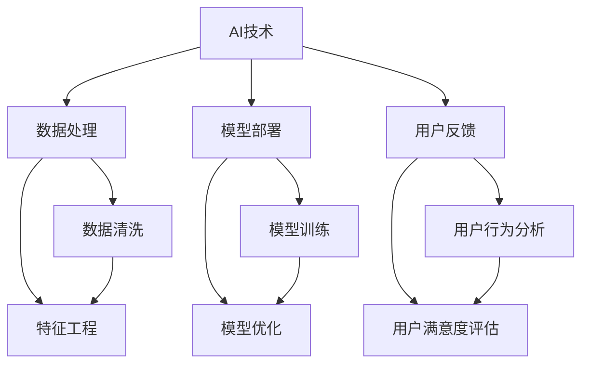
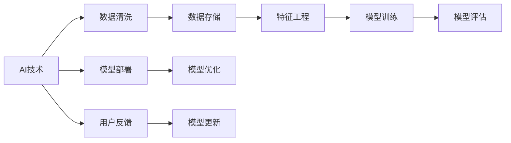

                 

## 1. 背景介绍

随着人工智能技术的不断成熟，智能应用正快速渗透到各行各业，加速了传统产业的数字化转型和升级。从智能客服到智能制造，从智慧医疗到智能交通，AI技术的普及和应用正在重新塑造生产力和价值链。然而，如何高效、低成本地将AI技术转化为实际业务价值，实现智能产业化的全面落地，成为当前智能应用发展的重要课题。本文将深入探讨智能产业化的发展方向与趋势，旨在为AI技术在各行业的应用提供有价值的参考。

### 1.1 智能产业化的定义与重要性
智能产业化是指将人工智能技术转化为实际业务价值，提升生产效率和服务质量的过程。智能产业化的重要性体现在以下几个方面：
- **效率提升**：AI技术能够自动化执行重复性高、规则明确的任务，大幅提升生产和服务效率。
- **成本降低**：通过AI技术优化资源配置和流程设计，降低运营成本。
- **质量改善**：AI技术具备强大的数据分析和处理能力，能够提升产品和服务质量。
- **市场竞争**：AI技术是企业保持竞争力的重要手段，有助于在激烈的市场竞争中脱颖而出。

### 1.2 当前智能产业化的现状
目前，智能产业化已经在多个行业取得了显著成果，包括但不限于：
- **智能制造**：通过机器视觉、自然语言处理等技术，实现智能质量检测、智能仓储、智能调度等功能。
- **智慧医疗**：利用AI进行医学影像分析、疾病诊断、个性化治疗等，提升医疗服务质量和效率。
- **智能客服**：通过自然语言理解和生成技术，实现智能问答、自动化客户服务等，提升客户满意度。
- **智能交通**：运用AI技术优化交通信号控制、自动驾驶等，提升交通安全和通行效率。

尽管取得了诸多进展，智能产业化仍面临一些挑战：
- **数据隐私和安全**：AI技术在应用过程中需处理大量敏感数据，数据隐私和安全问题亟待解决。
- **技术标准化**：AI技术应用场景复杂多样，缺乏统一的技术标准和规范，增加了应用难度。
- **人才短缺**：AI技术开发和应用需要高素质人才，目前仍面临人才储备不足的问题。

## 2. 核心概念与联系

### 2.1 核心概念概述
智能产业化涉及多个核心概念，包括AI技术、数据处理、模型部署、用户反馈等。这些概念之间的联系可以通过以下Mermaid流程图来展示：



这个流程图展示了AI技术、数据处理、模型部署、用户反馈之间的联系：

1. **AI技术**：智能产业化的基础，提供自动化决策和智能服务。
2. **数据处理**：数据清洗和特征工程是数据处理的关键步骤，直接影响模型的性能和应用效果。
3. **模型部署**：将训练好的模型应用于实际业务场景，实现自动化决策和智能服务。
4. **用户反馈**：用户行为分析和满意度评估是优化模型的重要依据，帮助提升用户体验和服务质量。

### 2.2 概念间的关系

这些核心概念之间的逻辑关系可以通过以下Mermaid流程图来进一步展示：



这个流程图展示了AI技术应用的一般流程：

1. **AI技术**：首先应用在数据处理中，包括数据清洗和特征工程。
2. **数据存储**：清洗后的数据存储在数据库或数据湖中，供模型训练和应用使用。
3. **模型训练**：基于清洗后的数据，进行模型训练和评估。
4. **模型部署**：训练好的模型部署到生产环境，实现自动化决策和智能服务。
5. **用户反馈**：收集用户行为和满意度数据，反馈给模型优化，进一步提升模型性能。

## 3. 核心算法原理 & 具体操作步骤

### 3.1 算法原理概述

智能产业化涉及多种AI算法，其中监督学习算法、无监督学习算法和强化学习算法是核心。本文将以监督学习算法为例，阐述其基本原理和操作步骤。

### 3.2 算法步骤详解

监督学习算法通常包括数据准备、模型训练、模型评估和模型部署四个步骤：

1. **数据准备**：收集和清洗数据，将其转化为模型可以处理的格式。
2. **模型训练**：使用训练数据训练模型，得到初始模型参数。
3. **模型评估**：使用验证集对模型进行评估，调整模型参数以提高模型性能。
4. **模型部署**：将训练好的模型部署到实际应用场景中，实现自动化决策和智能服务。

### 3.3 算法优缺点

监督学习算法具有以下优点：
- **高效性**：在已有标注数据的情况下，训练时间较短，模型效果显著。
- **泛化能力**：模型能够基于少量数据快速适应新场景，泛化能力强。

但监督学习算法也存在一些缺点：
- **标注成本高**：需要大量标注数据，成本较高。
- **过拟合风险**：标注数据较少时，模型容易过拟合。

### 3.4 算法应用领域

监督学习算法广泛应用于以下领域：
- **金融风控**：利用监督学习模型进行信用评分、风险评估等，提升风险管理水平。
- **智能推荐**：通过监督学习模型推荐个性化商品和服务，提升用户体验。
- **医疗诊断**：基于医疗数据训练监督学习模型，进行疾病预测和诊断。
- **智能客服**：利用监督学习模型进行自然语言理解和生成，实现智能问答和自动化客户服务。

## 4. 数学模型和公式 & 详细讲解 & 举例说明

### 4.1 数学模型构建

监督学习算法的数学模型构建通常包括输入特征、目标变量和损失函数三个部分。假设输入特征为 $\mathbf{x}$，目标变量为 $y$，损失函数为 $\mathcal{L}$，模型为 $f(\mathbf{x};\theta)$。模型的目标是最小化损失函数 $\mathcal{L}(y,f(\mathbf{x};\theta))$，其中 $\theta$ 为模型参数。

### 4.2 公式推导过程

以线性回归模型为例，其目标是最小化均方误差损失函数：

$$
\mathcal{L}(y,f(\mathbf{x};\theta)) = \frac{1}{2N}\sum_{i=1}^N (y_i - f(\mathbf{x}_i;\theta))^2
$$

其中，$N$ 为样本数量，$y_i$ 为第 $i$ 个样本的真实标签，$f(\mathbf{x}_i;\theta)$ 为模型预测结果，$\theta$ 为模型参数。通过梯度下降等优化算法，不断调整 $\theta$，使损失函数最小化。

### 4.3 案例分析与讲解

假设我们有一组房价数据，包括房屋面积 $x_1$、房间数 $x_2$、地理位置 $x_3$ 和价格 $y$。我们希望通过监督学习模型预测新房屋的价格。首先，将数据分为训练集和验证集，对模型进行训练和评估。训练过程中，使用随机梯度下降算法更新模型参数 $\theta$。最终，模型能够在未见过的数据上，根据房屋特征预测其价格。

## 5. 项目实践：代码实例和详细解释说明

### 5.1 开发环境搭建

在进行智能产业化项目开发时，我们需要搭建一个Python开发环境，包括必要的库和工具。以下是Python开发环境的搭建步骤：

1. 安装Anaconda：从官网下载并安装Anaconda，用于创建独立的Python环境。
2. 创建并激活虚拟环境：
```bash
conda create -n my_env python=3.8
conda activate my_env
```
3. 安装必要的Python库：
```bash
pip install numpy pandas scikit-learn matplotlib
```
4. 安装必要的Python工具：
```bash
pip install jupyter notebook ipython
```

完成上述步骤后，即可在`my_env`环境中开始项目开发。

### 5.2 源代码详细实现

以下是一个简单的线性回归模型示例，使用Scikit-learn库实现：

```python
from sklearn.linear_model import LinearRegression
from sklearn.metrics import mean_squared_error

# 准备数据
X = [[1], [2], [3], [4], [5]]
y = [2, 4, 6, 8, 10]

# 创建模型
model = LinearRegression()

# 训练模型
model.fit(X, y)

# 预测新数据
new_X = [[6]]
predicted_y = model.predict(new_X)

# 输出预测结果
print(predicted_y)
```

### 5.3 代码解读与分析

**代码实现**：
- 首先导入必要的库，包括线性回归模型和均方误差指标。
- 准备数据，将房屋面积作为特征 $X$，价格作为标签 $y$。
- 创建线性回归模型，并使用训练数据 $X$ 和 $y$ 训练模型。
- 预测新房屋价格，使用模型对房屋面积 $new_X$ 进行预测。
- 输出预测结果，展示模型对新数据的表现。

**代码分析**：
- 线性回归模型是最简单的监督学习模型，用于预测线性关系。
- 数据准备阶段，需要将原始数据转化为模型能够处理的形式。
- 模型训练阶段，使用训练数据进行模型参数的调整。
- 模型评估阶段，使用验证集进行模型性能的评估，调整模型参数。
- 模型部署阶段，将训练好的模型应用于实际业务场景，实现自动化决策。

## 6. 实际应用场景

### 6.1 金融风控

在金融风控领域，监督学习算法可以用于客户信用评分、贷款违约预测等。例如，利用历史贷款数据训练模型，评估新客户的信用风险，帮助银行决定是否发放贷款。

### 6.2 智能推荐

在电商和内容推荐领域，监督学习算法可以用于个性化推荐。例如，通过用户历史行为数据训练模型，推荐用户可能感兴趣的商品或内容，提升用户粘性和满意度。

### 6.3 医疗诊断

在医疗领域，监督学习算法可以用于疾病预测和诊断。例如，基于患者历史病历和检查结果训练模型，预测其是否患有某种疾病，辅助医生进行诊断和治疗决策。

### 6.4 未来应用展望

未来，智能产业化将继续向更深入、更广泛的应用场景拓展：
- **自动化运维**：利用AI技术实现自动化的运维管理，提升系统稳定性和可靠性。
- **智能制造**：通过AI技术优化生产流程，实现个性化生产，提升产品质量和生产效率。
- **智能教育**：利用AI技术进行智能教育，提升教学效果和学习体验。
- **智能安全**：通过AI技术实现智能监控和安全管理，提升公共安全水平。

## 7. 工具和资源推荐

### 7.1 学习资源推荐

为了帮助开发者系统掌握智能产业化的理论基础和实践技巧，以下是一些推荐的学习资源：

1. **《深度学习》**：Ian Goodfellow等著，介绍了深度学习的基本原理和应用。
2. **《Python数据科学手册》**：Jake VanderPlas著，详细介绍了Python在数据科学中的应用。
3. **Coursera《机器学习》课程**：由Andrew Ng等教授讲授，涵盖了机器学习的基本概念和算法。
4. **Kaggle数据科学竞赛**：参加实际的数据科学竞赛，提升实战能力。
5. **GitHub开源项目**：在GitHub上Star、Fork数最多的项目，学习前沿技术和最佳实践。

### 7.2 开发工具推荐

高效的工具是智能产业化项目开发的重要保障。以下是一些推荐的开发工具：

1. **Jupyter Notebook**：强大的Python开发环境，支持代码编辑和数据可视化。
2. **PyTorch**：流行的深度学习框架，灵活高效，支持GPU加速。
3. **TensorFlow**：Google开发的深度学习框架，生产部署方便。
4. **Scikit-learn**：Python科学计算库，提供多种机器学习算法和工具。
5. **Git**：版本控制工具，方便团队协作和代码管理。

### 7.3 相关论文推荐

智能产业化的发展离不开学界的持续研究。以下是几篇奠基性的相关论文，推荐阅读：

1. **Deep Learning**：Ian Goodfellow等著，全面介绍了深度学习的基本原理和应用。
2. **A Survey of Online Learning and Online-Online Learning for Statistical Machine Learning**：Ronen Maeron著，介绍了在线学习和在线-在线学习的原理和应用。
3. **A Comprehensive Survey of Neural Network Architectures for Natural Language Processing**：Kára Patel等著，详细介绍了自然语言处理中各种神经网络架构的应用。
4. **Deep Reinforcement Learning for Agents Interacting with Multiple Adversaries**：Jianfeng Luo等著，介绍了多代理系统中的深度强化学习算法。

这些论文代表了智能产业化技术的发展脉络，通过学习这些前沿成果，可以帮助研究者把握学科前进方向，激发更多的创新灵感。

## 8. 总结：未来发展趋势与挑战

### 8.1 研究成果总结

智能产业化在多个领域取得了显著成果，但也面临一些挑战。未来，需要在技术、数据、应用等多个方面持续优化，才能实现更广泛、更深入的应用。

### 8.2 未来发展趋势

智能产业化未来的发展趋势包括以下几个方面：
- **技术融合**：AI技术与大数据、区块链、物联网等技术的融合，将带来新的应用场景。
- **数据驱动**：数据在智能产业化中扮演越来越重要的角色，如何高效利用数据将成为关键。
- **人机协作**：AI技术将更多地应用于人机协作系统，提升人机交互效率和用户体验。
- **智能基础设施**：基于AI技术的智能基础设施建设，如智慧城市、智能交通等，将进一步提升城市管理水平。

### 8.3 面临的挑战

尽管智能产业化取得了诸多进展，但仍面临一些挑战：
- **技术成熟度**：AI技术的成熟度仍需进一步提升，特别是在复杂场景中的稳定性和鲁棒性。
- **数据隐私和安全**：AI技术在应用过程中需处理大量敏感数据，数据隐私和安全问题亟待解决。
- **人才短缺**：AI技术开发和应用需要高素质人才，目前仍面临人才储备不足的问题。
- **伦理和法律问题**：AI技术的应用可能带来伦理和法律问题，需要制定相应的政策和规范。

### 8.4 研究展望

未来，智能产业化需要在以下方面进行深入研究：
- **技术标准化**：制定AI技术的标准和规范，提高技术的可移植性和可复用性。
- **数据隐私保护**：研究数据隐私保护技术，确保数据的安全性和用户隐私。
- **人才培养**：加强AI技术人才的培养，提升AI技术的普及和应用水平。
- **伦理和法律研究**：深入研究AI技术的伦理和法律问题，制定相应的政策和规范。

## 9. 附录：常见问题与解答

**Q1: 如何评估智能产业化的效果？**

A: 智能产业化的效果评估通常从以下几个方面进行：
- **性能指标**：如准确率、召回率、F1分数等，用于衡量模型在特定任务上的表现。
- **业务指标**：如用户满意度、运营成本、市场份额等，用于衡量AI技术对业务的影响。
- **用户反馈**：通过用户调研和行为分析，获取用户对AI技术应用的感受和建议。

**Q2: 智能产业化过程中，如何处理数据隐私和安全问题？**

A: 处理数据隐私和安全问题通常从以下几个方面进行：
- **数据匿名化**：对数据进行去标识化处理，确保数据隐私安全。
- **加密传输**：对数据在传输过程中进行加密，防止数据被截获和篡改。
- **访问控制**：对数据访问进行严格控制，确保只有授权人员才能访问敏感数据。
- **安全审计**：定期进行安全审计，确保系统的安全性。

**Q3: 智能产业化过程中，如何提升模型性能？**

A: 提升模型性能通常从以下几个方面进行：
- **数据清洗**：清洗和预处理数据，去除噪音和异常值，提升数据质量。
- **特征工程**：选择和构造高质量的特征，提升模型性能。
- **模型优化**：调整模型结构和参数，优化模型性能。
- **算法创新**：研究和应用新的算法和模型架构，提升模型效果。

**Q4: 智能产业化过程中，如何应对技术挑战？**

A: 应对技术挑战通常从以下几个方面进行：
- **技术培训**：加强技术培训，提升团队的技术能力。
- **技术创新**：持续进行技术研究和创新，突破技术瓶颈。
- **合作伙伴**：寻找合适的合作伙伴，共同攻克技术难题。
- **外部支持**：利用外部资源，如开源社区、咨询公司等，获取技术支持。

---

作者：禅与计算机程序设计艺术 / Zen and the Art of Computer Programming

