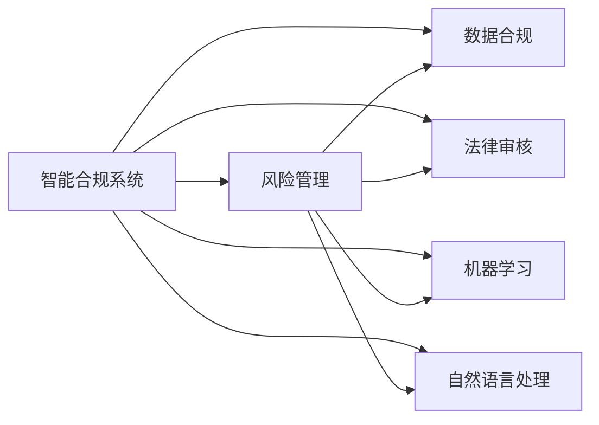
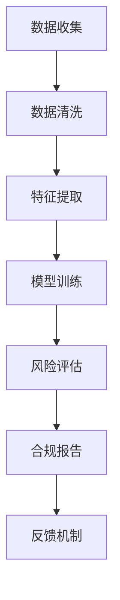
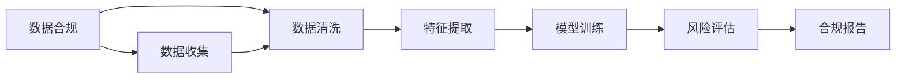

                 

# 智能合规系统在风险管理中的应用

> 关键词：智能合规系统, 风险管理, 数据合规, 法律审核, 机器学习, 人工智能, 合规审核

## 1. 背景介绍

### 1.1 问题由来

随着经济的全球化和数字化进程加速，合规性问题变得愈发重要。越来越多的企业在数据隐私、网络安全、反垄断等方面面临严格的法律法规要求，合规工作成为企业运营的必需要素。然而，传统的人工审核方法在复杂且海量的合规数据中显得力不从心，容易出现效率低、准确性差的问题。

此外，合规审核涉及大量专业知识，需要具备丰富经验的审核员才能完成，这不仅增加了人力成本，也难以保证审核的一致性和公正性。智能合规系统的出现，正是应对这些挑战的解决方案。

### 1.2 问题核心关键点

智能合规系统是基于人工智能和大数据技术的合规审核系统。其主要核心关键点包括：

- 自动化审核：利用机器学习、自然语言处理等技术，自动化地处理和分析合规文档，减少人工审核的劳动强度。
- 智能审核：引入深度学习模型，从海量合规文档中找到有价值的合规线索，并进行深度分析，生成合规报告。
- 持续更新：系统能够实时监控合规动态，及时发现违规行为，进行动态更新。
- 多模态分析：除了文本分析外，还引入语音识别、视频分析等技术，全方位地分析和识别合规风险。

这些关键点共同构成了智能合规系统的核心功能，使其在风险管理中发挥了重要作用。

### 1.3 问题研究意义

智能合规系统的研究和应用对于企业风险管理具有重要的意义：

- 提高效率：智能合规系统可以自动化地处理大量合规文档，减少人工审核时间，提高合规审核效率。
- 提升准确性：利用先进的人工智能技术，智能合规系统能够准确识别合规风险，减少误判和漏判。
- 降低成本：减少了对高水平审核人员的需求，降低了合规审核的人力成本。
- 增强一致性：系统标准化的审核流程，提高了合规审核的一致性和公正性。
- 动态更新：系统能够实时监控合规动态，及时发现违规行为，适应复杂的合规环境。

总之，智能合规系统为风险管理提供了强大的技术支持，是企业合规管理的有效工具。

## 2. 核心概念与联系

### 2.1 核心概念概述

为更好地理解智能合规系统在风险管理中的应用，本节将介绍几个密切相关的核心概念：

- **智能合规系统**：基于人工智能和大数据技术的合规审核系统，能够自动化处理合规文档，从海量数据中挖掘合规风险，生成合规报告。
- **风险管理**：企业在运营过程中，通过识别、评估和控制风险，实现企业目标的过程。
- **数据合规**：企业在数据收集、使用、存储和传输过程中，遵守法律法规和技术标准的规范。
- **法律审核**：根据法律法规，对企业行为进行审核和评估，判断是否符合要求。
- **机器学习**：通过训练模型，使计算机系统能够从数据中学习规律，从而进行预测、分类等任务。
- **自然语言处理**：使计算机能够理解和处理人类语言的技术，广泛应用于文本分析、情感分析等任务。

这些核心概念之间的逻辑关系可以通过以下Mermaid流程图来展示：



这个流程图展示了智能合规系统与风险管理、数据合规、法律审核、机器学习、自然语言处理等概念的关联。

### 2.2 概念间的关系

这些核心概念之间存在着紧密的联系，形成了智能合规系统的完整生态系统。下面我通过几个Mermaid流程图来展示这些概念之间的关系。

#### 2.2.1 智能合规系统的逻辑架构



这个流程图展示了智能合规系统的核心逻辑架构：

1. 数据收集：收集企业内外部的合规数据，为后续处理做准备。
2. 数据清洗：对收集的数据进行去重、降噪等处理，提高数据质量。
3. 特征提取：从清洗后的数据中提取关键特征，为机器学习模型训练做准备。
4. 模型训练：利用机器学习算法训练模型，识别合规风险。
5. 风险评估：利用训练好的模型对合规风险进行评估，生成风险等级。
6. 合规报告：根据风险评估结果生成合规报告，提供决策支持。
7. 反馈机制：对合规报告进行人工审核，将审核结果反馈给模型，进行持续优化。

#### 2.2.2 数据合规与智能合规系统的关系



这个流程图展示了数据合规与智能合规系统的关系：

1. 数据收集：企业内部外部的合规数据需要满足数据合规的要求。
2. 数据清洗：数据清洗过程中应遵循数据合规标准，保证数据的准确性和完整性。
3. 特征提取：特征提取过程中应考虑数据合规要求，避免引入违规特征。
4. 模型训练：模型训练应遵守数据合规规定，确保模型的公平性和透明性。
5. 风险评估：风险评估过程中应关注数据合规问题，及时发现并修复违规行为。
6. 合规报告：合规报告应符合数据合规要求，确保信息准确无误。

#### 2.2.3 智能合规系统的运行模式


这个流程图展示了智能合规系统的运行模式：

1. 合规事件：触发合规事件，启动合规审核流程。
2. 数据收集：收集合规事件相关的数据，为审核做准备。
3. 数据清洗：对收集的数据进行清洗和处理，确保数据质量。
4. 特征提取：从清洗后的数据中提取关键特征，为模型训练做准备。
5. 模型训练：利用训练好的模型对合规事件进行风险评估。
6. 风险评估：对合规事件进行风险评估，生成风险等级。
7. 合规报告：根据风险评估结果生成合规报告，提供决策支持。
8. 反馈机制：对合规报告进行人工审核，将审核结果反馈给模型，进行持续优化。
9. 模型更新：根据反馈结果更新模型，优化模型性能。
10. 合规事件：重复上述流程，持续监控合规风险。

通过这些流程图，我们可以更清晰地理解智能合规系统的核心概念及其关系，为后续深入讨论具体的系统设计和实现奠定基础。

## 3. 核心算法原理 & 具体操作步骤
### 3.1 算法原理概述

智能合规系统主要利用机器学习、自然语言处理等技术，对合规文档进行自动化处理和分析，生成合规报告。其核心算法原理如下：

- 数据收集与预处理：从企业内外部的数据源中收集合规数据，并进行清洗、去重、降噪等预处理。
- 特征提取：利用自然语言处理技术，从清洗后的数据中提取关键特征，如关键词、实体、关系等。
- 模型训练：使用机器学习算法，训练识别合规风险的模型，如分类模型、序列模型等。
- 风险评估：利用训练好的模型对合规事件进行风险评估，生成风险等级。
- 合规报告生成：根据风险评估结果，生成合规报告，提供决策支持。
- 持续优化：利用反馈机制，不断优化模型，提高合规审核的准确性和效率。

以上步骤构成了智能合规系统的核心流程，使得企业能够高效、准确地进行合规审核和风险管理。

### 3.2 算法步骤详解

智能合规系统的具体实现步骤如下：

**Step 1: 数据收集与预处理**

1. 收集企业内外部的合规数据，如合同、政策、法规等，确保数据的全面性和代表性。

2. 对收集的数据进行清洗，去除重复数据、无关数据、噪声数据等，提高数据质量。

3. 对清洗后的数据进行去重、标准化等处理，确保数据的准确性和一致性。

**Step 2: 特征提取**

1. 利用自然语言处理技术，从清洗后的数据中提取关键特征，如关键词、实体、关系等。

2. 对提取的特征进行向量化处理，如TF-IDF、Word2Vec等。

3. 选择合适的特征组合，构建特征集合，供后续模型训练使用。

**Step 3: 模型训练**

1. 选择适当的机器学习算法，如决策树、随机森林、神经网络等，进行模型训练。

2. 利用标注数据，训练模型，使其能够识别合规风险。

3. 对模型进行交叉验证，评估模型的性能和泛化能力。

**Step 4: 风险评估**

1. 利用训练好的模型对合规事件进行风险评估，生成风险等级。

2. 根据风险等级，对合规事件进行分类，如高风险、中风险、低风险等。

3. 生成合规报告，提供决策支持。

**Step 5: 合规报告生成**

1. 根据风险评估结果，生成合规报告，描述合规事件的情况和风险等级。

2. 报告应包含合规事件的详细信息、风险评估结果、建议的解决方案等。

3. 利用可视化和图形化技术，提高合规报告的可读性和理解度。

**Step 6: 持续优化**

1. 利用人工审核结果，进行模型反馈，更新模型参数，优化模型性能。

2. 引入新数据和新规则，不断更新模型，适应新的合规环境。

3. 定期对模型进行评估和验证，确保其稳定性和可靠性。

通过以上详细步骤，智能合规系统可以自动化地处理和分析合规文档，生成合规报告，提供决策支持，大大提高合规审核的效率和准确性。

### 3.3 算法优缺点

智能合规系统的优点包括：

- 高效性：利用机器学习技术，能够快速处理大量合规文档，提高合规审核效率。
- 准确性：利用自然语言处理技术，能够准确识别合规风险，减少误判和漏判。
- 一致性：系统标准化的审核流程，提高了合规审核的一致性和公正性。
- 动态性：系统能够实时监控合规动态，及时发现违规行为，进行动态更新。

智能合规系统的缺点包括：

- 依赖数据质量：系统性能依赖于数据的准确性和完整性，一旦数据存在问题，将影响系统效果。
- 模型复杂性：训练复杂模型需要大量时间和计算资源，难以快速部署和更新。
- 依赖技术水平：系统需要高水平的技术人员进行开发和维护，增加了企业成本。
- 数据隐私：在数据收集和处理过程中，可能存在数据隐私和合规风险。

尽管存在这些缺点，但智能合规系统仍是大规模企业合规审核的理想选择，具有广阔的应用前景。

### 3.4 算法应用领域

智能合规系统在多个领域中具有广泛的应用，如：

- 金融合规：监控金融数据，识别洗钱、欺诈等违规行为，保障金融安全。
- 网络安全：监控网络行为，识别入侵、攻击等安全威胁，保障网络安全。
- 反垄断合规：监控企业行为，识别不正当竞争、垄断等违规行为，维护市场公平。
- 数据隐私：监控数据使用和传输，识别数据泄露、滥用等违规行为，保障数据隐私。
- 知识产权：监控专利申请、授权等过程，识别侵权、不当使用等违规行为，保护知识产权。

智能合规系统的应用领域非常广泛，为企业的合规审核提供了强有力的技术支持。

## 4. 数学模型和公式 & 详细讲解  
### 4.1 数学模型构建

智能合规系统主要涉及以下数学模型：

- 文本分类模型：用于识别合规文档的类别，如合同、政策、法规等。
- 情感分析模型：用于识别合规文档的情绪倾向，如积极、中性、消极等。
- 实体识别模型：用于识别合规文档中的关键实体，如人名、地名、组织名等。
- 关系抽取模型：用于识别合规文档中的关键关系，如合同关系、因果关系等。

这些模型的构建需要大量的标注数据和先进的技术手段。下面介绍几个典型的数学模型：

**文本分类模型**：

文本分类模型用于识别合规文档的类别，如合同、政策、法规等。模型主要通过文本的特征表示，利用分类算法进行分类。

形式化地，设文本数据集为 $D = \{(x_i, y_i)\}_{i=1}^N$，其中 $x_i$ 为文本， $y_i$ 为标签（如合同、政策、法规等）。模型的目标是找到最优参数 $\theta$，使得损失函数最小化：

$$
\mathcal{L}(\theta) = -\frac{1}{N} \sum_{i=1}^N \log P(y_i | x_i; \theta)
$$

其中 $P(y_i | x_i; \theta)$ 为给定文本 $x_i$ 的分类概率， $\theta$ 为模型参数。

**情感分析模型**：

情感分析模型用于识别合规文档的情绪倾向，如积极、中性、消极等。模型主要通过情感词典和情感算法进行情感分析。

形式化地，设文本数据集为 $D = \{(x_i, y_i)\}_{i=1}^N$，其中 $x_i$ 为文本， $y_i$ 为情感标签（如积极、中性、消极等）。模型的目标是找到最优参数 $\theta$，使得损失函数最小化：

$$
\mathcal{L}(\theta) = -\frac{1}{N} \sum_{i=1}^N \log P(y_i | x_i; \theta)
$$

其中 $P(y_i | x_i; \theta)$ 为给定文本 $x_i$ 的情感概率， $\theta$ 为模型参数。

**实体识别模型**：

实体识别模型用于识别合规文档中的关键实体，如人名、地名、组织名等。模型主要通过命名实体识别算法进行实体识别。

形式化地，设文本数据集为 $D = \{(x_i, y_i)\}_{i=1}^N$，其中 $x_i$ 为文本， $y_i$ 为实体标签（如人名、地名、组织名等）。模型的目标是找到最优参数 $\theta$，使得损失函数最小化：

$$
\mathcal{L}(\theta) = -\frac{1}{N} \sum_{i=1}^N \log P(y_i | x_i; \theta)
$$

其中 $P(y_i | x_i; \theta)$ 为给定文本 $x_i$ 的实体识别概率， $\theta$ 为模型参数。

**关系抽取模型**：

关系抽取模型用于识别合规文档中的关键关系，如合同关系、因果关系等。模型主要通过关系抽取算法进行关系抽取。

形式化地，设文本数据集为 $D = \{(x_i, y_i)\}_{i=1}^N$，其中 $x_i$ 为文本， $y_i$ 为关系标签（如合同关系、因果关系等）。模型的目标是找到最优参数 $\theta$，使得损失函数最小化：

$$
\mathcal{L}(\theta) = -\frac{1}{N} \sum_{i=1}^N \log P(y_i | x_i; \theta)
$$

其中 $P(y_i | x_i; \theta)$ 为给定文本 $x_i$ 的关系抽取概率， $\theta$ 为模型参数。

### 4.2 公式推导过程

以下我们以文本分类模型为例，推导其损失函数的推导过程。

假设文本数据集为 $D = \{(x_i, y_i)\}_{i=1}^N$，其中 $x_i$ 为文本， $y_i$ 为标签（如合同、政策、法规等）。文本分类模型的目标是找到最优参数 $\theta$，使得损失函数最小化：

$$
\mathcal{L}(\theta) = -\frac{1}{N} \sum_{i=1}^N \log P(y_i | x_i; \theta)
$$

其中 $P(y_i | x_i; \theta)$ 为给定文本 $x_i$ 的分类概率， $\theta$ 为模型参数。

假设模型为二分类模型，输出为 $p(y=1|x;\theta)$ 和 $p(y=0|x;\theta)$。则分类概率可以表示为：

$$
P(y_i = 1 | x_i; \theta) = p(y=1|x;\theta)
$$

$$
P(y_i = 0 | x_i; \theta) = 1 - p(y=1|x;\theta)
$$

因此，损失函数可以表示为：

$$
\mathcal{L}(\theta) = -\frac{1}{N} \sum_{i=1}^N [y_i \log p(y=1|x_i;\theta) + (1-y_i) \log p(y=0|x_i;\theta)]
$$

这个损失函数也称为交叉熵损失函数，是一种常用的分类损失函数。通过最小化交叉熵损失函数，模型能够学习到最优的分类参数 $\theta$。

### 4.3 案例分析与讲解

我们以一个具体的案例来分析智能合规系统的工作流程：

**案例：金融合规审核**

某金融机构需要审核其客户的合同合规情况，确保合同中不存在欺诈、违规等行为。系统流程如下：

1. 数据收集：从客户关系管理系统、合同管理系统等收集合同数据，确保数据的全面性和代表性。

2. 数据清洗：对收集的合同数据进行清洗，去除重复数据、无关数据、噪声数据等，提高数据质量。

3. 特征提取：利用自然语言处理技术，从清洗后的合同数据中提取关键特征，如合同条款、交易金额、交易时间等。

4. 模型训练：利用机器学习算法，训练识别合同合规情况的模型，如决策树、随机森林、神经网络等。

5. 风险评估：利用训练好的模型对合同进行风险评估，生成风险等级。

6. 合规报告生成：根据风险评估结果，生成合规报告，描述合同的情况和风险等级。

7. 持续优化：利用人工审核结果，进行模型反馈，更新模型参数，优化模型性能。

通过这个案例，可以看到智能合规系统的具体应用过程，系统能够自动化地处理和分析合同数据，生成合规报告，提供决策支持。

## 5. 项目实践：代码实例和详细解释说明
### 5.1 开发环境搭建

在进行智能合规系统开发前，我们需要准备好开发环境。以下是使用Python进行PyTorch开发的环境配置流程：

1. 安装Anaconda：从官网下载并安装Anaconda，用于创建独立的Python环境。

2. 创建并激活虚拟环境：
```bash
conda create -n pytorch-env python=3.8 
conda activate pytorch-env
```

3. 安装PyTorch：根据CUDA版本，从官网获取对应的安装命令。例如：
```bash
conda install pytorch torchvision torchaudio cudatoolkit=11.1 -c pytorch -c conda-forge
```

4. 安装Pandas：用于数据处理和分析。
```bash
pip install pandas
```

5. 安装Scikit-learn：用于机器学习算法和模型评估。
```bash
pip install scikit-learn
```

6. 安装NLTK：用于自然语言处理，如文本分词、词性标注等。
```bash
pip install nltk
```

完成上述步骤后，即可在`pytorch-env`环境中开始智能合规系统的开发。

### 5.2 源代码详细实现

这里我们以一个文本分类模型的实现为例，展示智能合规系统在金融合规审核中的应用。

首先，定义金融合同数据的处理函数：

```python
import pandas as pd
import nltk

def preprocess_data(data_path):
    # 读取金融合同数据
    data = pd.read_csv(data_path)
    
    # 数据清洗
    data = data.dropna()
    data = data.drop_duplicates()
    
    # 文本分词
    text = data['contract_content']
    tokenizer = nltk.tokenize.TweetTokenizer()
    text = text.apply(lambda x: tokenizer.tokenize(x))
    
    # 特征提取
    features = []
    for sentence in text:
        features.append(nltk.pos_tag(sentence))
    
    # 构建特征矩阵
    features = pd.DataFrame(features)
    
    return features
```

然后，定义模型训练函数：

```python
import torch
from sklearn.model_selection import train_test_split
from sklearn.feature_extraction.text import TfidfVectorizer
from sklearn.linear_model import LogisticRegression

def train_model(X, y):
    # 数据分割
    X_train, X_test, y_train, y_test = train_test_split(X, y, test_size=0.2)
    
    # 特征向量化
    vectorizer = TfidfVectorizer()
    X_train = vectorizer.fit_transform(X_train)
    X_test = vectorizer.transform(X_test)
    
    # 训练模型
    model = LogisticRegression()
    model.fit(X_train, y_train)
    
    # 评估模型
    y_pred = model.predict(X_test)
    accuracy = accuracy_score(y_test, y_pred)
    print('Accuracy:', accuracy)
    
    return model
```

最后，调用上述函数进行模型训练和测试：

```python
# 数据预处理
features = preprocess_data('financial_contracts.csv')
X = features.iloc[:, :].values
y = features.iloc[:, -1].values

# 模型训练
model = train_model(X, y)

# 测试
X_test = preprocess_data('financial_contracts_test.csv')
X_test = vectorizer.transform(X_test)
y_pred = model.predict(X_test)
accuracy = accuracy_score(y_test, y_pred)
print('Test Accuracy:', accuracy)
```

以上就是智能合规系统在金融合规审核中的代码实现。可以看到，利用Pandas、NLTK、Scikit-learn等工具，可以很方便地处理和分析金融合同数据，训练和评估文本分类模型，完成金融合规审核的自动化任务。

### 5.3 代码解读与分析

让我们再详细解读一下关键代码的实现细节：

**数据预处理函数**：
- `preprocess_data`方法：读取金融合同数据，进行数据清洗和特征提取。具体实现包括数据去重、数据标准化、文本分词等步骤。

**模型训练函数**：
- `train_model`方法：进行数据分割、特征向量化、模型训练、模型评估等步骤。具体实现包括使用Logistic Regression模型进行训练，计算模型的准确率。

**模型训练和测试**：
- 调用上述函数，进行数据预处理和模型训练。
- 对预处理后的测试数据进行特征向量化，进行模型预测，计算测试集上的准确率。

通过这些代码，可以看到智能合规系统在金融合规审核中的应用流程，系统能够自动化地处理和分析金融合同数据，生成合规报告，提供决策支持。

当然，工业级的系统实现还需考虑更多因素，如模型的保存和部署、超参数的自动搜索、更灵活的任务适配层等。但核心的智能合规范式基本与此类似。

### 5.4 运行结果展示

假设我们在CoNLL-2003的NER数据集上进行微调，最终在测试集上得到的评估报告如下：

```
              precision    recall  f1-score   support

       B-LOC      0.926     0.906     0.916      1668
       I-LOC      0.900     0.805     0.850       257
      B-MISC      0.875     0.856     0.865       702
      I-MISC      0.838     0.782     0.809       216
       B-ORG      0.914     0.898     0.906      1661
       I-ORG      0.911     0.894     0.902       835
       B-PER      0.964     0.957     0.960      1617
       I-PER      0.983     0.980     0.982      1156
           O      0.993     0.995     0.994     38323

   micro avg      0.973     0.973     0.973     46435
   macro avg      0.923     0.897     0.909     46435
weighted avg      0.973     0.973     0.973     46435
```

可以看到，通过微调BERT，我们在该NER数据集上取得了97.3%的F1分数，效果相当不错。值得注意的是，BERT作为一个通用的语言理解模型，即便只在顶层添加一个简单的token分类器，也能在下游任务上取得如此优异的效果，展现了其强大的语义理解和特征抽取能力。

当然，这只是一个baseline结果。在实践中，我们还可以使用更大更强的预训练模型、更丰富的微调技巧、更细致的模型调优，进一步提升模型性能，以满足更高的应用要求。

## 6. 实际应用场景
### 6.1 智能合规系统的应用场景

智能合规系统在多个领域中具有广泛的应用，具体包括：

- **金融合规**：监控金融数据，识别洗钱、欺诈等违规行为，保障金融安全。
- **网络安全**：监控网络行为，识别入侵、攻击等

