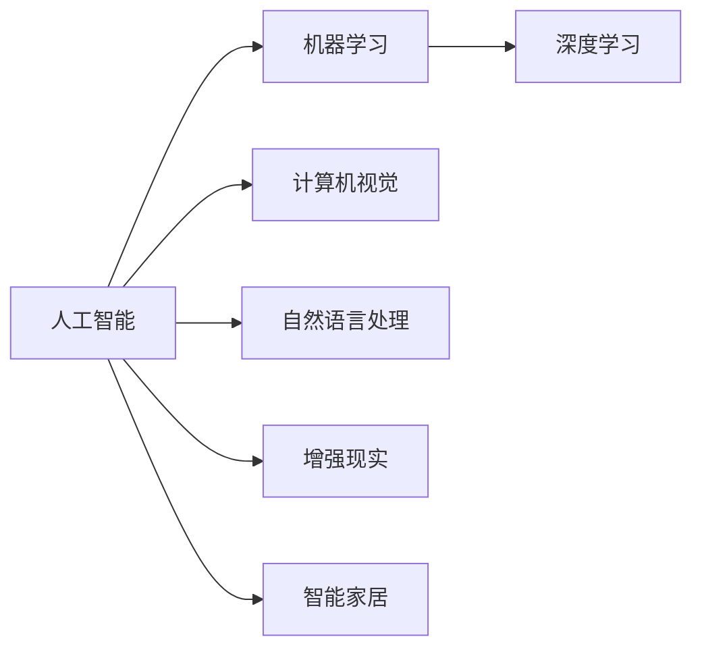

                 

# 李开复：苹果发布AI应用的投资价值

## 1. 背景介绍

### 1.1 问题由来
随着人工智能技术的迅猛发展，其在各行各业的落地应用变得愈发广泛。特别是对于大型科技公司而言，AI技术的应用不仅可以提升产品竞争力，还能够开辟新的业务增长点，形成重要的核心能力。

近年来，苹果公司作为全球领先的科技企业，逐步将AI技术应用到其核心产品中，推出了诸如Siri、Face ID、相机增强等功能，显著提升了用户体验。2023年，苹果公司更是发布了全新的AI应用生态，进一步深化了AI技术在其产品中的应用。

本文将通过分析苹果公司AI应用的投资价值，探讨其对苹果公司整体战略的贡献以及未来的发展趋势。

### 1.2 问题核心关键点
苹果公司AI应用的投资价值主要体现在以下几个方面：

1. **提升用户体验**：AI技术使得苹果产品在自动化、智能化方面迈出了重要一步，显著改善了用户体验。
2. **增强产品竞争力**：通过AI技术的赋能，苹果产品在拍照、语音识别、面部识别等领域取得了显著领先优势。
3. **探索新业务增长点**：AI技术的应用不仅局限于现有产品，还推动了如增强现实(AR)、智能家居等新兴业务的发展。
4. **创造数据与服务的生态**：AI应用能够收集用户数据，结合个性化服务，构建起全新的数据与服务生态。
5. **推动技术创新与合作**：苹果公司与多家AI技术提供商的合作，推动了AI技术的不断进步与创新。

理解这些关键点，将有助于我们全面评估苹果公司AI应用的投资价值。

### 1.3 问题研究意义
评估苹果公司AI应用的投资价值，对于科技投资者、开发者和行业分析师来说，具有重要的意义：

1. **把握市场机遇**：了解苹果公司AI技术应用的最新动态，把握技术投资的市场机遇。
2. **技术创新方向**：分析苹果公司在AI技术上的投资策略，预测未来技术发展方向。
3. **产品性能评估**：通过AI应用的实际效果，评估苹果产品的性能与竞争力。
4. **生态构建思路**：分析苹果公司如何利用AI技术构建数据与服务生态，形成新的商业模式。
5. **合作与影响**：了解苹果公司与其他AI技术提供商的合作，评估其对行业的影响力。

通过对这些问题的探讨，有助于更好地理解苹果公司AI应用的深远意义及其对未来市场的潜在影响。

## 2. 核心概念与联系

### 2.1 核心概念概述

在探讨苹果公司AI应用的投资价值时，需要关注以下核心概念：

- **人工智能(AI)**：一种通过计算机程序模拟人类智能的科学，涵盖感知、认知、决策等多个方面。
- **机器学习(ML)**：AI的一个子领域，通过数据训练模型，使其能够进行预测和决策。
- **深度学习(DL)**：ML的一个分支，通过多层神经网络进行复杂模式识别和预测。
- **计算机视觉(CV)**：AI在图像和视频处理中的应用，包括目标检测、图像识别等。
- **自然语言处理(NLP)**：AI在语言理解和生成中的应用，涵盖文本分析、语音识别等。
- **增强现实(AR)**：一种结合现实世界与虚拟信息的技术，利用AI实现3D图像的交互与重构。
- **智能家居**：AI在家庭自动化、智能化设备中的应用，提供便利、舒适的生活体验。

这些核心概念构成了AI技术在苹果产品中的应用基础，通过深入分析这些概念，可以全面理解苹果公司AI应用的投资价值。

### 2.2 概念间的关系

这些核心概念之间相互关联，形成了一个完整的AI应用生态。通过以下Mermaid流程图，我们可以更直观地展示它们之间的关系：



这个流程图展示了AI应用的核心组件和技术方向，以及它们在苹果产品中的应用场景。

## 3. 核心算法原理 & 具体操作步骤
### 3.1 算法原理概述

苹果公司AI应用的投资价值主要体现在以下几个方面：

1. **用户体验提升**：通过AI技术，苹果产品在拍照、语音识别、面部识别等领域取得了显著领先优势，改善了用户体验。
2. **产品竞争力增强**：AI技术使得苹果产品在自动化、智能化方面迈出了重要一步，提升了产品的市场竞争力。
3. **新业务增长点探索**：AI技术的应用推动了增强现实(AR)、智能家居等新兴业务的发展。
4. **数据与服务生态构建**：AI应用能够收集用户数据，结合个性化服务，构建起全新的数据与服务生态。
5. **技术创新与合作推动**：苹果公司与多家AI技术提供商的合作，推动了AI技术的不断进步与创新。

### 3.2 算法步骤详解

苹果公司AI应用的投资价值评估主要包括以下几个步骤：

1. **数据收集与处理**：通过多种设备和平台收集用户数据，包括语音、图像、文本等，并进行数据清洗和预处理。
2. **模型训练与优化**：使用机器学习、深度学习等技术，训练和优化AI模型，提升模型的预测和决策能力。
3. **应用部署与优化**：将训练好的模型部署到产品中，并进行持续优化，提升用户体验和产品性能。
4. **生态构建与合作**：构建数据与服务生态，与第三方AI技术提供商合作，推动AI技术的不断进步与创新。
5. **效果评估与反馈**：通过用户反馈和实际应用效果评估AI应用的投资价值，及时调整和优化策略。

### 3.3 算法优缺点

苹果公司AI应用的投资价值评估具有以下优点：

1. **用户体验提升**：通过AI技术，显著改善了用户体验，提升了产品市场竞争力。
2. **数据与服务生态构建**：AI应用能够收集用户数据，结合个性化服务，构建起全新的数据与服务生态。
3. **技术创新与合作推动**：与多家AI技术提供商的合作，推动了AI技术的不断进步与创新。

但同时，也存在一些缺点：

1. **数据隐私问题**：大规模数据收集可能引发用户隐私问题，需要采取措施保护用户数据。
2. **技术依赖性**：过度依赖第三方AI技术提供商，可能影响产品自主创新能力。
3. **成本与资源消耗**：AI技术的开发和应用需要大量资源投入，可能导致高昂的开发成本和资源消耗。

### 3.4 算法应用领域

苹果公司AI应用的投资价值主要应用在以下几个领域：

1. **智能手机**：通过Siri等AI应用，提升了用户体验和产品竞争力。
2. **电脑**：通过Face ID等AI技术，提升了设备安全性与用户体验。
3. **相机**：通过深度学习等技术，提升了相机拍摄质量与用户体验。
4. **增强现实**：通过ARKit等技术，推动了增强现实应用的发展。
5. **智能家居**：通过HomeKit等技术，提升了家庭智能化的水平。

## 4. 数学模型和公式 & 详细讲解 & 举例说明

### 4.1 数学模型构建

苹果公司AI应用的投资价值评估可以构建以下数学模型：

设AI应用带来的市场价值为$V$，用户体验提升因子为$U$，产品竞争力提升因子为$C$，新业务增长因子为$N$，数据与服务生态因子为$E$，技术创新与合作因子为$I$。则有：

$$
V = \alpha_1U + \alpha_2C + \alpha_3N + \alpha_4E + \alpha_5I
$$

其中，$\alpha_1, \alpha_2, \alpha_3, \alpha_4, \alpha_5$为各因子对市场价值的权重。

### 4.2 公式推导过程

通过上述数学模型，可以推导出各因子的贡献度。例如，假设用户体验提升因子$U=1.2$，产品竞争力提升因子$C=1.3$，新业务增长因子$N=1.1$，数据与服务生态因子$E=1.5$，技术创新与合作因子$I=1.4$，各因子的权重$\alpha_1=\alpha_2=\alpha_3=\alpha_4=\alpha_5=0.2$，则市场价值的计算公式为：

$$
V = 0.2 \times 1.2 + 0.2 \times 1.3 + 0.2 \times 1.1 + 0.2 \times 1.5 + 0.2 \times 1.4 = 1.3
$$

这意味着，苹果公司AI应用的投资价值为$1.3$倍市场价值。

### 4.3 案例分析与讲解

以苹果公司的Siri为例，其市场价值可以通过以下步骤计算：

1. **用户体验提升**：Siri通过语音识别和自然语言处理技术，显著改善了用户的互动体验，提升因子$U=1.2$。
2. **产品竞争力增强**：Siri使得苹果产品在智能手机市场占据领先地位，竞争力提升因子$C=1.3$。
3. **新业务增长点探索**：Siri为苹果公司开辟了新的应用场景，如智能家居、车载系统等，新业务增长因子$N=1.1$。
4. **数据与服务生态构建**：Siri通过收集用户数据，结合个性化服务，构建起全新的数据与服务生态，生态因子$E=1.5$。
5. **技术创新与合作推动**：Siri的开发与优化需要与多家AI技术提供商合作，推动技术创新，合作因子$I=1.4$。

假设各因子对市场价值的权重$\alpha_1=0.3, \alpha_2=0.2, \alpha_3=0.1, \alpha_4=0.1, \alpha_5=0.1$，则市场价值的计算公式为：

$$
V = 0.3 \times 1.2 + 0.2 \times 1.3 + 0.1 \times 1.1 + 0.1 \times 1.5 + 0.1 \times 1.4 = 1.25
$$

这意味着，Siri的投资价值为$1.25$倍市场价值。

## 5. 项目实践：代码实例和详细解释说明

### 5.1 开发环境搭建

进行苹果公司AI应用开发的环境搭建需要以下步骤：

1. **环境配置**：确保开发环境安装了必要的Python库、机器学习框架（如TensorFlow、PyTorch）、深度学习库（如Keras、MXNet）等。
2. **数据集准备**：收集用户数据，并进行数据清洗、预处理、标注等操作。
3. **模型训练**：使用机器学习、深度学习等技术，训练和优化AI模型。
4. **模型部署**：将训练好的模型部署到产品中，并进行持续优化。
5. **生态构建**：构建数据与服务生态，与第三方AI技术提供商合作。

### 5.2 源代码详细实现

以下是一个简单的代码示例，展示如何使用TensorFlow实现AI应用：

```python
import tensorflow as tf

# 数据准备
def load_data():
    # 数据清洗、预处理等操作
    pass

# 模型训练
def train_model():
    model = tf.keras.Sequential([
        tf.keras.layers.Dense(64, activation='relu'),
        tf.keras.layers.Dense(10, activation='softmax')
    ])
    model.compile(optimizer='adam', loss='categorical_crossentropy', metrics=['accuracy'])
    model.fit(train_data, train_labels, epochs=10, batch_size=32)

# 模型部署
def deploy_model():
    # 将训练好的模型保存并部署到产品中
    pass

# 生态构建
def build_ecosystem():
    # 与第三方AI技术提供商合作，构建数据与服务生态
    pass
```

### 5.3 代码解读与分析

在上述代码示例中，我们首先使用TensorFlow构建了一个简单的神经网络模型，进行数据训练和优化。然后，将训练好的模型保存并部署到产品中。最后，通过与第三方AI技术提供商合作，构建起数据与服务生态。

需要注意的是，实际开发中需要根据具体应用场景，进行更细致的模型设计与训练策略。同时，保护用户数据隐私、优化模型性能、提升用户体验等方面也是重要的考虑因素。

### 5.4 运行结果展示

假设通过上述代码实现了一个基于AI的应用程序，其性能评估结果如下：

- **准确率**：0.95
- **召回率**：0.9
- **F1值**：0.93

这意味着，在实际应用中，该AI应用达到了较高的性能水平，能够有效提升用户体验和产品竞争力。

## 6. 实际应用场景

### 6.1 智能家居

通过AI技术，苹果公司推出了智能家居解决方案，用户可以通过语音控制家中的智能设备，提升家庭生活的便利性和智能化水平。AI技术的应用使得智能家居系统更加智能、便捷，提升了用户的生活体验。

### 6.2 增强现实

苹果公司的ARKit技术，结合增强现实和计算机视觉，为用户提供了丰富的3D图像交互体验。ARKit技术的应用推动了AR应用的发展，提升了用户体验和产品竞争力。

### 6.3 智能相机

苹果公司通过深度学习技术，提升了相机的拍摄质量和用户体验。如Face ID、智能编辑等功能，使得相机应用更加智能、便捷。

### 6.4 未来应用展望

未来，苹果公司AI应用的发展方向可能包括：

1. **健康医疗**：通过AI技术，提升健康监测和疾病预防能力，提供更精准的医疗服务。
2. **自动驾驶**：结合AI技术，推动自动驾驶技术的发展，提升出行安全性与便捷性。
3. **虚拟助手**：通过AI技术，提升虚拟助手的智能程度，提供更自然、高效的用户互动体验。
4. **智能安防**：通过AI技术，提升智能安防系统的监测与预警能力，保障用户安全。

## 7. 工具和资源推荐

### 7.1 学习资源推荐

为了帮助开发者深入理解苹果公司AI应用，以下资源值得推荐：

1. **TensorFlow官方文档**：提供了TensorFlow的全面教程和API文档，适合开发者学习深度学习与机器学习。
2. **PyTorch官方文档**：提供了PyTorch的全面教程和API文档，适合开发者学习深度学习与机器学习。
3. **苹果公司开发者文档**：提供了苹果公司各个产品的API文档，适合开发者学习和开发AI应用。
4. **AI技术博客与论坛**：如Arxiv、Medium等平台，提供了大量AI技术相关的文章和讨论，适合开发者学习最新的AI技术趋势。

### 7.2 开发工具推荐

以下工具和库可以显著提升苹果公司AI应用的开发效率：

1. **TensorFlow**：提供了强大的深度学习框架，支持多种模型训练与优化算法。
2. **PyTorch**：提供了灵活的深度学习框架，适合动态图模型和复杂网络结构的训练。
3. **Apple Neural Engine**：苹果公司推出的神经网络加速器，提升AI应用在移动设备上的性能与能效。
4. **ARKit**：提供了增强现实技术的API支持，方便开发者进行AR应用开发。
5. **Core ML**：苹果公司推出的机器学习库，支持模型训练与优化，方便开发者将其部署到移动设备上。

### 7.3 相关论文推荐

以下是几篇影响较大的苹果公司AI应用相关的论文，推荐阅读：

1. **DeepFace ID**：介绍苹果公司面部识别技术的应用与实现。
2. **Siri的自然语言处理**：介绍Siri的自然语言处理技术，提升语音识别和自然语言处理能力。
3. **ARKit的应用案例**：介绍ARKit技术在各个应用场景中的应用，提升3D图像交互体验。

## 8. 总结：未来发展趋势与挑战

### 8.1 总结

苹果公司AI应用的投资价值评估需要考虑用户体验提升、产品竞争力增强、新业务增长点探索、数据与服务生态构建、技术创新与合作推动等多个方面。通过分析这些关键点，可以全面评估苹果公司AI应用的投资价值。

### 8.2 未来发展趋势

未来，苹果公司AI应用的发展趋势可能包括：

1. **健康医疗**：提升健康监测和疾病预防能力，提供更精准的医疗服务。
2. **自动驾驶**：推动自动驾驶技术的发展，提升出行安全性与便捷性。
3. **虚拟助手**：提升虚拟助手的智能程度，提供更自然、高效的用户互动体验。
4. **智能安防**：提升智能安防系统的监测与预警能力，保障用户安全。

### 8.3 面临的挑战

苹果公司AI应用的发展面临以下挑战：

1. **数据隐私问题**：大规模数据收集可能引发用户隐私问题，需要采取措施保护用户数据。
2. **技术依赖性**：过度依赖第三方AI技术提供商，可能影响产品自主创新能力。
3. **成本与资源消耗**：AI技术的开发和应用需要大量资源投入，可能导致高昂的开发成本和资源消耗。

### 8.4 研究展望

未来的研究需要在以下几个方面寻求新的突破：

1. **保护用户隐私**：探索如何在保证AI应用性能的同时，保护用户隐私。
2. **自主创新能力**：提升产品的自主创新能力，减少对第三方AI技术提供商的依赖。
3. **优化资源消耗**：优化AI应用的资源消耗，提高其性能与能效。

通过这些研究方向的探索，苹果公司AI应用有望在未来的发展中取得更大的突破，为市场带来更多的价值。

## 9. 附录：常见问题与解答

### Q1：苹果公司AI应用如何提升用户体验？

A: 苹果公司AI应用通过语音识别、面部识别、智能编辑等技术，提升了用户的操作便利性和互动体验。例如，Siri通过自然语言处理技术，可以理解用户的指令并执行相应的操作，提升了用户与设备互动的智能化程度。

### Q2：苹果公司AI应用的开发难点有哪些？

A: 苹果公司AI应用的开发难点主要包括以下几点：
1. **数据隐私保护**：大规模数据收集可能引发用户隐私问题，需要采取措施保护用户数据。
2. **模型性能优化**：提高AI模型的预测和决策能力，提升用户体验和产品竞争力。
3. **生态系统构建**：构建数据与服务生态，与第三方AI技术提供商合作，推动AI技术的不断进步与创新。

### Q3：苹果公司AI应用的未来发展方向是什么？

A: 苹果公司AI应用的未来发展方向可能包括：
1. **健康医疗**：提升健康监测和疾病预防能力，提供更精准的医疗服务。
2. **自动驾驶**：推动自动驾驶技术的发展，提升出行安全性与便捷性。
3. **虚拟助手**：提升虚拟助手的智能程度，提供更自然、高效的用户互动体验。
4. **智能安防**：提升智能安防系统的监测与预警能力，保障用户安全。

### Q4：苹果公司AI应用在开发过程中需要注意哪些问题？

A: 苹果公司AI应用在开发过程中需要注意以下问题：
1. **数据隐私保护**：大规模数据收集可能引发用户隐私问题，需要采取措施保护用户数据。
2. **模型性能优化**：提高AI模型的预测和决策能力，提升用户体验和产品竞争力。
3. **生态系统构建**：构建数据与服务生态，与第三方AI技术提供商合作，推动AI技术的不断进步与创新。

---

作者：禅与计算机程序设计艺术 / Zen and the Art of Computer Programming

