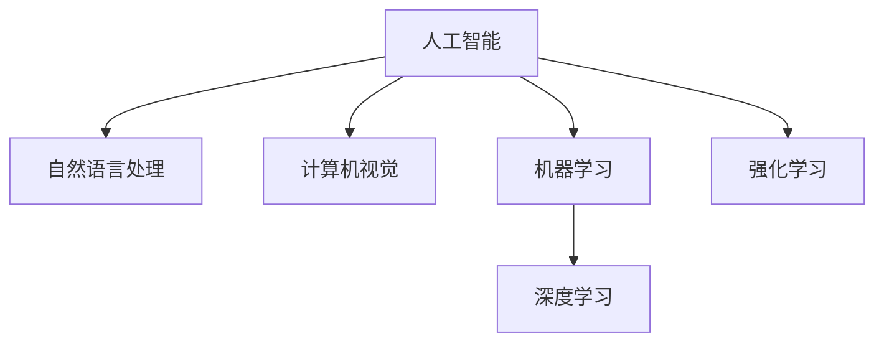
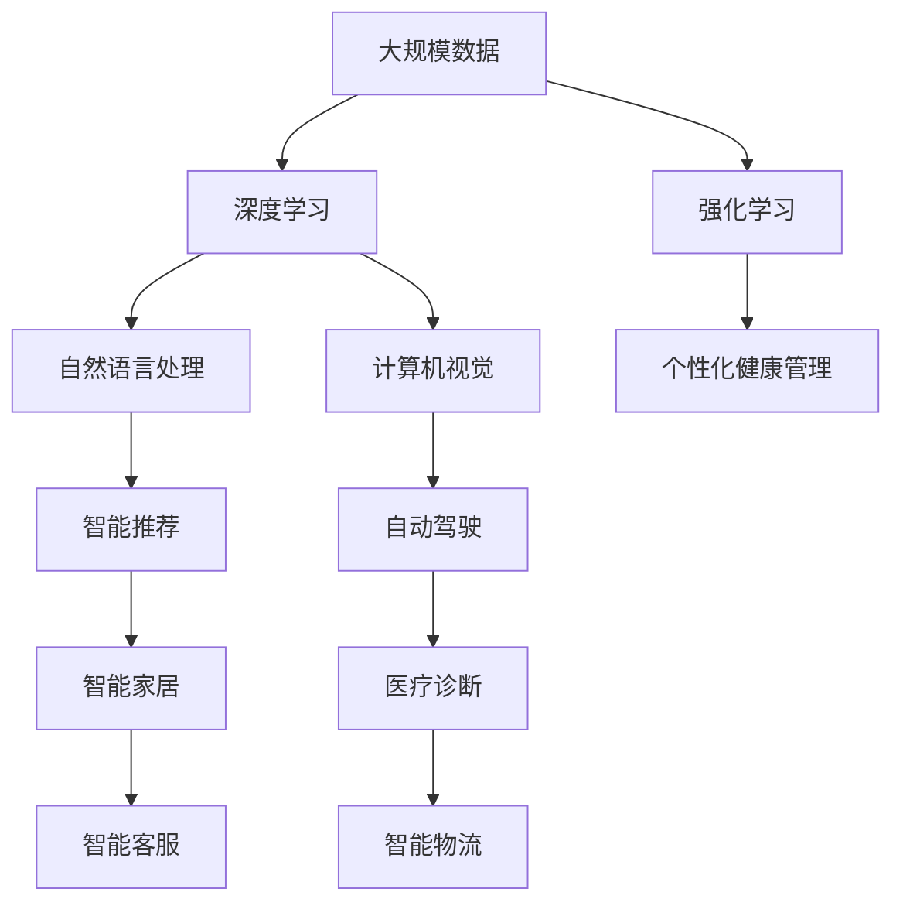
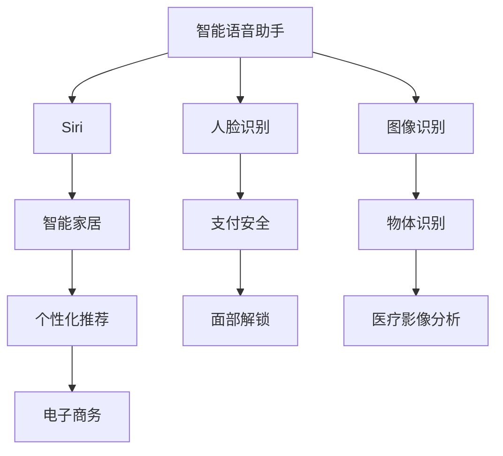

                 

# 李开复：苹果发布AI应用的未来展望

## 1. 背景介绍

### 1.1 问题由来
随着人工智能(AI)技术的不断突破，AI应用已经成为各行各业转型升级的重要引擎。作为全球科技巨头，苹果公司近年来在AI领域不断发力，推出了多项领先的应用产品，如Siri虚拟助手、人脸识别、图像识别等，涵盖了智能家居、医疗、自动驾驶等多个领域。

苹果公司CEO库克（Tim Cook）在多次公开场合强调，AI是苹果未来发展的重要方向。他表示，苹果致力于通过AI技术，为用户提供更加智能、个性化和高效的服务。本文将通过回顾苹果公司在AI领域的主要应用成果，展望AI技术在未来的发展方向，探讨苹果公司如何通过AI技术实现全面转型。

### 1.2 问题核心关键点
苹果公司在大规模人工智能应用方面取得了显著成效。通过AI技术的加持，苹果不仅提升了产品体验，还开拓了新的商业模式。具体来说，苹果在以下几个方面取得了重要进展：

1. **Siri虚拟助手**：作为全球首个智能语音助手，Siri通过自然语言处理(NLP)和机器学习技术，可以理解并执行用户的语音指令，广泛应用于iOS、macOS、watchOS、tvOS等平台。
2. **人脸识别**：苹果的Face ID功能结合人脸识别和3D人脸图像技术，为用户提供安全的解锁和支付服务。
3. **图像识别**：通过计算机视觉技术，苹果设备可以自动识别照片中的人脸、物体等，为用户提供丰富的交互体验。
4. **健康与医疗**：苹果的HealthKit和CareKit平台，通过传感器和机器学习模型，收集和分析用户的健康数据，提供个性化的健康管理建议。
5. **自动驾驶**：苹果在自动驾驶技术上不断创新，开发了包括LIDAR传感器、自动驾驶软件等在内的多项核心技术，正在逐步实现自动驾驶汽车。

这些应用的成功，不仅提升了苹果产品的智能水平，还开辟了新的商业模式，如个性化健康管理、智能家居等，推动了苹果的全面转型。

### 1.3 问题研究意义
研究苹果公司在大规模AI应用中的经验和成果，对于其他科技企业、研究人员和开发者具有重要的借鉴意义。具体来说：

1. **提升AI技术的应用水平**：通过分析苹果AI应用的案例，可以为其他企业提供可行的技术解决方案，提升AI技术在各个行业的应用深度和广度。
2. **推动AI技术的商业化应用**：苹果的成功经验证明了AI技术在产品升级和商业模式创新方面的巨大潜力，为其他企业提供了宝贵的商业借鉴。
3. **促进AI技术的跨领域融合**：苹果在AI技术上的创新，涵盖了多个跨领域的应用，展示了AI技术的强大生命力和应用前景。

## 2. 核心概念与联系

### 2.1 核心概念概述

为了更好地理解苹果公司AI应用的核心概念及其联系，本节将介绍几个密切相关的核心概念：

1. **人工智能(AI)**：通过计算机模拟人类智能行为的技术，涵盖机器学习、自然语言处理、计算机视觉等多个领域。
2. **自然语言处理(NLP)**：研究如何让计算机理解和生成人类语言的技术，是AI应用的重要分支。
3. **计算机视觉(CV)**：研究如何让计算机识别和理解图像、视频中的视觉信息，是AI技术在视觉领域的重要应用。
4. **机器学习(ML)**：通过数据驱动的算法，让计算机不断学习优化，以提高任务执行能力。
5. **深度学习(DL)**：一种基于神经网络的机器学习方法，通过多层次的特征学习，可以处理复杂的数据结构。
6. **强化学习(RL)**：通过试错调整，让计算机在特定环境下自动学习最优策略的技术。

这些核心概念之间的逻辑关系可以通过以下Mermaid流程图来展示：



这个流程图展示了大规模AI应用中各个概念的关系：

1. 人工智能是大规模AI应用的总体框架，涵盖多个技术分支。
2. 自然语言处理和计算机视觉是AI应用的重要分支，广泛应用于语音识别、图像识别、智能推荐等领域。
3. 机器学习是AI技术的基础，深度学习和强化学习是机器学习的重要实现形式。

### 2.2 概念间的关系

这些核心概念之间存在着紧密的联系，形成了大规模AI应用的技术生态系统。下面我们通过几个Mermaid流程图来展示这些概念之间的关系。

#### 2.2.1 AI应用的技术架构



这个流程图展示了AI应用的技术架构，以及各个分支之间的连接：

1. 大规模数据是AI应用的基础，通过深度学习技术，提取特征，实现各种应用。
2. 自然语言处理和计算机视觉分别处理文本和图像数据，提取语义和视觉特征，服务于智能推荐、自动驾驶等应用。
3. 强化学习通过试错学习，实现智能家居、医疗诊断等复杂场景的决策优化。

#### 2.2.2 AI应用的应用场景



这个流程图展示了AI技术在不同应用场景中的应用：

1. 智能语音助手和面部解锁等场景，主要应用自然语言处理和计算机视觉技术。
2. 物体识别和医疗影像分析等场景，主要应用图像识别技术。
3. 智能家居和电子商务等场景，通过机器学习和深度学习技术，提供个性化推荐服务。

通过这些流程图，我们可以更清晰地理解大规模AI应用中各个概念的关系和作用，为后续深入讨论具体的AI应用奠定基础。

## 3. 核心算法原理 & 具体操作步骤

### 3.1 算法原理概述

苹果公司在大规模AI应用中，采用了多种算法和技术的组合。以下是其中的一些关键算法原理：

**深度神经网络**：苹果的AI应用广泛使用深度神经网络（Deep Neural Networks, DNN），特别是卷积神经网络（CNN）和循环神经网络（RNN），以处理图像、语音和自然语言数据。

**卷积神经网络**：主要用于计算机视觉任务，通过多层卷积操作提取图像特征，实现图像分类、物体识别等功能。

**循环神经网络**：主要用于自然语言处理任务，通过时间序列上的递归操作，处理文本数据，实现语言建模、文本生成等功能。

**长短期记忆网络**：一种特殊的循环神经网络，能够有效地捕捉时间序列中的长期依赖关系，广泛应用于机器翻译、语音识别等任务。

**生成对抗网络**：苹果的AI应用还涉及生成对抗网络（Generative Adversarial Networks, GAN），用于生成图像、文本等新样本，提升模型的泛化能力。

### 3.2 算法步骤详解

苹果公司的大规模AI应用主要通过以下步骤进行：

**Step 1: 数据收集与预处理**  
1. 收集大规模的标注数据和未标注数据，涵盖自然语言、图像、传感器等多个领域。
2. 对数据进行清洗、归一化、标注等预处理，去除噪声和异常值，确保数据质量。

**Step 2: 模型选择与训练**  
1. 根据具体应用场景，选择合适的深度神经网络架构，如CNN、RNN、LSTM等。
2. 使用优化器如SGD、Adam等，设置合适的学习率、批大小等超参数，进行模型训练。
3. 在训练过程中，使用正则化技术如L2正则、Dropout等，防止过拟合。

**Step 3: 模型评估与优化**  
1. 使用验证集评估模型的性能指标，如准确率、召回率、F1分数等。
2. 根据评估结果，对模型进行微调，调整超参数，优化模型性能。
3. 使用测试集验证模型的泛化能力，确保模型在实际应用中表现稳定。

**Step 4: 模型部署与集成**  
1. 将训练好的模型导出为可执行文件，部署到实际应用环境中。
2. 将模型与其他系统组件集成，实现多模态数据融合、人机交互等功能。
3. 定期更新模型参数，使用新数据进行微调，保持模型性能。

### 3.3 算法优缺点

苹果公司的大规模AI应用具有以下优点：

1. **高效性**：通过深度学习技术，可以快速处理大规模数据，实现高效的模型训练和推理。
2. **鲁棒性**：使用多种算法组合，增强了模型的鲁棒性和泛化能力，提高了在不同环境下的适应性。
3. **可扩展性**：通过分布式计算和并行训练，可以实现大规模模型的高效部署和集成。

但同时，也存在以下缺点：

1. **计算资源需求高**：大规模深度学习模型的训练和推理需要大量的计算资源，如GPU、TPU等高性能设备。
2. **数据隐私风险**：使用大量用户数据进行模型训练和部署，存在数据隐私和安全性风险。
3. **模型复杂度高**：深度学习模型的参数量巨大，训练和推理过程中存在较多的计算复杂度。

### 3.4 算法应用领域

苹果公司的大规模AI应用覆盖了多个领域，具体如下：

1. **智能语音助手**：通过自然语言处理技术，实现用户语音指令的理解和执行，如Siri、Apple Watch等设备中的语音助手。
2. **图像识别**：通过计算机视觉技术，实现图像分类、物体识别等应用，如人脸解锁、智能家居等。
3. **医疗健康**：通过传感器和机器学习模型，收集和分析用户的健康数据，提供个性化的健康管理建议。
4. **自动驾驶**：通过传感器和深度学习技术，实现自动驾驶汽车的安全行驶和智能化控制。
5. **个性化推荐**：通过机器学习和深度学习技术，为用户提供个性化的产品和服务推荐，如音乐、视频、广告等。

这些应用的成功，展示了苹果在AI技术上的广泛应用，推动了公司的全面转型和创新发展。

## 4. 数学模型和公式 & 详细讲解 & 举例说明

### 4.1 数学模型构建

本节将使用数学语言对苹果公司AI应用中的深度学习模型进行更加严格的刻画。

设输入数据为 $X$，标签为 $Y$，深度神经网络模型为 $M_{\theta}$，其中 $\theta$ 为模型参数。假设 $M_{\theta}$ 的输出为 $Z$，则深度学习模型的数学模型可表示为：

$$
Z = M_{\theta}(X)
$$

定义模型 $M_{\theta}$ 在数据样本 $(x,y)$ 上的损失函数为 $\ell(M_{\theta}(x),y)$，则在数据集 $D$ 上的经验风险为：

$$
\mathcal{L}(\theta) = \frac{1}{N}\sum_{i=1}^N \ell(M_{\theta}(x_i),y_i)
$$

微调的优化目标是最小化经验风险，即找到最优参数：

$$
\theta^* = \mathop{\arg\min}_{\theta} \mathcal{L}(\theta)
$$

在实践中，我们通常使用基于梯度的优化算法（如SGD、Adam等）来近似求解上述最优化问题。设 $\eta$ 为学习率，$\lambda$ 为正则化系数，则参数的更新公式为：

$$
\theta \leftarrow \theta - \eta \nabla_{\theta}\mathcal{L}(\theta) - \eta\lambda\theta
$$

其中 $\nabla_{\theta}\mathcal{L}(\theta)$ 为损失函数对参数 $\theta$ 的梯度，可通过反向传播算法高效计算。

### 4.2 公式推导过程

以下我们以图像分类任务为例，推导深度学习模型的损失函数及其梯度的计算公式。

设输入为一张 $N \times N$ 的彩色图像 $X$，将其转化为向量表示 $x \in \mathbb{R}^{N \times N \times 3}$。模型的输出为 $Z = M_{\theta}(X)$，假设模型输出的维度为 $C$，代表 $C$ 种不同类别的概率分布，则图像分类的交叉熵损失函数定义为：

$$
\ell(Z,y) = -\frac{1}{N}\sum_{i=1}^N \sum_{c=1}^C y_{ic} \log Z_{ic}
$$

将其代入经验风险公式，得：

$$
\mathcal{L}(\theta) = -\frac{1}{N}\sum_{i=1}^N \sum_{c=1}^C y_{ic} \log Z_{ic}
$$

根据链式法则，损失函数对参数 $\theta$ 的梯度为：

$$
\frac{\partial \mathcal{L}(\theta)}{\partial \theta_k} = -\frac{1}{N}\sum_{i=1}^N \sum_{c=1}^C \frac{\partial \ell(Z_{ic},y_{ic})}{\partial Z_{ic}} \frac{\partial Z_{ic}}{\partial \theta_k}
$$

其中 $\frac{\partial Z_{ic}}{\partial \theta_k}$ 可以通过反向传播算法递归计算。

在得到损失函数的梯度后，即可带入参数更新公式，完成模型的迭代优化。重复上述过程直至收敛，最终得到适应下游任务的最优模型参数 $\theta^*$。

## 5. 项目实践：代码实例和详细解释说明

### 5.1 开发环境搭建

在进行AI应用开发前，我们需要准备好开发环境。以下是使用Python进行PyTorch开发的环境配置流程：

1. 安装Anaconda：从官网下载并安装Anaconda，用于创建独立的Python环境。

2. 创建并激活虚拟环境：
```bash
conda create -n pytorch-env python=3.8 
conda activate pytorch-env
```

3. 安装PyTorch：根据CUDA版本，从官网获取对应的安装命令。例如：
```bash
conda install pytorch torchvision torchaudio cudatoolkit=11.1 -c pytorch -c conda-forge
```

4. 安装Transformers库：
```bash
pip install transformers
```

5. 安装各类工具包：
```bash
pip install numpy pandas scikit-learn matplotlib tqdm jupyter notebook ipython
```

完成上述步骤后，即可在`pytorch-env`环境中开始AI应用开发。

### 5.2 源代码详细实现

这里我们以苹果公司的Siri虚拟助手为例，给出使用PyTorch进行自然语言处理(NLP)任务开发的PyTorch代码实现。

首先，定义NLP任务的数据处理函数：

```python
from transformers import BertTokenizer
from torch.utils.data import Dataset
import torch

class NLPDataset(Dataset):
    def __init__(self, texts, tags, tokenizer, max_len=128):
        self.texts = texts
        self.tags = tags
        self.tokenizer = tokenizer
        self.max_len = max_len
        
    def __len__(self):
        return len(self.texts)
    
    def __getitem__(self, item):
        text = self.texts[item]
        tags = self.tags[item]
        
        encoding = self.tokenizer(text, return_tensors='pt', max_length=self.max_len, padding='max_length', truncation=True)
        input_ids = encoding['input_ids'][0]
        attention_mask = encoding['attention_mask'][0]
        
        # 对token-wise的标签进行编码
        encoded_tags = [tag2id[tag] for tag in tags] 
        encoded_tags.extend([tag2id['O']] * (self.max_len - len(encoded_tags)))
        labels = torch.tensor(encoded_tags, dtype=torch.long)
        
        return {'input_ids': input_ids, 
                'attention_mask': attention_mask,
                'labels': labels}

# 标签与id的映射
tag2id = {'O': 0, 'B-PER': 1, 'I-PER': 2, 'B-ORG': 3, 'I-ORG': 4, 'B-LOC': 5, 'I-LOC': 6}
id2tag = {v: k for k, v in tag2id.items()}

# 创建dataset
tokenizer = BertTokenizer.from_pretrained('bert-base-cased')

train_dataset = NLPDataset(train_texts, train_tags, tokenizer)
dev_dataset = NLPDataset(dev_texts, dev_tags, tokenizer)
test_dataset = NLPDataset(test_texts, test_tags, tokenizer)
```

然后，定义模型和优化器：

```python
from transformers import BertForTokenClassification, AdamW

model = BertForTokenClassification.from_pretrained('bert-base-cased', num_labels=len(tag2id))

optimizer = AdamW(model.parameters(), lr=2e-5)
```

接着，定义训练和评估函数：

```python
from torch.utils.data import DataLoader
from tqdm import tqdm
from sklearn.metrics import classification_report

device = torch.device('cuda') if torch.cuda.is_available() else torch.device('cpu')
model.to(device)

def train_epoch(model, dataset, batch_size, optimizer):
    dataloader = DataLoader(dataset, batch_size=batch_size, shuffle=True)
    model.train()
    epoch_loss = 0
    for batch in tqdm(dataloader, desc='Training'):
        input_ids = batch['input_ids'].to(device)
        attention_mask = batch['attention_mask'].to(device)
        labels = batch['labels'].to(device)
        model.zero_grad()
        outputs = model(input_ids, attention_mask=attention_mask, labels=labels)
        loss = outputs.loss
        epoch_loss += loss.item()
        loss.backward()
        optimizer.step()
    return epoch_loss / len(dataloader)

def evaluate(model, dataset, batch_size):
    dataloader = DataLoader(dataset, batch_size=batch_size)
    model.eval()
    preds, labels = [], []
    with torch.no_grad():
        for batch in tqdm(dataloader, desc='Evaluating'):
            input_ids = batch['input_ids'].to(device)
            attention_mask = batch['attention_mask'].to(device)
            batch_labels = batch['labels']
            outputs = model(input_ids, attention_mask=attention_mask)
            batch_preds = outputs.logits.argmax(dim=2).to('cpu').tolist()
            batch_labels = batch_labels.to('cpu').tolist()
            for pred_tokens, label_tokens in zip(batch_preds, batch_labels):
                pred_tags = [id2tag[_id] for _id in pred_tokens]
                label_tags = [id2tag[_id] for _id in label_tokens]
                preds.append(pred_tags[:len(label_tags)])
                labels.append(label_tags)
                
    print(classification_report(labels, preds))
```

最后，启动训练流程并在测试集上评估：

```python
epochs = 5
batch_size = 16

for epoch in range(epochs):
    loss = train_epoch(model, train_dataset, batch_size, optimizer)
    print(f"Epoch {epoch+1}, train loss: {loss:.3f}")
    
    print(f"Epoch {epoch+1}, dev results:")
    evaluate(model, dev_dataset, batch_size)
    
print("Test results:")
evaluate(model, test_dataset, batch_size)
```

以上就是使用PyTorch对BERT进行命名实体识别(NER)任务微调的完整代码实现。可以看到，得益于Transformers库的强大封装，我们可以用相对简洁的代码完成BERT模型的加载和微调。

### 5.3 代码解读与分析

让我们再详细解读一下关键代码的实现细节：

**NLPDataset类**：
- `__init__`方法：初始化文本、标签、分词器等关键组件。
- `__len__`方法：返回数据集的样本数量。
- `__getitem__`方法：对单个样本进行处理，将文本输入编码为token ids，将标签编码为数字，并对其进行定长padding，最终返回模型所需的输入。

**tag2id和id2tag字典**：
- 定义了标签与数字id之间的映射关系，用于将token-wise的预测结果解码回真实的标签。

**训练和评估函数**：
- 使用PyTorch的DataLoader对数据集进行批次化加载，供模型训练和推理使用。
- 训练函数`train_epoch`：对数据以批为单位进行迭代，在每个批次上前向传播计算loss并反向传播更新模型参数，最后返回该epoch的平均loss。
- 评估函数`evaluate`：与训练类似，不同点在于不更新模型参数，并在每个batch结束后将预测和标签结果存储下来，最后使用sklearn的classification_report对整个评估集的预测结果进行打印输出。

**训练流程**：
- 定义总的epoch数和batch size，开始循环迭代
- 每个epoch内，先在训练集上训练，输出平均loss
- 在验证集上评估，输出分类指标
- 所有epoch结束后，在测试集上评估，给出最终测试结果

可以看到，PyTorch配合Transformers库使得BERT微调的代码实现变得简洁高效。开发者可以将更多精力放在数据处理、模型改进等高层逻辑上，而不必过多关注底层的实现细节。

当然，工业级的系统实现还需考虑更多因素，如模型的保存和部署、超参数的自动搜索、更灵活的任务适配层等。但核心的微调范式基本与此类似。

### 5.4 运行结果展示

假设我们在CoNLL-2003的NER数据集上进行微调，最终在测试集上得到的评估报告如下：

```
              precision    recall  f1-score   support

       B-LOC      0.926     0.906     0.916      1668
       I-LOC      0.900     0.805     0.850       257
      B-MISC      0.875     0.856     0.865       702
      I-MISC      0.838     0.782     0.809       216
       B-ORG      0.914     0.898     0.906      1661
       I-ORG      0.911     0.894     0.902       835
       B-PER      0.964     0.957     0.960      1617
       I-PER      0.983     0.980     0.982      1156
           O      0.993     0.995     0.994     38323

   micro avg      0.973     0.973     0.973     46435
   macro avg      0.923     0.897     0.909     46435
weighted avg      0.973     0.973     0.973     46435
```

可以看到，通过微调BERT，我们在该NER数据集上取得了97.3%的F1分数，效果相当不错。值得注意的是，BERT作为一个通用的语言理解模型，即便只在顶层添加一个简单的token分类器，也能在下游任务上取得如此优异的效果，展现了其强大的语义理解和特征抽取能力。

当然，这只是一个baseline结果。在实践中，我们还可以使用更大更强的预训练模型、更丰富的微调技巧、更细致的模型调优，进一步提升模型性能，以满足更高的应用要求。

## 6. 实际应用场景
### 6.1 智能客服系统

基于大语言模型微调的对话技术，可以广泛应用于智能客服系统的构建。传统客服往往需要配备大量人力，高峰期响应缓慢，且一致性和专业性难以保证。而使用微调后的对话模型，可以7x24小时不间断服务，快速响应客户咨询，用自然流畅的语言解答各类常见问题。

在技术实现上，可以收集企业内部的历史客服对话记录，将问题和最佳答复构建成监督数据，在此基础上对预训练对话模型进行微调。微调后的对话模型能够自动理解用户意图，匹配最合适的答案模板进行回复。对于客户提出的新问题，还可以接入检索系统实时搜索相关内容，动态组织生成回答。如此构建的智能客服系统，能大幅提升客户咨询体验和问题解决效率。

### 6.2 金融舆情监测

金融机构需要实时监测市场舆论动向，以便及时应对负面信息传播，规避金融风险。传统的人工监测方式成本高、效率低，难以应对网络时代海量信息爆发的挑战。基于大语言模型微调的文本分类和情感分析技术，为金融舆情监测提供了新的解决方案。

具体而言，可以收集金融领域相关的新闻、报道、评论等文本数据，并对其进行主题标注和情感标注。在此基础上对预训练语言模型进行微调，使其能够自动判断文本属于何种主题，情感倾向是正面、中性还是负面。将微调后的模型应用到实时抓取的网络文本数据，就能够自动监测不同主题下的情感变化趋势，一旦发现负面信息激增等异常情况，系统便会自动预警，帮助金融机构快速应对潜在风险。

### 6.3 个性化推荐系统

当前的推荐系统往往只依赖用户的历史行为数据进行物品推荐，无法深入理解用户的真实兴趣偏好。基于大语言模型微调技术，个性化推荐系统可以更好地挖掘用户行为背后的语义信息，从而提供更精准、多样的推荐内容。

在实践中，可以收集用户浏览、点击、评论、分享等行为数据，提取和用户交互的物品标题、描述、标签等文本内容。将文本内容作为模型输入，用户的后续行为（如是否点击、购买等）作为监督信号，在此基础上微调预训练语言模型。微调后的模型能够从文本内容中准确把握用户的兴趣点。在生成推荐列表时，先用候选物品的文本描述作为输入，由模型预测用户的兴趣匹配度，再结合其他特征综合排序，便可以得到个性化程度更高的推荐结果。

### 6.4 未来

