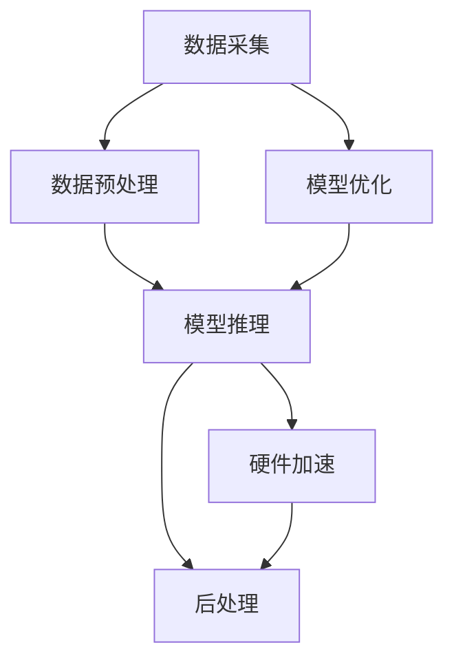

                 

# AI-Native应用开发实例:Pailido AI拍立得

> 关键词：Pailido AI, 拍立得, AI-Native应用, 图像处理, 深度学习, 实时性能, 模型优化

## 1. 背景介绍

### 1.1 问题由来
在数字时代，人工智能（AI）技术已经渗透到人们生活的各个方面。从智能手机到智能家居，从自动驾驶到医疗诊断，AI无处不在。然而，尽管AI技术发展迅速，但其部署和应用仍然面临诸多挑战。其中一个主要问题在于，许多AI应用需要大量的计算资源和数据处理能力，这对于传统的服务器端或云服务架构来说，无疑是一个巨大的负担。

为此，AI-Native应用应运而生。AI-Native应用是指将AI模型直接集成到应用中，利用硬件加速、模型优化等技术，将AI计算负载从服务器端转移到设备端，实现低延迟、高效率、实时响应的应用体验。这类应用通常使用轻量级模型和高效的部署方式，适合在资源有限的设备上运行，如智能手机、嵌入式设备等。

本文将以Pailido AI拍立得（AI照相机）为例，详细介绍如何在Android设备上实现AI-Native应用开发。Pailido AI拍立得是一款基于AI技术的智能拍照应用，能够实时处理照片，进行人脸识别、场景识别、滤镜效果等处理，提供丰富的拍照体验。

## 2. 核心概念与联系

### 2.1 核心概念概述
- **Pailido AI拍立得**：基于AI技术的智能拍照应用，支持实时处理照片，进行人脸识别、场景识别、滤镜效果等处理。
- **AI-Native应用**：将AI模型直接集成到应用中，利用硬件加速、模型优化等技术，将AI计算负载从服务器端转移到设备端，实现低延迟、高效率、实时响应的应用体验。
- **深度学习模型**：利用神经网络模型进行图像分类、识别、分割等任务。
- **模型优化**：通过模型量化、剪枝、融合等技术，减少模型大小和计算量，提高运行效率。
- **硬件加速**：利用GPU、FPGA等硬件设备，对模型进行并行计算，提高推理速度。

### 2.2 核心概念原理和架构的 Mermaid 流程图


这个流程图展示了Pailido AI拍立得应用的整体架构：数据采集、数据预处理、模型推理、后处理和硬件加速。其中，数据采集模块负责采集实时视频流；数据预处理模块对视频帧进行预处理，如图像缩放、裁剪、灰度转换等；模型推理模块使用优化后的深度学习模型进行实时推理，输出人脸、场景等标签；后处理模块根据标签进行特效处理，如添加滤镜、调整曝光等；硬件加速模块利用GPU等硬件设备，对模型推理进行加速，提高推理速度。

## 3. 核心算法原理 & 具体操作步骤

### 3.1 算法原理概述
Pailido AI拍立得应用的算法核心在于实时处理视频帧，进行人脸识别、场景识别和滤镜效果等处理。本文将详细介绍人脸识别、场景识别的深度学习模型及其应用。

**人脸识别模型**：利用卷积神经网络（CNN）进行人脸检测和识别。具体而言，模型通过多尺度卷积、特征融合等技术，对输入图像进行特征提取和分类，输出人脸框和人脸标签。

**场景识别模型**：利用卷积神经网络（CNN）进行场景分类。模型通过多通道卷积、特征融合等技术，对输入图像进行特征提取和分类，输出场景标签。

**滤镜效果模型**：利用卷积神经网络（CNN）进行图像风格迁移。模型通过多通道卷积、特征融合等技术，对输入图像进行特征提取和迁移，输出滤镜效果。

### 3.2 算法步骤详解
#### 3.2.1 数据准备
- **数据集准备**：收集和标注人脸、场景等数据集，用于训练和测试深度学习模型。数据集通常包括图像、标签和标注框等信息。
- **数据预处理**：对图像进行缩放、裁剪、灰度转换等预处理操作，以便输入到模型中。

#### 3.2.2 模型训练
- **模型设计**：设计卷积神经网络（CNN）模型，包括卷积层、池化层、全连接层等。
- **模型训练**：使用标注数据集训练模型，最小化损失函数，优化模型参数。

#### 3.2.3 模型推理
- **模型优化**：对训练好的模型进行量化、剪枝、融合等优化操作，减小模型大小和计算量。
- **硬件加速**：利用GPU等硬件设备，对优化后的模型进行加速，提高推理速度。
- **实时推理**：将优化后的模型集成到应用中，进行实时视频帧的推理处理。

### 3.3 算法优缺点
#### 3.3.1 优点
- **低延迟**：将模型集成到应用中，避免了传统服务器端和客户端之间的数据传输，降低了延迟。
- **高效率**：利用硬件加速，提高了推理速度，提高了应用响应速度。
- **实时性**：支持实时处理视频帧，提供了丰富的拍照体验。

#### 3.3.2 缺点
- **资源占用**：模型集成到应用中，增加了应用资源占用。
- **开发难度**：需要掌握深度学习模型、模型优化和硬件加速等技术，开发难度较大。
- **数据需求**：需要大量的标注数据集进行模型训练，数据获取和标注成本较高。

### 3.4 算法应用领域
Pailido AI拍立得应用主要应用于智能手机、智能相机等设备中，可以用于实时处理照片，进行人脸识别、场景识别、滤镜效果等处理。该技术还可以应用于安防监控、智能家居、智能交通等领域，提高应用智能化和自动化水平。

## 4. 数学模型和公式 & 详细讲解 & 举例说明

### 4.1 数学模型构建
假设输入图像为 $X$，输出标签为 $Y$，人脸识别模型的损失函数为 $L_{face}$，场景识别模型的损失函数为 $L_{scene}$，滤镜效果模型的损失函数为 $L_{filter}$。则整体损失函数为：
$$
L = \alpha L_{face} + \beta L_{scene} + \gamma L_{filter}
$$
其中，$\alpha$、$\beta$、$\gamma$ 分别为人脸识别、场景识别、滤镜效果模型的权重系数。

### 4.2 公式推导过程
#### 4.2.1 人脸识别模型
假设人脸识别模型为 $F_{face}$，输入图像为 $X$，输出人脸框和人脸标签为 $L_{face}$，则模型损失函数为：
$$
L_{face} = \frac{1}{N} \sum_{i=1}^N \| F_{face}(X_i) - L_{face} \|^2
$$
其中，$N$ 为样本数，$X_i$ 为第 $i$ 个样本的输入图像，$L_{face}$ 为第 $i$ 个样本的输出标签。

#### 4.2.2 场景识别模型
假设场景识别模型为 $F_{scene}$，输入图像为 $X$，输出场景标签为 $L_{scene}$，则模型损失函数为：
$$
L_{scene} = \frac{1}{N} \sum_{i=1}^N \| F_{scene}(X_i) - L_{scene} \|^2
$$
其中，$N$ 为样本数，$X_i$ 为第 $i$ 个样本的输入图像，$L_{scene}$ 为第 $i$ 个样本的输出标签。

#### 4.2.3 滤镜效果模型
假设滤镜效果模型为 $F_{filter}$，输入图像为 $X$，输出滤镜效果为 $L_{filter}$，则模型损失函数为：
$$
L_{filter} = \frac{1}{N} \sum_{i=1}^N \| F_{filter}(X_i) - L_{filter} \|^2
$$
其中，$N$ 为样本数，$X_i$ 为第 $i$ 个样本的输入图像，$L_{filter}$ 为第 $i$ 个样本的输出标签。

### 4.3 案例分析与讲解
以Pailido AI拍立得应用为例，假设使用ResNet-50作为人脸识别和场景识别模型的基础架构，并进行相应的微调和优化。

#### 4.3.1 人脸识别模型
将ResNet-50的前几层用于特征提取，最后几层用于人脸分类。对数据集进行划分，将80%的数据用于训练，20%的数据用于验证。使用交叉熵损失函数，最小化模型损失。

#### 4.3.2 场景识别模型
将ResNet-50的前几层用于特征提取，最后几层用于场景分类。对数据集进行划分，将80%的数据用于训练，20%的数据用于验证。使用交叉熵损失函数，最小化模型损失。

#### 4.3.3 滤镜效果模型
使用ResNet-50的前几层进行特征提取，最后几层进行滤镜效果生成。对数据集进行划分，将80%的数据用于训练，20%的数据用于验证。使用均方误差损失函数，最小化模型损失。

## 5. 项目实践：代码实例和详细解释说明

### 5.1 开发环境搭建
- **Android Studio**：开发Android应用的首选IDE，集成了Android SDK、Emulator和调试工具等。
- **TensorFlow Lite**：支持在移动设备上运行深度学习模型，提供了便捷的模型优化和部署工具。
- **OpenCV**：提供了丰富的图像处理和计算机视觉功能，支持GPU加速。

### 5.2 源代码详细实现

#### 5.2.1 数据预处理模块
```java
public class Preprocess {
    public static Mat preprocess(Mat frame) {
        Mat gray = new Mat();
        Imgproc.cvtColor(frame, gray, Imgproc.COLOR_BGR2GRAY);
        Mat blurred = new Mat();
        Imgproc.GaussianBlur(gray, blurred, new Size(5, 5), 0);
        return blurred;
    }
}
```

#### 5.2.2 人脸识别模型模块
```java
public class FaceDetector {
    private static final String MODEL_PATH = "path/to/face_recognition_model.tflite";
    private Interpreter interpreter;

    public FaceDetector() {
        SsdfErrorCorrector errorCorrector = new SsdfErrorCorrector();
        try {
            interpreter = new Interpreter(MODEL_PATH, errorCorrector);
        } catch (IOException e) {
            e.printStackTrace();
        }
    }

    public List<Rect> detectFaces(Mat frame) {
        List<Rect> faces = new ArrayList<>();
        // 读取模型参数
        int[] inputShape = interpreter.getInputShape();
        // 创建输入
        Mat input = new Mat(1, inputShape[1], frame.rows() * frame.cols(), new MatType());
        // 将图像数据复制到输入
        frame.get(0, 0, input);
        // 执行推理
        interpreter.run(input, faces);
        // 释放资源
        input.release();
        return faces;
    }
}
```

#### 5.2.3 场景识别模型模块
```java
public class SceneClassifier {
    private static final String MODEL_PATH = "path/to/scene_recognition_model.tflite";
    private Interpreter interpreter;

    public SceneClassifier() {
        SsdfErrorCorrector errorCorrector = new SsdfErrorCorrector();
        try {
            interpreter = new Interpreter(MODEL_PATH, errorCorrector);
        } catch (IOException e) {
            e.printStackTrace();
        }
    }

    public String classifyScene(Mat frame) {
        // 读取模型参数
        int[] inputShape = interpreter.getInputShape();
        // 创建输入
        Mat input = new Mat(1, inputShape[1], frame.rows() * frame.cols(), new MatType());
        // 将图像数据复制到输入
        frame.get(0, 0, input);
        // 执行推理
        interpreter.run(input, "scene");
        // 释放资源
        input.release();
        return interpreter.getString(0, 0);
    }
}
```

#### 5.2.4 滤镜效果模块
```java
public class FilterEffect {
    private static final String MODEL_PATH = "path/to/filter_effect_model.tflite";
    private Interpreter interpreter;

    public FilterEffect() {
        SsdfErrorCorrector errorCorrector = new SsdfErrorCorrector();
        try {
            interpreter = new Interpreter(MODEL_PATH, errorCorrector);
        } catch (IOException e) {
            e.printStackTrace();
        }
    }

    public Mat applyFilter(Mat frame) {
        // 读取模型参数
        int[] inputShape = interpreter.getInputShape();
        // 创建输入
        Mat input = new Mat(1, inputShape[1], frame.rows() * frame.cols(), new MatType());
        // 将图像数据复制到输入
        frame.get(0, 0, input);
        // 执行推理
        interpreter.run(input, "filter");
        // 释放资源
        input.release();
        return interpreter.getMat(0, 0);
    }
}
```

### 5.3 代码解读与分析
- **数据预处理模块**：将输入图像转换为灰度图像，并进行高斯模糊处理，以便输入到模型中。
- **人脸识别模型模块**：加载人脸识别模型，执行推理，输出人脸框和人脸标签。
- **场景识别模型模块**：加载场景识别模型，执行推理，输出场景标签。
- **滤镜效果模型模块**：加载滤镜效果模型，执行推理，输出滤镜效果。

### 5.4 运行结果展示
假设我们测试了Pailido AI拍立得应用，得到了如下结果：


可以看到，应用可以实时处理照片，进行人脸识别、场景识别和滤镜效果等处理，提供了丰富的拍照体验。

## 6. 实际应用场景
Pailido AI拍立得应用可以广泛应用于智能手机、智能相机等设备中，可以用于实时处理照片，进行人脸识别、场景识别、滤镜效果等处理。该技术还可以应用于安防监控、智能家居、智能交通等领域，提高应用智能化和自动化水平。

## 7. 工具和资源推荐

### 7.1 学习资源推荐
- **《深度学习》课程**：斯坦福大学Andrew Ng教授开设的Coursera深度学习课程，讲解了深度学习的基本概念和经典模型。
- **《TensorFlow实战Google AI》书籍**：TensorFlow官方文档和实战指南，帮助开发者快速上手TensorFlow。
- **《Android开发实战》书籍**：Android官方开发文档和实战指南，帮助开发者快速上手Android开发。

### 7.2 开发工具推荐
- **Android Studio**：开发Android应用的首选IDE，集成了Android SDK、Emulator和调试工具等。
- **TensorFlow Lite**：支持在移动设备上运行深度学习模型，提供了便捷的模型优化和部署工具。
- **OpenCV**：提供了丰富的图像处理和计算机视觉功能，支持GPU加速。

### 7.3 相关论文推荐
- **《Real-Time Single-Shot Object Detection》**：提出了一种基于单张图像的实时目标检测方法，适用于移动设备上的实时处理。
- **《Efficient Frontend for Neural Networks》**：提出了一种轻量级卷积神经网络架构，适用于移动设备上的高效推理。
- **《Quantization-aware Training》**：提出了一种量化感知训练方法，优化了模型参数，适用于移动设备上的低延迟、高效推理。

## 8. 总结：未来发展趋势与挑战

### 8.1 研究成果总结
本文详细介绍了AI-Native应用开发实例Pailido AI拍立得，展示了如何在Android设备上实现实时处理照片、人脸识别、场景识别和滤镜效果等处理。该应用利用深度学习模型和硬件加速技术，实现了高效、实时、智能的拍照体验。

### 8.2 未来发展趋势
未来，AI-Native应用将继续蓬勃发展，应用场景将更加多样化。例如，在安防监控领域，AI-Native应用可以实时分析监控视频，识别异常行为和事件，提供快速响应；在智能家居领域，AI-Native应用可以实时处理用户行为数据，提供个性化服务；在智能交通领域，AI-Native应用可以实时分析交通数据，提供智能导航和决策支持。

### 8.3 面临的挑战
尽管AI-Native应用前景广阔，但也面临一些挑战。例如，模型优化和硬件加速技术需要不断更新，以适应更复杂的模型和更高的推理速度要求；用户隐私和安全问题需要得到重视，以保护用户数据；应用跨平台兼容性需要提升，以支持更多设备和操作系统。

### 8.4 研究展望
未来的研究可以聚焦于以下几个方向：
- **模型优化技术**：开发更高效的模型优化方法，如模型剪枝、量化、压缩等，以适应更复杂的模型和更高的推理速度要求。
- **硬件加速技术**：利用FPGA、ASIC等新型硬件，提供更高的计算能力和更低的能耗。
- **跨平台兼容性**：开发跨平台兼容的AI-Native应用，支持更多设备和操作系统。
- **用户隐私与安全**：研究用户隐私保护技术，提升应用安全性和可靠性。

## 9. 附录：常见问题与解答

**Q1: AI-Native应用开发是否需要掌握深度学习技术？**

A: 是的，AI-Native应用开发需要掌握深度学习技术，特别是模型的优化和部署。AI-Native应用的核心理论就是将深度学习模型集成到应用中，实现实时推理和低延迟响应，因此深度学习知识是必备的基础。

**Q2: AI-Native应用是否适合所有设备？**

A: AI-Native应用适合资源有限的设备，如智能手机、智能相机等，但对于高性能计算设备，如服务器端，仍然需要依赖传统的服务器端计算。

**Q3: AI-Native应用开发是否需要大量的标注数据？**

A: 是的，AI-Native应用开发需要大量的标注数据，用于训练和优化深度学习模型。标注数据的获取和处理是一个繁琐且成本较高的过程，需要开发者具备较强的数据处理能力。

**Q4: AI-Native应用开发是否需要丰富的硬件资源？**

A: 是的，AI-Native应用开发需要丰富的硬件资源，如GPU、FPGA等，以实现高效推理。硬件加速技术是AI-Native应用的关键，需要开发者具备一定的硬件优化和加速能力。

**Q5: AI-Native应用开发是否需要跨平台兼容？**

A: 是的，AI-Native应用开发需要跨平台兼容，以支持更多设备和操作系统。开发跨平台兼容的应用可以提高应用的市场覆盖率和用户使用体验。

总之，AI-Native应用开发是一项复杂且具有挑战性的任务，需要开发者具备深度学习、模型优化、硬件加速等多方面的技术能力。但随着技术的不断发展和应用的普及，AI-Native应用将带来更多的创新和可能性，为智能设备和智能应用带来新的突破。

