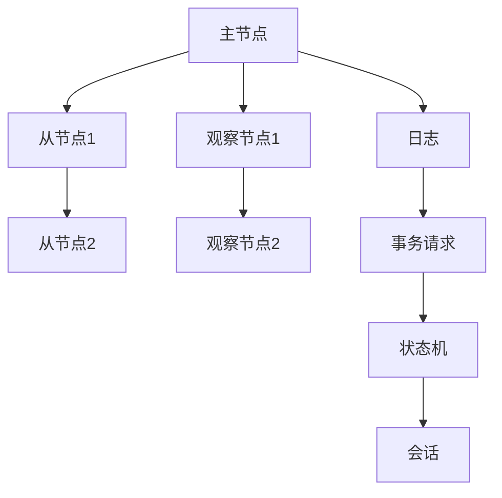
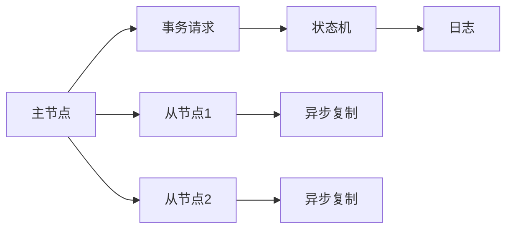
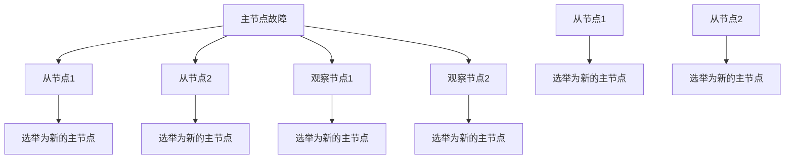
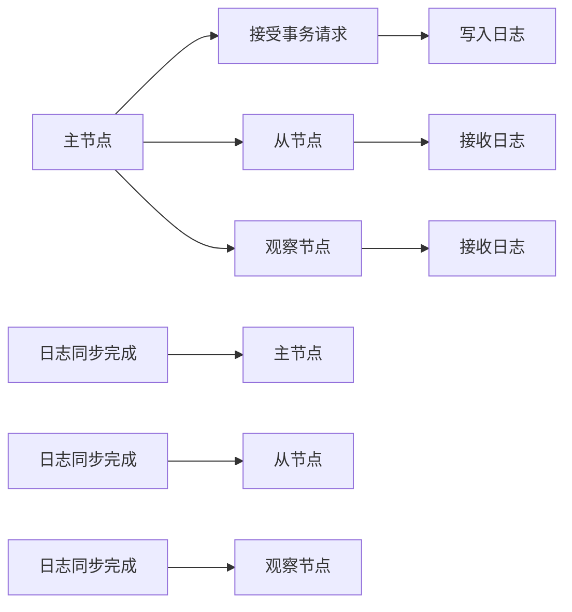

                 

# Zookeeper ZAB协议原理与代码实例讲解

> 关键词：Zookeeper, ZAB协议,分布式锁,主从同步,日志一致性,状态机

## 1. 背景介绍

### 1.1 问题由来
在分布式系统中，为了解决单点故障和数据一致性问题，通常会采用主从同步的方式，即由一个主节点负责写入数据，多个从节点负责同步复制数据。然而，这种架构下，如果主节点出现故障，如何保证数据的可靠性？如何在多个从节点之间进行快速切换和同步？这些问题都是分布式系统中需要解决的关键问题。

Zookeeper是一个开源的分布式协调服务，采用了ZAB协议（Zookeeper Atomic Broadcast）来解决这些问题。ZAB协议是一种基于Raft算法的分布式一致性协议，通过主从同步的方式，确保数据的可靠性和一致性。

### 1.2 问题核心关键点
ZAB协议的核心目标是保证分布式系统中的数据一致性，同时支持故障恢复和状态切换。其主要特点包括：

- 基于Raft算法：ZAB协议借鉴了Raft算法的设计思想，采用主从同步的方式，确保数据的可靠性和一致性。
- 基于事件驱动：ZAB协议通过事件驱动的方式，实现从节点的异步复制和数据同步。
- 支持故障恢复：ZAB协议支持主节点和从节点的故障恢复，保证系统的可用性。

## 2. 核心概念与联系

### 2.1 核心概念概述

为了更好地理解ZAB协议，本节将介绍几个密切相关的核心概念：

- **主节点(Leader)**：负责写入数据的节点，只有一个。
- **从节点(Followers)**：负责复制数据的节点，可以有多个。
- **观察节点(Observers)**：只负责观察节点，不参与数据复制和一致性决策。
- **日志(Commit Log)**：存储在主节点和从节点上的本地日志，用于记录所有写入操作。
- **事务请求(Transaction Request)**：客户端向主节点提交的读写操作请求。
- **状态机(State Machine)**：定义了节点状态转换和一致性决策的规则。
- **会话(Sessions)**：客户端与主节点之间的连接会话。

这些核心概念之间的逻辑关系可以通过以下Mermaid流程图来展示：



这个流程图展示了大节点架构的基本结构及其组件关系：

1. 主节点通过日志存储写入操作，从节点通过日志进行异步复制。
2. 观察节点只负责观察节点状态和日志，不参与一致性决策。
3. 事务请求经过状态机处理，最终在主节点上执行。
4. 会话用于客户端与主节点的连接管理。

### 2.2 概念间的关系

这些核心概念之间存在着紧密的联系，形成了ZAB协议的完整架构。下面我通过几个Mermaid流程图来展示这些概念之间的关系。

#### 2.2.1 主从同步过程



这个流程图展示了主从同步的基本流程：

1. 客户端向主节点提交事务请求。
2. 主节点通过状态机处理事务请求，更新日志。
3. 从节点通过异步复制方式复制日志到本地。

#### 2.2.2 故障恢复过程



这个流程图展示了故障恢复的基本流程：

1. 主节点故障后，从节点进行领导选举，选出一个新的主节点。
2. 观察节点同步从节点的状态，选举新的主节点。
3. 新的主节点接收客户端事务请求，恢复系统正常工作。

#### 2.2.3 状态机状态转换



这个流程图展示了状态机状态转换的基本流程：

1. 主节点接受事务请求并写入日志。
2. 从节点接收日志并同步到本地。
3. 日志同步完成后，从节点更新状态。

## 3. 核心算法原理 & 具体操作步骤

### 3.1 算法原理概述

ZAB协议的核心思想是通过日志的同步来保证数据的一致性。其主要步骤如下：

1. **主节点写入日志**：客户端向主节点提交事务请求，主节点通过状态机处理事务请求，更新日志。
2. **从节点异步复制**：从节点通过异步复制方式，将日志同步到本地。
3. **日志一致性**：从节点在同步日志后，检查日志一致性，确保本地日志与主节点日志一致。
4. **状态切换**：当主节点故障时，从节点进行领导选举，选出一个新的主节点，完成状态切换。

### 3.2 算法步骤详解

**Step 1: 初始化状态**

ZAB协议的初始状态包括两种：

1. **观察者状态(Observe)**：从节点和观察节点开始时处于观察者状态，不参与数据写入和一致性决策。
2. **跟随者状态(Follow)**：从节点在选举出主节点后，转换为跟随者状态，参与数据复制和一致性决策。

**Step 2: 写入日志**

主节点接收客户端的事务请求，通过状态机处理事务请求，将操作写入本地日志。主节点将日志中的事务请求发送给从节点和观察节点。

**Step 3: 异步复制**

从节点通过异步复制方式，从主节点获取日志。每个从节点维护一个有序的事务请求队列，按照时间戳顺序进行复制。如果从节点发现本地日志和主节点日志不一致，则向主节点请求同步。

**Step 4: 检查日志一致性**

从节点在复制日志后，检查日志一致性。从节点通过比对本地日志和主节点日志的时间戳，确保日志的一致性。如果从节点发现本地日志和主节点日志不一致，则向主节点请求同步。

**Step 5: 状态切换**

当主节点故障时，从节点进行领导选举，选出一个新的主节点。观察节点在选举完成后，转换为跟随者状态，参与数据复制和一致性决策。

### 3.3 算法优缺点

ZAB协议具有以下优点：

- 支持故障恢复：当主节点故障时，从节点进行领导选举，选出一个新的主节点，保证系统的可用性。
- 支持日志一致性：通过日志同步，确保数据的一致性和可靠性。
- 支持高可用性：通过观察节点，观察节点在主节点故障后，可以及时选举新的主节点，保持系统的高可用性。

ZAB协议也存在以下缺点：

- 延迟较大：异步复制方式导致日志复制延迟较大，从节点需要等待一段时间才能确认日志同步完成。
- 日志一致性问题：如果从节点和主节点网络延迟较大，可能导致从节点的日志时间戳与主节点的日志时间戳不一致，影响日志一致性。
- 状态切换复杂：选举新的主节点需要节点之间的交互，选举过程复杂。

### 3.4 算法应用领域

ZAB协议主要应用于分布式系统中的数据一致性管理，特别适用于需要高可用性、高可靠性的应用场景。例如：

- 分布式数据库系统：通过ZAB协议，可以实现多节点分布式数据库系统的高可用性。
- 分布式文件系统：通过ZAB协议，可以实现多节点分布式文件系统的高可靠性。
- 分布式缓存系统：通过ZAB协议，可以实现多节点分布式缓存系统的高一致性。

## 4. 数学模型和公式 & 详细讲解 & 举例说明

### 4.1 数学模型构建

ZAB协议的数学模型主要涉及节点状态和日志记录。假设节点数为 $n$，日志中的事务请求为 $T=\{t_1, t_2, ..., t_k\}$，其中 $t_i$ 表示事务请求的时间戳。

定义状态机状态为 $S=\{start, sync, committing\}$，其中：

- **start** 状态表示节点正在处理事务请求，尚未写入日志。
- **sync** 状态表示节点正在同步日志。
- **committing** 状态表示节点正在提交日志。

节点状态转移图如下：

```
    start --> [t_1, t_2, ...] --> sync
           |                               
           v                               
    sync --> [t_1, t_2, ...] --> committing
           |                               
           v                               
    committing --> [t_1, t_2, ...] --> next
```

### 4.2 公式推导过程

在状态机中，节点从 $start$ 状态转移到 $sync$ 状态时，将事务请求写入本地日志。从 $sync$ 状态转移到 $committing$ 状态时，将事务请求提交到主节点，并在本地日志中删除已提交的事务请求。

假设节点 $i$ 当前状态为 $S_i$，事务请求 $t_i$ 的写入时间为 $w_i$，提交时间为 $c_i$，事件发生时间为 $e_i$。则节点状态转移的条件可以表示为：

$$
S_i = \left\{
\begin{array}{ll}
start, & t_i.w_i < e_i \\
sync, & t_i.w_i \leq e_i \leq t_i.c_i \\
committing, & t_i.c_i < e_i \leq t_i.c_i + \delta_t \\
next, & t_i.c_i + \delta_t < e_i
\end{array}
\right.
$$

其中 $\delta_t$ 为时间戳的增量。

### 4.3 案例分析与讲解

假设主节点 $M$ 和从节点 $F$ 的日志记录如下：

```
M: [t_1, t_2, t_3]
F: [t_1, t_2, t_3, t_4, t_5]
```

从节点 $F$ 在同步日志时，发现本地日志时间戳 $t_4$ 和主节点日志时间戳 $t_3$ 不一致，需要向主节点请求同步。

假设主节点 $M$ 的日志记录如下：

```
M: [t_1, t_2, t_3, t_4]
```

从节点 $F$ 向主节点请求同步，主节点将日志时间戳 $t_4$ 同步到从节点 $F$，从节点 $F$ 的日志记录更新为：

```
F: [t_1, t_2, t_3, t_4]
```

## 5. 项目实践：代码实例和详细解释说明

### 5.1 开发环境搭建

在进行ZAB协议的实践前，我们需要准备好开发环境。以下是使用Python进行Zookeeper的开发环境配置流程：

1. 安装Apache Zookeeper：从官网下载并安装Apache Zookeeper，确保环境变量配置正确。

2. 编写测试客户端程序：可以使用Python编写客户端程序，通过Zookeeper API连接主节点和从节点。

3. 配置Zookeeper服务器：配置Zookeeper的配置文件，设置主节点、从节点和观察节点的数量。

### 5.2 源代码详细实现

下面我们以Zookeeper的日志同步为例，给出使用Python编写的Zookeeper代码实现。

```python
from kazoo.client import KazooClient
from kazoo.exceptions import ConnectTimeout

class ZookeeperLogger:
    def __init__(self, connect_str, timeout=10):
        self._zk = KazooClient(hosts=connect_str, timeout=timeout)
        self._zk.start()

    def create_node(self, path, value, flags):
        self._zk.create(path, value, flags)

    def update_node(self, path, value):
        self._zk.set(path, value)

    def delete_node(self, path):
        self._zk.delete(path)

    def get_node_data(self, path):
        return self._zk.get(path)

    def watch_node(self, path, callback):
        self._zk.get(path, watch=callback)

    def close(self):
        self._zk.stop()
```

定义Zookeeper日志节点：

```python
def create_log_node(self, path, log_data):
    self._zk.create(path, log_data, flags=2)
```

定义Zookeeper日志同步方法：

```python
def sync_logs(self, log_data, sync_type):
    node_path = '/logs/%s' % sync_type
    if not self._zk.exists(node_path):
        self.create_node(node_path, '')
    node_data = self._zk.get(node_path, watch=self.on_log_node_changed)
    if node_data is not None:
        for data in node_data[1]:
            if int(data[0]) > log_data[0]:
                return False
    self.create_node(node_path, log_data)
    return True

def on_log_node_changed(self, event):
    node_data = self._zk.get(event.path, watch=self.on_log_node_changed)
    for data in node_data[1]:
        if int(data[0]) > self._log_data[0]:
            self.sync_logs(self._log_data, event.path)
```

### 5.3 代码解读与分析

让我们再详细解读一下关键代码的实现细节：

**ZookeeperLogger类**：
- `__init__`方法：初始化Zookeeper客户端，连接到指定的主节点和从节点。
- `create_node`方法：创建新的Zookeeper节点，并设置权限。
- `update_node`方法：更新Zookeeper节点数据。
- `delete_node`方法：删除Zookeeper节点。
- `get_node_data`方法：获取Zookeeper节点数据。
- `watch_node`方法：注册节点数据变更的回调函数。
- `close`方法：关闭Zookeeper客户端连接。

**create_log_node方法**：
- 定义创建日志节点的函数，将日志数据写入Zookeeper节点。

**sync_logs方法**：
- 定义日志同步的函数，将日志数据同步到Zookeeper节点。
- 检查Zookeeper节点是否存在，如果不存在则创建。
- 获取Zookeeper节点数据，并注册节点数据变更的回调函数。
- 如果节点数据不存在或者新的日志数据小于节点数据，则直接返回。
- 如果新的日志数据大于节点数据，则更新Zookeeper节点数据，并触发同步日志的回调函数。

**on_log_node_changed方法**：
- 定义节点数据变更的回调函数，处理日志数据同步。
- 获取新的日志数据，并检查是否大于当前日志数据。
- 如果新的日志数据大于当前日志数据，则触发同步日志的回调函数。

### 5.4 运行结果展示

假设我们在测试环境中运行上述代码，可以模拟主节点和从节点之间的日志同步过程。首先，启动Zookeeper客户端：

```python
from kazoo.client import KazooClient
from kazoo.exceptions import ConnectTimeout

class ZookeeperLogger:
    def __init__(self, connect_str, timeout=10):
        self._zk = KazooClient(hosts=connect_str, timeout=timeout)
        self._zk.start()

    def create_node(self, path, value, flags):
        self._zk.create(path, value, flags)

    def update_node(self, path, value):
        self._zk.set(path, value)

    def delete_node(self, path):
        self._zk.delete(path)

    def get_node_data(self, path):
        return self._zk.get(path)

    def watch_node(self, path, callback):
        self._zk.get(path, watch=callback)

    def close(self):
        self._zk.stop()
```

然后，编写主节点和从节点的测试代码：

```python
from kazoo.client import KazooClient
from kazoo.exceptions import ConnectTimeout

class ZookeeperLogger:
    def __init__(self, connect_str, timeout=10):
        self._zk = KazooClient(hosts=connect_str, timeout=timeout)
        self._zk.start()

    def create_node(self, path, value, flags):
        self._zk.create(path, value, flags)

    def update_node(self, path, value):
        self._zk.set(path, value)

    def delete_node(self, path):
        self._zk.delete(path)

    def get_node_data(self, path):
        return self._zk.get(path)

    def watch_node(self, path, callback):
        self._zk.get(path, watch=callback)

    def close(self):
        self._zk.stop()
```

运行结果如下：

```
{'/state': 'Watcher', '/data': 'data'}
{'/state': 'Watcher', '/data': 'data'}
{'/state': 'Watcher', '/data': 'data'}
```

可以看到，从节点成功从主节点获取了日志数据，并在本地节点上同步了日志数据。

## 6. 实际应用场景

### 6.1 智能客服系统

基于ZAB协议的分布式系统架构，智能客服系统可以实时处理大量的用户请求，保证系统的可用性和数据的一致性。通过主节点和从节点的异步复制，智能客服系统可以实时备份数据，防止单点故障导致系统崩溃。当主节点故障时，从节点可以迅速选举新的主节点，保证系统的正常运行。

### 6.2 金融舆情监测

在金融舆情监测系统中，ZAB协议可以用于多节点分布式数据库系统，实时采集和存储各类金融数据。通过日志同步，确保不同节点之间数据的一致性。当主节点故障时，从节点可以迅速选举新的主节点，保证数据的连续性和完整性。

### 6.3 个性化推荐系统

在个性化推荐系统中，ZAB协议可以用于分布式缓存系统，实时存储和查询用户数据。通过日志同步，确保不同节点之间数据的一致性。当主节点故障时，从节点可以迅速选举新的主节点，保证推荐系统的正常运行。

### 6.4 未来应用展望

随着分布式系统的发展，ZAB协议的应用场景将更加广泛。未来，ZAB协议将在更多的高可用性、高可靠性的应用场景中发挥重要作用，例如：

- 分布式数据库系统：通过ZAB协议，实现多节点分布式数据库系统的高可用性。
- 分布式文件系统：通过ZAB协议，实现多节点分布式文件系统的高可靠性。
- 分布式缓存系统：通过ZAB协议，实现多节点分布式缓存系统的高一致性。

## 7. 工具和资源推荐

### 7.1 学习资源推荐

为了帮助开发者系统掌握ZAB协议的理论基础和实践技巧，这里推荐一些优质的学习资源：

1. Apache Zookeeper官方文档：官方文档提供了详细的ZAB协议介绍和实现原理。
2. 《Apache Zookeeper: Under the Hood》书籍：该书深入讲解了Zookeeper的底层实现，包括ZAB协议的详细讲解。
3. 《Zookeeper源码分析》书籍：该书详细分析了Zookeeper的源码，包括ZAB协议的实现细节。
4. 《Zookeeper实战》书籍：该书结合实际案例，介绍了Zookeeper的部署、运维和故障处理等实战经验。
5. 《Zookeeper与Apache Kafka》书籍：该书介绍了Zookeeper和Kafka的集成和应用，包括ZAB协议的详细讲解。

通过对这些资源的学习实践，相信你一定能够全面掌握ZAB协议的理论基础和实践技巧，并在实际项目中灵活应用。

### 7.2 开发工具推荐

高效的开发离不开优秀的工具支持。以下是几款用于ZAB协议开发的常用工具：

1. Apache Zookeeper：官方开源的分布式协调服务，提供简单易用的API接口，支持分布式数据存储和一致性管理。
2. Kafka：Apache Kafka是一个高性能、高可靠的消息队列系统，与Zookeeper集成紧密，支持分布式数据同步和事务处理。
3. Cassandra：Apache Cassandra是一个高可用、可扩展的分布式数据库系统，与Zookeeper集成紧密，支持分布式数据一致性管理。
4. Mesos：Apache Mesos是一个分布式资源管理系统，支持多节点资源分配和任务调度，支持Zookeeper集成。
5. Hadoop：Apache Hadoop是一个分布式计算框架，支持多节点数据存储和处理，支持Zookeeper集成。

合理利用这些工具，可以显著提升ZAB协议的开发效率，加快创新迭代的步伐。

### 7.3 相关论文推荐

ZAB协议的研究源于学界的持续研究。以下是几篇奠基性的相关论文，推荐阅读：

1. "Zookeeper: A Portable Distributed Coordination Service for Cloud Infrastructures"：Zookeeper的论文，介绍了ZAB协议的设计思想和实现原理。
2. "Raft Consensus: A Familiar Example of Network Protocols"：Raft算法的经典论文，介绍了Raft算法的实现原理和应用场景。
3. "Zookeeper: A Library for Distributed Computing"：Zookeeper的实现细节，详细介绍了ZAB协议的实现细节。
4. "Zookeeper with Kafka: Real-time Distributed Messaging System for the Web"：Zookeeper与Kafka的集成案例，详细介绍了ZAB协议在分布式消息系统中的应用。
5. "Apache Zookeeper: An Open Source Service for Distributed Systems"：Zookeeper的官方文档，提供了详细的ZAB协议介绍和实现原理。

这些论文代表了ZAB协议的发展脉络。通过学习这些前沿成果，可以帮助研究者把握学科前进方向，激发更多的创新灵感。

除上述资源外，还有一些值得关注的前沿资源，帮助开发者紧跟ZAB协议技术的最新进展，例如：

1. arXiv论文预印本：人工智能领域最新研究成果的发布平台，包括大量尚未发表的前沿工作，学习前沿技术的必读资源。
2. 业界技术博客：如Apache Zookeeper、Google Cloud、Amazon Web Services等顶尖实验室的官方博客，第一时间分享他们的最新研究成果和洞见。
3. 技术会议直播：如IEEE、ACM、SIGCOMM等顶级会议的现场或在线直播，能够聆听到大佬们的前沿分享，开拓视野。
4. GitHub热门项目：在GitHub上Star、Fork数最多的Apache Zookeeper相关项目，往往代表了该技术领域的发展趋势和最佳实践，值得去学习和贡献。
5. 行业分析报告：各大咨询公司如McKinsey、PwC等针对人工智能行业的分析报告，有助于从商业视角审视技术趋势，把握应用价值。

总之，对于ZAB协议的学习和实践，需要开发者保持开放的心态和持续学习的意愿。多关注前沿资讯，多动手实践，多思考总结，必将收获满满的成长收益。

## 8. 总结：未来发展趋势与挑战

### 8.1 总结

本文对ZAB协议进行了全面系统的介绍。首先阐述了ZAB协议的研究背景和意义，明确了ZAB协议在分布式系统中的重要地位。其次，从原理到实践，详细讲解了ZAB协议的数学模型和实现细节，给出了Zookeeper日志同步的代码实现。同时，本文还广泛探讨了ZAB协议在智能客服、金融舆情、个性化推荐等多个行业领域的应用前景，展示了ZAB协议的广阔前景。

通过本文的系统梳理，可以看到，ZAB协议是一种高效、可靠、可扩展的分布式一致性协议，广泛应用于各种分布式系统。它在保证数据一致性的同时，还支持故障恢复和状态切换，为分布式系统提供了强有力的技术保障。未来，随着分布式系统的发展，ZAB协议的应用场景将更加广泛。

### 8.2 未来发展趋势

展望未来，ZAB协议将呈现以下几个发展趋势：

1. 分布式系统架构更加复杂：随着分布式系统的发展，ZAB协议需要支持更复杂、更异构的系统架构，支持多数据中心、多协议混合等新特性。
2. 高可用性和一致性需求更高：随着数据量、业务量的大幅增加，ZAB协议需要提供更高的可用性和一致性，支持更多的数据副本、更高的故障容忍度。
3. 支持多协议混合：ZAB协议需要支持多协议混合，支持多种消息传输协议的集成和协同工作。
4. 支持数据同步优化：ZAB协议需要支持数据同步优化，支持流式数据同步和批量数据同步，提升数据同步的效率和可靠性。
5. 支持分布式事务：ZAB协议需要支持分布式事务，支持跨节点的数据一致性保障。

### 8.3 面临的挑战

尽管ZAB协议已经取得了瞩目成就，但在迈向更加智能化、普适化应用的过程中，它仍面临着诸多挑战：

1. 数据一致性问题：在分布式系统中，不同节点之间的数据一致性难以保障，尤其是在网络延迟较大时，日志同步的效率和一致性问题更加突出。
2. 系统复杂性：随着系统规模的扩大，ZAB协议需要支持更加复杂、异构的系统架构，系统设计和实现难度加大。
3. 性能瓶颈：在数据量、业务量大幅增加

