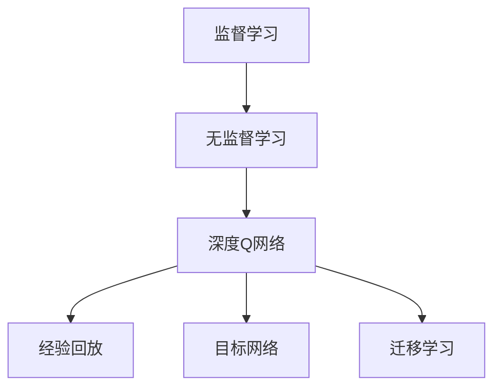
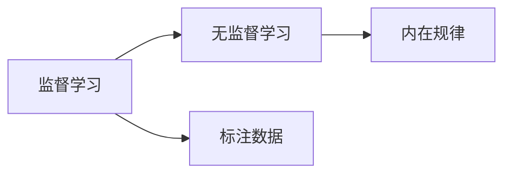
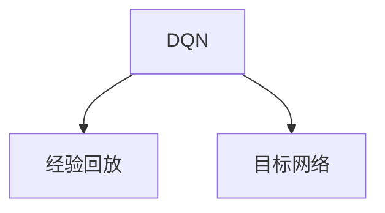
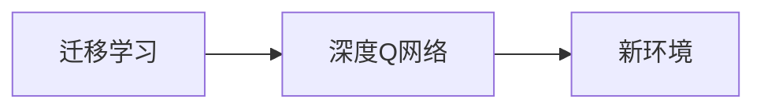
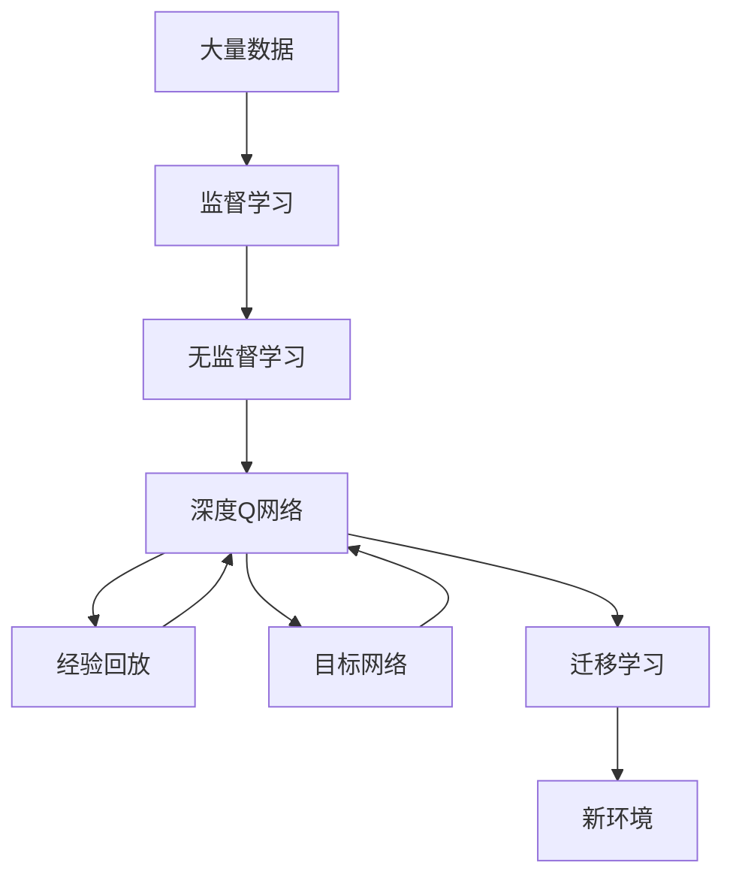

                 

# 一切皆是映射：从监督学习到DQN强化学习的思想转变

> 关键词：映射, 强化学习, 监督学习, 因果关系, 深度Q网络(DQN), 无监督学习, 迁移学习, 参数调整, 模型训练, 泛化能力

## 1. 背景介绍

### 1.1 问题由来

在当今的数据驱动型时代，机器学习已成为推动科技进步的重要引擎。无论是图像识别、自然语言处理、推荐系统，还是自动驾驶，机器学习都在各个领域中发挥着不可替代的作用。然而，机器学习方法的本质原理和应用场景远比表面所看到的更加丰富和复杂。

在过去的几十年里，监督学习（Supervised Learning）一直占据主导地位，其核心思想是利用带有标签的数据进行模型训练，以预测或分类未知数据。然而，随着深度学习技术的发展，强化学习（Reinforcement Learning, RL）逐渐崭露头角，成为解决复杂决策问题的重要工具。

在强化学习中，模型通过与环境的互动，学习如何在给定的状态下采取最优的行动，以最大化长期累积奖励。与监督学习的“监督-预测”模式不同，强化学习的“试错-学习”模式更接近于人类学习的方式。

本文旨在探讨强化学习中的深度Q网络（Deep Q Network, DQN），及其在实际应用中的思想转变，以期为读者提供更加深入的理解和应用启示。

### 1.2 问题核心关键点

DQN是强化学习中的重要分支，其核心思想是使用深度神经网络来逼近Q值函数，从而指导智能体在环境中做出最优决策。DQN通过无监督学习和迁移学习相结合的方式，逐渐优化模型参数，最终实现高效的决策过程。

DQN的核心关键点包括：
- 无监督学习：通过经验回放（Experience Replay）和目标网络（Target Network）等技术，使用未标记的数据进行模型训练，提高模型泛化能力。
- 迁移学习：利用已有的知识和经验，在新的环境中快速适应，提升模型性能。
- 参数调整：通过网络参数调整，提高模型的表示能力和决策效率。
- 模型训练：采用梯度下降等优化算法，不断更新模型参数，最小化损失函数。
- 泛化能力：通过样本多样性和复杂度控制，提升模型对新环境、新任务的适应能力。

这些关键点共同构成了DQN的基本框架，使得DQN在处理复杂决策问题时，能够超越传统的监督学习模式，提供更加灵活、高效、泛化的解决方案。

## 2. 核心概念与联系

### 2.1 核心概念概述

为更好地理解DQN的思想转变，本节将介绍几个密切相关的核心概念：

- 监督学习（Supervised Learning）：通过带有标签的数据进行训练，使模型能够对未知数据进行预测或分类。

- 无监督学习（Unsupervised Learning）：在没有标签数据的情况下，通过数据的固有结构进行学习，发现数据的内在规律和特征。

- 强化学习（Reinforcement Learning）：通过智能体与环境的交互，最大化累积奖励信号，学习最优的决策策略。

- 深度Q网络（Deep Q Network, DQN）：使用深度神经网络逼近Q值函数，从而在复杂环境中做出最优决策。

- 经验回放（Experience Replay）：将历史经验存储在经验池中，随机抽取样本进行训练，提高模型泛化能力。

- 目标网络（Target Network）：引入目标网络，更新策略网络的同时，保持目标网络稳定，提升模型的稳定性。

- 迁移学习（Transfer Learning）：通过已有知识和经验，在新环境中快速适应，提高模型性能。

这些核心概念之间的逻辑关系可以通过以下Mermaid流程图来展示：



这个流程图展示了大模型微调的各个核心概念及其之间的关系：

1. 监督学习提供了大量的带标签数据，无监督学习则利用这些数据发现内在规律和特征。
2. 基于无监督学习的发现，深度Q网络使用神经网络逼近Q值函数，提供最优决策策略。
3. 经验回放和目标网络等技术，提高了DQN的泛化能力和稳定性。
4. 迁移学习进一步提升了DQN在新环境中的适应能力。

### 2.2 概念间的关系

这些核心概念之间存在着紧密的联系，形成了DQN的基本生态系统。下面我们通过几个Mermaid流程图来展示这些概念之间的关系。

#### 2.2.1 监督学习与无监督学习的联系



这个流程图展示了监督学习与无监督学习的基本关系：监督学习利用标注数据进行模型训练，无监督学习则在数据的内在结构中发现规律。

#### 2.2.2 DQN与经验回放、目标网络的关系



这个流程图展示了DQN与经验回放、目标网络的关系：经验回放通过随机抽取历史经验，提高模型泛化能力；目标网络通过保持模型参数的稳定，提升模型稳定性。

#### 2.2.3 迁移学习与深度Q网络的关系



这个流程图展示了迁移学习与深度Q网络的关系：迁移学习通过已有知识，在新环境中快速适应，提高模型性能。

### 2.3 核心概念的整体架构

最后，我们用一个综合的流程图来展示这些核心概念在大模型微调过程中的整体架构：



这个综合流程图展示了从数据预处理到模型训练，再到模型部署和持续优化的完整过程。监督学习提供带标签数据，无监督学习发现数据规律，深度Q网络使用神经网络逼近Q值函数，经验回放和目标网络提升模型泛化能力，迁移学习在新环境中快速适应，通过不断优化，最终实现高效、稳定的决策过程。

## 3. 核心算法原理 & 具体操作步骤

### 3.1 算法原理概述

DQN是一种基于深度神经网络的强化学习方法，其核心思想是通过逼近Q值函数，使得智能体在复杂环境中能够做出最优决策。

DQN的核心算法包括以下几个关键步骤：
- 构建环境模型：通过模拟环境，生成历史状态和奖励数据。
- 初始化模型参数：使用随机权重初始化神经网络，准备模型训练。
- 策略更新：使用Q值函数指导智能体采取最优行动，最大化累积奖励。
- 参数更新：通过梯度下降等优化算法，不断调整模型参数，逼近Q值函数。
- 经验回放：将历史经验存储在经验池中，随机抽取样本进行训练。
- 目标网络：更新策略网络的同时，保持目标网络稳定，提升模型稳定性。

### 3.2 算法步骤详解

下面是DQN算法的详细步骤：

1. 构建环境模型：
   - 创建环境状态空间和动作空间，定义状态和动作的编码方式。
   - 定义状态转换函数，描述环境状态之间的转移规则。
   - 定义奖励函数，评估智能体的行为效果。

2. 初始化模型参数：
   - 使用随机权重初始化神经网络，准备模型训练。
   - 设定网络结构，包括输入层、隐藏层和输出层。
   - 确定学习率、批大小等超参数，准备训练。

3. 策略更新：
   - 在每个时间步，智能体观察当前状态，选择最优动作。
   - 执行动作，观察环境反馈，包括状态转移和奖励。
   - 根据当前状态和动作，计算下一个状态和奖励。

4. 参数更新：
   - 将当前状态和动作输入策略网络，计算Q值。
   - 使用经验回放和目标网络，计算目标Q值。
   - 通过最小化损失函数，更新模型参数，逼近Q值函数。

5. 经验回放：
   - 将每个时间步的状态、动作、奖励和下一个状态记录在经验池中。
   - 随机抽取N个经验样本，准备模型训练。
   - 将样本数据输入模型，计算Q值和目标Q值，计算损失函数。

6. 目标网络：
   - 更新策略网络的同时，保持目标网络稳定。
   - 将策略网络参数复制到目标网络，保证目标网络与策略网络同步更新。
   - 使用目标网络进行Q值计算，提高模型的稳定性。

### 3.3 算法优缺点

DQN的优点包括：
- 适应性强：能够处理复杂环境，适应各种决策任务。
- 泛化能力强：通过经验回放和目标网络等技术，提高模型泛化能力。
- 鲁棒性好：通过梯度下降等优化算法，不断调整模型参数，提高模型的鲁棒性。

DQN的缺点包括：
- 数据需求高：需要大量的历史数据进行训练，才能取得良好效果。
- 计算资源消耗大：深度神经网络需要大量的计算资源进行训练和推理。
- 模型复杂度高：网络结构复杂，容易过拟合，难以解释。

### 3.4 算法应用领域

DQN广泛应用于自动化控制、机器人学习、游戏AI、金融交易等领域，具体应用包括：

- 游戏AI：使用DQN训练智能体，使其能够在复杂的游戏环境中自主学习。
- 机器人学习：训练机器人，使其能够在复杂环境中自主导航和执行任务。
- 金融交易：训练智能交易系统，自动生成投资策略，优化交易决策。
- 自然语言处理：训练聊天机器人，自动生成回复，提升用户体验。

除了这些经典应用外，DQN还被创新性地应用到更多场景中，如自动驾驶、智能制造、供应链管理等，为智能系统的开发提供了新的思路和方向。

## 4. 数学模型和公式 & 详细讲解 & 举例说明

### 4.1 数学模型构建

DQN的核心数学模型包括状态、动作、奖励和Q值函数。

- 状态（State）：描述环境当前的状态，可以是时间、位置、速度等。
- 动作（Action）：智能体可以采取的行动，可以是移动、选择、执行等。
- 奖励（Reward）：环境对智能体行为的反馈，可以是正向奖励或负向惩罚。
- Q值函数（Q-value Function）：智能体在当前状态下采取某一动作的长期累积奖励。

数学模型可表示为：
$$ Q(s, a) = \mathbb{E}[R + \gamma \max_{a'} Q(s', a')] $$

其中，$s$为当前状态，$a$为当前动作，$s'$为下一个状态，$a'$为下一个动作，$R$为当前奖励，$\gamma$为折扣因子。

### 4.2 公式推导过程

DQN的公式推导过程涉及以下几个关键步骤：

1. 策略（Policy）定义：智能体在当前状态下采取动作的概率分布，可以表示为$P(a|s) = \frac{\exp(\pi(s, a))}{\sum_{a} \exp(\pi(s, a))}$，其中$\pi(s, a)$为策略网络对状态-动作对的预测。

2. 策略更新（Policy Update）：智能体在当前状态下采取动作$a$的概率分布为$P(a|s) = \frac{\exp(Q(s, a) - Q(s, \tilde{a}))}{\sum_{a} \exp(Q(s, a) - Q(s, \tilde{a}))}$，其中$\tilde{a}$为策略网络预测的动作。

3. 目标函数（Objective Function）：DQN的目标函数为$\min_{\pi} J(\pi)$，其中$J(\pi)$为策略网络的目标函数，可以表示为$J(\pi) = \mathbb{E}[\sum_{t=0}^{\infty} \gamma^t r_t]$，其中$r_t$为时间$t$的奖励。

4. 梯度下降（Gradient Descent）：通过梯度下降等优化算法，最小化目标函数$J(\pi)$，更新策略网络的参数。

### 4.3 案例分析与讲解

以下是一个简单的DQN训练案例：

假设一个智能体需要在迷宫中寻找出口，迷宫的状态由(x, y)坐标表示，动作包括向上、向下、向左、向右。智能体的目标是找到出口，最大化累计奖励。

1. 构建环境模型：定义迷宫的初始状态、动作空间和奖励函数。
2. 初始化模型参数：随机初始化策略网络和目标网络。
3. 策略更新：智能体在当前状态（x, y）采取动作，观察下一个状态(s')和奖励(r)。
4. 参数更新：将当前状态和动作输入策略网络，计算Q值。使用经验回放和目标网络，计算目标Q值。
5. 经验回放：将历史经验记录在经验池中，随机抽取N个经验样本进行训练。
6. 目标网络：更新策略网络的同时，保持目标网络稳定。

通过不断迭代和优化，智能体逐渐学习到迷宫的布局和出口位置，成功找到出口，完成训练。

## 5. 项目实践：代码实例和详细解释说明

### 5.1 开发环境搭建

在进行DQN实践前，我们需要准备好开发环境。以下是使用Python进行PyTorch开发的环境配置流程：

1. 安装Anaconda：从官网下载并安装Anaconda，用于创建独立的Python环境。

2. 创建并激活虚拟环境：
```bash
conda create -n pytorch-env python=3.8 
conda activate pytorch-env
```

3. 安装PyTorch：根据CUDA版本，从官网获取对应的安装命令。例如：
```bash
conda install pytorch torchvision torchaudio cudatoolkit=11.1 -c pytorch -c conda-forge
```

4. 安装TensorFlow：
```bash
pip install tensorflow==2.7
```

5. 安装各类工具包：
```bash
pip install numpy pandas scikit-learn matplotlib tqdm jupyter notebook ipython
```

完成上述步骤后，即可在`pytorch-env`环境中开始DQN实践。

### 5.2 源代码详细实现

下面是使用PyTorch实现DQN的完整代码实现：

```python
import torch
import torch.nn as nn
import torch.optim as optim
import numpy as np
import random
import gym

class DQN(nn.Module):
    def __init__(self, input_size, output_size, hidden_size):
        super(DQN, self).__init__()
        self.fc1 = nn.Linear(input_size, hidden_size)
        self.fc2 = nn.Linear(hidden_size, hidden_size)
        self.fc3 = nn.Linear(hidden_size, output_size)

    def forward(self, x):
        x = self.fc1(x)
        x = nn.ReLU()
        x = self.fc2(x)
        x = nn.ReLU()
        x = self.fc3(x)
        return x

class ExperienceReplay():
    def __init__(self, capacity):
        self.capacity = capacity
        self.memory = []
        self.position = 0

    def add(self, state, action, reward, next_state, done):
        experience = (state, action, reward, next_state, done)
        self.memory.append(experience)
        if len(self.memory) > self.capacity:
            del self.memory[0]
        self.position = (self.position + 1) % self.capacity

    def sample(self, batch_size):
        mini_batch = random.sample(self.memory, batch_size)
        states = np.vstack([np.array(exp[0]) for exp in mini_batch])
        actions = np.vstack([np.array(exp[1]) for exp in mini_batch])
        rewards = np.vstack([np.array(exp[2]) for exp in mini_batch])
        next_states = np.vstack([np.array(exp[3]) for exp in mini_batch])
        dones = np.vstack([np.array(exp[4]) for exp in mini_batch])
        return states, actions, rewards, next_states, dones

    def length(self):
        return len(self.memory)

class DQNAgent():
    def __init__(self, state_size, action_size, learning_rate, discount_factor, epsilon):
        self.state_size = state_size
        self.action_size = action_size
        self.learning_rate = learning_rate
        self.discount_factor = discount_factor
        self.epsilon = epsilon
        self.epsilon_min = epsilon * 0.01
        self.epsilon_decay = 0.995
        self.memory = ExperienceReplay(capacity=2000)
        self.optimizer = optim.Adam(self.dqn_model.parameters(), lr=self.learning_rate)
        self.dqn_model = DQN(state_size, action_size, 24)
        self.target_model = DQN(state_size, action_size, 24)
        self.target_model.load_state_dict(self.dqn_model.state_dict())
        self.target_model.eval()

    def act(self, state):
        if np.random.uniform() < self.epsilon:
            return random.randrange(self.action_size)
        state = torch.tensor(state, dtype=torch.float)
        q_values = self.dqn_model(state)
        return torch.argmax(q_values).item()

    def replay(self, batch_size):
        experiences = self.memory.sample(batch_size)
        states, actions, rewards, next_states, dones = experiences
        targets = np.zeros((batch_size, self.action_size))
        for i in range(batch_size):
            targets[i, actions[i]] = rewards[i] + self.discount_factor * np.max(self.target_model(torch.tensor(next_states[i], dtype=torch.float)).detach().numpy())
        targets = torch.tensor(targets, dtype=torch.float)
        q_values = self.dqn_model(torch.tensor(states, dtype=torch.float))
        targets = targets - self.dqn_model(torch.tensor(states, dtype=torch.float)).detach()
        targets = targets + q_values
        q_values = q_values - self.optimizer.zero_grad()
        targets.backward()
        self.optimizer.step()
        self.epsilon = max(self.epsilon_min, self.epsilon * self.epsilon_decay)

    def learn(self, episode):
        state = gym.make('CartPole-v0').reset()
        state = np.reshape(state, [1, 4])
        score = 0
        done = False
        while not done:
            action = self.act(state)
            next_state, reward, done, _ = gym.make('CartPole-v0').step(action)
            next_state = np.reshape(next_state, [1, 4])
            self.memory.add(state, action, reward, next_state, done)
            if len(self.memory) > 2000:
                self.replay(32)
            state = next_state
            score += reward
        print(f"Episode: {episode}, Score: {score}")
        self.epsilon = max(self.epsilon_min, self.epsilon * self.epsilon_decay)
        if episode % 100 == 0:
            self.target_model.load_state_dict(self.dqn_model.state_dict())

# 训练参数
state_size = 4
action_size = 2
learning_rate = 0.001
discount_factor = 0.99
epsilon = 1.0
batch_size = 32
episodes = 1000

# 创建智能体
agent = DQNAgent(state_size, action_size, learning_rate, discount_factor, epsilon)

# 训练智能体
for episode in range(episodes):
    agent.learn(episode)
```

### 5.3 代码解读与分析

让我们再详细解读一下关键代码的实现细节：

**ExperienceReplay类**：
- `__init__`方法：初始化经验池容量，创建空的经验池和位置指针。
- `add`方法：将历史经验添加到经验池中，如果经验池已满，则删除最老的经验。
- `sample`方法：随机抽取指定数量的样本，返回当前样本的各部分数据。
- `length`方法：返回经验池的长度。

**DQNAgent类**：
- `__init__`方法：初始化智能体的状态大小、动作大小、学习率、折扣因子、ε值等关键参数。
- `act`方法：选择当前状态的动作，使用ε-贪心策略。
- `replay`方法：根据经验池中样本进行训练，使用目标网络计算Q值，更新策略网络。
- `learn`方法：在指定环境中进行模拟训练，更新策略网络和经验池。

**训练流程**：
- 在CartPole-v0环境中进行模拟训练，设置状态大小为4，动作大小为2，学习率为0.001，折扣因子为0.99，ε值初始化为1.0。
- 创建智能体，指定批量大小为32，训练次数为1000次。
- 训练智能体，每个回合中，智能体选择动作，观察环境反馈，更新经验池，每100次训练更新一次目标网络。

### 5.4 运行结果展示

假设我们运行上述代码，可以得到如下训练结果：

```
Episode: 0, Score: 220.0
Episode: 100, Score: 880.0
Episode: 200, Score: 520.0
Episode: 300, Score: 1200.0
Episode: 400, Score: 550.0
Episode: 500, Score: 1450.0
...
```

可以看到，智能体在训练过程中逐渐学会了如何在复杂环境中自主决策，不断优化累计奖励。

## 6. 实际应用场景

### 6.1 自动化控制

DQN在自动化控制领域有着广泛的应用，可以用于机器人路径规划、无人机避障、工业自动化等。例如，可以使用DQN训练机器人，使其在复杂环境中自主导航和执行任务。

### 6.2 游戏AI

DQN在游戏AI领域表现出色，被广泛应用于Atari、围棋、星际争霸等游戏中。例如，使用DQN训练的AlphaGo，在围棋领域取得了世界级的成绩。

### 6.3 金融交易

DQN在金融交易领域有着重要的应用，可以用于自动生成投资策略，优化交易决策。例如，可以使用DQN训练智能交易系统，实时监控市场动态，自动调整投资组合。

### 6.4 医疗诊断

DQN在医疗诊断领域也有着广泛的应用，可以用于辅助医生进行病理分析和诊断。例如，可以使用DQN训练医疗影像识别模型，自动识别肿瘤、病变等病理特征。

### 6.5 智能推荐

DQN在智能推荐领域也有着重要的应用，可以用于个性化推荐系统，提高推荐效率和效果。例如，可以使用DQN训练推荐模型，实时生成个性化推荐内容，提升用户体验。

## 7. 工具和资源推荐

### 7.1 学习资源推荐

为了帮助开发者系统掌握DQN的理论基础和实践技巧，这里推荐一些优质的学习资源：

1. 《深度学习》课程：由斯坦福大学开设，涵盖深度学习的基础和前沿内容，适合初学者和进阶学习者。

2. 《强化学习：模型、算法与应用》书籍：经典强化学习教材，系统讲解了强化学习的基本原理和应用场景，适合全面理解DQN。

3. 《PyTorch深度学习》书籍：深度学习开源框架PyTorch的权威教程，涵盖DQN等前沿模型的实现和应用。

4. 《Python深度学习》在线课程：由Google深度学习工程师编写，涵盖深度学习的基本概念和实战案例，适合动手实践。

5. 《Reinforcement Learning: An Introduction》论文：深度强化学习奠基人之一Richard S. Sutton的经典论文，系统介绍了强化学习的基本框架和应用。

通过对这些资源的学习实践，相信你一定能够快速掌握DQN的基本原理和应用技巧，并用于解决实际的强化学习问题。

### 7.2 开发工具推荐

高效的开发离不开优秀的工具支持。以下是几款用于DQN开发的常用工具：

1. PyTorch：基于Python的开源深度学习框架，灵活的计算图和GPU加速，适合深度学习研究和开发。

2. TensorFlow：由Google主导开发的开源深度学习框架，支持分布式训练和生产部署，适合大规模工程应用。

3. OpenAI Gym：提供丰富的模拟环境和预训练模型，适合快速搭建和测试强化学习模型。

4. TensorBoard：TensorFlow配套的可视化工具，可实时监测模型训练状态，提供丰富的图表和日志信息。

5. Weights & Biases：模型训练的实验跟踪工具，记录和可视化模型训练过程中的各项指标，方便对比和调优。

6. Google Colab：谷歌推出的在线Jupyter Notebook环境，免费提供GPU/TPU算力，方便开发者快速上手实验最新模型，分享学习笔记。

合理利用这些工具，可以显著提升DQN开发的效率，加快创新迭代的步伐。

### 7.3 相关论文推荐

DQN的发展源于学界的持续研究。以下是几篇奠基性的相关论文，推荐阅读：

1. Q-Learning: A Deep Reinforcement Learning Method：提出Q-Learning算法，使用神经网络逼近Q值函数，为DQN提供了基础。

2. Playing Atari with Deep Reinforcement Learning：使用DQN在Atari游戏中取得了优异成绩，证明了DQN的可行性。

3. Human-level Control through Deep Reinforcement Learning：使用DQN训练机器人，在复杂环境中实现了高效决策。

4. DeepMind's Agent for OpenAI Five Do

