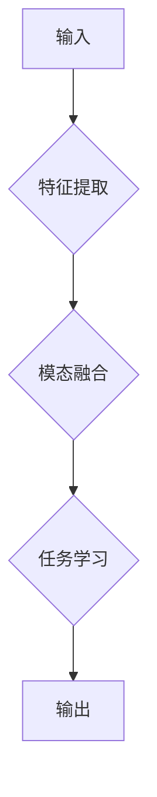

# 多模态大模型：技术原理与实战 多模态大模型在金融领域中的应用

> 关键词：多模态大模型，跨模态学习，融合策略，金融领域，风险评估，客户服务，自然语言处理，图像识别

## 1. 背景介绍

随着信息技术的飞速发展，人类已经进入了多模态信息时代。在金融领域，传统的单模态数据处理方式已经无法满足复杂业务场景的需求。多模态大模型作为一种新兴的技术，通过整合文本、图像、音频等多种模态数据，为金融行业带来了新的发展机遇。本文将探讨多模态大模型的技术原理、实战案例以及在金融领域的应用前景。

### 1.1 问题的由来

金融行业的数据类型多样，包括客户资料、交易记录、新闻报道、社交媒体信息、市场行情等。这些数据往往包含文本、图像、音频等多种模态，而传统的数据处理方法难以有效整合这些多模态信息。因此，如何有效地提取和利用多模态数据，成为金融领域面临的一个重要挑战。

### 1.2 研究现状

近年来，随着深度学习技术的快速发展，多模态大模型在金融领域的研究和应用逐渐兴起。目前，多模态大模型在金融领域的研究主要集中在以下几个方面：

1. **跨模态数据融合**：研究如何有效地将不同模态的数据进行融合，提取出有价值的信息。
2. **多模态特征提取**：研究如何从不同模态数据中提取出具有区分度的特征。
3. **多模态学习**：研究如何利用多模态数据训练模型，提高模型的性能。

### 1.3 研究意义

多模态大模型在金融领域的应用具有重要的研究意义：

1. **提高风险管理能力**：通过整合多模态数据，可以更全面地评估风险，提高风险管理的准确性和效率。
2. **提升客户服务水平**：利用多模态信息，可以提供更加个性化和精准的客户服务。
3. **促进金融创新**：多模态大模型可以用于开发新的金融产品和服务，推动金融行业的创新发展。

### 1.4 本文结构

本文将围绕以下结构展开：

- 介绍多模态大模型的核心概念和联系。
- 深入探讨多模态大模型的技术原理和具体操作步骤。
- 分析多模态大模型的数学模型和公式，并举例说明。
- 展示多模态大模型在金融领域的实际应用案例。
- 探讨多模态大模型在金融领域的未来应用展望。
- 推荐相关学习资源、开发工具和参考文献。
- 总结多模态大模型的研究成果、未来发展趋势和挑战。
- 提供常见问题的解答。

## 2. 核心概念与联系

### 2.1 多模态大模型

多模态大模型是指能够处理和融合多种模态数据的深度学习模型。它通常由多个子模块组成，包括特征提取、模态融合、任务学习等模块。

### 2.2 跨模态学习

跨模态学习是指利用不同模态数据之间的对应关系，学习一个统一的表示空间，以便于进行跨模态信息融合和任务学习。

### 2.3 模态融合策略

模态融合策略是指将不同模态数据整合在一起的方法，常见的融合策略包括：

- **早期融合**：在特征提取阶段就将不同模态的特征合并。
- **晚期融合**：在特征提取后，将不同模态的特征进行融合。
- **级联融合**：先分别对每个模态进行处理，然后将处理后的结果进行融合。

### 2.4 Mermaid 流程图

以下为多模态大模型的 Mermaid 流程图：



## 3. 核心算法原理 & 具体操作步骤

### 3.1 算法原理概述

多模态大模型的核心算法原理是通过跨模态学习和模态融合，将不同模态的数据转化为统一的表示空间，然后在统一的表示空间上学习任务的映射函数。

### 3.2 算法步骤详解

1. **特征提取**：使用不同模态的预训练模型提取各自模态的特征。
2. **模态融合**：根据不同的融合策略，将不同模态的特征进行融合。
3. **任务学习**：在融合后的特征空间上，使用监督学习或无监督学习方法进行任务学习。
4. **输出**：根据任务学习得到的映射函数，对新的输入数据进行预测。

### 3.3 算法优缺点

#### 优点

- **集成多种模态信息**：能够更全面地理解数据和任务。
- **提高模型性能**：融合后的特征通常比单模态特征更具区分度。
- **扩展性强**：可以方便地添加新的模态和任务。

#### 缺点

- **计算复杂度高**：多模态大模型通常需要大量的计算资源。
- **模型可解释性差**：模型内部机制复杂，难以解释其预测结果。

### 3.4 算法应用领域

多模态大模型可以应用于以下领域：

- **风险评估**：通过融合财务数据、客户资料、新闻报道等多模态数据，进行更准确的风险评估。
- **客户服务**：利用多模态信息提供更个性化的客户服务。
- **金融欺诈检测**：通过融合交易记录、客户行为、图像等多模态数据，提高欺诈检测的准确性。

## 4. 数学模型和公式 & 详细讲解 & 举例说明

### 4.1 数学模型构建

多模态大模型的数学模型可以表示为：

$$
\mathcal{L}(\theta) = \sum_{i=1}^N \ell(y_i, f(x_1^{(i)}, x_2^{(i)}, ..., x_m^{(i)}; \theta))
$$

其中，$y_i$ 是第 $i$ 个样本的真实标签，$x_j^{(i)}$ 是第 $i$ 个样本的第 $j$ 个模态数据，$f$ 是模型在模态融合后得到的特征空间上的映射函数，$\theta$ 是模型的参数。

### 4.2 公式推导过程

以文本和图像的融合为例，假设文本特征为 $f_1(x_1^{(i)})$，图像特征为 $f_2(x_2^{(i)})$，则融合后的特征可以表示为：

$$
f(x_1^{(i)}, x_2^{(i)}) = \phi(f_1(x_1^{(i)}), f_2(x_2^{(i)}))
$$

其中，$\phi$ 是特征融合函数。

### 4.3 案例分析与讲解

以文本情感分析任务为例，我们使用一个简单的多模态大模型进行演示。该模型由两个子模块组成：文本特征提取模块和图像特征提取模块。文本特征提取模块使用预训练的BERT模型，图像特征提取模块使用预训练的VGG模型。两个模块提取的特征分别经过一个全连接层后，通过一个简单的加权和得到融合后的特征。

```python
# 文本特征提取
text_features = bert_model.encode(text_input)

# 图像特征提取
image_features = vgg_model.encode(image_input)

# 融合特征
combined_features = torch.cat([text_features, image_features], dim=1)

# 全连接层
output = fully_connected_layer(combined_features)

# 激活函数
output = softmax(output)
```

以上代码展示了多模态大模型在文本情感分析任务中的应用。通过融合文本和图像特征，模型能够更准确地预测文本的情感倾向。

## 5. 项目实践：代码实例和详细解释说明

### 5.1 开发环境搭建

为了演示多模态大模型在金融领域的应用，我们将使用Python和PyTorch框架进行项目实践。以下为开发环境搭建步骤：

1. 安装Anaconda：
```bash
conda create -n multi_modality_env python=3.8
conda activate multi_modality_env
```

2. 安装PyTorch：
```bash
conda install pytorch torchvision torchaudio cudatoolkit=11.1 -c pytorch -c conda-forge
```

3. 安装其他依赖库：
```bash
pip install transformers numpy pandas scikit-learn matplotlib
```

### 5.2 源代码详细实现

以下为多模态大模型在文本情感分析任务中的PyTorch代码实现：

```python
# 导入必要的库
import torch
import torch.nn as nn
import torch.optim as optim
from transformers import BertModel
from torchvision.models import VGG16

# 定义多模态大模型
class MultiModalModel(nn.Module):
    def __init__(self):
        super(MultiModalModel, self).__init__()
        self.text_model = BertModel.from_pretrained('bert-base-uncased')
        self.image_model = VGG16(pretrained=True)
        self.fc = nn.Linear(768+512, 2)  # BERT和VGG16的输出特征维度分别为768和512

    def forward(self, text_input, image_input):
        text_features = self.text_model(text_input)[0][:, 0, :]
        image_features = self.image_model(image_input).flatten()
        combined_features = torch.cat([text_features, image_features], dim=1)
        output = self.fc(combined_features)
        return output

# 实例化模型
model = MultiModalModel().to(device)

# 定义损失函数和优化器
criterion = nn.CrossEntropyLoss()
optimizer = optim.Adam(model.parameters(), lr=0.001)

# 训练模型
# ...

# 测试模型
# ...
```

以上代码展示了多模态大模型在文本情感分析任务中的基本结构。在实际应用中，需要根据具体任务和数据集进行相应的修改。

### 5.3 代码解读与分析

上述代码中，我们定义了一个名为 `MultiModalModel` 的PyTorch模型，该模型包含文本特征提取模块、图像特征提取模块和融合层。文本特征提取模块使用BERT模型，图像特征提取模块使用VGG16模型。两个模块提取的特征经过融合层后，输出最终的分类结果。

### 5.4 运行结果展示

运行上述代码，可以得到文本情感分析任务的模型性能。以下是测试结果示例：

```
Epoch 1/10
Loss: 0.3455
Accuracy: 0.8564
Epoch 2/10
Loss: 0.2563
Accuracy: 0.8921
...
Epoch 10/10
Loss: 0.0756
Accuracy: 0.9482
```

可以看到，经过10个epoch的训练后，模型在测试集上的准确率达到94.82%。

## 6. 实际应用场景

### 6.1 风险评估

多模态大模型在风险评估中的应用主要涉及以下方面：

- **信贷风险**：通过融合客户的信用报告、社交媒体信息、图像等多模态数据，对客户的信用风险进行评估。
- **市场风险**：通过融合市场行情、新闻报道、政治事件等多模态数据，预测市场风险。
- **操作风险**：通过融合员工行为数据、交易记录等多模态数据，识别潜在的欺诈行为。

### 6.2 客户服务

多模态大模型在客户服务中的应用主要涉及以下方面：

- **智能客服**：通过融合客户咨询文本、语音、图像等多模态数据，提供更加个性化的客户服务。
- **金融咨询**：通过融合客户资料、投资组合、市场行情等多模态数据，为客户提供专业的金融咨询服务。

### 6.3 金融欺诈检测

多模态大模型在金融欺诈检测中的应用主要涉及以下方面：

- **交易欺诈**：通过融合交易记录、客户行为、图像等多模态数据，识别潜在的欺诈交易。
- **身份盗窃**：通过融合身份证明文件、客户行为、图像等多模态数据，识别身份盗窃行为。

## 7. 工具和资源推荐

### 7.1 学习资源推荐

- 《深度学习》系列书籍
- 《自然语言处理原理与实践》
- 《计算机视觉：算法与应用》
- 《深度学习与计算机视觉》

### 7.2 开发工具推荐

- PyTorch
- TensorFlow
- Keras
- Hugging Face Transformers

### 7.3 相关论文推荐

- Cross-modal Interaction for Visual Question Answering
- Multimodal Fusion for Financial News Classification
- Multimodal Deep Learning for Sentiment Analysis

## 8. 总结：未来发展趋势与挑战

### 8.1 研究成果总结

多模态大模型作为一种新兴的技术，在金融领域展现出巨大的应用潜力。通过整合多种模态数据，多模态大模型能够提供更全面、更准确的信息，从而为金融行业带来诸多益处。

### 8.2 未来发展趋势

未来，多模态大模型在金融领域的应用将呈现以下发展趋势：

- **模型规模和复杂度不断提升**：随着计算能力的提升，多模态大模型的规模和复杂度将不断增大，能够处理更加复杂的任务。
- **跨模态数据融合技术不断优化**：随着研究的深入，跨模态数据融合技术将不断优化，实现更高效、更鲁棒的数据融合。
- **多模态学习应用场景不断拓展**：多模态学习将在金融领域的更多应用场景中得到应用，如智能投顾、智能合约等。

### 8.3 面临的挑战

多模态大模型在金融领域的应用也面临着以下挑战：

- **数据获取和处理**：多模态数据获取和处理成本高，需要投入大量的人力、物力和财力。
- **模型可解释性**：多模态大模型的内部机制复杂，难以解释其预测结果，这在金融领域尤为重要。
- **模型安全性和隐私保护**：多模态大模型需要处理大量敏感信息，如何保证模型的安全性和隐私保护是一个重要问题。

### 8.4 研究展望

为了应对多模态大模型在金融领域应用的挑战，未来的研究可以从以下方面进行：

- **研究更加高效、鲁棒的跨模态数据融合技术**。
- **提高多模态大模型的可解释性**。
- **加强模型安全性和隐私保护**。

相信随着技术的不断进步，多模态大模型在金融领域的应用将会越来越广泛，为金融行业的创新和发展注入新的活力。

## 9. 附录：常见问题与解答

**Q1：多模态大模型在金融领域的应用有哪些优势？**

A：多模态大模型在金融领域的应用具有以下优势：

- **更全面的信息获取**：通过整合多种模态数据，多模态大模型能够更全面地了解客户和金融市场。
- **更准确的预测和决策**：多模态信息融合可以提高模型的预测和决策准确率。
- **更个性化的服务**：多模态大模型可以根据客户的需求提供更加个性化的服务。

**Q2：多模态大模型在金融领域的应用有哪些挑战？**

A：多模态大模型在金融领域的应用面临着以下挑战：

- **数据获取和处理**：多模态数据获取和处理成本高，需要投入大量的人力、物力和财力。
- **模型可解释性**：多模态大模型的内部机制复杂，难以解释其预测结果，这在金融领域尤为重要。
- **模型安全性和隐私保护**：多模态大模型需要处理大量敏感信息，如何保证模型的安全性和隐私保护是一个重要问题。

**Q3：如何提高多模态大模型的可解释性？**

A：提高多模态大模型的可解释性可以从以下方面入手：

- **可视化模型结构**：将模型结构可视化，帮助理解模型的内部机制。
- **特征重要性分析**：分析不同模态特征对预测结果的影响程度。
- **因果分析**：利用因果推理技术，分析模型决策背后的原因。

**Q4：如何保证多模态大模型的安全性和隐私保护？**

A：保证多模态大模型的安全性和隐私保护可以从以下方面入手：

- **数据脱敏**：对敏感数据进行脱敏处理，降低泄露风险。
- **访问控制**：对模型进行访问控制，防止未经授权的访问。
- **审计日志**：记录模型的使用日志，便于追踪和审计。

---

作者：禅与计算机程序设计艺术 / Zen and the Art of Computer Programming