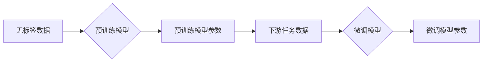

# 大模型的技术创新与市场需求

> 关键词：大模型，人工智能，技术创新，市场需求，预训练，微调，NLP，计算机视觉，自然语言理解

## 1. 背景介绍

近年来，随着计算能力的提升和海量数据的积累，大模型（Large Models）在人工智能领域取得了突破性的进展。从最初的深度学习模型到如今的大规模语言模型和视觉模型，大模型已经成为推动AI技术发展的重要引擎。本文将探讨大模型的技术创新及其在市场需求方面的表现。

### 1.1 大模型的发展历程

大模型的发展可以分为以下几个阶段：

- **早期：基于统计的模型**：如隐马尔可夫模型（HMM）、条件随机场（CRF）等，这些模型在特定任务上表现出色，但泛化能力有限。
- **深度学习时代**：卷积神经网络（CNN）和循环神经网络（RNN）的出现，使得模型能够学习更复杂的特征，并在图像和语音识别等领域取得了突破。
- **预训练时代**：大规模预训练模型如Word2Vec、BERT等，通过在无标签数据上预训练，学习到丰富的语言和视觉知识，为下游任务提供了强大的基础。
- **大模型时代**：近年来，随着计算资源的提升，研究人员开始尝试训练更大规模的模型，如GPT-3、LaMDA等，这些模型在多个领域取得了令人瞩目的成果。

### 1.2 大模型的市场需求

随着大模型在各个领域的应用不断扩展，其市场需求也在不断增长。以下是大模型在几个主要领域的市场需求：

- **自然语言处理（NLP）**：大模型在机器翻译、对话系统、文本生成等领域具有广泛的应用，为企业和个人提供了强大的自然语言理解和处理能力。
- **计算机视觉**：大模型在图像识别、目标检测、图像生成等领域取得了显著成果，为自动驾驶、医疗影像分析、视频监控等应用提供了技术支持。
- **语音识别**：大模型在语音识别、语音合成、语音搜索等领域取得了突破，为智能助手、智能客服、语音控制等应用提供了技术基础。
- **推荐系统**：大模型在推荐系统中的应用，使得推荐结果更加精准和个性化，为电商平台、社交平台、内容平台等提供了技术支持。

## 2. 核心概念与联系

大模型的技术创新主要涉及以下几个方面：

### 2.1 预训练

预训练是构建大模型的基础，其核心思想是在大规模无标签数据上预先训练模型，使其学习到丰富的语言和视觉知识。



### 2.2 微调

微调是在预训练模型的基础上，使用下游任务的有标签数据进行进一步训练，以适应特定任务的需求。

### 2.3 模型压缩

为了将大模型部署到资源受限的环境中，模型压缩技术应运而生。模型压缩包括模型裁剪、量化、知识蒸馏等方法。

### 2.4 模型并行

模型并行是提高大模型推理速度的重要手段，通过将模型分解到多个计算单元上并行计算，可以显著提升模型推理速度。

## 3. 核心算法原理 & 具体操作步骤

### 3.1 算法原理概述

大模型的核心算法主要包括预训练、微调、模型压缩和模型并行等。

### 3.2 算法步骤详解

- **预训练**：在无标签数据上预训练模型，学习到丰富的语言和视觉知识。
- **微调**：在预训练模型的基础上，使用下游任务的有标签数据进行进一步训练。
- **模型压缩**：通过模型裁剪、量化、知识蒸馏等方法减小模型尺寸和参数量。
- **模型并行**：将模型分解到多个计算单元上并行计算。

### 3.3 算法优缺点

- **预训练**：优点是模型泛化能力强，缺点是训练时间较长。
- **微调**：优点是能够适应特定任务的需求，缺点是可能引入过拟合。
- **模型压缩**：优点是减小模型尺寸和参数量，缺点是可能影响模型性能。
- **模型并行**：优点是提高模型推理速度，缺点是硬件要求较高。

### 3.4 算法应用领域

大模型在多个领域都有广泛应用，如自然语言处理、计算机视觉、语音识别、推荐系统等。

## 4. 数学模型和公式 & 详细讲解 & 举例说明

### 4.1 数学模型构建

大模型的数学模型主要基于深度学习理论，包括损失函数、优化算法等。

### 4.2 公式推导过程

以下以交叉熵损失函数为例，进行公式推导：

$$
L(\theta) = -\sum_{i=1}^N [y_i \log(\hat{y}_i) + (1-y_i) \log(1-\hat{y}_i)]
$$

其中，$y_i$ 是真实标签，$\hat{y}_i$ 是模型预测结果。

### 4.3 案例分析与讲解

以下以BERT模型为例，讲解其数学模型和公式：

BERT模型基于Transformer架构，其输入是一个词向量序列，输出是一个标签序列。模型的损失函数是交叉熵损失函数。

## 5. 项目实践：代码实例和详细解释说明

### 5.1 开发环境搭建

为了进行大模型开发，需要搭建以下开发环境：

- 编译器：如GCC、Clang等
- 编程语言：如Python、C++等
- 深度学习框架：如TensorFlow、PyTorch等
- 依赖库：如NumPy、SciPy等

### 5.2 源代码详细实现

以下是一个简单的BERT模型微调示例代码：

```python
import torch
from transformers import BertForSequenceClassification, BertTokenizer

# 加载预训练模型和分词器
model = BertForSequenceClassification.from_pretrained('bert-base-uncased')
tokenizer = BertTokenizer.from_pretrained('bert-base-uncased')

# 加载训练数据
train_texts, train_labels = load_data('train.txt')
dev_texts, dev_labels = load_data('dev.txt')

# 编码数据
train_encodings = tokenizer(train_texts, truncation=True, padding=True)
dev_encodings = tokenizer(dev_texts, truncation=True, padding=True)

# 训练模型
model.train()
for epoch in range(epochs):
    for batch in train_encodings:
        inputs = {k: v.to(device) for k, v in batch.items()}
        labels = torch.tensor(train_labels).to(device)
        outputs = model(**inputs, labels=labels)
        loss = outputs.loss
        loss.backward()
        optimizer.step()
        optimizer.zero_grad()
```

### 5.3 代码解读与分析

以上代码展示了使用PyTorch和Transformers库进行BERT模型微调的基本步骤。首先加载预训练模型和分词器，然后加载训练数据和验证数据，对数据进行编码，最后进行模型训练。

### 5.4 运行结果展示

运行以上代码，模型在训练集和验证集上的性能会逐渐提升。

## 6. 实际应用场景

### 6.1 自然语言处理

大模型在自然语言处理领域有广泛的应用，如：

- 机器翻译
- 对话系统
- 文本分类
- 情感分析

### 6.2 计算机视觉

大模型在计算机视觉领域也有广泛的应用，如：

- 图像识别
- 目标检测
- 图像生成

### 6.3 语音识别

大模型在语音识别领域也有广泛的应用，如：

- 语音识别
- 语音合成

## 7. 工具和资源推荐

### 7.1 学习资源推荐

- 《深度学习》
- 《神经网络与深度学习》
- 《深度学习快速入门》

### 7.2 开发工具推荐

- TensorFlow
- PyTorch
- Keras

### 7.3 相关论文推荐

- "Attention is All You Need"
- "BERT: Pre-training of Deep Bidirectional Transformers for Language Understanding"
- "Generative Adversarial Text-to-Image Synthesis"

## 8. 总结：未来发展趋势与挑战

### 8.1 研究成果总结

大模型在各个领域都取得了突破性的进展，为人工智能技术的发展和应用带来了新的机遇。

### 8.2 未来发展趋势

- 模型规模将进一步扩大
- 模型将更加高效和可解释
- 模型将更加安全和可靠

### 8.3 面临的挑战

- 计算资源需求巨大
- 模型可解释性不足
- 模型偏见和歧视问题

### 8.4 研究展望

未来，大模型将在人工智能领域发挥更加重要的作用，推动人工智能技术的发展和应用。

## 9. 附录：常见问题与解答

**Q1：什么是大模型？**

A1：大模型是指规模巨大的机器学习模型，如深度学习模型、大规模语言模型等。

**Q2：大模型有哪些优点？**

A2：大模型具有以下优点：

- 泛化能力强
- 学习到的知识丰富
- 在多个领域都有广泛应用

**Q3：大模型有哪些缺点？**

A3：大模型具有以下缺点：

- 计算资源需求巨大
- 模型可解释性不足
- 模型偏见和歧视问题

**Q4：如何解决大模型的可解释性问题？**

A4：解决大模型可解释性问题可以从以下方面入手：

- 使用可解释性模型
- 优化模型结构
- 提高数据质量

**Q5：大模型如何应用于实际场景？**

A5：大模型可以应用于以下实际场景：

- 自然语言处理
- 计算机视觉
- 语音识别
- 推荐系统

---

作者：禅与计算机程序设计艺术 / Zen and the Art of Computer Programming