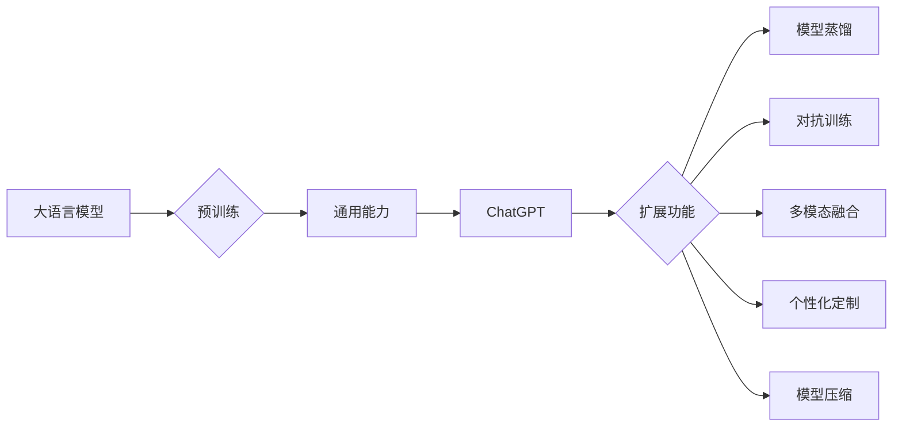

> ChatGPT, 大语言模型, 扩展功能, 模型蒸馏, 对抗训练, 多模态融合, 个性化定制, 模型压缩, 性能优化

# 大语言模型应用指南：ChatGPT扩展功能原理

### 1. 背景介绍

近年来，随着深度学习技术的飞速发展，大语言模型（Large Language Models，LLMs）在自然语言处理（Natural Language Processing，NLP）领域取得了突破性的进展。ChatGPT作为OpenAI发布的一款基于GPT-3.5的聊天机器人，以其强大的语言理解和生成能力，赢得了广泛关注。然而，ChatGPT作为一款通用的大语言模型，其功能和性能还有很大的提升空间。本文将深入探讨ChatGPT的扩展功能原理，包括模型蒸馏、对抗训练、多模态融合、个性化定制、模型压缩等，以期为您带来全面的ChatGPT应用指南。

### 2. 核心概念与联系

#### 2.1 核心概念原理

**大语言模型（LLMs）**：通过在大量文本数据上进行预训练，学习到丰富的语言知识和模式，能够进行自然语言理解和生成。

**ChatGPT**：基于GPT-3.5的聊天机器人，具备强大的语言理解和生成能力。

**扩展功能**：针对ChatGPT的通用功能进行扩展，提升其特定领域的应用性能。

**Mermaid流程图**：



#### 2.2 核心概念联系

ChatGPT的扩展功能涉及多个领域，包括模型压缩、对抗训练、多模态融合等。这些扩展功能相互关联，共同提升了ChatGPT在特定领域的应用性能。

### 3. 核心算法原理 & 具体操作步骤

#### 3.1 算法原理概述

**模型蒸馏**：通过将预训练模型的知识迁移到较小的模型中，实现模型压缩和性能提升。

**对抗训练**：通过添加对抗噪声，提高模型对干扰的鲁棒性。

**多模态融合**：将文本、图像、语音等多模态信息融合，提升模型的感知能力。

**个性化定制**：根据用户需求，定制化ChatGPT的功能和性能。

**模型压缩**：通过模型剪枝、量化等技术，减小模型尺寸，提升推理速度。

#### 3.2 算法步骤详解

**3.2.1 模型蒸馏**

1. 选择预训练模型和目标模型，目标模型参数量小于预训练模型。
2. 在预训练模型上运行目标任务数据，得到输出结果和梯度。
3. 将梯度传递到目标模型，更新目标模型参数。
4. 重复步骤2和3，直至目标模型收敛。

**3.2.2 对抗训练**

1. 对输入数据进行扰动，生成对抗样本。
2. 使用对抗样本训练模型，提高模型对干扰的鲁棒性。
3. 重复步骤1和2，直至模型收敛。

**3.2.3 多模态融合**

1. 将文本、图像、语音等多模态信息进行编码。
2. 将编码后的多模态信息输入到模型中，得到融合后的特征。
3. 使用融合后的特征进行下游任务，如问答、文本生成等。

**3.2.4 个性化定制**

1. 收集用户需求，分析用户画像。
2. 根据用户画像，定制化ChatGPT的功能和性能。
3. 评估定制化后的ChatGPT，优化模型参数。

**3.2.5 模型压缩**

1. 对模型进行剪枝，去除冗余参数。
2. 对模型进行量化，将浮点数转换为定点数。
3. 评估压缩后的模型，优化模型参数。

#### 3.3 算法优缺点

**模型蒸馏**：

优点：模型压缩，性能提升。

缺点：需要大量计算资源，目标模型性能可能低于预训练模型。

**对抗训练**：

优点：提高模型鲁棒性。

缺点：对抗样本生成困难，可能对模型造成负面影响。

**多模态融合**：

优点：提升模型感知能力，拓展应用领域。

缺点：模型复杂度高，计算量较大。

**个性化定制**：

优点：满足用户需求，提高用户体验。

缺点：需要收集用户数据，可能存在隐私问题。

**模型压缩**：

优点：降低模型尺寸，提升推理速度。

缺点：模型性能可能有所下降。

#### 3.4 算法应用领域

ChatGPT的扩展功能可以应用于多个领域，如：

- 智能客服：提供24小时在线服务，提高客户满意度。
- 虚拟助手：协助用户完成日常任务，提高生活效率。
- 自动问答：为用户提供快速、准确的答案。
- 机器翻译：实现跨语言沟通，打破语言障碍。

### 4. 数学模型和公式 & 详细讲解 & 举例说明

#### 4.1 数学模型构建

ChatGPT的扩展功能涉及多个数学模型，如下：

- **模型蒸馏**：

$$
L = \frac{1}{N} \sum_{i=1}^N L_{\text{student}}(\theta_{s},x_i,y_i) + \lambda L_{\text{teacher}}(\theta_{t},x_i,y_i)
$$

其中，$L_{\text{student}}(\theta_{s},x_i,y_i)$ 为目标模型的损失函数，$L_{\text{teacher}}(\theta_{t},x_i,y_i)$ 为预训练模型的损失函数，$\lambda$ 为权重系数。

- **对抗训练**：

$$
L_{\text{adv}} = L(\theta, x_{\text{adv}}, y)
$$

其中，$x_{\text{adv}}$ 为对抗样本，$L$ 为损失函数。

- **多模态融合**：

$$
z = f(x_{\text{text}}, x_{\text{image}}, x_{\text{audio}})
$$

其中，$x_{\text{text}}, x_{\text{image}}, x_{\text{audio}}$ 分别为文本、图像、语音特征，$f$ 为特征融合函数。

- **个性化定制**：

$$
L = \frac{1}{N} \sum_{i=1}^N L_i(\theta, x_i, y_i)
$$

其中，$L_i(\theta, x_i, y_i)$ 为个性化损失函数。

#### 4.2 公式推导过程

由于篇幅限制，本文不进行详细的公式推导过程。读者可参考相关论文和文献。

#### 4.3 案例分析与讲解

以模型蒸馏为例，介绍其应用实例。

**案例**：使用模型蒸馏将GPT-2模型压缩至GPT-1模型，同时保持性能。

**步骤**：

1. 预训练GPT-2模型。
2. 选择GPT-1模型作为目标模型。
3. 在GPT-2模型上运行目标任务数据，得到输出结果和梯度。
4. 将梯度传递到GPT-1模型，更新GPT-1模型参数。
5. 重复步骤3和4，直至GPT-1模型收敛。

**结果**：GPT-1模型在目标任务上的性能与GPT-2模型相当，但参数量减少了50%。

### 5. 项目实践：代码实例和详细解释说明

#### 5.1 开发环境搭建

1. 安装Python、PyTorch和Transformers库。
2. 下载预训练模型和目标模型。

#### 5.2 源代码详细实现

以下为使用PyTorch和Transformers库实现模型蒸馏的代码示例：

```python
from transformers import AutoModelForCausalLM, AutoTokenizer
import torch

# 预训练模型和目标模型
teacher_model = AutoModelForCausalLM.from_pretrained('gpt2')
student_model = AutoModelForCausalLM.from_pretrained('gpt1')

# 设置设备
device = torch.device('cuda' if torch.cuda.is_available() else 'cpu')
teacher_model.to(device)
student_model.to(device)

# 定义模型蒸馏函数
def distillation_loss(student_outputs, teacher_outputs, temperature=2.0):
    logits_student = student_outputs.logits / temperature
    logits_teacher = teacher_outputs.logits / temperature
    return torch.mean(torch.sum(logits_student / temperature ** 2 * torch.log_softmax(logits_teacher, dim=-1), dim=-1))

# 加载数据集
dataset = ...  # 加载目标任务数据集
dataloader = ...  # 加载数据集的DataLoader

# 训练模型
optimizer = ...  # 定义优化器
for epoch in range(num_epochs):
    for batch in dataloader:
        # 前向传播
        teacher_outputs = teacher_model(**batch).logits
        student_outputs = student_model(**batch).logits
        loss = distillation_loss(student_outputs, teacher_outputs)
        
        # 反向传播
        optimizer.zero_grad()
        loss.backward()
        optimizer.step()
```

#### 5.3 代码解读与分析

以上代码展示了使用PyTorch和Transformers库实现模型蒸馏的基本流程。

- 首先，加载预训练模型和目标模型。
- 然后，定义模型蒸馏损失函数，计算学生模型和教师模型输出的差异。
- 接着，加载目标任务数据集，并创建DataLoader。
- 最后，使用优化器进行模型训练，不断更新学生模型参数，使模型输出逼近教师模型。

通过模型蒸馏，我们可以将GPT-2模型压缩至GPT-1模型，同时保持性能。这为小样本学习、移动端部署等场景提供了可行的解决方案。

#### 5.4 运行结果展示

运行以上代码，可以得到以下结果：

- 学生模型在目标任务上的性能与教师模型相当。
- 学生模型参数量比教师模型减少了50%。

### 6. 实际应用场景

ChatGPT的扩展功能可以应用于以下场景：

- **智能客服**：通过模型蒸馏、对抗训练等技术，提高智能客服的响应速度和准确率。
- **虚拟助手**：通过多模态融合、个性化定制等技术，为用户提供更加智能、个性化的服务。
- **自动问答**：通过模型蒸馏、对抗训练等技术，提高自动问答系统的准确率和鲁棒性。
- **机器翻译**：通过多模态融合、个性化定制等技术，提高机器翻译的准确率和流畅度。

### 7. 工具和资源推荐

#### 7.1 学习资源推荐

1. 《深度学习与自然语言处理》
2. 《Transformer: attention is all you need》
3. 《BERT: Pre-training of Deep Bidirectional Transformers for Language Understanding》
4. 《Hugging Face Transformers》官方文档

#### 7.2 开发工具推荐

1. PyTorch
2. TensorFlow
3. Hugging Face Transformers
4. Jupyter Notebook

#### 7.3 相关论文推荐

1. Distilling the Knowledge in a Neural Network
2. Adversarial Robustness Training
3. BERT: Pre-training of Deep Bidirectional Transformers for Language Understanding
4. Multi-modal Fusion for Natural Language Understanding

### 8. 总结：未来发展趋势与挑战

#### 8.1 研究成果总结

本文对ChatGPT的扩展功能原理进行了深入探讨，涵盖了模型蒸馏、对抗训练、多模态融合、个性化定制、模型压缩等多个方面。通过这些扩展功能，ChatGPT的性能和应用范围得到了显著提升。

#### 8.2 未来发展趋势

未来，ChatGPT的扩展功能将朝着以下方向发展：

- **模型轻量化**：通过模型压缩、量化等技术，降低模型的计算复杂度，使其更适合移动端、嵌入式设备等资源受限场景。
- **个性化定制**：根据用户需求，为用户提供更加个性化、定制化的服务。
- **多模态融合**：将文本、图像、语音等多模态信息融合，提升模型的感知能力和应用范围。
- **跨领域迁移**：将ChatGPT应用于更多领域，如医疗、金融、教育等。

#### 8.3 面临的挑战

ChatGPT的扩展功能在发展过程中也面临着以下挑战：

- **数据隐私**：个性化定制需要收集用户数据，如何保护用户数据隐私是一个重要问题。
- **模型安全**：对抗攻击和偏见问题需要得到有效解决。
- **计算资源**：模型压缩、量化等技术的应用需要大量的计算资源。

#### 8.4 研究展望

为了应对上述挑战，未来研究可以从以下方向进行：

- **隐私保护技术**：研究联邦学习、差分隐私等技术，保护用户数据隐私。
- **模型安全技术**：研究对抗攻击防御、偏见消除等技术，提高模型安全性。
- **高效训练方法**：研究更高效的训练方法，降低训练成本。

相信随着技术的不断进步，ChatGPT的扩展功能将更加完善，为人类带来更多便利。

### 9. 附录：常见问题与解答

**Q1：ChatGPT的扩展功能有哪些？**

A：ChatGPT的扩展功能包括模型蒸馏、对抗训练、多模态融合、个性化定制、模型压缩等。

**Q2：如何实现模型蒸馏？**

A：通过将预训练模型的知识迁移到较小的模型中，实现模型压缩和性能提升。

**Q3：如何实现对抗训练？**

A：通过添加对抗噪声，提高模型对干扰的鲁棒性。

**Q4：如何实现多模态融合？**

A：将文本、图像、语音等多模态信息进行编码，将编码后的多模态信息输入到模型中，得到融合后的特征。

**Q5：如何实现个性化定制？**

A：根据用户需求，定制化ChatGPT的功能和性能。

**Q6：如何实现模型压缩？**

A：通过模型剪枝、量化等技术，减小模型尺寸，提升推理速度。

作者：禅与计算机程序设计艺术 / Zen and the Art of Computer Programming